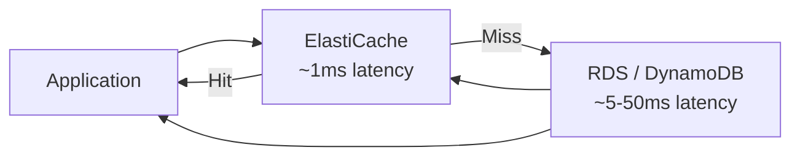
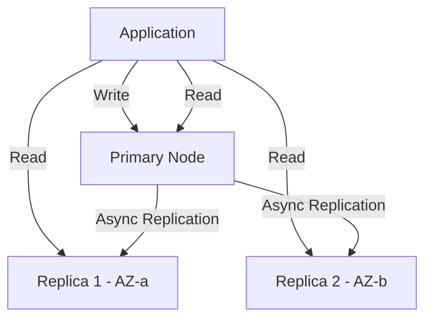
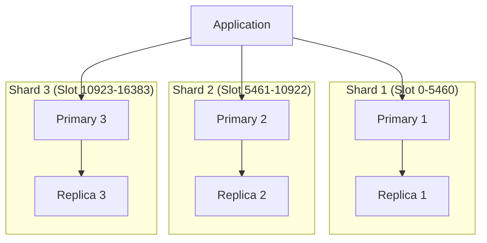
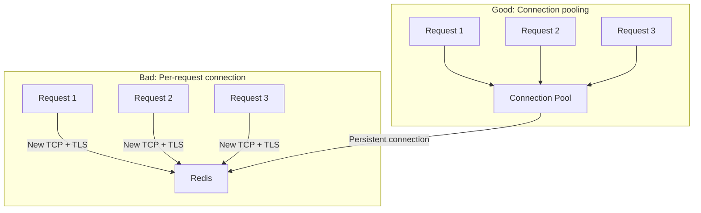

# Amazon ElastiCache (Managed In-Memory Cache)

## Overview

Amazon ElastiCache is a fully managed in-memory caching service that supports Redis and Memcached. It provides sub-millisecond latency for read-heavy and compute-intensive workloads by keeping frequently accessed data in memory, reducing database load and improving application response times.

## Why ElastiCache?

| Without Cache | With ElastiCache |
|---------------|------------------|
| Every request hits database | 80-95% cache hit ratio typical |
| 5-50ms database reads | < 1ms cache reads |
| Database scales for reads | Database handles writes only |
| Higher infrastructure cost | Lower total cost at scale |

## Engine Comparison: Redis vs Memcached

| Feature | Redis | Memcached |
|---------|-------|----------|
| **Data structures** | Strings, lists, sets, sorted sets, hashes, streams, HyperLogLog | Strings only |
| **Persistence** | RDB snapshots + AOF | None (pure cache) |
| **Replication** | Yes (primary-replica) | No |
| **Multi-AZ** | Yes | No |
| **Clustering** | Yes (sharding) | No (client-side sharding) |
| **Pub/Sub** | Yes | No |
| **Lua scripting** | Yes | No |
| **Transactions** | Yes (MULTI/EXEC) | CAS (compare-and-swap) |
| **Max node size** | Up to 638 GB (r7g.16xlarge) | Up to 487 GB (r7g.12xlarge) |
| **Thread model** | Single-threaded (Redis 6: I/O threads) | Multi-threaded |
| **Eviction policy** | 8+ configurable policies | LRU only |
| **Best for** | General purpose, complex data types, durability | Simple caching, highest raw throughput |

## Redis Architecture

### Cluster Mode Disabled (Primary-Replica)

- **1 primary + up to 5 read replicas**
- Asynchronous replication ( eventual consistency for reads )
- Automatic failover to a replica if primary fails
- Suitable for workloads up to the single-node memory limit

### Cluster Mode Enabled (Sharding)

- **16,384 hash slots** distributed across shards
- Up to 500 nodes, up to 250 shards
- Each shard has 1 primary + up to 5 replicas
- Key hashing: `CRC16(key) % 16384` determines slot
- Supports `MGET`/`MSET` only if keys map to the same slot (use hash tags: `{user:123}:profile` and `{user:123}:prefs`)

### Global Datastore

- Cross-region replication (active-passive)
- Up to 1-second replication lag
- Planned or unplanned failover between regions
- Disaster recovery use case

## Node Types

| Family | Use Case | Example Node | Memory |
|--------|----------|-------------|--------|
| **M7g** (Graviton) | Best price-performance | cache.m7g.large | 5.14 GB |
| **R7g** (Memory-optimized Graviton) | Memory-intensive | cache.r7g.xlarge | 26.21 GB |
| **T4g** (Burstable Graviton) | Dev/test, low-traffic | cache.t4g.micro | 0.56 GB |
| **R6gd** (Local SSD) | Large datasets, lower cost | cache.r6gd.xlarge | 38.96 GB |

## Redis Eviction Policies

| Policy | Behavior | Use Case |
|--------|----------|----------|
| `noeviction` | Return errors on writes when full | Cache as primary store |
| `allkeys-lru` | Evict least recently used keys | General caching |
| `allkeys-lfu` | Evict least frequently used keys | Stable hot data set |
| `allkeys-random` | Evict random keys | Simple workloads |
| `volatile-lru` | LRU among keys with TTL | Mixed cache + session store |
| `volatile-lfu` | LFU among keys with TTL | Same as above, frequency-based |
| `volatile-ttl` | Evict shortest TTL first | Session data with expiry |
| `volatile-random` | Random among TTL keys | Rarely used |

## Security

| Feature | Description |
|---------|-------------|
| **Encryption in transit** | TLS 1.2/1.3 for all connections |
| **Encryption at rest** | AES-256 (default on newer Redis versions) |
| **Authentication** | Redis AUTH password, IAM authentication (Redis 7+)
| **VPC** | Runs within your VPC, security groups control access |
| **Subnet groups** | Deploy across multiple AZs |

## Performance Tuning

### Connection Management

### Key Design Patterns

| Pattern | Description | Example |
|---------|-------------|---------|
| **Pipeline** | Batch multiple commands, reduce RTT | `Pipeline.set(), set(), get()` |
| **Hash tags** | Co-locate related keys on same shard | `{session:123}:data`, `{session:123}:meta` |
| **Compression** | Compress large values (Snappy, LZ4) | Store compressed JSON blobs |
| **TTL strategy** | Set appropriate TTLs to prevent memory bloat | Session: 30min, Config: 1h, Analytics: 5min |

### Key Metrics

| Metric | Target | Action if Degraded |
|--------|--------|---------------------|
| Cache hit rate | > 90% | Review TTLs, increase cache size |
| Evictions/sec | Near zero | Increase node size or shard count |
| `GetLatency` (p99) | < 1ms | Check network, enable cluster mode |
| `CPUUtilization` | < 70% | Scale up or add shards |
| `SwapUsage` | 0 | Disable swap, increase node size |
| `ReplicationLag` | < 1 second | Check replica health |
| `CurrConnections` | < 80% of max | Use connection pooling |

## Comparison: ElastiCache vs Alternatives

| Feature | ElastiCache Redis | ElastiCache Memcached | Self-hosted Redis | DynamoDB DAX |
|---------|-------------------|----------------------|-------------------|-------------|
| **Management** | Fully managed | Fully managed | Self-managed | Fully managed |
| **Data structures** | Rich | Strings only | Rich | Key-value only |
| **Replication** | Yes | No | Yes | Multi-AZ built-in |
| **Scaling** | Vertical + Cluster | Vertical | Vertical + Cluster | Automatic |
| **Latency** | Sub-ms | Sub-ms | Sub-ms | Single-digit ms |
| **Persistence** | Yes | No | Yes | No |
| **Max memory** | ~638 GB/node | ~487 GB/node | Hardware-dependent | 100 GB/node |

## Pricing

| Component | Cost |
|-----------|------|
| Node hours | Varies by node type ($0.016/hr for cache.t4g.micro to $3.68/hr for cache.r7g.16xlarge) |
| Data transfer | Free within AZ, $0.01/GB cross-AZ, $0.02/GB internet |
| Backup storage | $0.095/GB/month |
| Snapshots | $0.095/GB/month |

## Common Pitfalls

1. **Hot keys**: A single popular key can overwhelm a shard. Use local caching or key splitting.
2. **Large values**: Values > 10 KB increase latency and reduce throughput. Compress large payloads.
3. **No connection pooling**: Creating a new connection per request kills performance.
4. **Ignoring TTLs**: Without TTLs, memory fills up, forcing evictions of useful data.
5. **Synchronous replication waiting**: Redis replication is async — reads from replicas may be stale.
6. **Underestimating memory**: Plan for 2-3x your working set to account for overhead and growth.

## Interview Questions

1. **How would you design a caching layer for a social media feed?** Use ElastiCache Redis in cluster mode. Cache user feeds as sorted sets (ZSET) with timestamps as scores. Use hash tags `{user:123}:feed` for co-location. Set TTL of 5-15 minutes. Pipeline reads for multiple users.

2. **What happens during a failover?** ElastiCache detects primary failure via health checks, promotes a replica to primary, and updates the DNS endpoint. There's a brief write unavailability (typically 10-30 seconds) during switchover.

3. **When would you choose Memcached over Redis?** Memcached when you need pure caching (no persistence), multi-threaded performance for simple key-value, or client-side sharding across nodes. Redis for virtually everything else.

4. **How do you handle cache invalidation?** Time-based (TTL), event-based (publish invalidation on write), or write-through (update cache on every write). The safest approach is a combination: write-through for critical data, TTL for everything.

5. **What's the difference between cluster mode enabled and disabled?** Disabled: single primary with replicas, single-shard. Enabled: up to 500 nodes sharded across 16,384 slots. Enable when you need more memory or write throughput than a single node provides.

## Key Takeaways

- ElastiCache provides managed Redis (feature-rich) and Memcached (simple, multi-threaded)
- Redis cluster mode shards data across 16,384 hash slots for horizontal scaling
- Choose eviction policy based on whether cache is supplemental or primary data store
- Connection pooling and pipelining are essential for production performance
- Monitor cache hit rate, evictions, and replication lag as key SLOs
- Use Global Datastore for cross-region disaster recovery
- Security: always enable encryption in transit, use AUTH or IAM authentication

## Cross-References

- [Redis Deep Dive](../../redis/README.md) — Redis internals and data structures
- [Cache Patterns](../../sre/cache-patterns.md) — Application-level caching strategies
- [Amazon RDS](./rds.md) — Database backing for cache misses
- [Amazon S3](./s3.md) — Backup and snapshot storage
- [DynamoDB](../../dbms/nosql/key-value.md) — Complementary key-value store
- [Advanced Caching](../../dbms/caching/advanced-caching.md) — Caching theory and patterns
