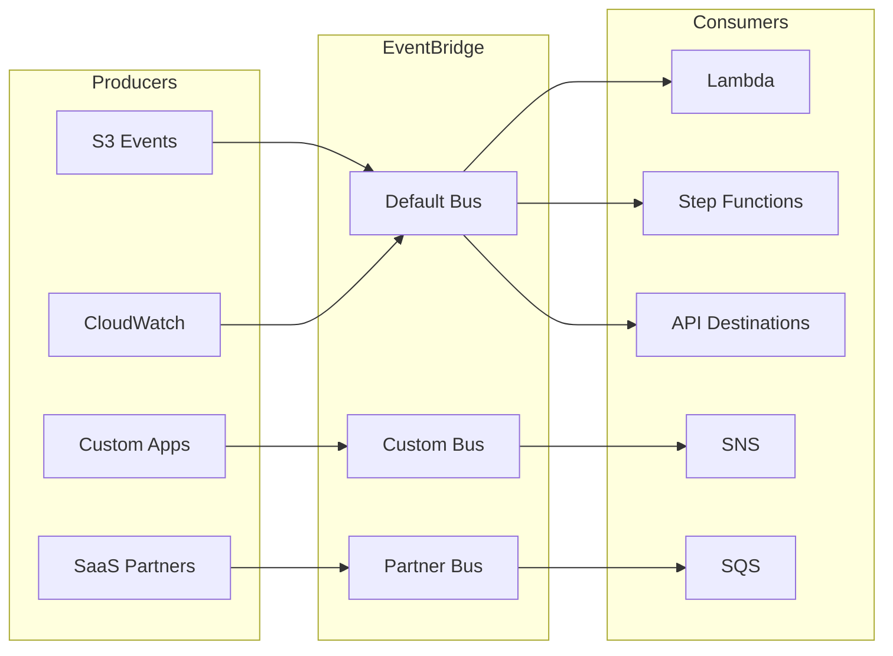
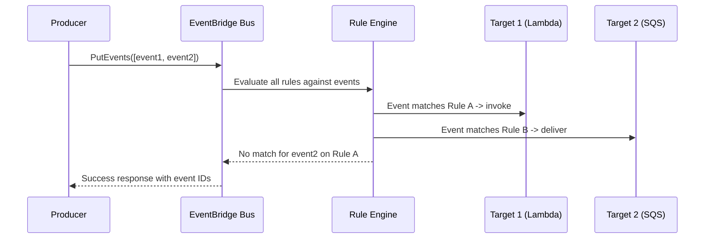
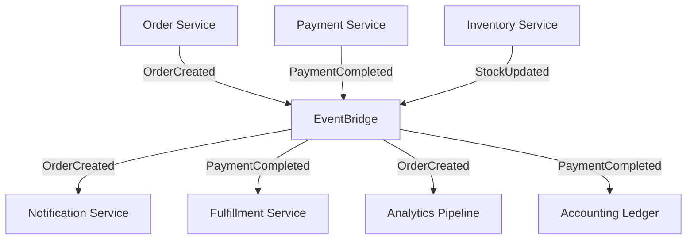

# Amazon EventBridge (Serverless Event Bus)

## Overview

Amazon EventBridge is a serverless event bus service that allows you to connect application components using events. It provides a way to route events between AWS services, your own applications, and third-party SaaS applications. Think of it as the nervous system of a cloud-native architecture — decoupling producers from consumers through an event-driven backbone.

## Why EventBridge?

Traditional architectures tightly couple services via direct API calls. EventBridge introduces a **publish-subscribe** model where event producers know nothing about consumers:



## Core Concepts

### Events

An event is a JSON object representing a change in state. Every event has a common structure:

```json
{
  "version": "0",
  "id": "a1b2c3d4-5678-90ab-cdef-111111111111",
  "detail-type": "Order Placed",
  "source": "com.mycompany.orders",
  "account": "123456789012",
  "time": "2024-01-15T10:30:00Z",
  "region": "us-east-1",
  "resources": ["arn:aws:orders:us-east-1:123456789012:order/ord-123"],
  "detail": {
    "orderId": "ord-123",
    "customerId": "cust-456",
    "amount": 99.99,
    "items": ["widget-a", "widget-b"]
  }
}
```

| Field | Description |
|-------|-------------|
| `source` | Originating service (e.g., `aws.ec2`, `com.mycompany.app`) |
| `detail-type` | Category of the event (e.g., `EC2 Instance State-change Notification`) |
| `detail` | Payload specific to the event type |
| `id` | Unique identifier for the event |
| `time` | Timestamp of when the event was generated |

### Event Buses

EventBridge supports three types of buses:

| Bus Type | Use Case | Access Control |
|----------|----------|----------------|
| **Default Bus** | AWS service events (S3, EC2, CloudWatch, etc.) | Account-scoped, IAM policies |
| **Custom Bus** | Your own application events | Per-bus IAM policies |
| **Partner Bus** | Third-party SaaS (Datadog, Zendesk, Auth0) | Authorized partner events only |

### Rules

Rules match incoming events and route them to targets. A rule has:
- **Event pattern**: JSON filter to match events (content-based filtering)
- **Targets**: One or more destinations (up to 5 per rule, 100+ with `PutTargets` batching)

```json
{
  "source": ["com.mycompany.orders"],
  "detail-type": ["Order Placed"],
  "detail": {
    "amount": [{"numeric": [">", 100]}]
  }
}
```

## Event Processing Flow



## Key Features

### Content-Based Filtering

EventBridge supports rich filtering on event content:

```json
{
  "detail": {
    "state": [{"prefix": "running"}],
    "priority": [{"numeric": [">=", 1, "<", 5]}],
    "tags": [{"exists": true}]
  }
}
```

Filter operators include: `prefix`, `suffix`, `numeric` (ranges), `exists`, `boolean`, `list`, `anything-but`, and `ip-address`.

### API Destinations

Route events to external APIs without writing glue code:

| Feature | Description |
|---------|-------------|
| HTTP endpoints | Any REST API (Slack, Stripe, PagerDuty) |
| Authentication | Basic, API key, OAuth 2.0 client credentials |
| Retry policies | Configurable backoff and max attempts |
| Rate limiting | Built-in throttling per destination |

### Archive and Replay

- Archive events to S3 for compliance and debugging
- Replay archived events to reprocess or backfill
- Retention periods: 1 day to indefinitely

### Schema Registry

- Auto-discovers schemas from events on the bus
- Supports JSON Schema, OpenAPI 3, and Avro
- Enables code generation for type-safe event handling
- Version control for schema evolution

## Common Patterns

### 1. Event-Driven Microservices



**Benefits**: Each service publishes events without knowing who consumes them. New consumers can be added by simply creating a new rule.

### 2. Cross-Account Event Routing

```
Account A (Producer)          Account B (Consumer)
┌─────────────────┐          ┌─────────────────┐
│ Custom Bus      │  ───────▶│ Custom Bus      │
│                 │  IAM     │ Rule → Lambda   │
│ PutEvents()     │  policy  │                 │
└─────────────────┘          └─────────────────┘
```

The consuming account creates a resource-based policy allowing the producer account to put events:

```json
{
  "Statement": [{
    "Effect": "Allow",
    "Principal": {"AWS": "arn:aws:iam::PRODUCER_ACCOUNT:root"},
    "Action": "events:PutEvents",
    "Resource": "arn:aws:events:us-east-1:CONSUMER_ACCOUNT:event-bus/my-bus"
  }]
}
```

### 3. SaaS Integration

Partner event sources let you receive events from third-party services:
- **Datadog**: Alerts as EventBridge events
- **Zendesk**: Ticket events
- **Auth0**: User lifecycle events
- **Shopify**: Order events

### 4. Scheduler (EventBridge Scheduler)

EventBridge Scheduler is a separate service for creating scheduled events:

| Feature | Description |
|---------|-------------|
| One-time schedules | Specific time invocation |
| Recurring schedules | Cron or rate expressions |
| Time windows | Flexible windows for catch-up |
| Target flexibility | 270+ AWS service targets |
| Universal targets | Any API endpoint |

## Comparison: EventBridge vs Alternatives

| Feature | EventBridge | SNS | SQS | Kafka |
|---------|-------------|-----|-----|-------|
| Pattern | Pub/sub + filtering | Pub/sub | Queue | Log/stream |
| Ordering | Per-rule FIFO | No | FIFO optional | Per-partition |
| Filtering | Content-based | Topic-level | None | Consumer-side |
| Replay | Yes (archive) | No | No | Yes (retention) |
| Throughput | High | Very high | High | Very high |
| Persistence | Archive only | No | Yes (up to 14d) | Yes (configurable) |
| Ordering guarantee | Best-effort | No | FIFO queue | Per partition |

## Pricing

| Component | Cost |
|-----------|------|
| PutEvents | $1.00 per million events |
| Rules | $1.00 per million events matched |
| API invocations | Per-target invocation pricing |
| Archive | $0.10 per GB/month |
| Schema discovery | $0.10 per schema/month |

## Limits

| Resource | Default Limit | Adjustable |
|----------|---------------|------------|
| Events per `PutEvents` call | 10 | No |
| Event payload size | 256 KB | No |
| Rules per bus | 300 | Yes (up to 1,500) |
| Targets per rule | 5 | Yes (up to 100) |
| Event buses per account | 100 | Yes |
| `PutEvents` TPS | 2,000/sec per bus | Yes |
| Retry attempts | 185 (exponential backoff) | No |

## Interview Questions

1. **How does EventBridge differ from SNS?** EventBridge adds content-based filtering, a schema registry, archive/replay, and API destinations. SNS is simpler pub/sub with topic-level routing only.

2. **How would you handle event ordering in EventBridge?** Use a FIFO SQS queue as a target. EventBridge doesn't guarantee ordering on the bus itself, but can deliver to FIFO queues.

3. **What happens if a target is unavailable?** EventBridge retries with exponential backoff for up to 24 hours (185 attempts). You can also use a DLQ (dead-letter queue) to capture failed events.

4. **How would you implement an event replay for debugging?** Enable archiving on the bus, set retention to match your needs, then use the `ReplayEvent` API to resend specific events to the bus.

5. **When would you choose EventBridge over Kafka?** EventBridge for serverless, AWS-native workloads with moderate throughput and rich filtering needs. Kafka for high-throughput, multi-consumer log aggregation where you need fine-grained consumer control.

## Key Takeaways

- EventBridge is the central event router for AWS serverless architectures
- Content-based filtering eliminates the need for intermediary filtering services
- Archive and replay enable powerful debugging and compliance workflows
- API destinations replace custom glue code for SaaS integration
- EventBridge Scheduler replaces CloudWatch Events for time-based invocations
- Cross-account routing enables clean multi-account event architectures

## Cross-References

- [AWS Lambda](./lambda.md) — Common EventBridge target
- [Amazon S3](./s3.md) — Event source for EventBridge
- [Amazon Kinesis](./kinesis.md) — Alternative for high-throughput streaming
- [Cloud Observability](../observability/logging.md) — Event-driven log collection
- [CI/CD Pipelines](../cicd/pipelines.md) — Event-driven deployment triggers
- [SRE Reliability Patterns](../../sre/reliability-patterns.md) — Circuit breakers for event consumers
