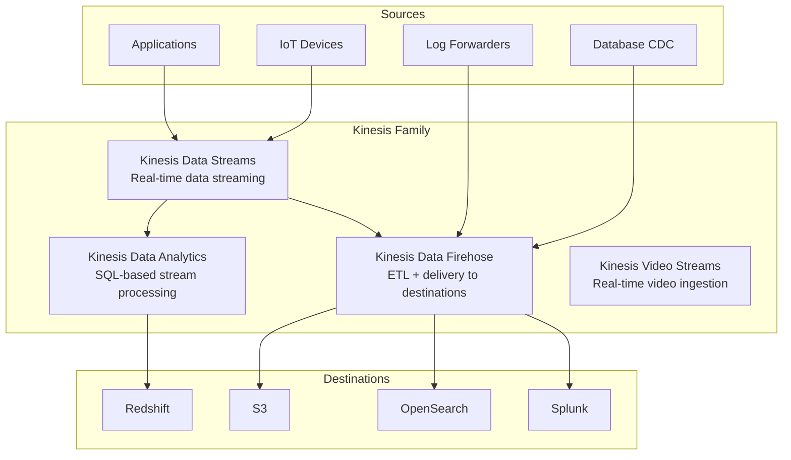
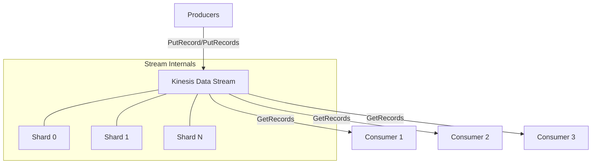
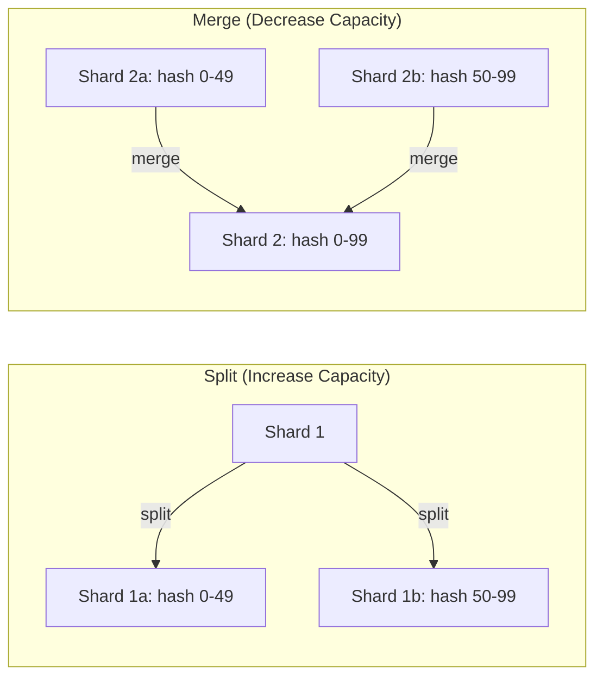
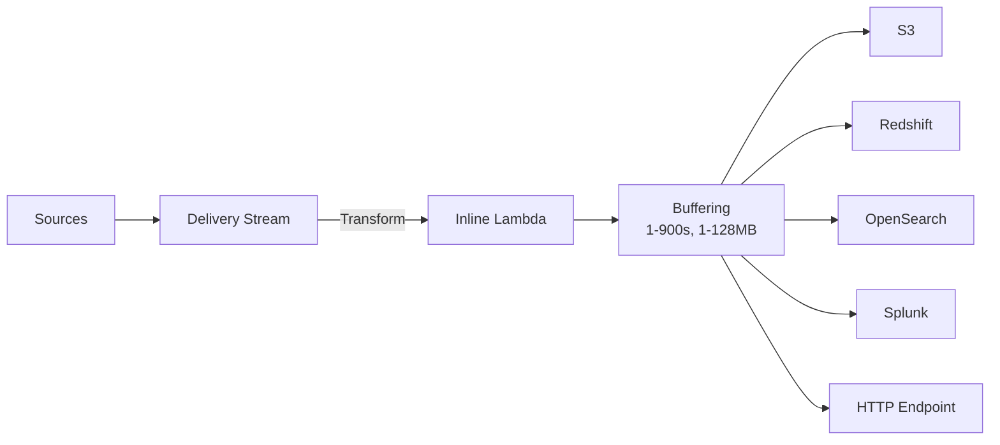

# Amazon Kinesis (Real-Time Data Streaming)

## Overview

Amazon Kinesis is a family of managed services for real-time data streaming at scale. It enables you to ingest, process, and analyze streaming data in real time — clickstreams, IoT telemetry, application logs, financial transactions, and more. Unlike batch processing, Kinesis processes data as it arrives, enabling sub-second insights.

## Kinesis Family



## Kinesis Data Streams

### Core Architecture



### Shards

A **shard** is the base throughput unit of a Kinesis stream:

| Property | Value |
|----------|-------|
| Write throughput | 1 MB/sec or 1,000 records/sec per shard |
| Read throughput | 2 MB/sec or 5 enhanced fan-out consumers per shard |
| Data retention | 1–365 days (configurable) |
| Max record size | 1 MB |
| Max put batch | 5 MB or 500 records |

**Partition key** determines which shard a record lands on. Records with the same partition key are always read in order within that shard.

### Data Record Structure

```json
{
  "PartitionKey": "user-12345",
  "Data": "base64-encoded-payload",
  "SequenceNumber": "21269319989653737946712965403778482177",
  "ApproximateArrivalTimestamp": 1705312200.0
}
```

### Consumer Types

| Type | Polling Model | Latency | Throughput Cost |
|------|---------------|---------|-----------------|
| **Standard** | `GetRecords` polling (poll, 5 calls/sec/shard) | ~200ms | Shared 2 MB/sec per shard |
| **Enhanced Fan-Out** | Push-based via HTTP/2 | ~70ms | Dedicated 2 MB/sec per consumer |

### Resharding

You can split and merge shards to adjust capacity:



### Sequence Numbers and Ordering

Every record gets a monotonically increasing sequence number per shard. Consumers track their position using a **checkpoint** (sequence number of the last processed record). If a consumer fails, it resumes from the last checkpoint.

## Kinesis Data Firehose

Firehose is a fully managed ETL service that delivers streaming data to destinations automatically:



| Feature | Details |
|---------|---------|
| Buffering | Time (60–900s) or size (1–128 MB), whichever comes first |
| Transformation | Inline Lambda for data conversion, filtering, enrichment |
| Data format conversion | JSON → Parquet, ORC; record aggregation | 
| Compression | Gzip, Snappy, ZIP |
| Backup | Copy original records to S3 alongside transformed output |

### Firehose vs Direct Streams

| Scenario | Choice |
|----------|--------|
| Simple delivery to S3/Redshift | Firehose (no code needed) |
| Custom processing logic | Data Streams + Lambda/KCL |
| Real-time analytics | Data Streams + Kinesis Data Analytics |
| Multiple independent consumers | Data Streams (multiple consumer applications) |

## Kinesis Data Analytics

Process streaming data using standard SQL:

```sql
-- Create a pump from source stream
CREATE OR REPLACE STREAM "DESTINATION_SQL_STREAM" (
    "user_id" VARCHAR(16),
    "event_type" VARCHAR(32),
    "event_count" INTEGER
);

-- Sliding window aggregation
CREATE OR REPLACE PUMP "STREAM_PUMP" AS
INSERT INTO "DESTINATION_SQL_STREAM"
SELECT STREAM
    "user_id",
    "event_type",
    COUNT(*) AS "event_count"
FROM "SOURCE_SQL_STREAM_001"
GROUP BY
    "user_id",
    "event_type",
    WINDOW SESSION BETWEEN 10 SECOND PRECEDING AND CURRENT ROW;
```

### Window Types

| Window Type | Description | Use Case |
|-------------|-------------|----------|
| Tumbling | Fixed-size, non-overlapping | Hourly aggregations |
| Sliding | Fixed-size, overlapping | Moving averages |
| Session | Dynamic, activity-driven | User sessions |

## Kinesis Client Library (KCL)

KCL simplifies consumer development by handling:
- Shard distribution across workers
- Checkpointing and fault tolerance
- Load balancing when shards are added/removed
- Coordination via a DynamoDB lease table

```java
// KCL 2.x Worker
KinesisClient kinesisClient = KinesisClient.create();
DynamoDbClient dynamoClient = DynamoDbClient.create();
CloudWatchClient cwClient = CloudWatchClient.create();

Scheduler scheduler = new Scheduler.Builder()
    .recordProcessorFactory(new MyRecordProcessorFactory())
    .streamName("my-stream")
    .kinesisClient(kinesisClient)
    .dynamoDbClient(dynamoClient)
    .cloudWatchClient(cwClient)
    .build();

scheduler.start();
```

## Comparison: Kinesis vs Kafka

| Feature | Kinesis Data Streams | Apache Kafka |
|---------|---------------------|--------------|
| **Management** | Fully managed | Self-managed or Confluent Cloud |
| **Scaling** | Shard splitting/merging | Partition rebalancing |
| **Retention** | 1–365 days | Configurable (disk-based) |
| **Consumer model** | Pull (standard) / Push (EFO) | Pull only |
| **Ordering** | Per-partition key | Per-partition |
| **Throughput** | 1 MB/s write per shard | Higher per broker |
| **Cost model** | Per shard-hour + PUT | Per broker (self-hosted) or per CKU |
| **Ecosystem** | AWS-native | Rich open-source ecosystem |
| **Exactly-once** | KCL idempotent processing | Kafka Streams / Transactions |
| **Multi-region** | With Kinesis Data Streams cross-region replication | MirrorMaker 2 |

## Pricing

| Component | Cost |
|-----------|------|
| Data Streams (shard-hour) | $0.015/hour per shard ($~$11/mo) |
| Data Streams (PUT) | $0.014 per million records |
| Enhanced Fan-Out | $0.015/hour per consumer-shard + $0.014/million records |
| Firehose | $0.029/hour per delivery stream + data volume pricing |
| Data Analytics | Starting at $0.11/hour per KPU |

## Limits

| Resource | Default Limit | Adjustable |
|----------|---------------|------------|
| Shards per account (us-east-1) | 500 | Yes (up to 50,000) |
| Records per `PutRecords` call | 500 | No |
| Max record data size | 1 MB | No |
| Max `PutRecords` payload | 5 MB | No |
| Retention period | 1–365 days | N/A (configurable) |
| `GetRecords` calls/sec/shard (standard) | 5 | No |
| Consumers with EFO per shard | 5 | Yes |

## Common Use Cases

| Use Case | Kinesis Service | Architecture |
|----------|----------------|-------------|
| Clickstream analytics | Streams + Analytics | Real-time funnel analysis |
| Log aggregation | Firehose | Deliver to S3/OpenSearch |
| IoT telemetry | Streams | Lambda consumers for alerting |
| Real-time fraud detection | Streams + Analytics | Sliding window anomaly detection |
| ETL into data warehouse | Firehose | Transform + deliver to Redshift |
| Application metrics | Streams | Time-series aggregation |

## Interview Questions

1. **How do you choose the number of shards?** Estimate peak throughput: `shards = ceil(max(peak_write_MB/s, peak_records/s / 1000))`. Plan for headroom. Remember read throughput is 2x write.

2. **What happens when a shard is split?** Existing records remain on the parent shard. New records route to child shards based on the hash key range. Consumers see both parent and child shards during the transition.

3. **How does KCL handle failover?** KCL uses a DynamoDB table to track lease ownership. If a worker dies, its lease expires (default 60s) and another worker claims it, resuming from the last checkpoint.

4. **When would you use Firehose over Streams?** Use Firehose when you need simple, managed delivery to AWS destinations without custom processing. Use Streams when you need multiple consumers, custom processing, or sub-second latency.

5. **How do you achieve exactly-once processing?** Kinesis provides at-least-once delivery. For exactly-once, use idempotent consumers (deduplication by sequence number) or Kinesis Data Analytics with checkpointing.

## Key Takeaways

- Kinesis Streams provides managed real-time data streaming with shard-based scaling
- Firehose is the zero-code ETL pipeline for delivering streaming data to destinations
- Kinesis Data Analytics enables SQL-based stream processing with windowing
- KCL handles consumer coordination, checkpointing, and fault tolerance
- Shard count directly determines cost and throughput — plan capacity carefully
- Enhanced Fan-Out provides dedicated throughput per consumer at lower latency
- Compare with Kafka: Kinesis for AWS-native simplicity, Kafka for ecosystem richness

## Cross-References

- [AWS Lambda](./lambda.md) — Common Kinesis consumer
- [Amazon S3](./s3.md) — Common Firehose destination
- [Amazon EventBridge](./eventbridge.md) — Event routing complement
- [ElastiCache](./elasticache.md) — Cache for streaming aggregation results
- [Apache Pulsar](../../distributed/messaging/pulsar.md) — Alternative streaming platform
- [Kafka](../../distributed/messaging/kafka.md) — Detailed Kafka comparison
- [Stream Processing](../../data-engineering/stream-processing.md) — Stream processing patterns
