# AWS Lambda (Serverless Compute)

## Introduction

AWS Lambda is a serverless compute service that runs your code in response to events without provisioning or managing servers. You pay only for the compute time you consume—there is no charge when your code is not running.

## Serverless Computing

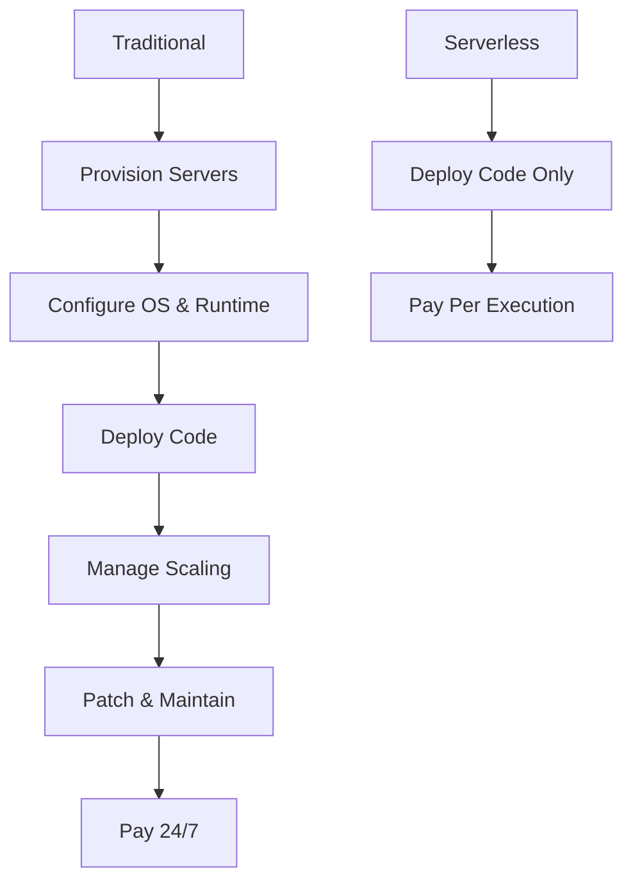

**Serverless doesn't mean "no servers"**—it means you don't manage servers. AWS handles provisioning, scaling, patching, and availability.

## Lambda Architecture

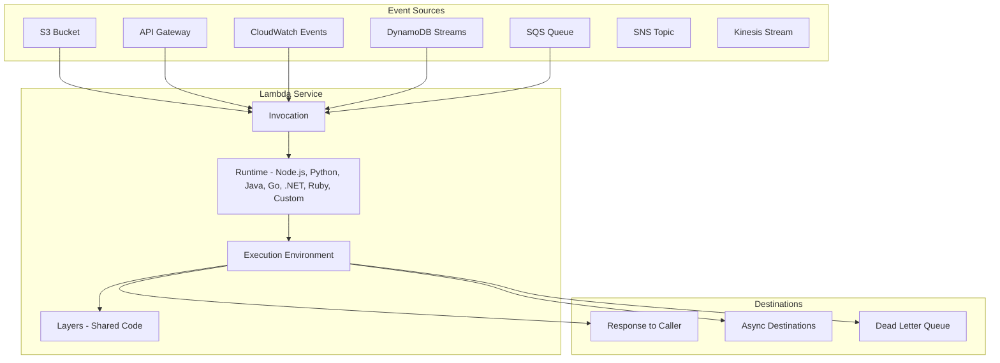

### Lambda Function Components

| Component | Details |
|-----------|---------|
| **Function** | Your code + configuration |
| **Runtime** | Language runtime (Python 3.12, Node.js 20, Java 21, etc.) |
| **Handler** | Entry point function (e.g., `lambda_handler`) |
| **Layers** | Shared libraries and dependencies |
| **Environment Variables** | Configuration without code changes |
| **Execution Role** | IAM role Lambda assumes to access AWS services |
| **VPC Config** | Optional: run Lambda inside a VPC |

## Lambda Execution Model

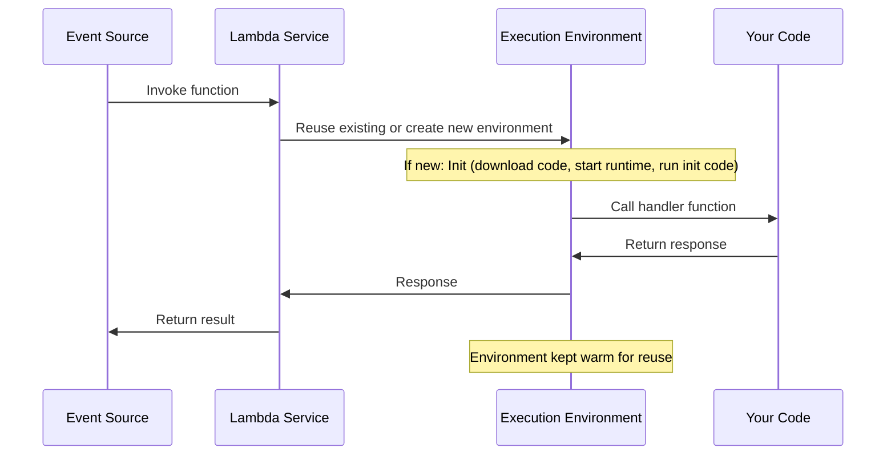

### Cold Starts vs Warm Starts

```mermaid
graph TB
    subgraph "Cold Start (First Request)"
        CS1[Download Function Code] --> CS2[Start Runtime/Container]
        CS2 --> CS3[Run Init Code (imports, connections)]
        CS3 --> CS4[Run Handler]
        CS4 --> CS5[Return Response]
    end

    subgraph "Warm Start (Subsequent Requests)"
        WS1[Reuse Existing Environment]
        WS1 --> WS2[Run Handler]
        WS2 --> WS3[Return Response]
    end
```

| Aspect | Cold Start | Warm Start |
|--------|-----------|------------|
| **Latency** | 100ms to 10s+ | 1-50ms |
| **Triggers** | First invocation, scaling, idle timeout (>15 min) | Reused environment |
| **What happens** | Download code, start runtime, run init | Just run handler |
| **Mitigation** | Provisioned concurrency, keep-warm patterns | Normal operation |

### Cold Start Factors

| Factor | Impact | Mitigation |
|--------|--------|-----------|
| **Package size** | Larger = slower download | Minimize dependencies, use layers |
| **Runtime** | Java/C# slower than Python/Node.js | Use SnapStart (Java), choose lighter runtimes |
| **VPC attachment** | Adds ENI creation time | Use Hyperplane (improved), minimize VPC subnets |
| **Init code** | Heavy imports slow cold start | Lazy-load, minimize imports |
| **Memory** | More memory = more CPU = faster init | Right-size memory allocation |

## Lambda Pricing

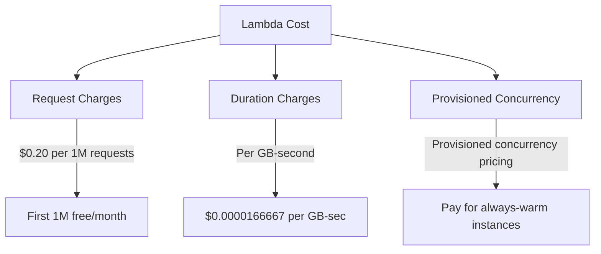

**Example Cost Calculation:**
```
1 million requests/month
256 MB memory, 200ms average duration

Request cost: 1M × $0.20/1M = $0.20
Duration cost: 1M × 0.2s × 0.25GB × $0.0000166667 = $0.83
Total: ~$1.03/month
```

**Free Tier:** 1 million requests and 400,000 GB-seconds per month, always free.

## Lambda Concurrency

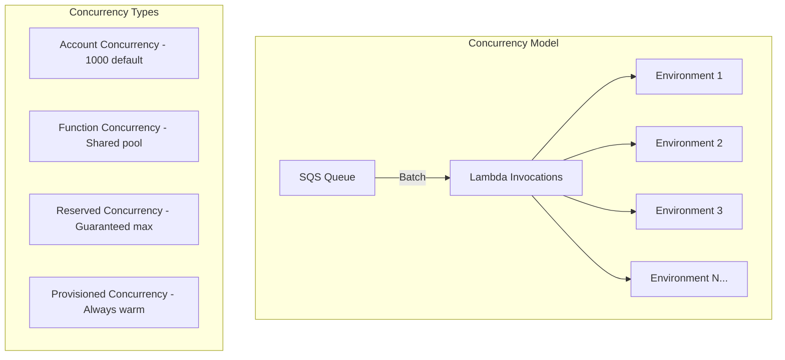

| Concurrency Type | Description | Use Case |
|-----------------|-------------|----------|
| **Account Limit** | 1,000 concurrent executions (default, can request increase) | Overall limit |
| **Unreserved** | Shared pool across all functions | Default behavior |
| **Reserved** | Guarantees max for a function, prevents noisy neighbor | Rate limiting |
| **Provisioned** | Pre-initialized environments, eliminates cold starts | Latency-critical |

### Provisioned Concurrency

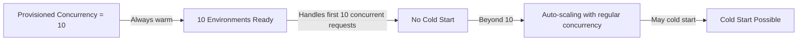

## Lambda Event Sources

### Synchronous Invocations

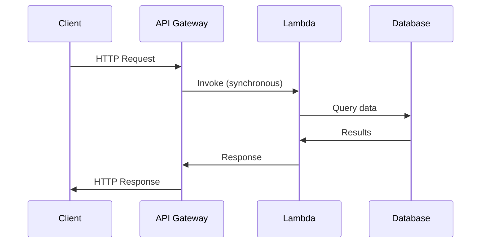

**Sync sources:** API Gateway, ALB, CloudFront, Cognito, Lex

### Asynchronous Invocations

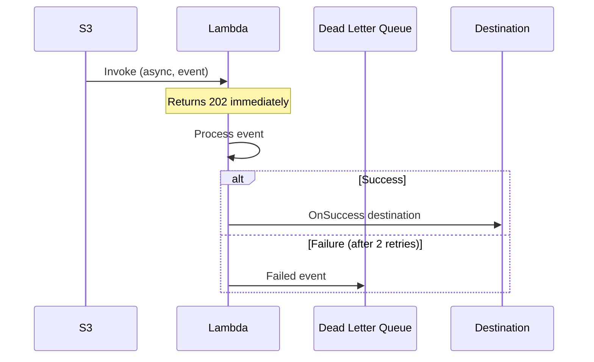

**Async sources:** S3, SNS, CloudWatch Events, CodeCommit, IoT

### Event Source Mapping (Polling)

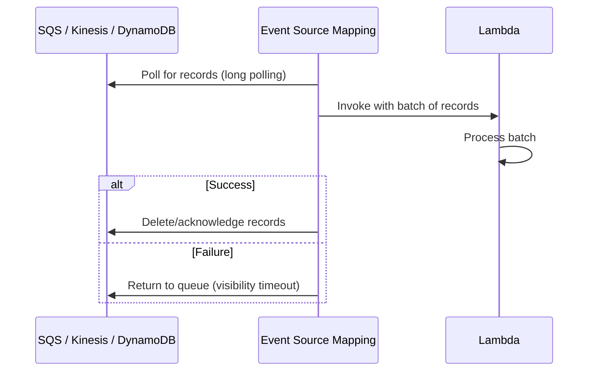

**Polling sources:** SQS, Kinesis, DynamoDB Streams, Kafka

## Lambda Best Practices

### Function Design

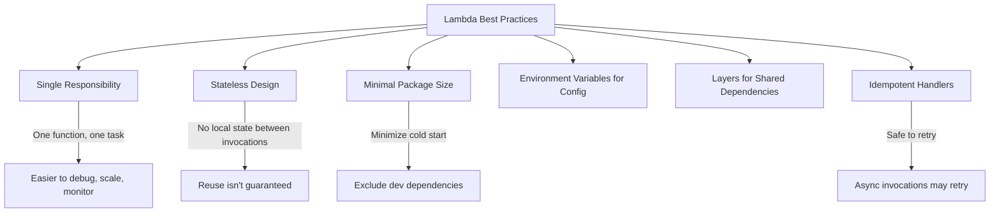

### Memory and CPU Relationship

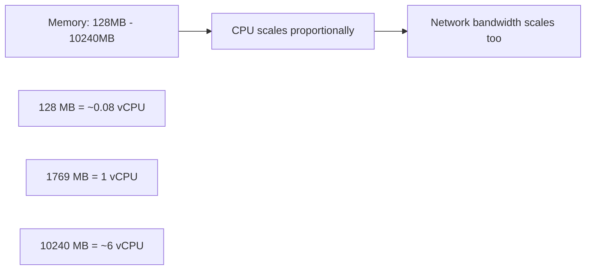

| Memory | vCPU | Good For |
|--------|------|----------|
| 128 MB | ~0.08 | Simple transformations, routing |
| 512 MB | ~0.29 | API handlers, data processing |
| 1769 MB | 1.0 | CPU-intensive work |
| 3008 MB | 1.7 | Image processing, ML inference |
| 10240 MB | ~6 | Maximum CPU needs |

## Lambda Limits

| Limit | Default | Adjustable |
|-------|---------|-----------|
| **Memory** | 128 MB - 10,240 MB | Fixed range |
| **Timeout** | 3 seconds (default) | Up to 15 minutes |
| **Package size** | 50 MB (zipped) | Up to 250 MB (unzipped) |
| **Layers** | 5 layers | No |
| **Environment variables** | 4 KB | No |
| **Concurrency** | 1,000 per account | Yes (request increase) |
| **Payload** | 6 MB (sync), 256 KB (async) | No |
| **/tmp storage** | 512 MB - 10 GB | Via ephemeral storage config |
| **Execution** | No time limit on container reuse | Timeout per invocation |

## Lambda Destinations

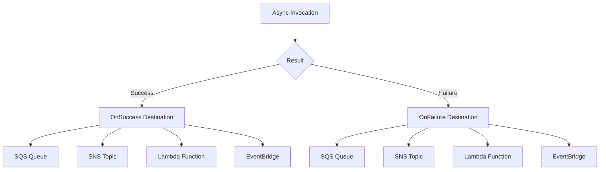

## Interview Questions

### Q1: What is a cold start in Lambda and how do you mitigate it?
**Answer**: A cold start occurs when Lambda creates a new execution environment—downloading code, starting the runtime, and running initialization code. This adds 100ms to 10s+ of latency. Mitigations: (1) Provisioned Concurrency keeps environments pre-initialized, (2) Minimize package size and dependencies, (3) Use lighter runtimes (Python/Node.js over Java/C#), (4) Lazy-load heavy imports, (5) Use SnapStart for Java, (6) Avoid VPC attachment when possible, (7) Keep-warm patterns (scheduled pings—hacky but works).

### Q2: Explain Lambda's concurrency model.
**Answer**: Concurrency is the number of requests being processed simultaneously. Account limit defaults to 1,000. Functions share unreserved concurrency. Reserved Concurrency sets a guaranteed maximum for a function (prevents noisy neighbor). Provisioned Concurrency pre-initializes N environments, eliminating cold starts for up to N concurrent requests. Beyond provisioned concurrency, Lambda scales with regular concurrency (may cold start). Auto-scaling adjusts provisioned concurrency based on utilization.

### Q3: How does Lambda handle failures for different invocation types?
**Answer**: Synchronous (API Gateway, ALB): Returns error directly to caller—caller must retry. Asynchronous (S3, SNS): Lambda retries automatically twice (with backoff), then sends to Dead Letter Queue (DLQ) or OnFailure destination. Event Source Mapping (SQS, Kinesis): Returns messages to queue/stream for retry—use DLQ on the source for poison messages. Always configure DLQ/failure destinations to avoid losing events.

### Q4: When would you choose Lambda over EC2?
**Answer**: Choose Lambda for: event-driven workloads (S3 uploads, API requests), unpredictable traffic (auto-scales to zero), short-lived tasks (< 15 minutes), pay-per-execution cost model, zero operational overhead. Choose EC2 for: long-running processes, consistent traffic (cheaper than Lambda at scale), custom OS/kernel requirements, applications requiring persistent connections, workloads exceeding Lambda's limits (memory, timeout, package size).

### Q5: How do you connect Lambda to a VPC?
**Answer**: Configure the Lambda function with VPC subnets and security groups. Lambda creates ENIs in the specified subnets to access VPC resources (RDS, ElastiCache). This adds cold start latency (historically ~10s for ENI creation, now improved to ~1s with Hyperplane). Best practices: use private subnets with NAT Gateway for internet access, minimize subnet count, use VPC endpoints for AWS services (S3, DynamoDB) to avoid NAT costs.

## Common Mistakes

1. **Not handling timeouts**: Lambda silently kills your function at the timeout—handle graceful shutdown
2. **Storing state in global variables**: Environments may be reused, but don't rely on it for correctness
3. **Over-provisioning memory**: More memory = more CPU = faster execution, but costs more—optimize
4. **No DLQ for async functions**: Failed events are lost without a DLQ or destination
5. **Ignoring idempotency**: Async invocations may retry—handlers must be idempotent
6. **Large deployment packages**: Causes slow cold starts—minimize dependencies
7. **Not using environment variables**: Hard-coding config in code prevents reuse across environments
8. **VPC when not needed**: Adds cold start latency and requires NAT for internet access

## Summary

| Concept | Key Takeaway |
|---------|-------------|
| **Serverless** | No server management, pay per execution |
| **Cold Start** | Latency on first request, mitigated by provisioned concurrency |
| **Concurrency** | Account limit, reserved, provisioned concurrency |
| **Event Sources** | Synchronous, asynchronous, and polling (event source mapping) |
| **Pricing** | Per request + per GB-second, free tier available |
| **Best Practices** | Single responsibility, minimal size, idempotent, right-size memory |

## Cross-References

- **EC2**: [Instance Types](./ec2.md) — When Lambda isn't enough
- **S3**: [Event Notifications](./s3.md) — S3 triggers Lambda
- **API Gateway**: Front door for Lambda-based APIs
- **SQS**: Decoupling and async processing
- **Kubernetes**: [Pods](../kubernetes/pods.md) — Alternative: Knative serverless on K8s
- **Observability**: [Logging](../observability/logging.md) — CloudWatch Logs for Lambda
