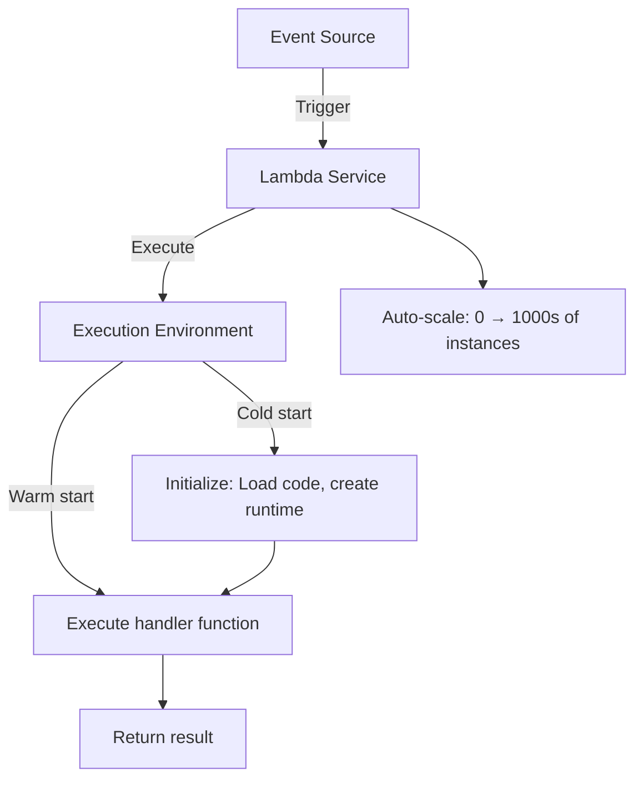
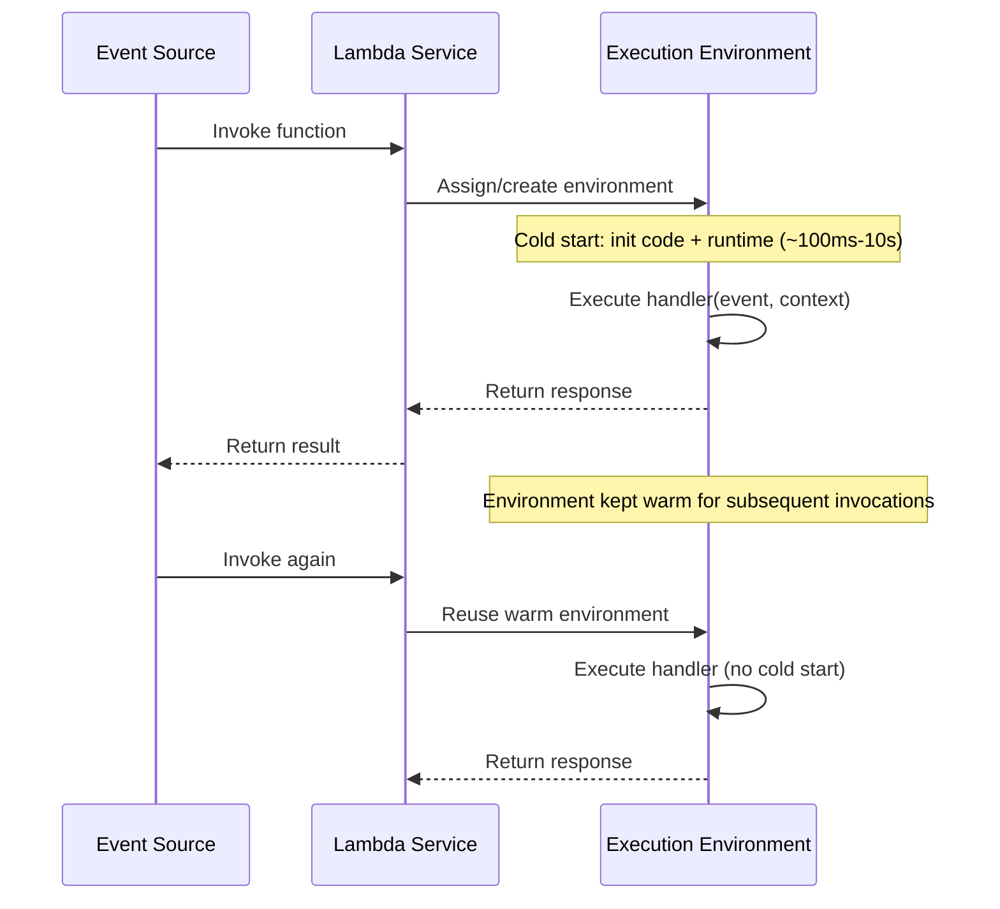
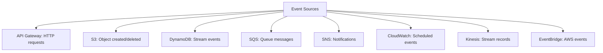
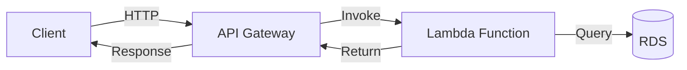
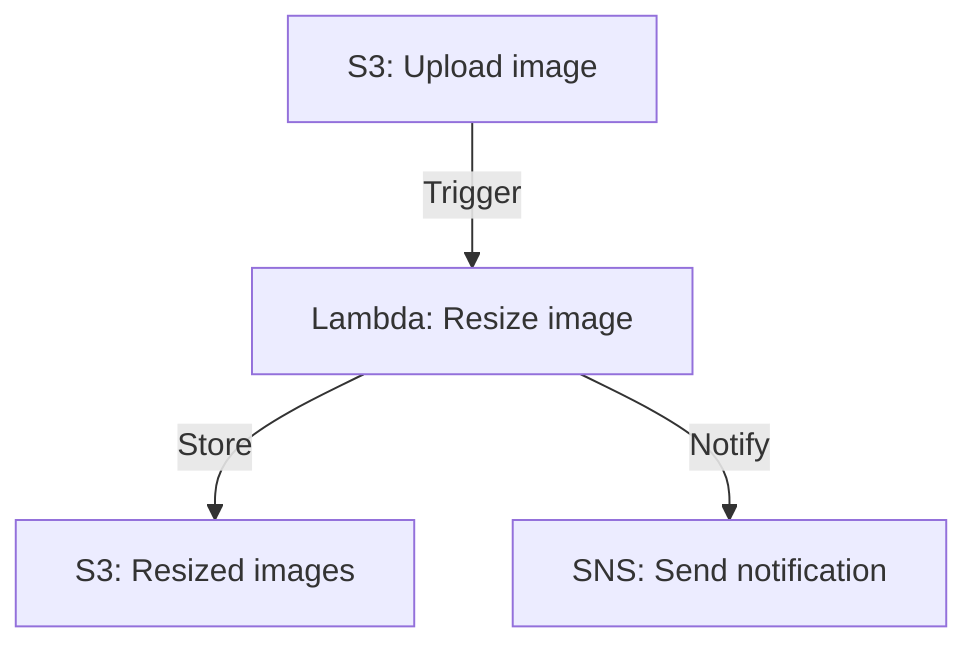
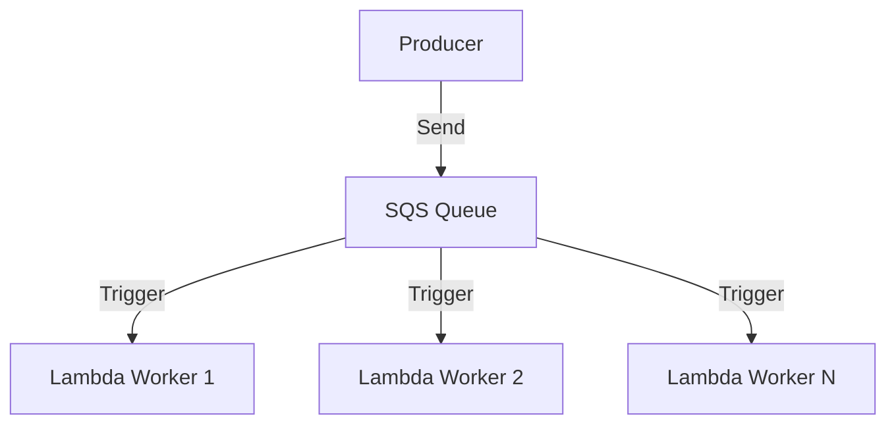
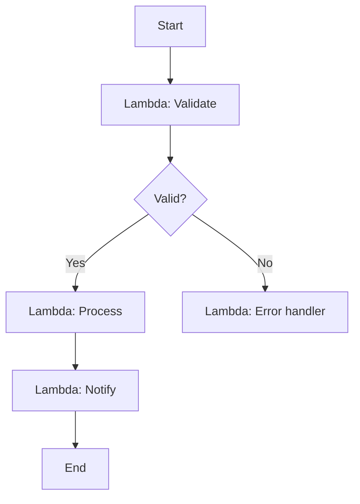
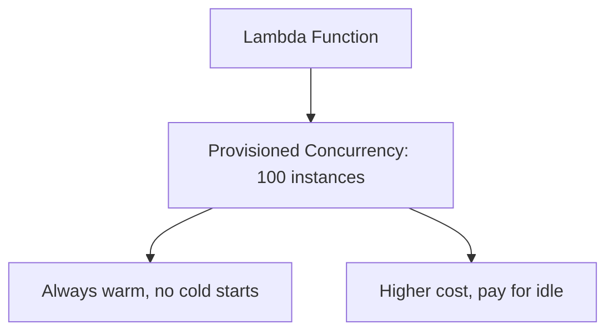
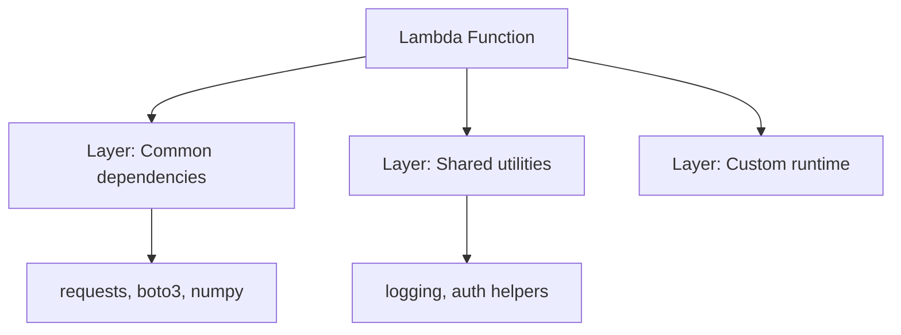

# AWS Lambda

## Overview

AWS Lambda is a serverless compute service that runs code in response to events without provisioning or managing servers. You upload your code, configure triggers, and Lambda handles everything else — scaling, patching, availability. You pay only for the compute time consumed (per millisecond). Lambda is the foundation of serverless architecture on AWS.

## How Lambda Works



### Execution Model



### Cold Start vs Warm Start

```mermaid
graph TD
    COLD[Cold Start] --> C1[Download code]
    COLD --> C2[Start runtime (Node, Python, Java)]
    COLD --> C3[Run initialization code]
    COLD --> C4[100ms - 10s depending on runtime]

    WARM[Warm Start] --> W1[Reuse existing environment]
    WARM --> W2[Skip initialization]
    WARM --> W3[Execute handler directly]
    WARM --> W4[~1-5ms overhead]
```

| Runtime | Cold Start (typical) |
|---------|---------------------|
| Python | 100-300ms |
| Node.js | 100-300ms |
| Java | 500ms-3s |
| .NET | 500ms-2s |
| Go | 100-200ms |
| Rust | 50-150ms |

## Event Sources



## Lambda Function Structure

```python
import json

def handler(event, context):
    """
    event: Dict with trigger data (API request, S3 event, etc.)
    context: Runtime info (function name, memory, timeout, request ID)
    """

    # Process event
    body = json.loads(event.get('body', '{}'))
    name = body.get('name', 'World')

    # Return response
    return {
        'statusCode': 200,
        'headers': {'Content-Type': 'application/json'},
        'body': json.dumps({'message': f'Hello, {name}!'})
    }
```

## Lambda Limits

| Limit | Value |
|-------|-------|
| Memory | 128 MB – 10,240 MB |
| Timeout | 1 second – 15 minutes |
| Package size | 50 MB (zipped), 250 MB (unzipped) |
| Environment variables | 4 KB |
| Concurrent executions | 1,000 (default, adjustable) |
| /tmp storage | 512 MB – 10 GB |

## Patterns

### API Gateway + Lambda



### Event-Driven Processing



### Fan-Out with SQS



### Step Functions Orchestration



## Provisioned Concurrency



For latency-sensitive applications, provisioned concurrency keeps N environments warm, eliminating cold starts.

## Lambda Layers



Layers let you share code and dependencies across functions.

## Cost Model

```
Cost = Requests × $0.20/million + Duration × Memory × $0.0000166667/GB-second
```

| Scenario | Monthly Cost (estimate) |
|----------|------------------------|
| 1M requests, 200ms, 256MB | ~$0.83 |
| 10M requests, 500ms, 512MB | ~$20.83 |
| 100M requests, 1s, 1GB | ~$208.33 |

## Interview Questions

1. **Q: What is serverless computing?**
   A: Serverless means you don't manage servers. The cloud provider handles provisioning, scaling, patching, and availability. You pay per execution, not per server-hour. Lambda is AWS's serverless compute. Benefits: no ops overhead, auto-scaling, pay-per-use.

2. **Q: What is a cold start in Lambda and how do you mitigate it?**
   A: A cold start occurs when Lambda creates a new execution environment — loading code, starting the runtime. It adds 100ms-10s latency. Mitigations: use lightweight runtimes (Python, Node.js), minimize package size, use Provisioned Concurrency, keep functions warm with scheduled pings.

3. **Q: When would you use Lambda vs EC2?**
   A: Lambda for event-driven, short-lived tasks (< 15 min), variable traffic, and when you don't want to manage servers. EC2 for long-running processes, consistent traffic, custom OS requirements, or when you need full control over the environment.

4. **Q: How does Lambda scale?**
   A: Lambda scales automatically by creating execution environments for each concurrent invocation. It can scale from 0 to thousands of concurrent executions. Each invocation runs in its own isolated environment. There's a default concurrency limit (1,000) that can be increased.

5. **Q: What are Lambda's limitations?**
   A: Max 15-minute execution time, 10GB memory, 250MB unzipped package, 512MB-10GB /tmp storage, no persistent connections (WebSocket needs API Gateway), cold starts for infrequent invocations, and no GPU support.

## Common Mistakes

- Putting long-running tasks in Lambda — use EC2 or Step Functions for workflows > 15 min.
- Large deployment packages — increases cold start time. Use Lambda Layers for dependencies.
- Not handling retries — Lambda retries on failure for async invocations. Design for idempotency.
- Ignoring cold starts — measure and optimize for your latency requirements.
- Over-using Lambda — simple, steady-state services are often better on ECS/EC2.

## Summary

Lambda provides serverless compute that scales automatically and charges per execution. It's triggered by events (API requests, S3 uploads, queue messages) and executes stateless functions. Key concepts: cold starts, event sources, concurrency limits, and cost model. For interviews, understand when to use Lambda vs containers/VMs, cold start mitigation, and serverless architecture patterns.

## Cross-References

- [S3](./s3.md) — Common Lambda trigger
- [API Gateway](./vpc.md) — HTTP frontend for Lambda
- [EC2](./ec2.md) — Alternative compute
- [Kubernetes](../kubernetes/README.md) — Container alternative
- [AWS Overview](./README.md) — All AWS services
