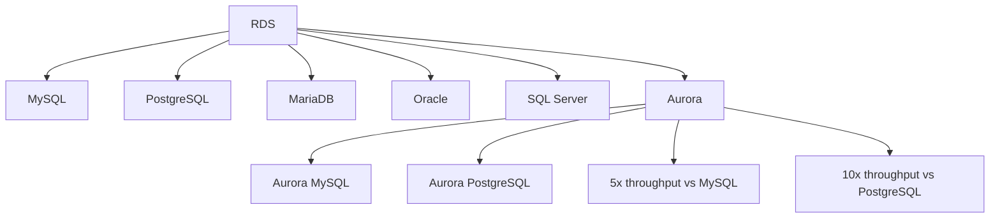
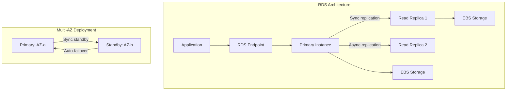
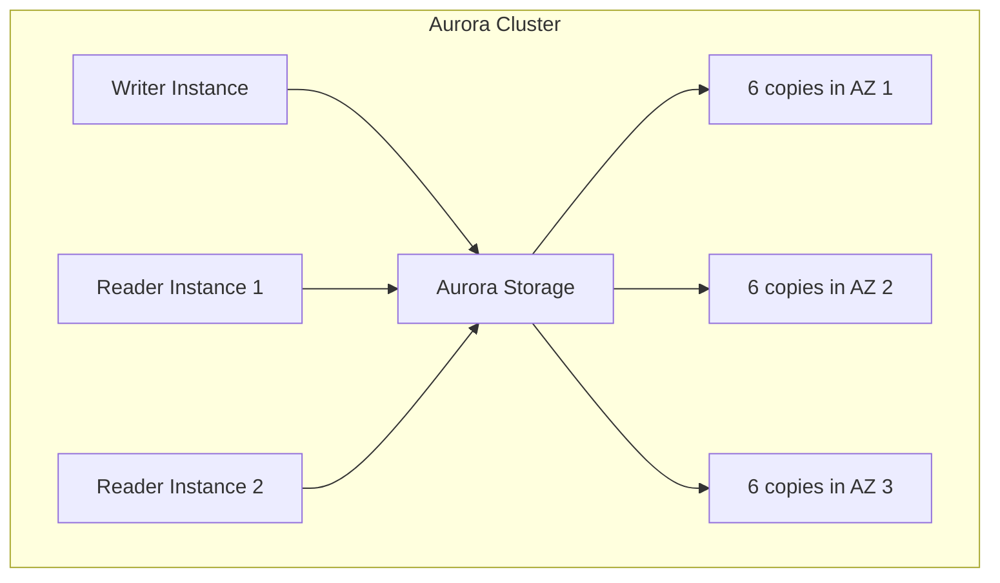
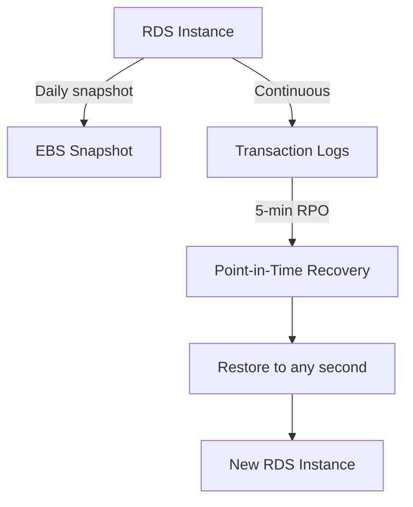
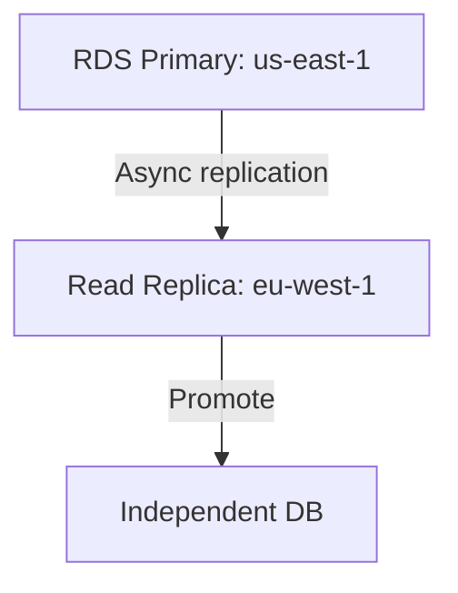
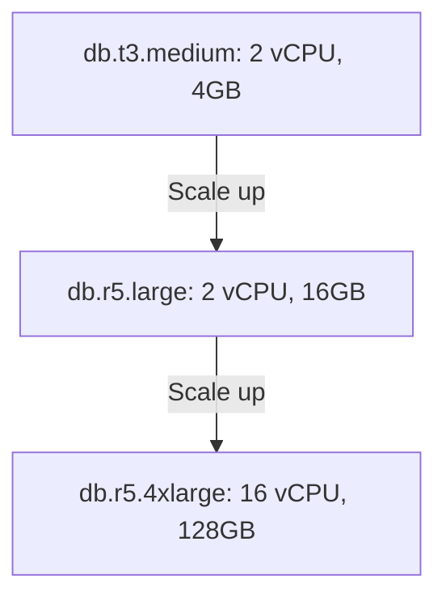
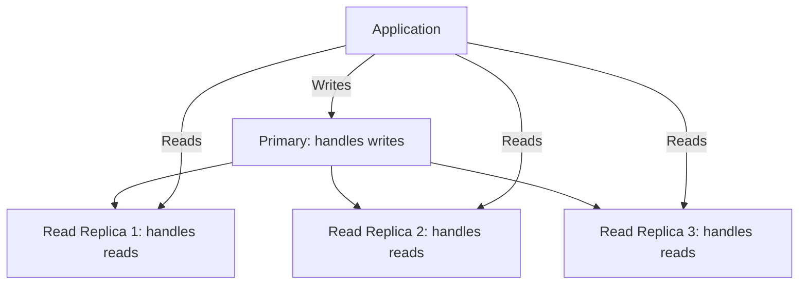

# AWS RDS (Relational Database Service)

## Overview

Amazon RDS is a managed relational database service that handles routine database tasks like provisioning, patching, backup, recovery, and scaling. It supports multiple database engines: MySQL, PostgreSQL, MariaDB, Oracle, SQL Server, and Amazon Aurora. RDS is the most common way to run relational databases on AWS.

## Supported Engines



## Architecture



### Multi-AZ vs Read Replicas

| Feature | Multi-AZ | Read Replicas |
|---------|----------|---------------|
| Purpose | High availability | Read scaling |
| Replication | Synchronous | Asynchronous |
| Failover | Automatic | Manual promotion |
| Read traffic | No (standby is passive) | Yes (serve read queries) |
| Count | 1 standby | Up to 15 replicas |

## Aurora Architecture



Aurora stores data across 3 AZs with 6 copies. Can tolerate loss of 2 copies for writes and 3 copies for reads without data loss.

### Aurora Serverless

```mermaid
graph TD
    APP[Application] --> PROXY[Aurora Proxy]
    PROXY --> SCALING{Auto-scaling}
    SCALING -->|Low traffic| SMALL[2 ACUs]
    SCALING -->|High traffic| LARGE[256 ACUs]
    SCALING -->|No traffic| PAUSE[Paused (0 ACUs)]
```

Aurora Serverless v2 scales capacity based on demand. Pay per ACU-hour. Good for variable workloads.

## Backup and Recovery

### Automated Backups



- **Automated backups**: Daily snapshots + continuous transaction logs.
- **Point-in-time recovery**: Restore to any second within retention period (up to 35 days).
- **Manual snapshots**: Persist until explicitly deleted.

### Cross-Region Read Replicas



For disaster recovery, create read replicas in another region. Promote to standalone if primary region fails.

## Scaling

### Vertical Scaling



Change instance type. Requires brief downtime (minutes for Multi-AZ).

### Horizontal Scaling (Read Replicas)



Read replicas offload read traffic. Application must route reads to replicas.

## Security

```mermaid
graph TD
    SEC[RDS Security] --> IAM_AUTH[IAM Authentication]
    SEC --> ENCRYPT[Encryption at rest (KMS)]
    SEC --> SSL[Encryption in transit (SSL/TLS)]
    SEC --> VPC[VPC: Not publicly accessible]
    SEC --> SG[Security Groups]
    SEC --> KMS[Customer-managed keys]
```

## Interview Questions

1. **Q: What is the difference between Multi-AZ and Read Replicas?**
   A: Multi-AZ provides high availability with synchronous replication to a standby in another AZ. Automatic failover on primary failure. Read replicas provide read scaling with asynchronous replication. Can be in different regions. Multi-AZ is for HA; replicas are for scaling.

2. **Q: How does Aurora differ from standard RDS MySQL?**
   A: Aurora stores data in a distributed storage layer across 3 AZs with 6 copies. It decouples compute from storage, enabling instant crash recovery, fast replicas, and auto-scaling storage. Aurora delivers 5x throughput vs MySQL and supports up to 15 read replicas with sub-10ms replication lag.

3. **Q: What is RDS Point-in-Time Recovery?**
   A: RDS continuously backs up transaction logs (every 5 minutes). You can restore to any second within the retention period (up to 35 days). This creates a new RDS instance from the chosen point in time. It's like a database "time machine."

4. **Q: How would you scale RDS for a read-heavy workload?**
   A: Add read replicas (up to 15) to distribute read traffic. Use a connection pooler (PgBouncer, ProxySQL). Implement caching (ElastiCache/Redis) for frequently accessed queries. For write-heavy workloads, consider sharding or Aurora.

5. **Q: What happens during an RDS Multi-AZ failover?**
   A: The standby is promoted to primary. The DNS endpoint is updated to point to the new primary. Existing connections are dropped and must reconnect. Failover typically takes 60-120 seconds. Applications should implement retry logic.

## Common Mistakes

- Not enabling Multi-AZ for production databases.
- Using a single read replica for all reads — it becomes a bottleneck.
- Not setting up automated backups or testing restores.
- Connecting to RDS over the public internet — use VPC and private subnets.
- Not monitoring replication lag — stale reads from replicas.

## Summary

RDS provides managed relational databases with automated backups, patching, scaling, and high availability. Multi-AZ provides automatic failover; read replicas provide read scaling. Aurora offers superior performance and availability with distributed storage. For interviews, understand Multi-AZ vs replicas, backup/recovery, and scaling strategies.

## Cross-References

- [VPC](./vpc.md) — RDS networking
- [EC2](./ec2.md) — Application servers connecting to RDS
- [ElastiCache](../overview.md) — Caching layer for RDS
- [AWS Overview](./README.md) — All AWS services
