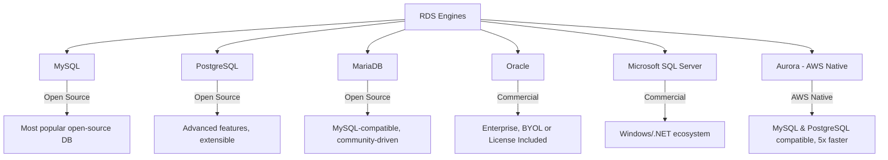
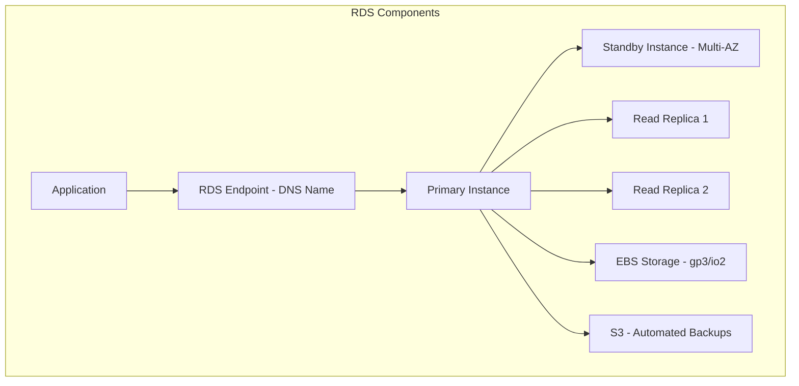
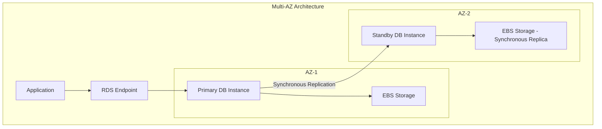
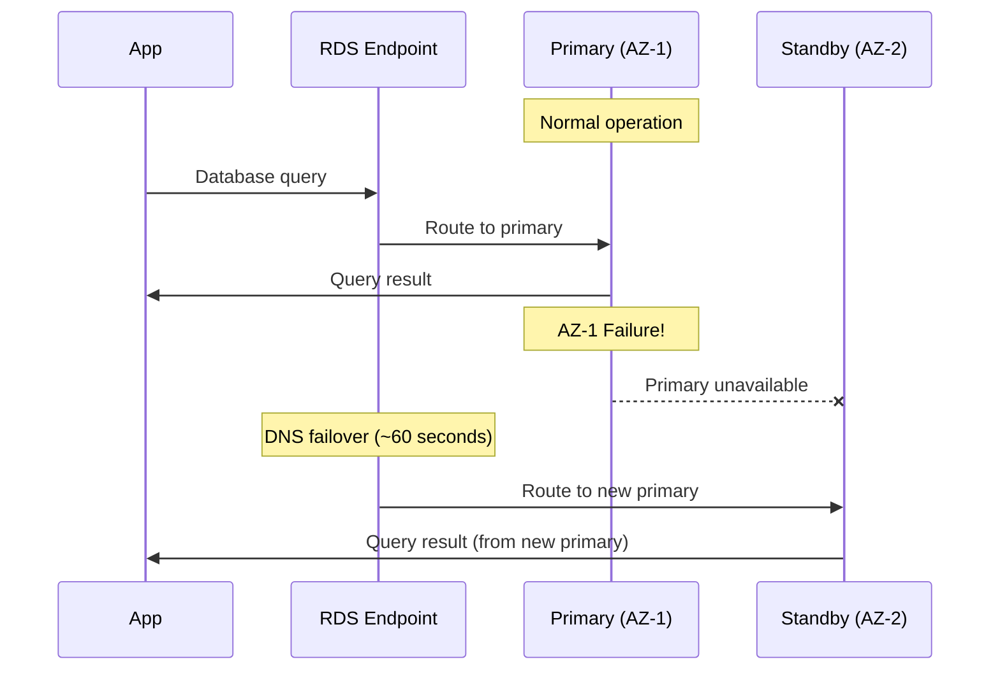
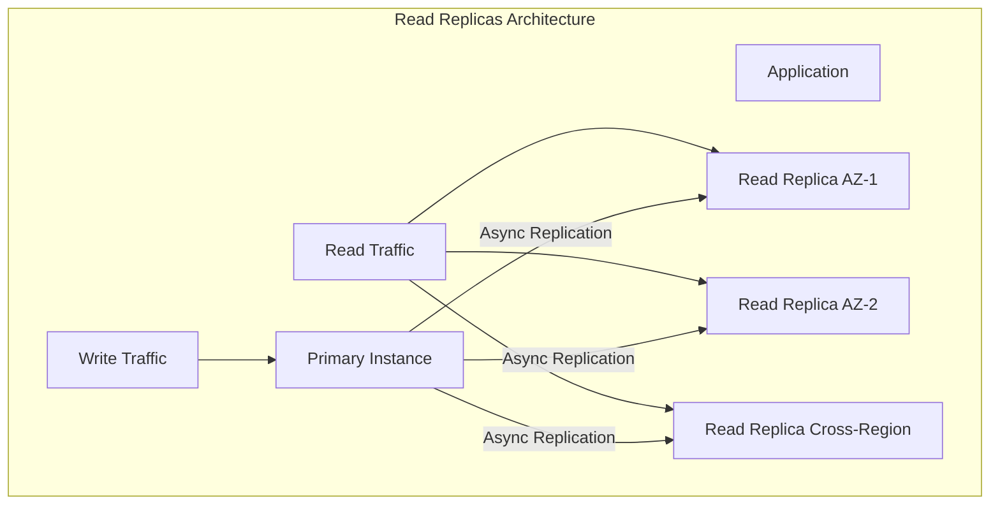
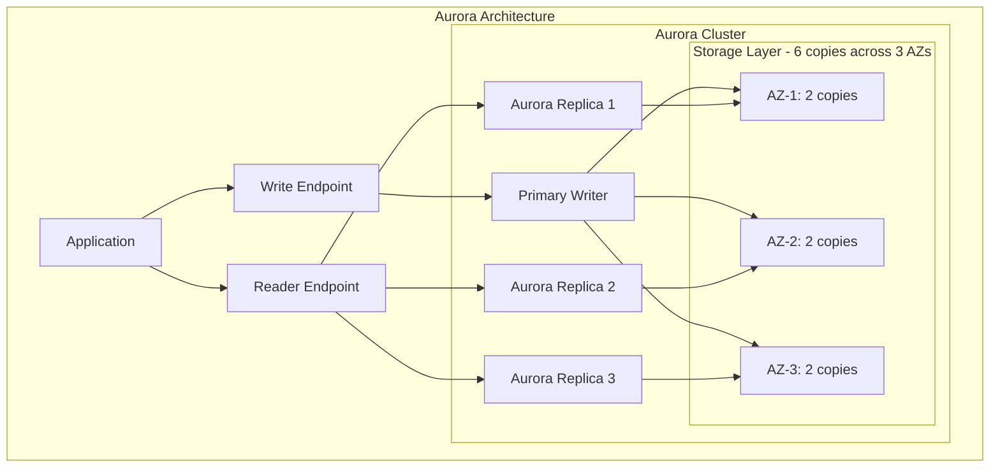
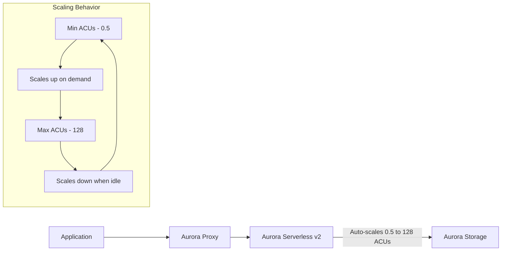
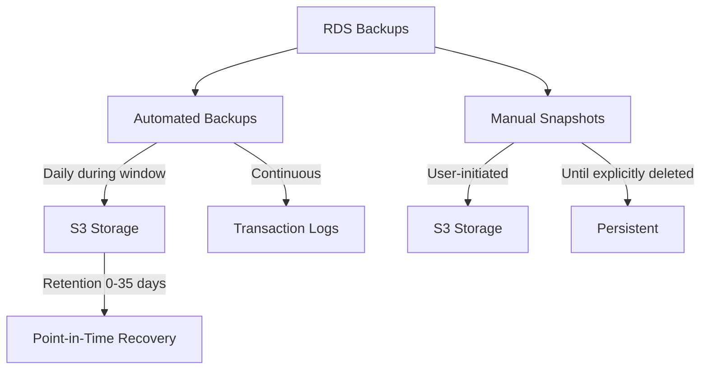
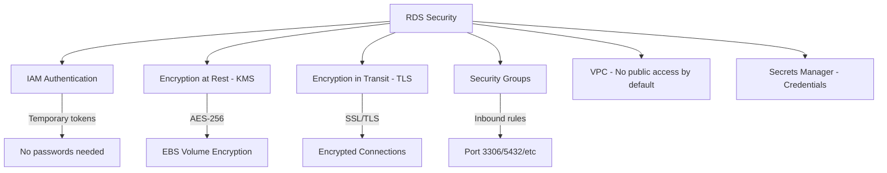

# Amazon RDS (Relational Database Service)

## Introduction

Amazon RDS is a managed relational database service that automates routine database tasks such as hardware provisioning, database setup, patching, and backups. It supports multiple database engines, making it easy to set up, operate, and scale relational databases in the cloud.

## Supported Database Engines

| Engine | Versions | License | Best For |
|--------|----------|---------|----------|
| **MySQL** | 5.7, 8.0 | Open source | Web applications, LAMP stack |
| **PostgreSQL** | 12-16 | Open source | Complex queries, GIS, JSON |
| **MariaDB** | 10.4-10.11 | Open source | MySQL drop-in replacement |
| **Oracle** | 12c, 19c | BYOL / License Included | Enterprise, existing Oracle shops |
| **SQL Server** | 2014-2022 | BYOL / License Included | Windows, .NET applications |
| **Aurora** | MySQL/PG compatible | AWS proprietary | High performance, cloud-native |

## RDS Architecture

## Multi-AZ Deployments

Multi-AZ provides high availability and automatic failover:

### Multi-AZ Failover Process

**Multi-AZ Key Points:**
- **Synchronous replication**: Zero data loss (RPO = 0)
- **Automatic failover**: DNS endpoint updated (~60-120 seconds)
- **Standby cannot be used for reads**: It's a hot standby only
- **Same region only**: For cross-region, use read replicas
- **Failover triggers**: AZ outage, instance failure, manual reboot, maintenance

## Read Replicas

| Aspect | Multi-AZ | Read Replicas |
|--------|----------|---------------|
| **Purpose** | High availability | Read scaling |
| **Replication** | Synchronous | Asynchronous |
| **Standby used for reads** | No | Yes (read endpoint) |
| **Failover** | Automatic | Manual promotion |
| **Data loss** | Zero (RPO=0) | Possible (replication lag) |
| **Cross-region** | No | Yes (up to 5 in different regions) |
| **Cost** | 2x primary | 1x per replica |

### Read Replica Use Cases

1. **Read scaling**: Offload read traffic from primary (reporting, analytics)
2. **Cross-region reads**: Serve users in other regions with lower latency
3. **Disaster recovery**: Promote replica to standalone in another region
4. **Migration**: Use as a migration source, promote to primary when ready

## Aurora

Aurora is AWS's cloud-native relational database, compatible with MySQL and PostgreSQL:

### Aurora vs Standard RDS

| Feature | Aurora | RDS MySQL/PostgreSQL |
|---------|--------|---------------------|
| **Performance** | Up to 5x MySQL, 3x PostgreSQL | Standard |
| **Storage** | Auto-scales 10GB to 128TB | Provisioned EBS |
| **Replicas** | Up to 15 read replicas | Up to 5 read replicas |
| **Replication Lag** | < 10ms typically | Seconds to minutes |
| **Failover** | ~30 seconds (automatic) | ~60-120 seconds |
| **Durability** | 6 copies across 3 AZs | Single AZ (or Multi-AZ for HA) |
| **Cost** | ~20-30% more than RDS | Standard pricing |

### Aurora Serverless

- **v2**: Scales in fine-grained increments (0.5 ACU steps), no cold start
- **v1**: Scales in larger steps, has cold start delay (seconds to minutes)
- **Use cases**: Variable workloads, dev/test, intermittent applications

## RDS Backup and Recovery

| Backup Type | Frequency | Retention | Deletion |
|------------|-----------|-----------|----------|
| **Automated** | Daily + continuous transaction logs | 1-35 days | Auto-deleted |
| **Manual Snapshots** | On-demand | Until deleted | Manual only |

**Point-in-Time Recovery (PITR):**
- Restore to any second within the retention period
- Creates a new RDS instance (doesn't overwrite existing)
- Uses automated backups + transaction logs

## RDS Security

## Interview Questions

### Q1: What is the difference between Multi-AZ and Read Replicas in RDS?
**Answer**: Multi-AZ is for high availability—synchronous replication to a standby in another AZ, automatic failover, standby cannot serve reads, zero data loss. Read Replicas are for read scaling—asynchronous replication, can be in different regions, serve read traffic, have replication lag (eventual consistency). You can use both together: Multi-AZ for HA + Read Replicas for scaling.

### Q2: How does Aurora differ from standard RDS?
**Answer**: Aurora is AWS's cloud-native database with: (1) Storage that auto-scales from 10GB to 128TB, (2) 6 copies of data across 3 AZs for durability, (3) Up to 15 read replicas with < 10ms replication lag, (4) Automatic failover in ~30 seconds, (5) Up to 5x MySQL and 3x PostgreSQL performance, (6) Serverless option for variable workloads. It costs ~20-30% more but offers significantly better performance and availability.

### Q3: Explain RDS Point-in-Time Recovery.
**Answer**: PITR restores a database to any specific second within the backup retention period (1-35 days). It works by restoring the latest daily snapshot and then replaying transaction logs up to the desired moment. It creates a new RDS instance (doesn't modify the existing one). Use cases: recovering from accidental data deletion, rolling back bad deployments, compliance requirements.

### Q4: When would you choose RDS vs DynamoDB?
**Answer**: RDS for: complex queries with joins, ACID transactions, existing SQL applications, structured data with fixed schema, reporting/BI tools. DynamoDB for: simple key-value/document access patterns, massive scale with single-digit ms latency, serverless with no capacity planning, flexible schemas, event-driven architectures. Many applications use both—RDS for relational data, DynamoDB for high-throughput access patterns.

### Q5: How do you handle RDS scaling?
**Answer**: Vertical scaling: Change instance type (requires downtime for Single-AZ, brief reboot for Multi-AZ). Horizontal read scaling: Add read replicas (up to 15 for Aurora). Horizontal write scaling: Aurora with multiple writers (Aurora Multi-Master). Storage scaling: Aurora auto-scales; RDS requires manual modification. For unpredictable workloads: Aurora Serverless v2. For massive write scaling: Consider DynamoDB instead.

## Common Mistakes

1. **Not enabling Multi-AZ for production**: Single-AZ means any AZ failure takes down your database
2. **Using Read Replicas for write operations**: Read replicas are read-only; writes go to primary
3. **Ignoring replication lag**: Applications reading from replicas may see stale data
4. **Not setting backup retention**: Default is 7 days—may not be enough for compliance
5. **Public accessibility enabled**: Databases should never be publicly accessible unless absolutely necessary
6. **Not using IAM authentication**: Relying on username/password instead of IAM roles
7. **Over-provisioning**: Choosing db.r5.4xlarge when db.t3.medium handles the load

## Summary

| Concept | Key Takeaway |
|---------|-------------|
| **Multi-AZ** | Synchronous standby, automatic failover, zero data loss |
| **Read Replicas** | Async replication, read scaling, cross-region |
| **Aurora** | Cloud-native, 5x MySQL, auto-scaling storage, 30s failover |
| **PITR** | Restore to any second within retention period |
| **Security** | Encryption (at rest + transit), IAM auth, VPC isolation |
| **Backups** | Automated daily + continuous transaction logs |

## Cross-References

- **EC2**: [Instances](./ec2.md) — Where RDS runs (managed by AWS)
- **VPC**: [Subnets](./vpc.md) — RDS lives in private subnets
- **Lambda**: [Event Sources](./lambda.md) — Trigger functions on DB events
- **Kubernetes**: [Services](../kubernetes/services.md) — Connecting apps to RDS
- **Observability**: [Monitoring](../observability/monitoring.md) — RDS CloudWatch metrics
