# Amazon S3 (Simple Storage Service)

## Introduction

Amazon S3 is an object storage service offering industry-leading scalability, data availability, security, and performance. It stores data as objects within buckets, with virtually unlimited storage capacity and a pay-as-you-go model.

## S3 Architecture

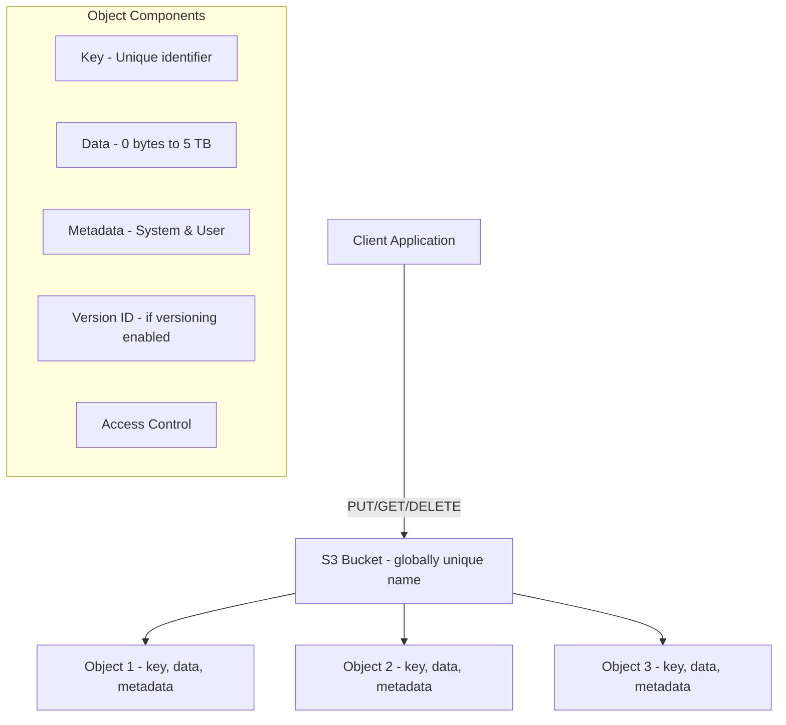

### Key Concepts

| Concept | Details |
|---------|---------|
| **Bucket** | Container for objects, globally unique name, region-specific |
| **Object** | Data + metadata + key, up to 5 TB |
| **Key** | Full path to object in bucket (e.g., `photos/2024/january/img001.jpg`) |
| **Region** | Bucket resides in a specific AWS region |
| **Bucket Policy** | JSON-based resource policy for bucket-level access |
| **Access Points** | Named network endpoints for bucket access |

## Storage Classes

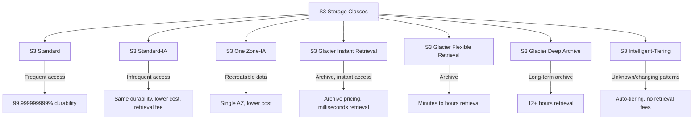

| Storage Class | Use Case | Retrieval Time | Min Duration | Min Size |
|--------------|----------|---------------|-------------|----------|
| **S3 Standard** | Frequently accessed data | Instant | None | None |
| **S3 Standard-IA** | Infrequent access, rapid retrieval | Instant | 30 days | 128 KB |
| **S3 One Zone-IA** | Infrequent, recreatable data | Instant | 30 days | 128 KB |
| **S3 Glacier Instant Retrieval** | Archive, instant access needed | Milliseconds | 90 days | 128 KB |
| **S3 Glacier Flexible Retrieval** | Archive, occasional access | Minutes to hours | 90 days | None |
| **S3 Glacier Deep Archive** | Long-term archive | 12-48 hours | 180 days | None |
| **S3 Intelligent-Tiering** | Unknown or changing patterns | Instant | None | None |

### S3 Intelligent-Tiering

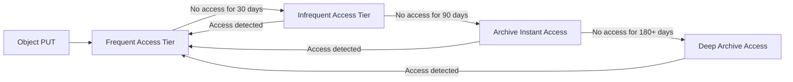

Automatically moves objects between access tiers based on usage patterns. No retrieval fees.

## S3 Lifecycle Rules

Automate transitioning objects between storage classes and expiring (deleting) them:

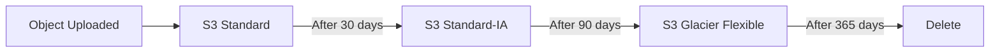

```json
{
    "Rules": [
        {
            "ID": "TransitionToIA",
            "Filter": { "Prefix": "logs/" },
            "Status": "Enabled",
            "Transitions": [
                {
                    "Days": 30,
                    "StorageClass": "STANDARD_IA"
                },
                {
                    "Days": 90,
                    "StorageClass": "GLACIER"
                }
            ],
            "Expiration": {
                "Days": 365
            }
        }
    ]
}
```

**Lifecycle Rule Components:**
- **Filter**: Which objects to target (prefix, tags, or all)
- **Transitions**: Move to cheaper storage class after N days
- **Expiration**: Delete objects after N days
- **NoncurrentVersionTransitions**: Apply to old versions
- **NoncurrentVersionExpiration**: Delete old versions

## S3 Versioning

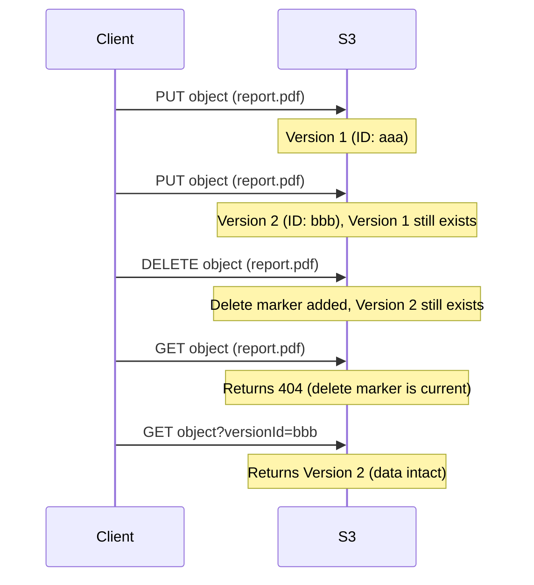

**Versioning Details:**
- Once enabled, cannot be disabled (only suspended)
- All versions are stored (including deletes—they become "delete markers")
- Protects against accidental deletion and overwrites
- Can be used with lifecycle rules to delete old versions
- MFA Delete: Require MFA to permanently delete versions

## S3 Consistency Model

Since December 2020, S3 provides **strong read-after-write consistency**:

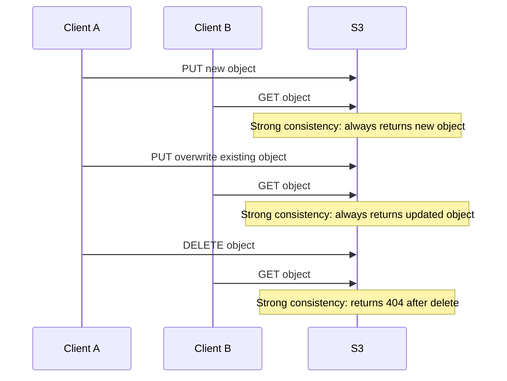

| Operation | Consistency |
|-----------|------------|
| **PUT (new object)** | Strong read-after-write |
| **PUT (overwrite)** | Strong read-after-write |
| **DELETE** | Strong read-after-write |
| **LIST** | Strong consistency |

> **Historical note**: Before December 2020, S3 had eventual consistency for overwrite PUTs and DELETEs. This is no longer the case.

## S3 Security

### Access Control

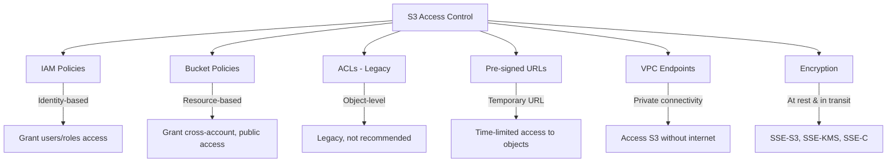

### Encryption

| Method | Key Management | Use Case |
|--------|---------------|----------|
| **SSE-S3** | AWS manages keys (AES-256) | Simple, default encryption |
| **SSE-KMS** | AWS KMS managed keys | Audit trail, key rotation, cross-service |
| **SSE-C** | Customer provides key | Full customer control |
| **Client-Side** | Customer encrypts before upload | Maximum control |

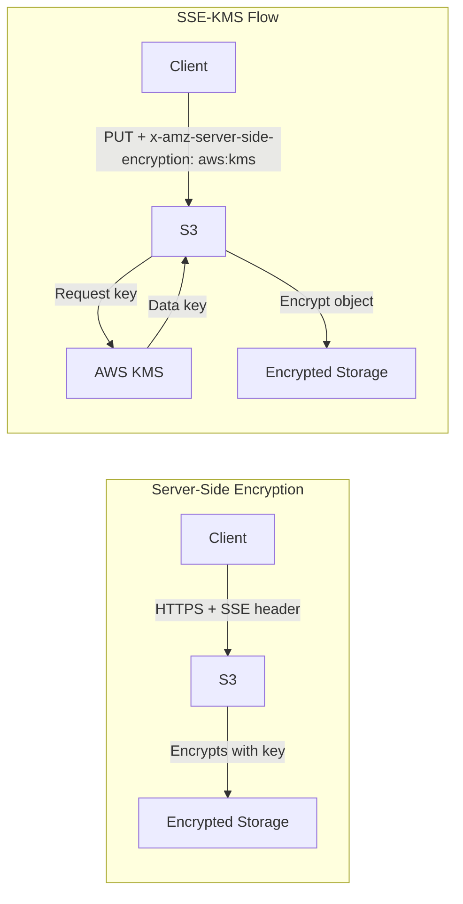

### Block Public Access

S3 Block Public Access settings override bucket policies and ACLs:

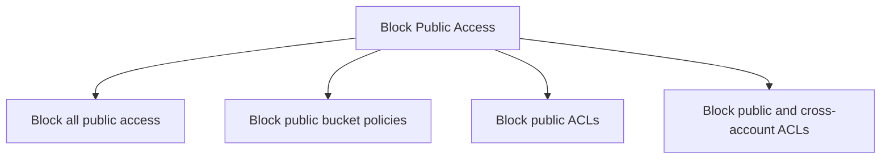

> **Best Practice**: Enable "Block all public access" at the account level unless you specifically need public buckets (e.g., static website hosting).

## S3 Features

### Cross-Region Replication (CRR)

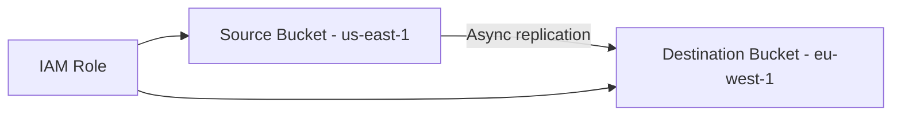

- Requires versioning enabled on both buckets
- Asynchronous replication (typically minutes)
- Replicates new objects and updates
- Use cases: compliance, latency reduction, disaster recovery

### S3 Transfer Acceleration

Uses CloudFront's edge locations to accelerate uploads to S3:

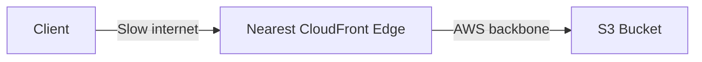

- Upload to nearest edge location → fast transfer over AWS backbone
- Useful for long-distance uploads (e.g., uploading from Asia to US bucket)

### S3 Event Notifications

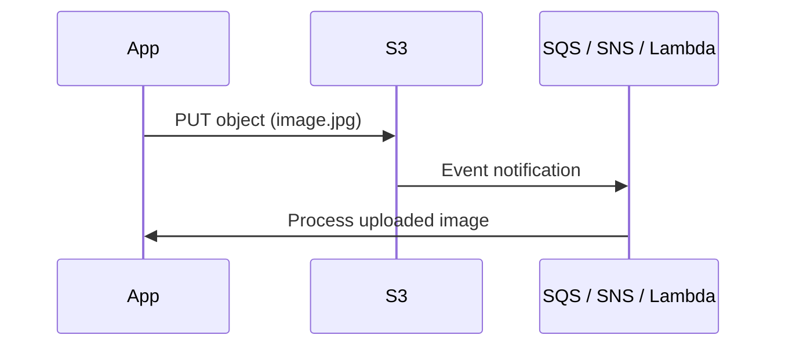

Triggers on: PUT, POST, COPY, DELETE, restore events. Routes to: SNS, SQS, Lambda.

## S3 Static Website Hosting

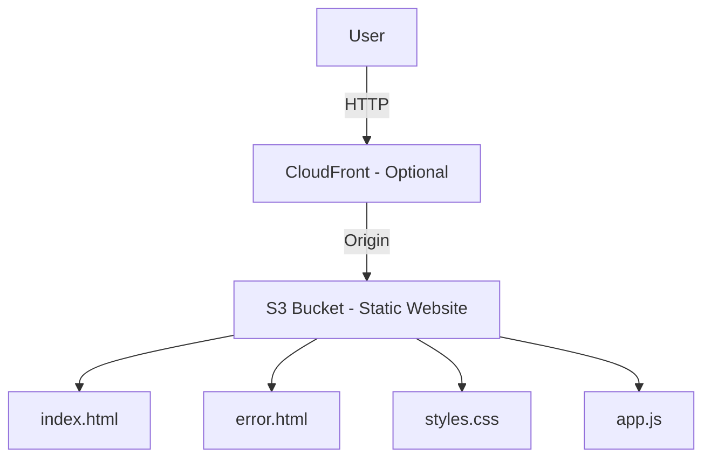

```bash
# Enable static website hosting
aws s3 website s3://my-bucket \
    --index-document index.html \
    --error-document error.html
```

## S3 Performance

| Optimization | Details |
|-------------|---------|
| **Multi-part Upload** | Required for objects > 5 GB, recommended > 100 MB |
| **S3 Transfer Acceleration** | Fast long-distance uploads via CloudFront edges |
| **Byte-Range Fetches** | Parallel downloads by fetching byte ranges |
| **Request Rate** | 5,500 GET/s and 3,500 PUT/s per prefix |
| **Prefix Optimization** | Use randomized prefixes for high request rates |

```bash
# Multi-part upload for large files
aws s3 cp large-file.zip s3://my-bucket/ --storage-class STANDARD
# AWS CLI automatically uses multi-part for large files
```

## Interview Questions

### Q1: What are the different S3 storage classes and when would you use each?
**Answer**: S3 Standard for frequently accessed data. Standard-IA for infrequent access with rapid retrieval needs (30-day minimum). One Zone-IA for recreatable infrequent data (single AZ). Glacier Instant Retrieval for archive data needing millisecond access. Glacier Flexible for archive with minutes-to-hours retrieval. Glacier Deep Archive for long-term archive (12-48 hour retrieval). Intelligent-Tiering when access patterns are unknown—it auto-tiering based on usage.

### Q2: Explain S3 versioning and its implications.
**Answer**: Versioning preserves all versions of an object, including overwrites and deletes. When enabled, PUTs create new versions; DELETEs add delete markers. This protects against accidental deletion—you can retrieve any previous version. Cannot be disabled, only suspended. Costs increase since all versions are stored (use lifecycle rules to manage old versions). MFA Delete adds an extra security layer requiring MFA for permanent deletion.

### Q3: What is S3's consistency model?
**Answer**: S3 provides strong read-after-write consistency for all operations since December 2020. A read immediately after a PUT (new or overwrite) always returns the latest data. DELETEs are also strongly consistent—GETs after DELETE return 404. LIST operations are also strongly consistent. This replaced the previous eventual consistency model for overwrites and deletes.

### Q4: How do you secure an S3 bucket?
**Answer**: (1) Enable Block Public Access at account level, (2) Use bucket policies with least privilege, (3) Enable default encryption (SSE-S3 or SSE-KMS), (4) Use VPC endpoints for private access, (5) Enable access logging and CloudTrail data events, (6) Use pre-signed URLs for temporary access, (7) Enable versioning and MFA Delete for critical data, (8) Use S3 Object Lock for compliance (WORM).

### Q5: How would you optimize S3 performance for a high-throughput workload?
**Answer**: (1) Use multi-part upload for objects > 100 MB, (2) Randomize key prefixes to distribute across partitions (avoid sequential prefixes), (3) Use S3 Transfer Acceleration for long-distance uploads, (4) Use byte-range fetches for parallel downloads, (5) Use CloudFront for read-heavy workloads (caching at edge), (6) Consider S3 Express One Zone for single-digit millisecond latency. S3 scales automatically—5,500 GET and 3,500 PUT per prefix per second.

## Common Mistakes

1. **Public bucket exposure**: Not enabling Block Public Access—leads to data breaches
2. **No versioning on critical buckets**: Accidental overwrites/deletes are unrecoverable
3. **Ignoring lifecycle rules**: Keeping all data in Standard forever when it could be archived
4. **Using Glacier for frequently accessed data**: Retrieval fees make it expensive for frequent access
5. **Not using multi-part upload**: Large single-part uploads fail and waste bandwidth on retry
6. **Sequential key prefixes**: Causing S3 partition hot spots and throttling
7. **Storing secrets in S3 without encryption**: Always encrypt sensitive data

## Summary

| Concept | Key Takeaway |
|---------|-------------|
| **Object Storage** | Key-value store, objects up to 5 TB |
| **Storage Classes** | Match access frequency to cost (Standard → Glacier Deep Archive) |
| **Versioning** | Preserves all versions, protects against accidental deletion |
| **Consistency** | Strong read-after-write since Dec 2020 |
| **Lifecycle Rules** | Automate transitions and expiration |
| **Security** | Block Public Access + encryption + IAM + VPC endpoints |

## Cross-References

- **EC2**: [Instances](./ec2.md) — Compute that accesses S3
- **Lambda**: [Event Sources](./lambda.md) — S3 event triggers
- **VPC**: [Endpoints](./vpc.md) — Private S3 access
- **CI/CD**: [Pipelines](../cicd/pipelines.md) — Store build artifacts in S3
- **Cloud Overview**: [Storage Models](../overview.md) — Cloud storage concepts
