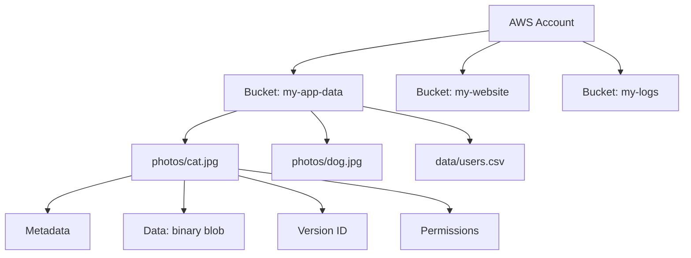
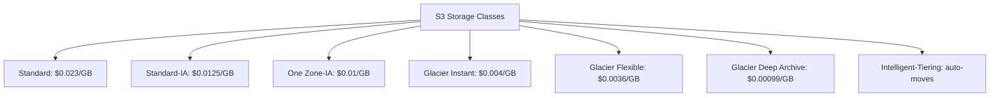
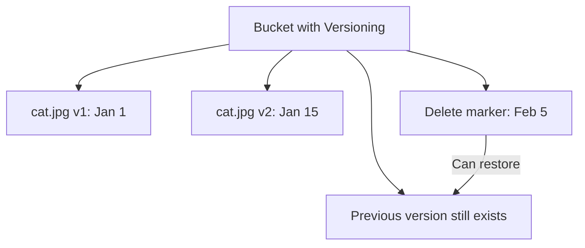
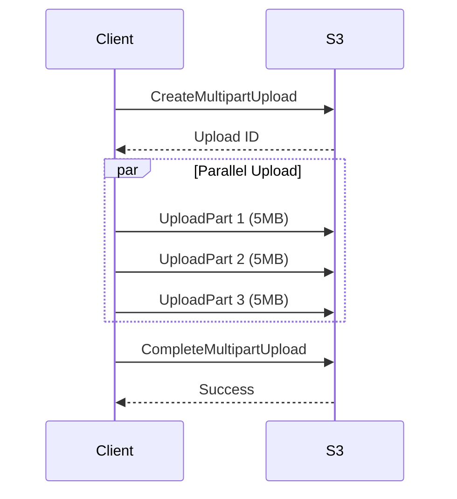
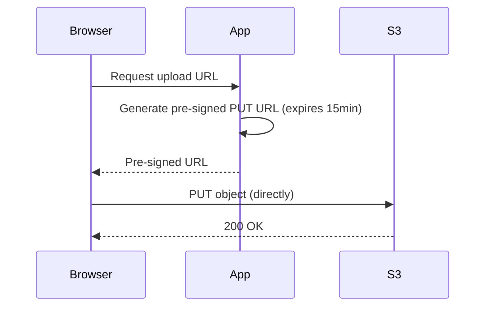
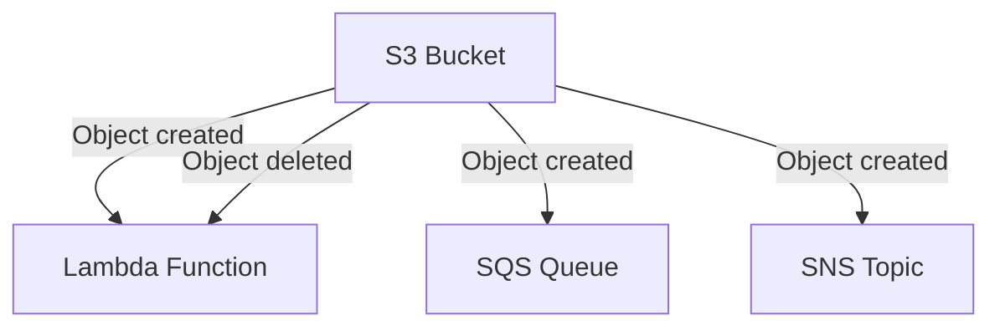
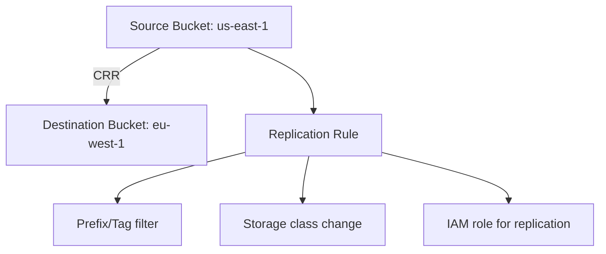
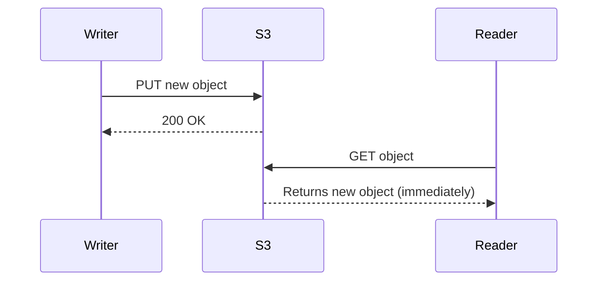
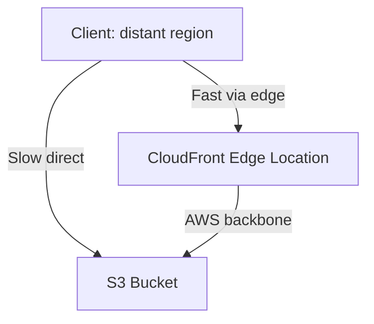
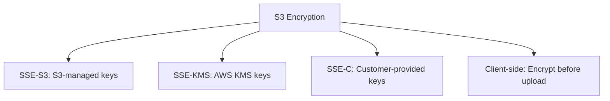

# AWS S3 (Simple Storage Service)

## Overview

Amazon S3 is AWS's object storage service, designed for 99.999999999% (11 nines) durability and 99.99% availability. It stores data as objects in buckets, accessible via HTTP/HTTPS APIs. S3 is one of the most widely used AWS services and a frequent interview topic.

## Core Concepts

### Buckets and Objects



- **Bucket**: Container for objects. Globally unique name. Region-specific.
- **Object**: Data + metadata + key. Max size: 5 TB. Stored as key-value pair.
- **Key**: Full path (e.g., `photos/cat.jpg`). Flat namespace (no real directories).

### S3 Storage Classes



| Class | Availability | Retrieval | Min Duration | Use Case |
|-------|-------------|-----------|--------------|----------|
| Standard | 99.99% | Instant | None | Active data |
| Standard-IA | 99.9% | Instant | 30 days | Infrequent access |
| One Zone-IA | 99.5% | Instant | 30 days | Reconstructable data |
| Glacier Instant | 99.9% | Instant | 90 days | Archive, fast retrieval |
| Glacier Flexible | 99.99% | 1-5 min | 90 days | Archive |
| Glacier Deep Archive | 99.99% | 12-48 hours | 180 days | Long-term archive |
| Intelligent-Tiering | 99.9% | Instant | None | Unknown patterns |

## Key Features

### Versioning



### Lifecycle Policies

```json
{
    "Rules": [{
        "ID": "ArchiveRule",
        "Status": "Enabled",
        "Filter": { "Prefix": "logs/" },
        "Transitions": [
            { "Days": 30, "StorageClass": "STANDARD_IA" },
            { "Days": 90, "StorageClass": "GLACIER" }
        ],
        "Expiration": { "Days": 365 }
    }]
}
```

### Multipart Upload



For files > 100MB. Enables parallel upload, resume on failure, and no single-part size limit.

### Pre-Signed URLs



Pre-signed URLs allow clients to upload/download directly to S3 without proxying through your server.

### S3 Event Notifications



Trigger actions when objects are created, deleted, or restored.

### S3 Replication



Cross-Region Replication (CRR) replicates objects to another region for disaster recovery or compliance.

## S3 Consistency Model

Since December 2020, S3 provides **strong read-after-write consistency**:



All S3 operations (GET, PUT, LIST, DELETE) are strongly consistent.

## S3 Performance

### Request Rate

| Operation | Performance |
|-----------|-------------|
| PUT/POST/DELETE | 5,500 requests/second per prefix |
| GET | 5,500 requests/second per prefix |
| Prefix | Use random prefixes for >5,500 req/s |

### S3 Transfer Acceleration



Uses CloudFront edge locations to accelerate uploads to S3.

## Security

### Encryption



### Bucket Policies

```json
{
    "Version": "2012-10-17",
    "Statement": [{
        "Sid": "PublicReadGetObject",
        "Effect": "Allow",
        "Principal": "*",
        "Action": "s3:GetObject",
        "Resource": "arn:aws:s3:::my-bucket/*"
    }]
}
```

## Interview Questions

1. **Q: How does S3 achieve 11 nines of durability?**
   A: S3 replicates data across at least 3 AZs within a region. Each object is checksummed (MD5) and verified on read. Automatic repair detects and replaces corrupted copies. The probability of losing an object is 0.00000000001% per year.

2. **Q: What is the difference between S3 Standard and Glacier?**
   A: Standard is for frequently accessed data with instant retrieval ($0.023/GB). Glacier is for archival data with delayed retrieval (1-5 min to 12-48 hours) at much lower cost ($0.00099-0.004/GB). Use lifecycle policies to automatically transition data.

3. **Q: How do pre-signed URLs work?**
   A: The server generates a URL with a temporary signature using AWS credentials. The URL includes an expiration time. The client uses this URL to directly access S3 (upload or download) without the server proxying the data. This offloads bandwidth from your server.

4. **Q: What is S3 consistency model?**
   A: Since December 2020, S3 provides strong read-after-write consistency for all operations. A PUT is immediately visible to subsequent GETs and LISTs. Previously, S3 was eventually consistent for overwrites and deletes.

5. **Q: How would you optimize S3 for high-throughput workloads?**
   A: Use random key prefixes to distribute across partitions (avoid sequential prefixes). Use multipart upload for large files. Enable Transfer Acceleration for distant clients. Use byte-range fetches for parallel downloads. Consider S3 Select to query objects without downloading.

## Common Mistakes

- Using sequential key prefixes — causes hotspotting on S3 partitions.
- Not enabling versioning — accidental deletes are permanent.
- Using S3 Standard for all data — lifecycle policies can save 50-90%.
- Storing secrets in S3 without encryption — enable SSE-S3 or SSE-KMS.
- Making buckets public accidentally — use Block Public Access settings.

## Summary

S3 is AWS's object storage with 11 nines durability. Data is stored as objects in buckets with rich metadata. Key features: versioning, lifecycle policies, pre-signed URLs, event notifications, and cross-region replication. Storage classes optimize cost based on access patterns. For interviews, understand consistency model, storage classes, multipart upload, and security best practices.

## Cross-References

- [Object Storage](../../storage/object-storage.md) — Object storage concepts
- [EBS](./ec2.md) — Block storage alternative
- [Erasure Coding](../../storage/erasure-coding.md) — How S3 achieves durability
- [AWS Overview](./README.md) — All AWS services
