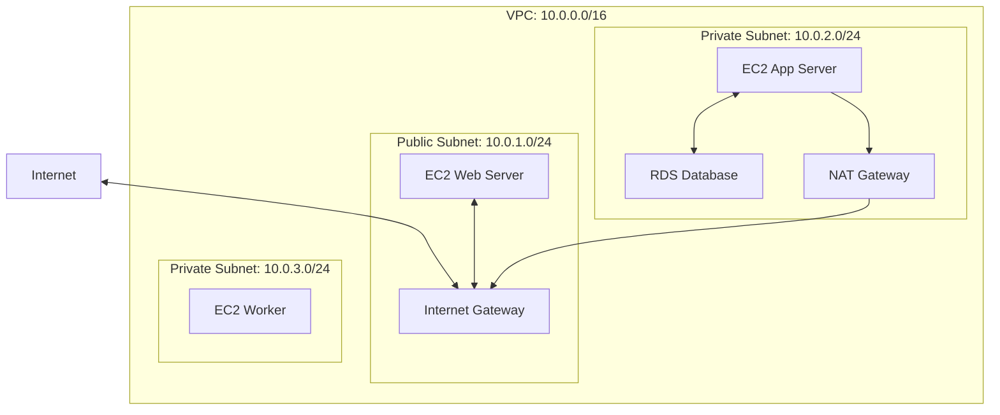
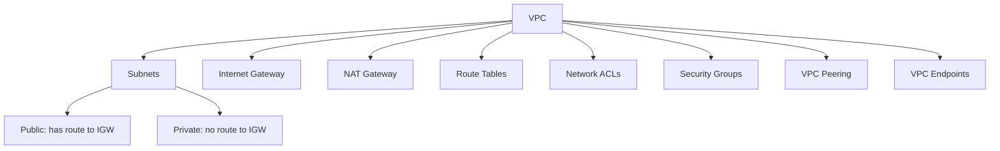
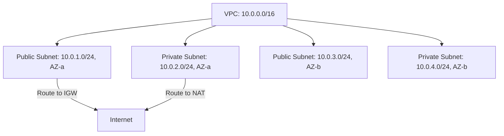
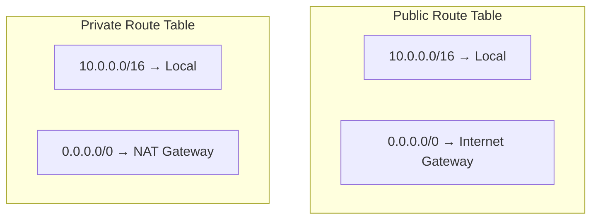
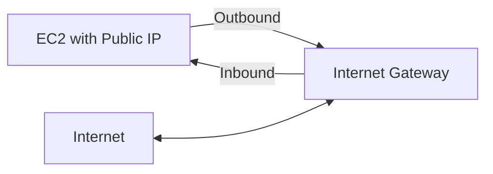
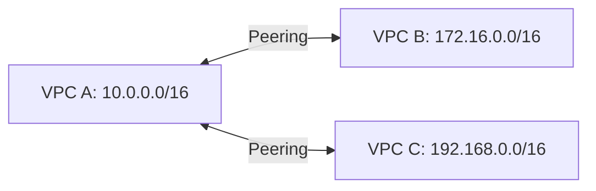
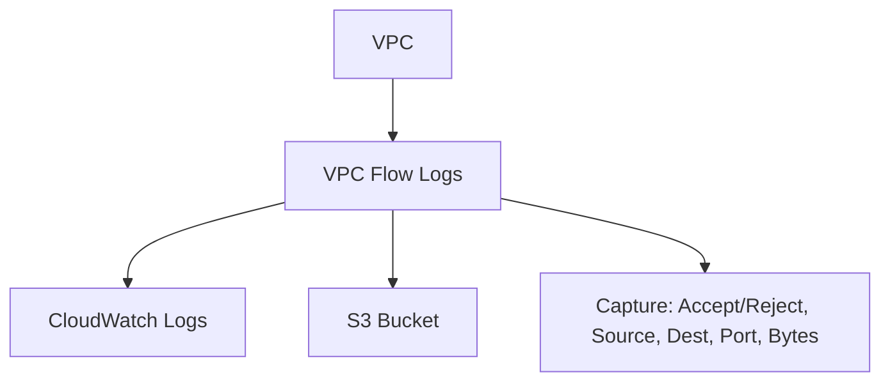

# AWS VPC (Virtual Private Cloud)

## Overview

VPC is AWS's networking foundation — a virtual network isolated to your AWS account. It gives you complete control over IP addressing, subnets, routing, and network security. Every AWS resource (EC2, RDS, Lambda) runs inside a VPC. Understanding VPC is essential for designing secure, scalable cloud architectures.

## VPC Architecture



### Key Components



## Subnets



**Public subnet**: Has a route to an Internet Gateway. Resources get public IPs.
**Private subnet**: No direct internet route. Resources use NAT Gateway for outbound.

## Routing

### Route Tables



### Internet Gateway



Internet Gateway enables communication between VPC and the internet. It performs NAT for public IPs.

### NAT Gateway

```mermaid
graph LR
    EC2_PRIVATE[EC2 (no public IP)] -->|Outbound only| NAT[NAT Gateway]
    NAT -->|Outbound| IGW[Internet Gateway]
    IGW --> INTERNET[Internet]

    INTERNET -.->|Cannot initiate inbound| EC2_PRIVATE
```

NAT Gateway allows private instances to access the internet (for updates, API calls) while preventing inbound connections.

## Security

### Security Groups vs NACLs

```mermaid
graph TD
    SG[Security Groups] --> SG1[Instance level]
    SG --> SG2[Stateful (return traffic auto-allowed)]
    SG --> SG3[Allow rules only]
    SG --> SG4[All rules evaluated]

    NACL[Network ACLs] --> NACL1[Subnet level]
    NACL --> NACL2[Stateless (must allow return traffic)]
    NACL --> NACL3[Allow and deny rules]
    NACL --> NACL4[Rules evaluated in order]
```

| Feature | Security Group | Network ACL |
|---------|---------------|-------------|
| Level | Instance | Subnet |
| State | Stateful | Stateless |
| Rules | Allow only | Allow and Deny |
| Evaluation | All rules | In order (first match) |
| Default | Deny all inbound | Allow all |

### Security Group Example

```json
{
    "GroupId": "sg-12345",
    "InboundRules": [
        {"Protocol": "TCP", "Port": 443, "Source": "0.0.0.0/0"},
        {"Protocol": "TCP", "Port": 22, "Source": "203.0.113.0/24"}
    ],
    "OutboundRules": [
        {"Protocol": "All", "Port": "All", "Destination": "0.0.0.0/0"}
    ]
}
```

## VPC Peering



VPC Peering connects two VPCs using private IP addresses. Traffic stays on the AWS backbone. No transitive peering (A↔B and B↔C doesn't mean A↔C).

## VPC Endpoints

```mermaid
graph TD
    EC2[EC2 in Private Subnet] -->|Without endpoint| INTERNET[Internet → S3]
    EC2 -->|With endpoint| ENDPOINT[VPC Endpoint → S3]
    ENDPOINT --> S3[S3: aws::s3]

    EP_TYPES[Endpoint Types] --> GATEWAY[Gateway: S3, DynamoDB (free)]
    EP_TYPES --> INTERFACE[Interface: Other services (ENI, hourly cost)]
```

VPC Endpoints allow private instances to access AWS services without going through the internet.

## Flow Logs



Flow Logs capture information about IP traffic going to and from network interfaces.

## Interview Questions

1. **Q: What is a VPC?**
   A: A Virtual Private Cloud is an isolated virtual network in AWS. You define IP address ranges, create subnets, configure routing, and set up security. It's the networking foundation for all AWS resources.

2. **Q: What is the difference between a public and private subnet?**
   A: A public subnet has a route to an Internet Gateway, and its resources can have public IPs. A private subnet has no direct internet route — resources use NAT Gateway for outbound-only internet access. Databases and app servers typically go in private subnets.

3. **Q: What is the difference between Security Groups and NACLs?**
   A: Security Groups are stateful (return traffic auto-allowed), operate at instance level, and allow rules only. NACLs are stateless (must explicitly allow return traffic), operate at subnet level, and support both allow and deny rules. Use Security Groups as primary defense; NACLs as secondary.

4. **Q: How would you design a VPC for a web application?**
   A: Public subnets (2 AZs) for load balancers and bastion hosts. Private subnets (2 AZs) for application servers. Private subnets (2 AZs) for databases. NAT Gateway in public subnet for outbound internet from private subnets. Security Groups restrict traffic between tiers.

5. **Q: What is a VPC Endpoint?**
   A: A VPC Endpoint enables private connectivity to AWS services without traversing the internet. Gateway endpoints (free) for S3 and DynamoDB. Interface endpoints (hourly cost) for other services. This improves security and reduces data transfer costs.

## Common Mistakes

- Placing databases in public subnets — always use private subnets for data stores.
- Opening SSH (port 22) to 0.0.0.0/0 — use VPN or bastion host.
- Not using multiple AZs — single AZ is a single point of failure.
- Forgetting to update route tables after creating subnets.
- Not enabling VPC Flow Logs — essential for security auditing and troubleshooting.

## Summary

VPC provides isolated networking for AWS resources. Key components: subnets (public/private), Internet Gateway, NAT Gateway, route tables, Security Groups, and NACLs. For interviews, understand the difference between public/private subnets, Security Groups vs NACLs, and how to design multi-tier VPC architectures.

## Cross-References

- [EC2](./ec2.md) — Runs inside VPC
- [RDS](./rds.md) — Deployed in VPC subnets
- [Lambda](./lambda.md) — Can be VPC-connected
- [AWS Overview](./README.md) — All AWS services
- [Cloud Overview](../overview.md) — Cloud fundamentals
