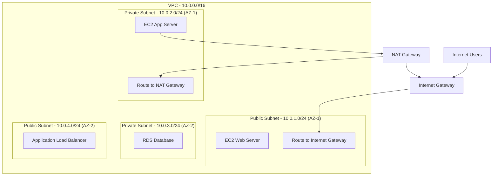
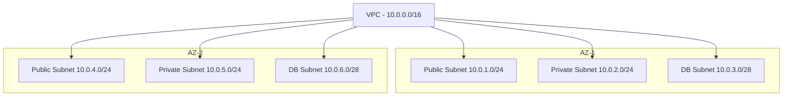
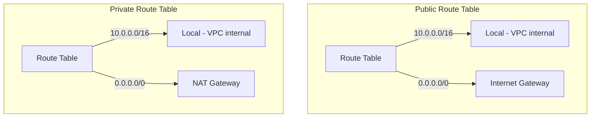
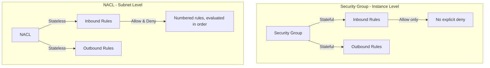
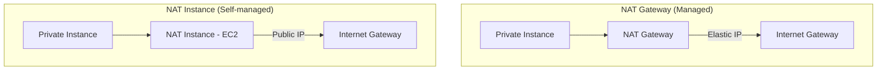
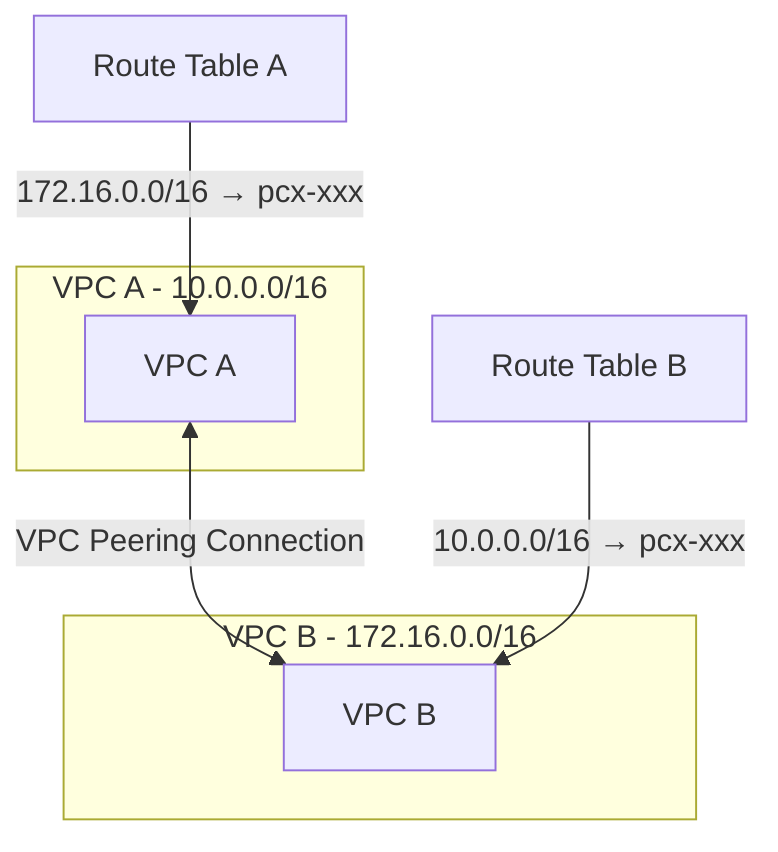
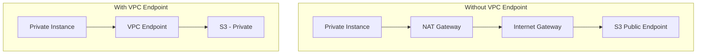
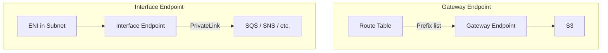
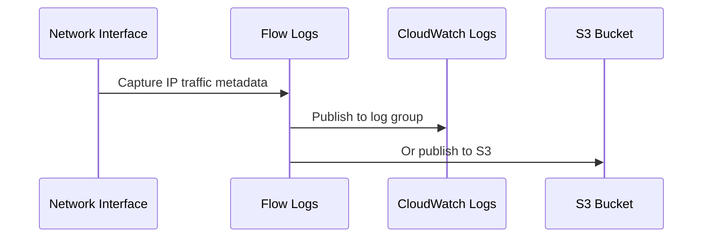
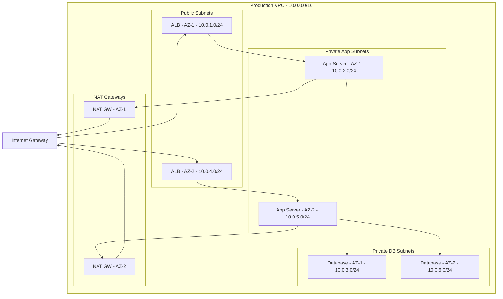

# Amazon VPC (Virtual Private Cloud)

## Introduction

Amazon VPC lets you provision a logically isolated section of the AWS Cloud where you can launch AWS resources in a virtual network that you define. You have complete control over your virtual networking environment, including IP address ranges, subnets, route tables, and network gateways.

## VPC Architecture



### Key VPC Components

| Component | Description |
|-----------|-------------|
| **VPC** | Virtual network, defined by CIDR block (e.g., 10.0.0.0/16) |
| **Subnet** | Subdivision of VPC in a specific AZ |
| **Internet Gateway (IGW)** | Connects VPC to the internet |
| **NAT Gateway** | Allows private instances to access internet (outbound only) |
| **Route Table** | Rules that determine where network traffic is directed |
| **Security Group** | Stateful firewall at the instance level |
| **Network ACL (NACL)** | Stateless firewall at the subnet level |
| **VPC Endpoint** | Private connection to AWS services |

## Subnets



### Public vs Private Subnets

| Aspect | Public Subnet | Private Subnet |
|--------|--------------|----------------|
| **Internet Access** | Direct via IGW | Via NAT Gateway (outbound) |
| **Route Table** | Has route to IGW | No route to IGW, route to NAT |
| **Public IP** | Can assign | Not directly reachable |
| **Use Case** | Web servers, load balancers | App servers, databases |

**Determining factor**: A subnet is "public" if its route table has a route to an Internet Gateway.

## Route Tables



| Route | Destination | Target | Purpose |
|-------|-------------|--------|---------|
| **Local** | VPC CIDR | local | Intra-VPC communication (always exists, cannot delete) |
| **Public** | 0.0.0.0/0 | Internet Gateway | Internet access |
| **Private** | 0.0.0.0/0 | NAT Gateway | Outbound internet for private subnets |
| **VPC Peering** | Peer VPC CIDR | pcx-xxxxx | Cross-VPC communication |

## Security Groups vs NACLs



| Feature | Security Group | NACL |
|---------|---------------|------|
| **Level** | Instance (ENI) | Subnet |
| **State** | Stateful (return traffic auto-allowed) | Stateless (must allow return traffic explicitly) |
| **Rules** | Allow only | Allow and Deny |
| **Evaluation** | All rules evaluated | Rules evaluated in order (lowest number first) |
| **Default** | Deny all inbound, allow all outbound | Allow all inbound and outbound |
| **Multiple** | Instance can have multiple SGs | Subnet has one NACL |

### Security Group Example

```json
{
    "GroupId": "sg-0123456789abcdef0",
    "InboundRules": [
        {
            "Protocol": "tcp",
            "Port": 443,
            "Source": "0.0.0.0/0",
            "Description": "HTTPS from anywhere"
        },
        {
            "Protocol": "tcp",
            "Port": 22,
            "Source": "203.0.113.0/24",
            "Description": "SSH from office IP"
        }
    ],
    "OutboundRules": [
        {
            "Protocol": "-1",
            "Port": "All",
            "Destination": "0.0.0.0/0",
            "Description": "All outbound traffic"
        }
    ]
}
```

### NACL Example

| Rule # | Type | Protocol | Port | Source | Action |
|--------|------|----------|------|--------|--------|
| 100 | HTTP | TCP | 80 | 0.0.0.0/0 | ALLOW |
| 110 | HTTPS | TCP | 443 | 0.0.0.0/0 | ALLOW |
| 120 | SSH | TCP | 22 | 203.0.113.0/24 | ALLOW |
| 200 | Ephemeral | TCP | 1024-65535 | 0.0.0.0/0 | ALLOW |
| * | All | All | All | 0.0.0.0/0 | DENY |

> **Key**: NACLs are stateless—you must explicitly allow both inbound AND outbound (including ephemeral ports for return traffic).

## NAT Gateway vs NAT Instance



| Feature | NAT Gateway | NAT Instance |
|---------|------------|-------------|
| **Management** | Fully managed by AWS | You manage (patch, scale) |
| **Availability** | Highly available within AZ | Single EC2 (need ASG for HA) |
| **Bandwidth** | Up to 100 Gbps | Depends on instance type |
| **Performance** | Automatic scaling | Limited by instance |
| **Cost** | Higher ($0.045/hr + data) | Lower (EC2 instance cost) |
| **Security Groups** | No | Yes |
| **Use Case** | Production | Dev/test, cost-sensitive |

> **Note**: NAT Gateway is per-AZ. For multi-AZ high availability, deploy a NAT Gateway in each AZ.

## VPC Peering



**VPC Peering Characteristics:**
- Direct network connection between two VPCs
- Uses AWS backbone (not public internet)
- No transitive peering (A↔B and B↔C doesn't mean A↔C)
- CIDR blocks must not overlap
- Can be cross-region and cross-account

## VPC Endpoints



### Endpoint Types

| Type | Service | Connection | Use Case |
|------|---------|------------|----------|
| **Gateway Endpoint** | S3, DynamoDB | Route table entry | Free, no NAT needed |
| **Interface Endpoint (PrivateLink)** | Most AWS services | ENI in subnet | Private IP access to services |



## VPC Flow Logs



**Flow Log Record Format:**
```
version account-id interface-id srcaddr dstaddr srcport dstport protocol packets bytes start end action log-status
2 123456789012 eni-0123456789 10.0.1.50 10.0.2.100 49152 3306 6 10 840 1620142800 1620142860 ACCEPT OK
```

**What Flow Logs capture (and don't):**
- ✅ Source/destination IP, ports, protocol, action (ACCEPT/REJECT)
- ✅ Packet and byte counts
- ❌ Actual packet content (no payload)
- ❌ DNS traffic to Amazon-provided DNS
- ❌ Instance metadata (169.254.169.254)

## NAT Gateway vs Internet Gateway

| Feature | Internet Gateway | NAT Gateway |
|---------|-----------------|-------------|
| **Purpose** | Bidirectional internet access | Outbound-only internet access |
| **IP** | Public IP on instance | Elastic IP on NAT |
| **Direction** | Inbound + Outbound | Outbound only |
| **Subnet** | Public subnet | Private subnet (routes through NAT) |
| **Cost** | Free | Per-hour + per-GB charges |

## Complete VPC Design



## Interview Questions

### Q1: Explain the difference between Security Groups and NACLs.
**Answer**: Security Groups operate at the instance level, are stateful (return traffic auto-allowed), and support only allow rules. NACLs operate at the subnet level, are stateless (must explicitly allow return traffic), and support both allow and deny rules. Security Groups evaluate all rules; NACLs evaluate in rule number order. Use Security Groups for instance-level control; use NACLs for subnet-level defense in depth (e.g., blocking known malicious IPs).

### Q2: What is a NAT Gateway and when do you need one?
**Answer**: A NAT Gateway allows instances in private subnets to access the internet for outbound traffic (e.g., downloading updates, calling external APIs) while preventing the internet from initiating connections to those instances. You need one when you have private instances that require internet access but shouldn't be publicly reachable. It's deployed in a public subnet with an Elastic IP, and private subnet route tables direct 0.0.0.0/0 traffic to it.

### Q3: How do you design a highly available VPC?
**Answer**: (1) Use at least 2 AZs, (2) Create public and private subnets in each AZ, (3) Deploy NAT Gateways in each AZ (not just one), (4) Use Application Load Balancer spanning public subnets, (5) Deploy application instances in private subnets across AZs, (6) Place databases in private subnets with Multi-AZ, (7) Use separate route tables per AZ for NAT Gateway routing, (8) Apply least-privilege Security Groups.

### Q4: What is VPC Peering and what are its limitations?
**Answer**: VPC Peering creates a direct network connection between two VPCs using AWS backbone. Limitations: (1) No transitive peering—if A peers with B and B peers with C, A cannot reach C through B, (2) CIDR blocks must not overlap, (3) Cannot peer VPCs with matching or overlapping IPv4/IPv6 CIDRs, (4) Cross-account peering requires acceptor approval. For transitive routing, use Transit Gateway.

### Q5: Explain VPC Endpoints and their types.
**Answer**: VPC Endpoints enable private connectivity to AWS services without traversing the internet. Two types: (1) Gateway Endpoints—for S3 and DynamoDB only, implemented as route table entries, free to use, (2) Interface Endpoints (PrivateLink)—for most AWS services, create an ENI in your subnet with a private IP, charged per-hour and per-GB. Benefits: improved security (no public internet), lower latency (AWS backbone), reduced NAT Gateway costs.

## Common Mistakes

1. **Overlapping CIDR blocks**: VPCs that need peering cannot have overlapping ranges
2. **Single NAT Gateway**: Not deploying per-AZ NAT Gateways creates a single point of failure
3. **Using NACLs for everything**: Security Groups are simpler for most use cases; use NACLs for defense in depth
4. **Forgetting ephemeral ports in NACLs**: Must allow return traffic (ports 1024-65535) in NACL outbound rules
5. **Public subnet for databases**: Databases should always be in private subnets
6. **Overly permissive security groups**: 0.0.0.0/0 on port 22 (SSH) is a security risk
7. **Not using VPC endpoints**: Routing S3 traffic through NAT Gateway wastes money and bandwidth

## Summary

| Concept | Key Takeaway |
|---------|-------------|
| **VPC** | Isolated virtual network with customizable CIDR |
| **Subnets** | Public (IGW route) vs Private (NAT route) |
| **Security Groups** | Stateful, instance-level, allow-only |
| **NACLs** | Stateless, subnet-level, allow & deny |
| **NAT Gateway** | Managed outbound internet for private subnets |
| **VPC Peering** | Direct VPC-to-VPC connection, no transitive |
| **VPC Endpoints** | Private access to AWS services |

## Cross-References

- **EC2**: [ENIs](./ec2.md) — Network interfaces in VPC
- **RDS**: [Multi-AZ](./rds.md) — Database in private subnets
- **Lambda**: [VPC Config](./lambda.md) — Lambda inside VPC
- **Kubernetes**: [Services](../kubernetes/services.md) — K8s networking in VPC
- **Cloud Overview**: [Networking](../overview.md) — Cloud networking concepts
