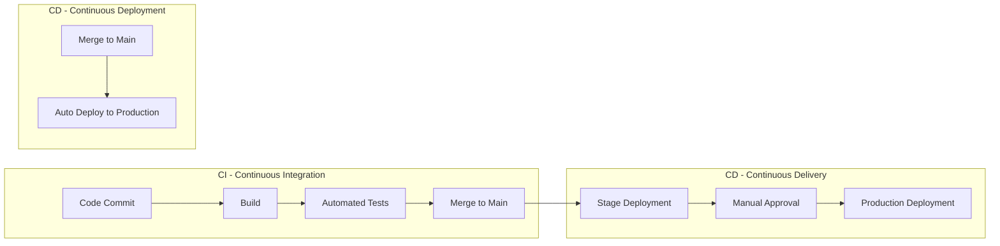
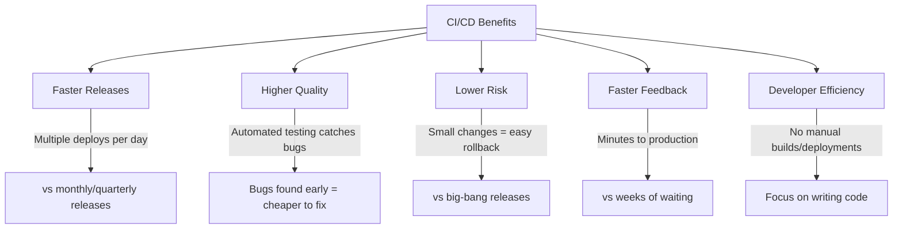
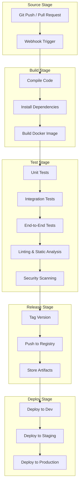
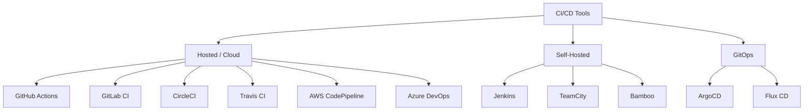
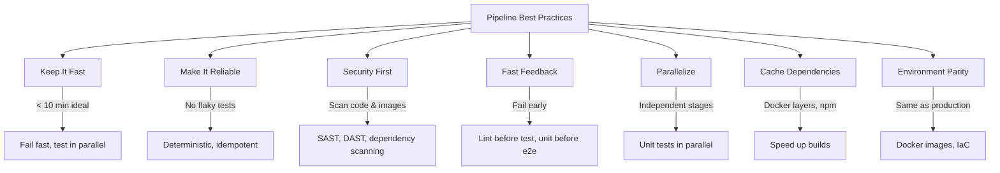
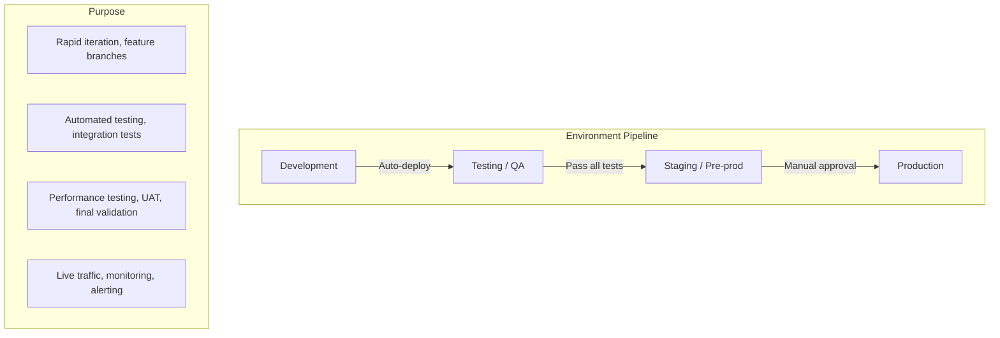
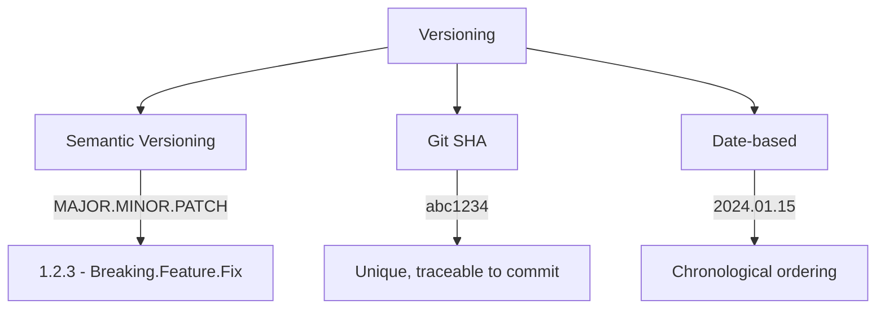

# CI/CD Overview

## Introduction

CI/CD (Continuous Integration / Continuous Delivery / Continuous Deployment) is a set of practices that automate the building, testing, and deployment of applications. It is a cornerstone of modern software development and DevOps culture.

## What is CI/CD?



### Continuous Integration (CI)

The practice of frequently merging code changes into a shared repository, with each merge triggering automated builds and tests.

**Key Principles:**
1. **Commit frequently**: Small, incremental changes (at least daily)
2. **Automate the build**: Every commit triggers a build
3. **Automate testing**: Unit, integration, and end-to-end tests run automatically
4. **Fix broken builds immediately**: The team prioritizes fixing failed builds
5. **Keep builds fast**: Feedback within minutes, not hours

### Continuous Delivery (CD)

The practice of keeping code in a deployable state at all times. Every change that passes automated testing can be deployed to production with a manual approval gate.

### Continuous Deployment (CD)

The practice of automatically deploying every change that passes all tests directly to production—no manual intervention.

| Practice | Trigger | Production Deploy | Risk |
|----------|---------|-------------------|------|
| **CI only** | Code commit | Manual | High (infrequent releases) |
| **CI + Continuous Delivery** | Code commit | Manual approval | Medium |
| **CI + Continuous Deployment** | Code commit | Automatic | Low (small, frequent changes) |

## CI/CD Benefits



## CI/CD Pipeline Components



## CI/CD Tools Landscape



### Tool Comparison

| Tool | Type | Key Strength | Pricing |
|------|------|-------------|---------|
| **GitHub Actions** | Hosted | Tight GitHub integration, marketplace | Free tier + per-minute |
| **GitLab CI** | Hosted/Self-hosted | All-in-one DevOps platform | Free tier + paid plans |
| **Jenkins** | Self-hosted | Highly extensible, massive plugin ecosystem | Free (open source) |
| **CircleCI** | Hosted | Fast builds, Docker-native | Free tier + per-minute |
| **ArgoCD** | GitOps | Declarative K8s deployments | Free (open source) |
| **AWS CodePipeline** | Hosted | Deep AWS integration | Pay per pipeline |

## CI/CD Best Practices

### Pipeline Design



### Pipeline Anti-Patterns

| Anti-Pattern | Problem | Solution |
|-------------|---------|----------|
| **Long pipelines** (>30 min) | Slow feedback, blocks developers | Parallelize, optimize tests |
| **Flaky tests** | Erodes trust in pipeline | Fix or remove flaky tests |
| **Manual steps** | Error-prone, slow | Automate everything |
| **No rollback** | Stuck with broken deployments | Implement automated rollback |
| **Secrets in code** | Security breach | Use secret managers |
| **No caching** | Slow builds | Cache dependencies and Docker layers |
| **Environment drift** | Works in CI, fails in prod | Use same Docker images everywhere |

## Environment Strategy



| Environment | Deploy Trigger | Data | Access |
|-------------|---------------|------|--------|
| **Development** | Every commit | Mock/seeded | Developers |
| **Testing** | Merge to main | Synthetic | QA team |
| **Staging** | Release candidate | Production-like (anonymized) | QA + stakeholders |
| **Production** | Approval or auto | Real | End users |

## Versioning Strategies



**Semantic Versioning (SemVer):**
```
MAJOR.MINOR.PATCH
  |     |     |
  |     |     └── Bug fixes (backward compatible)
  |     └──────── New features (backward compatible)
  └────────────── Breaking changes (not backward compatible)
```

| Change | Version Bump | Example |
|--------|-------------|---------|
| Bug fix | PATCH | 1.0.0 → 1.0.1 |
| New feature | MINOR | 1.0.0 → 1.1.0 |
| Breaking change | MAJOR | 1.0.0 → 2.0.0 |

## Interview Questions

### Q1: What is CI/CD and why is it important?
**Answer**: CI/CD is a set of practices that automate the software delivery process. CI (Continuous Integration) means developers frequently merge code, with each merge triggering automated builds and tests. CD (Continuous Delivery) means code is always in a deployable state, with manual approval for production. CD (Continuous Deployment) means every change that passes tests is automatically deployed to production. It's important because it: reduces time to market, catches bugs early, enables frequent reliable releases, and reduces manual toil.

### Q2: What's the difference between Continuous Delivery and Continuous Deployment?
**Answer**: Continuous Delivery ensures code is always in a deployable state and can be released at any time, but production deployment requires manual approval. Continuous Deployment goes further—every change that passes automated testing is automatically deployed to production without human intervention. Continuous Deployment requires higher confidence in automated testing and monitoring. Most organizations start with Continuous Delivery and progress to Continuous Deployment as their testing matures.

### Q3: How do you design a good CI/CD pipeline?
**Answer**: A good pipeline: (1) Triggers automatically on code changes, (2) Has clear stages (build → test → release → deploy), (3) Runs tests in parallel where possible, (4) Caches dependencies and Docker layers, (5) Fails fast—lint and unit tests before integration tests, (6) Produces artifacts (Docker images, binaries), (7) Includes security scanning (SAST, dependency check), (8) Supports rollback, (9) Takes < 10 minutes for CI feedback, (10) Uses environment parity (same images in all environments).

### Q4: How do you handle secrets in CI/CD?
**Answer**: Never store secrets in code, config files, or environment variables in plain text. Use: (1) CI/CD platform secrets (GitHub Secrets, GitLab CI Variables), (2) External secret managers (AWS Secrets Manager, HashiCorp Vault), (3) Kubernetes Secrets with external secret operators, (4) Encrypted environment variables, (5) Short-lived tokens instead of long-lived credentials, (6) Principle of least privilege for CI/CD service accounts. Audit secret access and rotate regularly.

### Q5: What is GitOps and how does it differ from traditional CI/CD?
**Answer**: GitOps uses Git as the single source of truth for declarative infrastructure and applications. Instead of CI/CD pipelines pushing changes to environments, GitOps controllers (ArgoCD, Flux) pull changes from Git and reconcile the actual state. Traditional CI/CD: pipeline pushes to environment. GitOps: Git commit → controller detects drift → applies changes. Benefits: auditability (Git history), easy rollback (git revert), consistency (declarative), security (no cluster credentials in CI).

## Common Mistakes

1. **No automated testing**: CI without tests is just continuous building
2. **Too many manual gates**: Slows down delivery, defeats automation purpose
3. **Not testing in production-like environments**: "Works on my machine" syndrome
4. **Ignoring pipeline security**: Storing secrets in code, overly permissive service accounts
5. **Long-lived feature branches**: Merge conflicts, integration issues
6. **No rollback strategy**: Can't recover from bad deployments quickly
7. **Skipping staging**: Deploying directly to production without validation

## Summary

| Concept | Key Takeaway |
|---------|-------------|
| **CI** | Automated build + test on every commit |
| **Continuous Delivery** | Always deployable, manual approval for prod |
| **Continuous Deployment** | Auto-deploy to production on every commit |
| **Pipeline** | Build → Test → Release → Deploy stages |
| **Best Practices** | Fast feedback, parallel tests, caching, security scanning |
| **GitOps** | Git as source of truth, declarative reconciliation |

## Cross-References

- **Pipelines**: [Stages & Strategies](./pipelines.md) — Detailed pipeline design
- **GitOps**: [ArgoCD & Flux](./gitops.md) — Declarative deployments
- **Kubernetes**: [Deployments](../kubernetes/deployments.md) — What CI/CD deploys to
- **Docker**: [Containers](../virtualization/vm-vs-container.md) — What CI/CD builds
- **AWS**: [CodePipeline](../aws/README.md) — AWS CI/CD services
- **Observability**: [Monitoring](../observability/monitoring.md) — Deployment monitoring
