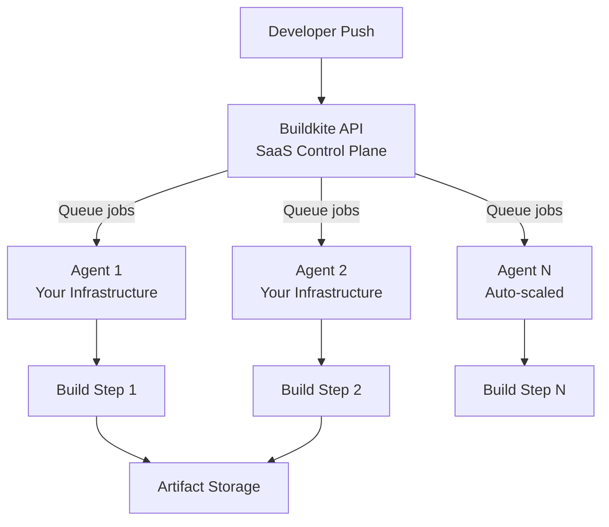
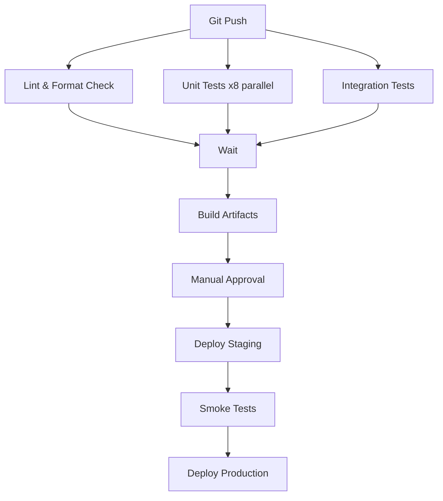
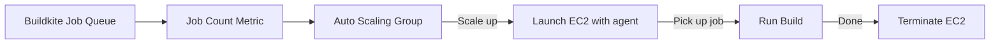

# Buildkite (CI/CD Platform)

## Overview

Buildkite is a CI/CD platform that runs build pipelines on your own infrastructure. Unlike SaaS-only CI tools that execute in shared environments, Buildkite uses a lightweight agent model — a central SaaS control plane orchestrates builds, while agents run on your own servers, VMs, or containers. This gives you control over security, cost, and environment while eliminating the operational burden of managing a CI server.

## Architecture



| Component | Where It Runs | Responsibility |
|-----------|---------------|----------------|
| **Buildkite API** | Buildkite SaaS | Pipeline management, job scheduling, web UI |
| **Agent** | Your infrastructure | Execute jobs, report results, upload artifacts |
| **Command step** | Agent | Run shell commands in a pipeline |
| **Wait step** | Buildkite API | Synchronize parallel branches |
| **Input step** | Buildkite API | Manual approval gates |
| **Trigger step** | Buildkite API | Trigger child pipelines |

## Pipeline Configuration

### YAML Pipeline Definition

```yaml
# .buildkite/pipeline.yml
steps:
  # Command step with label and commands
  - label: ":test_tube: Run tests"
    command:
      - "bundle install --jobs=4 --retry=3"
      - "bundle exec rspec"
    env:
      RAILS_ENV: test
    artifact_paths:
      - "tmp/screenshots/**/*.png"
      - "coverage/**/*"

  # Parallel testing
  - label: ":rspec: RSpec parallel"
    parallelism: 8
    command: "bundle exec rspec --format documentation"

  # Wait step (synchronize)
  - wait

  # Deployment with manual approval
  - label: ":rocket: Deploy to staging"
    command: "scripts/deploy.sh staging"
    branches: "main"
    concurrency: 1
    concurrency_group: "staging-deploy"

  # Input step (approval gate)
  - input: "Deploy to production?"
    fields:
      - text: "Release notes"
        required: true
    if: "build.branch == 'main'"

  - label: ":ship: Deploy to production"
    command: "scripts/deploy.sh production"
    depends_on: ":rocket: Deploy to staging"
```

### Pipeline Structure



## Agents

### Installing an Agent

```bash
# Install on Ubuntu/Debian
echo "deb https://apt.buildkite.com/buildkite-agent stable main" | sudo tee /etc/apt/sources.list.d/buildkite-agent.list
wget -O - https://apt.buildkite.com/buildkite-agent.key.asc | sudo apt-key add -
sudo apt-get update && sudo apt-get install -y buildkite-agent

# Configure
sudo sed -i "s/xxx/YOUR_AGENT_TOKEN/g" /etc/buildkite-agent/buildkite-agent.cfg
sudo systemctl enable --now buildkite-agent
```

### Agent Configuration

```bash
# /etc/buildkite-agent/buildkite-agent.cfg
token="YOUR_AGENT_TOKEN"
name="%hostname-%n"
meta-data="queue=default,os=linux,arch=amd64"
build-paths="/var/lib/buildkite-agent/builds"
hooks-path="/etc/buildkite-agent/hooks"
plugins-dir="/etc/buildkite-agent/plugins"

# Priority and concurrency
priority=10          # Higher = prefers this agent
disconnect-after-job=true  # Ephemeral agents (auto-scaled)
disconnect-after-idle-timeout=300  # 5 minutes
```

### Auto-Scaling Agents



Buildkite provides official autoscaling for AWS:

```yaml
# buildkite-elastic-stack.yml
buildkite-agent:
  token: "{{ secrets.BUILDKITE_AGENT_TOKEN }}"
  tags: "queue=elastic-linux"

aws:
  region: us-east-1
  instances:
    - image-id: ami-0abcdef1234567890
      instance-type: m5.large
      desired-capacity: 2
      max-size: 20
```

## Key Features

### 1. Parallelism

| Type | How It Works |
|------|--------------|
| **Step-level parallelism** | Multiple steps run simultaneously (default) |
| **Job-level parallelism** | Single step split into N parallel jobs |
| **Matrix builds** | Run same job across multiple environments |

```yaml
# Matrix builds
- label: ":docker: Build %matrix:image%"
  command: "docker build -t app:%matrix:image% ."
  matrix:
    - image: ["alpine", "ubuntu", "debian"]
```

### 2. Concurrency Groups

Prevent multiple deployments to the same environment:

```yaml
- label: "Deploy to staging"
  command: "./deploy.sh staging"
  concurrency: 1
  concurrency_group: "staging-deployment"
```

### 3. Artifacts and Caches

| Feature | Description |
|---------|-------------|
| **Artifacts** | Upload build outputs (logs, binaries, screenshots) |
| **Caches** | Persist files between builds (dependencies, build cache) |
| **Max artifact size** | 100 MB per file (5 GB max total per build) |

```yaml
- label: "Build"
  command: "make build"
  artifact_paths: "dist/**/*"
  cache:
    - node_modules/
    - .cache/pip/
```

### 4. Plugins

Buildkite plugins extend pipeline functionality:

```yaml
steps:
  - label: ":docker: Build"
    plugins:
      - docker-compose#v5.0.0:
          run: app
          config: docker-compose.yml
      - ecr#v3.0.0:
          login: true
      - cache#v2.0.0:
          key: "v1-{{ checksum 'yarn.lock' }}"
          paths:
            - node_modules/
```

Popular plugins: `docker-compose`, `ecr`, `cache`, `kubernetes`, `slack`, `github-merge`, `ecs`.

### 5. Branch Configuration

```yaml
steps:
  - label: ":fast_forward: Quick test"
    command: "make test"
    # Only on pull requests
    if: "build.pull_request.id != null"

  - label: ":rocket: Full deploy"
    command: "make deploy"
    # Only on main branch
    branches: "main"
```

## Comparison: Buildkite vs Alternatives

| Feature | Buildkite | GitHub Actions | GitLab CI | CircleCI |
|---------|-----------|---------------|-----------|----------|
| **Execution** | Your infrastructure | GitHub-hosted or self-hosted | Shared runners or self-hosted | Circle-hosted or self-hosted |
| **Security** | Full control | Limited (shared env) | Flexible | Limited |
| **Cost model** | Per-seat + agent time | Free tier + per-minute | Free tier + compute | Per-credit |
| **Parallelism** | Unlimited (your agents) | Limited by concurrency | Limited by runners | Limited by plan |
| **Custom environments** | Full control | Limited (actions) | Limited | Limited |
| **Open source** | Agent is OSS | Actions runner is OSS | Full | No |
| **Setup effort** | Medium | Low | Low | Low |
| **Best for** | Security-sensitive, custom infra | Open source, GitHub-native | GitLab shops | Small teams |

## Security Model

```mermaid
graph TB
    subgraph "Buildkite Trust Boundary"
        API[API Server] -->|Encrypted| Agent[Your Agent]
        API -->|Encrypted| UI[Web UI]
    end

    subgraph "Your Infrastructure"
        Agent -->|Runs in| VPC[Your VPC]
        Agent -->|Accesses| Secrets[Your Secrets Manager]
    end

    subgraph "Never Accessed by Buildkite"
        VPC
        Secrets
        Code[Your Code (unless uploaded)]
    end
```

| Security Feature | Details |
|------------------|---------|
| Agent token | Authenticated, revocable per-agent or per-queue |
| No code access | Buildkite never accesses your git repository directly |
| Secrets | Agents use your secrets management (Vault, AWS SSM, etc.) |
| Audit logs | All API actions logged with timestamps |
| SSO/SAML | Enterprise SSO with SAML 2.0, OIDC |
| Scoped tokens | Fine-grained API tokens for specific operations |

## Performance Tips

1. **Parallelize everything**: Use `parallelism` and matrix builds aggressively
2. **Use agent queues**: Route jobs to specialized agents (e.g., `macos`, `gpu`, `large-memory`)
3. **Cache dependencies**: Use cache keys based on lockfile checksums
4. **Ephemeral agents**: Auto-scale agents that terminate after each job
5. **Optimize Docker layers**: Multi-stage builds, layer caching
6. **Use artifacts wisely**: Upload only necessary files; use caches for build intermediates

## Pricing

| Plan | Cost | Agents |
|------|------|--------|
| Free | $0 | 1 agent, 5 users, 2 pipelines |
| Pro | $25/user/month | Unlimited agents |
| Enterprise | Custom | Unlimited + SSO, audit logs, priority support |

Agent time is billed separately when using Buildkite-hosted agents.

## Interview Questions

1. **Why Buildkite over GitHub Actions?** Buildkite when you need: full control over build environments (custom hardware, GPU, macOS on-premises), stricter security (code never leaves your network), or unlimited parallelism at predictable cost.

2. **How does Buildkite handle agent scaling?** Agents connect to the Buildkite API and poll for jobs. You can statically provision agents or auto-scale using AWS ASG, Kubernetes, or the official elastic stack. Ephemeral agents (one job per instance) ensure clean environments.

3. **What are concurrency groups?** Named locks that prevent multiple builds from running simultaneously. Essential for deployments: only one deploy to staging at a time, regardless of how many builds are queued.

4. **How do you manage secrets with Buildkite?** Buildkite itself doesn't store secrets. Agents run in your infrastructure and access your secrets manager (HashiCorp Vault, AWS SSM Parameter Store, environment variables injected by your orchestration).

5. **Explain the wait step.** The `wait` step pauses the pipeline until all previous steps complete. If any step fails, the pipeline stops at the wait step. This creates synchronization points between parallel branches.

## Key Takeaways

- Buildkite separates the control plane (SaaS) from the execution plane (your infrastructure)
- Agents are lightweight, open-source, and run anywhere — giving full security control
- Auto-scaling agents enable cost-efficient parallelism without managing capacity
- Plugins extend pipeline functionality without custom code
- Concurrency groups and wait steps enable complex, safe deployment workflows
- Best fit for security-sensitive organizations with existing infrastructure
- Trade-off: more setup than GitHub Actions, but more control and potentially lower cost at scale

## Cross-References

- [CI/CD Pipelines](./pipelines.md) — Pipeline design patterns
- [GitOps](./gitops.md) — GitOps workflow integration
- [Kubernetes](../kubernetes/README.md) — Running Buildkite agents on K8s
- [Packer](../packer.md) — Building images in CI
- [Canary Releases](../../sre/canary-releases.md) — Progressive delivery in CI
- [Feature Flags](../../sre/feature-flags.md) — Feature flag management in builds
