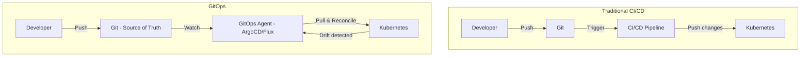
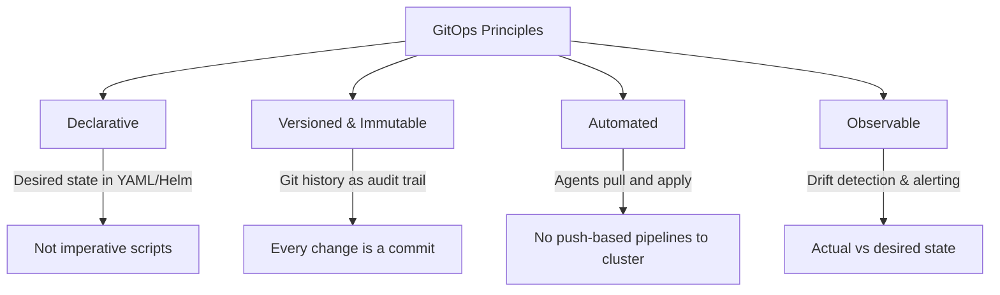
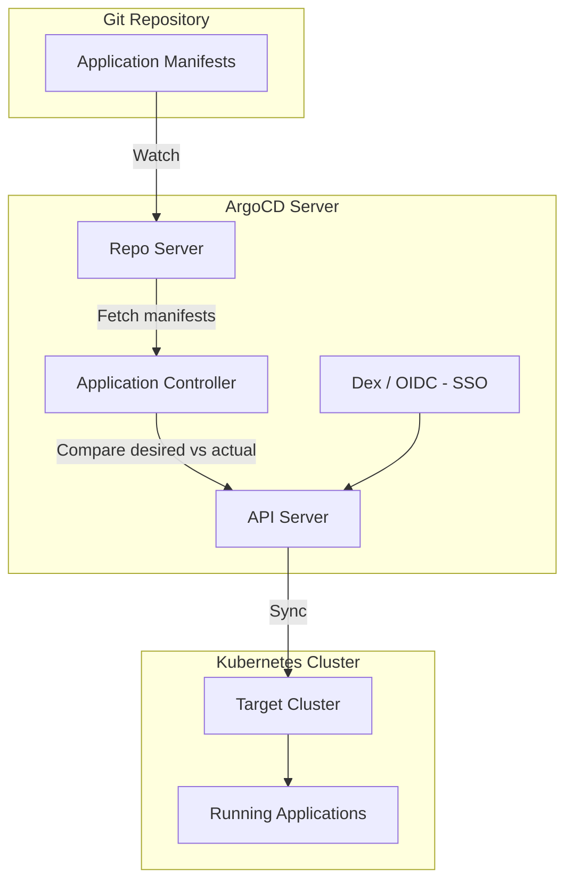
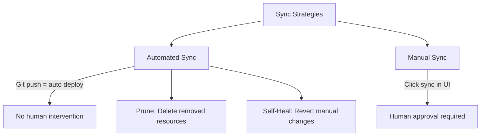
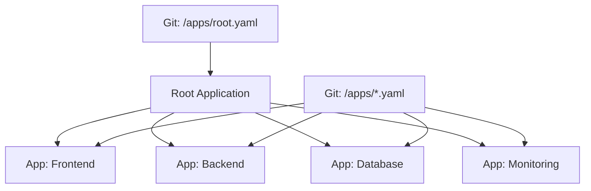
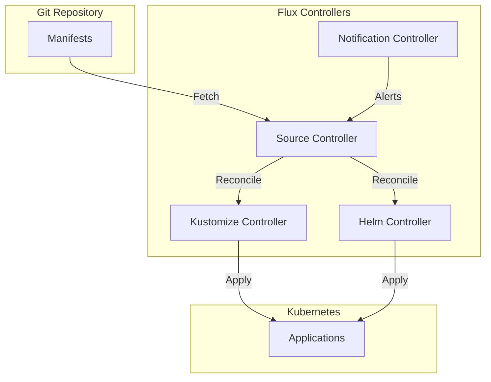
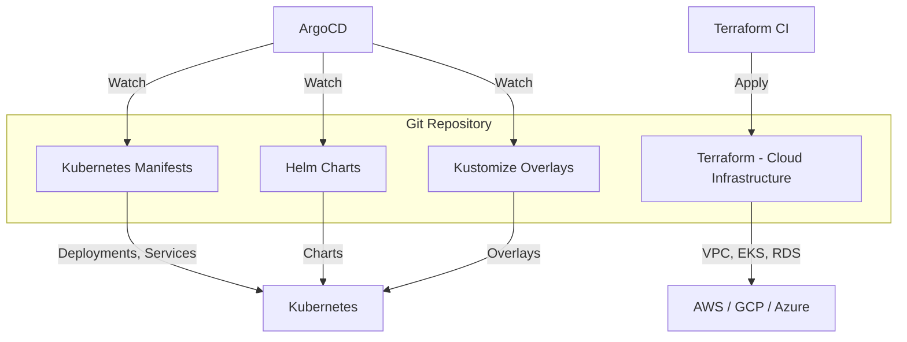
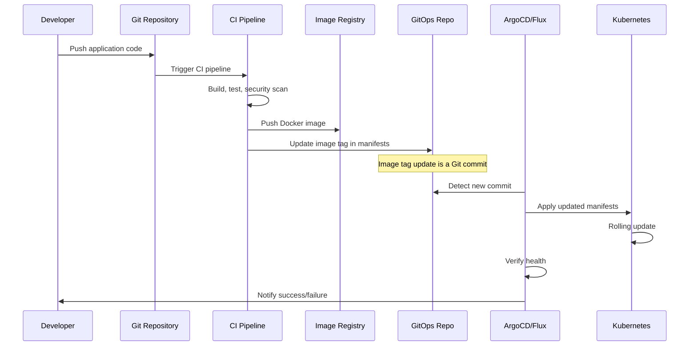
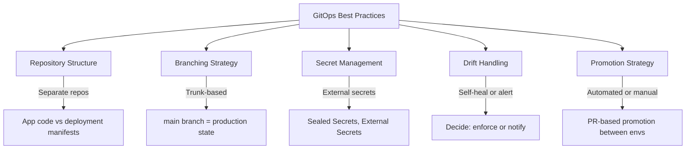
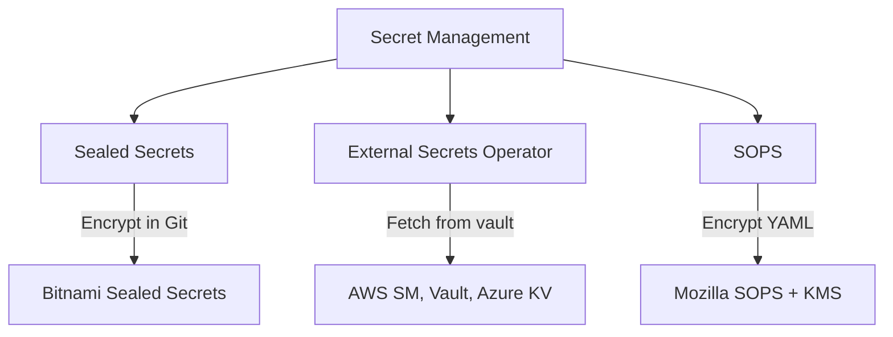

# GitOps

## Introduction

GitOps is an operational framework that takes DevOps best practices used for application development (version control, collaboration, compliance) and applies them to infrastructure automation. Git is the single source of truth for declarative infrastructure and applications, and automated agents ensure the actual state matches the desired state defined in Git.

## What is GitOps?



### Core Principles



| Principle | Description |
|-----------|-------------|
| **Declarative** | System state is described declaratively (YAML, Helm, Kustomize) |
| **Versioned & Immutable** | Desired state stored in Git—every change is a commit |
| **Automated** | Software agents automatically apply changes from Git |
| **Observable** | Agents detect and report drift between desired and actual state |

## GitOps vs Traditional CI/CD

| Aspect | Traditional CI/CD | GitOps |
|--------|------------------|--------|
| **Source of Truth** | CI/CD pipeline + scripts | Git repository |
| **Deployment Method** | Pipeline pushes to cluster | Agent pulls from Git |
| **Change Tracking** | Pipeline logs | Git history (audit trail) |
| **Rollback** | Re-run pipeline | `git revert` |
| **Drift Detection** | Manual or custom scripts | Built-in reconciliation |
| **Cluster Access** | CI/CD needs cluster credentials | Agent runs in cluster, pulls from Git |
| **Security** | CI/CD has push access to clusters | No inbound cluster access needed |

## ArgoCD

ArgoCD is the most popular GitOps tool for Kubernetes. It follows the GitOps pattern by syncing cluster state with Git repository state.

### ArgoCD Architecture



### ArgoCD Application

```yaml
apiVersion: argoproj.io/v1alpha1
kind: Application
metadata:
  name: my-app
  namespace: argocd
spec:
  project: default
  source:
    repoURL: https://github.com/org/k8s-manifests.git
    targetRevision: HEAD
    path: apps/my-app/overlays/production
  destination:
    server: https://kubernetes.default.svc
    namespace: production
  syncPolicy:
    automated:
      prune: true        # Delete resources removed from Git
      selfHeal: true     # Revert manual changes (drift)
    syncOptions:
      - CreateNamespace=true
    retry:
      limit: 5
      backoff:
        duration: 5s
        factor: 2
        maxDuration: 3m
```

### ArgoCD Sync Strategies



| Strategy | Behavior | Use Case |
|----------|----------|----------|
| **Manual** | Human clicks "Sync" in UI/CLI | Production with approval gates |
| **Automated** | Auto-sync on Git change | Development, staging |
| **Automated + Prune** | Also deletes removed resources | Clean environments |
| **Automated + Self-Heal** | Reverts manual kubectl changes | Strict GitOps enforcement |

### ArgoCD Application of Applications (App of Apps)



```yaml
# Root application - manages all other applications
apiVersion: argoproj.io/v1alpha1
kind: Application
metadata:
  name: root
  namespace: argocd
spec:
  source:
    repoURL: https://github.com/org/gitops-config.git
    path: apps/
    directory:
      recurse: true
  destination:
    server: https://kubernetes.default.svc
    namespace: argocd
  syncPolicy:
    automated:
      prune: true
      selfHeal: true
```

## Flux CD

Flux is a CNCF GitOps toolkit that syncs Kubernetes manifests from Git repositories.

### Flux Architecture



### Flux Configuration

```yaml
# GitRepository source
apiVersion: source.toolkit.fluxcd.io/v1
kind: GitRepository
metadata:
  name: my-app
  namespace: flux-system
spec:
  interval: 1m
  url: https://github.com/org/k8s-manifests
  ref:
    branch: main
  secretRef:
    name: git-credentials

---
# Kustomization (what to sync)
apiVersion: kustomize.toolkit.fluxcd.io/v1
kind: Kustomization
metadata:
  name: my-app
  namespace: flux-system
spec:
  interval: 5m
  path: ./apps/my-app/production
  prune: true
  sourceRef:
    kind: GitRepository
    name: my-app
  healthChecks:
    - apiVersion: apps/v1
      kind: Deployment
      name: my-app
      namespace: production
```

## ArgoCD vs Flux

| Feature | ArgoCD | Flux |
|---------|--------|------|
| **UI** | Rich web UI, CLI | CLI only (Weave GitOps for UI) |
| **Architecture** | Centralized (single server) | Distributed (controllers) |
| **Multi-tenancy** | Projects, RBAC | Namespaced controllers |
| **Helm Support** | Native | HelmRelease CRD |
| **Kustomize** | Native | Kustomization CRD |
| **Notifications** | Built-in | Notification Controller |
| **SSO** | Built-in (Dex, OIDC) | External |
| **Learning Curve** | Easier (UI-driven) | Steeper (CLI-only) |
| **CNCF Status** | Graduated | Graduated |

## Declarative Infrastructure

### Infrastructure as Code (IaC) + GitOps



### Kustomize for Environment Management

```yaml
# base/deployment.yaml
apiVersion: apps/v1
kind: Deployment
metadata:
  name: my-app
spec:
  replicas: 2
  selector:
    matchLabels:
      app: my-app
  template:
    metadata:
      labels:
        app: my-app
    spec:
      containers:
        - name: my-app
          image: my-app:latest
          resources:
            requests:
              cpu: "100m"
              memory: "128Mi"

---
# overlays/production/kustomization.yaml
apiVersion: kustomize.config.k8s.io/v1beta1
kind: Kustomization
resources:
  - ../../base
namespace: production
patches:
  - target:
      kind: Deployment
      name: my-app
    patch: |
      - op: replace
        path: /spec/replicas
        value: 5
      - op: replace
        path: /spec/template/spec/containers/0/resources/requests/cpu
        value: "500m"

---
# overlays/staging/kustomization.yaml
apiVersion: kustomize.config.k8s.io/v1beta1
kind: Kustomization
resources:
  - ../../base
namespace: staging
patches:
  - target:
      kind: Deployment
      name: my-app
    patch: |
      - op: replace
        path: /spec/replicas
        value: 2
```

## GitOps Workflow



## GitOps Best Practices



### Repository Structure

```
# Option 1: Mono-repo (all environments)
gitops-config/
├── apps/
│   ├── frontend/
│   │   ├── base/
│   │   │   ├── deployment.yaml
│   │   │   ├── service.yaml
│   │   │   └── kustomization.yaml
│   │   └── overlays/
│   │       ├── staging/
│   │       │   └── kustomization.yaml
│   │       └── production/
│   │           └── kustomization.yaml
│   └── backend/
│       ├── base/
│       └── overlays/
└── infrastructure/
    ├── cert-manager/
    ├── ingress-nginx/
    └── monitoring/

# Option 2: Multi-repo
# app-code-repo: Application source code + Dockerfile
# gitops-config-repo: Kubernetes manifests for all environments
```

### Secret Management in GitOps



```yaml
# External Secrets Operator - fetch from AWS Secrets Manager
apiVersion: external-secrets.io/v1beta1
kind: ExternalSecret
metadata:
  name: app-secrets
  namespace: production
spec:
  refreshInterval: 1h
  secretStoreRef:
    name: aws-secrets-manager
    kind: ClusterSecretStore
  target:
    name: app-secrets
  data:
    - secretKey: database-url
      remoteRef:
        key: production/app/database-url
    - secretKey: api-key
      remoteRef:
        key: production/app/api-key
```

## Interview Questions

### Q1: What is GitOps and how does it differ from traditional CI/CD?
**Answer**: GitOps uses Git as the single source of truth for declarative infrastructure and applications. Instead of CI/CD pipelines pushing changes to clusters, GitOps agents (ArgoCD, Flux) run inside the cluster and pull changes from Git, reconciling actual state with desired state. Key differences: (1) Pull-based (agent in cluster) vs push-based (pipeline pushes), (2) Declarative manifests vs imperative scripts, (3) Git history as audit trail, (4) Built-in drift detection, (5) No cluster credentials needed in CI/CD.

### Q2: How does ArgoCD work?
**Answer**: ArgoCD watches Git repositories for Kubernetes manifests. The Application Controller compares the desired state (Git) with the actual state (cluster). If there's drift, it can automatically sync (apply changes) or alert. Features: (1) Web UI for visualization, (2) Automated sync with prune and self-heal, (3) RBAC and SSO, (4) Multi-cluster support, (5) App of Apps pattern for managing many applications, (6) Rollback via Git revert. It uses Repo Server to generate manifests (Helm, Kustomize) and Application Controller to reconcile.

### Q3: How do you handle secrets in GitOps?
**Answer**: Never store plain-text secrets in Git. Options: (1) Sealed Secrets—encrypt secrets with a cluster-specific key, store encrypted version in Git, controller decrypts in cluster, (2) External Secrets Operator—store references in Git, operator fetches actual secrets from vault (AWS SM, HashiCorp Vault), (3) SOPS—encrypt YAML files with KMS keys, ArgoCD/Flux can decrypt, (4) Vault sidecar—inject secrets at runtime without storing in K8s secrets. Best practice: External Secrets Operator with cloud-native secret managers.

### Q4: What is drift detection and how do you handle it?
**Answer**: Drift is when the actual cluster state differs from the Git-desired state (e.g., someone ran `kubectl edit` manually). GitOps agents detect drift by comparing Git manifests with cluster state. Handling options: (1) Self-heal: automatically revert manual changes (strict GitOps), (2) Notify: alert on drift but don't auto-fix (gradual adoption), (3) Ignore: allow certain fields to drift (e.g., replica count managed by HPA). ArgoCD supports self-heal mode and can exclude specific resources from drift detection.

### Q5: How do you structure Git repositories for GitOps?
**Answer**: Two main approaches: (1) Mono-repo—base manifests and environment overlays in one repo (Kustomize), simpler for small teams, (2) Multi-repo—application code in one repo, deployment manifests in another, separates concerns. For environments: use Kustomize overlays (base → staging → production) or Helm values files per environment. Include infrastructure components (cert-manager, ingress, monitoring) in a separate directory or repo. Promotion between environments is done via PRs to the GitOps repo.

## Common Mistakes

1. **Storing secrets in Git**: Plain-text secrets in manifests—use Sealed Secrets or External Secrets
2. **No self-heal**: Manual changes accumulate, Git state diverges from reality
3. **Mixing CI and CD**: CI pipeline shouldn't push directly to clusters—let GitOps agent handle it
4. **Too many auto-synced apps in production**: Production should have manual approval gates
5. **Ignoring drift alerts**: Drift indicates a process problem—investigate and fix
6. **No RBAC**: Everyone can sync any application—use ArgoCD projects and RBAC
7. **Monolithic manifests**: All resources in one file—use Kustomize/Helm for organization

## Summary

| Concept | Key Takeaway |
|---------|-------------|
| **GitOps** | Git as single source of truth, agent-based reconciliation |
| **ArgoCD** | Popular GitOps tool with web UI, auto-sync, multi-cluster |
| **Flux** | CNCF GitOps toolkit, distributed controllers |
| **Drift Detection** | Compare actual vs desired state, auto-heal or alert |
| **Secret Management** | Sealed Secrets, External Secrets, SOPS—never plain text |
| **IaC + GitOps** | Terraform for infra, K8s manifests for apps, all in Git |

## Cross-References

- **CI/CD Overview**: [README](./README.md) — CI/CD foundations
- **Pipelines**: [Stages](./pipelines.md) — CI pipeline that produces artifacts
- **Kubernetes Deployments**: [Strategies](../kubernetes/deployments.md) — What GitOps deploys
- **Kubernetes Ingress**: [Controllers](../kubernetes/ingress.md) — Managed by GitOps
- **Observability**: [Monitoring](../observability/monitoring.md) — Verify GitOps deployments
- **AWS**: [EKS](../aws/README.md) — GitOps on managed Kubernetes
