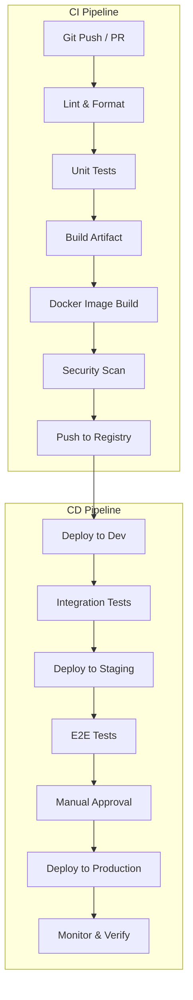
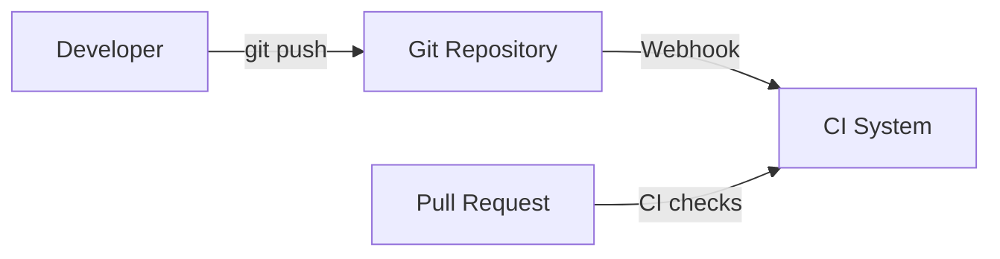
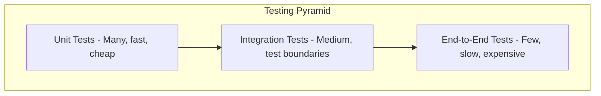
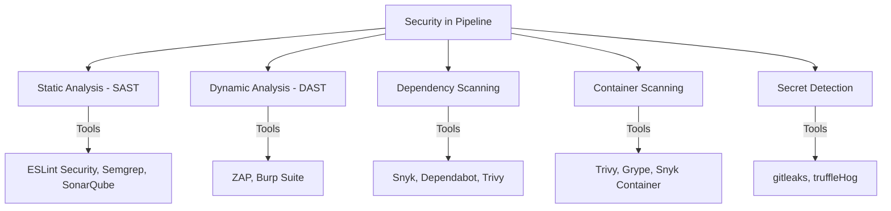
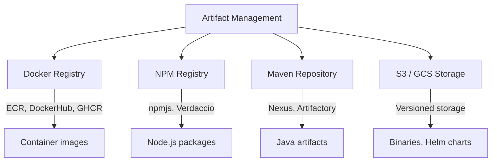
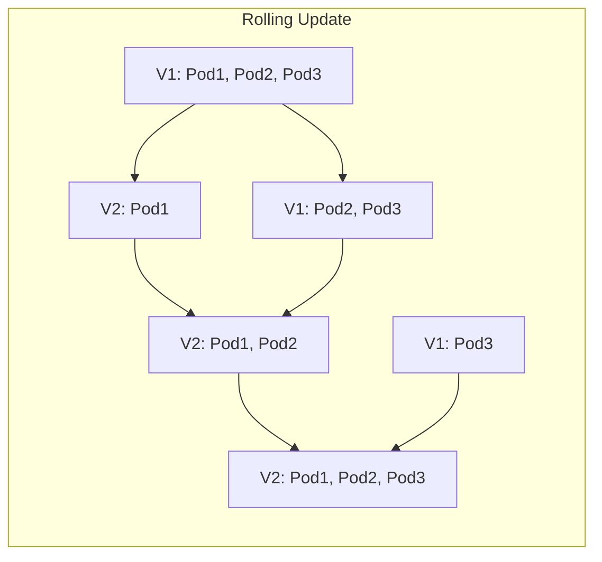
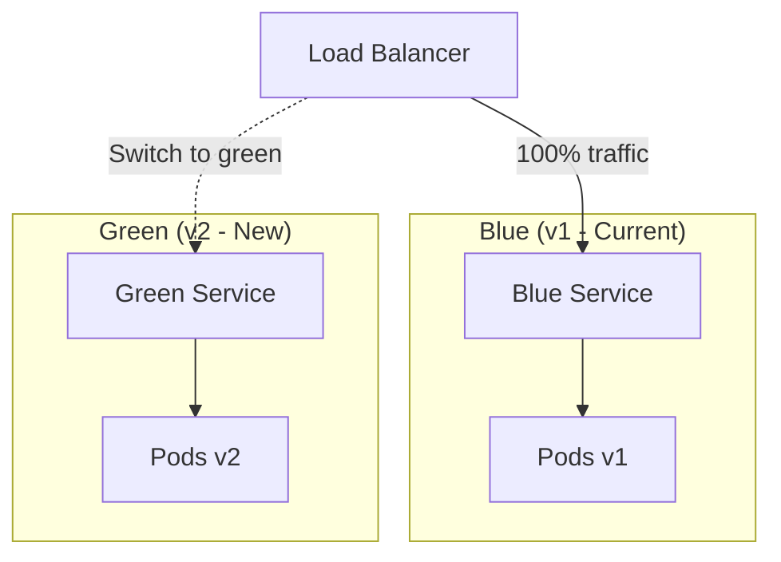
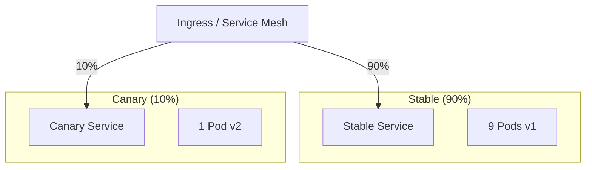
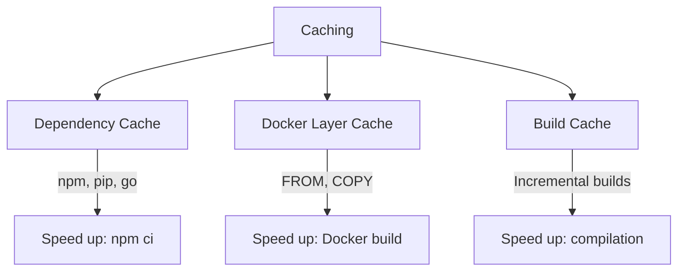

# CI/CD Pipelines

## Introduction

A CI/CD pipeline is an automated workflow that takes code from a developer's machine to production. It defines the stages, steps, and gates that code passes through, ensuring quality, security, and reliability at every step.

## Pipeline Architecture



## Pipeline Stages

### 1. Source Stage



**Triggers:**
- Push to main/develop branch
- Pull request creation/update
- Tag creation (for releases)
- Scheduled (nightly builds)
- Manual trigger

### 2. Build Stage

```yaml
# GitHub Actions example - Build stage
jobs:
  build:
    runs-on: ubuntu-latest
    steps:
      - uses: actions/checkout@v4

      - name: Setup Node.js
        uses: actions/setup-node@v4
        with:
          node-version: '20'
          cache: 'npm'

      - name: Install dependencies
        run: npm ci

      - name: Build
        run: npm run build

      - name: Upload build artifact
        uses: actions/upload-artifact@v4
        with:
          name: build-output
          path: dist/
```

**Build Best Practices:**
- Use deterministic builds (lock files: `package-lock.json`, `go.sum`)
- Cache dependencies between builds
- Build once, deploy everywhere (same artifact across environments)
- Use multi-stage Docker builds for smaller images

### 3. Test Stage



| Test Type | Speed | Coverage | When to Run |
|-----------|-------|----------|-------------|
| **Unit** | Milliseconds | Individual functions/classes | Every commit |
| **Integration** | Seconds | Service boundaries, APIs, DB | Every merge to main |
| **E2E** | Minutes | Full user workflows | Before staging deploy |
| **Performance** | Hours | Load, stress, scalability | Nightly / before release |
| **Security** | Minutes | SAST, dependency scan | Every commit |

```yaml
# GitHub Actions - Test stage
jobs:
  unit-tests:
    runs-on: ubuntu-latest
    strategy:
      matrix:
        shard: [1, 2, 3, 4]  # Parallel test shards
    steps:
      - uses: actions/checkout@v4
      - run: npm ci
      - run: npm test -- --shard=${{ matrix.shard }}/4

  integration-tests:
    needs: unit-tests
    runs-on: ubuntu-latest
    services:
      postgres:
        image: postgres:16
        env:
          POSTGRES_PASSWORD: test
        ports:
          - 5432:5432
    steps:
      - uses: actions/checkout@v4
      - run: npm ci
      - run: npm run test:integration
```

### 4. Security Scanning



```yaml
# Security scanning in GitHub Actions
  security:
    needs: build
    runs-on: ubuntu-latest
    steps:
      - uses: actions/checkout@v4

      # Dependency vulnerability scanning
      - name: Run Snyk
        uses: snyk/actions/node@master
        with:
          args: --severity-threshold=high

      # Container image scanning
      - name: Run Trivy
        uses: aquasecurity/trivy-action@master
        with:
          image-ref: myapp:${{ github.sha }}
          severity: 'CRITICAL,HIGH'

      # Secret detection
      - name: Run gitleaks
        uses: gitleaks/gitleaks-action@v2
```

### 5. Artifact Management



```yaml
# Docker build and push
  docker:
    needs: [build, security]
    runs-on: ubuntu-latest
    steps:
      - uses: actions/checkout@v4

      - name: Set up Docker Buildx
        uses: docker/setup-buildx-action@v3

      - name: Login to ECR
        uses: aws-actions/amazon-ecr-login@v2

      - name: Build and push
        uses: docker/build-push-action@v5
        with:
          context: .
          push: true
          tags: |
            123456789.dkr.ecr.us-east-1.amazonaws.com/myapp:${{ github.sha }}
            123456789.dkr.ecr.us-east-1.amazonaws.com/myapp:latest
          cache-from: type=gha
          cache-to: type=gha,mode=max
```

### 6. Deployment Stage

```yaml
# Deploy to Kubernetes
  deploy-staging:
    needs: docker
    runs-on: ubuntu-latest
    environment: staging
    steps:
      - uses: actions/checkout@v4

      - name: Configure kubectl
        uses: aws-actions/amazon-eks-config-kubectl@v1
        with:
          cluster-name: staging-cluster
          region: us-east-1

      - name: Update image tag
        run: |
          kubectl set image deployment/myapp \
            myapp=123456789.dkr.ecr.us-east-1.amazonaws.com/myapp:${{ github.sha }} \
            -n staging

      - name: Wait for rollout
        run: |
          kubectl rollout status deployment/myapp -n staging --timeout=300s

  deploy-production:
    needs: deploy-staging
    runs-on: ubuntu-latest
    environment:
      name: production
      url: https://app.example.com
    steps:
      - name: Deploy to production
        run: |
          kubectl set image deployment/myapp \
            myapp=123456789.dkr.ecr.us-east-1.amazonaws.com/myapp:${{ github.sha }} \
            -n production
```

## Deployment Strategies

### Rolling Update



- Gradually replaces old pods with new ones
- Zero downtime (if configured with maxUnavailable=0)
- Default Kubernetes strategy

### Blue-Green Deployment



```bash
# Blue-Green deployment script
#!/bin/bash
CURRENT_COLOR=$(kubectl get service app -o jsonpath='{.spec.selector.version}')
NEW_COLOR=$([ "$CURRENT_COLOR" = "blue" ] && echo "green" || echo "blue")

# Deploy new version
kubectl apply -f deployment-${NEW_COLOR}.yaml
kubectl rollout status deployment/app-${NEW_COLOR}

# Run smoke tests
curl -f https://staging.example.com/health || exit 1

# Switch traffic
kubectl patch service app -p '{"spec":{"selector":{"version":"'${NEW_COLOR}'"}}}'

# Rollback if needed
# kubectl patch service app -p '{"spec":{"selector":{"version":"'${CURRENT_COLOR}'"}}}'
```

### Canary Deployment



```yaml
# Canary with Flagger (GitOps-friendly)
apiVersion: flagger.app/v1beta1
kind: Canary
metadata:
  name: myapp
spec:
  targetRef:
    apiVersion: apps/v1
    kind: Deployment
    name: myapp
  progressDeadlineSeconds: 600
  analysis:
    interval: 30s
    threshold: 5
    maxWeight: 50
    stepWeight: 10
    metrics:
      - name: request-success-rate
        thresholdRange:
          min: 99
        interval: 1m
      - name: request-duration
        thresholdRange:
          max: 500
        interval: 1m
```

## Complete Pipeline Example

```yaml
# GitHub Actions - Complete CI/CD Pipeline
name: CI/CD Pipeline

on:
  push:
    branches: [main]
  pull_request:
    branches: [main]

env:
  REGISTRY: 123456789.dkr.ecr.us-east-1.amazonaws.com
  IMAGE_NAME: myapp

jobs:
  # Stage 1: Lint & Format
  lint:
    runs-on: ubuntu-latest
    steps:
      - uses: actions/checkout@v4
      - run: npm ci
      - run: npm run lint
      - run: npm run format:check

  # Stage 2: Unit Tests (parallel shards)
  test:
    needs: lint
    runs-on: ubuntu-latest
    strategy:
      matrix:
        shard: [1, 2, 3]
    steps:
      - uses: actions/checkout@v4
      - run: npm ci
      - run: npm test -- --shard=${{ matrix.shard }}/3 --coverage
      - uses: actions/upload-artifact@v4
        with:
          name: coverage-${{ matrix.shard }}
          path: coverage/

  # Stage 3: Build
  build:
    needs: test
    runs-on: ubuntu-latest
    steps:
      - uses: actions/checkout@v4
      - run: npm ci
      - run: npm run build
      - uses: actions/upload-artifact@v4
        with:
          name: build
          path: dist/

  # Stage 4: Security Scan
  security:
    needs: build
    runs-on: ubuntu-latest
    steps:
      - uses: actions/checkout@v4
      - uses: snyk/actions/node@master
      - uses: gitleaks/gitleaks-action@v2

  # Stage 5: Docker Build & Push
  docker:
    needs: security
    if: github.ref == 'refs/heads/main'
    runs-on: ubuntu-latest
    outputs:
      image-tag: ${{ steps.meta.outputs.tags }}
    steps:
      - uses: actions/checkout@v4
      - uses: aws-actions/amazon-ecr-login@v2
      - id: meta
        uses: docker/metadata-action@v5
        with:
          images: ${{ env.REGISTRY }}/${{ env.IMAGE_NAME }}
          tags: |
            type=sha
      - uses: docker/build-push-action@v5
        with:
          push: true
          tags: ${{ steps.meta.outputs.tags }}
          cache-from: type=gha
          cache-to: type=gha,mode=max

  # Stage 6: Deploy to Staging
  deploy-staging:
    needs: docker
    runs-on: ubuntu-latest
    environment: staging
    steps:
      - uses: actions/checkout@v4
      - run: |
          kubectl set image deployment/myapp \
            myapp=${{ env.REGISTRY }}/${{ env.IMAGE_NAME }}:sha-${{ github.sha }} \
            -n staging
      - run: kubectl rollout status deployment/myapp -n staging --timeout=300s

  # Stage 7: E2E Tests
  e2e:
    needs: deploy-staging
    runs-on: ubuntu-latest
    steps:
      - uses: actions/checkout@v4
      - run: npm ci
      - run: npm run test:e2e
        env:
          BASE_URL: https://staging.example.com

  # Stage 8: Deploy to Production
  deploy-production:
    needs: e2e
    runs-on: ubuntu-latest
    environment:
      name: production
      url: https://app.example.com
    steps:
      - uses: actions/checkout@v4
      - run: |
          kubectl set image deployment/myapp \
            myapp=${{ env.REGISTRY }}/${{ env.IMAGE_NAME }}:sha-${{ github.sha }} \
            -n production
      - run: kubectl rollout status deployment/myapp -n production --timeout=300s

  # Stage 9: Notify
  notify:
    needs: deploy-production
    if: always()
    runs-on: ubuntu-latest
    steps:
      - name: Notify Slack
        uses: 8398a7/action-slack@v3
        with:
          status: ${{ job.status }}
          text: |
            Deploy ${{ github.sha }} to production: ${{ job.status }}
```

## Artifacts and Caching



**What to Cache:**
| Artifact | Cache Key | Savings |
|----------|-----------|---------|
| **npm dependencies** | `package-lock.json` hash | 30-60s per build |
| **Docker layers** | Dockerfile content | 50-80% faster builds |
| **Go modules** | `go.sum` hash | 20-40s per build |
| **pip packages** | `requirements.txt` hash | 15-30s per build |
| **Test results** | Source code hash | Skip unchanged tests |

## Interview Questions

### Q1: What are the stages of a CI/CD pipeline?
**Answer**: A typical pipeline has: (1) Source—triggered by git push/PR, (2) Build—compile code, install dependencies, build Docker image, (3) Test—unit tests, integration tests, linting, security scanning, (4) Release—tag version, push to registry, store artifacts, (5) Deploy—deploy to dev, staging, then production, (6) Monitor—verify deployment health, alert on issues. Best practice: run stages in parallel where possible, fail fast, cache dependencies.

### Q2: How do you implement rollback in a CI/CD pipeline?
**Answer**: Multiple approaches: (1) Kubernetes: `kubectl rollout undo deployment/myapp` reverts to previous ReplicaSet, (2) Blue-Green: switch service selector back to blue, (3) Canary: pause/abort the canary and route all traffic to stable, (4) GitOps: `git revert` the commit and let the controller reconcile, (5) Database: use migration rollback scripts. Always include automated rollback on health check failure in the pipeline.

### Q3: What is the testing pyramid and how does it apply to CI/CD?
**Answer**: The testing pyramid recommends: many unit tests (fast, cheap, run on every commit), fewer integration tests (test service boundaries, run on merge to main), and very few E2E tests (slow, expensive, run before staging deploy). In CI/CD: unit tests provide fast feedback (< 2 min), integration tests verify service interactions (< 10 min), E2E tests validate user workflows before production. Run the cheapest tests first to fail fast.

### Q4: How do you handle database migrations in a CI/CD pipeline?
**Answer**: (1) Use a migration tool (Flyway, Alembic, Prisma Migrate), (2) Run migrations as a separate step before deploying application code, (3) Make migrations backward-compatible (expand-contract pattern): add new columns/tables first, deploy code that uses both, then remove old columns, (4) Version-control all migrations, (5) Test migrations in staging with production-like data, (6) Include rollback scripts, (7) Never auto-migrate production—consider manual approval.

### Q5: How do you optimize pipeline performance?
**Answer**: (1) Parallelize independent stages (unit tests in shards, security scan alongside build), (2) Cache dependencies (npm ci, Docker layers), (3) Use faster runners (larger instances, ARM), (4) Fail fast—run lint before tests, unit before integration, (5) Skip unchanged stages (path filters, change detection), (6) Use incremental builds, (7) Optimize Docker builds (multi-stage, BuildKit cache), (8) Run tests closest to code change first.

## Common Mistakes

1. **No parallelization**: Running all stages sequentially wastes time
2. **Flaky tests**: Erodes trust—developers ignore CI failures
3. **No caching**: Re-downloading dependencies on every build
4. **Secrets in logs**: CI output leaks sensitive information
5. **No artifact versioning**: Can't trace which code is deployed where
6. **Manual deployment steps**: Error-prone, not repeatable
7. **No rollback automation**: Stuck with broken production

## Summary

| Stage | Purpose | Key Tools |
|-------|---------|-----------|
| **Source** | Trigger on code change | Git webhooks |
| **Build** | Compile, package | Docker, npm, Maven |
| **Test** | Verify quality | Jest, Pytest, Cypress |
| **Security** | Scan for vulnerabilities | Snyk, Trivy, gitleaks |
| **Release** | Version and store artifacts | ECR, DockerHub, S3 |
| **Deploy** | Release to environments | kubectl, Helm, ArgoCD |
| **Monitor** | Verify health | Prometheus, Datadog |

## Cross-References

- **CI/CD Overview**: [README](./README.md) — CI/CD concepts and tools
- **GitOps**: [ArgoCD & Flux](./gitops.md) — Declarative pipeline deployments
- **Kubernetes Deployments**: [Strategies](../kubernetes/deployments.md) — Rolling, blue-green, canary
- **Docker**: [Containers](../virtualization/vm-vs-container.md) — What pipelines build
- **Observability**: [Monitoring](../observability/monitoring.md) — Deployment verification
