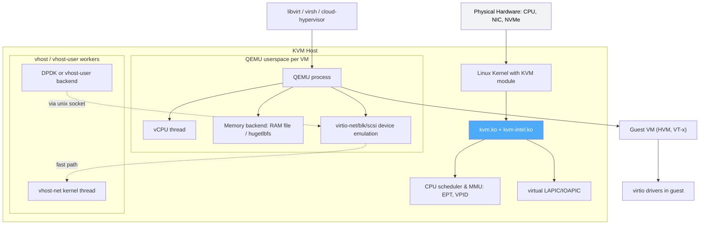
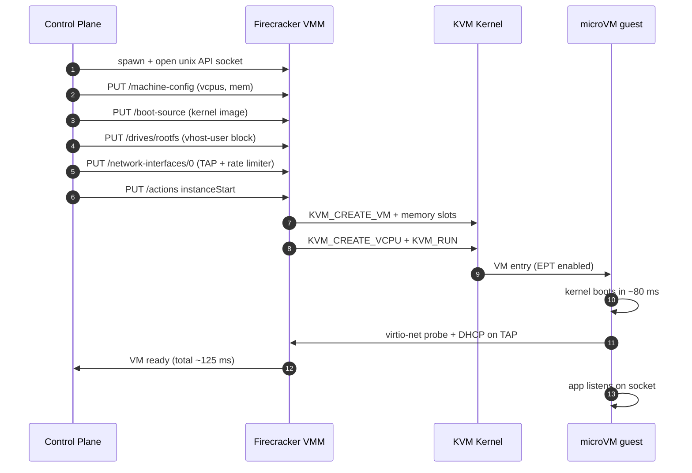
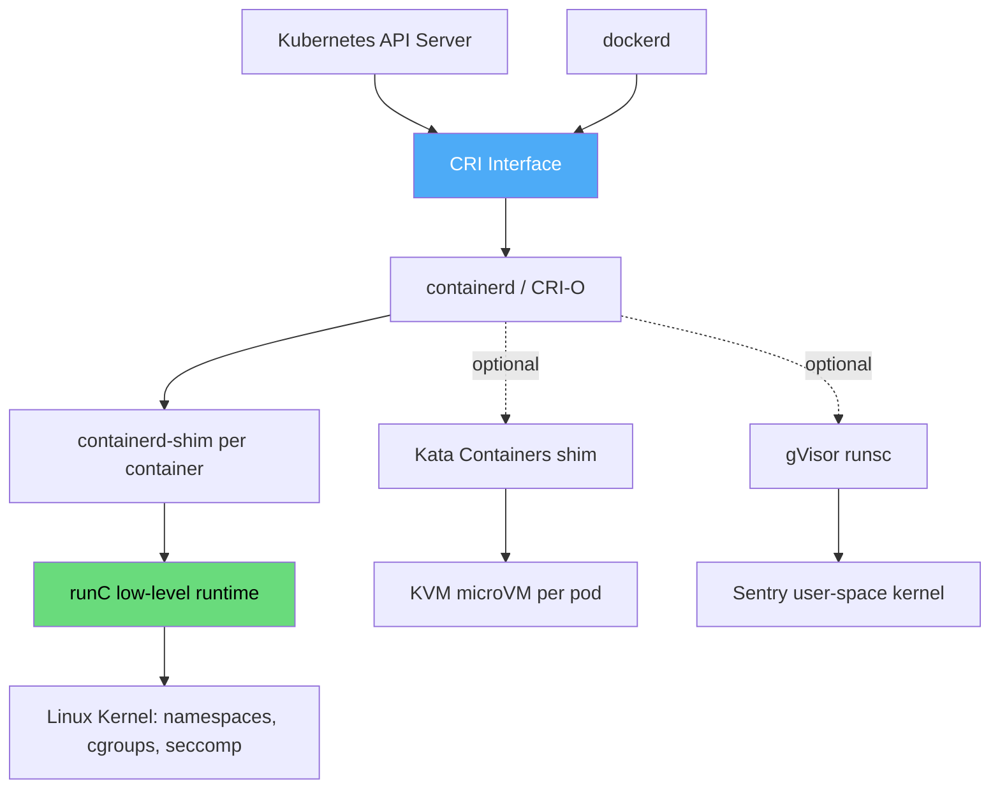
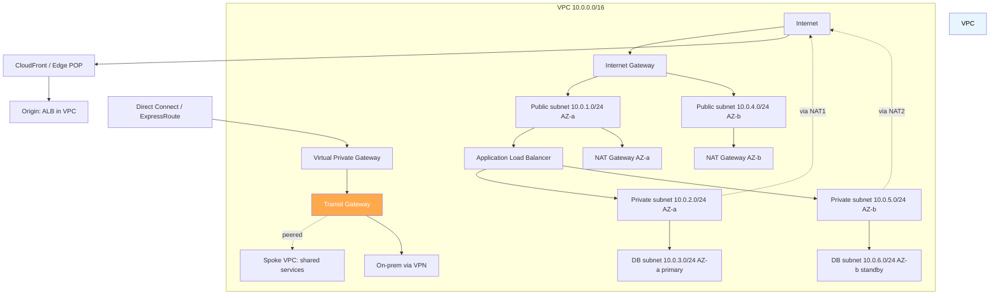

# Cloud Internals

## Introduction

Knowing cloud products (EC2, S3, Lambda) is necessary but not sufficient for senior infrastructure and systems-design interviews. The differentiator is understanding **what is actually happening one layer below the product**: which hypervisor AWS runs, why Firecracker boots in 125 ms, how a VPC route table is enforced in the dataplane, what makes a Nitro card different from a virtio-net device, and why cold starts happen. This page covers those internals.

It complements three existing pages — [virtualization/README](./virtualization/README.md), [virtualization/hypervisors](./virtualization/hypervisors.md), and [aws/vpc](./aws/vpc.md) — and avoids duplicating them. Where those pages give breadth, this one goes deep on the data-path, control-plane, and economics questions that show up in staff-level interviews.

## Virtualization Fundamentals

All hypervisor CPU virtualization boils down to one problem: a guest OS executes **privileged instructions** (write to CR3, halt the CPU, configure page tables, talk to MMIO) that must not be allowed to touch real hardware. Three strategies exist for handling this:

### 1. Trap-and-Emulate (Full Virtualization without HW assist)

The hypervisor runs the guest in a less-privileged ring (e.g., ring 1) while it occupies ring 0. Any privileged instruction **traps** into the hypervisor, which **emulates** the intended effect on virtualized state and resumes the guest. Popek–Goldberg (1974) proved this works **if and only if** every sensitive instruction is privileged — i.e., it traps. The x86 ISA violated this property for decades (e.g., `POPF` silently succeeds in ring 3), so early x86 could not do clean trap-and-emulate. This forced VMware's binary translation.

### 2. Paravirtualization

The guest kernel is **modified** to call the hypervisor explicitly through a `hypercall` instruction (analogous to a syscall) instead of executing privileged instructions. Xen pioneered this with its PV guest ABI. The cost is guest modification; the benefit is no trap overhead and clean I/O through ring-aware frontends (`netfront`, `blkfront`).

### 3. Hardware-Assisted Virtualization (HVM)

Intel VT-x (2005) and AMD-V added a new CPU mode — **root operation (CPL=0 in VMX root)** — that the hypervisor uses, and a **non-root** mode for guests. Sensitive instructions now trap reliably via `VMExit`. Combined with **EPT/NPT** (second-level page tables, avoiding shadow page tables) and **VPID** (ASID-like TLB tagging), HVM made full virtualization as fast as or faster than paravirtualization. Today, almost every cloud VM is HVM.

The performance model: each `VMExit` costs roughly 1,000–10,000 cycles plus whatever the hypervisor does in the handler. Reducing exit frequency is the entire game of virtio, vhost, SR-IOV, and Nitro.

## Hypervisor Landscape

| Hypervisor | Type | Architecture | Cloud / Vendor | Key Trait |
|------------|------|--------------|----------------|-----------|
| **KVM** | Type 1 (Linux module) | Kernel module + QEMU userspace | AWS Nitro, GCP, OpenStack, AliCloud | Linux-native, VirtIO-first, dominant in public cloud |
| **Xen** | Type 1 (microkernel) | Hypervisor + Dom0 + DomU | Citrix, historic AWS (pre-2017), Oracle | Mature PV ABI, Dom0 driver domain |
| **VMware ESXi** | Type 1 (vmkernel) | Proprietary bare-metal | Enterprise on-prem, VMCloud on AWS | vMotion/DRS/HA, vmkernel is POSIX-like |
| **Hyper-V** | Type 1 (microkernel) | Root partition + child partitions | Azure, Windows Server | VMBus, runs Windows & Linux guests |
| **Nutanix AHV** | Type 1 (KVM-based) | AHV = KVM + Acropolis DSF | Nutanix HCI | Free, integrated with AOS storage |
| **Firecracker** | Type 1 (KVM-based microVMM) | Stripped QEMU alternative | AWS Lambda, Fargate | Minimal device model, 125 ms boot |

> **Interview tip**: AWS moved EC2 from Xen to **KVM + Nitro** between 2017 and 2020. The reason was not raw KVM performance — it was that Nitro cards offload networking, storage, and management to dedicated ASICs, leaving the host CPU almost entirely for the guest. The hypervisor shrunk to a "thin supervisor." Cite the AWS Nitro architecture paper and re:Invent talks.

### KVM Architecture

Key ideas:

- Each VM is **one QEMU process**; each vCPU is a **thread** scheduled by the Linux CFS.
- `kvm.ko` exposes `/dev/kvm`; QEMU issues `KVM_RUN` ioctls to enter the guest and returns on `VMExit`.
- **EPT** gives the guest a contiguous view of its physical memory without shadow page tables.
- **vhost-net** moves the virtio dataplane out of QEMU into a kernel thread, halving context-switch cost.
- The control plane (libvirt, virsh, OpenStack Nova) talks to QEMU via JSON monitor; the data plane (packet flow) never touches QEMU.

### Xen Architecture (Contrast)

Xen splits the world into **Dom0** (a privileged Linux that owns real device drivers) and **DomU** guests. Network/block traffic crosses a **split driver** boundary: `netback` in Dom0 ↔ `netfront` in DomU, mediated by a shared-memory ring buffer. The microkernel hypervisor itself is tiny (~1 MB) and does no device I/O. This separation is clean but adds a hop; KVM folds the driver domain back into the host kernel.

## Device Virtualization

This is where the rubber meets the road. The naive model — trap every MMIO access in QEMU — costs ~10,000 cycles per packet. Each technique below reduces exits per packet:

| Technique | How It Works | Exit Frequency | Use Case |
|-----------|--------------|----------------|----------|
| **Full emulation (e1000, IDE)** | QEMU traps every MMIO read/write | Very high (1+ exit/pkt) | Legacy guests, installers |
| **virtio (split driver)** | Guest ring buffer + notifications only | ~1 exit/pkt (kick) | Default for KVM guests |
| **vhost-net** | Move virtio backend to kernel thread | <1 exit/pkt (busy polling) | High-throughput KVM networking |
| **vhost-user + DPDK** | User-space PMD polling the ring | 0 exits (no interrupts) | NFV, telco, 100 Gbps workloads |
| **SR-IOV** | NIC exposes virtual functions (VFs) assigned to guest | 0 exits (DMA direct to guest memory) | Latency-sensitive trading, HPC |
| **VFIO / PCI passthrough** | Entire physical function given to one guest | 0 exits | GPU passthrough, single-tenant |
| **Nitro / SmartNIC offload** | Custom ASIC terminates network/storage protocols | 0 host CPU exits | AWS EC2 default since 2020 |

### virtio Internals

`virtio` is a paravirtualized device ABI standardized by the OASIS virtio TC. The data structure is a **ring buffer** (`vring`) in shared memory between guest and host:

- **avail ring** — guest fills with descriptors of buffers it wants the device to consume (e "process this TX packet").
- **used ring** — device fills with descriptors it has finished ("RX packet placed in this buffer").
- **Notifications** — guest writes to a "kick" MMIO doorbell (causes 1 VMExit); device injects an IRQ when work completes.

The optimization game is **batching**: suppress kicks with `VRING_AVAIL_F_NO_INTERRUPT`, process 64 packets, then one kick. vhost moves the consumer into the kernel so the kick does not context-switch to QEMU userspace.

### SR-IOV

Single Root I/O Virtualization lets a **single physical NIC** (the Physical Function, PF) expose many **Virtual Functions (VFs)** that look like independent PCI devices. Each VF has its own MAC, its own DMA queues, and its own MSI-X interrupts. The hypervisor assigns a VF to a guest with VFIO; the guest then DMAs directly into its own memory, bypassing the host entirely. The trade-off: VFs are finite (typically 32–256 per NIC), lack live-migration unless the driver supports it, and defeat traffic-shaping unless combined with an MQ egress Qdisc on the PF.

### Firecracker and microVMs

The Firecracker VMM (Agache et al., NSDI 2020, "Firecracker: Lightweight Virtualization for Serverless Applications") is the canonical microVM. Design choices:

- Built directly on KVM; **no QEMU**. Strips every device except virtio-net, virtio-block, serial console, and a keyboard controller.
- Single-thread-per-VM model with `epoll`-driven event loop. No vCPU hotplug, no live migration, no graphics.
- Boot time **125 ms median** to a network-ready application; 2,000+ microVMs per host.
- Rate limiter built into virtio-net/virtio-blk backends — token bucket per VM — so the control plane enforces network/disk quotas without a separate cgroup layer.
- Used in production by **AWS Lambda** and **AWS Fargate** for sandbox isolation; Containerd `firecracker-runtime` and **Weaveworks Ignite** use it for K8s pods.

Alternatives: **Cloud Hypervisor** (Rust, Intel-led, supports more devices and live migration), **NEMU** (Red Hat, deprecated in favor of Cloud Hypervisor), **CrosVM** (Google, Chrome OS / crosvm-based Android).

## Container Runtimes

Containers are not "lightweight VMs" — they are isolated Linux processes using `namespaces` (visibility), `cgroups` (resource limits), `seccomp` (syscall filter), and LSMs (AppArmor/SELinux). The runtime stack is layered:

| Runtime | Layer | Isolation | Boot Time | Use Case |
|---------|-------|-----------|-----------|----------|
| **runC** | OCI low-level runtime | namespaces + cgroups | ~50 ms | Default; the `runc` binary spawned by containerd/CRI-O |
| **containerd** | High-level runtime + CRI | Wraps runC | inherits | Docker-internal; CNCF graduated; default in GKE/EKS |
| **CRI-O** | High-level runtime + CRI | Wraps runC | inherits | Red Hat / OpenShift default, K8s-only |
| **dockerd** | Full Docker engine | Wraps containerd | inherits | Dev workflow; legacy in K8s (cri-dockerd shim) |
| **Kata Containers** | Pod-as-VM | KVM microVM per pod | ~150 ms | Multi-tenant SaaS, untrusted workloads |
| **gVisor (runsc)** | User-space kernel | Syscalls proxied by Sentry | ~100 ms | Sandbox; Google App Engine, GKE Sandbox |
| **Firecracker-containerd** | Pod-as-microVM | KVM + Firecracker | ~125 ms | Serverless, Fargate-style |

The **OCI Runtime Specification** defines what `create`/`start`/`kill` must do and the on-disk bundle layout (`config.json` + rootfs). The **OCI Image Specification** defines the layered tarball format that registries serve. runC implements the runtime spec; containerd/CRI-O implement the higher-level image pull, snapshot, and CRI plumbing.

## Cloud Networking Internals

A VPC is a **software-defined overlay** on top of the provider's physical network. Each instance has at least two addresses: a **primary private IP** (RFC 1918, in the VPC CIDR) and, optionally, a **public IP** that is 1:1 DNAT'd at the Internet Gateway. The provider's physical switches never see the customer's MAC addresses — they see the encapsulated frame inside a VXLAN or a proprietary encapsulation (AWS uses a custom Geneve-like header; GCP uses "Andromeda" with a Maglev-based dataplane).

### VPC Topology

### Networking Constructs Compared

| Construct | Scope | Direction | Stateful? | Typical Purpose |
|-----------|-------|-----------|-----------|-----------------|
| **Security Group** | NIC (instance) | Allow rules only | Yes (return traffic auto) | Per-instance firewall |
| **Network ACL** | Subnet | Allow + deny | No (stateless) | Subnet-level filtering, IP blocking |
| **Route Table** | Subnet | L3 next-hop | n/a | Direct VPC, IGW, NAT, VGW, TGW, VPC endpoint |
| **NAT Gateway** | VPC | Outbound only | Yes | Private subnet egress to internet |
| **Internet Gateway (IGW)** | VPC | Bi-di for public IPs | Yes | Internet reachability for public subnets |
| **VPC Peering** | Two VPCs | Bi-di | n/a | One-to-one VPC connectivity, transitive NOT supported |
| **Transit Gateway (TGW)** | Many VPCs + VPN/DX | Hub-and-spoke | n/a | Multi-VPC, multi-account topology |
| **VPC Endpoint (PrivateLink)** | VPC ↔ AWS service | One-way | n/a | Reach S3/DynamoDB/privatelink without IGW |

> **Common gotcha**: VPC peering is **non-transitive**. If VPC-A peers with VPC-B, and VPC-B peers with VPC-C, VPC-A cannot reach VPC-C through B. Use Transit Gateway for transitive routing.

### Multi-AZ and Edge Topology

A **Region** (e.g., `us-east-1`) is a geographic area containing 3+ **Availability Zones**. An AZ is one or more discrete data centers with independent power, cooling, and network, connected to other AZs in the region by **high-bandwidth, low-latency fiber** (typically < 2 ms RTT, meshed at 25–100 Gbps). Deploying across AZs gives you **synchronous replication** (RDS Multi-AZ, Aurora) with single-region latency.

**Edge locations / Points of Presence (POP)** are smaller data centers in 90+ metro areas (AWS CloudFront, Azure Front Door, GCP Cloud CDN). They terminate TLS, cache content, and increasingly run compute (Lambda@Edge, CloudFront Functions) so the request never reaches the origin region. The POP backbone also carries **AWS Global Accelerator** traffic, using the provider's private backbone instead of the public internet to reduce RTT and packet loss.

## Cloud Storage Internals

| Service | Type | Consistency | Latency (p99) | Durability | Internal Mechanism |
|---------|------|-------------|---------------|------------|--------------------|
| **AWS EBS** | Block (per-instance) | Strong | < 1 ms (gp3) | 99.8–99.9% | Replicated synchronously within an AZ; SSD/NVMe backend |
| **AWS S3** | Object | Read-after-write (strong since 2020) | 10–50 ms first byte | 11 nines | Object is sharded across storage nodes; erasure-coded |
| **AWS EFS** | File (NFSv4) | Close-to-open | 1–10 ms | 11 nines | Multi-AZ metadata + data; scales horizontally |
| **AWS FSx** | File (SMB/Lustre/ZFS) | Strong | varies | 11 nines | Managed Windows / Lustre / NetApp / OpenZFS |
| **Azure Disk** | Block | Strong | < 1 ms (Ultra) | 99.9–99.999% | Per-AZ replicas; Ultra Disk sub-ms |
| **Azure Blob** | Object | Strong | 10–50 ms | 11 nines | Storage Spaces Direct + erasure coding |
| **GCP Persistent Disk** | Block | Strong | < 1 ms | 99.99% | Per-zone synchronous replication |
| **GCP Cloud Storage** | Object | Strong | 10–50 ms | 11 nines | Colossus distributed file system |

### EBS internals

An EBS volume is **not** a disk; it is a **virtual block device** backed by a replicated storage cluster **inside one AZ**. The EC2 host talks to the storage cluster over the provider's RDMA fabric (Nitro exposes EBS as an NVMe device). Key consequences:

- EBS volumes are **AZ-local**. You cannot attach a `us-east-1a` volume to a `us-east-1b` instance.
- Snapshots are **asynchronous, point-in-time, incremental** copies into S3. They are stored in a different durability tier (11 nines) and can restore into **any** AZ.
- `gp3` decouples IOPS from size: 3,000 baseline IOPS, provisionable to 16,000 IOPS and 1,000 MB/s throughput independently.

### S3 internals

S3 stores each object in **Colossus-style** distributed storage (Google's analog is, literally, Colossus; AWS uses an internal system called internally "Stargate" + "Shard"). An object key is hashed to choose a **storage node set**; data is **erasure-coded** (typically 12 data + 4 parity fragments) so losing a few nodes does not lose the object. List operations (`GET ?list-type=2`) walk a **B-tree index** that is decoupled from the data path so listings scale independently of object size. After the August 2020 change, S3 provides **strong read-after-write** consistency for all reads, including `HEAD` after a `PUT` of a new key.

## Cloud IAM Architecture

IAM is a **policy engine** layered over a **directory of principals**. Three abstractions:

- **Principal** — an IAM user, IAM role (assumed via STS), AWS service, or federated identity (SAML/OIDC from your IdP).
- **Resource** — an ARN (`arn:aws:s3:::my-bucket/*`).
- **Policy** — a JSON document of `Statement`s: `Effect`, `Action`, `Resource`, `Condition`. Evaluated as **default-deny, explicit-allow, explicit-deny-wins**.

The evaluation pipeline: authenticate → resolve session policies (attached + assumed-role + permission boundary) → gather all identity-based and resource-based policies → deny if any explicit `Deny`, allow if any explicit `Allow`, else deny. **Permission boundaries** cap the maximum a role can do (used by SaaS providers to limit customer-tenant roles); **SCPs** (Service Control Policies) do the same at the AWS Organizations level.

Cross-account access uses **role assumption**: `sts:AssumeRole` returns short-lived (15 min–12 h) credentials. The role trust policy controls who can assume; the role permission policy controls what they can do once assumed. This is the foundation of multi-account architectures (logging account, security account, workload accounts).

## Control Plane vs Data Plane

A persistent distinction across every cloud service:

| Layer | Concerns | Examples | Failure Mode |
|-------|----------|----------|--------------|
| **Control plane** | Provisioning, configuration, scheduling, billing | EC2 API, IAM, Auto Scaling, CloudFormation | API calls fail, but running VMs keep running |
| **Data plane** | The actual packet/byte flow | EC2 host networking, S3 GET, VPC routing, EBS I/O | Should keep working even if control plane is down |

Well-architected services isolate the two. S3's data plane kept serving objects during the us-east-1 Kinesis control-plane outage of November 2020; Lambda's data plane (Firecracker invocations) kept executing even when the control plane could not create new functions. The corollary for design: **never put a control-plane dependency on your hot path**. A web request that calls `iam:ListRoles` per invocation will fall over the moment IAM is throttled.

## Multi-Tenancy and Noisy Neighbors

The "noisy neighbor" problem is a **resource contention** failure: one tenant's workload degrades another's because they share hardware. Mitigations:

- **CPU** — pin vCPUs to physical cores, disable SMT for security (side channels), use `cgroup` cpu.weight or Nitro-enforced CPU credits.
- **Network** — per-flow token buckets (Firecracker rate limiter), per-VM egress Qdisc, DSCP tagging at the hypervisor.
- **Disk IOPS** — EBS `gp3` quotas, per-volume IO throttling, Nitro storage credit buckets.
- **Cache** — Intel CAT (Cache Allocation Technology) partitions L3 by COS (Class of Service). Used heavily on Lambda to bound L3 pollution across microVMs.
- **Memory bandwidth** — Intel MBA (Memory Bandwidth Allocation); rarely exposed to customers, used internally.

If a tenant cannot be safely co-tenanted (e.g., HPC, regulated workloads), the answer is **dedicated hosts** (`HostTenancy`) or **bare-metal instances** (`i3.metal`, `m5.metal`) where the hypervisor is bypassed entirely.

## Serverless Internals and Cold Starts

A Lambda invocation is **not** "running a function" — it is running a **microVM** containing a runtime process (`bootstrap`) that loads your handler. The lifecycle:

1. **Worker allocation** — the Lambda front-end (`Worker Manager`) picks a Firecracker microVM host from a warm pool.
2. **MicroVM boot** — if cold, Firecracker boots a fresh microVM (~125 ms); if warm, reuses a sandbox.
3. **Runtime init** — the runtime (`nodejs16.x`, `python3.11`, custom) loads; the handler module is `require`d/imported.
4. **Invoke** — the front-end proxies the event through the runtime API; your handler runs.
5. **Freeze** — between invocations, the microVM is **frozen** (cgroup freezer) rather than killed; memory state is preserved.
6. **Reap** — after ~5–15 minutes idle, the microVM is destroyed to free the host.

A **cold start** is the sum of steps 1–3 (typically 100–500 ms for interpreted runtimes, 1–3 s for Java with class loading). Mitigations: **Provisioned Concurrency** (keep N sandboxes warm billed by the second), **SnapStart** (JVM snapshot restore instead of class load), smaller deployment packages, and lazy initialization. The single biggest lever is **runtime choice**: Java cold starts can be 10× a Node/Python equivalent.

## Cloud Economics and FinOps

| Pricing Model | Discount vs On-Demand | Commitment | Use Case |
|---------------|------------------------|------------|----------|
| **On-Demand** | 0% | None | Spiky, unpredictable workloads |
| **Spot / Spot VM / Low-priority** | 60–90% off | None, can be preempted in 2 min | Batch, fault-tolerant, stateless |
| **Reserved Instance (RI)** | 30–72% | 1 or 3 year, specific instance family/AZ | Steady-state baseline |
| **Savings Plan (SP)** | 30–66% | 1 or 3 year, $/hour compute spend | Flexible across instance family/region |
| **Committed Use Discount (GCP)** | 20–57% | 1 or 3 year, vCPU/RAM | Resource-based, auto-recommendations |

**FinOps** is the practice of bringing financial accountability to variable cloud spend. The cycle is **Inform → Optimize → Operate**:

- Inform: tagging strategy, cost allocation by team, anomaly detection.
- Optimize: right-sizing (use CloudWatch / Cloud Advisor metrics), commitment strategy (cover baseline with SP/RI, peaks with Spot), storage lifecycle (S3 Intelligent-Tiering, EBS snapshot cleanup).
- Operate: per-team budgets, guardrails (SCPs that deny expensive instance types), chargeback/showback to product units.

The unit-economic metric that survives all of this is **cost per request** or **cost per customer** — not raw monthly bill. A 50% bill reduction that halves throughput is a regression; a 10% bill increase that doubles throughput is a win.

## Metadata Service

Every cloud instance can reach a link-local **metadata service** at a fixed IP:

- AWS: `http://169.254.169.254/latest/meta-data/` (IMDSv1)
- Azure: `http://169.254.169.254/metadata/instance?api-version=2021-02-01` (requires `Metadata: true` header)
- GCP: `http://metadata.google.internal/computeMetadata/v1/` (requires `Metadata-Flavor: Google` header)

The metadata service returns instance identity, user-data (cloud-init), IAM role credentials, and network config. **IMDSv2** added a token-based PUT-step (session token required for GET) specifically to defeat SSRF vulnerabilities — the original Capital One breach (2019) was an SSRF that read IMDSv1 to steal instance role credentials. Always enforce IMDSv2 (CloudCraft / SCP `ec2:RoleDelivery` = 2.0) and never log metadata responses.

## Interview Questions

### Q1: Why did AWS move from Xen to KVM+Nitro, and what changed architecturally?

**Answer**: Xen's split-driver model added a Dom0 hop for every packet and block I/O, and Dom0 itself was a single point of failure and a noisy-neighbor source. KVM is Linux-native, so AWS could collapse the driver domain into the host kernel and use virtio. The bigger change was **Nitro**: dedicated PCIe cards (Nitro Card for VPC, Nitro Card for EBS, Nitro Controller) that terminate network/storage protocols in hardware and DMA directly to guest memory. The host CPU is freed almost entirely for the guest; the hypervisor becomes a "thin supervisor" — no software device emulation on the hot path. This is what enables bare-metal EC2 instances (`*.metal`) where the Nitro cards still provide network and storage while the guest sees a bare machine.

### Q2: Explain virtio's ring buffer and why vhost-net is faster than userspace virtio.

**Answer**: virtio uses a `vring` in shared memory with two rings — `avail` (guest → device, "here are buffers to consume") and `used` (device → guest, "here are buffers I finished"). Each transition normally causes a VMExit (the guest writes a doorbell) and a context switch into QEMU userspace to process the ring. vhost-net moves the consumer into a **kernel thread** that polls the vring directly, so the kick stays in kernel context — no QEMU round trip. For high-throughput workloads, `vhost-net` with busy polling can achieve zero exits per packet. vhost-user generalizes this to user-space backends (DPDK, OVS) over a unix-domain socket.

### Q3: What is SR-IOV, and what are its trade-offs vs virtio?

**Answer**: SR-IOV lets a physical NIC (the Physical Function) expose multiple Virtual Functions, each appearing as an independent PCI device with its own MAC, DMA queues, and interrupts. The hypervisor assigns a VF to a guest with VFIO; the guest DMAs directly to/from its own memory, **bypassing the host entirely** — zero VMExits per packet. Trade-offs: VFs are finite (32–256 per NIC); VFs defeat host-level traffic shaping unless combined with PF QoS; live migration is hard (must tear down the VF on the source and re-establish on the destination, causing a TCP reset unless the driver supports live VF migration); and VFs cannot be oversubscribed like virtio backends. Used for HPC, telco/NFV, and latency-sensitive trading workloads.

### Q4: A Lambda cold start takes 2 seconds. Walk through where the time goes and how you would reduce it to 200 ms.

**Answer**: The cold-start budget is roughly: (a) worker allocation + Firecracker boot ~125 ms; (b) runtime init (V8 for Node, CPython for Python, JVM for Java) 50–200 ms; (c) handler module load (imports, top-level code) 100 ms–2 s for heavy frameworks. The 2 s is almost certainly (c), typically Java Spring or a Node app pulling many dependencies. Reductions: switch runtime (Java → Node/Python/Go is 5–10× faster); use **SnapStart** for JVM (restore a snapshot instead of running `<clinit>`); use **Provisioned Concurrency** to keep sandboxes warm; shrink the deployment package (strip dev dependencies, use layers); lazy-init expensive clients (DB pools) inside the handler with module-level singletons; and avoid heavy synchronous SDK init. Target 200 ms = ~125 ms boot + ~75 ms runtime/handler.

### Q5: Design a VPC for a 3-tier web app that must survive an AZ failure with RPO < 1 min.

**Answer**: VPC /16 across 3 AZs, each with public/private/db subnets. Public: ALB (cross-AZ) + NAT gateways (one per AZ for HA — a single NAT GW is a single-AZ bottleneck). Private: app tier in an ASG spanning 3 AZs, min 6 instances (2 per AZ). DB: Aurora Multi-AZ or DynamoDB global table — Aurora fails over to a standby in another AZ in < 30 s with synchronous replication, giving RPO ≈ 0. For RPO < 1 min, use Aurora with cross-region read replica (async, ~1 s lag) for disaster recovery. Add Transit Gateway if multiple VPCs; VPC endpoints for S3/DynamoDB to keep traffic off the internet. Security groups: ALB → 443 from internet; app SG → 8080 from ALB SG; DB SG → 5432 from app SG only. Backups: RDS automated snapshots + continuous WAL archive to S3 cross-region.

### Q6: What is the difference between a security group and a network ACL, and when would you use each?

**Answer**: Security Groups (SGs) are **stateful** firewalls attached to a network interface; they allow rules only and automatically permit return traffic. NACLs are **stateless** firewalls attached to a subnet; they support both allow and deny rules, are evaluated in order by rule number, and require explicit allow for return traffic (ephemeral ports 1024–65535). Use SGs for the vast majority of cases — they are intuitive and stateful. Use NACLs for: blocking a known-bad CIDR at the subnet level (deny rule), defense-in-depth alongside SGs, or compliance requirements that mandate stateless subnet-level filtering. The trade-off: NACL statelessness makes them operationally harder (you must allow ephemeral ports in both directions) and they don't see the connection state, so they cannot do "return traffic auto-allowed."

### Q7: A noisy neighbor is causing latency variance on your EC2 instance. How do you diagnose and fix it?

**Answer**: Diagnose: check `cpu_steal` metric in CloudWatch (`AWS/EC2` `CPUSurplusCreditsPercentage` or `cpu_usage_steal` via the CloudWatch agent) — high steal means the hypervisor is giving your vCPU time to others. Use `perf` / `htop` to confirm it isn't your own workload. Check EBS `VolumeQueueLength` and `BurstBalance` to rule out disk contention. Check network `conntrack_allowance_exceeded` and `bw_in_allowance_exceeded` for Nitro-enforced limits. Fixes: (1) move to a larger instance or one with dedicated tenancy / `*.metal`; (2) enable CPU pinning if running your own KVM (not possible on EC2); (3) switch to compute-optimized instance family (`c6g`, `c7g`) which has lower oversubscription; (4) use Placement Group `cluster` for low-latency, or `spread` for isolation; (5) for HPC, use bare metal or HPC6a with EFA and OS-bypass. If it is an EBS noisy neighbor, move to provisioned-IOPS `io2` or `io2 Block Express`.

### Q8: Explain IAM evaluation when a role has an inline policy Allow, an attached policy Deny, and a permission boundary Allow.

**Answer**: IAM evaluation is **default-deny, explicit-deny-wins, then explicit-allow, then permission-boundary-cap**. Steps: (1) gather all applicable policies — identity-based (inline + managed), resource-based (if accessing S3/SQS/etc.), permission boundary, and SCP (if in an Org). (2) If any policy has an explicit `Deny` for the action/resource, the request is **denied** regardless of any Allow. So the attached `Deny` denies the request — end of story. (3) If no explicit Deny, the request is allowed only if at least one identity-based OR resource-based policy has an explicit `Allow` **AND** the permission boundary also explicitly `Allow`s. The permission boundary caps the maximum permission but does not grant any. In your scenario: attached `Deny` ⇒ **deny**. If there were no Deny: identity Allow + boundary Allow ⇒ **allow**; identity Allow + boundary not-Allow ⇒ **deny**; identity not-Allow ⇒ **deny** regardless of boundary.

## Common Mistakes

1. **Treating containers as VMs for isolation** — a container escape (kernel CVE, misconfigured capability) gives the attacker the host kernel and every container on it. Use Kata or gVisor for untrusted workloads.
2. **Putting the metadata service on a request path** — a single SSRF reads IMDSv1 and steals role credentials. Always enforce IMDSv2 and never proxy or log metadata responses.
3. **Using a single NAT Gateway across AZs** — NAT GW is AZ-local. A single NAT GW is a single point of failure and a bandwidth bottleneck. One per AZ, failover via route table.
4. **Forgetting VPC peering is non-transitive** — A↔B and B↔C does not give A↔C. Use Transit Gateway for any topology more complex than point-to-point.
5. **EBS snapshots as backups for hot data** — EBS snapshots are point-in-time and async. For RPO < 15 min, you need synchronous replication (Aurora, EBS Multi-Attach, or application-level replication).
6. **Right-sizing by CPU alone** — a 5% CPU instance can be memory-bandwidth-bound, network-quota-bound, or EBS-IOPS-bound. Look at all four before declaring a workload "small."
7. **Overcommitting without monitoring** — memory overcommit (ballooning, KSM) works until it doesn't. Without swap accounting and alarms, you get OOM kills in production.
8. **Ignoring cold starts in SLAs** — a Lambda p99 of 50 ms can have p99.9 of 2 s because of cold starts. Provisioned Concurrency or runtime change is the answer; "more concurrency" is not.

## Summary

Cloud internals reduce to three layered systems: (1) **virtualization** (KVM + virtio + Nitro/SR-IOV) which provides the CPU/memory isolation unit; (2) **the SDN overlay** (VPC + route tables + SGs + IGW/NAT/TGW) which provides the network abstraction; and (3) **the storage plane** (EBS per-AZ block, S3 cross-region object, EFS multi-AZ file) which provides durability tiers. On top of these sit higher-level abstractions — IAM, serverless, managed databases — each of which has a control plane that should never be on the hot path and a data plane that should keep working when the control plane fails. The interview signal is being able to reason about **which layer** a problem lives in (a 2 s cold start is a virtualization + runtime problem, not a network problem; a noisy neighbor is a virtualization scheduling problem; an RPO miss is a storage replication problem) and knowing the levers at each layer.

## Cross-References

- [Hypervisors](./virtualization/hypervisors.md) — Type 1 vs Type 2, VMware/KVM/Xen details
- [Virtualization Overview](./virtualization/README.md) — Foundations of virtualization
- [VM vs Container](./virtualization/vm-vs-container.md) — When to choose each
- [AWS VPC](./aws/vpc.md) — VPC deep dive
- [AWS EC2](./aws/ec2.md) — Instance families and Nitro
- [AWS S3](./aws/s3.md) — Object storage details
- [AWS Lambda](./aws/lambda.md) — Serverless internals
- [Kubernetes Pods](./kubernetes/pods.md) — Container orchestration
- [Docker](../backend/containers/docker.md) — Container runtime
- [Cloud Overview](./overview.md) — Service models and regions/AZs
- [Networking — Advanced](../networks/README.md) — SDN, BGP, congestion control
- [Operating Systems — Advanced](../os/README.md) — Schedulers, memory management
