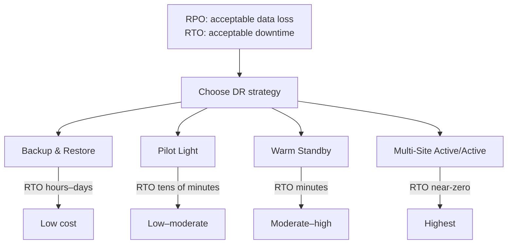

# Disaster Recovery and Multi-Region

## Overview

**Disaster recovery (DR)** is the process and tooling for restoring a system after a **large-scale event** — a failed region, a datacenter outage, or data corruption — not a routine component failure. Where **high availability** (HA) handles single-AZ/component failures in seconds, DR handles catastrophic, often **cross-region** scenarios.

The two numbers that drive every DR decision:

- **RPO (Recovery Point Objective)** — how much data loss is acceptable (how far back in time we recover to).
- **RTO (Recovery Time Objective)** — how long the system may be down before service is restored.

## HA vs DR vs Backups

| Concept | Handles | Scope | Example |
|---|---|---|---|
| **High availability** | Routine component failure | Single region, multi-AZ | RDS Multi-AZ failover when one AZ dies |
| **Disaster recovery** | Large-scale / catastrophic events | Cross-region | Failover to a secondary region |
| **Backups** | Data corruption, deletion, compliance | Point-in-time | Restore an RDS snapshot before a bad migration |

They are **complementary**, not substitutes: HA keeps you up through single failures; DR brings you back after region-scale loss; backups protect against *corrupted* data that replication would faithfully replicate (a bad write propagates to replicas — only point-in-time backups let you roll back past it).

## The Four DR Strategies

| Strategy | Model | RTO | RPO | Cost | Readiness |
|---|---|---|---|---|---|
| **Backup & Restore** | Passive | Hours–days | Hours–days | Lowest | Nothing running; redeploy + restore on demand |
| **Pilot Light** | Active/Passive | Tens of minutes–2h | Seconds–minutes | Low–moderate | Data replicated + core infra on; app tier off |
| **Warm Standby** | Active/Passive | Minutes (10–30) | Seconds–minutes | Moderate–high | Scaled-down but **fully functional**, always on |
| **Multi-Site Active/Active** | Active/Active | Seconds (near-zero) | Near-zero (async) | Highest | Full environment serving in multiple regions |

### Backup and Restore

Periodic snapshots/backups (e.g., RDS snapshots, S3 versioning, cross-region backup copies). Cheapest, but recovery means spinning up infrastructure and restoring data — RTO in hours. Fine for non-critical systems, dev/test, and as a **safety net beneath every other strategy**.

### Pilot Light

A minimal "pilot light" of the core (typically the **database**, continuously replicated) runs in the recovery region; the app tier is not running. On failover you **light up** compute (start instances, scale out ASGs, deploy the app) and switch DNS. Cheaper than warm standby, but failover takes tens of minutes while compute boots.

### Warm Standby

A **scaled-down but fully functional** replica of the environment runs continuously in the secondary region, receiving live data replication (low RPO). Failover just **scales up** the standby and reroutes traffic (Route 53 / Global Accelerator) — RTO in minutes. This is where most production apps with moderate SLAs land.

### Multi-Site Active/Active

The application serves traffic from **two or more regions simultaneously**, with data replicated continuously. A region failure means the others keep serving — near-zero RTO/RPO. The hardest part is **distributed write consistency** (conflict resolution, cross-region replication, or sharding by region); it's the most expensive because you run full capacity in every region.

## Cloud Building Blocks

| Goal | AWS | Azure | GCP |
|---|---|---|---|
| Compute failover | EC2 + ASG, AWS Elastic Disaster Recovery (DRS) | Azure Site Recovery, VMSS | Managed Instance Groups, Backup & DR |
| DB replication | RDS read replicas, Aurora Global Database | SQL Database geo-replication | Cloud SQL cross-region replicas, Spanner |
| Object storage | S3 Cross-Region Replication | Blob Storage GRS | Cloud Storage multi-region |
| DNS failover | Route 53 | Traffic Manager / Front Door | Cloud DNS, Global LB |
| IaC for reproducible recovery | CloudFormation, Terraform | ARM/Bicep | Deployment Manager, Terraform |

## DR Design Principles

1. **Define RTO/RPO first** — with business sign-off. Architecture must follow the numbers, not the tools.
2. **Use Infrastructure as Code** — the recovery site must be reproducible from code (Terraform/CloudFormation); manual recovery environments rot.
3. **Automate failover** — DNS health checks + runbooks; decide whether failover is automatic or manual (automatic needs careful blast-radius control).
4. **Replicate data continuously** for low RPO; **still take backups** (replication ≠ protection from corruption).
5. **Test, test, test** — game days and failover drills. An untested DR plan is a plan.
6. **Match strategy to business impact** — a read-only marketing site can use backup/restore or pilot light; a payment system needs warm standby or active/active.

## Multi-Region Considerations

- **Data residency** — some data must stay in-region (compliance). Choose DR regions accordingly.
- **Cross-region latency** — synchronous replication across regions is impractical at distance; use **asynchronous** replication and accept the RPO window.
- **Distributed writes** — active/active needs conflict resolution or region-sharded writes (see [Consensus](../distributed/consensus/README.md), [Replication](../distributed/replication/README.md)).
- **Configuration drift** — keep both regions in lockstep via IaC and CI/CD to both.
- **Cost** — every always-on strategy is a second environment; right-size the standby (Warm Standby runs reduced, active/active runs full).

## Interview Questions

### Q: What is the difference between RPO and RTO?

RPO is the maximum acceptable **data loss** — how far back in time you can recover (driven by backup/replication frequency). RTO is the maximum acceptable **downtime** — how long until service is restored (driven by how much is pre-deployed and how fast failover runs). Tight RPO/RTO targets cost more: continuous replication and always-on standby environments.

### Q: Pilot Light vs Warm Standby?

Both are active/passive. **Pilot Light** keeps only the critical core (usually the database) replicated and running in the recovery region; the app tier is off and must be provisioned at failover (RTO tens of minutes, cheaper). **Warm Standby** keeps a scaled-down but **fully functional** environment running — failover only scales it up (RTO minutes, higher always-on cost). Both need DNS/DATA-plane switching to direct traffic.

### Q: Why do you need backups even with multi-region replication?

Replication copies every write — including a **corrupting write** (bad migration, bug, ransomware). Backups give you a point-in-time snapshot to restore *before* the corruption. Replication protects against infrastructure loss; backups protect against logical data loss. Production DR stacks always include both.

### Q: How would you design DR for a mission-critical payment system?

Define tight RPO (near-zero) and RTO (seconds–minutes). Use **Warm Standby or Active/Active** across two regions: continuous async replication of the database (Aurora Global Database or equivalent), IaC-deployed infrastructure in both regions, automated health-checked failover (Route 53/Global Accelerator), plus continuous point-in-time backups for corruption recovery, and regular failover drills/game days to validate the runbook.

## References

- AWS: Disaster Recovery of Workloads on AWS (whitepaper) — https://docs.aws.amazon.com/whitepapers/latest/disaster-recovery-workloads-on-aws/
- AWS: Elastic Disaster Recovery — https://aws.amazon.com/disaster-recovery/
- Azure: Business continuity and disaster recovery — https://learn.microsoft.com/en-us/azure/architecture/framework/resiliency/
- Google Cloud: Disaster recovery planning guide — https://cloud.google.com/architecture/disaster-recovery

## Related Topics

- [Cloud Overview](./overview.md) — regions, AZs, elasticity
- [Autoscaling](./autoscaling.md) — scaling up a standby at failover
- [Availability Patterns](../interview/system-design/availability-patterns.md) — HA at the design level
- [Replication](../distributed/replication/README.md) — the data plane of DR
- [Consensus](../distributed/consensus/README.md) — consistency across regions
- [Backup and Restore](../interview/system-design/README.md) — design-level backup patterns
