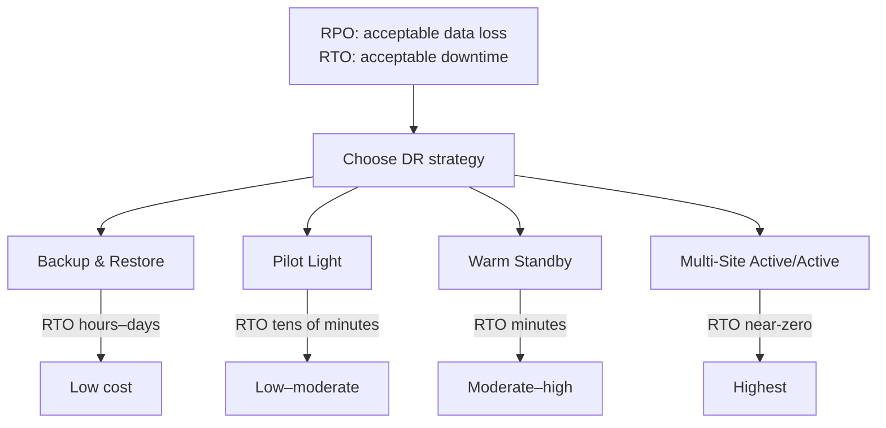
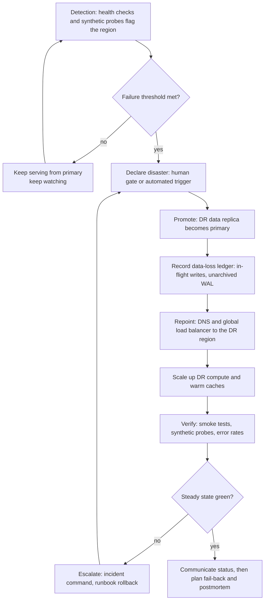

# Disaster Recovery and Multi-Region

## Overview

**Disaster recovery (DR)** is the process and tooling for restoring a system after a **large-scale event** — a failed region, a datacenter outage, or data corruption — not a routine component failure. Where **high availability** (HA) handles single-AZ/component failures in seconds, DR handles catastrophic, often **cross-region** scenarios.

The two numbers that drive every DR decision:

- **RPO (Recovery Point Objective)** — how much data loss is acceptable (how far back in time we recover to).
- **RTO (Recovery Time Objective)** — how long the system may be down before service is restored.

```mermaid
graph TD
    SUBJ["RPO: acceptable data loss<br/>RTO: acceptable downtime"] --> STRAT["Choose DR strategy"]
    STRAT --> B1["Backup & Restore"]
    STRAT --> B2["Pilot Light"]
    STRAT --> B3["Warm Standby"]
    STRAT --> B4["Multi-Site Active/Active"]
    B1 -->|"RTO hours–days"| C1["Low cost"]
    B2 -->|"RTO tens of minutes"| C2["Low–moderate"]
    B3 -->|"RTO minutes"| C3["Moderate–high"]
    B4 -->|"RTO near-zero"| C4["Highest"]
```

## RTO/RPO Budget Math

RTO and RPO are *budgets*, and every DR mechanism either spends against them or buys them down. Work the numbers bottom-up, not top-down: pick the mechanism, compute what it actually delivers, and compare to the business requirement. Two meta-rules first: **an RTO/RPO you have not measured is an RTO/RPO you believe** — the numbers below only become real on the testing ladder later in this page — and every component of the budget must have an owner, because "detection: 5 minutes" silently becomes "detection: 25 minutes" if nobody bought the synthetic probes.

**Worked example — 15-minute WAL/log shipping.** A primary database archives its write-ahead log to object storage (or ships it to a cross-region replica) every 15 minutes. On failover you replay the archived log. The **RPO** is the ship interval plus the replay tail: you lose up to 15 minutes of committed writes, and replaying the shipped log takes another few minutes before the promoted replica is caught up — so a realistic RPO is ≈ 15–18 minutes, not the "15 minutes" the architecture diagram promises. The **RTO** is the sum of the whole failover path: detection (how long until health checks *and humans* agree the region is down) + declaration + promotion + DNS repointing (bounded by TTLs) + verification. With 5 min detect, 5 min declare, 3 min promote, 2 min repoint, 5 min verify, RTO ≈ 20 minutes. If the business needs RPO < 1 minute, 15-minute shipping is disqualifying no matter how cheap it is — you need continuous streaming replication (or synchronous commits, with their latency cost), and the budget conversation restarts.

**Strategy-to-budget mapping (the cost-vs-RTO ladder):**

| Strategy | Achievable RTO | Achievable RPO | Rule-of-thumb cost | What you pay for |
|---|---|---|---|---|
| **Backup & Restore** | 4–24 h | Backup interval (15 min–24 h) | ~1× | Storage only |
| **Pilot Light** | 30 min–2 h | Seconds–minutes (replication lag) | ~2× | Always-on data layer, cold compute |
| **Warm Standby** | 5–30 min | Seconds | ~3–5× | A second, scaled-down, always-on environment |
| **Active/Active** | Seconds–1 min | Near-zero | ~10× | Full capacity plus write coordination in every region |

RPO is also negotiable *per data class*, which is where most budget fights actually get settled:

| Data Class | Example | Typical RPO Need | Mechanism |
|---|---|---|---|
| **Ledger / money** | Payments, orders, balances | Near-zero | Synchronous or semi-sync replication, idempotent writes |
| **Transactional state** | User profiles, sessions | Seconds–minutes | Continuous async replication |
| **Derived data** | Caches, search indexes, aggregates | Rebuildable | Rebuild on failover — don't replicate at all |
| **Analytical** | Logs, event history | Hours | Batch archive to object storage |

Reliability accounting doesn't pause for disasters: downtime and data loss during DR events still land against your SLOs and error budgets (see [SLOs and Error Budgets](../sre/slo-error-budget.md)), which is one more reason the numbers must be measured, not assumed.

**Failover decision path** — every DR runbook walks this graph, and each arrow is where time (RTO) or data (RPO) leaks:

```mermaid
flowchart TD
    A["Detection: health checks and synthetic probes flag the region"] --> B{"Failure threshold met?"}
    B -->|"no"| C["Keep serving from primary<br/>keep watching"]
    C --> A
    B -->|"yes"| D["Declare disaster: human gate or automated trigger"]
    D --> E["Promote: DR data replica becomes primary"]
    E --> F["Record data-loss ledger: in-flight writes, unarchived WAL"]
    F --> G["Repoint: DNS and global load balancer to the DR region"]
    G --> H["Scale up DR compute and warm caches"]
    H --> I["Verify: smoke tests, synthetic probes, error rates"]
    I --> J{"Steady state green?"}
    J -->|"no"| K["Escalate: incident command, runbook rollback"]
    K --> D
    J -->|"yes"| L["Communicate status, then plan fail-back and postmortem"]
```

## HA vs DR vs Backups

| Concept | Handles | Scope | Example |
|---|---|---|---|
| **High availability** | Routine component failure | Single region, multi-AZ | RDS Multi-AZ failover when one AZ dies |
| **Disaster recovery** | Large-scale / catastrophic events | Cross-region | Failover to a secondary region |
| **Backups** | Data corruption, deletion, compliance | Point-in-time | Restore an RDS snapshot before a bad migration |

They are **complementary**, not substitutes: HA keeps you up through single failures; DR brings you back after region-scale loss; backups protect against *corrupted* data that replication would faithfully replicate (a bad write propagates to replicas — only point-in-time backups let you roll back past it).

## The Four DR Strategies

| Strategy | Model | RTO | RPO | Cost | Readiness |
|---|---|---|---|---|---|
| **Backup & Restore** | Passive | Hours–days | Hours–days | Lowest | Nothing running; redeploy + restore on demand |
| **Pilot Light** | Active/Passive | Tens of minutes–2h | Seconds–minutes | Low–moderate | Data replicated + core infra on; app tier off |
| **Warm Standby** | Active/Passive | Minutes (10–30) | Seconds–minutes | Moderate–high | Scaled-down but **fully functional**, always on |
| **Multi-Site Active/Active** | Active/Active | Seconds (near-zero) | Near-zero (async) | Highest | Full environment serving in multiple regions |

### Backup and Restore

Periodic snapshots/backups (e.g., RDS snapshots, S3 versioning, cross-region backup copies). Cheapest, but recovery means spinning up infrastructure and restoring data — RTO in hours. Fine for non-critical systems, dev/test, and as a **safety net beneath every other strategy**.

### Pilot Light

A minimal "pilot light" of the core (typically the **database**, continuously replicated) runs in the recovery region; the app tier is not running. On failover you **light up** compute (start instances, scale out ASGs, deploy the app) and switch DNS. Cheaper than warm standby, but failover takes tens of minutes while compute boots.

### Warm Standby

A **scaled-down but fully functional** replica of the environment runs continuously in the secondary region, receiving live data replication (low RPO). Failover just **scales up** the standby and reroutes traffic (Route 53 / Global Accelerator) — RTO in minutes. This is where most production apps with moderate SLAs land.

### Multi-Site Active/Active

The application serves traffic from **two or more regions simultaneously**, with data replicated continuously. A region failure means the others keep serving — near-zero RTO/RPO. The hardest part is **distributed write consistency** (conflict resolution, cross-region replication, or sharding by region); it's the most expensive because you run full capacity in every region.

## Cloud Building Blocks

| Goal | AWS | Azure | GCP |
|---|---|---|---|
| Compute failover | EC2 + ASG, AWS Elastic Disaster Recovery (DRS) | Azure Site Recovery, VMSS | Managed Instance Groups, Backup & DR |
| DB replication | RDS read replicas, Aurora Global Database | SQL Database geo-replication | Cloud SQL cross-region replicas, Spanner |
| Object storage | S3 Cross-Region Replication | Blob Storage GRS | Cloud Storage multi-region |
| DNS failover | Route 53 | Traffic Manager / Front Door | Cloud DNS, Global LB |
| IaC for reproducible recovery | CloudFormation, Terraform | ARM/Bicep | Deployment Manager, Terraform |

## Backup Verification and Restore Drills

Untested backups are **Schrödinger's backups** — simultaneously intact and destroyed until you attempt a restore. Backup *jobs* succeeding proves nothing: the snapshot can be unrecoverable, truncated, encrypted by ransomware that also got the backup bucket, or restorable only in 14 hours when your RTO is 2. Therefore the unit of trust is the **restore drill**, not the backup job.

An automated restore-verify pipeline runs on a schedule (weekly for large databases, daily for critical ones):

1. **Restore** the latest snapshot into an isolated environment (never the production network).
2. **Validate** — checksums, row counts, referential-integrity spot checks, application-level smoke test against the restored copy.
3. **Measure** the restore wall-clock and compare against RTO; alert and treat as a regression when it drifts.
4. **Record** the result as evidence for auditors and as the RTO input for budget math.

Restore *speed* is an engineering problem of its own: a 5 TB restore is network- and I/O-bound, so practice parallel restore streams, right-sized restore instances, and pre-provisioned restore targets — then measure again. A drill that verifies correctness but takes 12 hours when RTO is 2 has verified your backup and failed your DR.

Beyond verification, protect the backups themselves: **immutability** (S3 Object Lock / WORM retention / immutable blob storage) makes restore points undeletable even by the credentials — or ransomware — that destroyed production, and an **air-gapped or cross-account copy** covers the case where the backup system's own credentials are compromised. See [Backup](../linux/admin/backup.md) for tooling and verification practice, and [S3 Internals](../storage/advanced/s3-internals.md) for durability and immutability primitives.

## Data-Layer Failover Mechanics

The data layer is where DR failover is won or lost; compute is reproducible, data is not.

**Async replica promotion and the data-loss ledger.** Cross-region replication is almost always asynchronous, so promotion is fast but *lossy by construction*. Before promoting, write down the ledger of what is lost: in-flight writes acknowledged by the primary but not yet shipped, unarchived WAL/binlog, data sitting in primary-side buffers or queues. This ledger is the operational reality of your RPO — and it drives the post-failover reconciliation work (dedupe re-sent writes, replay idempotently, notify downstream systems of the gap).

**Split-brain prevention.** After a partition, the old primary may still believe it is primary. Prevention is quorum-based: promote only via a distributed consensus store / witness (e.g., Patroni + etcd for Postgres, SQL Server witness, storage-level fencing), and fence the old primary — revoke its write access (fencing token, storage revocation, STONITH) *before* the new primary accepts writes. Manual "just start the DB in the DR region" during an incident is how you get two primaries and divergent data; see [Primary-Backup Replication](../distributed/replication/primary-backup.md) for the replication foundation and [Consensus](../distributed/consensus/README.md) for quorum mechanics.

**DNS / global-load-balancer repointing and its traps.** Repointing traffic is bounded by TTLs — clients and caching resolvers hold the old answer for up to the TTL you set (which is why a failover record needs a deliberately low TTL, trading DNS query cost for failover speed). Resolvers that ignore short TTLs, client-side connection pools that never re-resolve, and health-check evaluation lag all stretch the effective repoint time well past the TTL on paper. Health checks must probe the *data path*, not just the load balancer's ego.

**TLS, certificates, and secrets in the DR region.** The DR region needs serving certificates that are actually valid there (wildcards, multi-region issuance, or ACME automation), and it needs the *secrets* — database credentials, API keys, signing keys — available at failover time. Secrets replication (Vault DR clusters or managed secret replication) is part of the DR topology, not an afterthought; see [Vault & Secrets Management](../security/vault.md).

**Failback is a second failover.** Returning to the recovered region is its own operation with its own ledger: the DR region has been taking writes for hours, so it must re-sync in reverse (or ship its WAL back) *before* traffic can return, the cutover needs the same fencing discipline, and the data-loss window during reverse sync is another RPO negotiation. Plan failback during the incident's calm phase — schedule it, don't improvise it at 3 a.m. — and treat a region that just failed as suspect until it has proven itself again.

## Application-Layer Recovery

- **Stateless rehydration** — the DR app tier boots cold: image pulls storm the registry (use pull-through caches and pre-baked AMIs/images), autoscaling ramps from zero, and connection pools fill. What looks "stateless" in steady state still has warm-up state.
- **Cold caches are part of RTO** — a standby with empty caches serves p99s several times worse under load right when the whole region's traffic arrives. Cache warming (or keeping hot caches in warm standby) belongs on the critical failover path, not in a follow-up ticket.
- **Queue durability and idempotent replay** — messages persisted to a durable queue (or mirrored Kafka topics) survive region loss, but the DR path re-delivers: consumers must be **idempotent**, because replay after failover is a certainty, not an edge case.
- **Config and feature-flag parity** — the DR region runs the *same* application, so config, feature flags, and service discovery must match to the build. Parity checks belong in CI (deploy to both regions from one pipeline), because config drift discovered during an incident is discovered far too late.

The unifying principle: anything the application needs to *start* or *stay correct* — images, caches, queues, config, flags, secrets — must exist in the DR region at failover time, and the cheap way to guarantee that is to make the DR path run somewhere real (staging, canary) every day.

## DR Design Principles

1. **Define RTO/RPO first** — with business sign-off. Architecture must follow the numbers, not the tools.
2. **Use Infrastructure as Code** — the recovery site must be reproducible from code (Terraform/CloudFormation); manual recovery environments rot.
3. **Automate failover** — DNS health checks + runbooks; decide whether failover is automatic or manual (automatic needs careful blast-radius control).
4. **Replicate data continuously** for low RPO; **still take backups** (replication ≠ protection from corruption).
5. **Test, test, test** — game days and failover drills. An untested DR plan is a plan.
6. **Match strategy to business impact** — a read-only marketing site can use backup/restore or pilot light; a payment system needs warm standby or active/active.

## The DR Testing Ladder

DR testing is a ladder — climb rungs in order; each rung de-risks the next:

| Rung | Test | Typical Frequency | Validates |
|---|---|---|---|
| **1. Tabletop** | Walk the runbook in a room (or call), no infra touched | Quarterly | Runbook accuracy, decision paths, role clarity |
| **2. Backup-restore drill** | Automated restore + verify pipeline | Weekly–monthly | RPO reality, restore wall-clock, backup integrity |
| **3. Single-component failover** | Promote one DB, repoint one service | Monthly–quarterly | Component runbooks, replica promotion, DNS repoint |
| **4. Full region evacuation** | GameDay: fail the whole region over | 1–2× per year | End-to-end RTO, cross-team coordination, real capacity |

Chaos engineering is the delivery vehicle for rungs 3 and 4: region-evacuation GameDays and dependency-failure injections are precisely chaos experiments with DR-sized blast radii (see [Chaos Engineering](../sre/chaos-engineering.md)). An evacuation that has never been rehearsed has an RTO you *believe*, not an RTO you *know*. And test the return trip too: fail-back drills catch the reverse-sync, repoint-back, and capacity problems that only appear when you undo a failover.

## Runbooks and DR-as-Code

**Automated triggers vs human declaration gates.** Fully automated failover is fast but fragile: a flapping health check or a bad deploy that mimics a regional outage triggers an evacuation — expensive, disruptive, and flappy itself. A human declaration gate is slower but doesn't amplify false positives. The common production compromise: **automate detection and recommendation, require a human to declare, automate execution** — the declarer gets a one-button runbook with the data-loss ledger and abort criteria pre-computed, and declares knowing exactly what will happen.

**DR-as-code.** The DR topology must live in the same IaC repository and the same CI/CD pipelines as production, so the recovery environment cannot drift from what production actually is. A DR region that was accurate two reorganizations ago is a museum, not a recovery site. Add a **quarterly topology diff** — compare deployed infrastructure (and config/flag parity) between primary and DR, and fail the check when they diverge.

A DR runbook for each service should contain, at minimum: the trigger criteria and who declares; the promotion and repoint steps with expected timings; the data-loss ledger template; abort and rollback criteria; the verification checklist; and the failback plan. If any of those are "ask the person who knows", that person is a single point of failure with worse availability than the region you are recovering from.

## Multi-Region Considerations

The deep dive on multi-region architecture patterns and replication topologies lives in [Multi-Region Architectures](../sre/multi-region.md); this page owns the DR lifecycle — budgets, backups, testing, failover mechanics, runbooks. The DR-specific slice:

- **Data residency** — some data must stay in-region (compliance). Choose DR regions accordingly.
- **Cross-region latency** — synchronous replication across regions is impractical at distance; use **asynchronous** replication and accept the RPO window.
- **Distributed writes** — active/active needs conflict resolution or region-sharded writes (see [Consensus](../distributed/consensus/README.md), [Replication](../distributed/replication/README.md)).
- **Configuration drift** — keep both regions in lockstep via IaC and CI/CD to both.
- **Cost** — every always-on strategy is a second environment; right-size the standby (Warm Standby runs reduced, active/active runs full).

## Cloud-Native Gotchas

- **Mass-evacuation capacity crunch.** When a region dies, every fleeing tenant lands in the neighbor regions at once: spot and GPU capacity vanishes, and service **quotas** (vCPU limits, instances-per-region) block your scale-up exactly when you need it. Pre-reserve capacity for warm standby, raise quotas *before* the incident, and rehearse the scale-up — capacity economics change under evacuation (see [Spot & Preemptible Instances](./spot-preemptible.md)).
- **Control-plane dependency.** In a degraded region the control plane itself may be impaired — you may be unable to create volumes, instances, or snapshots *there*. Recovery must run from a healthy region's control plane, and DR runbooks must not assume the failed region can be operated at all.
- **Region-locked services.** Some managed services have no cross-region replication or cannot run in your DR region at all. Inventory them and design the workaround (export paths, alternate services) in peacetime.
- **Cross-region dependency opacity.** Your DR region's health may depend on services that only exist in — or route through — the failed region (a global control plane, a centralized auth service, a single-region artifact registry). Map those hidden single points before the incident, not during it.
- **Cross-region bandwidth cost.** Constant replication bills data-transfer-out continuously — at scale this can rival the cost of running the standby itself. Model it in the cost-vs-RTO ladder before committing to active/active.

## Interview Questions

### Q: What is the difference between RPO and RTO?

RPO is the maximum acceptable **data loss** — how far back in time you can recover (driven by backup/replication frequency). RTO is the maximum acceptable **downtime** — how long until service is restored (driven by how much is pre-deployed and how fast failover runs). Tight RPO/RTO targets cost more: continuous replication and always-on standby environments.

### Q: Pilot Light vs Warm Standby?

Both are active/passive. **Pilot Light** keeps only the critical core (usually the database) replicated and running in the recovery region; the app tier is off and must be provisioned at failover (RTO tens of minutes, cheaper). **Warm Standby** keeps a scaled-down but **fully functional** environment running — failover only scales it up (RTO minutes, higher always-on cost). Both need DNS/DATA-plane switching to direct traffic.

### Q: Why do you need backups even with multi-region replication?

Replication copies every write — including a **corrupting write** (bad migration, bug, ransomware). Backups give you a point-in-time snapshot to restore *before* the corruption. Replication protects against infrastructure loss; backups protect against logical data loss. Production DR stacks always include both.

### Q: How would you design DR for a mission-critical payment system?

Define tight RPO (near-zero) and RTO (seconds–minutes). Use **Warm Standby or Active/Active** across two regions: continuous async replication of the database (Aurora Global Database or equivalent), IaC-deployed infrastructure in both regions, automated health-checked failover (Route 53/Global Accelerator), plus continuous point-in-time backups for corruption recovery, and regular failover drills/game days to validate the runbook.

### Q: The business wants RPO of zero, the budget says no. How do you negotiate?

Quantify the gap, then tier. Fully synchronous cross-region commits cost write latency (tens of milliseconds at region distance, on *every* write) and often an architecture change; that is what "RPO zero" actually buys. Offer tiers by data class: payments/ledger data gets synchronous or near-zero RPO treatment, session and analytics data tolerates minutes of async lag. Frame the decision as expected loss: (probability of regional failure) × (value of N minutes of writes) vs the incremental cost of tighter replication — and note that a warm standby at seconds-RPO often covers 95% of the value for 20% of the cost.

### Q: Design a restore drill for a 5 TB production database.

Automated, scheduled, isolated. Restore the latest snapshot into an isolated environment (separate network/account), then verify: checksums against source manifests, row counts on critical tables, referential spot checks, and an application smoke test that boots against the restored copy. Measure and record the restore wall-clock — that number *is* your achievable RTO for the backup-restore rung — and alert when it regresses past RTO. Run weekly if the data is critical, keep the results as audit evidence, and occasionally exercise a *point-in-time* restore (not just the latest snapshot), since that is what you need for corruption recovery.

### Q: How do you prevent split-brain during a region failover?

Promote only through a quorum: the promotion decision must come from a consensus store/witness (Patroni + etcd, SQL Server witness, storage-level coordinator) that a majority of witnesses agree the old primary is gone. Fence the old primary — revoke its write access via fencing token, storage revocation, or STONITH — *before* the new primary accepts writes, so a partitioned-but-alive old primary cannot take writes. Never allow operators to "just start the database" in the DR region outside the promotion tooling, and test the partitioned-old-primary case explicitly in a GameDay.

### Q: What is the trap with DNS-based failover?

TTLs and caching. You can update the DNS record in seconds, but clients and recursive resolvers hold the old answer for up to the TTL — and some resolvers ignore short TTLs entirely — so part of the traffic keeps hitting the dead region long after "failover" happened. Connection pools that don't re-resolve on reconnect stretch it further, and health-check evaluation lag adds detection time on the front end. Mitigate with a deliberately low TTL on failover records (trading DNS query volume for failover speed), health checks that probe the real data path, global load balancers with their own fast health checking, and clients that re-resolve on connection failure.

## References

- AWS: Disaster Recovery of Workloads on AWS (whitepaper) — https://docs.aws.amazon.com/whitepapers/latest/disaster-recovery-workloads-on-aws/
- AWS: Elastic Disaster Recovery — https://aws.amazon.com/disaster-recovery/
- Azure: Business continuity and disaster recovery — https://learn.microsoft.com/en-us/azure/architecture/framework/resiliency/
- Google Cloud: Disaster recovery planning guide — https://cloud.google.com/architecture/disaster-recovery
- AWS whitepaper: Disaster Recovery Workloads on AWS — https://docs.aws.amazon.com/whitepapers/latest/disaster-recovery-workloads-on-aws/disaster-recovery-workloads-on-aws.html
- Azure Well-Architected Framework: Disaster recovery — https://learn.microsoft.com/en-us/azure/well-architected/reliability/disaster-recovery
- Google SRE books (free online) — https://sre.google/books/

## Related Topics

- [Multi-Region Architectures](../sre/multi-region.md) — owns the replication-topology deep dive
- [Chaos Engineering](../sre/chaos-engineering.md) — region-evacuation game days
- [SLOs and Error Budgets](../sre/slo-error-budget.md) — reliability accounting during DR events
- [Backup](../linux/admin/backup.md) — backup tooling and verification practice
- [S3 Internals](../storage/advanced/s3-internals.md) — object durability and immutability primitives
- [Primary-Backup Replication](../distributed/replication/primary-backup.md) — the replication foundation DR stands on
- [Vault & Secrets Management](../security/vault.md) — secrets availability in the DR region
- [Spot & Preemptible Instances](./spot-preemptible.md) — capacity economics that change under evacuation
- [Cloud Overview](./overview.md) — regions, AZs, elasticity
- [Autoscaling](./autoscaling.md) — scaling up a standby at failover
- [Availability Patterns](../interview/system-design/availability-patterns.md) — HA at the design level
- [Replication](../distributed/replication/README.md) — the data plane of DR
- [Consensus](../distributed/consensus/README.md) — consistency across regions
- [Backup and Restore](../interview/system-design/README.md) — design-level backup patterns
