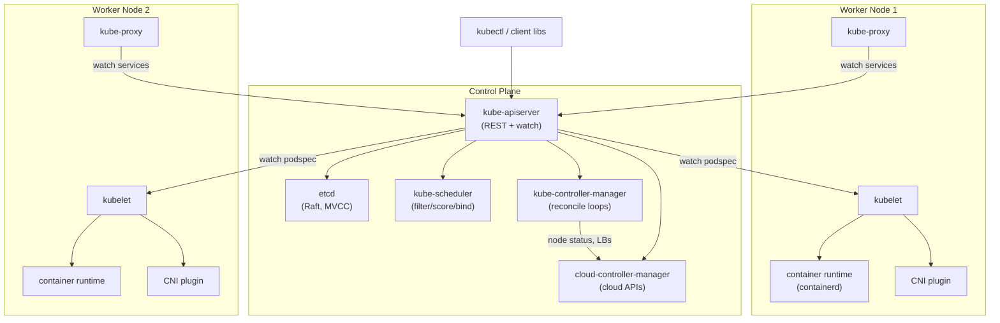
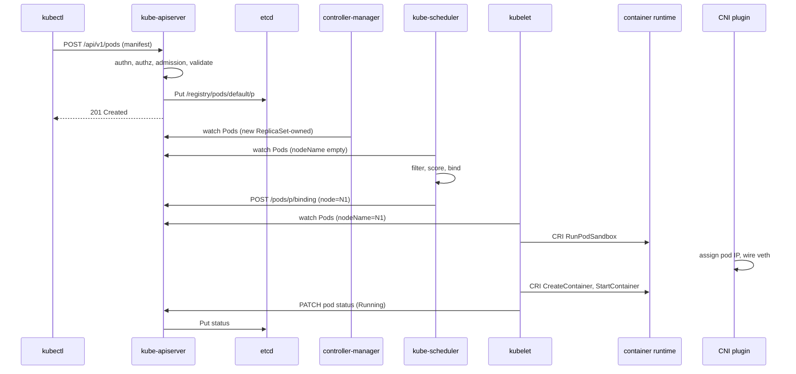
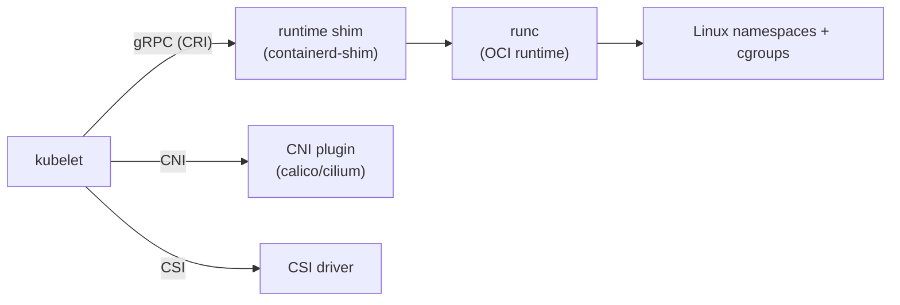
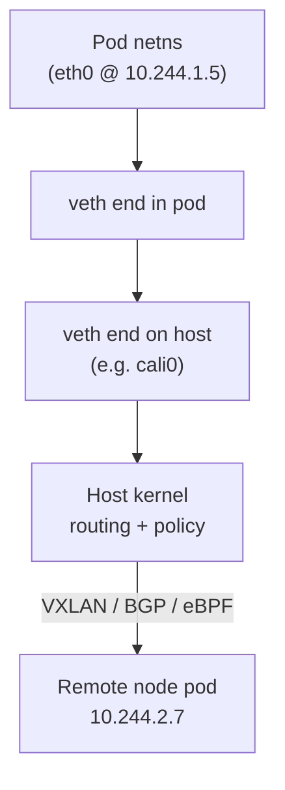
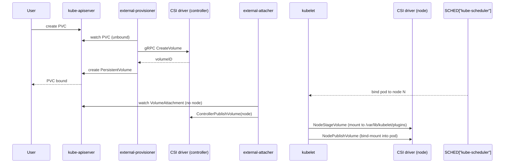
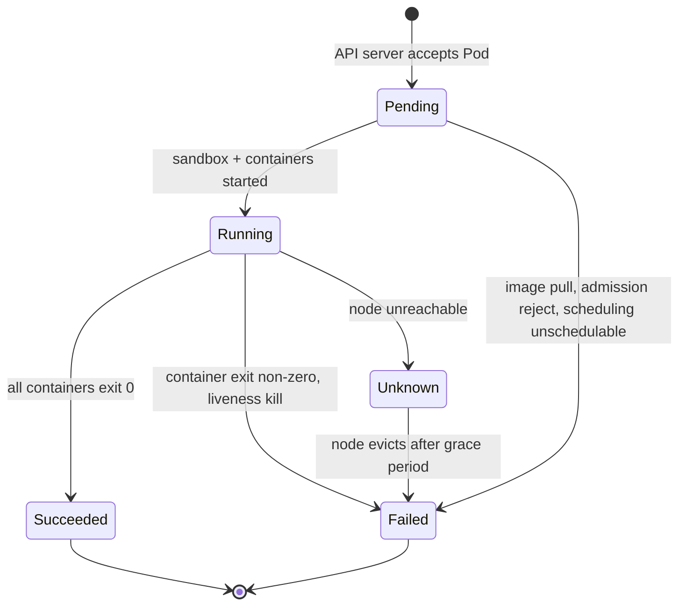
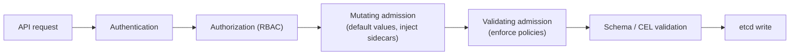
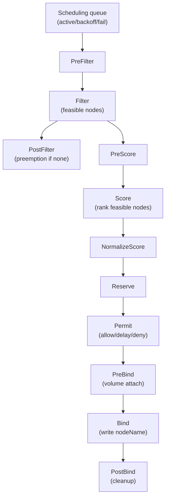
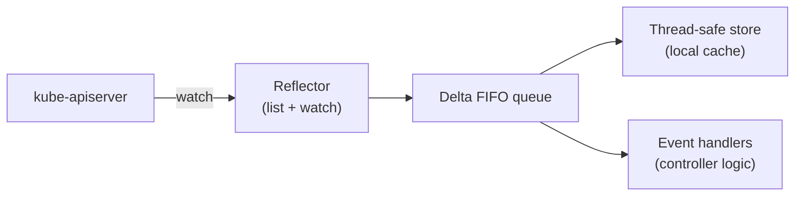

# Kubernetes Internals Deep Dive

## Why Internals Matter

Most engineers use Kubernetes through `kubectl apply` and treat the control plane as a black box. That works until a pod is stuck in `Pending`, a node is `NotReady`, an admission webhook silently mutates a manifest, or etcd quorum is lost during a rolling upgrade. Understanding the internals — what each binary does, how components talk to each other, where state actually lives — is the difference between operating a cluster and merely deploying to one.

This page consolidates the architectural internals that are scattered across [README](./kubernetes/README.md), [Scheduling](./kubernetes/scheduling.md), [Networking](./kubernetes/networking.md), [Storage](./kubernetes/storage.md), [Pods](./kubernetes/pods.md), [Operators](./kubernetes/operators.md), and [Backend Containers](../backend/containers/kubernetes.md). It focuses on the *mechanism level*: which RPC is called, which API object is written, which kernel feature is used.

References throughout: Kubernetes official docs, *Kubernetes Up & Running* (Hightower, Burns & Beda), etcd docs, containerd docs, the CRI/CNI/CSI specifications, and *Kubernetes the Hard Way* (Kelsey Hightower).

## Control Plane Architecture



### kube-apiserver

The **API server** is the only component that reads or writes `etcd`. Every other component — kubelet, scheduler, controllers, kube-proxy, the cloud-controller-manager, your `kubectl` — is a client. The flow inside the API server for a single `POST /api/v1/namespaces/default/pods` request is:

1. **Authentication** — verify the client's identity (client certs, bearer tokens, OIDC tokens, webhook auth).
2. **Authorization** — RBAC check (`Subject → Verb → Resource → Namespace`).
3. **Admission** — run mutating plugins, then validating plugins (see [Admission Controllers](#admission-controllers)).
4. **Schema validation** — OpenAPI / CEL validation against the resource's schema.
5. **etcd write** — only the API server touches etcd, via gRPC.
6. **Watch fan-out** — components watching `Pods` receive the new object on their watch stream.

The API server is stateless and horizontally scalable; production clusters run 3+ instances behind a load balancer. Only one writes to etcd at a time because etcd itself serializes writes via Raft.

### etcd — The Source of Truth

`etcd` is a strongly consistent, distributed key-value store using the **Raft consensus algorithm**. A quorum of \\( (N/2)+1 \\) members is required for writes; the standard production topology is 3 or 5 members across failure domains.

Internally etcd is a **multi-version concurrency control (MVCC)** store. Every write creates a new revision; the previous value is retained until compaction. The Kubernetes `resourceVersion` field on every object is the etcd revision of the last write — it is the mechanism behind optimistic concurrency:

```yaml
# A Status update includes the resourceVersion it observed.
# The API server rejects the write if the object changed in between.
metadata:
  resourceVersion: "12345"
status:
  phase: Running
```

If two controllers race to update the same object, the second one gets a `409 Conflict` and must re-`GET`, re-apply, and retry — this is the basis of all Kubernetes reconciliation.

Kubernetes stores objects under prefix-encoded keys: `/registry/pods/default/my-pod`, `/registry/services/default/my-svc`, `/registry/leases/default/my-lease`, etc. **Leases** (coordination.k8s.io/Lease) back leader election (kube-controller-manager, kube-scheduler, operators) and node heartbeats — every 10 s (default) the kubelet writes a Lease renewing its node's liveness. A node is marked `NotReady` after 40 s without a renewal.

Losing etcd means losing the cluster. `etcdctl snapshot save` should be part of every backup job.

### kube-scheduler

The scheduler watches for Pods with an empty `spec.nodeName` and runs the **scheduling framework** (see [Scheduling Framework](#scheduling-framework)) to pick a node. It then writes the binding back to the API server via the `Bindings` subresource — it never contacts the kubelet directly. The scheduler is leader-elected; only one instance is active.

### kube-controller-manager

A single binary running many **controllers** in one process — each controller is a reconciliation loop watching a resource type and driving the cluster toward the desired state. Examples:

| Controller | Watches | Reconciles |
|------------|---------|-----------|
| ReplicaSet | Pods, ReplicaSets | Adds/removes pods to match `spec.replicas` |
| Deployment | Deployments, ReplicaSets | Rolls ReplicaSets forward during updates |
| Node | Nodes, Pods | Marks nodes `NotReady`, evicts pods after grace period |
| EndpointSlice | Services, Pods | Populates pod IPs backing each Service |
| Job / CronJob | Jobs | Creates pods until completions satisfied |
| ServiceAccount | Namespaces | Auto-creates `default` SA per namespace |
| garbage-collection | Owners | Cascades deletes to dependents |

The reconciliation pattern: `observe (watch + list) → diff desired vs actual → act (create/update/delete) → re-observe`. Because every write goes through the API server, the same optimistic-concurrency model protects every controller.

### cloud-controller-manager

Decouples cloud-specific logic (load balancers, node lifecycle, routes) from the core control plane. It runs three controllers:

- **Node controller** — annotates nodes with provider IDs, checks that the cloud instance still exists.
- **Route controller** — configures cloud routing so pod CIDRs are reachable.
- **Service controller** — provisions cloud load balancers for `type: LoadBalancer` services and updates `status.ingress` with the LB hostname/IP.

On managed offerings (EKS, GKE, AKS) the cloud-controller-manager is operated by the provider.

| Component | Role | Talks To | State? |
|-----------|------|---------|--------|
| **kube-apiserver** | Frontend; authn/authz/admission/etcd writes; serves watch | etcd, all clients | Stateless |
| **etcd** | Strongly consistent KV store; Raft; MVCC | other etcd peers | Stateful — back up |
| **kube-scheduler** | Assigns Pods to nodes via scheduling framework | API server only | Leader-elected |
| **kube-controller-manager** | Runs all built-in reconcile loops | API server only | Leader-elected |
| **cloud-controller-manager** | Cloud-specific LB/node/route integration | API server + cloud APIs | Leader-elected |

## Request Flow: kubectl → Pod Running



The entire path is **declarative and async**. `kubectl apply` returns after step 3 — well before the container actually starts. The other steps are driven by watches and reconciliation loops, not by the original request.

## Data Plane

### kubelet

The kubelet is the **node agent**. It runs as a systemd unit (not in a container) on every node and is responsible for:

- Watching the API server for Pods bound to its node (`spec.nodeName == thisNode`).
- Translating the PodSpec into **CRI** calls (RunPodSandbox, CreateContainer, StartContainer, StopContainer, RemovePodSandbox).
- Invoking the **CNI** plugin to set up networking for the pod sandbox; mounting volumes via in-tree or **CSI** drivers.
- Running **probes** (liveness, readiness, startup) and restarting unhealthy containers; performing **eviction** under pressure.
- Reporting node status, pod status, and metrics (via the cadvisor integration) back to the API server.

The kubelet exposes a read-only API on `:10255` (deprecated/disabled by default) and a secure API on `:10250` (client-cert auth).

### kube-proxy

`kube-proxy` watches `Services` and `EndpointSlices`, then programs the kernel so traffic to a Service VIP is DNATed to a healthy pod IP. Despite the name, it is **not** a userspace proxy in modern modes — it programs `iptables` or `IPVS` rules so the kernel itself does the rewriting.

| Mode | Mechanism | Lookup Cost | Notes |
|------|-----------|-------------|-------|
| `iptables` (default) | Random DNAT rule per endpoint | O(n) rule traversal | Slow with >5k services |
| `ipvs` | Linux IPVS in-kernel virtual server | O(1) hash lookup | Scales to 50k+ services |
| `nftables` (1.29+) | nftables set-based rewriting | O(1) | Replaces iptables long-term |
| `userspace` (legacy) | Userspace socks proxy | Very slow | Removed in recent versions |

See [Networking Deep Dive](./kubernetes/networking.md) for kube-proxy algorithms and IPVS schedulers.

### Container Runtime

The container runtime runs containers. Since Kubernetes 1.24 (dockershim removed), the runtime must implement the **CRI** gRPC API. The kubelet does not know how to start a container — it only knows how to call `runtime.v1.RuntimeService.RunPodSandbox`.

## CRI — Container Runtime Interface

The **CRI** is a gRPC API defined in `k8s.io/cri-api`. The kubelet acts as client; the runtime implements two services:

- **RuntimeService** — pod sandbox lifecycle, container lifecycle, exec/attach, image pull/list.
- **ImageService** — image pull, list, remove, status.

A **pod sandbox** is the CRI's abstraction for "the environment a pod's containers share" — the network namespace, IPC namespace, and (optionally) PID namespace. The sandbox is created *before* any container in the pod; containers then join the sandbox's namespaces. This is what enables multiple containers in one pod to share an IP.



**containerd** is the default runtime in most clusters. It pulls images, manages snapshots (via `overlayfs` by default), and spawns a `containerd-shim-runc-v2` per container that reaps the process and reports exit status back to containerd (and thus the kubelet).

**CRI-O** is a purpose-built minimal runtime from Red Hat / the OpenShift project — same CRI surface, fewer features for non-Kubernetes use cases.

**runc** is the low-level **OCI runtime** that actually creates the namespaces, sets up cgroups, and `exec`s the container process. Both containerd and CRI-O invoke runc as the final step. `kata-containers` and `gVisor` are alternative OCI runtimes that provide VM-level isolation.

| Runtime | Role | Origin | Typical Use |
|---------|------|--------|-------------|
| **containerd** | High-level CRI runtime | Docker/Docker donated | Default for most clusters (EKS, GKE, kind) |
| **CRI-O** | High-level CRI runtime | Red Hat / CNCF | OpenShift, minimal footprint |
| **runc** | Low-level OCI runtime | Docker/OpenContainers | Invoked by containerd and CRI-O |
| **kata-containers** | OCI runtime (VM) | OpenStack/CNCF | Strong isolation for untrusted workloads |
| **gVisor (runsc)** | OCI runtime (kernel sandbox) | Google | Strong isolation, syscall filtering |
| **cri-dockerd** | CRI shim over Docker | Community | Legacy migration only (avoid) |

## CNI — Container Network Interface

The **CNI** spec (CNCF) defines a plugin interface for configuring pod networking. When the kubelet asks the runtime to create a pod sandbox, the runtime (or kubelet directly, depending on version) invokes the CNI plugin binary with `ADD` to assign an IP and wire interfaces, and `CONFLIST` configuration files in `/etc/cni/net.d/` describe which plugin to call.

The CNI plugin is responsible for:

1. Allocating an IP for the pod (from a node-local CIDR or via IPAM).
2. Creating a `veth` pair: one end in the pod's network namespace, one on the host.
3. Configuring the pod's `eth0`, routes, and ARP.
4. Programming the data plane so pod IPs are reachable across nodes (VXLAN, IPIP, BGP, native routing, or eBPF).



| CNI | Data Plane | Network Policy | Encapsulation | Best For |
|-----|-----------|----------------|---------------|----------|
| **Flannel** | VXLAN / host-gw / WireGuard | None (use with Calico) | VXLAN UDP 8472 | Simple clusters, getting started |
| **Calico** | BGP, IPIP, VXLAN, WireGuard | Rich (L3/L4) | Optional | Production with policy, on-prem |
| **Cilium** | eBPF (bypasses iptables) | L3-L7, DNS-aware | VXLAN or native | Modern clusters, observability |
| **bridge** | Linux bridge | None | None | Single-node dev only |
| **Weave Net** | VXLAN + DNS | Limited | VXLAN UDP 6784 | Legacy |
| **Antrea** | OVS datapath | Rich | VXLAN/GRE | VMware shops |

`kube-proxy` and the CNI both touch pod networking, but they're orthogonal: the CNI wires pod-to-pod; kube-proxy wires Service-to-pod. With Cilium, kube-proxy can be **replaced entirely** — eBPF programs handle both pod-to-pod and Service routing in one pass, removing the iptables bottleneck.

## CSI — Container Storage Interface

The **CSI** spec decouples storage drivers from the Kubernetes core. Before CSI, every cloud provider's storage code was compiled into the kubelet (in-tree volumes) — making updates fragile. Since Kubernetes 1.13, the in-tree drivers are migrated to CSI, and kubelet learns about CSI drivers through dynamic registration.

A CSI deployment has three parts:

- **CSI driver** — a DaemonSet (for node-level `NodePublishVolume`) plus a StatefulSet/Deployment (for control-plane calls like `CreateVolume`).
- **External provisioner** — watches PVCs and calls CSI `CreateVolume`/`DeleteVolume`.
- **External attacher** — watches `VolumeAttachments` and calls CSI `ControllerPublishVolume`/`ControllerUnpublishVolume`.

The attach/mount flow for a dynamic PVC:



Key CSI call points:

- **CreateVolume** — provision the disk/EBS/gce PD.
- **ControllerPublishVolume** (a.k.a. attach) — attach the disk to the node's VM.
- **NodeStageVolume** — mount the device to a global path on the node.
- **NodePublishVolume** — bind-mount the global path into the pod at the container's mount point.
- **NodeUnpublishVolume / NodeUnstageVolume / ControllerUnpublishVolume / DeleteVolume** — the reverse.

The split between `ControllerPublish` (VM-level attach) and `NodeStage` (filesystem mount) lets CSI support networked filesystems (NFS, EFS, CephFS) that have no "attach" step — they just skip the controller calls.

## Pod Lifecycle



A Pod's `status.phase` is a high-level summary; the real signal is in `status.conditions`:

| Condition | Meaning |
|-----------|---------|
| `PodScheduled` | A node has been assigned |
| `Initialized` | All init containers completed |
| `ContainersReady` | All containers report ready |
| `Ready` | Pod is in the Service's endpoints |

**Container restart policy** (`Always`, `OnFailure`, `Never`) is enforced by the kubelet, not the runtime. On crash, kubelet calls `CreateContainer` again with the same image and a monotonically increasing `restartCount`. CrashLoopBackOff is the kubelet's exponential backoff (10s → 20s → … → 300s cap) before retrying.

### Pod Sandbox and the Pause Container

When the kubelet creates a pod, the CRI call sequence is:

1. `RunPodSandbox` — creates the network/IPC namespaces (the "sandbox").
2. `CreateContainer` (×N) — each container joins the sandbox's namespaces.
3. `StartContainer` (×N).

For containerd and CRI-O with the default `runc` runtime, `RunPodSandbox` first starts a special **pause container** (image `registry.k8s.io/pause`). The pause container:

- Holds the pod's network namespace open via a sleeping process (`pause` calls `pause(2)`).
- Acts as the PID 1 of the pod's PID namespace if `shareProcessNamespace` is enabled.
- Reaps zombie processes for the pod.

Without the pause container, when an app container crashes and is recreated, the network namespace would be destroyed and the pod would lose its IP. The pause container outlives individual app container restarts and keeps the namespace stable. The kubelet never reports the pause container in `kubectl get pods` — it's hidden, but visible via `crictl ps --name POD` or `crictl pods --id <pod-uid>` on the node.

## Admission Controllers

After authz and before validation, every write to the API server runs through the **admission control chain**. Admission plugins fall into three families:



**Mutating** plugins may modify the object (add default labels, inject sidecars, set `spec.imagePullPolicy`). **Validating** plugins may reject but cannot mutate. Mutating always runs before validating — this is why a mutating webhook that injects a sidecar runs before the validating webhook that requires the sidecar to exist.

| Type | Built-in Examples | Behavior | Use Case |
|------|-------------------|----------|----------|
| **Mutating (built-in)** | `DefaultStorageClass`, `DefaultTolerationSeconds`, `NamespaceLifecycle`, `ServiceAccount`, `NodeRestriction`, `LimitRanger`, `TaintNodesByCondition` | Modify object, set defaults | Enforce defaults at write time |
| **Validating (built-in)** | `LimitRanger`, `ResourceQuota`, `PodSecurity`, `NamespaceExists`, `ObjectRef` | Reject writes that violate policy | Hard limits, security baselines |
| **MutatingAdmissionWebhook** | External webhook (Istio sidecar injector, Vault agent injector, Kyverno mutate, OPA Gatekeeper mutate) | Send object to a webhook URL; webhook returns JSON patch | Sidecar injection, secrets injection |
| **ValidatingAdmissionWebhook** | External webhook (Kyverno validate, Gatekeeper, Konstraint) | Send object to webhook; webhook returns allow/deny | Policy-as-code, custom governance |

`PodSecurity` (replacing the deprecated PodSecurityPolicy) implements the three Pod Security Standards: `privileged`, `baseline`, `restricted`. Applied per-namespace via labels:

```yaml
apiVersion: v1
kind: Namespace
metadata:
  name: production
  labels:
    pod-security.kubernetes.io/enforce: restricted
    pod-security.kubernetes.io/audit: restricted
    pod-security.kubernetes.io/warn: restricted
```

External admission webhooks must be highly available — a webhook outage makes the API server reject (or skip, if `failurePolicy: Ignore`) the resources it handles. Configure webhooks with `namespaceSelector` to limit blast radius and `failurePolicy: Fail` only for critical resources.

## Scheduling Framework

The scheduler is built on a plugin framework (GA in v1.19). Each scheduling cycle runs the same pipeline of extension points; plugins can be enabled, disabled, or replaced.



| Extension Point | Sample Plugins | Purpose |
|-----------------|----------------|---------|
| PreFilter | `NodePorts`, `NodeResourcesFit`, `VolumeRestrictions` | Pre-compute state, early reject |
| Filter | `NodeUnschedulable`, `TaintToleration`, `NodeAffinity`, `PodTopologySpread`, `VolumeBinding`, `InterPodAffinity` | Eliminate infeasible nodes |
| PostFilter | `DefaultPreemption` | Try preemption when no node fits |
| Score | `NodeResourcesFit`, `ImageLocality`, `InterPodAffinity`, `NodeAffinity` | Rank feasible nodes |
| Reserve | `NodeResourcesFit`, `VolumeBinding` | Optimistically reserve before bind |
| Permit | `Coscheduling` (Volcano) | Allow, delay, or deny binding |
| PreBind | `VolumeBinding` | Trigger dynamic PV provisioning |
| Bind | `DefaultBinder` | Write `spec.nodeName` |
| PostBind | (custom) | Cleanup / notification |

Custom schedulers and plugins enable use cases beyond the default: gang scheduling (Volcano), topology-aware scheduling, GPU bin-packing, cost-aware placement. The `schedulerName` field in a Pod's spec selects which scheduler handles it.

## Eviction and Graceful Shutdown

The kubelet actively manages node resources. Two eviction paths exist:

### 1. kubelet self-eviction (pressure-based)

When the node is under pressure (memory, disk, pid), the kubelet proactively evicts pods to reclaim resources. Thresholds are configurable; defaults are soft (alert) and hard (act):

| Signal | Default Hard Threshold | Action |
|--------|------------------------|--------|
| `memory.available` | 100 MiB | Evict BestEffort, then Burstable |
| `nodefs.available` | 10% | Delete unused images, then pods |
| `nodefs.inodesFree` | 5% | Delete pods to free inodes |
| `imagefs.available` | 15% | Delete unused images |
| `pid.available` | 10% | Evict pods to free PIDs |

Eviction order respects **QoS class** and **priority**:

1. BestEffort pods first (no requests/limits).
2. Then Burstable pods whose usage exceeds requests.
3. Guaranteed pods last.

### 2. API-driven eviction (priority preemption)

The scheduler's `PostFilter` plugin can preempt lower-priority pods to make room for a higher-priority pending pod. The **PriorityClass** resource drives this:

```yaml
apiVersion: scheduling.k8s.io/v1
kind: PriorityClass
metadata:
  name: critical
value: 1000000
globalDefault: false
preemptionPolicy: PreemptLowerPriority
description: "Production-critical workloads."
```

Preemption sends a `DELETE` with a grace period; lower-priority victims get a graceful shutdown.

### Graceful shutdown sequence

When a pod is deleted (or preempted, or evicted), the kubelet runs:

1. Send `SIGTERM` to each container's PID 1.
2. Run `preStop` hook if defined (e.g., `curl -X POST http://localhost:8080/shutdown`).
3. Wait for `terminationGracePeriodSeconds` (default 30s).
4. Send `SIGKILL` to any remaining processes.
5. Remove the pod sandbox.

Concurrently, the EndpointSlice controller removes the pod's IP from Service endpoints, so new connections stop arriving. If `preStop` plus actual shutdown exceeds the grace period, the pod is force-killed mid-shutdown — a common cause of dropped requests. Always set `terminationGracePeriodSeconds` larger than `preStop` + app shutdown.

## API Resources, Watches, and Informers

The Kubernetes API is resource-oriented with **list**, **get**, **create**, **update**, **patch**, **delete**, and **watch** verbs. **Watch** is the killer feature: instead of polling, a client opens an HTTP streaming connection and receives JSON-encoded events (`ADDED`, `MODIFIED`, `DELETED`, `BOOKMARK`) as objects change.

Controllers do **not** call the API server directly in tight loops — they use **informers**. An informer is a client-side cache:



The **reflector** does an initial `List`, then opens a `Watch` from the returned `resourceVersion`. Events flow into a delta FIFO queue, are stored in a local cache, and are dispatched to handler functions. The cache means controllers rarely issue `GET` — they read from local memory, which is orders of magnitude cheaper and reduces API server load. On disconnect, the reflector re-lists and resumes from the last-seen `resourceVersion`. If that revision has been compacted, it falls back to a full re-list.

This pattern is so universal that the `client-go` `informer` factory is the foundation of nearly every Kubernetes controller and operator (see [Operators](./kubernetes/operators.md)).

## Interview Questions

### Q1: Walk me through what happens when you run `kubectl apply -f deployment.yaml`.
**Answer**: kubectl authenticates and sends a `POST` (or `PATCH` if the object exists) to the API server. The API server authenticates the client, authorizes via RBAC, runs mutating admission plugins (e.g., inject `ServiceAccount`, default `imagePullPolicy`), runs validating admission (e.g., `ResourceQuota`, `PodSecurity`), validates against the OpenAPI schema, then writes to etcd. The write returns to kubectl. Asynchronously, the Deployment controller in kube-controller-manager sees the new Deployment via its informer, creates a ReplicaSet. The ReplicaSet controller creates Pods. The scheduler watches unbound Pods, runs filter+score+bind, writes `nodeName`. The kubelet on that node sees a Pod bound to it, calls CRI `RunPodSandbox`, invokes the CNI plugin, then `CreateContainer`/`StartContainer` for each container, and patches Pod status back to `Running`. The whole async path typically completes in 1-3 seconds for a small pod.

### Q2: Why does Kubernetes need a pause container?
**Answer**: The pause container holds the pod's network namespace (and optionally the PID namespace) open. When the kubelet creates a pod, the runtime first calls `RunPodSandbox`, which starts the pause container — that's the process that "owns" the namespaces. App containers then join that namespace. If an app container crashes and the kubelet recreates it, the network namespace survives because the pause container is still alive, so the pod keeps its IP, routes, and any established connections. The pause container also acts as PID 1 and reaps zombies when `shareProcessNamespace` is enabled. It's invisible to `kubectl get pods` but visible via `crictl ps`.

### Q3: What is `resourceVersion` and why does it matter?
**Answer**: `resourceVersion` is the etcd MVCC revision of the last write to an object. It's the foundation of optimistic concurrency in Kubernetes. When a controller (or kubectl, or another component) updates an object, it sends the `resourceVersion` it observed. The API server rejects the write with `409 Conflict` if the object has been modified since — forcing the client to re-GET, re-apply, and retry. This eliminates the need for distributed locks on most operations. It's also what makes watches efficient: clients resume from a `resourceVersion` and only receive deltas.

### Q4: How does the kubelet interact with the container runtime?
**Answer**: Via the CRI gRPC API. The kubelet is a client; containerd or CRI-O is the server (listening on a Unix socket, typically `/run/containerd/containerd.sock`). For a new pod, the kubelet calls `RunPodSandbox` (creates netns), then for each container: `PullImage` if needed, `CreateContainer`, `StartContainer`. For liveness probes it calls `ExecSync` or the equivalent. On delete it calls `StopContainer`, `RemoveContainer`, and `RemovePodSandbox`. The kubelet doesn't know about Docker or containerd specifics — it only knows the CRI surface. That's why dockershim could be removed in 1.24 without changing any kubelet code.

### Q5: Explain the difference between mutating and validating admission webhooks.
**Answer**: Both are external HTTP services called by the API server during admission. Mutating webhooks run first and may return a JSON patch that modifies the object (inject an Istio sidecar, add a Vault agent, set default labels). Validating webhooks run after all mutating webhooks have applied their patches, and can only allow or reject. This ordering ensures validators see the final form of the object. A common pattern: a mutating webhook injects a sidecar, and a validating webhook requires the sidecar exists — the latter guarantees no pod slips through unmodified.

### Q6: What happens when a node fails?
**Answer**: The node stops sending heartbeats (Lease renewals every 10 s by default). After ~40 s, the node controller in kube-controller-manager marks the node `NotReady` and adds a `node.kubernetes.io/not-ready:NoExecute` taint. Pods with a toleration for that taint keep running on the (now suspect) node. After `pod-eviction-timeout` (default 5 minutes), the node controller force-deletes the pods. The ReplicaSet controller then notices the missing replicas and creates new pods, which the scheduler places on healthy nodes. Note: the pods aren't actually "deleted" from the dead node — if the node comes back, the kubelet reports them as terminated. Until the force-delete, persistent volumes attached to the dead node remain stuck attached (use a force-detach via the CSI driver for recovery).

### Q7: How does Cilium replace kube-proxy, and why would you do that?
**Answer**: kube-proxy programs iptables (or IPVS) rules so packets to a Service VIP are DNATed to a pod IP. At scale this becomes a bottleneck: iptables rules are O(n) to traverse, and updating thousands of rules on every EndpointSlice change is slow. Cilium replaces this by loading eBPF programs into the kernel that handle Service lookup and DNAT in O(1) at the socket layer (sockmap) or XDP layer, with no iptables involvement. The win: lower latency, faster updates, and unified observability (Hubble) for both pod-to-pod and Service traffic. The trade-off: requires kernel ≥ 5.10 for the full feature set, and the operational model differs from iptables-based debugging.

### Q8: How does a CSI driver attach and mount a volume to a pod?
**Answer**: When a PVC is bound to a dynamically provisioned PV, the external-provisioner watches the PVC and calls the CSI driver's `CreateVolume`. After the pod is scheduled, the external-attacher sees the new `VolumeAttachment` and calls `ControllerPublishVolume` to attach the disk to the node's VM. The kubelet then calls the CSI node plugin's `NodeStageVolume` to mount the device to a global path, and `NodePublishVolume` to bind-mount it into the container at the requested mount path. On pod deletion, the kubelet calls `NodeUnpublishVolume` and `NodeUnstageVolume`; the external-attacher calls `ControllerUnpublishVolume`; the external-provisioner calls `DeleteVolume`. Network filesystems like NFS skip the controller attach step entirely.

## Common Mistakes

1. **Treating the API server as the bottleneck without measuring.** etcd write latency, admission webhooks, and watch fan-out all matter; profile before scaling.
2. **Running a single etcd member.** No quorum = no writes = cluster read-only. Always 3 or 5 members across AZs, and automate `etcdctl snapshot save` backups with restore drills.
3. **Misconfigured admission webhooks.** A webhook with `failurePolicy: Fail` can block all writes to a resource type. Scope webhooks with `namespaceSelector`.
4. **Setting `terminationGracePeriodSeconds` too low.** If `preStop` + app shutdown exceeds the grace period, requests drop. 60-90 s is safer than 30 s for stateful workloads.
5. **Using `imagePullPolicy: IfNotPresent` with `latest` tag.** The kubelet won't re-pull, so updates silently fail. Pin tags and use `Always`, or use digest references.
6. **Confusing QoS class with PriorityClass.** QoS (Guaranteed/Burstable/BestEffort) is derived from requests/limits and drives eviction order; PriorityClass is a separate field driving preemption. They interact but are not the same. Production workloads should set requests == limits (Guaranteed QoS) with a real PriorityClass.

## Summary

| Concept | Key Takeaway |
|---------|-------------|
| **kube-apiserver** | Stateless frontend; authn/authz/admission; only writer to etcd |
| **etcd** | Raft + MVCC; `resourceVersion` backs optimistic concurrency |
| **kube-scheduler** | Plugin framework: filter, score, bind |
| **kube-controller-manager** | Bundle of reconcile loops driven by informers |
| **kubelet** | Node agent; speaks CRI to the runtime, CNI for networking |
| **kube-proxy** | Programs iptables/IPVS for Service VIPs |
| **CRI / CNI / CSI** | gRPC runtime API / IPAM plugin / storage attach-mount pipeline |
| **Pause container** | Holds pod netns stable across container restarts |
| **Admission** | Mutating → Validating; webhooks are external HTTP services |
| **Eviction** | kubelet pressure-based; API preemption via PriorityClass |
| **Informers** | Reflector + local cache + event handlers; basis of every controller |

## References

- [Kubernetes Components](https://kubernetes.io/docs/concepts/overview/components/) · [kube-apiserver](https://kubernetes.io/docs/reference/command-line-tools-reference/kube-apiserver/) · [API conventions (resourceVersion)](https://github.com/kubernetes/community/blob/master/contributors/devel/sig-architecture/api-conventions.md)
- [etcd docs — MVCC, Raft, leases](https://etcd.io/docs/latest/)
- [CRI](https://kubernetes.io/docs/concepts/architecture/cri/) · [containerd](https://containerd.io/docs/) · [CRI-O](https://cri-o.io/) · [OCI runtime spec](https://github.com/opencontainers/runtime-spec)
- [CNI spec](https://github.com/containernetworking/cni/blob/main/SPEC.md) · [CSI spec](https://github.com/container-storage-interface/spec)
- [Scheduling Framework](https://kubernetes.io/docs/concepts/scheduling-eviction/scheduler-framework/) · [Admission Controllers](https://kubernetes.io/docs/reference/access-authn-authz/admission-controllers/) · [Pod Security Standards](https://kubernetes.io/docs/concepts/security/pod-security-standards/) · [Node-pressure eviction](https://kubernetes.io/docs/concepts/scheduling-eviction/node-pressure-eviction/)
- [Kubernetes the Hard Way — Kelsey Hightower](https://github.com/kelseyhightower/kubernetes-the-hard-way) · *Kubernetes Up & Running* (Hightower, Burns, Beda, O'Reilly 3rd ed., 2022) · [Client-go informers](https://pkg.go.dev/k8s.io/client-go/informers)

## Cross-References

- [Overview](./kubernetes/README.md) · [Pods](./kubernetes/pods.md) · [Scheduling](./kubernetes/scheduling.md) · [Networking](./kubernetes/networking.md) · [Storage](./kubernetes/storage.md) · [Services](./kubernetes/services.md) · [Ingress](./kubernetes/ingress.md) · [Operators](./kubernetes/operators.md) · [Security](./kubernetes/security.md) · [Debugging](./kubernetes/debugging.md) — sibling Kubernetes pages
- [Containers — Backend](../backend/containers/kubernetes.md) — Higher-level orchestration overview
- [Docker](../backend/containers/docker.md) — Image format, runtime model
- [VMs vs Containers](./virtualization/vm-vs-container.md) — Why containers vs hypervisors
- [eBPF Networking](../networks/ebpf-networking.md) — Cilium's data plane
- [cgroups](../os/containers/cgroups.md) · [namespaces](../os/containers/namespaces.md) — Linux primitives the pause container and kubelet rely on
