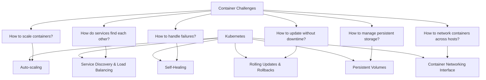
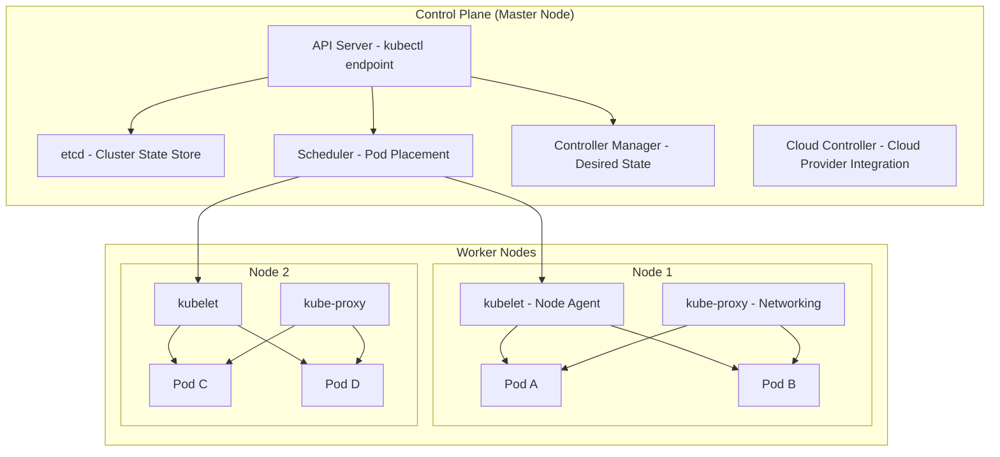
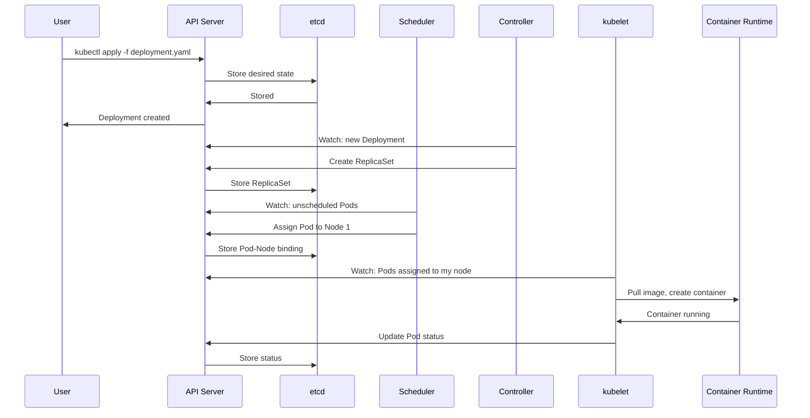
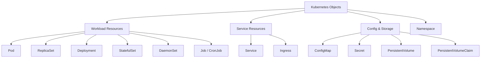
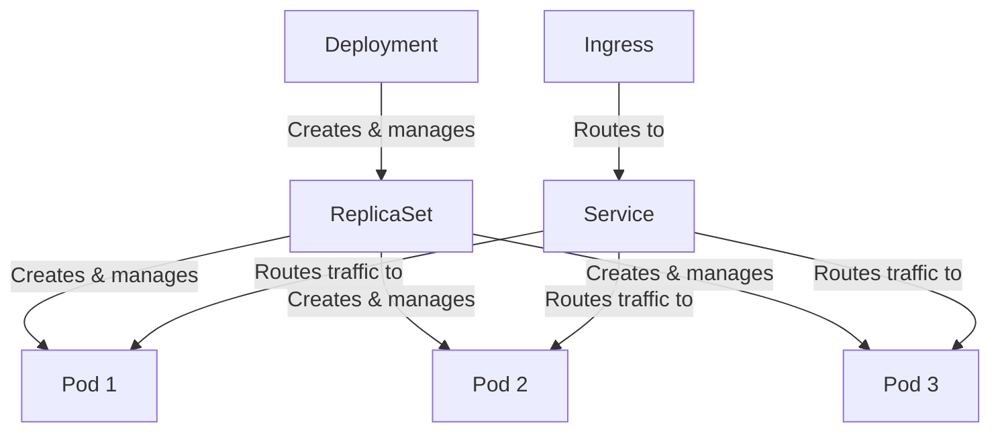
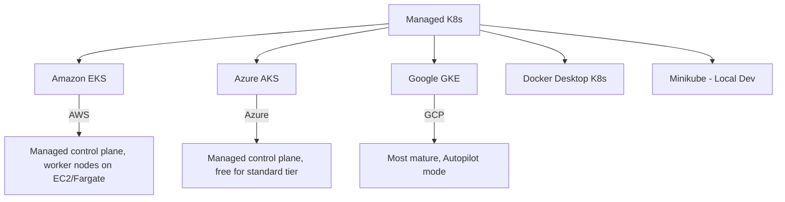

# Kubernetes Overview

## Introduction

Kubernetes (K8s) is an open-source container orchestration platform originally developed by Google and now maintained by the Cloud Native Computing Foundation (CNCF). It automates the deployment, scaling, and management of containerized applications across clusters of machines.

## Why Kubernetes?



## Kubernetes Architecture



### Control Plane Components

| Component | Role |
|-----------|------|
| **API Server (kube-apiserver)** | Frontend for the control plane; all communication goes through it (RESTful API) |
| **etcd** | Distributed key-value store holding all cluster state (single source of truth) |
| **Scheduler (kube-scheduler)** | Assigns newly created Pods to nodes based on resource requirements, affinity, taints |
| **Controller Manager** | Runs controllers that watch desired state and make actual state match (ReplicaSet, Deployment, Node) |
| **Cloud Controller** | Integrates with cloud provider APIs (load balancers, storage, node management) |

### Worker Node Components

| Component | Role |
|-----------|------|
| **kubelet** | Agent on each node; ensures containers described in PodSpecs are running and healthy |
| **kube-proxy** | Network proxy maintaining network rules; enables Service abstraction (iptables/IPVS) |
| **Container Runtime** | Runs containers (containerd, CRI-O)—not Docker since K8s 1.24 |
| **Pod** | Smallest deployable unit; one or more containers sharing network and storage |

## How Kubernetes Works



## Key Kubernetes Objects



### Object Hierarchy



## kubectl Essentials

```bash
# Get resources
kubectl get pods
kubectl get services
kubectl get deployments
kubectl get all -n my-namespace

# Describe resource (detailed info)
kubectl describe pod my-pod

# Create/Update from file
kubectl apply -f deployment.yaml

# Delete resource
kubectl delete pod my-pod

# View logs
kubectl logs my-pod
kubectl logs my-pod -c my-container  # Specific container
kubectl logs -f my-pod  # Follow/stream logs

# Execute command in pod
kubectl exec -it my-pod -- /bin/bash

# Port forward
kubectl port-forward svc/my-service 8080:80

# Scale deployment
kubectl scale deployment my-app --replicas=5

# Rollout
kubectl rollout status deployment/my-app
kubectl rollout history deployment/my-app
kubectl rollout undo deployment/my-app
```

## Managed Kubernetes Services



| Provider | Service | Key Features |
|----------|---------|-------------|
| **AWS** | EKS | Managed control plane, EC2/Fargate workers, IAM integration |
| **Azure** | AKS | Free control plane, Azure AD integration, virtual nodes |
| **GCP** | GKE | Autopilot mode, Anthos, most mature managed K8s |

## Interview Questions

### Q1: What is Kubernetes and why do we need it?
**Answer**: Kubernetes is a container orchestration platform that automates deployment, scaling, and management of containerized applications. We need it because managing containers manually across multiple hosts is complex—Kubernetes handles service discovery, load balancing, auto-scaling, self-healing, rolling updates, secret management, and storage orchestration. It provides a declarative API where you describe the desired state, and K8s continuously works to achieve it.

### Q2: Explain the Kubernetes architecture.
**Answer**: K8s has a Control Plane and Worker Nodes. The Control Plane includes: API Server (RESTful interface), etcd (cluster state store), Scheduler (assigns pods to nodes), Controller Manager (maintains desired state). Worker Nodes run: kubelet (node agent), kube-proxy (networking), and container runtime (containerd). The workflow: user submits manifests → API server stores in etcd → scheduler assigns pods → kubelet on the node creates containers.

### Q3: What is a Pod in Kubernetes?
**Answer**: A Pod is the smallest deployable unit in K8s. It's one or more containers that share the same network namespace (same IP, localhost), storage volumes, and lifecycle. Pods are ephemeral—they're created, destroyed, and replaced. Use cases for multi-container pods: sidecars (logging, proxy), init containers (setup tasks), adapters (format conversion). Pods are managed by higher-level controllers (Deployments, StatefulSets).

### Q4: What is the difference between a Deployment and a StatefulSet?
**Answer**: Deployment manages stateless applications—pods are interchangeable, have random names, can be scaled freely, and use rolling updates. StatefulSet manages stateful applications—pods have stable names (pod-0, pod-1), stable network IDs, ordered deployment/scaling, and persistent storage per pod. Use Deployment for web servers, APIs; use StatefulSet for databases, ZooKeeper, Kafka.

### Q5: How does Kubernetes achieve self-healing?
**Answer**: K8s continuously monitors the actual state and compares it to the desired state. If a pod crashes, the ReplicaSet controller detects the discrepancy and creates a new pod. If a node fails, the node controller marks pods as failed and reschedules them. If a pod fails health checks (liveness probe), kubelet restarts it. If a pod fails readiness probes, it's removed from service endpoints. This control loop runs continuously, ensuring the system self-heals.

## Common Mistakes

1. **Running everything in default namespace**: Use namespaces for organization and access control
2. **Not setting resource requests/limits**: Leads to resource starvation or OOM kills
3. **Using `latest` tag**: Unpredictable deployments, can't roll back properly
4. **Storing state in pods without persistent volumes**: Data lost on pod restart
5. **Not configuring health checks**: K8s can't self-heal without liveness/readiness probes
6. **Over-engineering early**: Don't use K8s for a simple app that needs one container
7. **Ignoring RBAC**: Default service accounts have too much access

## Summary

| Concept | Key Takeaway |
|---------|-------------|
| **Kubernetes** | Container orchestration for deployment, scaling, management |
| **Control Plane** | API Server, etcd, Scheduler, Controller Manager |
| **Worker Nodes** | kubelet, kube-proxy, container runtime, Pods |
| **Pods** | Smallest unit, one or more containers, ephemeral |
| **Deployments** | Declarative updates, rolling deployments, rollbacks |
| **Services** | Stable networking for pods (ClusterIP, NodePort, LoadBalancer) |

## Cross-References

- **Pods**: [Lifecycle & Resources](./pods.md) — Deep dive into Pods
- **Services**: [Service Types](./services.md) — Networking and service discovery
- **Deployments**: [Strategies](./deployments.md) — Rolling updates and rollbacks
- **Ingress**: [Controllers & Routing](./ingress.md) — HTTP routing
- **Docker**: [VMs vs Containers](../virtualization/vm-vs-container.md) — Container fundamentals
- **AWS EKS**: [EC2](../aws/ec2.md) — Worker nodes on EC2
- **CI/CD**: [GitOps](../cicd/gitops.md) — ArgoCD for K8s deployments
