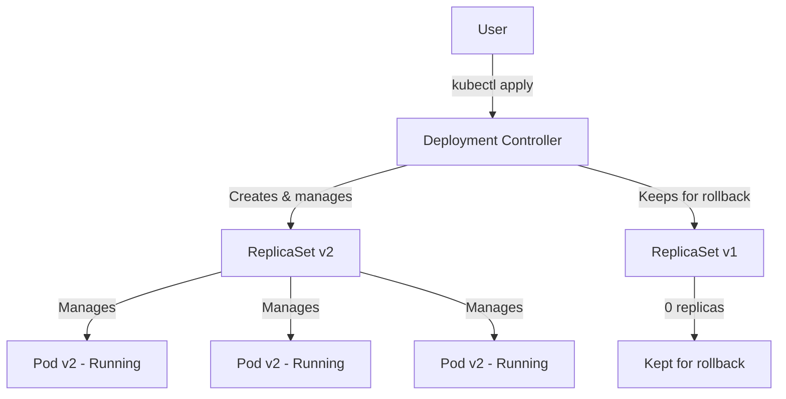
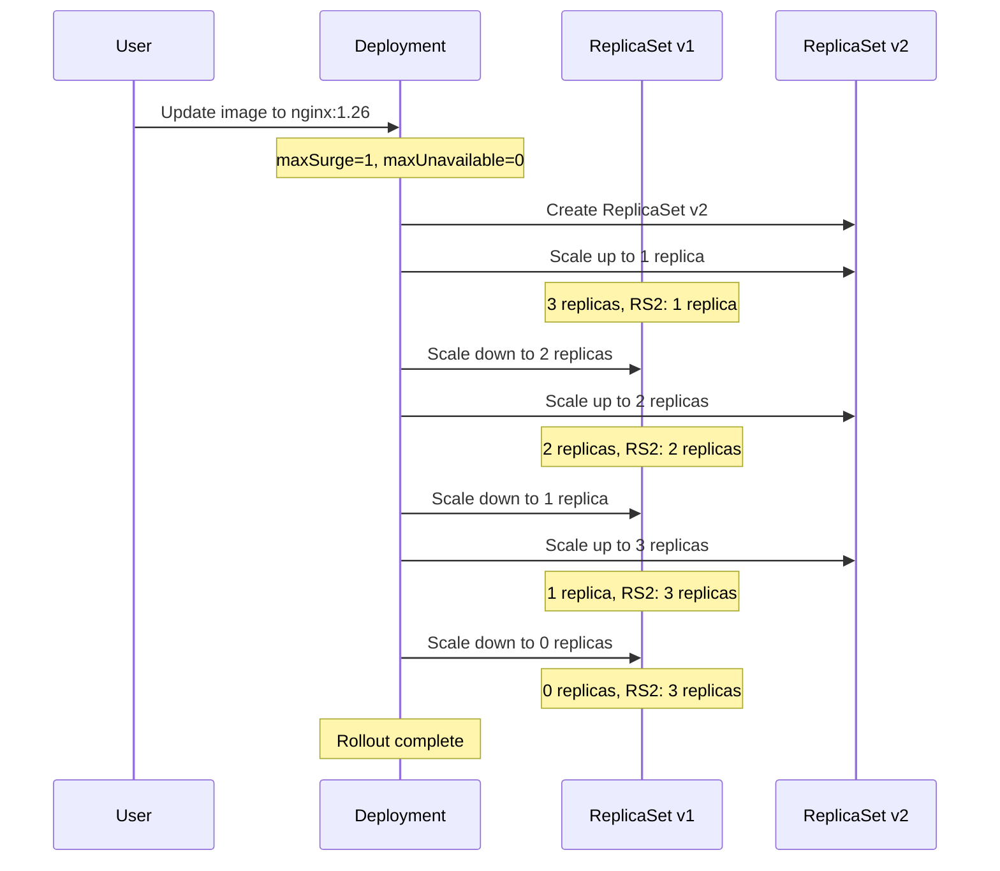
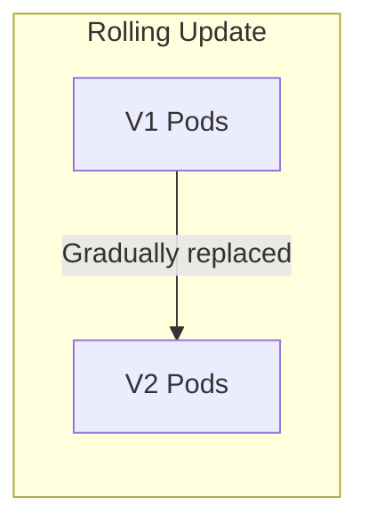
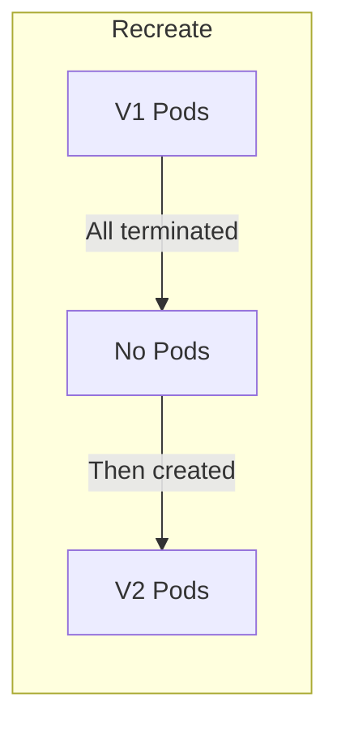
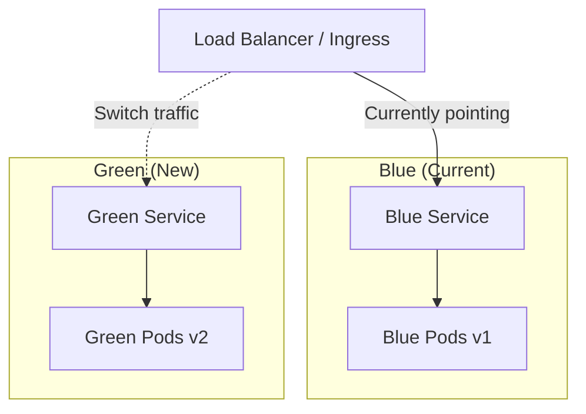
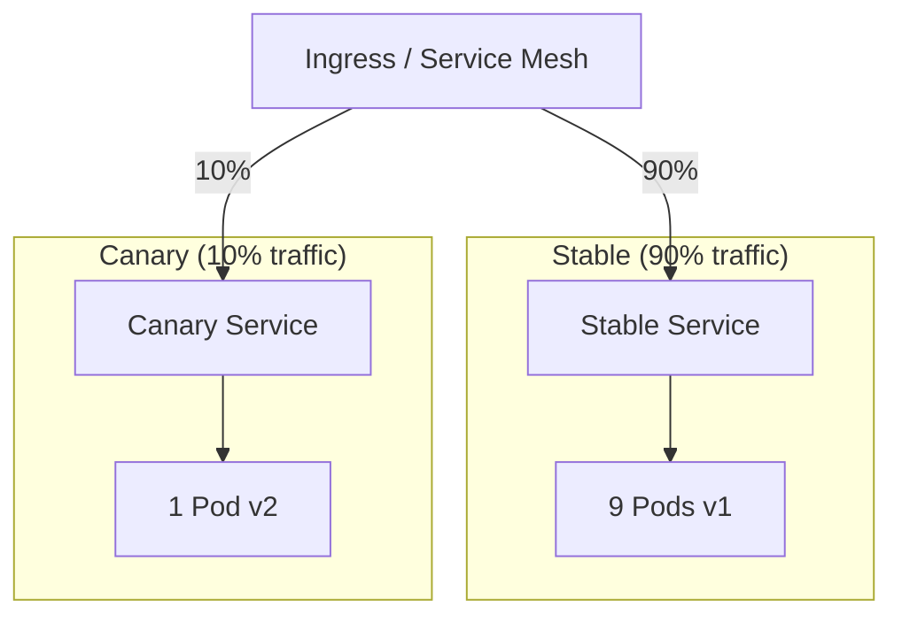
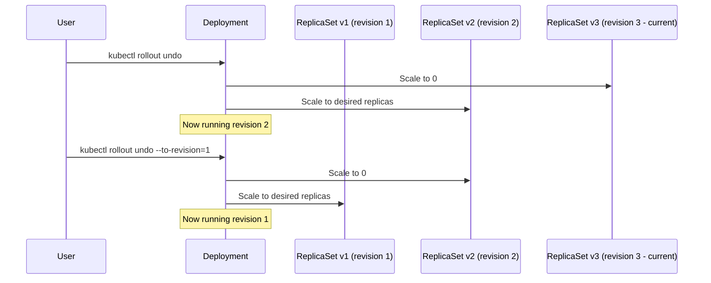
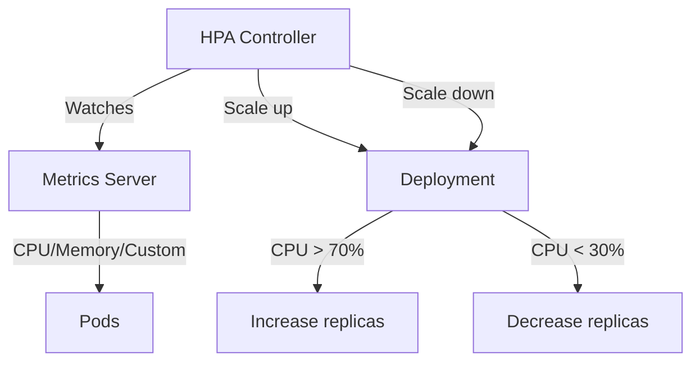

# Kubernetes Deployments

## Introduction

A Deployment provides declarative updates for Pods and ReplicaSets. You describe a desired state in a Deployment, and the Deployment controller changes the actual state to the desired state at a controlled rate. Deployments are the most common way to manage stateless applications in Kubernetes.

## Deployment Architecture



### Deployment vs ReplicaSet vs Pod

| Object | Purpose | Directly Created? |
|--------|---------|-------------------|
| **Pod** | Run containers | Rarely—managed by controllers |
| **ReplicaSet** | Maintain N pod replicas | Managed by Deployment |
| **Deployment** | Declarative updates, rollouts, rollbacks | **Yes**—this is what you create |

## Deployment Spec

```yaml
apiVersion: apps/v1
kind: Deployment
metadata:
  name: nginx-deployment
  labels:
    app: nginx
spec:
  replicas: 3
  selector:
    matchLabels:
      app: nginx
  strategy:
    type: RollingUpdate
    rollingUpdate:
      maxSurge: 1
      maxUnavailable: 0
  template:
    metadata:
      labels:
        app: nginx
    spec:
      containers:
        - name: nginx
          image: nginx:1.25
          ports:
            - containerPort: 80
          resources:
            requests:
              cpu: "100m"
              memory: "128Mi"
            limits:
              cpu: "250m"
              memory: "256Mi"
          readinessProbe:
            httpGet:
              path: /
              port: 80
            initialDelaySeconds: 5
            periodSeconds: 10
          livenessProbe:
            httpGet:
              path: /
              port: 80
            initialDelaySeconds: 15
            periodSeconds: 20
```

## Rolling Update Strategy



### Rolling Update Parameters

| Parameter | Description | Default |
|-----------|-------------|---------|
| **maxSurge** | Max pods above desired count during update | 25% |
| **maxUnavailable** | Max pods below desired count during update | 25% |

```mermaid
graph TB
    subgraph "maxSurge=1, maxUnavailable=0"
        MU0[Desired: 3] --> |During update| MU0_D[Min 3 available, max 4 total]
        MU0_D --> |Zero downtime| MU0_SAFE[Safest option]
    end

    subgraph "maxSurge=0, maxUnavailable=1"
        MU1[Desired: 3] --> |During update| MU1_D[Min 2 available, max 3 total]
        MU1_D --> |Some capacity loss| MU1_RISK[Reduced capacity]
    end

    subgraph "maxSurge=2, maxUnavailable=2"
        MU2[Desired: 3] --> |During update| MU2_D[Min 1 available, max 5 total]
        MU2_D --> |Fast but risky| MU2_FAST[Fast rollout, low availability]
    end
```



**Common Configurations:**

| Scenario | maxSurge | maxUnavailable | Trade-off |
|----------|----------|---------------|-----------|
| **Zero downtime** | 1 | 0 | Slowest, safest |
| **Balanced** | 25% | 25% | Default, good balance |
| **Fast rollout** | 100% | 0 | Fast, doubles resource usage |
| **Resource constrained** | 0 | 1 | Slower, doesn't need extra resources |

## Deployment Strategies

### Rolling Update (Default)



- Gradually replaces old pods with new ones
- Zero downtime (if configured correctly)
- Default Kubernetes strategy

### Recreate



```yaml
spec:
  strategy:
    type: Recreate
```

- Terminates all old pods before creating new ones
- **Downtime** between old and new pods
- Use when you can't have two versions running simultaneously (e.g., database schema changes)

### Blue-Green (Manual Implementation)



```bash
# Deploy green alongside blue
kubectl apply -f green-deployment.yaml
kubectl apply -f green-service.yaml

# Test green
kubectl port-forward svc/green-service 8080:80

# Switch traffic (update ingress or service selector)
kubectl patch ingress my-ingress -p '{"spec":{"rules":[{"http":{"paths":[{"backend":{"serviceName":"green-service","servicePort":80}}]}}]}}'

# Rollback if needed
kubectl patch ingress my-ingress -p '{"spec":{"rules":[{"http":{"paths":[{"backend":{"serviceName":"blue-service","servicePort":80}}]}}]}}'
```

**Pros**: Instant cutover, easy rollback, full testing before switch
**Cons**: Doubles resource usage, requires external traffic switching

### Canary (Manual Implementation)



```bash
# Deploy canary with 1 replica (vs 9 stable)
kubectl scale deployment stable-app --replicas=9
kubectl apply -f canary-deployment.yaml  # replicas: 1

# Use Ingress annotations or service mesh for traffic splitting
# Nginx Ingress canary annotations:
# nginx.ingress.kubernetes.io/canary: "true"
# nginx.ingress.kubernetes.io/canary-weight: "10"
```

**Canary with Ingress:**
```yaml
# Stable ingress
apiVersion: networking.k8s.io/v1
kind: Ingress
metadata:
  name: app-ingress
spec:
  rules:
    - host: app.example.com
      http:
        paths:
          - path: /
            pathType: Prefix
            backend:
              service:
                name: stable-service
                port:
                  number: 80

---
# Canary ingress
apiVersion: networking.k8s.io/v1
kind: Ingress
metadata:
  name: app-canary-ingress
  annotations:
    nginx.ingress.kubernetes.io/canary: "true"
    nginx.ingress.kubernetes.io/canary-weight: "10"
spec:
  rules:
    - host: app.example.com
      http:
        paths:
          - path: /
            pathType: Prefix
            backend:
              service:
                name: canary-service
                port:
                  number: 80
```

## Rollback



```bash
# View rollout history
kubectl rollout history deployment/nginx-deployment

# Rollback to previous revision
kubectl rollout undo deployment/nginx-deployment

# Rollback to specific revision
kubectl rollout undo deployment/nginx-deployment --to-revision=2

# View rollout status
kubectl rollout status deployment/nginx-deployment

# Pause rollout (for canary testing)
kubectl rollout pause deployment/nginx-deployment

# Resume rollout
kubectl rollout resume deployment/nginx-deployment
```

## Scaling

```yaml
# Manual scaling
apiVersion: apps/v1
kind: Deployment
metadata:
  name: nginx-deployment
spec:
  replicas: 5  # Change and apply
```

```bash
# Scale via kubectl
kubectl scale deployment nginx-deployment --replicas=5

# Auto-scaling (Horizontal Pod Autoscaler)
kubectl autoscale deployment nginx-deployment --min=2 --max=10 --cpu-percent=70
```

### Horizontal Pod Autoscaler (HPA)



```yaml
apiVersion: autoscaling/v2
kind: HorizontalPodAutoscaler
metadata:
  name: nginx-hpa
spec:
  scaleTargetRef:
    apiVersion: apps/v1
    kind: Deployment
    name: nginx-deployment
  minReplicas: 2
  maxReplicas: 10
  metrics:
    - type: Resource
      resource:
        name: cpu
        target:
          type: Utilization
          averageUtilization: 70
    - type: Resource
      resource:
        name: memory
        target:
          type: Utilization
          averageUtilization: 80
```

## Deployment Status Conditions

```yaml
status:
  conditions:
    - type: Available
      status: "True"
      reason: MinimumReplicasAvailable
      message: "Deployment has minimum availability."
    - type: Progressing
      status: "True"
      reason: NewReplicaSetAvailable
      message: "ReplicaSet has successfully progressed."
```

| Condition | Status | Meaning |
|-----------|--------|---------|
| **Available** | True | Minimum replicas are available |
| **Progressing** | True | Rollout is progressing |
| **Progressing** | False | Rollout stuck (timeout) |
| **Available** | False | Not enough replicas available |

## Interview Questions

### Q1: What is a Kubernetes Deployment and how does it work?
**Answer**: A Deployment is a declarative way to manage Pods and ReplicaSets. You specify the desired state (image, replicas, update strategy), and the Deployment controller continuously works to achieve it. It creates ReplicaSets, which create Pods. During updates, it creates a new ReplicaSet and gradually shifts traffic (rolling update by default). Old ReplicaSets are kept for rollback. Key features: scaling, rolling updates, rollbacks, pause/resume.

### Q2: Explain the different deployment strategies in Kubernetes.
**Answer**: (1) Rolling Update (default)—gradually replaces old pods with new ones, zero downtime, configurable maxSurge/maxUnavailable. (2) Recreate—terminates all old pods before creating new ones, has downtime, use when two versions can't coexist. (3) Blue-Green—deploy new version alongside old, switch traffic instantly, doubles resources. (4) Canary—send small percentage of traffic to new version, validate before full rollout. Implement Blue-Green/Canary using Ingress annotations, service mesh, or multiple Deployments.

### Q3: How does Kubernetes rollback work?
**Answer**: K8s keeps old ReplicaSets (scaled to 0) for rollback history. `kubectl rollout undo` scales down the current ReplicaSet and scales up the previous one. `kubectl rollout undo --to-revision=N` rolls back to a specific revision. The deployment history is limited by `revisionHistoryLimit` (default 10). Rollback is fast because old ReplicaSets still exist—just need to scale them up.

### Q4: What is maxSurge and maxUnavailable?
**Answer**: maxSurge controls how many extra pods can be created above the desired count during a rolling update. maxUnavailable controls how many pods can be unavailable below the desired count. Example: with 3 desired, maxSurge=1, maxUnavailable=0: K8s creates 1 new pod (4 total), waits for it to be ready, then removes 1 old pod. This ensures minimum 3 available at all times. maxSurge=0, maxUnavailable=1: K8s terminates 1 old pod first, then creates 1 new pod.

### Q5: How does HPA (Horizontal Pod Autoscaler) work?
**Answer**: HPA watches metrics (CPU, memory, custom) via the Metrics Server and adjusts the Deployment's replica count. Every 15 seconds (default), it calculates desired replicas: `desiredReplicas = ceil(currentReplicas * (currentMetricValue / targetMetricValue))`. It scales up quickly but scales down gradually (default 5-minute stabilization window) to prevent flapping. Requires resource requests to be set on containers (HPA calculates utilization as a percentage of requests).

## Common Mistakes

1. **Not setting resource requests**: HPA can't calculate utilization without requests
2. **Using `Recreate` when `RollingUpdate` works**: Causes unnecessary downtime
3. **maxUnavailable too high**: Reduces capacity during deployments
4. **Not using readiness probes**: Traffic sent to pods before they're ready
5. **Ignoring revisionHistoryLimit**: Old ReplicaSets consume resources
6. **Direct Pod creation**: Pods without controllers won't self-heal
7. **Not testing rollbacks**: Always verify rollback works before production

## Summary

| Concept | Key Takeaway |
|---------|-------------|
| **Deployment** | Declarative management of Pods and ReplicaSets |
| **Rolling Update** | Gradual replacement, zero downtime (default) |
| **Recreate** | All-at-once replacement, has downtime |
| **Blue-Green** | Parallel deployments, instant cutover |
| **Canary** | Gradual traffic shift, validation before full rollout |
| **Rollback** | Revert to previous ReplicaSet revision |
| **HPA** | Auto-scale based on CPU/memory/custom metrics |

## Cross-References

- **Pods**: [Lifecycle](./pods.md) — What Deployments manage
- **Services**: [Types](./services.md) — Network endpoints for Deployments
- **Ingress**: [Controllers](./ingress.md) — Traffic routing for canary/blue-green
- **CI/CD**: [Pipelines](../cicd/pipelines.md) — Automated deployments
- **GitOps**: [ArgoCD](../cicd/gitops.md) — Declarative deployment management
- **Observability**: [Monitoring](../observability/monitoring.md) — HPA metrics
