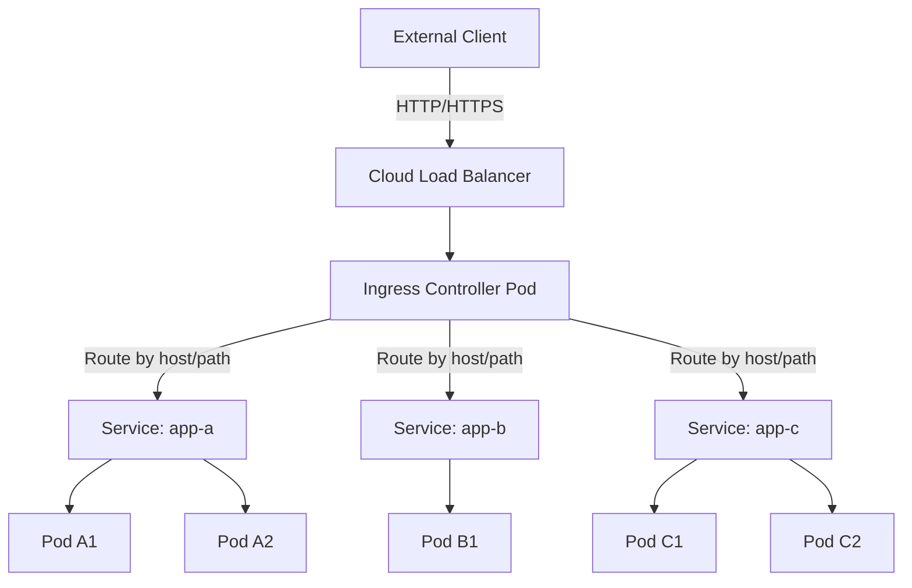
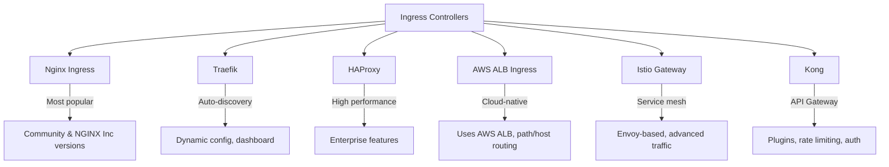
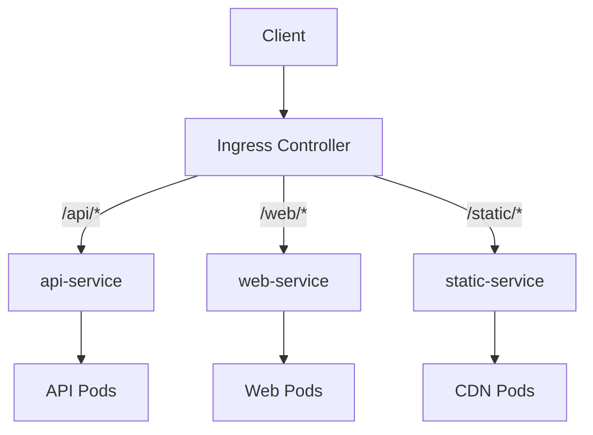
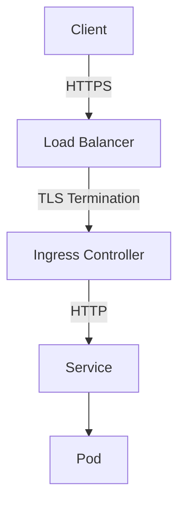
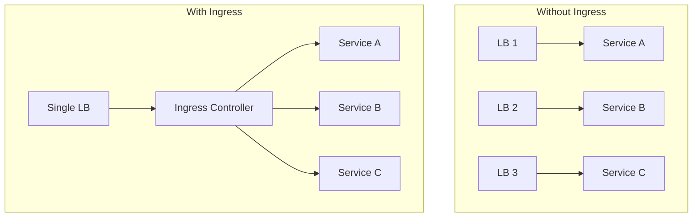

# Kubernetes Ingress

## Introduction

Ingress exposes HTTP and HTTPS routes from outside the cluster to services within the cluster. Traffic routing is controlled by rules defined on the Ingress resource. It acts as a layer 7 (HTTP/HTTPS) load balancer and reverse proxy.

## Ingress Architecture



**Key Components:**
- **Ingress Resource**: YAML definition of routing rules
- **Ingress Controller**: Software that fulfills the Ingress (Nginx, Traefik, HAProxy, ALB)
- **Load Balancer**: Cloud provider's LB that fronts the Ingress Controller

## Ingress Resource

```yaml
apiVersion: networking.k8s.io/v1
kind: Ingress
metadata:
  name: app-ingress
  annotations:
    nginx.ingress.kubernetes.io/rewrite-target: /
spec:
  ingressClassName: nginx
  rules:
    - host: app.example.com
      http:
        paths:
          - path: /api
            pathType: Prefix
            backend:
              service:
                name: api-service
                port:
                  number: 80
          - path: /web
            pathType: Prefix
            backend:
              service:
                name: web-service
                port:
                  number: 80
    - host: admin.example.com
      http:
        paths:
          - path: /
            pathType: Prefix
            backend:
              service:
                name: admin-service
                port:
                  number: 80
```

## Ingress Controllers



### Nginx Ingress Controller

```yaml
# Installation via Helm
# helm repo add ingress-nginx https://kubernetes.github.io/ingress-nginx
# helm install nginx-ingress ingress-nginx/ingress-nginx

apiVersion: networking.k8s.io/v1
kind: Ingress
metadata:
  name: nginx-ingress
  annotations:
    nginx.ingress.kubernetes.io/ssl-redirect: "true"
    nginx.ingress.kubernetes.io/proxy-body-size: "10m"
spec:
  ingressClassName: nginx
  rules:
    - host: myapp.example.com
      http:
        paths:
          - path: /
            pathType: Prefix
            backend:
              service:
                name: myapp-service
                port:
                  number: 80
```

### AWS ALB Ingress Controller

```yaml
apiVersion: networking.k8s.io/v1
kind: Ingress
metadata:
  name: aws-alb-ingress
  annotations:
    kubernetes.io/ingress.class: alb
    alb.ingress.kubernetes.io/scheme: internet-facing
    alb.ingress.kubernetes.io/target-type: ip
    alb.ingress.kubernetes.io/listen-ports: '[{"HTTPS": 443}]'
    alb.ingress.kubernetes.io/certificate-arn: arn:aws:acm:us-east-1:123456789:certificate/abc-123
spec:
  ingressClassName: alb
  rules:
    - host: myapp.example.com
      http:
        paths:
          - path: /
            pathType: Prefix
            backend:
              service:
                name: myapp-service
                port:
                  number: 80
```

## Path Routing



### Path Types

| Path Type | Behavior | Example |
|-----------|----------|---------|
| **Prefix** | Matches URL path prefix | `/api` matches `/api`, `/api/v1`, `/api/users` |
| **Exact** | Matches URL path exactly | `/api` matches only `/api` |
| **ImplementationSpecific** | Defined by Ingress Controller | Varies by controller |

```yaml
spec:
  rules:
    - host: example.com
      http:
        paths:
          - path: /api/v1    # Prefix match
            pathType: Prefix
            backend:
              service:
                name: api-v1
                port:
                  number: 80

          - path: /api/v1/health  # Exact match
            pathType: Exact
            backend:
              service:
                name: health-service
                port:
                  number: 80

          - path: /              # Catch-all prefix
            pathType: Prefix
            backend:
              service:
                name: frontend
                port:
                  number: 80
```

## TLS/HTTPS Configuration



```yaml
# TLS Secret
apiVersion: v1
kind: Secret
metadata:
  name: tls-secret
type: kubernetes.io/tls
data:
  tls.crt: <base64-encoded-cert>
  tls.key: <base64-encoded-key>

---
# Ingress with TLS
apiVersion: networking.k8s.io/v1
kind: Ingress
metadata:
  name: tls-ingress
spec:
  ingressClassName: nginx
  tls:
    - hosts:
        - app.example.com
        - www.example.com
      secretName: tls-secret
  rules:
    - host: app.example.com
      http:
        paths:
          - path: /
            pathType: Prefix
            backend:
              service:
                name: app-service
                port:
                  number: 80
```

### TLS Termination Types

| Type | Description | Backend Traffic |
|------|-------------|-----------------|
| **Edge** | TLS terminates at Ingress Controller | HTTP to backend |
| **Passthrough** | TLS passes through to backend | TLS to backend (end-to-end) |
| **Re-encrypt** | TLS terminates, then re-encrypted to backend | TLS to backend |

```yaml
# Passthrough (no TLS termination at Ingress)
metadata:
  annotations:
    nginx.ingress.kubernetes.io/ssl-passthrough: "true"

# Re-encrypt
spec:
  tls:
    - hosts:
        - app.example.com
      secretName: frontend-tls
  backend:
    service:
      name: app-service
      port:
        number: 443
```

## Common Annotations

### Nginx Ingress Annotations

```yaml
metadata:
  annotations:
    # Rate limiting
    nginx.ingress.kubernetes.io/limit-rps: "10"
    nginx.ingress.kubernetes.io/limit-rpm: "100"

    # CORS
    nginx.ingress.kubernetes.io/enable-cors: "true"
    nginx.ingress.kubernetes.io/cors-allow-origin: "https://example.com"

    # Rewrite
    nginx.ingress.kubernetes.io/rewrite-target: /$2
    nginx.ingress.kubernetes.io/use-regex: "true"

    # Authentication
    nginx.ingress.kubernetes.io/auth-type: basic
    nginx.ingress.kubernetes.io/auth-secret: basic-auth

    # Custom headers
    nginx.ingress.kubernetes.io/configuration-snippet: |
      more_set_headers "X-Custom-Header: value";

    # Timeouts
    nginx.ingress.kubernetes.io/proxy-connect-timeout: "30"
    nginx.ingress.kubernetes.io/proxy-read-timeout: "60"

    # Backend protocol (for gRPC)
    nginx.ingress.kubernetes.io/backend-protocol: "GRPC"

    # SSL redirect
    nginx.ingress.kubernetes.io/ssl-redirect: "true"
    nginx.ingress.kubernetes.io/force-ssl-redirect: "true"

    # Canary deployments
    nginx.ingress.kubernetes.io/canary: "true"
    nginx.ingress.kubernetes.io/canary-weight: "20"
```

### Rewrite Target Example

```yaml
# Route /app/v1/* to service, stripping /app/v1 prefix
apiVersion: networking.k8s.io/v1
kind: Ingress
metadata:
  name: rewrite-ingress
  annotations:
    nginx.ingress.kubernetes.io/rewrite-target: /$2
spec:
  ingressClassName: nginx
  rules:
    - host: example.com
      http:
        paths:
          - path: /app(/|$)(.*)
            pathType: ImplementationSpecific
            backend:
              service:
                name: app-service
                port:
                  number: 80
```

## Default Backend

```yaml
apiVersion: networking.k8s.io/v1
kind: Ingress
metadata:
  name: ingress-with-default
spec:
  ingressClassName: nginx
  defaultBackend:
    service:
      name: default-service
      port:
        number: 80
  rules:
    - host: app.example.com
      http:
        paths:
          - path: /
            pathType: Prefix
            backend:
              service:
                name: app-service
                port:
                  number: 80
```

The default backend handles requests that don't match any rule (404 page, error handler).

## Ingress vs LoadBalancer Service vs NodePort

| Feature | NodePort | LoadBalancer | Ingress |
|---------|----------|-------------|---------|
| **Layer** | L4 (TCP/UDP) | L4 (TCP/UDP) | L7 (HTTP/HTTPS) |
| **Routing** | None | None | Path, host, headers |
| **TLS** | No (unless app handles) | Terminates at LB | Terminates at Ingress |
| **Cost** | Free | One LB per service | One LB for all services |
| **URL Routing** | No | No | Yes (/api, /web, etc.) |
| **Rate Limiting** | No | Depends on LB | Yes (via annotations) |
| **Single IP** | Node IPs | External IP | Single IP for all services |



## Interview Questions

### Q1: What is Kubernetes Ingress and why do we need it?
**Answer**: Ingress is a K8s resource that manages external HTTP/HTTPS access to services. It provides layer 7 routing (by host and path), TLS termination, and a single entry point for multiple services. Without Ingress, you'd need a separate LoadBalancer service (and external IP) for each application. Ingress consolidates routing rules, reducing cost (one LB) and complexity. It requires an Ingress Controller (Nginx, Traefik) to implement the rules.

### Q2: Explain the difference between Ingress and LoadBalancer Service.
**Answer**: LoadBalancer Service creates a cloud load balancer per service (L4, TCP/UDP level), giving each service a separate external IP. Ingress provides L7 (HTTP/HTTPS) routing—path-based (`/api`, `/web`), host-based (`app.example.com`), TLS termination, and rate limiting—all through a single external IP. Use LoadBalancer for non-HTTP protocols (TCP, UDP, gRPC at L4). Use Ingress for HTTP/HTTPS with URL routing.

### Q3: What are Ingress Controllers and what options exist?
**Answer**: Ingress Controllers are software that fulfills Ingress resources—watching for Ingress objects and configuring the underlying proxy. Options: (1) Nginx Ingress—most popular, stable, rich annotations, (2) Traefik—auto-discovery, built-in dashboard, (3) AWS ALB Ingress—uses AWS ALB directly, (4) HAProxy—high performance, (5) Istio Gateway—service mesh integration with Envoy, (6) Kong—API gateway with plugins. The controller choice determines available features and annotations.

### Q4: How do you configure TLS on an Ingress?
**Answer**: Create a TLS Secret containing the certificate and key, then reference it in the Ingress spec's `tls` section. The Ingress Controller terminates TLS and forwards HTTP to backends. For automatic certificates, use cert-manager with Let's Encrypt. TLS modes: Edge (terminate at Ingress, HTTP to backend), Passthrough (pass TLS to backend), Re-encrypt (terminate and re-encrypt). Always redirect HTTP to HTTPS using annotations.

### Q5: How do you implement canary deployments with Ingress?
**Answer**: Nginx Ingress supports canary via annotations: (1) Create two Ingress resources—one for stable, one with `canary: true` annotation, (2) Use `canary-weight: "10"` to send 10% traffic to canary, (3) Or use `canary-by-header` for header-based routing (testing), (4) Or use `canary-by-cookie` for cookie-based routing. The canary Ingress points to a different service (canary deployment). Gradually increase weight, then promote to stable. Alternative: use service mesh (Istio) for more granular traffic splitting.

## Common Mistakes

1. **No Ingress Controller installed**: Creating Ingress resources without a controller does nothing
2. **Wrong pathType**: Using `Prefix` when `Exact` is needed (or vice versa)
3. **Missing TLS**: Serving over HTTP in production
4. **Not setting default backend**: Users see generic errors for unmatched routes
5. **Hardcoding annotations**: Different controllers have different annotations—portability issues
6. **Ignoring backend health checks**: Ingress doesn't know if backends are healthy without probes
7. **Single point of failure**: Not running multiple Ingress Controller replicas

## Summary

| Concept | Key Takeaway |
|---------|-------------|
| **Ingress** | L7 HTTP/HTTPS routing to services |
| **Ingress Controller** | Software that implements Ingress (Nginx, Traefik, etc.) |
| **Path Routing** | Route by URL path (/api, /web) |
| **Host Routing** | Route by hostname (app.example.com) |
| **TLS** | Terminate at Ingress, passthrough, or re-encrypt |
| **Annotations** | Controller-specific features (rate limit, CORS, rewrite) |

## Cross-References

- **Services**: [Types](./services.md) — What Ingress routes to
- **Deployments**: [Strategies](./deployments.md) — Canary deployments via Ingress
- **Kubernetes Overview**: [Objects](./README.md) — Where Ingress fits
- **AWS**: [ALB](../aws/ec2.md) — AWS ALB Ingress Controller
- **VPC**: [Load Balancers](../aws/vpc.md) — Cloud load balancers fronting Ingress
- **Observability**: [Tracing](../observability/tracing.md) — Distributed tracing through Ingress
