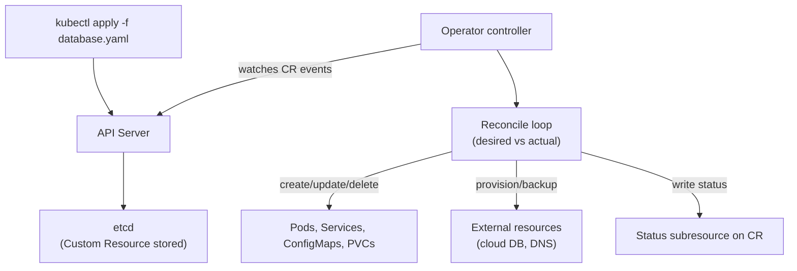

# Kubernetes Operators

## Overview

An **operator** extends Kubernetes to manage complex, stateful applications automatically. It pairs a **Custom Resource Definition (CRD)** — a new API object type (e.g., `PostgresCluster`, `KafkaTopic`) — with a **controller** that watches those objects and drives the actual system to match what they declare.

> **Operator = CRD (schema) + Controller (reconciliation loop) + Domain knowledge**

Where Helm installs and configures once, an operator *continuously* reconciles: if a database pod dies, the operator restores it; if a config changes, it rolls the cluster; when the custom resource is deleted, it cleans up external resources too.



## Why Operators Exist

Kubernetes' built-in controllers (Deployments, StatefulSets) manage *stateless* and *simple stateful* workloads. But a **PostgreSQL cluster** or **Kafka cluster** needs operational knowledge: failover, backups, upgrades, scaling, health checks — knowledge that used to live in a human DBA or runbooks. An operator **encodes that knowledge into software** so the platform manages the application as declaratively as it manages pods.

Famous examples: **etcd-operator**, **Prometheus Operator**, **Postgres Operator** (Zalando, CloudNativePG), **Kafka operator** (Strimzi), **cert-manager** (certificates), **Crossplane** (cloud resources), and **Flux/Argo** (GitOps — see [GitOps](../cicd/gitops.md)).

## Custom Resource Definitions (CRDs)

A CRD registers a new resource type with the Kubernetes API. Instances behave like built-in objects: stored in etcd, queryable with `kubectl`, RBAC-able, namespaced or cluster-scoped, with events and conditions.

```yaml
apiVersion: apiextensions.k8s.io/v1
kind: CustomResourceDefinition
metadata:
  name: databases.example.com
spec:
  group: example.com
  names:
    kind: Database
    plural: databases
    singular: database
  scope: Namespaced
  versions:
    - name: v1
      served: true
      storage: true
      schema:
        openAPIV3Schema:
          type: object
          properties:
            spec:
              type: object
              properties:
                engine: { type: string, enum: [postgres, mysql] }
                version: { type: string }
                replicas: { type: integer, minimum: 1 }
```

Then users declare instances:

```yaml
apiVersion: example.com/v1
kind: Database
metadata:
  name: orders-db
spec:
  engine: postgres
  version: "16"
  replicas: 3
```

Key API conventions: **`spec` = desired state**, **`status` = observed state**, `metadata` for identity. A CRD alone does nothing — it's a schema.

## The Reconciliation Loop

The controller runs a **level-triggered** loop (not edge-triggered): it compares **desired state** (the CR's `spec`) with **actual state** (what exists), and acts to close the gap. Because it's level-based, missed events don't matter — the next reconcile (or periodic resync) converges anyway.

```go
// controller-runtime (Go) — simplified reconciler
func (r *DatabaseReconciler) Reconcile(ctx context.Context, req ctrl.Request) (ctrl.Result, error) {
    db := &examplev1.Database{}
    if err := r.Get(ctx, req.NamespacedName, db); err != nil {
        return ctrl.Result{}, client.IgnoreNotFound(err)
    }

    // Deletion cleanup (finalizer pattern)
    if !db.DeletionTimestamp.IsZero() {
        r.cleanupExternalResources(ctx, db)     // delete cloud DB, DNS, etc.
        controllerutil.RemoveFinalizer(db, finalizer)
        return ctrl.Result{}, r.Update(ctx, db)
    }

    // Create or update the child resources (idempotent!)
    dep := desiredDeployment(db)
    if _, err := controllerutil.CreateOrUpdate(ctx, r.Client, dep, ...); err != nil {
        return ctrl.Result{}, err
    }

    // Observe actual state, write status
    db.Status.Ready = observedReady(dep)
    return ctrl.Result{RequeueAfter: 30 * time.Second}, r.Status().Update(ctx, db)
}
```

### Critical properties

- **Idempotency** — `Reconcile` may run many times for the same state (retries, restarts, resyncs); each call must converge to the same result. `controllerutil.CreateOrUpdate` handles the fetch-or-create pattern.
- **Owner references** — children point at the CR (`ownerReferences`); deleting the CR garbage-collects its children. External resources need **finalizers** so cleanup runs even after deletion.
- **Status subresource** — the operator writes observed state (ready, version, endpoint, conditions) so users and tooling see progress.
- **ResourceVersion / optimistic concurrency** — concurrent reconciles race; on `Conflict`, re-fetch and retry.

## Building Operators

| Tool | Notes |
|---|---|
| **controller-runtime + kubebuilder** (Go) | The de facto standard; scaffolds CRDs, controllers, webhooks, tests |
| **Operator SDK** | Framework around controller-runtime with packaging (OLM) support |
| **KubeOps** (.NET), **kopf** (Python), **Java Operator SDK** | Language alternatives |
| **Metacontroller / Crossplane Compositions** | Higher-level / no-code-ish composition |
| **OLM (Operator Lifecycle Manager)** | Packaging, upgrades, dependency resolution for operators in clusters |

**Best practices**: one operator per managed application, one controller per CRD, narrow RBAC (never cluster-admin), OpenAPI structural schemas with validation, meaningful status/conditions, idempotent reconciliation, metrics/observability, CRD versioning with conversion webhooks, and testing controller logic (envtest).

## Interview Questions

### Q: What is the difference between a CRD and an operator?

A **CRD** defines a new resource *type* — its schema — so Kubernetes can store and serve instances, but it does nothing by itself. An **operator** is a controller + domain logic that *watches* instances of the CRD and reconciles the real system to match the declared `spec`. **CRD + controller = operator**.

### Q: What is the reconciliation loop and why is it level-triggered?

The controller repeatedly compares desired state (`spec`) with actual state and acts to close the gap. It's **level-triggered**: each reconcile reads the *current* level of desired state rather than reacting to individual events, so missed or duplicate events are harmless — the next reconcile (or periodic resync) converges anyway. This is what makes operators self-healing and restart-safe.

### Q: Why must reconciliation be idempotent?

`Reconcile` can be invoked multiple times for the same input: on retries after errors, on operator restart, and on periodic resyncs. If it weren't idempotent, it would create duplicate resources or apply conflicting changes. Patterns like `CreateOrUpdate` (fetch-or-create), owner references, and checking existence before creating keep it safe.

### Q: How do you ensure cleanup when a custom resource is deleted?

Two mechanisms: **owner references** (children deleted automatically with the CR) and **finalizers** for external resources (cloud databases, DNS records) that Kubernetes can't garbage-collect — the finalizer blocks deletion until the operator performs cleanup and removes it. Without finalizers, deleting the CR orphans external resources.

### Q: When would you build an operator instead of using Helm?

Helm installs/configures at apply time; it doesn't continuously manage the app's lifecycle. Build an operator when the application is **stateful or complex** and needs ongoing operational behavior: failover, backups, upgrades, scaling, self-healing. If a Helm chart (plus its built-in controllers) suffices, don't add operator complexity.

## References

- CoreOS/Red Hat: *Operator pattern* — https://kubernetes.io/docs/concepts/extend-kubernetes/operator/
- Kubernetes docs: Custom Resources — https://kubernetes.io/docs/concepts/extend-kubernetes/api-extension/custom-resources/
- kubebuilder book — https://book.kubebuilder.io/
- Operator SDK — https://sdk.operatorframework.io/
- controller-runtime (Go) — https://github.com/kubernetes-sigs/controller-runtime

## Related Topics

- [Kubernetes Overview](./README.md) — pods, services, deployments
- [GitOps](../cicd/gitops.md) — Argo/Flux, which are themselves operators
- [Autoscaling](../autoscaling.md) — controllers managing replicas
- [Service Mesh](../../backend/containers/service-mesh.md) — another control-plane pattern
- [Controller-runtime reconciliation](../../backend/patterns/README.md) — the general desired-vs-actual pattern
