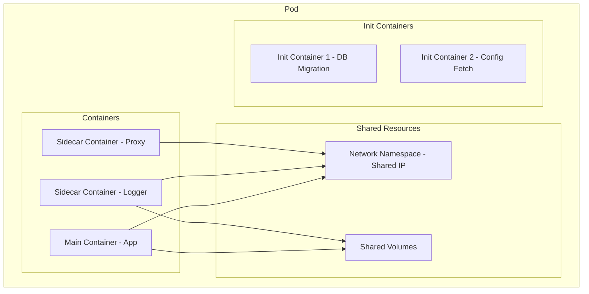
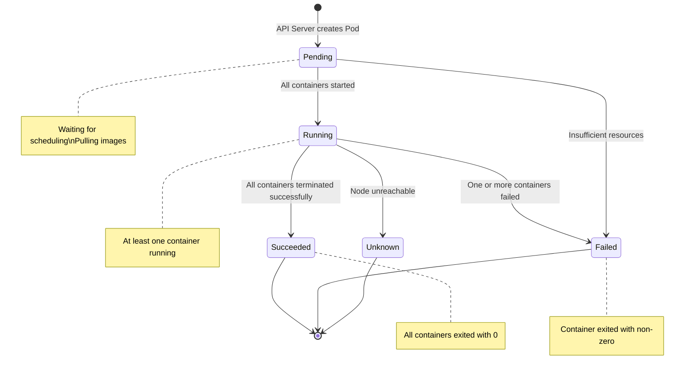
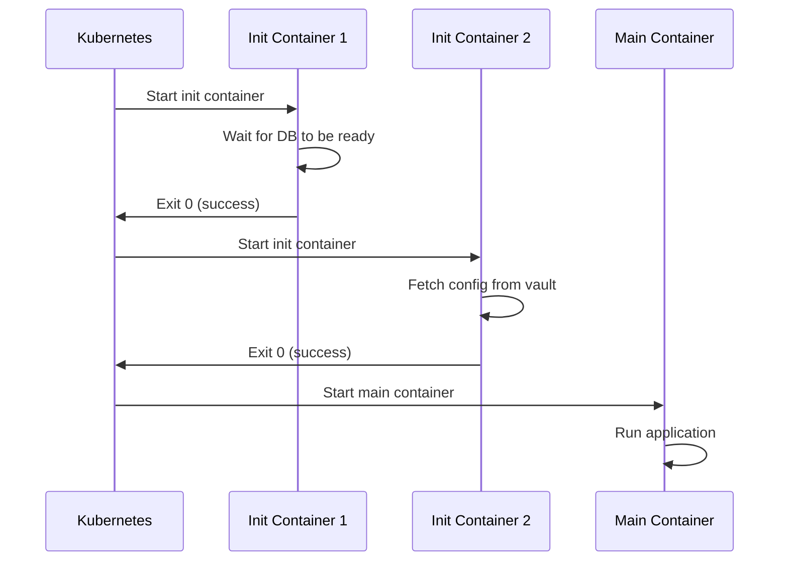
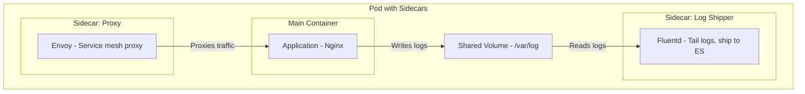
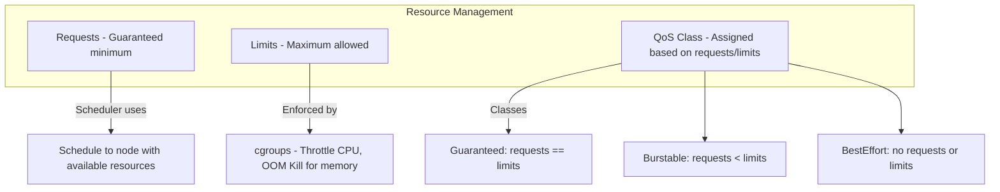
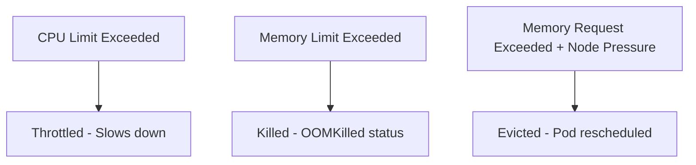
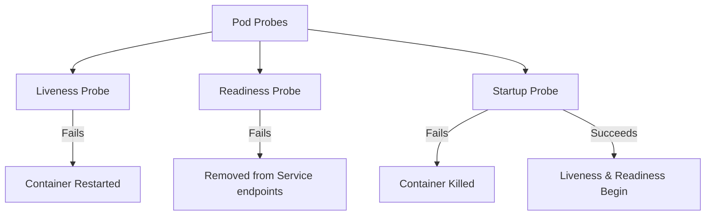
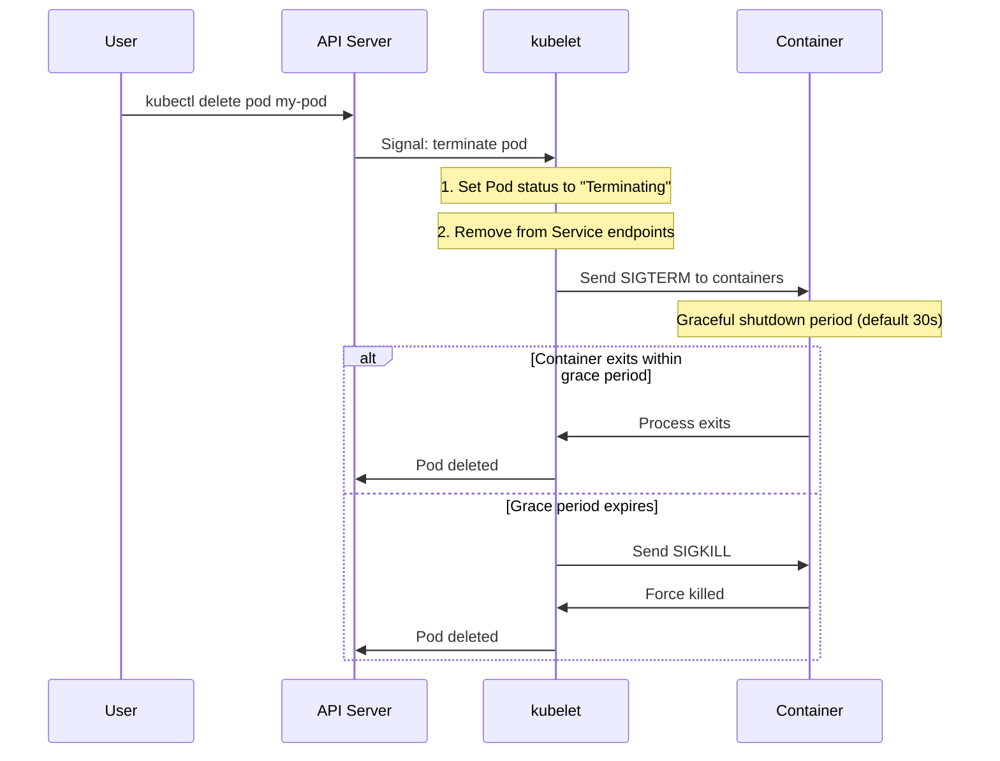

# Kubernetes Pods

## Introduction

A Pod is the smallest and simplest Kubernetes object. It represents a single instance of a running process and can contain one or more containers that share storage, network, and a specification for how to run.

## Pod Architecture



### What Pods Share

| Resource | Sharing Behavior |
|----------|-----------------|
| **Network** | Same IP address, same port space (localhost communication) |
| **Storage** | Shared volumes accessible by all containers |
| **PID Namespace** | Optional (share process ID namespace) |
| **IPC** | Shared inter-process communication |
| **Lifecycle** | Containers start/stop together (unless init containers) |

## Pod Lifecycle



### Pod Conditions

```yaml
status:
  conditions:
    - type: PodScheduled      # Pod has been scheduled to a node
      status: "True"
    - type: ContainersReady   # All containers are ready
      status: "True"
    - type: Initialized       # All init containers completed
      status: "True"
    - type: Ready             # Pod can serve requests
      status: "True"
```

| Condition | Meaning |
|-----------|---------|
| **PodScheduled** | Pod has been assigned to a node |
| **Initialized** | All init containers have completed successfully |
| **ContainersReady** | All containers in the pod are ready |
| **Ready** | Pod is able to serve requests; added to Service endpoints |

## Init Containers

Init containers run **before** the main application containers and must complete successfully:



```yaml
apiVersion: v1
kind: Pod
metadata:
  name: my-app
spec:
  initContainers:
    - name: wait-for-db
      image: busybox:1.36
      command: ['sh', '-c', 'until nc -z mysql-service 3306; do echo waiting for db; sleep 2; done']

    - name: migrate-db
      image: my-app/migrator:1.0
      command: ['python', 'manage.py', 'migrate']

  containers:
    - name: app
      image: my-app:1.0
      ports:
        - containerPort: 8080
```

**Init Container Use Cases:**
1. Wait for a dependent service to be ready
2. Run database migrations
3. Fetch configuration/secrets from external sources
4. Set up shared volumes with correct permissions
5. Register with service discovery

**Key Properties:**
- Run to completion before main containers start
- If an init container fails, K8s restarts the pod (unless `restartPolicy: Never`)
- Run sequentially (IC1 completes before IC2 starts)
- Can use different images than the main container
- No readiness probes (they're not long-running)

## Sidecar Containers

Sidecars are containers that run alongside the main application container within the same pod:



```yaml
apiVersion: v1
kind: Pod
metadata:
  name: app-with-sidecars
spec:
  containers:
    - name: app
      image: nginx:1.25
      volumeMounts:
        - name: log-volume
          mountPath: /var/log/nginx

    - name: log-shipper
      image: fluent/fluentd:v1.16
      volumeMounts:
        - name: log-volume
          mountPath: /var/log/nginx
          readOnly: true

    - name: envoy-proxy
      image: envoyproxy/envoy:v1.28
      ports:
        - containerPort: 9901

  volumes:
    - name: log-volume
      emptyDir: {}
```

**Common Sidecar Patterns:**

| Pattern | Example | Purpose |
|---------|---------|---------|
| **Log shipping** | Fluentd, Filebeat | Collect and forward logs |
| **Service proxy** | Envoy, Linkerd-proxy | Service mesh data plane |
| **Monitoring** | Prometheus exporter | Export metrics |
| **Configuration** | Consul-template | Dynamic config updates |
| **Security** | mTLS sidecar | Handle TLS termination |

## Resource Requests and Limits



```yaml
apiVersion: v1
kind: Pod
metadata:
  name: resource-demo
spec:
  containers:
    - name: app
      image: nginx:1.25
      resources:
        requests:
          memory: "128Mi"    # Guaranteed 128 MB
          cpu: "250m"        # Guaranteed 0.25 CPU
        limits:
          memory: "256Mi"    # Max 256 MB (OOM kill if exceeded)
          cpu: "500m"        # Max 0.5 CPU (throttled if exceeded)
```

### QoS Classes

| QoS Class | Requests & Limits | Eviction Priority |
|-----------|------------------|-------------------|
| **Guaranteed** | requests == limits (both set, equal) | Last to be evicted |
| **Burstable** | requests < limits (both set, not equal) | Evicted before Guaranteed |
| **BestEffort** | Neither set | First to be evicted |

**Interview Tip**: When a node runs out of resources, K8s evicts pods in order: BestEffort → Burstable → Guaranteed.

### Resource Units

| Resource | Unit | Example |
|----------|------|---------|
| **CPU** | millicores (m) or cores | `100m` = 0.1 CPU, `1` = 1 full CPU |
| **Memory** | Mi, Gi, M, G | `128Mi` = 128 MiB, `1Gi` = 1 GiB |

### What Happens When Limits Are Exceeded



| Resource | Exceed Limit | Exceed Request |
|----------|-------------|---------------|
| **CPU** | Throttled (not killed) | Depends on node availability |
| **Memory** | OOMKilled (container killed) | Evicted if node under memory pressure |

## Health Probes



```yaml
apiVersion: v1
kind: Pod
metadata:
  name: probe-demo
spec:
  containers:
    - name: app
      image: my-app:1.0
      livenessProbe:
        httpGet:
          path: /healthz
          port: 8080
        initialDelaySeconds: 15
        periodSeconds: 10
        failureThreshold: 3

      readinessProbe:
        httpGet:
          path: /ready
          port: 8080
        initialDelaySeconds: 5
        periodSeconds: 5

      startupProbe:
        httpGet:
          path: /healthz
          port: 8080
        failureThreshold: 30
        periodSeconds: 10
```

### Probe Types

| Probe | What It Does | Failure Action | When to Use |
|-------|-------------|----------------|-------------|
| **Liveness** | Is the container alive? | Restart container | Deadlock detection, unresponsive app |
| **Readiness** | Is the container ready to serve? | Remove from endpoints | Loading data, warming cache |
| **Startup** | Has the container started? | Kill container | Slow-starting apps (protects liveness) |

### Probe Mechanisms

| Mechanism | Description |
|-----------|-------------|
| **httpGet** | HTTP GET request (2xx/3xx = success) |
| **tcpSocket** | TCP connection attempt (port open = success) |
| **exec** | Command execution (exit 0 = success) |
| **grpc** | gRPC health check |

## Pod Termination



**Termination Grace Period:**
```yaml
apiVersion: v1
kind: Pod
metadata:
  name: graceful-pod
spec:
  terminationGracePeriodSeconds: 60  # 60 seconds for graceful shutdown
  containers:
    - name: app
      image: my-app:1.0
      lifecycle:
        preStop:
          exec:
            command: ["/bin/sh", "-c", "sleep 5"]  # Delay before SIGTERM
```

## Interview Questions

### Q1: What is a Pod and why not just use containers?
**Answer**: A Pod is the smallest K8s deployable unit—one or more co-located containers sharing network (same IP, localhost), storage volumes, and lifecycle. We need Pods because: (1) Containers in a Pod can communicate via localhost, (2) Shared volumes enable data exchange, (3) K8s manages at the Pod level (scheduling, health checks, resource allocation), (4) Sidecar pattern requires multiple containers with shared context. You rarely create Pods directly—use Deployments or other controllers.

### Q2: Explain init containers and when to use them.
**Answer**: Init containers run before main containers and must complete successfully (exit 0) before the next init container or main container starts. They run sequentially. Use cases: (1) Wait for dependencies (database, service), (2) Run database migrations, (3) Fetch secrets/configs from external systems, (4) Set up shared volumes with correct permissions. Key differences from main containers: run to completion, no readiness probes, can use different images, failure restarts the pod.

### Q3: What are the QoS classes in Kubernetes?
**Answer**: K8s assigns QoS classes based on resource requests and limits: Guaranteed (requests == limits for all containers)—last to be evicted. Burstable (requests < limits)—evicted before Guaranteed. BestEffort (no requests or limits set)—first to be evicted. When a node faces resource pressure, K8s evicts pods starting from BestEffort. Always set requests and limits to get predictable scheduling and protection.

### Q4: What is the difference between liveness, readiness, and startup probes?
**Answer**: Liveness probe checks if the container is alive—failure causes container restart (handles deadlocks). Readiness probe checks if the container can serve traffic—failure removes it from Service endpoints (handles temporary unavailability). Startup probe runs first for slow-starting containers—while running, liveness and readiness are disabled. This prevents liveness probe from killing a container that's still initializing. Use startup probe for apps that take >30s to start.

### Q5: How does Pod termination work?
**Answer**: When a pod is deleted: (1) Pod status set to "Terminating" and removed from Service endpoints, (2) SIGTERM sent to all containers, (3) Containers have `terminationGracePeriodSeconds` (default 30s) for graceful shutdown, (4) If containers don't exit within grace period, SIGKILL force-kills them, (5) Pod is removed from API server. Best practice: implement SIGTERM handlers for graceful shutdown—close connections, finish in-flight requests, flush buffers.

## Common Mistakes

1. **Creating Pods directly**: Use Deployments/StatefulSets for self-healing and scaling
2. **Not setting resource requests**: Leads to scheduling issues and resource starvation
3. **No liveness/readiness probes**: K8s can't detect unhealthy containers
4. **Ignoring termination grace period**: Default 30s may not be enough for graceful shutdown
5. **Running multiple unrelated containers in a Pod**: Containers in a Pod are tightly coupled—use separate Pods for unrelated apps
6. **Using `latest` tag**: Can't roll back, unpredictable behavior
7. **Not handling SIGTERM**: Containers killed abruptly lose in-flight requests

## Summary

| Concept | Key Takeaway |
|---------|-------------|
| **Pod** | Smallest deployable unit, shared network & storage |
| **Init Containers** | Run before main containers, sequential, must succeed |
| **Sidecars** | Helper containers alongside main container |
| **Resources** | Requests (guaranteed) vs Limits (maximum), QoS classes |
| **Probes** | Liveness (restart), Readiness (traffic), Startup (protect) |
| **Termination** | SIGTERM → grace period → SIGKILL |

## Cross-References

- **Deployments**: [Rolling Updates](./deployments.md) — Managing Pods at scale
- **Services**: [ClusterIP](./services.md) — How Pods get network identities
- **Kubernetes Overview**: [Architecture](./README.md) — How Pods fit in the system
- **Docker**: [Containers](../virtualization/vm-vs-container.md) — What runs inside Pods
- **Observability**: [Logging](../observability/logging.md) — Collecting Pod logs
