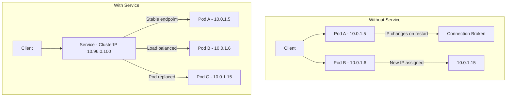
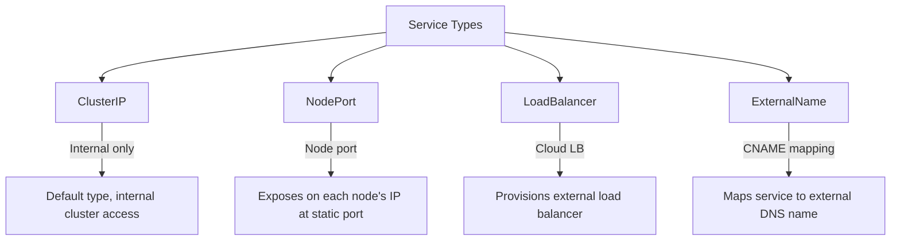
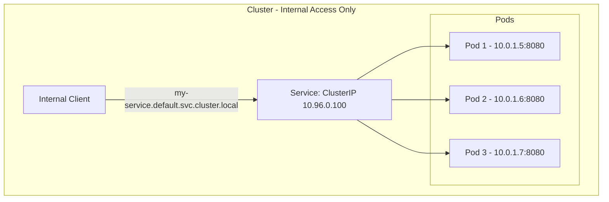
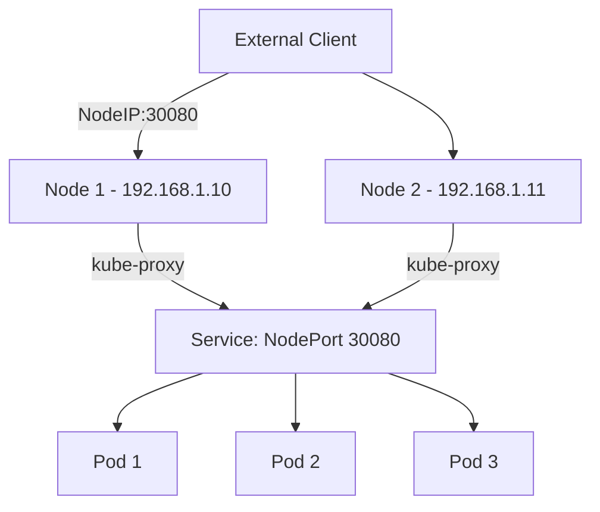
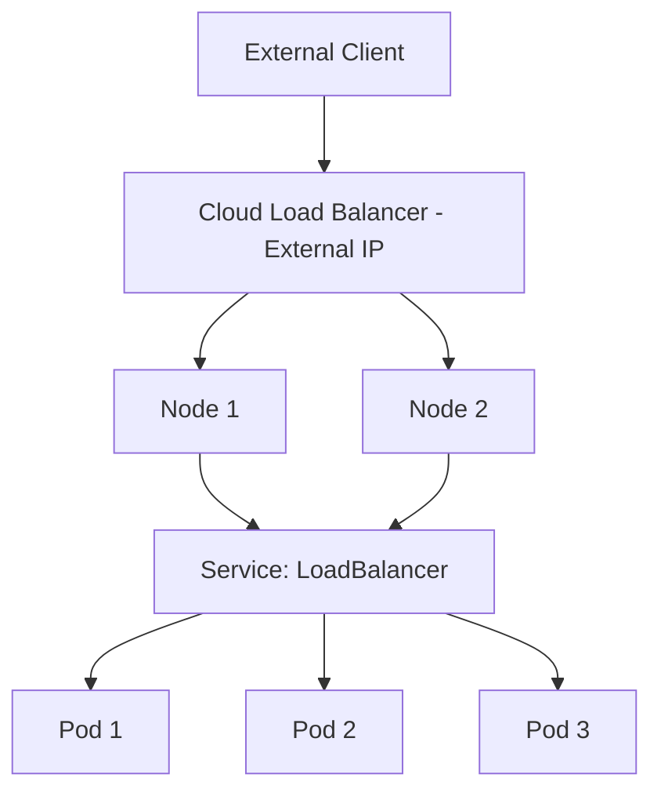
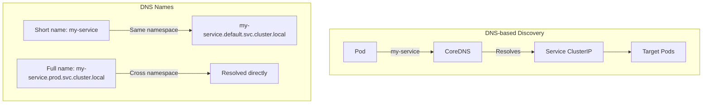
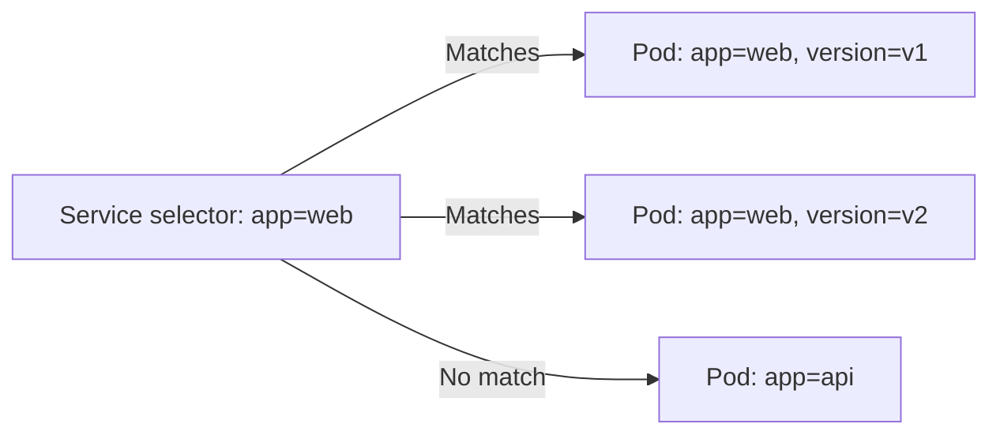
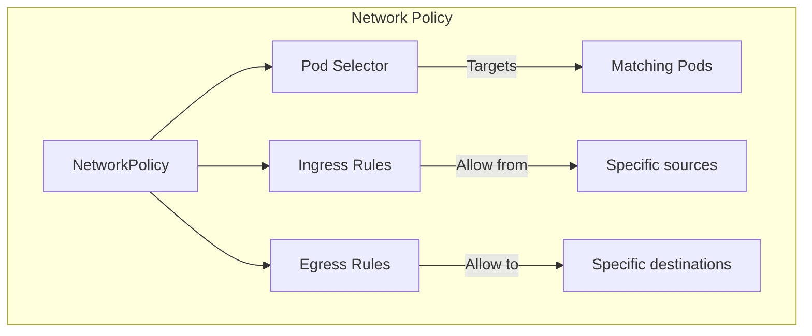

# Kubernetes Services

## Introduction

A Kubernetes Service is an abstraction that defines a logical set of Pods and a policy for accessing them (sometimes called a micro-service). Since Pods are ephemeral and get new IPs when recreated, Services provide a stable endpoint (DNS name and IP) for accessing a group of Pods.

## Why Services?



## Service Types



### ClusterIP (Default)



```yaml
apiVersion: v1
kind: Service
metadata:
  name: my-service
spec:
  type: ClusterIP  # Default
  selector:
    app: my-app
  ports:
    - protocol: TCP
      port: 80          # Service port
      targetPort: 8080   # Pod port
```

| Aspect | Details |
|--------|---------|
| **Accessibility** | Internal cluster only |
| **IP** | Virtual IP from cluster CIDR (e.g., 10.96.x.x) |
| **DNS** | `service-name.namespace.svc.cluster.local` |
| **Use Case** | Internal microservice communication |

### NodePort



```yaml
apiVersion: v1
kind: Service
metadata:
  name: my-nodeport-service
spec:
  type: NodePort
  selector:
    app: my-app
  ports:
    - protocol: TCP
      port: 80          # Service port (ClusterIP)
      targetPort: 8080   # Pod port
      nodePort: 30080    # Node port (30000-32767)
```

| Aspect | Details |
|--------|---------|
| **Accessibility** | External via `<NodeIP>:<NodePort>` |
| **Port Range** | 30000-32767 (auto-assigned or specified) |
| **Also creates** | ClusterIP (internal access) |
| **Use Case** | Development, testing, or when no cloud LB available |

### LoadBalancer



```yaml
apiVersion: v1
kind: Service
metadata:
  name: my-lb-service
  annotations:
    service.beta.kubernetes.io/aws-load-balancer-type: "nlb"  # AWS NLB
spec:
  type: LoadBalancer
  selector:
    app: my-app
  ports:
    - protocol: TCP
      port: 80
      targetPort: 8080
```

| Aspect | Details |
|--------|---------|
| **Accessibility** | External via cloud provider's load balancer |
| **External IP** | Assigned by cloud provider |
| **Also creates** | ClusterIP + NodePort |
| **Cost** | Incurs cloud LB charges |
| **Use Case** | Production external-facing services |

### ExternalName

```yaml
apiVersion: v1
kind: Service
metadata:
  name: external-db
  namespace: production
spec:
  type: ExternalName
  externalName: db.example.com  # CNAME target
```

| Aspect | Details |
|--------|---------|
| **Accessibility** | Maps to external DNS name |
| **No selector** | No pods selected |
| **DNS** | Returns CNAME record |
| **Use Case** | Access external services with internal DNS |

## Service Comparison

| Feature | ClusterIP | NodePort | LoadBalancer | ExternalName |
|---------|-----------|----------|-------------|-------------|
| **External Access** | No | Yes | Yes | N/A (DNS only) |
| **Internal Access** | Yes | Yes | Yes | Yes |
| **Cloud LB** | No | No | Yes | No |
| **Port Range** | Any | 30000-32767 | Any | N/A |
| **Cost** | Free | Free | Cloud LB cost | Free |
| **Use Case** | Internal services | Dev/test | Production external | External service alias |

## Service Discovery



**DNS Format:**
```
<service-name>.<namespace>.svc.cluster.local
```

| DNS Pattern | Resolves To | Scope |
|-------------|------------|-------|
| `my-service` | ClusterIP | Same namespace |
| `my-service.prod` | ClusterIP | Cross namespace |
| `my-service.prod.svc.cluster.local` | ClusterIP | Fully qualified |

## Endpoint Selection

Services use **label selectors** to find target Pods:



```yaml
# Service with selector
apiVersion: v1
kind: Service
metadata:
  name: web-service
spec:
  selector:
    app: web      # Matches pods with label app=web
  ports:
    - port: 80
      targetPort: 8080

---
# Service WITHOUT selector (manual endpoints)
apiVersion: v1
kind: Service
metadata:
  name: external-service
spec:
  type: ClusterIP
  ports:
    - port: 80

---
apiVersion: v1
kind: Endpoints
metadata:
  name: external-service  # Must match service name
subsets:
  - addresses:
      - ip: 203.0.113.10
      - ip: 203.0.113.11
    ports:
      - port: 80
```

## Headless Services

A headless service doesn't get a ClusterIP—DNS returns the Pod IPs directly:

```yaml
apiVersion: v1
kind: Service
metadata:
  name: headless-service
spec:
  clusterIP: None  # Headless!
  selector:
    app: my-stateful-app
  ports:
    - port: 80
```

**DNS Resolution for Headless Services:**
```
# Returns all Pod IPs (A records)
headless-service.default.svc.cluster.local → 10.0.1.5, 10.0.1.6, 10.0.1.7

# Individual Pod DNS (with StatefulSet)
pod-0.headless-service.default.svc.cluster.local → 10.0.1.5
pod-1.headless-service.default.svc.cluster.local → 10.0.1.6
```

**Use Cases:**
- StatefulSets (databases, message queues)
- Client-side load balancing
- When clients need to discover all backend Pods

## kube-proxy Modes

```mermaid
graph TB
    KP[kube-proxy] --> IPTABLES[Iptables Mode]
    KP --> IPVS[IPVS Mode]
    KP --> USERSPACE[Userspace Mode - Legacy]

    IPTABLES --> |Default| IPT_D[Good for < 1000 services]
    IPVS --> |Better at scale| IPVS_D[Hash-based, O(1) lookup]
    USERSPACE --> |Legacy| US_D[Rarely used]
```

| Mode | Performance | Scalability | Use Case |
|------|------------|-------------|----------|
| **iptables** | Good | O(n) rules | Default, < 1000 services |
| **IPVS** | Excellent | O(1) lookup | Large clusters, 1000+ services |
| **Userspace** | Poor | N/A | Legacy, rarely used |

## Network Policies

```yaml
apiVersion: networking.k8s.io/v1
kind: NetworkPolicy
metadata:
  name: allow-frontend
  namespace: production
spec:
  podSelector:
    matchLabels:
      app: backend
  policyTypes:
    - Ingress
  ingress:
    - from:
        - podSelector:
            matchLabels:
              app: frontend
      ports:
        - protocol: TCP
          port: 8080
```



## Interview Questions

### Q1: What are the different Kubernetes Service types?
**Answer**: (1) ClusterIP (default)—internal-only virtual IP for intra-cluster communication. (2) NodePort—exposes the service on each node's IP at a static port (30000-32767). (3) LoadBalancer—provisions a cloud provider's external load balancer (creates ClusterIP + NodePort). (4) ExternalName—maps a service to an external DNS name (CNAME). (5) Headless (clusterIP: None)—DNS returns Pod IPs directly, no load balancing.

### Q2: How does Kubernetes service discovery work?
**Answer**: K8s provides two methods: (1) Environment variables—kubelet injects service IPs as env vars (e.g., `MY_SERVICE_SERVICE_HOST=10.96.0.100`), but only for services created before the pod. (2) DNS (preferred)—CoreDNS runs as a cluster service. Services get DNS names in format `<name>.<namespace>.svc.cluster.local`. Pods in the same namespace can use just `<name>`. DNS-based discovery is more flexible and works regardless of creation order.

### Q3: What is a Headless Service and when would you use it?
**Answer**: A Headless Service (clusterIP: None) doesn't allocate a ClusterIP. DNS queries return individual Pod IPs instead of a single virtual IP. Use cases: (1) StatefulSets where clients need to reach specific pods (e.g., database primary vs replicas), (2) Client-side load balancing, (3) When you need to discover all backend pods. Each pod gets DNS: `<pod-name>.<service>.<namespace>.svc.cluster.local`.

### Q4: How does kube-proxy work?
**Answer**: kube-proxy runs on every node and maintains network rules for Services. In iptables mode (default): watches the API server for Service/Endpoint changes, creates iptables rules that randomly select backend pods for load balancing. In IPVS mode: uses Linux IPVS for hash-based O(1) lookup, better for large clusters. The proxy intercepts traffic to Service ClusterIPs/NodePorts and redirects to healthy Pod endpoints.

### Q5: What is a Network Policy and how does it work?
**Answer**: NetworkPolicy controls traffic flow at the IP address level between pods. By default, all pods can communicate with all other pods. NetworkPolicy adds restrictions: specify pod selector (which pods to apply rules to), ingress rules (who can connect to these pods), egress rules (where these pods can connect). Without a NetworkPolicy controller (like Calico), policies have no effect. Default deny + explicit allow is the recommended pattern.

## Common Mistakes

1. **Not using Services for Pod communication**: Using Pod IPs directly breaks when Pods restart
2. **Wrong port mapping**: Confusing `port` (Service), `targetPort` (Pod), and `nodePort` (Node)
3. **Missing Network Policies**: All pods can talk to all pods by default—security risk
4. **Using NodePort in production**: Use LoadBalancer or Ingress instead
5. **Ignoring DNS for service discovery**: Hard-coding IPs instead of using DNS names
6. **Headless Service without StatefulSet**: Headless services are primarily for StatefulSets
7. **ExternalName without understanding DNS**: ExternalName services don't proxy traffic—just DNS mapping

## Summary

| Service Type | Access | Creates | Use Case |
|-------------|--------|---------|----------|
| **ClusterIP** | Internal only | Virtual IP | Default for internal services |
| **NodePort** | External via node IP | ClusterIP + Node port | Dev/test, no cloud LB |
| **LoadBalancer** | External via cloud LB | ClusterIP + NodePort + LB | Production external services |
| **ExternalName** | DNS CNAME | Nothing (DNS only) | Map to external services |
| **Headless** | Direct Pod IPs | No ClusterIP | StatefulSets, client-side LB |

## Cross-References

- **Pods**: [Lifecycle](./pods.md) — What Services route to
- **Deployments**: [Rolling Updates](./deployments.md) — Managing pods behind Services
- **Ingress**: [Controllers](./ingress.md) — HTTP routing layer above Services
- **Kubernetes Overview**: [Objects](./README.md) — Where Services fit in the object model
- **VPC**: [Security Groups](../aws/vpc.md) — Network-level security
- **Observability**: [Monitoring](../observability/monitoring.md) — Service mesh observability
