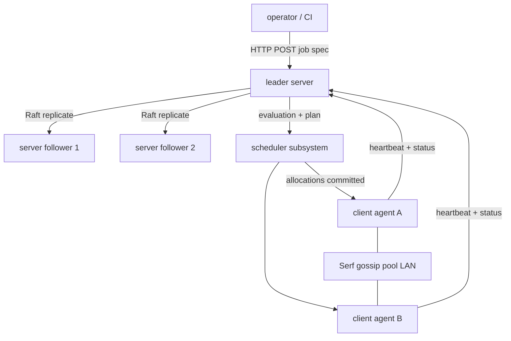
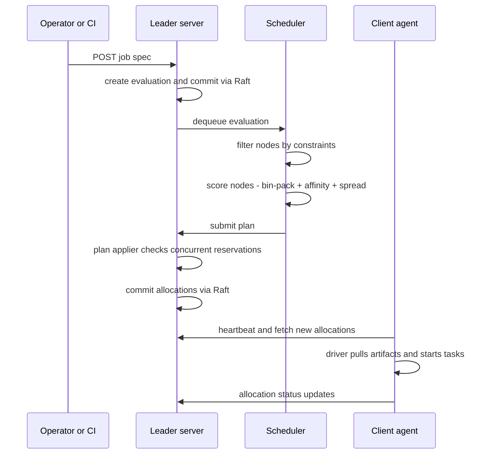
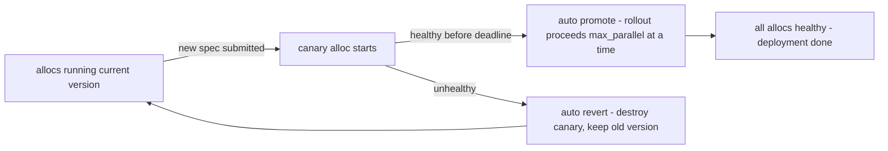

# HashiCorp Nomad: The Simple Orchestrator

## Overview

Nomad is HashiCorp's scheduler and workload orchestrator: a single Go binary that deploys and manages applications across a fleet of machines, designed as a deliberate counterpoint to Kubernetes' complexity. Its distinctive claims are architectural simplicity (one binary, one config file, gossip-based membership), workload generality (containers, plain binaries, JVMs, and VMs as first-class citizens via task drivers), and pragmatic multi-datacenter/multi-region federation. Interviews at infrastructure-heavy companies increasingly treat "Nomad vs Kubernetes" as a design-taste question rather than a feature checklist — the interesting answer is about trade-offs in control planes. For consensus internals, see [etcd Architecture](./etcd.md) (Raft deep dive); for the gossip substrate, see [Consul](./consul.md) and [memberlist & gossip protocols](../distributed/systems/memberlist-gossip.md).

## Architecture: Servers, Clients, and the Gossip Pool

A Nomad cluster has two agent roles, both running the same binary with different config:

- **Server agents** form a quorum (3 or 5) per *region* and own all cluster state — jobs, allocations, nodes, evaluations, ACLs — in a Raft-replicated state store (Raft log + BoltDB-backed snapshots). The elected **leader** runs scheduling. All writes flow through the Raft log; reads of cluster state hit the leader or follower FSMs.
- **Client agents** run on every workload machine. At boot they **fingerprint** the host (CPU, memory, kernel, drivers, devices — GPUs, plugins) into an attribute set, register with the servers, and maintain a ~10-second heartbeat. Missed heartbeats mark the node down and trigger rescheduling of its allocations.

Membership and failure detection use **Serf gossip** (the memberlist/SWIM protocol family) on a LAN port — the same library Consul embeds. Gossip handles node liveness *outside* Raft so that membership churn never bloats the consensus log; Raft handles only state that must be linearizable. This division — SWIM for "who exists", Raft for "what is true" — is a reusable interview pattern. Default ports: 4646 (HTTP API/UI), 4647 (RPC), 4648 (Serf LAN gossip).

High-availability behavior falls out of the Raft layer: losing a minority of servers is transparent (clients retry RPCs against another peer); losing the leader triggers a new election within the Raft timeout, and in-flight evaluations are re-queued by the new leader. **Autopilot** — the built-in housekeeper — stabilizes the quorum after failures, removes stale servers, and can automate Raft-version checks during rolling upgrades. The operational lesson interviews reward: because Nomad *is* its control plane (no separate etcd to size, back up, and upgrade), cluster maintenance reduces to rolling the same binary — the comparison Kubernetes teams feel most when doing etcd surgery.



### Job Lifecycle: Evaluations

Every change is funneled through **evaluations**: submitting a job creates an eval; the eval broker hands it to the matching scheduler (service, batch, system); the scheduler proposes a *plan* (which allocations on which nodes); a **plan applier** on the leader validates it against reservations and in-flight changes (rejecting the plan if another scheduler concurrently claimed the capacity — the scheduler then retries with updated state); accepted plans commit through Raft, and clients pull their new allocations. Evals that cannot be placed — insufficient capacity, unsatisfiable constraints — go to a **blocked eval** queue and are retried when node state changes. This eval→plan→commit pipeline is Nomad's equivalent of the Kubernetes scheduler's watch→bind loop, and describing it accurately is a strong senior signal.



The failure paths are what interviewers probe: a plan rejection is a *correctness* mechanism (two schedulers cannot double-book a node), and a blocked eval is a *liveness* mechanism (work waits instead of failing). If neither existed, you would need ad-hoc locking inside the scheduler or lost jobs on full clusters.

## Scheduling: Bin-Packing, Spread, Preemption, Devices

Nomad's default scoring is **bin-packing**: prefer nodes that already host sibling allocations and fill machines densely before claiming new ones — minimizing cost and idle fragmentation at the price of higher blast radius per node (the classic density-vs-failure trade-off, same one Kubernetes faces with its bin-packing plugins). Control knobs:

| Mechanism | Stanza | Effect |
|-----------|--------|--------|
| Bin-packing score | default scorer | Density-first placement \\( \text{score} \approx \text{fit} + \text{affinity} - \text{penalty} \\) style linear combination |
| Spread | `spread "datacenter"` | Distribute allocations evenly across attribute values (racks, zones) |
| Constraint | `constraint` (e.g., `distinct_hosts`) | Hard filter — must satisfy, no soft fallback |
| Affinity | `affinity` | Soft preference with weights, degrades gracefully |
| Preemption | built-in | Higher-priority jobs evict lower-priority allocations (0.9 for system jobs, extended to service/batch in 1.1) |
| Devices | `device` block | Fingerprint and reserve GPUs/TPUs/FPGAs via device plugins (NVIDIA, USB) |

Preemption semantics are priority-ordered: a `system` job can evict service allocations, and priority classes gate who preempts whom — interviewers probe here because Nomad's answer is simpler than Kubernetes' PodPriority + disruption budgets machinery, at the cost of fewer guardrails. The **device plugin** model (independent of, and older than, Kubernetes' device managers) fingerprints hardware into allocatable resources, so `resources { device "nvidia/gpu" count = 1 }` works in a job spec without vendor CRDs — a genuine selling point for GPU batch fleets and ML research clusters (see [cloud scheduling](./advanced/cloud-scheduling.md) for the general scheduling-theory backdrop).

A concrete placement walk-through ties the pieces together. Suppose a `service` job with `count = 3`, a `distinct_hosts` constraint, and 2 eligible nodes, one already running 2 allocations of the same group: the scheduler filters out ineligible nodes, scores the node with existing sibling allocations highest (bin-packing), sees the `distinct_hosts` constraint forbids a third co-located copy, spreads the remaining placements across the other datacenter via the `spread` stanza, and — if a higher-priority job needs room — evicts a low-priority `batch` allocation through preemption. Every named behavior in that sentence corresponds to one stanza in the table above, which is exactly how to narrate it in an interview.

## The Job Spec: HCL, Types, and Update Strategies

Jobs are HCL (JSON works too): `job → group → task`, where a group is the co-located unit (like a pod) and tasks are processes managed by drivers. Job types set the scheduler contract:

| Type | Semantics | Typical use |
|------|-----------|-------------|
| `service` | Long-running, rescheduled forever, health-checked | APIs, daemons |
| `batch` | Runs to completion or failure budget | Data jobs, one-offs |
| `system` | Exactly one allocation per eligible client | Node agents, log shippers |
| `sysbatch` | System-scoped batch (since 1.3) | Cluster-wide maintenance, snapshots |
| `periodic`/cron | Spawns child jobs on a cron schedule | Scheduled ETL |

Update and liveness control is where Nomad's pragmatism shows — a compact `update` block replaces Kubernetes' Deployment/ReplicaSet/Controller layering:

```hcl
job "api" {
  group "web" {
    count = 5
    update {
      max_parallel     = 2
      min_healthy_time = "10s"
      healthy_deadline = "5m"
      canary           = 1        # start one canary allocation
      auto_revert      = true     # roll back if canary never becomes healthy
      auto_promote     = true
    }
    restart {
      attempts = 3
      interval = "10m"
      delay    = "15s"
      mode     = "fail"          # then hand to reschedule policy
    }
    reschedule {
      attempts  = 5
      interval  = "1h"
      unlimited = false
    }
    task "server" {
      driver = "docker"
      config { image = "hashicorp/http-echo:1.0" }
      resources { cpu = 500 memory = 256 }
    }
  }
}
```

Canary deployments, auto-revert on failed health checks, and bounded reschedule backoff live in one stanza per group. The HCL spec doubles as a state document: `nomad job plan` diffs the proposed change against the live job — Nomad's Terraform-flavored answer to `kubectl apply --dry-run`.



Beyond rollout control, the task stanza composes the supporting primitives: `template` renders config files from Consul KV/Vault secrets with `consul-template` semantics (and sprints them on change), `vault { policies = [...] }` injects short-lived Vault tokens into the task's environment, `artifact` downloads tarballs/object storage into the allocation dir before start, and `env`/`meta` feed both drivers and templates. The interview-worthy contrast: Kubernetes expresses the same needs through a wider surface (Secrets/ConfigMaps/InitContainers/sidecars), while Nomad compresses them into stanzas on the task — fewer concepts, less composable, but dramatically smaller to learn.

## Task Drivers: Non-Container Workloads as First-Class Citizens

Nomad's defining differentiator: the unit of scheduling is a *task*, and drivers define what a task is. Built-in drivers historically included `docker`, `exec` (chroot-isolated binary), `java` (runs JARs directly on the host JVM), `raw_exec` (no isolation), and `qemu` (boots full VM images). Community drivers cover containerd, LXC, Firecracker (see [Firecracker](./virtualization/firecracker.md)), Podman, and others. Since Nomad 1.7 the Docker driver ships as a separate plugin rather than in the core binary — an outcome of Docker's licensing posture that, ironically, reinforced Nomad's driver abstraction story.

| Driver | Isolation level | Interview use case |
|--------|-----------------|--------------------|
| `docker` | namespaces + cgroups (full container) | Standard service fleet |
| `exec` | chroot + cgroups, shared kernel | Binaries without container build pipeline |
| `java` | cgroups, host JVM | Legacy JVM apps — no image needed |
| `raw_exec` | none (fork) | Trusted system tooling, bootstrap, HPC jobs |
| `qemu` | full VM per task | VM workloads beside containers |

Why this matters: many real fleets are *mixed* — a data pipeline of Python binaries, legacy JVM services, GPU training jobs, and containerized microservices. Kubernetes normalizes everything into images (or fights you with second-class hostPath tricks); Nomad schedules a raw process with the same job spec, health checks, and bin-packing as a container. HPC and scientific computing teams, CI runner fleets, and enterprises migrating off bare-metal schedulers exploit exactly this — one orchestrator, multiple execution semantics, with the isolation level as an explicit per-task choice (see [Docker & Containers](../os/containers/docker.md) for the isolation mechanics drivers rely on).

Mechanically, drivers are discovered by **fingerprinting**: on boot and periodically, each client probes which drivers are available (is Docker installed? which JDK version? which GPUs?) and publishes the results as node attributes and reserves, which the scheduler filters on. Since 1.x, non-core drivers are **external task-driver plugins** — Go binaries speaking Nomad's plugin interface over gRPC, launched by the client agent — so adding containerd, Firecracker, or a bespoke in-house runner does not mean patching the orchestrator. Fingerprinting plus plugins is Nomad's answer to the question "how would you schedule a workload type the authors never anticipated?" — a favorite senior-level probe because it tests whether you understand the seam between *scheduling* and *execution*.

## Networking and Service Discovery

A task can use **host networking** (ports published on the host, dynamic port assignment) or **bridge networking** (a per-allocation network namespace managed via CNI plugins, GA'd during the 1.x series), where the group shares a netns like a pod and services get DNS names inside the allocation. On top of either:

| Mode | Port exposure | Isolation | Typical use |
|------|---------------|-----------|-------------|
| Host | dynamic ports (20000–32000 range by default) or `static` | none beyond driver | Legacy apps binding fixed ports |
| Bridge | intra-group DNS + `connect`-sidecar ingress | netns per allocation (CNI) | Pod-like groups, mTLS services |

The dynamic-port model is Nomad's distinctive networking stance: services *announce* the ports they were assigned (rendered into `NOMAD_PORT_*` env vars and service registrations) instead of negotiating them — simple, and the reason dense bin-packing rarely collides.

- **Consul integration** (the default): the `service` stanza registers each task in Consul's catalog with health checks; Consul Template inside `template {}` blocks injects live upstream addresses into config files; Consul Connect adds mTLS sidecars — the mesh story, whose service-mechanics live in [Consul](./consul.md) and whose sidecar-vs-ambient debate is covered in [Istio Service Mesh](./istio.md).
- **Native service discovery** (since 1.3): Nomad registers services in its own registry backed by the same Raft store, so a cluster gets service names and health checks *without* deploying Consul — deliberately scoped (basic discovery, no mesh), but enough for small and edge clusters, and one more data point in the "batteries included, removable" design philosophy.

The interview framing: Nomad treats service discovery as an integration surface, not a core subsystem — cluster state stays in Raft, discovery delegates to a specialist. That is the same separation etcd/Kubernetes makes (see [etcd Architecture](./etcd.md)), but with pluggable backends instead of a bundled one.

## Multi-Region Federation, ACLs, and Policy

**Regions** (independent server clusters connected via WAN gossip for routing) and **datacenters** (groups of clients within a region) compose Nomad's topology: one region serves many datacenters, and since 1.2 the `multi-region` block drives coordinated deployments across regions with per-region counts and staggered rollouts. Compared to Kubernetes multi-cluster federation — CRD extension, opinionated tooling — Nomad's federation is a native, if simpler, control-plane property: independent failure domains, cross-region job submission, shared ACLs.

Security layering:

- **ACLs**: policies grant capability lists (`submit-job`, `alloc-exec`, `node-read`, …) to tokens; a management token bootstraps the system. Namespaces (enterprise-originated, later open-sourced) partition jobs, and quota objects cap resource consumption per namespace.
- **Sentinel** (Enterprise) embeds a policy engine into the job-submission path — fine-grained rules like "no `raw_exec` in prod namespaces", with a `sentinel-override` capability for break-glass.
- **OPA-style policy as code** is commonly layered in CI (validate job specs with conftest before submission) or at the API boundary; the conceptual map to admission controllers is covered in [Policy as Code](./policy-as-code.md).

A minimal ACL policy reads exactly as you would expect:

```hcl
namespace "team-a" {
  capabilities = ["submit-job", "read-job", "alloc-exec"]
}
node {
  policy = "read"
}
```

Handing that policy's token to a CI system yields a tenant that can deploy and debug its own namespaces and nothing else — no cluster-level credentials, no ability to touch sibling namespaces. Compared to Kubernetes RBAC (roles, bindings, service accounts per namespace), Nomad's model is flatter and coarser, which is honest to admit and usually sufficient for the org sizes that choose Nomad.

**Storage** follows the same integration philosophy: Nomad 0.11 added CSI support, so `volume` blocks attach volumes from any CSI plugin (hostpath for dev, cloud EBS, Ceph) with topology-aware scheduling and per-alloc volumes for stateful batch work. There is no StatefulSet equivalent — stateful workloads are supported via CSI + stable network identities rather than an ordering-preserving controller, which remains one of the honest gaps versus Kubernetes.

In the job spec, the group declares the volume and the task mounts it:

```hcl
job "stateful" {
  group "db" {
    volume "data" {
      type            = "csi"
      source          = "pgdata-vol"   # pre-registered volume id
      read_only       = false
    }
    task "postgres" {
      driver = "docker"
      volume_mount {
        volume      = "data"
        destination = "/var/lib/postgresql/data"
      }
    }
  }
}
```

Scheduling becomes CSI-topology-aware: a volume provisioned in zone `us-east-1b` constrains eligible nodes to that zone, which is the quiet integration work that makes stateful batch jobs and single-node databases practical on Nomad.

## Nomad vs Kubernetes vs Docker Swarm

| Dimension | Nomad | Kubernetes | Docker Swarm |
|-----------|-------|------------|--------------|
| Control plane | 1 binary, Raft + Serf | Many components (API server, etcd, scheduler, controllers) | 1 binary (SwarmKit in Docker) |
| State store | Raft embedded | etcd (separate, ops burden) | Raft embedded |
| Workload types | service/batch/system + binaries, JVMs, VMs | containers-centric (Pods), batch via Jobs/CronJobs | containers only |
| Scheduling | bin-pack, spread, preemption, device plugins | rich framework (scoring, taints, topology, DRA) | basic spread |
| Ecosystem | HashiCorp stack, small | enormous (operators, CRDs, tooling) | shrinking |
| Multi-region | native regions + federation | multi-cluster bolt-ons | weak |
| Edge footprint | 3-node server cluster or single binary | heavy; K3s helps | light |
| Learning curve | days | months | hours |
| License (2023+) | BUSL-1.1 (source-available) | Apache-2.0 / CNCF | Apache-2.0 |

**When Nomad wins**: mixed workloads (containers + JVMs + binaries + VMs) under one spec; batch/HPC and GPU fleets that want real bin-packing and device scheduling without CRD ceremony; edge and multi-cloud where a tiny uniform control plane beats a rich one; organizations already running Vault/Consul/Terraform that value operational symmetry; teams where "one YAML dialect and one binary" measurably reduces on-call cognitive load. **When Kubernetes wins**: you need its ecosystem — operators, service mesh depth, serverless layers, ML tooling (KServe, Kubeflow); your org standardizes on it and hiring/training amortizes complexity; stateful ordering-sensitive workloads need StatefulSet semantics; you want vendor-neutral CNCF governance and an Apache-2.0 license. The August 2023 HashiCorp license change (MPL → BUSL-1.1, applying from the 1.6 series; Terraform's fork to OpenTofu was the headline) made license posture a legitimate tiebreaker, though Nomad saw no comparably large fork. Docker Swarm is now mostly a footnoted option: simple, but absent the batch scheduling, device plugins, and federation that give Nomad its reason to exist.

## Production Footprint Patterns

Conference talks and practitioner write-ups converge on recurring shapes worth citing in interviews (kept generic — the patterns, not company names): (1) **mixed batch + service fleets** — enterprises replacing cron + bare-metal schedulers run nightly ETL (`batch`/`sysbatch`), CI build runners (`batch` with `raw_exec`), and user-facing services (`service`) in one cluster, with bin-packing keeping hardware utilization high; (2) **edge/retail** — three-node clusters per site running local services, managed centrally via federation, where Kubernetes' control-plane weight is disqualifying; (3) **GPU research computing** — device plugins plus batch semantics approximate a lightweight SLURM for ML teams; (4) **regulated enterprises** — Vault-issued workload credentials, Sentinel policy gates, and audit trails across namespaces. The recurring failure mode in these stories is *underestimating the ecosystem gap*: teams that choose Nomad for simplicity then need service mesh, autoscaling, or operator patterns and end up building small versions of Kubernetes features — a cost to name explicitly rather than discover in production.

## Key Takeaways

- Two agent roles, one binary: servers own Raft-replicated state and scheduling; clients fingerprint, heartbeat, and run tasks; Serf gossip handles membership outside the consensus log.
- Scheduling is eval → plan → commit with bin-packing as default scoring; spread/constraints/affinity/preemption/device plugins cover the practical placement vocabulary.
- The job spec encodes rollout strategy (canary, auto_revert, reschedule) in one HCL stanza — Nomad's answer to the Deployment controller stack.
- Task drivers are the differentiator: containers, raw binaries, JVMs, and full VMs schedule under one spec with explicit isolation levels.
- Service discovery and storage are integration surfaces (Consul or native discovery; CSI volumes), keeping the core minimal.
- Native multi-region federation and namespace/ACL layering cover the enterprise topology story that Swarm never had.
- Nomad vs Kubernetes is a control-plane complexity trade-off plus ecosystem bet; license posture (BUSL since 2023) is now part of the honest comparison.

## Cross-References

- [Consul](./consul.md) — the default service-discovery, health-check, and mesh integration Nomad's `service` stanzas target.
- [etcd Architecture](./etcd.md) — Raft internals and watch semantics; Nomad embeds the same consensus family rather than an external store.
- [Istio Service Mesh](./istio.md) — the mesh depth Kubernetes' ecosystem offers and Nomad deliberately does not.
- [Policy as Code](./policy-as-code.md) — Sentinel/OPA admission patterns that map onto job-submission gating.
- [memberlist & gossip protocols](../distributed/systems/memberlist-gossip.md) — SWIM mechanics behind Nomad's membership layer.
- [Docker & Containers](../os/containers/docker.md) — the namespaces/cgroups machinery task drivers sit on top of.
- [Kubernetes Scheduling](./kubernetes/scheduling.md) — the richer scheduling framework to contrast Nomad's scorer against.
- [Firecracker](./virtualization/firecracker.md) — the VM-per-task end of the driver spectrum.

## References

- Nomad documentation: <https://developer.hashicorp.com/nomad>
- HashiCorp corporate site (product context, license announcements): <https://www.hashicorp.com/>
- Nomad source repository: <https://github.com/hashicorp/nomad>
- Nomad intro and architecture guides under <https://developer.hashicorp.com/nomad/docs>
- SWIM membership protocol (gossip basis): Das et al., "SWIM: Scalable Weakly-consistent Infection-style Process Group Membership and Failure Detection", DSN 2002 — cited by name, paper commonly reachable via university pages.

## Interview Questions

1. **Why does Nomad use both Raft and Serf gossip instead of one mechanism?** Raft provides linearizable, durable state for everything the scheduler reasons about — jobs, allocations, ACLs — but would be a poor fit for raw membership churn, which is high-frequency and lossy by nature. Serf/SWIM gossip disseminates node liveness probabilistically and cheaply across the LAN without touching the consensus log. Node-alive status feeds scheduling decisions, but authoritative state transitions (node marked down, allocations rescheduled) are still committed through Raft. The reusable principle: put churn in gossip, put truth in consensus — the same division Consul makes between its Serf pool and its Raft KV.
2. **Walk through what happens between `nomad job run` and a running task.** The CLI POSTs the job spec to a server; the leader creates an evaluation and commits it via Raft. The eval broker dequeues it to the type-matching scheduler, which filters nodes by constraints, scores survivors (bin-packing by default, plus affinity/spread terms), and emits a plan. The leader's plan applier validates it against concurrent reservations and in-flight updates — rejecting on conflict forces a retry with fresh state — then commits the resulting allocations to Raft. Clients observe their new allocations, drivers fetch artifacts and start tasks, and health/restart policy takes over. Blocked evals park unplaceable work until node state changes.
3. **What makes Nomad genuinely different for workloads that are not containers?** The driver abstraction: a task is a unit of scheduling executed by a pluggable driver, so `raw_exec` binaries, host-JVM `java` tasks, `qemu` VMs, and `docker` containers share one job spec, one scheduling path, one ACL model. Isolation level is an explicit per-task choice rather than a universal requirement. This matters for mixed enterprise fleets (legacy JVMs beside containerized services), HPC/GPU batch, and edge sites without a container build pipeline. Kubernetes can approximate some of this, but containers remain the native unit and everything else is a workaround.
4. **How does Nomad implement safe deployments, and what does it lack versus a Kubernetes Deployment?** The `update` block is the mechanism: `max_parallel` bounds blast radius, `canary` runs new-version allocations alongside old, `auto_promote` promotes on health, `auto_revert` rolls back when health checks fail, and `min_healthy_time`/`healthy_deadline` define the health contract. Restarts and reschedules are separate stanzas with attempt budgets and backoff. What it lacks: no built-in progressive-analysis features (metrics-based canary judgment), no native stateful-set ordering, and no ecosystem of GitOps controllers — teams pair it with CI/CD or Consul-Nginx patterns instead, which is the ecosystem-gap cost to name explicitly.
5. **When would you choose Nomad over Kubernetes, and when is that choice wrong?** Choose Nomad for mixed workloads under one spec, batch/HPC/GPU scheduling without CRD ceremony, small-footprint edge or multi-cloud clusters, and orgs already deep in the HashiCorp stack — the operational simplicity of one binary and one config dialect is a real, measurable win. It is the wrong call when the required capability actually lives in the Kubernetes ecosystem: operators for stateful middleware, mature service mesh and serverless layers, ML tooling, or when organizational standardization and hiring pipelines assume Kubernetes. Also weigh license posture post-2023 (BUSL-1.1 versus Apache-2.0). A complete answer names the recurring trap: picking Nomad for simplicity, then rebuilding K8s features piecemeal.
6. **How does Nomad handle a node that silently dies mid-allocation?** The client stops heartbeating; servers fail the heartbeat after the TTL (~10s cadence, extended by max heartbeats tuning) and mark the node down via Raft. The affected allocations are transitioned to a failed state, which triggers the job's reschedule policy (bounded attempts with backoff for batch, effectively unlimited for service jobs), and new placements go through the normal eval→plan path — including preemption if capacity is tight. Serf gossip flags the node's absence for membership purposes in parallel. The two-channel design means a flapping heartbeat does not corrupt Raft state, and rescheduling remains a first-class, tunable policy rather than an afterthought.
7. **Where do policy and tenancy live in Nomad?** ACL tokens carry policies made of capability lists (`submit-job`, `alloc-exec`, `node-read`, …); namespaces partition jobs and are the tenancy unit, with quotas capping resources per namespace; Sentinel (Enterprise) embeds submission-time policies like "no `raw_exec` in production" with a break-glass override capability; OPA-style validation typically runs in CI against job specs before they ever hit the API. The design point to articulate: Nomad gates at job submission (a small, synchronous surface), rather than Kubernetes' distributed admission webhooks — simpler, but with fewer extension points, which is why CI-side policy is the common OPA integration.
8. **Nomad's native service discovery (1.3+) versus Consul integration — how do you decide?** Native discovery registers services in Nomad's own Raft-backed registry: zero extra infrastructure, health checks and templates work, but the scope is deliberately basic — no KV, no mesh, no multi-DC catalog. Consul integration brings the full catalog, connect sidecars for mTLS, watch-based config, and cross-datacenter discovery at the cost of operating another stateful system. The decision collapses to: if the cluster already runs Consul (most HashiCorp-stack shops) or needs mesh/multi-DC semantics, integrate; for small, edge, or isolated clusters whose discovery needs are name-resolution and health checks, native mode removes an entire system from the bill of materials. It is a good example of a vendor unbundling an "always required" dependency into an optional one.
