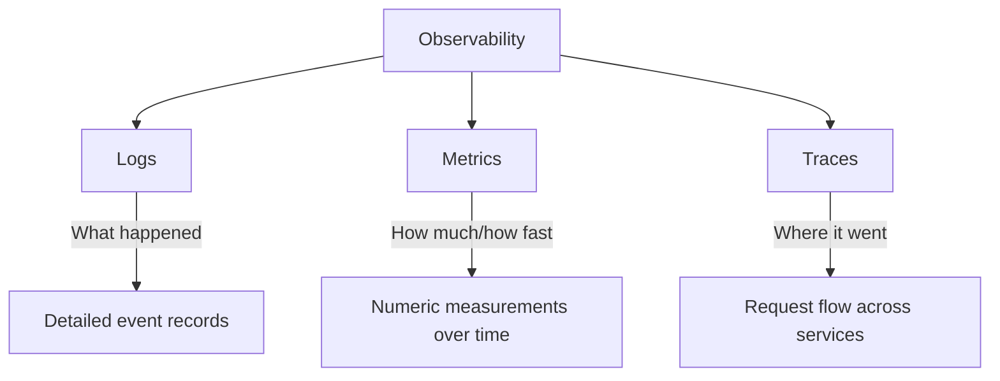
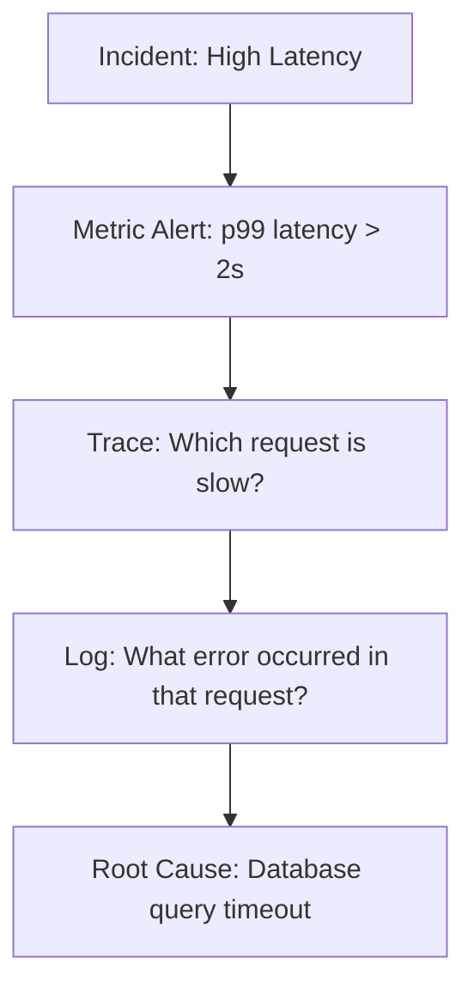
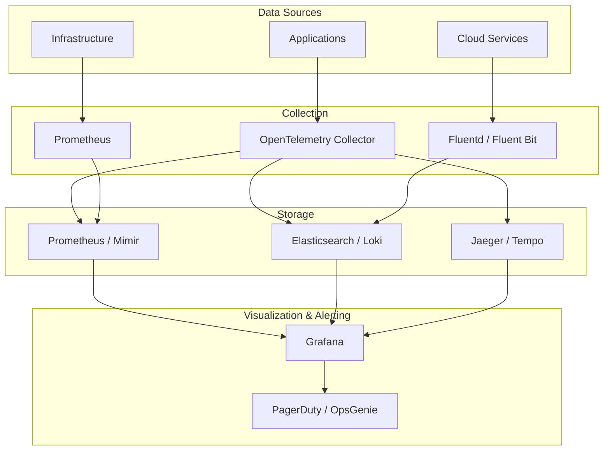
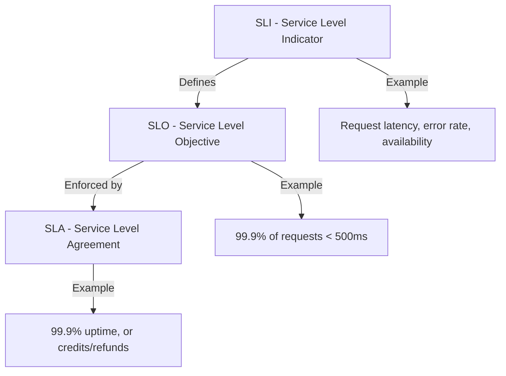
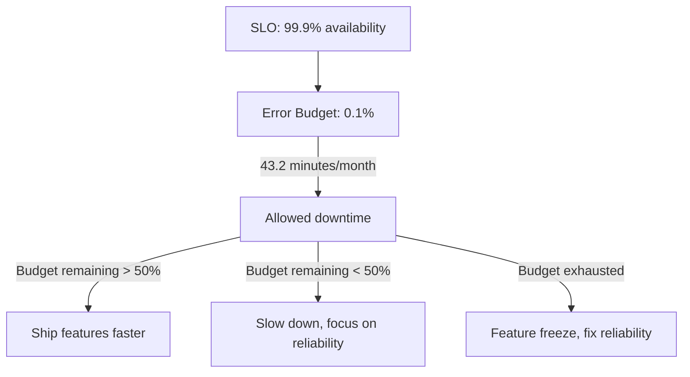
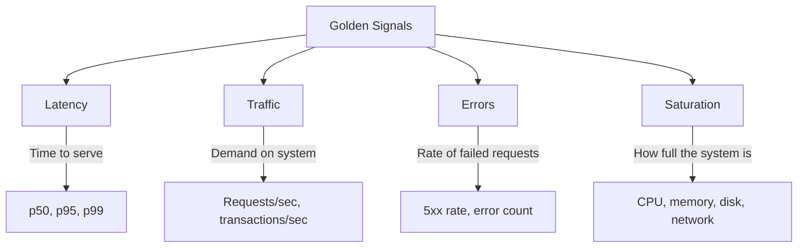

# Observability Overview

## Introduction

Observability is the ability to understand the internal state of a system by examining its external outputs. In distributed systems (microservices, cloud-native), observability is critical for debugging, performance optimization, and maintaining reliability.

## The Three Pillars of Observability



| Pillar | What It Captures | Question It Answers | Example |
|--------|-----------------|---------------------|---------|
| **Logs** | Discrete events with context | "What happened and why?" | Error stack trace, request details |
| **Metrics** | Numeric measurements over time | "How much / how fast / how many?" | CPU usage, request rate, error rate |
| **Traces** | Request flow across services | "Where did the request go and where was it slow?" | End-to-end request path with timings |

### How They Work Together



**Example Workflow:**
1. **Metrics** alert: p99 latency exceeds 2 seconds
2. **Traces** reveal: requests to payment-service are slow
3. **Logs** show: database connection pool exhausted
4. **Root cause**: Database connections not being released (connection leak)

## Observability vs Monitoring

| Aspect | Monitoring | Observability |
|--------|-----------|---------------|
| **Definition** | Tracking known metrics | Understanding unknown states |
| **Approach** | Pre-defined dashboards and alerts | Exploratory investigation |
| **Questions** | "Is the system healthy?" | "Why is the system unhealthy?" |
| **Tools** | Dashboards, alerts | Logs + metrics + traces + correlation |
| **Mindset** | "What do I expect to break?" | "What can I learn when something breaks?" |

> **Key Insight**: Monitoring is a subset of observability. You monitor known conditions; observability helps you investigate unknown conditions.

## Observability Stack



## SLI, SLO, SLA



### SLI (Service Level Indicator)

A quantitative measure of a service aspect:

| SLI Type | Definition | Example |
|----------|-----------|---------|
| **Availability** | Fraction of successful requests | 99.9% of requests return 2xx/3xx |
| **Latency** | Time to serve a request | 99th percentile < 500ms |
| **Throughput** | Requests per second | 10,000 RPS sustained |
| **Error Rate** | Fraction of failed requests | < 0.1% of requests return 5xx |
| **Freshness** | Data staleness | Data updated within 5 minutes |

### SLO (Service Level Objective)

The target value for an SLI:

```yaml
# SLO Example
service: payment-api
slos:
  - name: availability
    sli: "Successful requests / Total requests"
    target: 99.95%
    window: 30d

  - name: latency
    sli: "p99 request latency"
    target: < 500ms
    window: 30d

  - name: error-rate
    sli: "5xx responses / Total responses"
    target: < 0.1%
    window: 30d
```

### Error Budget



| SLO | Monthly Error Budget | Annual Error Budget |
|-----|---------------------|---------------------|
| 99.9% | 43.2 minutes | 8.76 hours |
| 99.95% | 21.6 minutes | 4.38 hours |
| 99.99% | 4.32 minutes | 52.6 minutes |

## Golden Signals (Google SRE)



| Signal | What to Measure | Alert Threshold Example |
|--------|----------------|------------------------|
| **Latency** | Request duration (p50, p95, p99) | p99 > 500ms for 5 min |
| **Traffic** | Requests per second | RPS drops > 50% from baseline |
| **Errors** | Error rate (5xx / total) | Error rate > 1% for 5 min |
| **Saturation** | Resource utilization (CPU, memory) | CPU > 80% for 10 min |

## RED Method (Tom Wilkie)

For request-driven services:

| Metric | Description | Example |
|--------|------------|---------|
| **Rate** | Requests per second | 1000 RPS |
| **Errors** | Failed requests per second | 5 errors/sec |
| **Duration** | Latency distribution (histogram) | p99 = 250ms |

## USE Method (Brendan Gregg)

For resources (CPU, memory, disk, network):

| Metric | Description | Example |
|--------|------------|---------|
| **Utilization** | % of resource in use | CPU 75%, Memory 60% |
| **Saturation** | Work queued (overloaded) | CPU load average > 2x cores |
| **Errors** | Error events | Disk I/O errors, network drops |

## Interview Questions

### Q1: What are the three pillars of observability?
**Answer**: (1) Logs—discrete event records with timestamps and context, answering "what happened?" (2) Metrics—numeric measurements aggregated over time, answering "how much/how fast?" (3) Traces—distributed request paths across services, answering "where did the request go and where was it slow?" Together they provide complete system understanding: metrics detect issues, traces locate them, logs explain them.

### Q2: What is the difference between monitoring and observability?
**Answer**: Monitoring tracks pre-defined metrics and alerts on known conditions (dashboard-driven). Observability is the ability to understand any system state by exploring its outputs, even states you didn't anticipate (query-driven). Monitoring answers "is the system healthy?" Observability answers "why is the system unhealthy?" You monitor known failure modes; you use observability to investigate unknown ones. Modern systems need both.

### Q3: Explain SLOs and error budgets.
**Answer**: An SLO is a target value for a service level indicator (e.g., 99.9% availability). The error budget is the allowed deviation (100% - SLO = 0.1% = 43.2 min/month downtime). Error budgets balance reliability vs velocity: when budget remains, ship features faster; when running low, slow down and focus on reliability; when exhausted, freeze features until reliability improves. This creates a data-driven framework for reliability decisions.

### Q4: What are the Golden Signals?
**Answer**: Google's four Golden Signals for monitoring: (1) Latency—time to serve requests (p50, p95, p99), (2) Traffic—demand on the system (RPS, concurrent users), (3) Errors—rate of failed requests (5xx rate), (4) Saturation—how full resources are (CPU, memory, disk). For request-driven services, focus on these four. For resources, use the USE method (Utilization, Saturation, Errors). For services, use the RED method (Rate, Errors, Duration).

### Q5: How do you implement observability in a microservices architecture?
**Answer**: (1) Instrument applications with OpenTelemetry SDKs for metrics, traces, and logs, (2) Deploy OpenTelemetry Collector as a sidecar or DaemonSet for data collection, (3) Use Prometheus for metrics storage, Loki or Elasticsearch for logs, Tempo or Jaeger for traces, (4) Visualize in Grafana with dashboards for each service, (5) Set up SLO-based alerts, not threshold-based, (6) Implement correlation IDs across services for log-trace correlation, (7) Use structured logging (JSON) for machine-parseable logs.

## Common Mistakes

1. **Too many alerts**: Alert fatigue—teams ignore important alerts
2. **Alerting on symptoms, not causes**: Alert on user impact (latency, errors), not CPU spikes
3. **No correlation between pillars**: Logs, metrics, and traces in separate systems with no links
4. **Missing structured logging**: Unstructured logs are hard to query and analyze
5. **No SLOs**: Without SLOs, you can't make data-driven reliability decisions
6. **Over-collecting**: Collecting everything without retention policies—cost explosion
7. **Ignoring cardinality**: High-cardinality metrics (user IDs as labels) overwhelm Prometheus

## Summary

| Concept | Key Takeaway |
|---------|-------------|
| **Logs** | What happened—detailed event records |
| **Metrics** | How much—numeric measurements over time |
| **Traces** | Where it went—request flow across services |
| **SLI/SLO** | Define and measure service reliability targets |
| **Error Budget** | Balance reliability vs feature velocity |
| **Golden Signals** | Latency, traffic, errors, saturation |

## Cross-References

- **Logging**: [ELK & Structured Logging](./logging.md) — Deep dive into logging
- **Monitoring**: [Prometheus & Grafana](./monitoring.md) — Metrics and alerting
- **Tracing**: [Distributed Tracing](./tracing.md) — Request tracing across services
- **Kubernetes**: [Pods](../kubernetes/pods.md) — Observability for K8s workloads
- **CI/CD**: [Pipelines](../cicd/pipelines.md) — Observability in deployment pipelines
