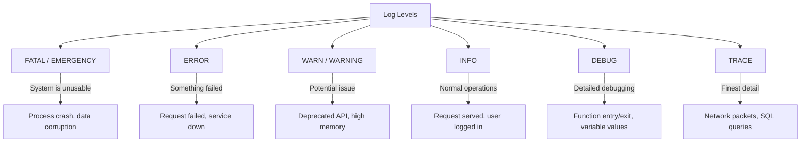
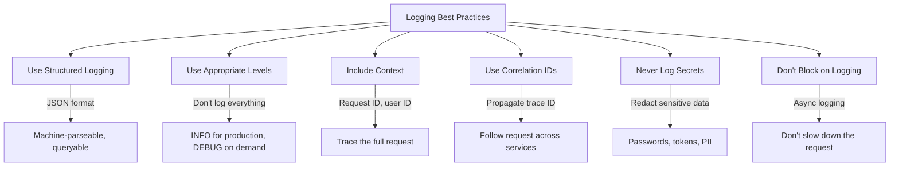
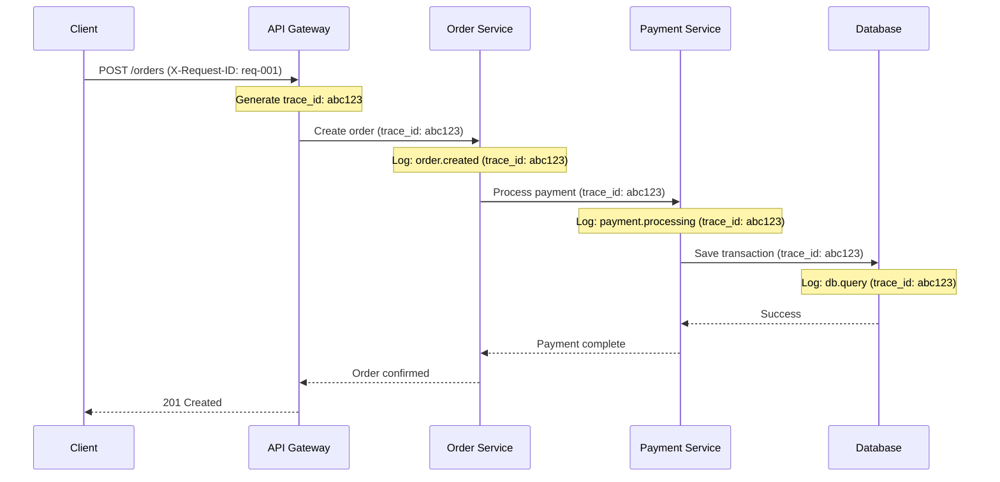
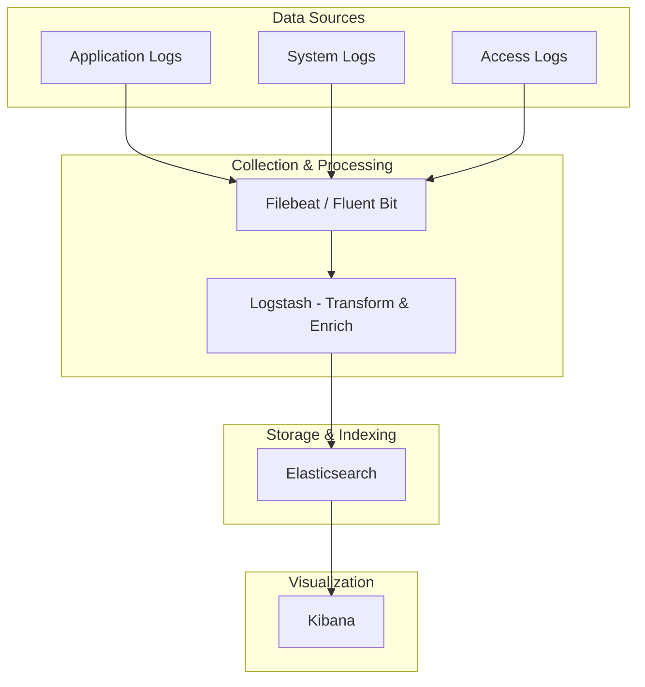
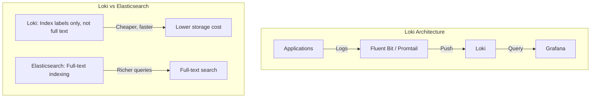
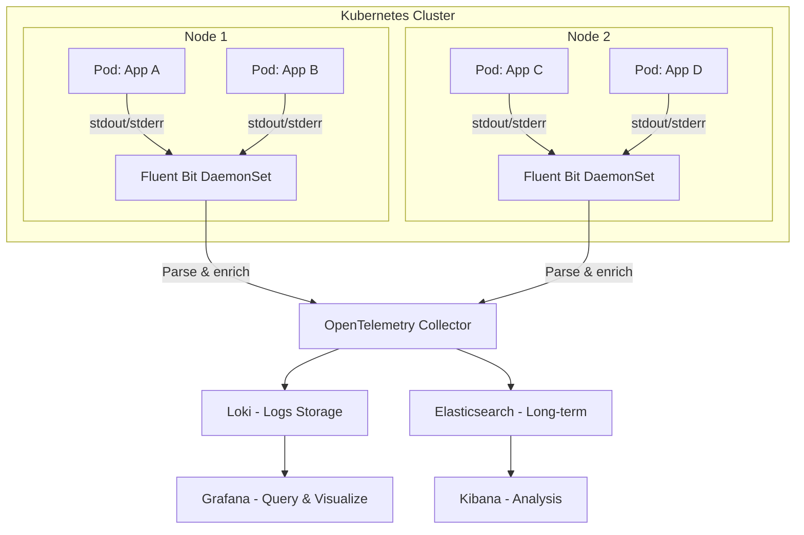

# Logging

## Introduction

Logging is the practice of recording events that occur within a system. In distributed systems, centralized logging is essential for debugging, auditing, and understanding system behavior. Modern logging goes beyond simple text files—structured logging, correlation IDs, and log aggregation make logs a powerful observability tool.

## Log Levels



| Level | When to Use | Production? | Example |
|-------|------------|-------------|---------|
| **FATAL** | System cannot continue | Always | Out of memory, corrupt data |
| **ERROR** | Operation failed, needs attention | Always | Database connection failed, API timeout |
| **WARN** | Unexpected but recoverable | Always | Retry attempt, deprecated API usage |
| **INFO** | Normal significant events | Always | Server started, user login, order placed |
| **DEBUG** | Detailed diagnostic info | Off (enable on demand) | Cache hit/miss, function parameters |
| **TRACE** | Very detailed, high volume | Off | Every SQL query, HTTP headers |

## Structured Logging

### Unstructured vs Structured

```bash
# Unstructured (hard to parse)
2024-01-15 10:30:45 ERROR Failed to process order for user 12345: payment timeout

# Structured (JSON - machine-parseable)
{"timestamp":"2024-01-15T10:30:45Z","level":"ERROR","message":"Failed to process order","user_id":"12345","order_id":"ORD-789","error":"payment_timeout","duration_ms":5000,"service":"order-service","trace_id":"abc123"}
```

### Structured Log Format (JSON)

```json
{
    "timestamp": "2024-01-15T10:30:45.123Z",
    "level": "ERROR",
    "service": "order-service",
    "message": "Failed to process order",
    "context": {
        "user_id": "12345",
        "order_id": "ORD-789",
        "amount": 99.99,
        "currency": "USD"
    },
    "error": {
        "type": "PaymentTimeoutError",
        "message": "Payment gateway timeout after 5000ms",
        "stack_trace": "..."
    },
    "trace_id": "abc123def456",
    "span_id": "span789",
    "request_id": "req-001",
    "hostname": "order-service-pod-xyz",
    "environment": "production"
}
```

### Logging Best Practices



## Correlation IDs



**Correlation ID Propagation:**
```python
# Python example - propagate correlation ID
import logging
import uuid
from flask import Flask, request, g

app = Flask(__name__)

@app.before_request
def before_request():
    # Get or generate correlation ID
    g.correlation_id = request.headers.get('X-Request-ID', str(uuid.uuid4()))

@app.after_request
def after_request(response):
    response.headers['X-Request-ID'] = g.correlation_id
    return response

# Logging with correlation ID
def log_with_context(level, message, **kwargs):
    logger = logging.getLogger(__name__)
    extra = {
        'correlation_id': getattr(g, 'correlation_id', 'unknown'),
        'service': 'order-service',
        **kwargs
    }
    getattr(logger, level)(message, extra=extra)
```

## ELK Stack



### ELK Components

| Component | Role | Details |
|-----------|------|---------|
| **Elasticsearch** | Search & analytics engine | Stores, indexes, and queries logs |
| **Logstash** | Data processing pipeline | Parses, transforms, enriches logs |
| **Kibana** | Visualization | Dashboards, search, alerting |
| **Filebeat** | Log shipper | Lightweight agent on each host |
| **Fluent Bit** | Log processor | Lightweight alternative to Logstash |

### Elasticsearch Query Example

```json
// Find all ERROR logs for order-service in the last hour
GET /logs-*/_search
{
    "query": {
        "bool": {
            "must": [
                { "match": { "level": "ERROR" } },
                { "match": { "service": "order-service" } },
                { "range": {
                    "timestamp": {
                        "gte": "now-1h"
                    }
                }}
            ]
        }
    },
    "sort": [{ "timestamp": "desc" }],
    "size": 100
}
```

## Modern Logging: Loki



| Feature | Elasticsearch | Loki |
|---------|--------------|------|
| **Indexing** | Full-text | Labels only |
| **Query** | Rich (KQL, Lucene) | LogQL (simpler) |
| **Storage** | Higher (full index) | Lower (compressed chunks) |
| **Cost** | Higher | Lower |
| **Integration** | Kibana | Grafana |
| **Best For** | Complex log analysis | Cost-effective log storage |

## Centralized Logging Architecture



### Fluent Bit Configuration

```yaml
# Fluent Bit DaemonSet for Kubernetes
apiVersion: apps/v1
kind: DaemonSet
metadata:
  name: fluent-bit
  namespace: logging
spec:
  selector:
    matchLabels:
      app: fluent-bit
  template:
    metadata:
      labels:
        app: fluent-bit
    spec:
      containers:
        - name: fluent-bit
          image: fluent/fluent-bit:2.2
          volumeMounts:
            - name: varlog
              mountPath: /var/log
            - name: containers
              mountPath: /var/lib/docker/containers
              readOnly: true
          config: |
            [INPUT]
                Name              tail
                Path              /var/log/containers/*.log
                Parser            docker
                Tag               kube.*

            [FILTER]
                Name                kubernetes
                Match               kube.*
                Kube_URL            https://kubernetes.default.svc:443
                Kube_Tag_Prefix     kube.var.log.containers.
                Merge_Log           On
                K8S-Logging.Parser  On

            [OUTPUT]
                Name                loki
                Match               *
                Host                loki.logging.svc.cluster.local
                Port                3100
```

## Interview Questions

### Q1: What is structured logging and why is it important?
**Answer**: Structured logging outputs logs in a machine-parseable format (typically JSON) with consistent fields. Important because: (1) Enables powerful querying (filter by service, level, user_id), (2) Easy aggregation and analysis, (3) Correlation with traces via trace_id, (4) Machine-parseable for automated alerting, (5) Consistent format across services. Unstructured logs require regex parsing, which is fragile and slow. Structured logs integrate with tools like Elasticsearch, Loki, and Grafana.

### Q2: How do you implement correlation IDs across microservices?
**Answer**: (1) Generate a unique ID at the API gateway (or use incoming X-Request-ID), (2) Pass it in HTTP headers (X-Request-ID, X-Trace-ID) to all downstream services, (3) Include it in all log entries for that request, (4) Propagate through message queues (include in message headers), (5) Store in MDC (Mapped Diagnostic Context) for automatic inclusion in logs. Libraries like OpenTelemetry handle propagation automatically. Use the same ID in logs and traces for correlation.

### Q3: What is the difference between ELK and Loki for log management?
**Answer**: ELK (Elasticsearch, Logstash, Kibana) provides full-text indexing—rich queries but higher storage cost. Loki (by Grafana Labs) indexes only labels, not full text—simpler queries but much lower cost. ELK is better for: complex log analysis, compliance requiring full-text search, large enterprises. Loki is better for: cost-effective log storage, Grafana ecosystem integration, Kubernetes-native logging. Both work with Fluent Bit/Fluentd for collection.

### Q4: What should and shouldn't you log?
**Answer**: Log: (1) Request/response metadata (method, path, status, duration), (2) Business events (order created, user registered), (3) Errors with context and stack traces, (4) External service calls and responses, (5) Security events (login, permission denied). Don't log: (1) Passwords, tokens, API keys, (2) PII (credit card numbers, SSNs) without redaction, (3) Full request/response bodies in production, (4) High-volume debug information, (5) Redundant information already in metrics.

### Q5: How do you manage log retention and costs?
**Answer**: (1) Define retention policies by log level (ERROR: 90 days, INFO: 30 days, DEBUG: 7 days), (2) Use tiered storage (hot: Elasticsearch SSD, warm: HDD, cold: S3/Glacier), (3) Sample high-volume logs (keep 10% of DEBUG), (4) Compress and archive old logs, (5) Use Loki for cost-effective storage, (6) Index only necessary fields, (7) Set up log rotation on nodes, (8) Monitor log volume and set alerts on spikes.

## Common Mistakes

1. **Logging sensitive data**: Passwords, tokens, PII in logs—security breach
2. **Unstructured logs**: Hard to query, requires regex parsing
3. **No correlation IDs**: Can't trace a request across services
4. **Wrong log levels**: Using ERROR for expected conditions, DEBUG in production
5. **No log retention**: Storing logs forever—cost explosion
6. **Logging in tight loops**: Performance impact from excessive logging
7. **Missing context**: Logs without request_id, user_id, or service name

## Summary

| Concept | Key Takeaway |
|---------|-------------|
| **Structured Logging** | JSON format, machine-parseable, queryable |
| **Log Levels** | FATAL > ERROR > WARN > INFO > DEBUG > TRACE |
| **Correlation IDs** | Trace requests across services |
| **ELK Stack** | Elasticsearch + Logstash + Kibana for log management |
| **Loki** | Cost-effective log storage, Grafana integration |
| **Best Practices** | Structure, context, no secrets, appropriate levels |

## Cross-References

- **Observability Overview**: [README](./README.md) — Three pillars
- **Monitoring**: [Prometheus](./monitoring.md) — Metrics alongside logs
- **Tracing**: [Distributed Tracing](./tracing.md) — Correlate logs with traces
- **Kubernetes**: [Pods](../kubernetes/pods.md) — Pod log collection
- **CI/CD**: [Pipelines](../cicd/pipelines.md) — Logging in CI/CD
