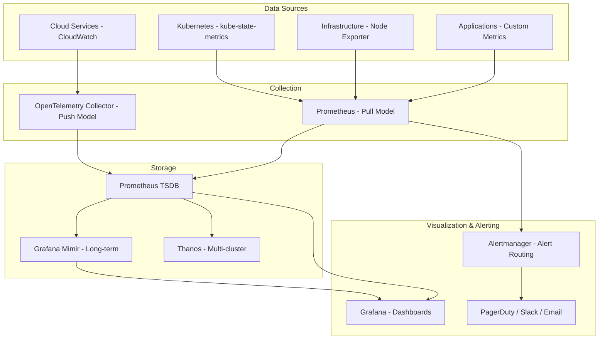
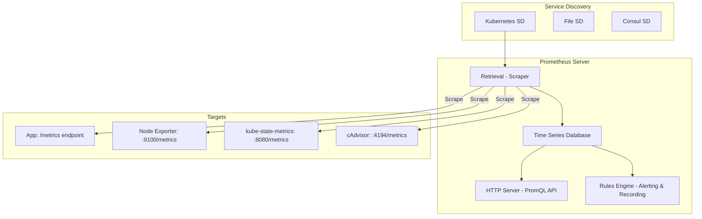
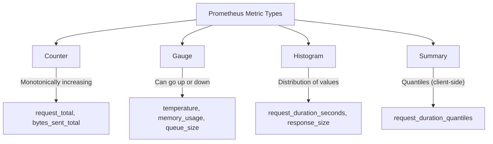
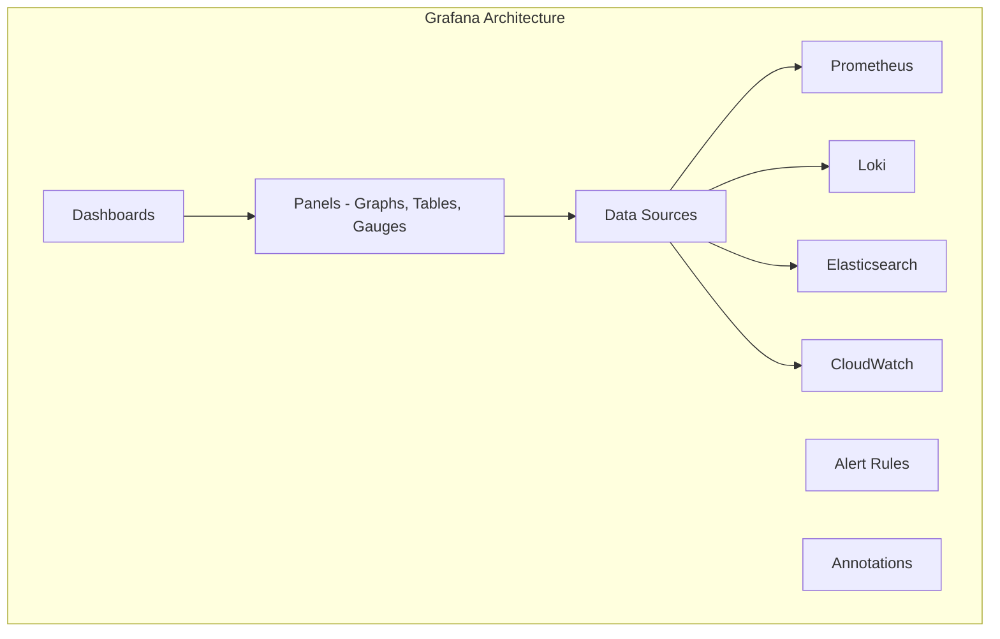
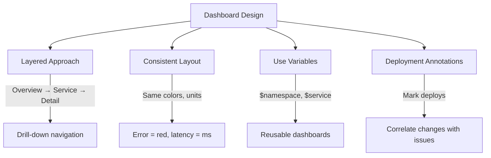
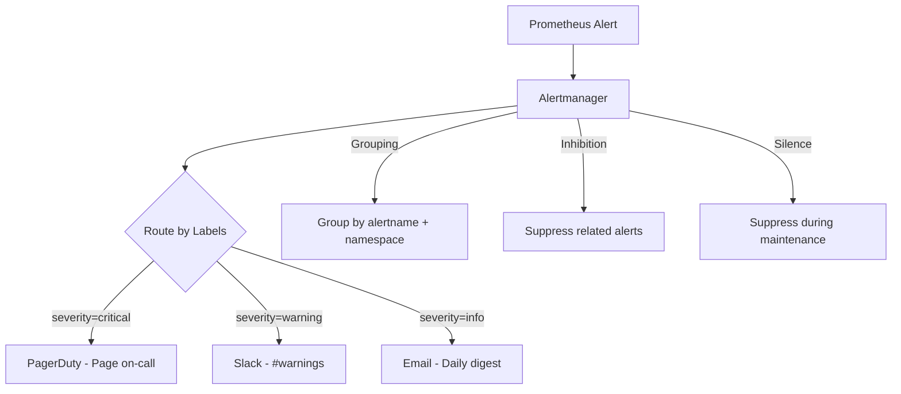

# Monitoring

## Introduction

Monitoring is the practice of collecting, analyzing, and alerting on numeric metrics over time. It provides real-time visibility into system health, performance, and behavior. Modern monitoring uses time-series databases, rich dashboards, and intelligent alerting to detect and respond to issues before users are impacted.

## Monitoring Architecture



## Prometheus

Prometheus is the de facto standard for Kubernetes monitoring. It uses a pull-based model to scrape metrics from targets.

### Prometheus Architecture



### Prometheus Configuration

```yaml
# prometheus.yml
global:
  scrape_interval: 15s
  evaluation_interval: 15s

rule_files:
  - "alerts/*.yml"

alerting:
  alertmanagers:
    - static_configs:
        - targets:
            - alertmanager:9093

scrape_configs:
  # Prometheus self-monitoring
  - job_name: 'prometheus'
    static_configs:
      - targets: ['localhost:9090']

  # Kubernetes pods with annotations
  - job_name: 'kubernetes-pods'
    kubernetes_sd_configs:
      - role: pod
    relabel_configs:
      - source_labels: [__meta_kubernetes_pod_annotation_prometheus_io_scrape]
        action: keep
        regex: true
      - source_labels: [__meta_kubernetes_pod_annotation_prometheus_io_path]
        action: replace
        target_label: __metrics_path__
        regex: (.+)

  # Node Exporter
  - job_name: 'node-exporter'
    static_configs:
      - targets: ['node-exporter:9100']

  # kube-state-metrics
  - job_name: 'kube-state-metrics'
    static_configs:
      - targets: ['kube-state-metrics:8080']
```

### Metric Types



| Type | Description | Example | Use Case |
|------|------------|---------|----------|
| **Counter** | Monotonically increasing value | `http_requests_total` | Request count, error count |
| **Gauge** | Value that can go up or down | `memory_usage_bytes` | Current temperature, queue depth |
| **Histogram** | Distribution of observations | `http_request_duration_seconds` | Latency distribution |
| **Summary** | Quantiles calculated client-side | `rpc_duration_seconds` | Percentiles (p50, p99) |

### PromQL (Prometheus Query Language)

```promql
# Basic queries
http_requests_total                          # All request counters
http_requests_total{service="order-service"} # Filter by label
http_requests_total{status=~"5.."}          # Regex match (5xx errors)

# Rate calculations
rate(http_requests_total[5m])               # Requests per second (5-min rate)
rate(http_requests_total{status=~"5.."}[5m]) # Error rate per second

# Error rate percentage
sum(rate(http_requests_total{status=~"5.."}[5m])) 
  / 
sum(rate(http_requests_total[5m])) 
  * 100

# Latency percentiles (from histogram)
histogram_quantile(0.99, rate(http_request_duration_seconds_bucket[5m]))  # p99
histogram_quantile(0.95, rate(http_request_duration_seconds_bucket[5m]))  # p95

# Top 5 services by request rate
topk(5, sum by (service) (rate(http_requests_total[5m])))

# Memory usage percentage
(node_memory_MemTotal_bytes - node_memory_MemAvailable_bytes) 
  / 
node_memory_MemTotal_bytes 
  * 100

# CPU usage by container
sum(rate(container_cpu_usage_seconds_total[5m])) by (pod)
```

## Grafana



### Key Grafana Features

| Feature | Purpose | Example |
|---------|---------|---------|
| **Dashboards** | Visualize metrics | Service overview, infrastructure health |
| **Panels** | Individual visualizations | Time series, gauge, table, heatmap |
| **Variables** | Dynamic dashboards | Filter by namespace, service, instance |
| **Alerting** | Visual alert rules | Alert when error rate > 1% |
| **Annotations** | Mark events | Deployments, incidents on graphs |
| **Provisioning** | Dashboards as code | JSON/YAML in Git |

### Dashboard Best Practices



## Alerting

### Alert Rules in Prometheus

```yaml
# alerts/app-alerts.yml
groups:
  - name: application-alerts
    rules:
      # High error rate
      - alert: HighErrorRate
        expr: |
          sum(rate(http_requests_total{status=~"5.."}[5m])) by (service)
            /
          sum(rate(http_requests_total[5m])) by (service)
            > 0.01
        for: 5m
        labels:
          severity: critical
        annotations:
          summary: "High error rate on {{ $labels.service }}"
          description: "Error rate is {{ $value | humanizePercentage }} (threshold: 1%)"

      # High latency
      - alert: HighLatency
        expr: |
          histogram_quantile(0.99, rate(http_request_duration_seconds_bucket[5m]))
            > 0.5
        for: 5m
        labels:
          severity: warning
        annotations:
          summary: "High p99 latency on {{ $labels.service }}"
          description: "p99 latency is {{ $value | humanizeDuration }}"

      # Pod crash looping
      - alert: PodCrashLooping
        expr: |
          increase(kube_pod_container_status_restarts_total[1h]) > 3
        for: 5m
        labels:
          severity: critical
        annotations:
          summary: "Pod {{ $labels.pod }} is crash looping"

      # High memory usage
      - alert: HighMemoryUsage
        expr: |
          (node_memory_MemTotal_bytes - node_memory_MemAvailable_bytes)
            /
          node_memory_MemTotal_bytes
            > 0.85
        for: 10m
        labels:
          severity: warning
        annotations:
          summary: "High memory usage on {{ $labels.instance }}"
```

### Alertmanager Configuration

```yaml
# alertmanager.yml
global:
  slack_api_url: 'https://hooks.slack.com/services/xxx'

route:
  receiver: 'default'
  group_by: ['alertname', 'namespace']
  group_wait: 30s
  group_interval: 5m
  repeat_interval: 4h
  routes:
    - match:
        severity: critical
      receiver: 'pagerduty'
      repeat_interval: 15m

    - match:
        severity: warning
      receiver: 'slack'

receivers:
  - name: 'default'
    slack_configs:
      - channel: '#alerts'
        title: '{{ .GroupLabels.alertname }}'
        text: '{{ range .Alerts }}{{ .Annotations.description }}{{ end }}'

  - name: 'pagerduty'
    pagerduty_configs:
      - service_key: '<key>'
        severity: '{{ .GroupLabels.severity }}'

  - name: 'slack'
    slack_configs:
      - channel: '#warnings'
```

### Alert Routing



## Key Metrics to Monitor

### Application Metrics (RED)

```python
# Python example with Prometheus client
from prometheus_client import Counter, Histogram, Gauge

# Request counter
REQUEST_COUNT = Counter(
    'http_requests_total',
    'Total HTTP requests',
    ['method', 'endpoint', 'status']
)

# Request duration histogram
REQUEST_DURATION = Histogram(
    'http_request_duration_seconds',
    'HTTP request duration',
    ['method', 'endpoint'],
    buckets=[0.01, 0.05, 0.1, 0.25, 0.5, 1.0, 2.5, 5.0, 10.0]
)

# In-flight requests gauge
IN_FLIGHT = Gauge(
    'http_requests_in_flight',
    'Current in-flight requests'
)

# Usage
@app.route('/api/orders')
@REQUEST_DURATION.labels(method='GET', endpoint='/api/orders').time()
def get_orders():
    REQUEST_COUNT.labels(method='GET', endpoint='/api/orders', status='200').inc()
    IN_FLIGHT.inc()
    try:
        return orders
    finally:
        IN_FLIGHT.dec()
```

### Infrastructure Metrics (USE)

| Resource | Utilization | Saturation | Errors |
|----------|------------|------------|--------|
| **CPU** | `node_cpu_seconds_total` | `node_load5` | N/A |
| **Memory** | `node_memory_MemTotal - Available` | `node_memory_SwapTotal - SwapFree` | OOM kills |
| **Disk** | `node_filesystem_avail_bytes` | `node_disk_io_time_seconds_total` | `node_disk_io_errors_total` |
| **Network** | `node_network_receive_bytes_total` | `node_netstat_Tcp_CurrEstab` | `node_network_receive_errs_total` |

### Kubernetes Metrics

| Metric | Source | What It Tells You |
|--------|--------|-------------------|
| `kube_pod_status_phase` | kube-state-metrics | Pod lifecycle phase |
| `kube_pod_container_status_restarts_total` | kube-state-metrics | Container restart count |
| `kube_deployment_status_replicas_available` | kube-state-metrics | Available replicas |
| `container_cpu_usage_seconds_total` | cAdvisor | Container CPU usage |
| `container_memory_working_set_bytes` | cAdvisor | Container memory usage |

## Interview Questions

### Q1: How does Prometheus work?
**Answer**: Prometheus uses a pull-based model: it scrapes HTTP endpoints (`/metrics`) from targets at regular intervals (default 15s). It stores data in a local time-series database (TSDB). Service discovery (Kubernetes, Consul, file) finds targets automatically. PromQL queries data for dashboards and alerts. The Rules Engine evaluates alerting rules and recording rules. Alertmanager handles alert routing, grouping, deduplication, and notification.

### Q2: What are the Prometheus metric types?
**Answer**: Four types: (1) Counter—monotonically increasing value (request count, errors), can only go up or reset to zero. (2) Gauge—value that can go up or down (temperature, memory, queue depth). (3) Histogram—samples observations in configurable buckets (latency distribution), allows percentile calculation. (4) Summary—like histogram but calculates quantiles client-side (less flexible than histogram). Use Counter for rates, Gauge for current values, Histogram for latency distributions.

### Q3: How do you design effective alerts?
**Answer**: (1) Alert on symptoms, not causes—alert on user impact (error rate, latency), not CPU spikes. (2) Use SLO-based alerts—alert when error budget is burning. (3) Set appropriate thresholds—too low = noise, too high = missed incidents. (4) Use `for` clauses—require sustained condition (5 min) before alerting. (5) Group related alerts—Alertmanager groups by alertname and namespace. (6) Include actionable context—what's wrong, what to check, runbook link. (7) Define severity—critical (page), warning (Slack), info (dashboard).

### Q4: What is the difference between pull and push monitoring?
**Answer**: Pull (Prometheus): Monitoring server scrapes targets. Pros: targets don't need to know the monitoring server, easy to add/remove targets, server controls scrape interval. Cons: requires targets to be reachable, doesn't work well for short-lived jobs. Push (Pushgateway, InfluxDB): Targets push metrics to server. Pros: works for batch jobs, fire-and-forget. Cons: targets need to know the server address, can overwhelm server, harder to manage. Prometheus supports push via Pushgateway for short-lived jobs.

### Q5: How do you handle high-cardinality metrics?
**Answer**: High cardinality (many unique label combinations) causes high memory usage and slow queries. Solutions: (1) Limit label values—don't use user_id, request_id as labels, (2) Use recording rules to pre-aggregate, (3) Drop high-cardinality labels at scrape time (metric_relabel_configs), (4) Use histograms instead of individual latency values, (5) Monitor cardinality with `prometheus_tsdb_head_series`, (6) Consider Loki for high-cardinality data (logs) instead of metrics.

## Common Mistakes

1. **Alerting on everything**: Too many alerts = alert fatigue = ignored alerts
2. **No `for` clause**: Single-sample spikes trigger unnecessary alerts
3. **Missing rate() on counters**: Raw counter values are meaningless—always use rate()
4. **High cardinality**: Using user IDs or request IDs as labels overwhelms Prometheus
5. **No recording rules**: Complex PromQL queries slow down dashboards
6. **Ignoring alertmanager**: Sending alerts directly to Slack without grouping/deduplication
7. **No retention policy**: Storing metrics forever—configure TSDB retention

## Summary

| Concept | Key Takeaway |
|---------|-------------|
| **Prometheus** | Pull-based metrics collection, TSDB, PromQL |
| **Metric Types** | Counter, Gauge, Histogram, Summary |
| **PromQL** | Query language for metrics analysis |
| **Grafana** | Dashboard visualization and alerting |
| **Alerting** | SLO-based, symptom-driven, actionable |
| **Golden Signals** | Latency, traffic, errors, saturation |

## Cross-References

- **Observability Overview**: [README](./README.md) — Three pillars, SLI/SLO
- **Logging**: [ELK & Loki](./logging.md) — Logs alongside metrics
- **Tracing**: [Distributed Tracing](./tracing.md) — Traces for latency analysis
- **Kubernetes**: [Pods](../kubernetes/pods.md) — K8s metrics collection
- **AWS**: [CloudWatch](../aws/README.md) — AWS-native monitoring
