# Distributed Tracing

## Introduction

Distributed tracing tracks requests as they flow through multiple services in a microservices architecture. It provides a visual map of the request path, identifies bottlenecks, and helps debug issues across service boundaries. Each request gets a unique trace ID, and each service operation creates a span.

## Why Distributed Tracing?

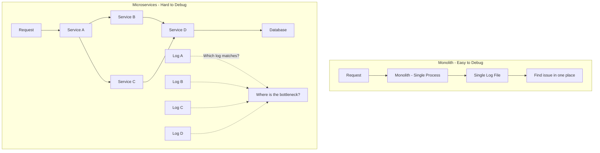

**Without tracing:** You have logs from 5 services but no way to correlate them for a single request.

**With tracing:** One trace ID follows the request through all services—you can see exactly where time was spent.

## Core Concepts

### Trace

A trace represents the entire journey of a request through the system:

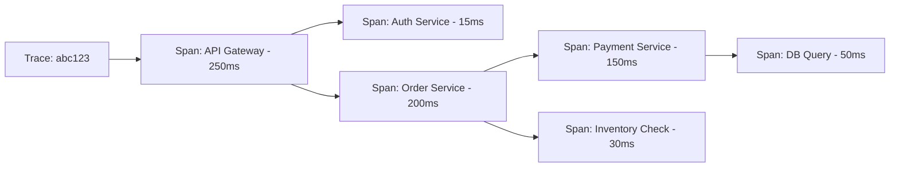

### Span

A span represents a single unit of work within a trace:

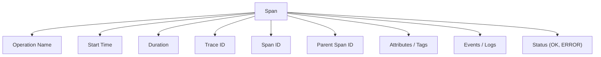

| Span Field | Description | Example |
|-----------|-------------|---------|
| **Operation Name** | What this span represents | `HTTP GET /api/orders` |
| **Trace ID** | Unique ID for the entire trace | `abc123def456` |
| **Span ID** | Unique ID for this span | `span789` |
| **Parent Span ID** | Parent span (empty for root) | `span001` |
| **Start Time** | When the span started | `2024-01-15T10:30:45.123Z` |
| **Duration** | How long the span took | `150ms` |
| **Attributes** | Key-value metadata | `http.method=GET`, `db.system=postgresql` |
| **Events** | Timestamped annotations | `cache.miss`, `retry.attempt` |
| **Status** | OK, ERROR, UNSET | `ERROR` |

### Span Relationships

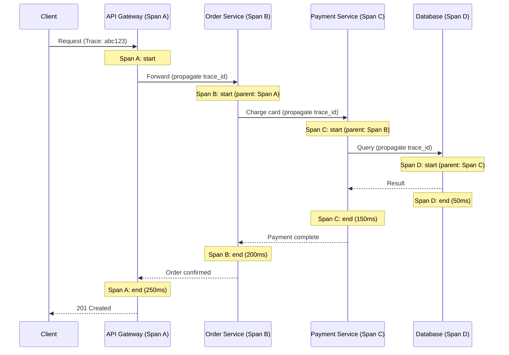

## Context Propagation

Context propagation is how trace information is passed between services:

### HTTP Headers (W3C Trace Context)

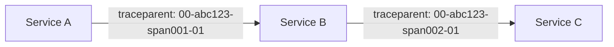

**W3C Trace Context Format:**
```
traceparent: 00-<trace-id>-<parent-span-id>-<trace-flags>
```

| Field | Description | Example |
|-------|-------------|---------|
| **Version** | Always `00` | `00` |
| **Trace ID** | 32 hex chars (128-bit) | `abc123def456789012345678` |
| **Parent Span ID** | 16 hex chars (64-bit) | `span00100000000` |
| **Trace Flags** | `01` = sampled | `01` |

**Other Propagation Formats:**

| Format | Header | Used By |
|--------|--------|---------|
| **W3C Trace Context** | `traceparent` | OpenTelemetry (standard) |
| **B3** | `X-B3-TraceId`, `X-B3-SpanId` | Zipkin, Istio |
| **Jaeger** | `uber-trace-id` | Jaeger |
| **AWS X-Ray** | `X-Amzn-Trace-Id` | AWS X-Ray |

### Message Queue Propagation

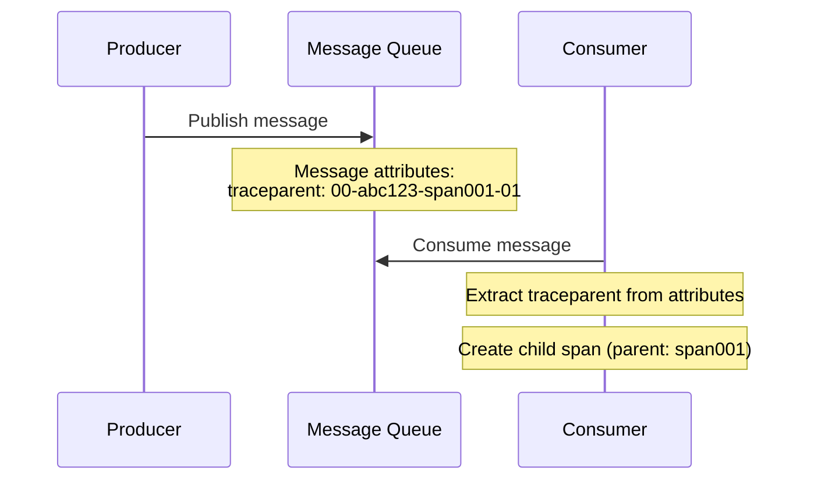

## OpenTelemetry

OpenTelemetry (OTel) is the CNCF standard for observability instrumentation—providing a unified API and SDK for traces, metrics, and logs.

### OpenTelemetry Architecture

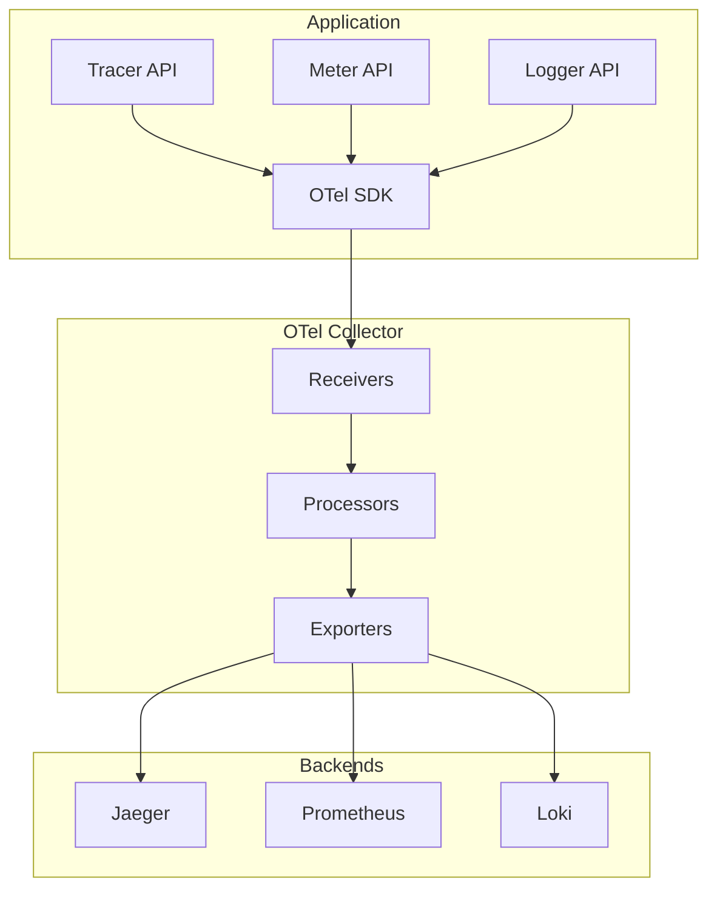

### OTel Collector Configuration

```yaml
# otel-collector-config.yaml
receivers:
  otlp:
    protocols:
      grpc:
        endpoint: 0.0.0.0:4317
      http:
        endpoint: 0.0.0.0:4318

processors:
  batch:
    timeout: 1s
    send_batch_size: 1024

  memory_limiter:
    check_interval: 1s
    limit_mib: 512

  attributes:
    actions:
      - key: environment
        value: production
        action: upsert

exporters:
  otlp/jaeger:
    endpoint: jaeger-collector:4317
    tls:
      insecure: true

  prometheus:
    endpoint: 0.0.0.0:8889

  logging:
    loglevel: info

service:
  pipelines:
    traces:
      receivers: [otlp]
      processors: [memory_limiter, batch, attributes]
      exporters: [otlp/jaeger, logging]
    metrics:
      receivers: [otlp]
      processors: [memory_limiter, batch]
      exporters: [prometheus]
```

### Instrumenting Applications

```python
# Python OpenTelemetry instrumentation
from opentelemetry import trace
from opentelemetry.sdk.trace import TracerProvider
from opentelemetry.sdk.trace.export import BatchSpanProcessor
from opentelemetry.exporter.otlp.proto.grpc.trace_exporter import OTLPSpanExporter
from opentelemetry.instrumentation.flask import FlaskInstrumentor
from opentelemetry.instrumentation.requests import RequestsInstrumentor

# Setup
provider = TracerProvider()
processor = BatchSpanProcessor(OTLPSpanExporter(endpoint="otel-collector:4317"))
provider.add_span_processor(processor)
trace.set_tracer_provider(provider)

# Auto-instrument Flask and requests
FlaskInstrumentor().instrument_app(app)
RequestsInstrumentor().instrument()

# Manual instrumentation
tracer = trace.get_tracer(__name__)

def process_order(order_id):
    with tracer.start_as_current_span("process_order") as span:
        span.set_attribute("order.id", order_id)

        with tracer.start_as_current_span("validate_order"):
            validate(order_id)

        with tracer.start_as_current_span("charge_payment") as payment_span:
            payment_span.set_attribute("payment.method", "credit_card")
            result = charge(order_id)
            if not result.success:
                payment_span.set_status(StatusCode.ERROR)
                payment_span.record_exception(result.error)
```

```javascript
// Node.js OpenTelemetry instrumentation
const { NodeSDK } = require('@opentelemetry/sdk-node');
const { OTLPTraceExporter } = require('@opentelemetry/exporter-trace-otlp-grpc');
const { getNodeAutoInstrumentations } = require('@opentelemetry/auto-instrumentations-node');

const sdk = new NodeSDK({
  traceExporter: new OTLPTraceExporter({
    url: 'http://otel-collector:4317',
  }),
  instrumentations: [getNodeAutoInstrumentations()],
});

sdk.start();
```

## Jaeger

Jaeger is an open-source distributed tracing system originally developed by Uber.

### Jaeger Architecture

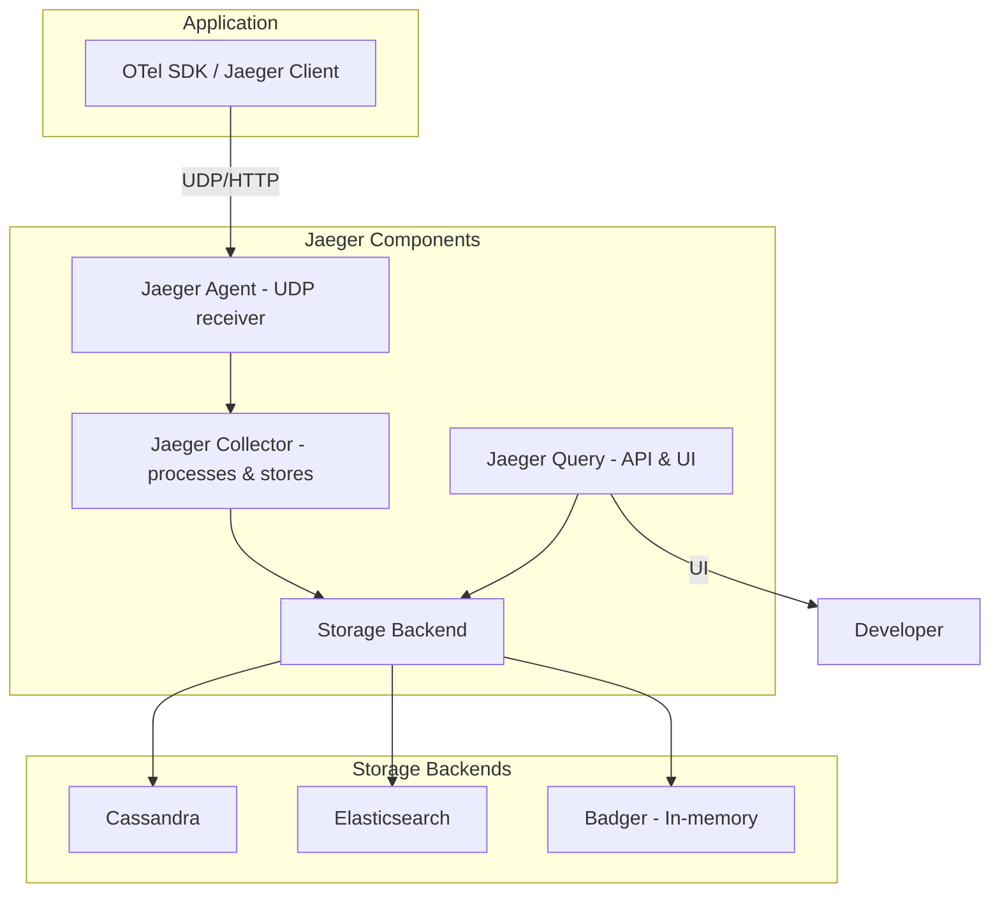

### Jaeger UI Features

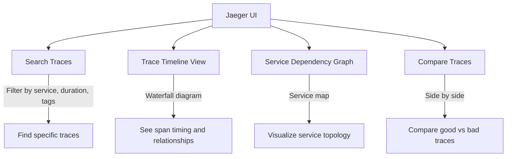

## Trace Analysis

### Reading a Trace

```mermaid
gantt
    title Trace: Order Request (abc123)
    dateFormat X
    axisFormat %Lms

    section API Gateway
    HTTP POST /orders       :a1, 0, 250

    section Order Service
    Create Order            :a2, 20, 200

    section Payment Service
    Process Payment         :a3, 30, 150

    section Database
    INSERT transaction      :a4, 40, 50

    section Inventory
    Check stock             :a5, 30, 30
```

**What to look for in traces:**
1. **Long spans**: Which operation takes the most time?
2. **Sequential operations**: Can they be parallelized?
3. **Error spans**: Where did errors occur?
4. **Retry spans**: Are there unnecessary retries?
5. **Missing spans**: Are there gaps in the trace?

### Common Patterns

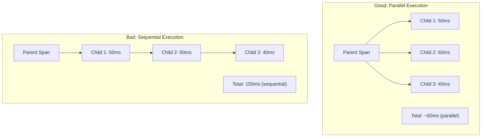

## Sampling Strategies

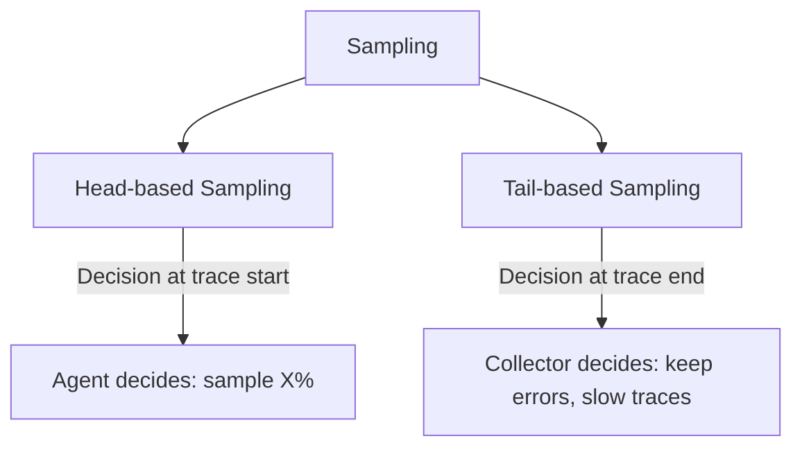

| Strategy | Decision Point | Pros | Cons |
|----------|---------------|------|------|
| **Head-based** | At trace creation (agent) | Simple, low overhead | May miss interesting traces |
| **Tail-based** | At trace completion (collector) | Keeps errors and slow traces | Higher memory, more complex |
| **Adaptive** | Dynamic rate based on load | Balances cost and coverage | Complex to configure |
| **Always-on** | 100% sampling | Complete visibility | Expensive at scale |

**Tail-based sampling is preferred** for production—it keeps all error traces and slow traces while sampling normal ones.

## Interview Questions

### Q1: What is distributed tracing and why is it needed?
**Answer**: Distributed tracing tracks requests as they flow through multiple microservices. Each request gets a unique trace ID, and each service operation creates a span with timing information. It's needed because in microservices, a single request may touch 5-20 services—without tracing, debugging latency issues or errors requires correlating logs across multiple services manually. Tracing provides a visual timeline showing exactly where time was spent, which services were involved, and where errors occurred.

### Q2: Explain trace, span, and context propagation.
**Answer**: A trace is the complete journey of a request (identified by trace_id). A span is a single operation within that trace (has span_id, parent_span_id, start time, duration, attributes). Context propagation passes trace context between services—typically via HTTP headers (`traceparent` in W3C format). When Service A calls Service B, it includes the trace context in headers; Service B creates a child span linked to the parent. This creates a tree of spans showing the full request path.

### Q3: What is OpenTelemetry and how does it relate to tracing?
**Answer**: OpenTelemetry (OTel) is a CNCF standard providing vendor-neutral APIs and SDKs for traces, metrics, and logs. It replaces proprietary instrumentation (Jaeger client, Zipkin client) with a single standard. Components: (1) API—defines how to create spans/metrics, (2) SDK—implements the API, (3) Collector—receives, processes, and exports telemetry data. Benefits: instrument once, export to any backend (Jaeger, Zipkin, Datadog), auto-instrumentation for popular frameworks, unified observability.

### Q4: What is the difference between head-based and tail-based sampling?
**Answer**: Head-based sampling decides whether to sample at trace creation (first span). The agent samples X% of traces randomly. Simple but may miss error traces. Tail-based sampling decides at trace completion—the collector keeps all error and slow traces while sampling normal ones. More intelligent but requires the collector to buffer complete traces. Recommendation: tail-based sampling for production—it ensures you never lose error traces while controlling costs.

### Q5: How do you propagate trace context across message queues?
**Answer**: For HTTP, trace context goes in headers (`traceparent`). For message queues (Kafka, RabbitMQ, SQS): (1) Producer extracts trace context from active span, (2) Serializes it into message headers/attributes (Kafka headers, SQS MessageAttributes), (3) Consumer extracts trace context from message headers, (4) Creates a child span linked to the producer's span. OpenTelemetry provides instrumentations for popular message queue clients that handle this automatically.

## Common Mistakes

1. **No auto-instrumentation**: Manually instrumenting every function is error-prone and tedious
2. **Sampling too aggressively**: Missing important error traces with 1% sampling
3. **No context propagation**: Forgetting to propagate headers in HTTP clients or message queues
4. **High-cardinality attributes**: Using user_id or request_id as span attributes overwhelms storage
5. **No correlation with logs**: Traces and logs in separate systems with no trace_id in logs
6. **Tracing everything**: Internal utility functions don't need spans—trace service boundaries
7. **Ignoring trace overhead**: 100% sampling with no batching adds significant latency

## Summary

| Concept | Key Takeaway |
|---------|-------------|
| **Trace** | Complete request journey across services |
| **Span** | Single operation within a trace |
| **Context Propagation** | Passing trace info via HTTP headers |
| **OpenTelemetry** | Vendor-neutral standard for traces, metrics, logs |
| **Jaeger** | Open-source distributed tracing backend |
| **Sampling** | Head-based (simple) vs Tail-based (intelligent) |

## Cross-References

- **Observability Overview**: [README](./README.md) — Three pillars
- **Logging**: [Correlation IDs](./logging.md) — Link logs to traces via trace_id
- **Monitoring**: [Prometheus](./monitoring.md) — Metrics alongside traces
- **Kubernetes Ingress**: [Controllers](../kubernetes/ingress.md) — Trace propagation through Ingress
- **Microservices**: Service boundaries where tracing is most valuable
- **CI/CD**: [Pipelines](../cicd/pipelines.md) — Tracing in deployment pipelines
