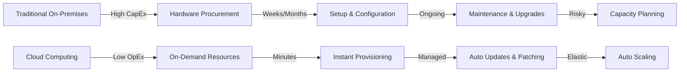
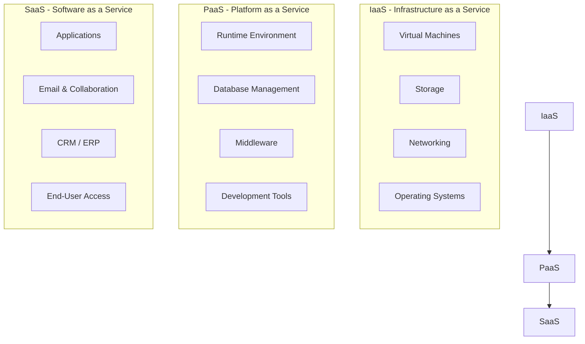
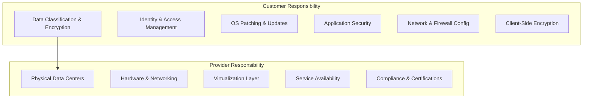
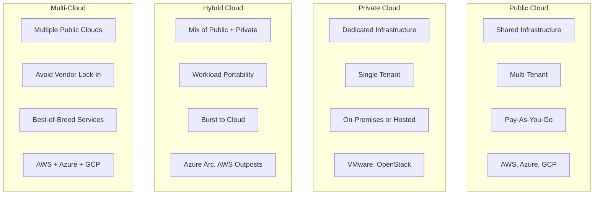
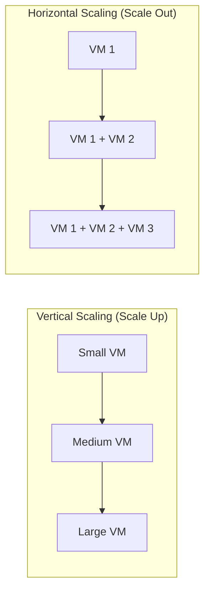
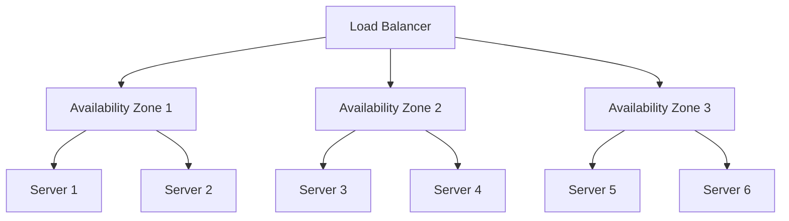
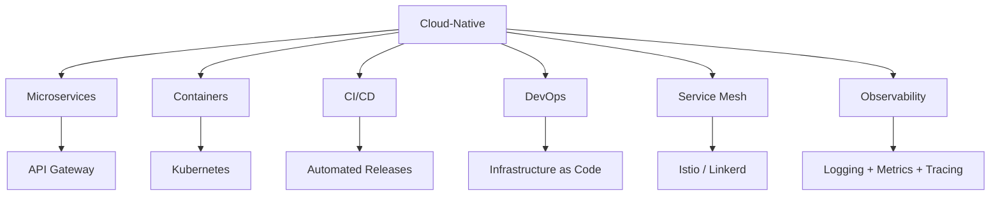

# Cloud Computing Overview

## Introduction

Cloud computing is the delivery of computing resources—servers, storage, databases, networking, software, analytics, and intelligence—over the internet ("the cloud") on a pay-as-you-go basis. Instead of owning and maintaining physical data centers, organizations can rent access to anything from applications to storage from a cloud service provider.

## Why Cloud Computing?

**Key Benefits:**
- **Cost Efficiency**: No upfront hardware investment; pay only for what you use
- **Speed & Agility**: Provision resources in minutes, not months
- **Global Scale**: Deploy worldwide with a few clicks
- **Reliability**: Data backup, disaster recovery, and business continuity built-in
- **Security**: Broad set of policies, technologies, and controls

## Service Models

The three fundamental cloud service models define the level of control and responsibility:

### IaaS (Infrastructure as a Service)

Provides virtualized computing resources over the internet. You manage OS, middleware, applications, and data.

| Aspect | Details |
|--------|---------|
| **You Manage** | OS, runtime, middleware, applications, data |
| **Provider Manages** | Virtualization, servers, storage, networking |
| **Examples** | AWS EC2, Azure VMs, Google Compute Engine |
| **Use Cases** | Web hosting, HPC, dev/test environments |

**Analogy**: Renting an empty apartment—you furnish and maintain it yourself.

### PaaS (Platform as a Service)

Provides a platform allowing customers to develop, run, and manage applications without dealing with infrastructure.

| Aspect | Details |
|--------|---------|
| **You Manage** | Applications and data |
| **Provider Manages** | OS, runtime, middleware, servers, storage, networking |
| **Examples** | AWS Elastic Beanstalk, Azure App Service, Google App Engine |
| **Use Cases** | API development, web applications, microservices |

**Analogy**: Renting a furnished apartment—you just move in and live.

### SaaS (Software as a Service)

Delivers software applications over the internet, on a subscription basis.

| Aspect | Details |
|--------|---------|
| **You Manage** | User configuration, data input |
| **Provider Manages** | Everything (infrastructure, platform, application) |
| **Examples** | Gmail, Salesforce, Slack, Zoom, Microsoft 365 |
| **Use Cases** | Email, CRM, collaboration, project management |

**Analogy**: Staying in a hotel—everything is managed for you.

### Shared Responsibility Model

> **Key Insight**: The responsibility shifts depending on the service model. With IaaS, you handle more; with SaaS, the provider handles almost everything.

## Deployment Models

### Public Cloud
- Resources owned and operated by third-party providers
- Shared among multiple organizations (multi-tenant)
- **Pros**: No capital expenditure, infinite scalability, no maintenance
- **Cons**: Less control, potential compliance concerns, variable costs

### Private Cloud
- Cloud infrastructure dedicated to a single organization
- Can be on-premises or hosted by a third party
- **Pros**: Greater control, customizable, enhanced security
- **Cons**: Higher cost, requires in-house expertise, limited scalability

### Hybrid Cloud
- Combines public and private clouds, bound together by technology
- Data and applications can move between the two
- **Pros**: Flexibility, optimization of existing infrastructure, compliance
- **Cons**: Complex management, networking challenges, integration overhead

### Multi-Cloud
- Uses services from multiple cloud providers
- Avoids vendor lock-in, leverages best services from each provider
- **Pros**: No single vendor dependency, optimized cost/performance
- **Cons**: Increased complexity, skills requirements, integration challenges

## Essential Cloud Concepts

### Elasticity vs Scalability

| Concept | Definition | Example |
|---------|-----------|---------|
| **Elasticity** | Automatic scaling up/down based on demand | Auto Scaling Groups adding instances during traffic spikes |
| **Scalability** | Ability to handle increased load by adding resources | Upgrading from t3.medium to t3.xlarge (vertical) or adding more instances (horizontal) |

### Vertical vs Horizontal Scaling

| Aspect | Vertical | Horizontal |
|--------|----------|------------|
| **Method** | Increase power of existing machine | Add more machines |
| **Limit** | Hardware maximum | Practically unlimited |
| **Downtime** | Often requires restart | No downtime |
| **Complexity** | Simple | Requires load balancing, distributed state |
| **Cost** | Diminishing returns | Linear cost scaling |

### High Availability (HA)

Design principle ensuring a system remains operational for a long period:

- **Availability Zones (AZs)**: Isolated data center locations within a region
- **Regions**: Geographic areas containing multiple AZs
- **Target**: 99.99% (52.6 min downtime/year) or 99.999% (5.26 min/year)

### Fault Tolerance vs High Availability

| Aspect | High Availability | Fault Tolerance |
|--------|------------------|-----------------|
| **Goal** | Minimize downtime | Zero downtime |
| **Approach** | Failover to backup | Redundant systems running simultaneously |
| **Recovery Time** | Seconds to minutes | Instantaneous (no recovery needed) |
| **Cost** | Moderate | High |
| **Example** | RDS Multi-AZ | Active-active database clusters |

## Cloud-Native Architecture Principles

1. **Microservices**: Decompose applications into small, independent services
2. **Containers**: Package applications with dependencies for consistency
3. **CI/CD**: Automate building, testing, and deployment
4. **Infrastructure as Code (IaC)**: Define infrastructure declaratively (Terraform, CloudFormation)
5. **Service Mesh**: Handle service-to-service communication (Istio, Linkerd)
6. **Observability**: Logging, monitoring, and distributed tracing

## Interview Questions

### Q1: Explain the difference between IaaS, PaaS, and SaaS with real-world examples.
**Answer**: IaaS provides raw infrastructure (EC2, VMs)—you manage OS and above. PaaS provides a runtime platform (Elastic Beanstalk, Heroku)—you only manage code and data. SaaS provides complete applications (Gmail, Salesforce)—the provider manages everything. The key difference is the level of abstraction and management responsibility.

### Q2: What is the Shared Responsibility Model?
**Answer**: It defines security responsibilities between cloud provider and customer. The provider secures the cloud infrastructure (physical, network, hypervisor). The customer secures what's in the cloud (data, IAM, OS patching, app security). The boundary shifts based on service model—IaaS has more customer responsibility than SaaS.

### Q3: When would you choose a hybrid cloud over a public cloud?
**Answer**: Hybrid is ideal when: (1) Regulatory requirements mandate certain data stays on-premises, (2) You have legacy applications that can't migrate, (3) You need to burst to cloud during peak demand while keeping baseline on-premises, (4) Low-latency requirements for local processing. Trade-off: increased complexity in networking, identity, and management.

### Q4: What's the difference between scalability and elasticity?
**Answer**: Scalability is the ability to handle increased load by adding resources (planned capacity increase). Elasticity is the automatic, dynamic scaling based on real-time demand (scaling up during peaks, down during troughs). Scalability is about growth; elasticity is about responsiveness. A system can be scalable but not elastic if scaling requires manual intervention.

### Q5: How do you decide between vertical and horizontal scaling?
**Answer**: Vertical scaling is simpler (upgrade instance size), has no distributed system complexity, but has hard hardware limits and requires downtime. Horizontal scaling adds instances, offers near-unlimited scaling, and provides fault tolerance, but requires load balancing, distributed state management, and potentially application refactoring. Generally: start vertical, go horizontal when you hit limits or need HA.

## Common Mistakes

1. **Confusing cloud deployment models**: Thinking "cloud" always means "public cloud"—private and hybrid clouds exist
2. **Ignoring the Shared Responsibility Model**: Assuming the cloud provider handles all security
3. **Over-provisioning**: Allocating resources for peak load 24/7 instead of using auto-scaling
4. **Vendor lock-in**: Using proprietary services without considering portability
5. **Neglecting data transfer costs**: Focusing only on compute/storage costs while data egress fees accumulate
6. **Treating cloud as "just someone else's data center"**: Not leveraging cloud-native patterns (serverless, managed services, auto-scaling)

## Summary

| Concept | Key Takeaway |
|---------|-------------|
| **IaaS** | Maximum control, you manage OS and above |
| **PaaS** | Focus on code, platform is managed |
| **SaaS** | Ready-to-use applications |
| **Public Cloud** | Shared, scalable, pay-as-you-go |
| **Private Cloud** | Dedicated, controlled, customizable |
| **Hybrid Cloud** | Best of both worlds, complex management |
| **Elasticity** | Automatic scaling with demand |
| **Scalability** | Ability to handle growth |

## Cross-References

- **Virtualization**: [Hypervisors](./virtualization/hypervisors.md) — Foundation of cloud infrastructure
- **AWS**: [EC2](./aws/ec2.md) — IaaS in practice
- **Kubernetes**: [Overview](./kubernetes/README.md) — Container orchestration at scale
- **CI/CD**: [Pipelines](./cicd/pipelines.md) — Cloud-native deployment workflows
- **Observability**: [Monitoring](./observability/monitoring.md) — Cloud infrastructure monitoring
