# Cloud Computing Overview

## Introduction

Cloud computing delivers computing resources — servers, storage, databases, networking, software — over the internet on a pay-as-you-go basis. It has fundamentally changed how applications are built, deployed, and scaled. Understanding cloud architecture is essential for modern software engineering interviews, regardless of the specific role.

## Cloud Service Models

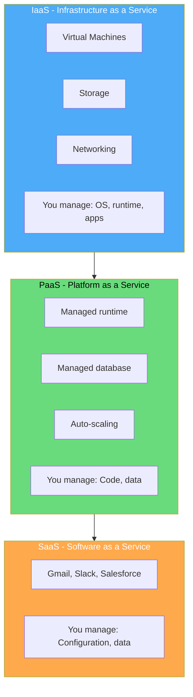

| Model | You Manage | Provider Manages | Examples |
|-------|-----------|-----------------|----------|
| IaaS | OS, middleware, apps | Hardware, virtualization | EC2, GCE, Azure VMs |
| PaaS | Code, data | Runtime, OS, hardware | Elastic Beanstalk, App Engine, Heroku |
| SaaS | Configuration | Everything | Gmail, Salesforce, Slack |

## Deployment Models

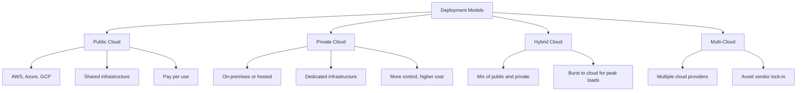

## Core Cloud Concepts

### Regions and Availability Zones

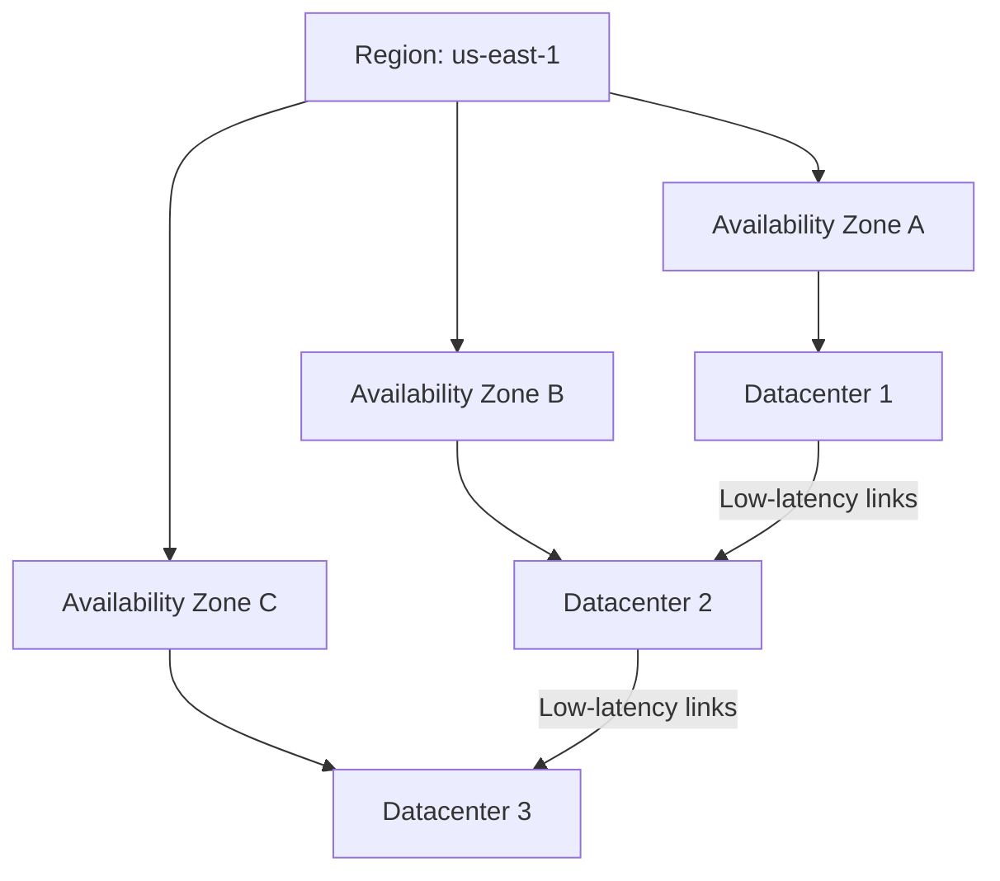

- **Region**: Geographic area (e.g., us-east-1, eu-west-1). Contains multiple AZs.
- **Availability Zone (AZ)**: Isolated datacenter within a region. Independent power, cooling, networking.
- **Edge Location**: CDN endpoint for low-latency content delivery.

### Elasticity and Scalability

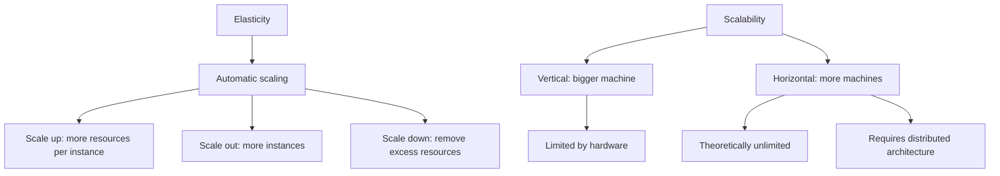

### Shared Responsibility Model

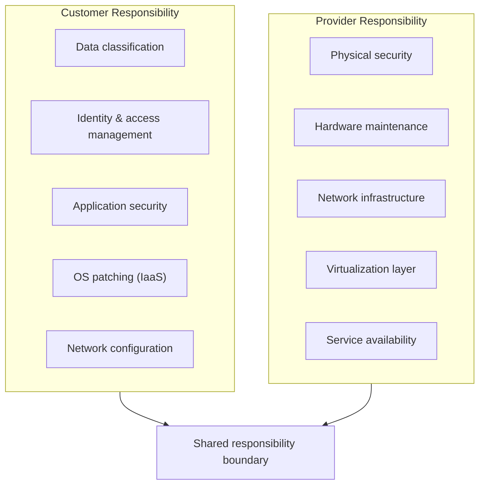

## Major Cloud Providers

### AWS (Amazon Web Services)

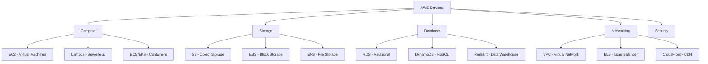

### Azure

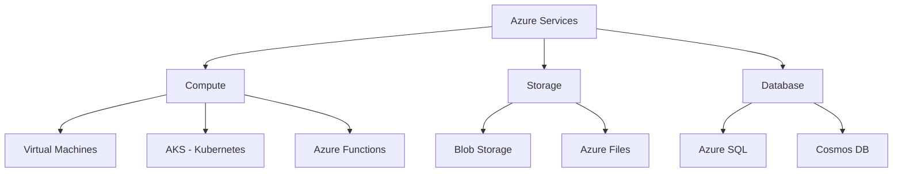

### GCP (Google Cloud Platform)

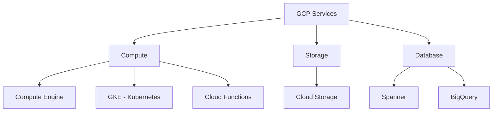

## Cloud Architecture Patterns

### Microservices on Cloud

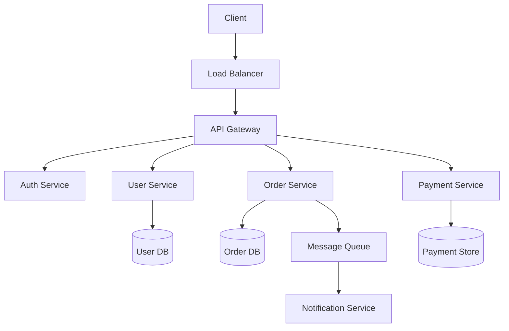

### Multi-Tier Architecture

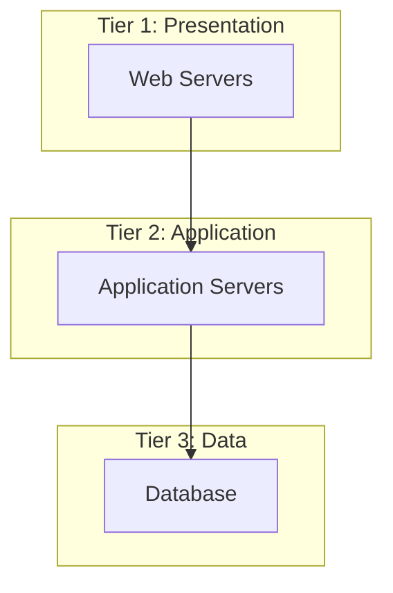

## Well-Architected Framework

AWS Well-Architected Framework pillars:

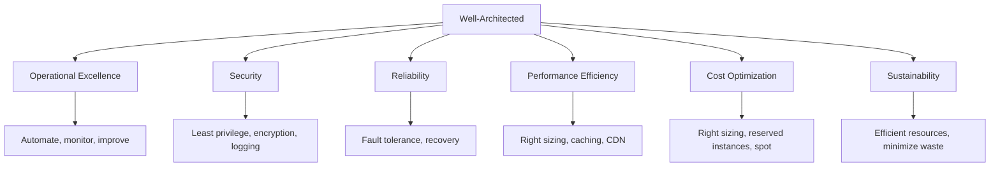

## Interview Questions

1. **Q: Explain the difference between IaaS, PaaS, and SaaS.**
   A: IaaS provides raw infrastructure (VMs, storage, networking) — you manage the OS and above. PaaS provides a managed platform (runtime, scaling) — you just deploy code. SaaS provides complete software — you just configure and use it. Each trades control for convenience.

2. **Q: What is the shared responsibility model?**
   A: Cloud security is shared between provider and customer. The provider secures the infrastructure (physical, network, hypervisor). The customer secures what they put in the cloud (data, access control, OS patches for IaaS, application code). The boundary shifts based on service model.

3. **Q: What is the difference between vertical and horizontal scaling?**
   A: Vertical scaling (scale up) adds more resources to a single machine (CPU, RAM). Limited by hardware. Horizontal scaling (scale out) adds more machines. Requires distributed architecture but is theoretically unlimited. Cloud makes horizontal scaling easy with auto-scaling groups.

4. **Q: What is an Availability Zone vs a Region?**
   A: A region is a geographic area (e.g., us-east-1) containing multiple isolated datacenters. An Availability Zone is a single datacenter or group of datacenters within a region, with independent power, cooling, and networking. Deploying across AZs provides fault tolerance within a region.

5. **Q: How would you design a highly available application on AWS?**
   A: Deploy across multiple AZs. Use an Application Load Balancer to distribute traffic. Use Auto Scaling Groups for EC2 instances. Use RDS Multi-AZ for database failover. Use S3 for static assets (11 nines durability). Use CloudFront CDN for global reach.

## Common Mistakes

- Single point of failure — not deploying across multiple AZs.
- Not using managed services — reinventing the wheel for databases, queues, etc.
- Ignoring cost — cloud costs can spiral without monitoring and right-sizing.
- Over-engineering — don't use Kubernetes for a simple web app.
- Not planning for failure — design for failure, it will happen.

## Summary

Cloud computing provides on-demand resources with pay-as-you-go pricing. The three service models (IaaS, PaaS, SaaS) trade control for convenience. Core concepts include regions/AZs, elasticity, and the shared responsibility model. For interviews, understand the service models, scaling strategies, and how to design for high availability and fault tolerance.

## Cross-References

- [Virtualization](./virtualization/README.md) — The foundation of cloud
- [AWS Services](./aws/README.md) — Deep dive into AWS
- [Kubernetes](./kubernetes/README.md) — Container orchestration
- [CI/CD](./cicd/README.md) — Deployment pipelines
- [Observability](./observability/README.md) — Monitoring and logging
- [Storage Overview](../storage/overview.md)
- [Networking Overview](../networks/README.md)
- [MLOps Infrastructure](../ml/mlops/infrastructure.md)
- [Interview System Design](../interview/system-design/README.md)
