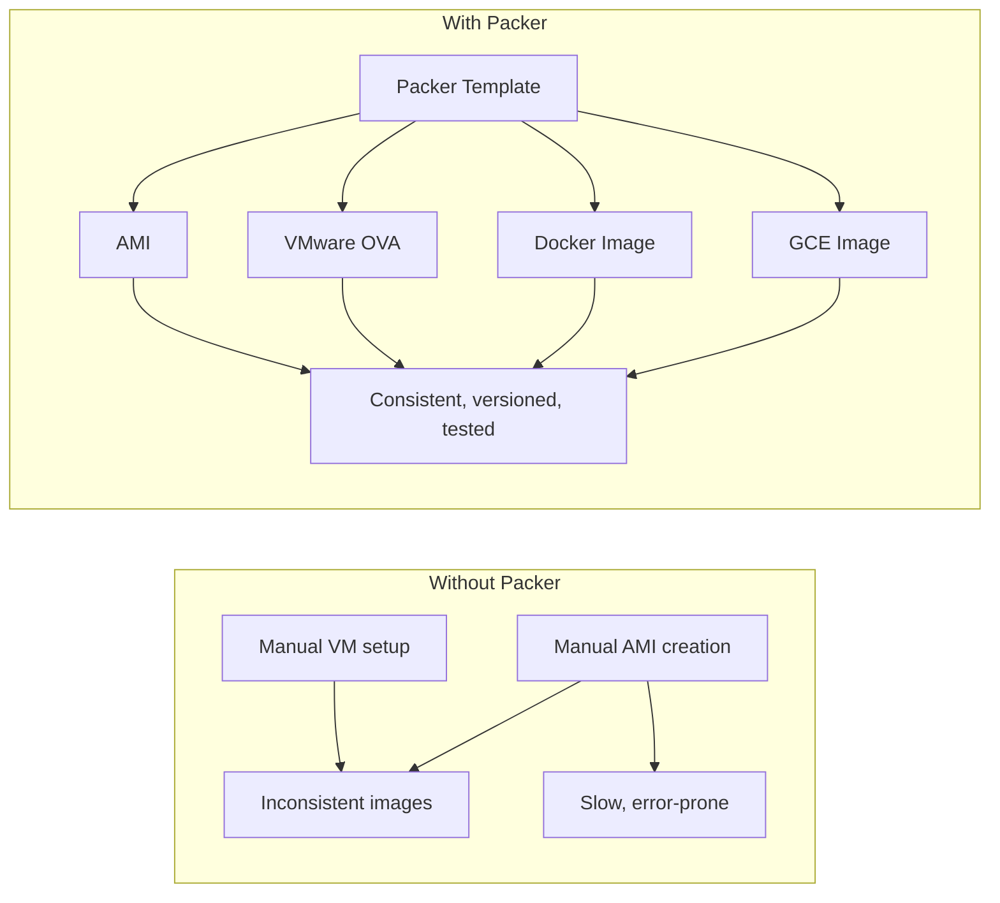
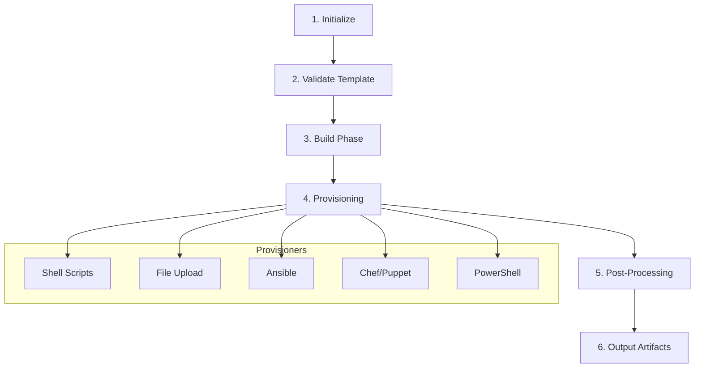

# HashiCorp Packer (Machine Image Builder)

## Overview

Packer is an open-source tool by HashiCorp for creating identical machine images for multiple platforms from a single source configuration. It automates the process of building AMIs (AWS), VMs (VMware, VirtualBox), containers, and more — ensuring that your infrastructure artifacts are consistent, versioned, and reproducible.

## Why Packer?



| Manual Process | Packer Process |
|----------------|----------------|
| Launch instance, install packages, create AMI | Define once, build repeatedly |
| No versioning | Every build is a versioned artifact |
| Drift over time | Immutable, reproducible images |
| One platform at a time | Multi-platform from single source |
| No testing baked in | Provisioners validate during build |

## Core Concepts

### Packer Template (HCL2)

```hcl
# packer.pkr.hcl

packer {
  required_plugins {
    amazon = {
      version = ">= 1.2.0"
      source  = "github.com/hashicorp/amazon"
    }
  }
}

source "amazon-ebs" "webserver" {
  region        = "us-east-1"
  source_ami    = "ami-0c55b159cbfafe1f0"  # Ubuntu 22.04
  instance_type = "t3.micro"
  ssh_username  = "ubuntu"

  ami_name      = "webserver-{{timestamp}}"
  ami_regions   = ["us-east-1", "us-west-2"]
  tags = {
    Environment = "production"
    BuiltBy     = "packer"
  }
}

build {
  sources = ["source.amazon-ebs.webserver"]

  provisioner "shell" {
    inline = [
      "sudo apt-get update -qq",
      "sudo apt-get install -y nginx python3-pip",
      "sudo systemctl enable nginx",
      "sudo pip3 install -r /app/requirements.txt",
    ]
  }

  provisioner "file" {
    source      = "app/"
    destination = "/app/"
  }

  provisioner "shell" {
    inline = ["sudo nginx -t"]
  }
}
```

### Build Stages



| Stage | Description |
|-------|-------------|
| **Initialize** | Download required plugins |
| **Validate** | Syntax and semantic checks |
| **Build** | Launch source instance, attach provisioners |
| **Provisioning** | Run scripts, upload files, configure |
| **Post-Processing** | Create image, clean up temporary resources |
| **Output** | Return artifact IDs (AMI ID, etc.) |

## Provisioners

### Shell Provisioner

```hcl
provisioner "shell" {
  # Remote script execution
  script           = "scripts/setup.sh"
  execute_command  = "sudo -S -E sh -c '{{ .Vars }} {{ .Path }}'"
  environment_vars = ["DEBIAN_FRONTEND=noninteractive"]
}
```

### File Provisioner

```hcl
provisioner "file" {
  source      = "config/"
  destination = "/etc/myapp/"
  direction   = "upload"  # or "download"
}
```

### Ansible Provisioner

```hcl
provisioner "ansible" {
  playbook_file = "playbooks/base.yml"
  extra_arguments = ["--vault-password-file", ".vault_pass"]
  galaxy_file      = "requirements.yml"
  galaxy_force_install = true
}
```

| Provisioner | When to Use |
|-------------|-------------|
| **shell** | Simple commands, quick setup |
| **file** | Copy config files, binaries |
| **ansible** | Complex orchestration, idempotent plays |
| **chef/puppet** | Existing configuration management |
| **powershell** | Windows images |
| **salt-masterless** | SaltStack without master |
| **shell-local** | Run commands on the host (not the VM) |

## Builders

Packer supports 40+ builders across cloud and virtualization platforms:

| Platform | Builder | Output |
|----------|---------|--------|
| AWS | `amazon-ebs`, `amazon-instance` | AMI |
| GCP | `googlecompute` | GCE Image |
| Azure | `azure-arm` | VHD Image |
| VMware | `vmware-iso`, `vmware-vmx` | VMDK/OVA |
| VirtualBox | `virtualbox-iso`, `virtualbox-vmx` | VDI |
| Docker | `docker` | Docker Image |
| OpenStack | `openstack` | Glance Image |

## Variables and User Variables

```hcl
variable "region" {
  type    = string
  default = "us-east-1"
}

variable "instance_type" {
  type    = string
  default = "t3.micro"
}

source "amazon-ebs" "example" {
  region        = var.region
  instance_type = var.instance_type
  # ...
}
```

Override at build time:

```bash
packer build -var 'region=us-west-2' -var 'instance_type=t3.large' .
```

Sensitive variables from files:

```bash
packer build -var-file="production.pkrvars.hcl" .
```

## Multi-Platform Builds

```hcl
build {
  sources = [
    "source.amazon-ebs.webserver-aws",
    "source.googlecompute.webserver-gcp",
  ]

  provisioner "shell" {
    inline = ["echo 'Cross-platform provisioning'"]
  }
}

# Each source gets the same provisioners applied
```

## Communication

Packer uses SSH (Linux) or WinRM (Windows) to communicate with the build instance:

| Setting | Linux | Windows |
|---------|-------|---------|
| **Protocol** | SSH | WinRM |
| **Default port** | 22 | 5985/5986 |
| **Auth** | Key pair or password | Password or certificate |
| **Config** | `ssh_username`, `ssh_private_key_file` | `winrm_username`, `winrm_password` |

## Integration with CI/CD

```yaml
# GitHub Actions example
name: Build AMI
on:
  push:
    paths: ['packer/**']
jobs:
  build:
    runs-on: ubuntu-latest
    steps:
      - uses: actions/checkout@v4
      - uses: hashicorp/setup-packer@v3
      - run: packer init packer.pkr.hcl
      - run: packer validate packer.pkr.hcl
      - run: packer build packer.pkr.hcl
        env:
          AWS_ACCESS_KEY_ID: ${{ secrets.AWS_KEY }}
          AWS_SECRET_ACCESS_KEY: ${{ secrets.AWS_SECRET }}
```

## Best Practices

| Practice | Why |
|----------|-----|
| **Minimal base AMI** | Start from official, minimal images for security and speed |
| **Immutable images** | Never SSH into production — bake everything into the image |
| **Version tags** | Tag with build number, commit SHA, and timestamp |
| **Validate images** | Run integration tests as a post-processor or separate step |
| **Cleanup old AMIs** | Use lifecycle policies to avoid AMI sprawl |
| **Separate build and runtime credentials** | Packer needs broader permissions; runtime needs less |
| **Use provisioners idempotently** | Ensure provisioners can run multiple times safely |

## Comparison: Packer vs Alternatives

| Feature | Packer | Docker Build | Cloud-init | Terraform |
|---------|--------|-------------|-----------|----------|
| **Output** | Machine images | Container images | Configured instances | Infrastructure |
| **Multi-platform** | Yes | Docker only | Per-cloud | Multi-cloud |
| **Provisioning** | Rich provisioners | Dockerfile only | Cloud-config | No |
| **Speed** | Minutes | Seconds | Minutes | Minutes |
| **Use case** | VM/AMI builds | Container builds | Instance boot config | Infrastructure provisioning |
| **Testing** | During build | During build | At boot | After apply |

## Interview Questions

1. **How does Packer fit into an immutable infrastructure workflow?** Packer bakes configuration into machine images at build time. Terraform deploys those images. No runtime configuration drift because everything is baked in.

2. **What's the difference between Packer and Terraform?** Packer builds images (artifacts). Terraform provisions infrastructure using those images. Packer is a build tool; Terraform is an orchestration tool.

3. **How would you handle secrets in Packer builds?** Use environment variables, vault integration, or `-var-file` with restricted access. Never hardcode secrets in templates.

4. **When should you use Packer vs Docker?** Packer for VM-based workloads (EC2, VMs). Docker for containerized workloads. Some teams use both: Docker for app containers, Packer for the base AMI that runs containers.

5. **How do you test a Packer-built image?** Use the `shell` provisioner to run validation scripts, or use a post-processor like `artifice` to export results. Alternatively, deploy the AMI and run an integration test suite against it.

## Key Takeaways

- Packer creates identical, versioned machine images from a single template
- Supports 40+ platforms: AWS, GCP, Azure, VMware, VirtualBox, Docker
- Provisioners (shell, Ansible, Chef, file upload) configure images during build
- HCL2 templates enable variables, loops, conditionals for DRY configurations
- Integrate with CI/CD pipelines for automated, tested image builds
- Packer builds images; Terraform deploys them — complementary tools
- Always bake configuration, never configure at runtime (immutable infrastructure)

## Cross-References

- [Terraform / GitOps](./cicd/gitops.md) — Deploy Packer-built images
- [CI/CD Pipelines](./cicd/pipelines.md) — Integrate Packer in build pipelines
- [Docker Internals](../linux/containers/docker-internals.md) — Container vs VM images
