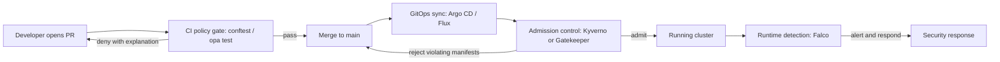
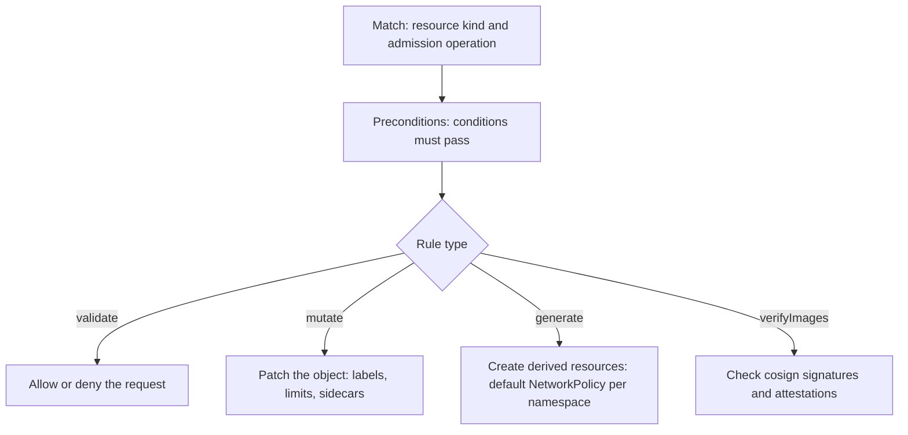

# Policy as Code: OPA, Kyverno & Falco

## Overview

As platform teams grow from a few services to hundreds, "we review it in the PR" stops being a governance strategy: reviewers miss wildcard IAM roles, 20 YAML files merge a week, and every exception becomes permanent. **Policy as code** is the discipline of expressing guardrails as versioned, testable, automatically enforced rules, applied at three enforcement points: in CI before merge (shift-left), at admission before a workload runs, and at runtime while it runs. Three CNCF projects dominate the Kubernetes landscape: **Open Policy Agent (OPA)** with its Rego language, **Kyverno** with its Kubernetes-native YAML policies, and **Falco** for runtime threat detection. This page covers each tool's evaluation model, a comparison framework, how the pieces form a pipeline, and the questions interviews actually ask — including "write me a policy" on a whiteboard.

## The Problem: Guardrails at Scale

The failure mode policy-as-code addresses is specific: humans are asked to be a consistency enforcement engine across hundreds of pull requests per week. That fails predictably — review fatigue, tribal knowledge ("oh, we never expose LoadBalancers in prod"), and no audit trail of *why* something was allowed. Codifying policy gives you four properties manual review cannot: consistency (same rule, every time), provenance (Git history for the rules), testability (unit tests for the policies themselves), and explainability (rejections come with the rule text that caused them).

The enforcement spectrum is the key mental model:



Shift-left is the trend interviewers want you to articulate: the earlier a violation is caught, the cheaper it is to fix — a CI failure costs minutes, an admission rejection costs a deploy cycle, a runtime incident costs an incident review. But no single point is sufficient: CI can be bypassed by `kubectl apply` from a laptop, admission only sees what crosses the API server, and runtime is the only place you can see actual behavior (a container that passed all checks but starts reverse shells).

## OPA: Rego, Datalog Heritage, and the Decoupled Engine

OPA (<https://www.openpolicyagent.org/>) is a CNCF-graduated general-purpose policy engine. Its founding insight: policy decisions are just **pure functions of data**, so evaluate them in a dedicated engine fed JSON input, and let every system (Kubernetes admission, CI pipelines, API gateways, microservice authz) ask the same question — "is this allowed?"

### Rego and its Datalog roots

Rego descends from **Datalog**, a logic-programming language: you declare *what must be true*, not how to compute it. Rules define virtual documents that are derived from input and other rules; there are no side effects, which makes policies trivially cacheable and testable. The idioms you must be able to write on a whiteboard:

```rego
package k8s.pods

default allow := false

deny[msg] {
  input.request.kind.kind == "Pod"
  c := input.request.object.spec.containers[_]
  c.image
  endswith(c.image, ":latest")
  msg := sprintf("container %v uses :latest tag", [c.name])
}

allow {
  count(deny) == 0
}
```

Three Rego concepts explain 90% of interview questions: **partial rules** (`deny[msg]` produces a *set* of messages, not a boolean — the decision aggregates all violations), **iteration by variable binding** (`c := ...[_]` binds over every element, like a forall), and **negation as failure** (a rule body must be satisfiable to be true). The evaluation model is equally simple: POST JSON input to `/v1/data/<package>/<rule>` and get back a decision — no callbacks, no side channels, which is why OPA embeds everywhere.

### Distribution and integration modes

- **Kubernetes admission**: OPA runs as a validating webhook (usually via **Gatekeeper**, the CNCF project layering CRD-based constraints and mutation on top of OPA). The API server serializes the request as `input`; the policy returns allow/deny.
- **Bundles**: policies plus data are packaged into signed tarballs and pulled periodically from a bundle service (an HTTP file server is enough), giving you a versioned, cacheable distribution channel — this is how decoupled deployments stay in sync.
- **Decoupled policy service**: sidecars or central OPA services fronted by API gateways (e.g., Envoy's external authorization filter) make OPA the authz brain for data-plane traffic, not just k8s.
- **CI via conftest**: the `conftest` CLI runs the same Rego policies against Terraform plans, Helm-rendered manifests, or Dockerfiles — the shift-left twin of your admission policies.

In the Kubernetes-native deployment, the **Gatekeeper** layer wraps these mechanics into two CRDs: a `ConstraintTemplate` embeds the Rego source, and a `Constraint` instantiates it with parameters — so one template like `K8sAllowedRepos` can be parameterized per namespace or cluster.

```yaml
apiVersion: templates.gatekeeper.sh/v1
kind: ConstraintTemplate
metadata:
  name: k8sallowedrepos
spec:
  crd:
    spec:
      names:
        kind: K8sAllowedRepos
      validation:
        openAPIV3Schema:
          properties:
            repos:
              type: array
              items: { type: string }
  targets:
    - target: admission.k8s.gatekeeper.sh
      rego: |
        package k8sallowedrepos
        violation[{"msg": msg}] {
          c := input.review.object.spec.containers[_]
          not startswith(c.image, input.parameters.repos[_])
          msg := sprintf("image %v not from allowed repo", [c.image])
        }
```

The template/constraint split matters architecturally: policy *logic* is reviewed by the platform team, policy *parameters* are owned per-team — a separation of duties you should be able to articulate.

The operational costs are real and interviewers probe them: Rego's learning curve is famously steep, the engine holds the data it evaluates (memory sizing for big admission requests), and webhook latency becomes part of every pod-create path — a slow OPA is a cluster-wide slowdown.

## Kyverno: Kubernetes-Native Policy Without a New Language

Kyverno (<https://kyverno.io/>) takes the opposite bet: instead of a new language, policies **are Kubernetes resources** whose rules operate directly on admission-review payloads with JMESPath-style conditions. There is no query language to learn — if you know Deployments and JSON, you can read a Kyverno policy. Its four rule types cover the full policy lifecycle:

```yaml
apiVersion: kyverno.io/v1
kind: ClusterPolicy
metadata:
  name: require-requests
spec:
  validationFailureAction: Enforce
  rules:
    - name: validate-resources
      match:
        any:
          - resources:
              kinds: [Pod]
      validate:
        message: "CPU and memory requests are required."
        pattern:
          spec:
            containers:
              - resources:
                  requests:
                    memory: "?*"
                    cpu: "?*"
```

- **validate** — match patterns (structural, like a schema with wildcards) or run arbitrary conditions; deny or report on failure.
- **mutate** — patch objects at admission: inject sidecars, add labels, set `imagePullPolicy`. This is where Kyverno often replaces bespoke mutating webhooks.
- **generate** — create resources in response to events, the classic case being "on namespace creation, create a default NetworkPolicy and ResourceQuota".
- **verifyImages** — verify container image signatures and attestations (cosign, keyless/Sigstore) at admission, anchoring the supply-chain controls discussed below.

Mutation is the rule type that sells Kyverno to platform teams — it replaces bespoke mutating webhooks with declarative patches:

```yaml
    - name: add-pod-labels
      match:
        any:
          - resources:
              kinds: [Pod]
      mutate:
        patchStrategicMerge:
          metadata:
            labels:
              platform.example.com/managed: "true"
```

Because policies are CRs, they diff in Git, deploy via GitOps, and are managed with the same RBAC as everything else. Kyverno also runs **background scans** (re-evaluating policies against existing resources and emitting policy reports) — closing the gap that pure admission webhooks leave for resources created before the policy existed. The trade-off versus OPA: less expressive for non-Kubernetes or deeply conditional logic, but dramatically cheaper for a team whose only target is Kubernetes.

## Falco: Runtime Threat Detection from Syscall Streams

Falco (<https://falco.org/>) answers the question the other two cannot: what is the workload *doing*? It taps system calls — via an eBPF probe or kernel module — enriches each event with container and Kubernetes metadata, and evaluates a rules engine against the stream. A rule that catches a classic pattern:

```yaml
- rule: Terminal shell in container
  desc: A shell was used as the entrypoint or exec'd in a container
  condition: evt.type = execve and evt.dir = < and container and
             proc.name in (shell_binaries)
  output: "Shell spawned in a container (user=%user.name
           container=%container.name shell=%proc.name)"
  priority: WARNING
```

The default ruleset encodes years of threat knowledge (unexpected outbound connections, sensitive-file reads, privilege escalation, crypto-miner processes) and is extended with your own `lists` (reusable arrays) and `macros` (reusable condition fragments). Tuning is the operational half of Falco ownership: you scope rules with `exception` clauses and append-only macro overrides rather than editing the default files (so upgrades stay clean), filter noisy namespaces or health-check processes explicitly, and route output through Falcosidekick to Slack, PagerDuty, or webhooks — with the newer **Talon** add-on automating response actions like killing the offending workload. Priority levels (`WARNING`, `CRITICAL`, ...) map onto your alert-routing tiers; treat every rule you add as an alert-noise commitment with an owner.

The mental positioning for interviews: Falco is not a policy enforcer (it observes and alerts, it does not block syscalls — that is the adjacent seccomp/BPF-LSM territory); it is the detective control completing the prevention stack, and its syscall stream pairs naturally with eBPF security tooling.

## Comparison Table

| Dimension | OPA (Rego/Gatekeeper) | Kyverno | Falco |
|---|---|---|---|
| Eval point | Any: CI, admission, API authz, data plane | Kubernetes admission + background scans | Runtime syscalls (eBPF/module) |
| Language | Rego (Datalog-derived) | YAML CRs, JMESPath conditions | Falco rules (YAML, macros/lists) |
| Mutation | Via Gatekeeper (limited) or explicitly | First-class `mutate` rules | N/A (observe and alert) |
| Scope beyond k8s | Full — any JSON/YAML, Terraform, Envoy | Kubernetes only | Host and container runtime |
| Learning curve | Steep | Low | Moderate |
| Enforcement | Decisions (allow/deny) everywhere | Enforce, mutate, generate | Detect and alert (not block) |
| Best fit | Org-wide policy layer | k8s guardrails for platform teams | Threat detection and response |

Read the table by the **eval point** row first, because that is the axis you cannot retrofit: a tool chosen for the wrong point in the pipeline fails no matter how good its language is. OPA is the generalist — one policy codebase for CI, admission, and API authz — at the price of Rego's learning curve. Kyverno is the Kubernetes specialist that trades generality for low ramp-up and first-class mutation. Falco is not a competitor to either; it covers the runtime axis where they are structurally blind. When an interviewer frames this as "OPA vs Kyverno", the senior answer reframes it as "which eval points are we obligated to cover, and with how many languages?" — then picks the minimum set of tools that covers all three points.

## Policy Pipelines in CI and GitOps

A mature deployment uses all three layers as a funnel, with the *same policy intent* expressed at each. In CI, conftest-style tooling runs Rego (or Kyverno's own CLI) against Terraform plan JSON and Helm-rendered output on every PR — violations fail the build with the policy message attached, which is the shift-left payoff. In GitOps, the merged manifests flow through Argo CD or Flux, and admission policies act as the backstop for anything that bypasses review (hotfixes, break-glass applies, direct dashboard edits).

The "one intent, three layers" pattern is easiest to explain with a single example — no `:latest` image tags:

- **CI layer**: a conftest rule fails the build when the rendered manifest contains `image: ...:latest`, with a link to the policy doc in the failure message.
- **Admission layer**: the same check as a Kyverno `validate` rule or a Gatekeeper constraint, so a manual `kubectl apply` cannot bypass what CI catches.
- **Runtime layer**: a Falco rule is the wrong tool for tags (already resolved), but the right one for the adjacent intent — a workload pulling from a registry it has never talked to, or executing a freshly downloaded binary.

The lesson to state in interviews: express each policy at the earliest layer where the required information exists, and accept that some intents only become checkable at runtime.



Treating the policy repository as software is the operational maturity signal interviewers listen for: policies in their own repo, unit-tested (`opa test` for Rego, Kyverno's CLI tests for YAML), linted, released in stages (audit mode first, then enforce), and observed (policy hit-rate dashboards catch rules that fire 10,000 times a day because someone wrote a bad match). A policy that fails open on engine error is a design decision someone must be able to defend — decide explicitly whether availability or enforcement wins.

## The Supply-Chain Angle

Admission policy is where software-supply-chain controls become *binding*. The standard pattern: CI builds images and signs them with **cosign** (Sigstore keyless signing), optionally attaching SBOM and provenance attestations; Kyverno's `verifyImages` rules then refuse any pod whose image lacks a valid signature from the org's identity, making unsigned artifacts undeployable rather than merely discouraged. This composes with the build-side controls in [sigstore-signing](../supply-chain/sigstore-signing.md) and [sbom-slsa](../supply-chain/sbom-slsa.md) — signing without admission enforcement is advisory; admission without signed builds is unenforceable. The same slot can check attestation predicates (SBOM present, SLSA provenance from the expected builder), tying deployment gates to the provenance chain described in [software-supply-chain](../supply-chain/software-supply-chain.md). Runtime detection then closes the loop for what admission cannot see — a signed image can still contain a runtime compromise.

## Writing Policies Under Interview Pressure

When asked to "write a policy" live, the winning structure is identical in Rego and Kyverno: **package, match, iterate, deny with a message, aggregate to allow**. A namespace allow-list in Rego shows the full pattern — note how the partial `deny[msg]` rule both checks and explains:

```rego
package k8s.namespaces

deny[msg] {
  input.request.kind.kind == "Namespace"
  ns := input.request.object.metadata.name
  not ns in {"platform", "payments", "analytics"}
  msg := sprintf("namespace %v is not on the approved list", [ns])
}
```

Three habits separate strong answers from textbook recitation. First, **explain the decision path out loud**: the API server sends the admission review as input, the rule set aggregates violations, and the webhook denies with the messages attached — the developer sees *why*, not just *no*. Second, **state the test**: `opa test` with an allow fixture and a deny fixture, or a Kyverno CLI test manifest — untested policy is unshippable. Third, **name the rollout mode**: audit first, enforce second, because a typo in a match clause that denies every Deployment is a self-inflicted outage. If you are asked for mutation instead, reach for a label or sidecar injection pattern; for generation, the default-NetworkPolicy-per-namespace classic; for images, `verifyImages` with a cosign identity.

## Operational Realities and Failure Modes

Production policy systems fail in specific, predictable ways, and interviewers use them to distinguish operators from tool tourists. **Latency budgets**: an admission webhook sits on the critical path of every pod create — budget milliseconds, set tight webhook timeouts, and remember that a timed-out webhook defaults to failing open unless configured otherwise. **Fail-open vs fail-closed** is a conscious architectural choice, not a default: availability-first clusters fail open (policy engine down means no enforcement), compliance-first environments fail closed (no admission, no workload) and must then treat the policy engine as tier-0 infrastructure with the same on-call posture as the API server.

The organizational failure modes matter as much as the technical ones. **Policy sprawl** — hundreds of rules nobody owns, half of them in audit mode forever — is cured by a policy catalogue with owners, hit-rate dashboards, and scheduled deletion of rules that fire never or always. **Exception management** is where governance usually dies: teams need a documented break-glass path (a time-boxed annotation, a different namespace class, an emergency role) rather than ad-hoc webhook disables. **Version skew** between policy engines, CRD versions, and Kubernetes releases breaks policies silently, so policy repos need CI against multiple k8s versions the way apps need test matrices. Decision logs (OPA's built-in reporting, Kyverno policy reports) are your audit trail and your regression detector — treat them as a product, not a debug aid.

## Cross-References

- [Admission Webhooks](./kubernetes/admission-webhooks.md) — the webhook mechanics OPA and Kyverno plug into.
- [Kubernetes Security](./kubernetes/security.md) — RBAC, Pod Security, and where policy fits in the defense stack.
- [Authorization](../security/authorization.md) — authz models that Rego-style engines generalize.
- [Sigstore Signing](../supply-chain/sigstore-signing.md) — how images get signed before verifyImages checks them.
- [SBOM & SLSA](../supply-chain/sbom-slsa.md) — the attestations policies can require at admission.
- [Software Supply Chain](../supply-chain/software-supply-chain.md) — the end-to-end provenance picture.
- [GitOps](./cicd/gitops.md) — the delivery path admission policies backstop.
- [Argo CD](./cicd/argocd.md) — the controller most GitOps + Kyverno stacks run on.

## References

- Open Policy Agent — policy engine and Rego docs: <https://www.openpolicyagent.org/>
- Kyverno — Kubernetes-native policy management: <https://kyverno.io/>
- Falco — runtime security and syscall rules engine: <https://falco.org/>
- Related CNCF projects mentioned by name only (no URL cited here): Gatekeeper, conftest, cosign, Falcosidekick, Falco Talon.

## Interview Questions

1. **Write a policy that denies containers using the `:latest` image tag — in Rego and in Kyverno.** Rego: a partial `deny[msg]` rule that matches `input.request.kind.kind == "Pod"`, iterates `spec.containers[_]`, and appends a message when `endswith(image, ":latest")`; then `allow { count(deny) == 0 }`. Kyverno: a `ClusterPolicy` with a `validate` rule matching kind `Pod` and a `pattern` that requires `image` to match something like `"*:1.* | *:v* | *@sha256:*"` — or an inverse `deny` condition on `endswith(image, ":latest")`. The point interviewers check: you know the evaluation model (input JSON, aggregation of violations) rather than exact syntax.
2. **Where should policy live and why?** In a dedicated Git repository, versioned like code, with unit tests and staged rollout (audit then enforce) — not inline in app repos and not hand-edited on clusters. The policy repo is consumed by CI (conftest/opa test on PRs), by the cluster (bundle distribution for OPA, or CRs synced by GitOps for Kyverno), and audited via its history. This gives consistency, provenance, and rollback. The anti-patterns to name: policy logic buried in CI scripts (invisible at admission) and cluster-only policies (undocumented, unreproducible).
3. **OPA vs Kyverno — how do you choose?** Choose by scope and team skills: if the organization wants one policy layer across Kubernetes, CI, Terraform plans, and API authorization, OPA/Rego is the general engine and the learning cost amortizes. If the target is purely Kubernetes guardrails and the platform team is not going to maintain a Rego codebase, Kyverno's YAML CRs give 80% of the value with far less ramp-up, plus first-class mutation and generate. Many orgs run Kyverno for k8s admission and OPA/conftest in CI; that is a defensible answer as long as you acknowledge the duplication cost of two policy languages.
4. **What can Falco catch that admission policies cannot?** Anything visible only in behavior: a compromised container spawning shells, reading secrets from the filesystem, making unexpected outbound connections, or downloading and running a miner — the image may have been perfectly signed and policy-compliant at deploy time. Falco evaluates the syscall stream enriched with container metadata, so it sees actual runtime actions rather than declared intent. It is a detective control, though: it alerts (and with response automation can act) but does not block syscalls, which is why it complements rather than replaces admission enforcement.
5. **Explain OPA's evaluation model and bundle distribution.** OPA is a pure evaluator: you POST JSON input to `/v1/data/<package>/<rule>` and it returns decisions derived from Rego rules and stored data, with no external calls or side effects during evaluation — which makes it embeddable as a library, sidecar, or service. Policies and data ship as bundles (versioned tarballs, optionally signed) pulled periodically from a bundle service, so a fleet of OPAs stays consistent with the policy repo's releases. Decisions can be reported back (decision logs) for audit. This decoupling is why the same policies serve Kubernetes admission, Envoy authz, and CI.
6. **How do you test and roll out policies safely?** Unit-test every rule (`opa test` with positive and negative fixtures; Kyverno CLI test manifests), run new policies in audit/report mode against production traffic to measure hit rate, then flip to enforce once false positives are cleared. Watch for performance (webhook latency budgets — a slow policy engine stalls pod scheduling cluster-wide) and failure mode (fail-open vs fail-closed must be a conscious choice). Rollbacks are Git reverts; decision logs tell you what enforcement actually did. The maturity signal is treating policy releases like service deploys, not config edits.
7. **How does admission policy tie into software supply-chain security?** Admission is where supply-chain guarantees become enforced: Kyverno `verifyImages` (or Gatekeeper policies) can require cosign signatures from your org's Sigstore identity and require attestations (SBOM, SLSA provenance) before any pod runs. Combined with CI-side signing, you get a closed chain — unsigned or re-tagged artifacts simply cannot deploy. Cross-linking matters in interviews: build-time controls (sigstore, SBOM) produce the evidence; admission policy consumes it; Falco detects runtime compromise that slips through. Mention background scans for resources created before the policy existed.
