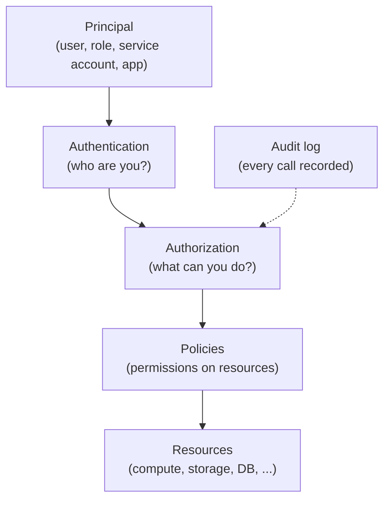
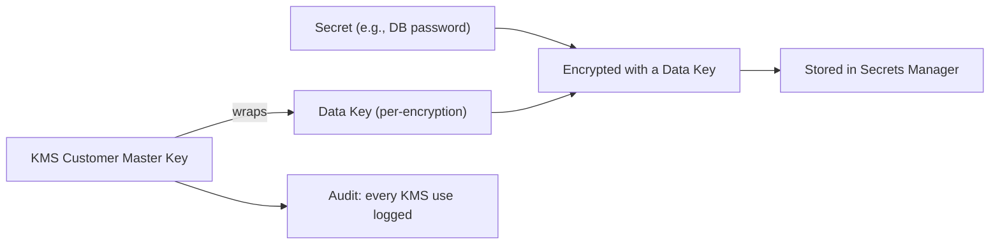

# Cloud Security: IAM and Secrets Management

## Overview

Cloud security's foundation is **identity and access management (IAM)** — deciding *who* (identity) can do *what* (permission) on *which resources* — plus **secrets management** — how credentials, keys, and tokens are stored, rotated, and delivered to workloads. The task §14 topics of IAM, secrets management, and cloud security all converge here.

The shared responsibility model sets the frame: **the provider secures the cloud, the customer secures what's in the cloud** — including identities and secrets.

## The Core IAM Concepts



Every cloud API call passes through the IAM layer before reaching the target service — in AWS this is literally true (IAM evaluates every request).

## IAM Across AWS / Azure / GCP

| Aspect | AWS | Azure | GCP |
|---|---|---|---|
| Identity store | IAM + IAM Identity Center | **Entra ID** (formerly Azure AD) | Cloud IAM + Cloud Identity |
| Policy model | JSON policies (Allow/Deny/Action/Resource/**Condition**) — richest conditions | **RBAC role assignments** (role → principal → scope) | Role bindings with org-hierarchy inheritance + IAM Conditions |
| Human access | IAM Identity Center (SSO, temporary) | Entra ID with PIM (time-bound, approval-gated elevation) | Cloud Identity, Just-In-Time access |
| Workload identity | **IAM roles** (EC2/Lambda/EKS IRSA) | **Managed identities** (system/user-assigned) | **Service accounts** (cleanest model) |
| Guardrails | SCPs at Organizations level | Azure Policy (deny effects) | Org policy constraints |
| Analysis | IAM Access Analyzer | Defender for Cloud Permissions Mgmt | IAM Recommender |

### AWS: users vs roles vs policies

- **IAM User** — long-lived credentials (password/access keys). For people and legacy service accounts.
- **IAM Role** — temporary credentials (STS, 1–12 h) **assumed** by trusted entities (services, cross-account, federated users). The modern default for workloads.
- **IAM Policy** — JSON: `Effect`, `Action`, `Resource`, `Condition`.
- **Permission boundary** — caps max permissions a role/user can get (delegation without escalation).
- **SCP (Service Control Policy)** — org-wide guardrails that even account admins can't exceed.
- **Evaluation rule**: explicit **Deny always wins**; otherwise any Allow applies; boundary ∩ identity policy = effective.

```json
{
  "Version": "2012-10-17",
  "Statement": [{
    "Effect": "Allow",
    "Action": ["s3:GetObject"],
    "Resource": "arn:aws:s3:::reports/*",
    "Condition": {"IpAddress": {"aws:SourceIp": "10.0.0.0/8"}}
  }]
}
```

### Azure: RBAC and managed identity

- Role = named bundle of operations; assigned to a **principal** (user, group, service principal, managed identity) at a **scope** (management group → subscription → resource group → resource). Inheritance cascades down.
- **Managed identity** — Azure's workload identity: the platform manages the credentials; your code calls the identity, not a secret. System-assigned (tied to one resource) or user-assigned (shareable).
- **PIM (Privileged Identity Management)** — just-in-time, approval-gated, time-bound elevation of admin roles; the deepest native IGA of the three.

### GCP: service accounts and org hierarchy

- **Service accounts** — first-class principals for workloads; GKE uses Workload Identity so pods assume IAM roles directly.
- Permissions bind at org → folder → project → resource, inheriting down the hierarchy.
- **IAM Conditions** add expression-based constraints (time, resource attributes, tags).

## Secrets Management

A **secret** is any credential the workload needs: API keys, DB passwords, TLS private keys, OAuth tokens, encryption keys. Secrets are the #1 leak vector — they end up in code, logs, configs, and images.

### The tools

| Need | AWS | Azure | GCP | Self-hosted |
|---|---|---|---|---|
| **Secrets storage** | Secrets Manager | Key Vault | Secret Manager | HashiCorp **Vault**, SOPS |
| **Encryption keys** | KMS (CMK) | Key Vault (HSM-backed) | Cloud KMS / Cloud HSM | Vault Transit |
| **Workload delivery** | IAM roles / ECS secrets / Lambda env | Managed identity + Key Vault references | Secret Manager + Service Accounts | Vault agent / sidecar |
| **Rotation** | Secrets Manager auto-rotation | Key Vault (manual/function-based) | Secret Manager (scheduled) | Vault (lease-based) |

### Best practices (universal)

1. **Never put secrets in code, images, or logs** — this is the single most common breach cause.
2. **Use workload identity instead of long-lived credentials** — an IAM role/managed identity/service account *is* the secret-free pattern (no key to leak).
3. **Centralize** — one secrets service with audit, not scattered env vars.
4. **Encrypt at rest** — KMS/Key Vault/Cloud KMS wrap stored secrets (envelope encryption).
5. **Rotate automatically** — short-lived credentials (STS leases, Vault leases) beat rotating quarterly.
6. **Least privilege** — scope each secret to one workload; never share master keys.
7. **Audit access** — every secret read should be logged (CloudTrail, Key Vault diagnostics, Cloud Logging).

### Envelope encryption (why KMS wraps secrets)



Envelope encryption: encrypt data with a per-item **data key**, wrap the data key with a KMS master key. The master key never leaves the HSM; you can rotate master keys without re-encrypting everything, and you get a clean audit trail of key usage.

## Common Cloud Security Failures

1. **Over-permissioned roles** — `*:*` admin policies; fix with least privilege + Access Analyzer/recommender.
2. **Long-lived static keys** — access keys committed to GitHub (scanners find these constantly); use roles/OIDC federation for CI.
3. **Public resources** — S3 buckets/Blob containers left public; enforce deny-public policies.
4. **Secrets in config/env/logs** — use a secrets manager and redact logs.
5. **No audit** — disabled CloudTrail/audit logs make breaches undetectable.
6. **Confused deputy / external-id missing** — when delegating cross-account, use `ExternalId` to prevent a third party from assuming a role meant for someone else.

## Interview Questions

### Q: IAM User vs IAM Role?

A user is a long-lived identity with static credentials (password/access keys) — for humans or legacy apps. A role is an identity with **temporary credentials** obtained via STS `AssumeRole` — for services (EC2/Lambda), cross-account access, and federated users. Roles are preferred for workloads because there are no long-lived keys to leak or rotate.

### Q: How does a workload access a secret without storing credentials?

Use **workload identity**: AWS IAM roles on EC2/Lambda (credentials auto-provisioned and rotated by the instance metadata service), Azure managed identities, or GCP service accounts + Workload Identity. The platform delivers short-lived credentials; the application calls the secrets service with that identity. No secret ever lives in the app.

### Q: What is envelope encryption and why use it?

Encrypt the secret with a random **data key**, then encrypt the data key with a KMS **master key**. Benefits: master keys never leave the HSM, you can rotate/revoke master keys without re-encrypting data, per-item data keys limit blast radius, and KMS use is auditable. It's how Secrets Manager/Key Vault/Secret Manager actually protect stored secrets.

### Q: How do AWS SCPs differ from IAM policies?

IAM policies grant/deny what a principal can do — they're per-identity/resource. SCPs operate at the **AWS Organizations** level and are guardrails that bound what any account (even its admin) can do. Effective access = what SCP allows ∩ what IAM allows. SCPs prevent dangerous actions org-wide (e.g., deny deleting CloudTrail).

## References

- AWS IAM documentation — https://docs.aws.amazon.com/iam/
- AWS Secrets Manager — https://aws.amazon.com/secrets-manager/
- Azure: Microsoft Entra ID and RBAC — https://learn.microsoft.com/en-us/entra/
- Azure Key Vault — https://learn.microsoft.com/en-us/azure/key-vault/
- Google Cloud IAM — https://cloud.google.com/iam/docs
- Google Secret Manager — https://cloud.google.com/secret-manager
- HashiCorp Vault — https://www.vaultproject.io/

## Related Topics

- [Cloud Overview](../overview.md) — shared responsibility model
- [Disaster Recovery](../disaster-recovery.md) — recovery regions need the same IAM
- [AWS Essentials](../aws/README.md) — IAM within the AWS ecosystem
- [Kubernetes](../kubernetes/README.md) — RBAC, service accounts, secrets in k8s
- [Security in System Design](../../interview/system-design/hld/security-design.md) — authentication/authorization concepts
- [LLM Security](../../llm/llm-serving/security.md) — AI workloads inherit IAM/secrets concerns
