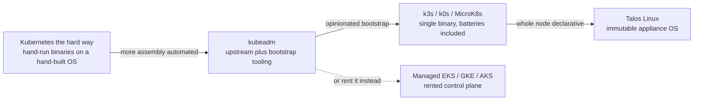
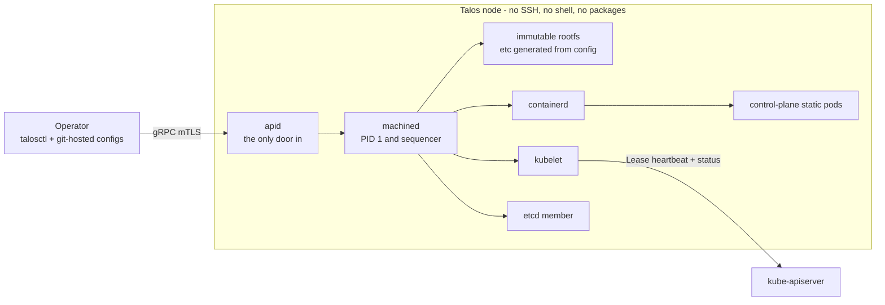
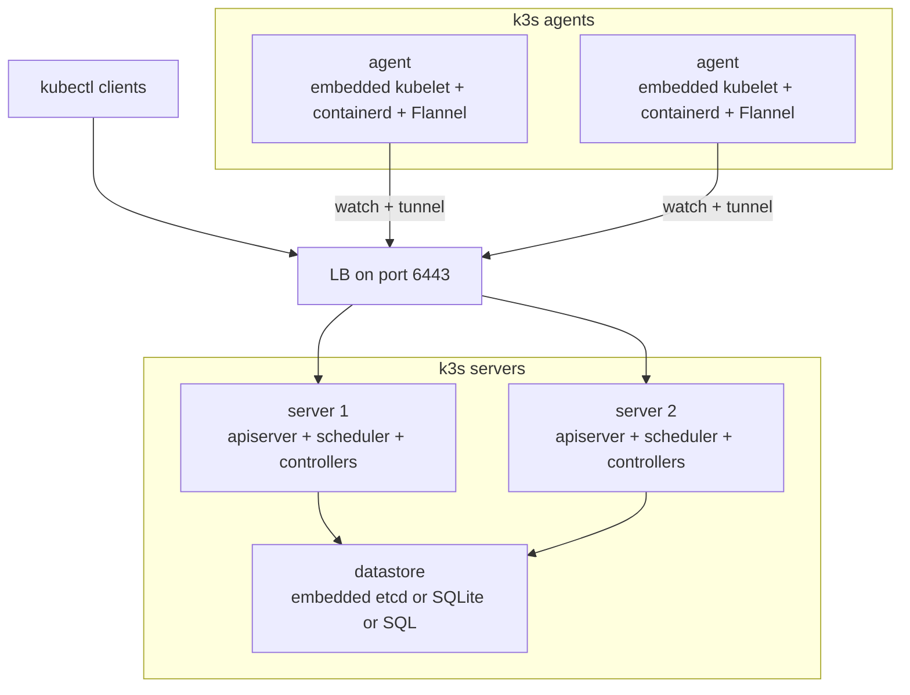

# Talos Linux and k3s: The Minimal Kubernetes Distro Spectrum

## Overview

"Running Kubernetes" is really running an assembly: a conformant set of control-plane binaries, a container runtime speaking the CRI, a CNI plugin, storage glue, and a bootstrap/lifecycle story that keeps all of it consistent over years. The distro spectrum answers one question — *who assembles and operates that assembly* — at very different points: hand-run upstream binaries ("Kubernetes the hard way"), kubeadm, batteries-included single binaries (k3s, k0s, MicroK8s), an OS purpose-built as a Kubernetes appliance (Talos Linux), and managed control planes (EKS/GKE/AKS) where you rent everything except the worker nodes. Interviewers use this space to test whether you understand what Kubernetes consists of beyond `kubectl apply`, and whether you can reason about control versus convenience instead of reciting product names. This page maps the design space, takes deep dives into the two most instructive poles (Talos and k3s), and ends with the honest counter-arguments.

## The Distro Design Space

A Kubernetes distro is not a fork. CNCF conformance pins the API contract — any certified distro passes the same end-to-end test suite — so the differences live almost entirely in the layers conformance does not specify. Every distro makes a choice for each of these layers:

| Layer | What has to be chosen | Typical spread |
|---|---|---|
| Container runtime (CRI) | containerd, CRI-O, embedded containerd | k3s embeds a stripped containerd in the binary; Talos ships only containerd |
| CNI | Flannel, Cilium, Calico, kube-router | some distros bundle one; Talos and kubeadm declare none and expect it in config |
| Datastore | etcd, SQLite via kine, dqlite, external SQL | the highest-stakes choice — see [etcd Architecture](./etcd.md) |
| Bootstrap | static pods, self-hosting, kubeadm phases, machine config | how the first control plane comes up and re-joins |
| Bundled extras | CoreDNS, ingress, ServiceLB, local storage, metrics-server | shipped by default vs opt-in vs absent |
| Lifecycle | upgrades, cert rotation, node join/leave | the layer that decides long-term operational cost |

The baseline at the far left is Kelsey Hightower's "Kubernetes the hard way": you provision machines, install etcd by hand, generate the PKI, write systemd units for each control-plane binary, and install kubelet plus a runtime yourself. Almost nobody runs it in production, but it is the reference for what the other points of the spectrum automate — which is why interviewers like it as a framing device. kubeadm automates roughly the cert-generation and static-pod-manifest halves of that exercise; the single-binary distros additionally absorb runtime, CNI, extras, and datastore assembly; Talos absorbs the OS itself. Managed control planes then delete the control-plane half of the assembly entirely, leaving you nodes, networking, and the bill.

Four axes cut across those layers. **Binary footprint** runs from dozens of OS packages to a single binary under 100 MB. **API surface** asks what management interfaces exist: only the Kubernetes API, or a second machine-level API for the node itself. **Immutability** asks whether the node filesystem and configuration can drift from a declared state. **Upgrade story** asks whether a node update is a package transaction, an image swap, or a snap refresh. Edge and datacenter pull these axes in opposite directions: edge wants small, autonomous, NAT-tolerant nodes that survive without human attention, while datacenter fleets want configurability, deep observability integration, and elastic node pools.



The spectrum is about integration, not quality: kubeadm is neither worse nor better than Talos, it just leaves more of the assembly to you. That choice determines where your operational risk sits — in your own scripts, in a vendor's defaults, or in a cloud provider's control-plane SLA.

## Talos Linux: The OS as a Kubernetes Appliance

### The API-Only Operating Model

Talos ships a Linux kernel, a small init system (`machined`) as PID 1, containerd, and effectively nothing else: no SSH daemon, no shell, no package manager, no way to log in interactively. Every management action — bootstrap, config patch, upgrade, disk wipe, log retrieval, even packet capture — is a `talosctl` subcommand hitting a gRPC API (`apid`) that is the node's only door, authenticated with Talos-generated PKI. The control plane runs as static pods under machined's supervision, so a node converges from exactly two declarative inputs: its machine config and the cluster state in etcd. The consequence is operational rather than cosmetic: there is no shell in which snowflake changes can accumulate, so configuration drift is zero by construction rather than merely discouraged by policy.



A fresh Talos node boots into **maintenance mode**: it has no cluster identity yet, exposes a one-time API certificate, and waits for a machine config to be applied — there is no interactive installer to babysit. Because the only interface is an API, everything is scriptable and auditable the same way the Kubernetes API is, which is why Talos pairs naturally with Cluster API providers and with Omni, Sidero's fleet-management layer.

### The Machine Config as the Single Interface

The concrete question interviewers probe is "what do you actually do when something breaks with no SSH?" The answer is that every shell-era task has an API-era equivalent:

| SSH-era task | Talos equivalent |
|---|---|
| `ssh` + `journalctl -u kubelet` | `talosctl logs kubelet` |
| `systemctl status` for a component | `talosctl services` |
| `dmesg` on the box | `talosctl dmesg` |
| `etcdctl` against localhost | `talosctl etcd status` / `talosctl etcd snapshot` |
| disk and mount inspection | `talosctl disks` / `talosctl mounts` |
| `tcpdump -i eth0` | `talosctl pcap` |
| hand-edited `sysctl.conf` | kernel args in the machine config |

The machine config is one YAML document per node role, generated with `talosctl gen config`, validated by the node before it is accepted, and naturally stored in git alongside your cluster manifests. The node rejects invalid config rather than applying half of it, and patch modes (`talosctl patch`) let you change one field — a kernel arg, a registry mirror, the kubelet version — without resending the whole document.

```yaml
# abridged machine config for a control-plane node
version: v1alpha1
machine:
  type: controlplane
  network:
    hostname: cp-1
  kubelet:
    nodeIP:
      validate: true
cluster:
  controlPlane:
    endpoint: https://<lb-hostname>:6443
  etcd:
    subnet: 10.0.1.0/24
```

This is the same philosophical move as Kubernetes itself: the desired state is declarative, versioned, and reconciled by a controller — except the controller now owns the whole machine, not just a namespace. Teams that already run GitOps find Talos almost self-explanatory; teams used to SSH-and-fix find the missing shell genuinely disorienting for the first week, which is the honest adoption cost.

### Immutability, Boot Chain, and Upgrades as Image Swaps

The root filesystem is an immutable read-only volume; `/etc` is regenerated from the machine config at every boot; `/var` holds the mutable state (etcd data, container images, pod logs) and is the only writable slice. Nodes boot through a verified chain — signed kernel and initramfs, with optional Secure Boot via signed unified kernel images and TPM-measured boot for sites that need measured attestation. Because the OS is an appliance, a compromised or misbehaving node has a trivially defined recovery: re-image it, re-apply the machine config, re-join — there is no forensic residue of ad-hoc changes to untangle because none can exist.

Upgrades are image swaps, not package transactions. `talosctl upgrade` streams a signed installer image to the node; the node verifies it, stages the new boot assets into an alternate slot, reboots into it, and falls back to the previous slot if the boot fails. The kubelet is pinned as an image reference in the machine config, and `talosctl upgrade-k8s` walks the control plane one node at a time, updating static-pod versions and waiting for each node's readiness to settle. Version drift between the OS and Kubernetes stops being a class of incident because both are declared in the same document.

### KubeSpan and the Blast-Radius Argument

KubeSpan is Talos's WireGuard-based overlay mesh: nodes discover each other (through the cluster registry or Sidero's discovery service), exchange WireGuard keys via the Kubernetes API, and route pod traffic over encrypted tunnels that traverse NAT — useful for edge and multi-site clusters where no flat network exists. It is enabled declaratively in the machine config like everything else, which keeps the "no snowflakes" property even for networking.

The deeper interview point is the blast-radius claim. On a conventional node, drift accumulates in shells, package state, and hand-edited files across dozens of machines, and the recovery procedure is "someone's runbook from 18 months ago." On Talos the total per-node state is two artifacts — machine config and an image tag — so the worst-case recovery is deterministic re-provisioning, and the question "what else did someone change on that box?" has a provable answer: nothing. That is what "the OS is an appliance for running Kubernetes" buys you.

## k3s: Certified Kubernetes in a Single Binary

### Server and Agent Architecture

k3s packs the entire distribution — API server, controller-manager, scheduler, kubelet, containerd, a CNI, and a datastore shim — into one ~70 MB binary that is CNCF conformance-certified. The same binary runs in two roles: **servers** host the control plane (and by default are also full workload nodes), while **agents** run only the embedded kubelet, containerd, Flannel, and the embedded kube-proxy replacement. Agents need reachability only to the servers' port 6443 and can sit behind NAT, proxying kubelet and tunnel traffic through the server over a websocket-style connection — a deliberate edge-friendly property most upstream deployments lack.



Everything an upstream cluster ships as separate installations comes bundled: Flannel (VXLAN) as the default CNI, CoreDNS, Traefik as ingress, ServiceLB (a host-port load balancer), the local-path storage provisioner, metrics-server, and an embedded network-policy controller. Bundling cuts install friction dramatically but also means the defaults either fit you or must be explicitly disabled (`--disable` flags, `--flannel-backend=none` to bring your own CNI).

One subtlety matters for small clusters: by default every server is *also* a full workload node — kubelet, containerd, and Flannel run inside the server process — so a 3-server cluster is a 3-node cluster with no additional machines. That is ideal for HA on minimal hardware, but it means control-plane components share CPU/memory with your workloads, and a runaway pod can starve the API server on the same box. Teams that want separation either taint the servers so only control-plane pods land there, or pass `--disable-agent` to run pure control-plane servers — the same trade upstream clusters make with control-plane taints, just compressed into one process.

### Datastore: SQLite by Default, Quorum When You Need It

By default a k3s server stores cluster state in SQLite through **kine**, the datastore shim that translates the Kubernetes storage API onto relational databases (SQLite, Postgres, MySQL; etcd is handled natively). This removes the single most failure-prone piece of a small cluster — standing up and operating etcd — at the cost of a single-writer database that cannot back more than one server. The switch points are concrete: the moment you need a second **server** for control-plane HA, SQLite is out; the moment write throughput saturates the single-writer lock or watch fan-out degrades, the kine translation layer itself becomes the bottleneck. Moving is a re-bootstrap with a data restore, not an in-place flip, so decide before the cluster becomes load-bearing.

For HA the standard topology is **3 servers with embedded etcd** (`--cluster-init` on the first), giving the usual quorum rule of \\( \\lfloor N/2 \\rfloor + 1 \\) members. The unusual option k3s documents is **2 servers + an external datastore** (managed Postgres/MySQL or external etcd): because the API servers are near-stateless and quorum lives in the datastore, two servers legitimately give HA without an odd-N constraint. The trade is dependency relocation — the external datastore's availability and latency now bound every write, and its backup discipline becomes the cluster's backup discipline. See [etcd Architecture](./etcd.md) for the quorum, compaction, and snapshot mechanics underneath either choice.

### Auto-Deploying Manifests: Declarative Batteries

Anything dropped in the server's manifests directory (`/var/lib/rancher/k3s/server/manifests`) is applied and continuously reconciled as an `Addon` resource, and a `HelmChart` CRD (driven by the built-in helm-controller) lets you deploy third-party charts declaratively from the same directory. This is how the bundled components themselves are deployed, which makes the whole "batteries" layer inspectable and git-able: copy the Traefik manifest out, edit it, and your ingress is now infrastructure-as-code instead of a black box. For small clusters this quietly replaces a Flux or ArgoCD bootstrap for the base layer — though for anything larger you still want real GitOps tooling (see [Kubernetes Deployments](./kubernetes/deployments.md) for what these clusters actually run).

The resource floor is the other headline: k3s runs comfortably in ~512 MB RAM per node, builds for ARM64/ARMv7, and is explicitly positioned for edge, IoT, and CI. That is not marketing — the embedded kubelet and containerd, SQLite default, and NAT tunneling are exactly the properties needed when a site has one small box, one WAN circuit, and no on-site operator.

## The Wider Spectrum

**k0s** (Mirantis) is the closest philosophical neighbor to k3s: a single binary, split controller/worker roles, konnectivity-based API tunneling, and an air-gap bundle command that packages everything a disconnected install needs. Its defaults sit closer to upstream — etcd as the default datastore (SQLite only for single-node), kube-router as the default CNI — and it bundles no ingress or load balancer, so it trades some of k3s's batteries for fewer opinions to unwind. Positioning is honest: it is a distro for teams that want k3s-style frictionless installs but upstream-shaped internals.

**MicroK8s** (Canonical) is snap-packaged: channels track upstream minors, `snap refresh` is the upgrade path, and clustering is `microk8s join` with tokens, with an HA datastore that forms automatically once a third node joins (dqlite historically, etcd offered in newer releases). Its addon model (`microk8s enable dns/ingress/storage`) is the best-of-breed opt-in extras experience, which makes it excellent for laptops, dev clusters, and Canonical-aligned shops. The costs are snapd as a hard dependency and confinement quirks that occasionally fight custom runtimes and host-level integrations.

**The kubeadm counter-argument** deserves its own paragraph, because "minimal" is often a solution in search of a problem. If a team already runs config management (Ansible, Puppet) and wants specific CNIs, runtime options, and component flags, kubeadm plus upstream is itself minimal enough: a handful of packages, static-pod manifests, and an upgrade procedure (`kubeadm upgrade` per node) that is fully documented and tool-agnostic. The real trade across the whole spectrum is **control versus convenience**: every default a distro bundles is a decision you inherit, and every decision you take back (custom CNI, external datastore, hand-rolled upgrades) is operational surface you own. Choosing a distro is choosing which failures you would rather have.

### Head-to-Head Comparison

| Dimension | Talos Linux | k3s | k0s | MicroK8s | kubeadm |
|---|---|---|---|---|---|
| Packaging | appliance OS image | single ~70 MB binary | single binary | snap + bundled addons | upstream packages |
| Footprint | minimal kernel + userspace, no packages | ~512 MB node floor, ARM builds | small, k3s-adjacent | small, needs snapd | whatever you assemble |
| Default datastore | embedded etcd (quorum) | SQLite via kine | etcd (SQLite single-node) | dqlite HA / etcd option | stacked or external etcd |
| Default CNI | none — declared in config | Flannel (VXLAN) | kube-router | Flannel | none — you install it |
| Bundled extras | none beyond control plane | CoreDNS, Traefik, ServiceLB, local-path, metrics-server | CoreDNS, konnectivity | opt-in addon catalog | whatever you add |
| Upgrade mechanism | signed image swap, A/B slot, rollback | channel-based install script or SystemUpgradeController | binary swap + upgrade controller | snap channel refresh | `kubeadm upgrade` + OS packages |
| Config model | machine config YAML, API-applied | flags + files on a mutable OS | config file, API-managed parts limited | snap config | your config management |
| Immutability | absolute — no shell, no drift | none — conventional mutable host | none | partial (snap dirs) | none |
| Edge fit | strong with fleet tooling (Omni) | strongest — NAT tunneling, 512 MB, ARM | strong — air-gap bundle | dev/laptop-first | weak without heavy tooling |
| Typical users | platform teams wanting reproducible fleets | edge/IoT, CI, small production | Mirantis-adjacent enterprises, upstream-leaning teams | Canonical shops, workstations | teams building their own distro |

## Operational Deep-Dives

### Upgrading a Talos Node

A Talos upgrade is one command with an orchestrated lifecycle inside. The node's sequencer (which guarantees only one machine sequence — boot, upgrade, reset — runs at a time) cordons the node and drains workloads through the Kubernetes API honoring PodDisruptionBudgets, then verifies the new image, swaps the A/B boot slot, and reboots. After reboot the machine re-converges from its config, the kubelet re-registers and resumes its node Lease heartbeat, the node is uncordoned, and any boot failure rolls back to the previous slot automatically. The fleet-level story is the same operation repeated per node by `talosctl upgrade-k8s` or an Omni rollout, gated on readiness — so "upgrade day" becomes a reviewable change to a git file plus a loop, not a per-node improvisation.

### Upgrading k3s

k3s upgrades follow the channel model: install scripts default to the `stable` channel (and support minor channels like `v1.30`), so re-running the installer with a new channel or version marker performs the upgrade — servers first, then agents, with servers restarted one at a time while the API LB keeps clients working. For clusters you do not want to SSH into, the SystemUpgradeController applies the same model declaratively: `Plan` CRDs select servers or agents, cordon and drain them, run the installer in a privileged pod, and wait for readiness, with a server Plan that agent Plans depend on. The operational discipline is the same as any cluster — one minor at a time, watch the API server health between servers — but the mechanism is a channel pointer rather than a package dance.

### Backup and Restore Across Distros

Datastore backup is where distro assumptions surface most sharply, because the same logical operation has different physical paths:

| Operation | Talos | k3s | kubeadm |
|---|---|---|---|
| Take a snapshot | `talosctl etcd snapshot` over the machine API | `k3s etcd-snapshot save` (also cron-scheduled) | `etcdctl snapshot save` against a member you reach yourself |
| Restore | re-provision members from config, replay snapshot at bootstrap | `k3s server --cluster-reset --cluster-reset-restore-path` | `etcdctl snapshot restore` + regenerated static-pod manifests |
| Rebuild a dead node | re-image and re-apply machine config; state lives in etcd | reinstall the binary and re-join; for SQLite restore the db files | re-run `kubeadm join` after fixing certs, CNI, and versions by hand |
| What moves with it | machine config + snapshots in object storage | snapshots + server token + manifests dir | etcd snapshot + CA certs + your config repo |

Note the pattern: the further right you go, the more the backup procedure depends on state that lives outside the product — your runbooks, your config management, your certificate hygiene. k3s ships scheduled snapshots and a one-flag restore; Talos keeps snapshots behind its API because there is no shell to run `etcdctl` in; kubeadm gives you the primitives and nothing else. Whichever you pick, restore drills are the only evidence the backups work — an untested snapshot is a hypothesis.

### Air-Gapped Installation for Edge Sites

Air-gapped installs are a first-class use case, and both flagship distros make it config-first. For k3s you stage the binary and an air-gap image tarball (pre-loaded from `/var/lib/rancher/k3s/agent/images/` before first start), point `registries.yaml` at a local registry mirror, and pin the version so the site cannot drift onto a channel. For Talos you build a site-specific installer image (the imager tooling embeds your extras), declare registry mirrors in the machine config, and provision over PXE or pre-seeded media with zero first-boot internet dependency. The common runbook shape is: everything versioned and staged before shipping, provisioning from local artifacts, snapshots landing on on-site storage with periodic out-of-band export, and a documented rebuild path that assumes the WAN is down. The failure mode to design against is quiet drift — an edge site that half-upgrades and nobody notices for months — which is exactly what image-swap upgrades and pinned channels exist to prevent.

## When NOT to Use a Minimal Distro

The first exclusion zone is single-node territory: if the workload is a few containers on one box, Docker Compose (or a plain systemd unit) has no API-server lifecycle, no etcd, no upgrade choreography, and no conformance debt — adding Kubernetes there is pure liability no matter how small the distro. The second is workload-generality: if you need to schedule non-containerized binaries, batch jobs across heterogeneous drivers, or multi-datacenter federation with less ceremony, [Nomad](./nomad.md) remains a genuinely simpler orchestrator, and that simplicity survives at fleet scale. The third is operational ownership: if nobody on the team owns node lifecycles — patching, certificates, capacity — a managed control plane (EKS/GKE/AKS) plus managed node groups converts an ops problem into a vendor SLA, and for many teams that is the correct trade.

The anti-hype paragraph deserves its own space: **minimal distros remove install friction, not the learning curve**. You still own etcd quorum semantics, PodDisruptionBudget correctness, certificate rotation, CNI behavior under packet loss, and upgrade sequencing — k3s and Talos just stop making those harder than they already are. The complexity did not vanish; it moved from "assemble and integrate" to "operate and reason," which is the better half of the trade but not the free half. And ecosystem quirks are real: k3s's embedded proxies change how you debug connectivity, Talos's no-shell rule excludes your favorite troubleshooting toolkit, and both will occasionally surprise third-party tooling that assumes vanilla upstream node images. Choose them for the operating model, not because a diagram looked simple.

## Cross-References

- [Kubernetes Internals Deep Dive](./kubernetes-internals.md) — the component anatomy these distros repackage
- [Kubelet Internals](./kubernetes/kubelet.md) — what k3s embeds per agent and Talos pins per node
- [Kubernetes Deployments](./kubernetes/deployments.md) — the workload layer every distro serves
- [etcd Architecture](./etcd.md) — the datastore decisions behind SQLite, embedded etcd, and quorum math
- [Nomad: The Simple Orchestrator](./nomad.md) — the orchestrator alternative when containers-only is too narrow
- [Bare-Metal Clouds](./bare-metal-clouds.md) — where Talos fleets and k3s clusters most often land physically
- [Autoscaling](./autoscaling.md) — node scaling on top of a distro (Karpenter/CA assume upstream-shaped nodes)
- [Unikernels](../os/advanced/unikernels.md) — the extreme end of the immutable, single-purpose OS idea

## Interview Questions

1. **Why is Talos removing SSH and the shell a risk reducer rather than an operations blocker?**
Every historically SSH-mediated action — reading logs, capturing packets, wiping disks, patching config, upgrading — has a first-class `talosctl` equivalent over an authenticated gRPC API, so nothing is lost except the ability to make untracked, unreviewed changes. Snowflake drift (the hand-edited sysctl, the debugging package someone installed and forgot) becomes structurally impossible because the rootfs is immutable and `/etc` is regenerated from version-controlled YAML at boot. The attack surface shrinks too: no interactive door to brute-force, no shell history holding secrets. The real cost is upfront — teams must build the config-as-code workflow and break-glass re-provisioning procedure before they need them.

2. **Your k3s cluster is growing. When do you move off SQLite, and to what?**
The hard trigger is a second server: kine-on-SQLite is a single-writer datastore, so it cannot back a HA control plane at all. The soft triggers are write throughput saturating the single-writer lock and watch fan-out degrading as object count grows, since every etcd-shaped API call now carries kine's SQL translation overhead. Move to embedded etcd with 3 servers when you want HA without new infrastructure classes, or to external etcd/Postgres when you already operate that datastore with real backup and HA discipline. Budget for it being a re-bootstrap with a snapshot restore, not an in-place flip — decide before the cluster becomes load-bearing.

3. **How can k3s offer HA with only two servers, and what is the catch?**
With an external datastore (managed Postgres/MySQL or external etcd), quorum lives in the datastore rather than the server layer, and the API servers are near-stateless — so a second server raises API availability without needing odd-N quorum. Control-plane leader election still runs through Leases in that datastore, so election correctness is inherited from it. The catch is dependency relocation: the external datastore's availability and latency now bound every cluster write, and its backup story becomes the cluster's backup story. With embedded etcd you would instead run 3 servers under the standard \\( \\lfloor N/2 \\rfloor + 1 \\) rule — same failure-domain math, different place to lose sleep.

4. **Compare upgrading a Talos node versus upgrading a kubeadm node.**
kubeadm is a components play: the OS package manager bumps kubelet/kubeadm binaries, `kubeadm upgrade` rewrites the static-pod manifests, and drain/cordon sequencing is your tooling's job, with drift possible between node OS state and desired versions. Talos is an image play: one command streams a signed installer, the sequencer cordons and drains honoring PodDisruptionBudgets, the A/B slot switches, the node reboots, the kubelet Lease resumes, and boot failure rolls back automatically. Version pinning lives in the machine config, so desired fleet state is reviewable in git. Net effect: kubeadm hands you parts to orchestrate; Talos hands you one operation — but only inside its appliance model, which is exactly the constraint some teams cannot accept.

5. **What do you actually give up running k3s instead of upstream Kubernetes?**
Not the API — k3s is conformance-certified, so the object surface is intact. You give up edge configurability: the embedded containerd and kubelet expose fewer knobs, replacing Flannel means `--flannel-backend=none` plus manual wiring, and bundled Traefik/ServiceLB must be disabled if unwanted. Defaults also change debugging assumptions: agents behind NAT tunnel kubelet traffic through the servers, so the connectivity topology you see from a pod is not the classic upstream CNI diagram. Finally, some third-party tools assume vanilla node images and standard component layouts, and the single-binary bundling means "restart the API server" and "restart the node agent" share a process. The losses are operational familiarity and integration assumptions, not function.

6. **Design the runbook for an air-gapped edge site running a minimal distro.**
Stage everything before shipping: binaries and image tarballs (k3s air-gap images pre-seeded into the agent images directory; a Talos site-specific installer built with the imager), a local registry with mirror config declared in machine config or `registries.yaml`, and pinned versions so the site cannot drift onto a channel. Provisioning must be config-first — PXE or pre-seeded media, machine config/install script from a local file, zero first-boot internet dependency. Day-2 needs scheduled local snapshots with periodic out-of-band export, plus a documented rebuild path that assumes the WAN is down. Then rehearse the rebuild quarterly: an air-gap runbook that has never been executed offline is fiction, and edge sites fail in exactly the ways you did not rehearse.

## Key Takeaways

- A Kubernetes distro is an assembly of choices (CRI, CNI, datastore, bootstrap, extras, lifecycle) that conformance does not pin — the axes are footprint, API surface, immutability, and upgrade story.
- Talos makes the OS an appliance: API-managed, immutable, no SSH/shell, machine-config-as-code, image-swap upgrades — drift is zero by construction, at the price of adopting the config-first workflow.
- k3s makes the node a binary: embedded kubelet/containerd, SQLite-by-default via kine, bundled Flannel/Traefik/ServiceLB, NAT-tolerant agents — the strongest edge fit at a ~512 MB floor.
- The k3s datastore switch is a real decision point: SQLite until the second server or write saturation; embedded etcd with 3 servers for HA; external datastore only if you inherit its ops discipline.
- 2-server k3s HA works because quorum moves into the external datastore — availability is relocated, not conjured.
- k0s and MicroK8s bracket the middle: upstream-shaped defaults with frictionless installs (k0s), snap-based laptop-to-cluster convenience (MicroK8s); kubeadm remains legitimately minimal for teams that own config management.
- Backups expose the distro philosophy: k3s one-flag snapshots, Talos API-mediated snapshots, kubeadm raw primitives plus your runbook — and restore drills are the only proof any of them work.
- Minimal distros remove install friction, not the learning curve: the complexity moves from assembling to operating, which is the better half of the trade but not the free half.

## References

- Talos Linux — https://www.talos.dev/
- Talos Linux documentation — https://www.talos.dev/docs/
- siderolabs/talos (source) — https://github.com/siderolabs/talos
- k3s documentation — https://docs.k3s.io/
- k3s-io/k3s (source) — https://github.com/k3s-io/k3s
