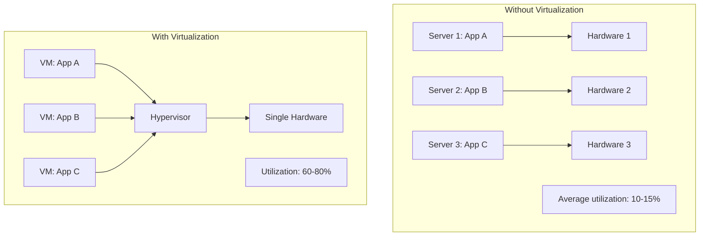
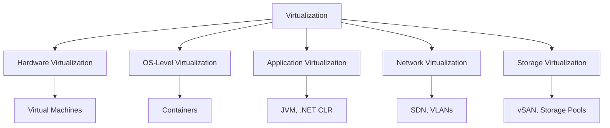
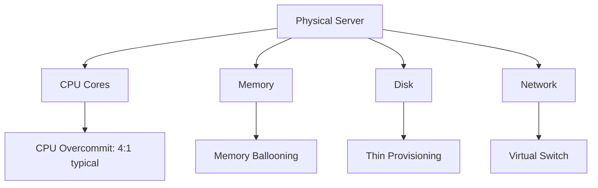

# Virtualization

## Overview

Virtualization is the foundation of cloud computing. It allows multiple virtual machines (VMs) to run on a single physical machine, each with its own operating system and isolated resources. This enables efficient resource utilization, isolation, and the ability to provision infrastructure on demand.

## What is Virtualization?



## Types of Virtualization



## Hardware Virtualization

### Full Virtualization vs Para-Virtualization

```mermaid
graph TD
    subgraph Full[Full Virtualization]
        FVM[VM] -->|Binary translation| FH[Hypervisor]
        FH --> FHW[Hardware]
        Note1[OS unmodified, hypervisor translates instructions]
    end

    subgraph Para[Para-Virtualization]
        PVM[Modified VM] -->|Hypercalls| PH[Hypervisor]
        PH --> PHW[Hardware]
        Note2[OS modified to call hypervisor directly]
    end

    subgraph HVM[Hardware-Assisted (HVM)]
        HVM_VM[VM] -->|VMX/SVM instructions| HH[Hypervisor]
        HH --> HHW[Hardware with VT-x/AMD-V]
        Note3[Hardware support for virtualization]
    end
```

| Type | Performance | OS Modification | Examples |
|------|------------|-----------------|----------|
| Full Virtualization | Moderate | None | VirtualBox, early VMware |
| Para-Virtualization | Good | Yes (Xen guests) | Xen |
| Hardware-Assisted (HVM) | Best | None | KVM, modern VMware, Hyper-V |

## Key Concepts

### Hypervisor Types

See [Hypervisors](./hypervisors.md) for detailed coverage.

### VM vs Container

See [VM vs Container](./vm-vs-container.md) for detailed comparison.

### Resource Allocation



- **CPU Overcommit**: Allocate more virtual CPUs than physical cores (relying on not all VMs using 100% simultaneously).
- **Memory Ballooning**: Dynamically reallocate memory between VMs based on demand.
- **Thin Provisioning**: Allocate storage on demand, not upfront.

## Interview Questions

1. **Q: What is virtualization and why is it important for cloud computing?**
   A: Virtualization creates virtual versions of physical resources (servers, storage, networks). It enables multiple isolated VMs on one physical machine, improving utilization from 10-15% to 60-80%. Cloud providers use virtualization to offer on-demand, pay-as-you-go infrastructure.

2. **Q: What is the difference between Type 1 and Type 2 hypervisors?**
   A: Type 1 (bare-metal) runs directly on hardware — VMware ESXi, KVM, Xen. Type 2 (hosted) runs on top of an OS — VirtualBox, VMware Workstation. Type 1 is faster and used in data centers; Type 2 is for development/testing.

3. **Q: How does CPU overcommitment work?**
   A: The hypervisor allocates more virtual CPUs than physical cores. For example, a 16-core host might run 32 VMs with 1 vCPU each. This works because VMs rarely use 100% CPU continuously. The hypervisor schedules vCPUs onto physical cores.

## Cross-References

- [Hypervisors](./hypervisors.md) — Type 1 vs Type 2
- [VM vs Container](./vm-vs-container.md) — Detailed comparison
- [Cloud Overview](../overview.md) — Cloud computing fundamentals
