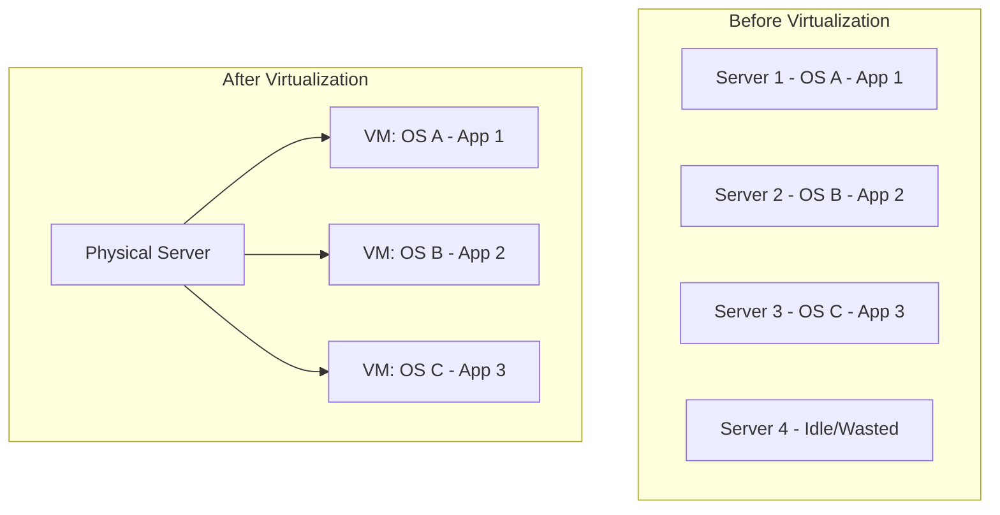
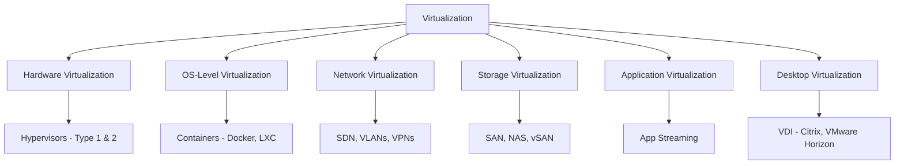
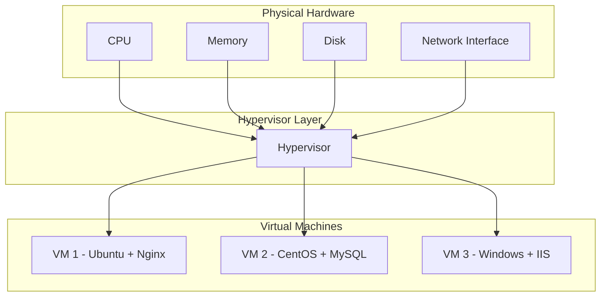
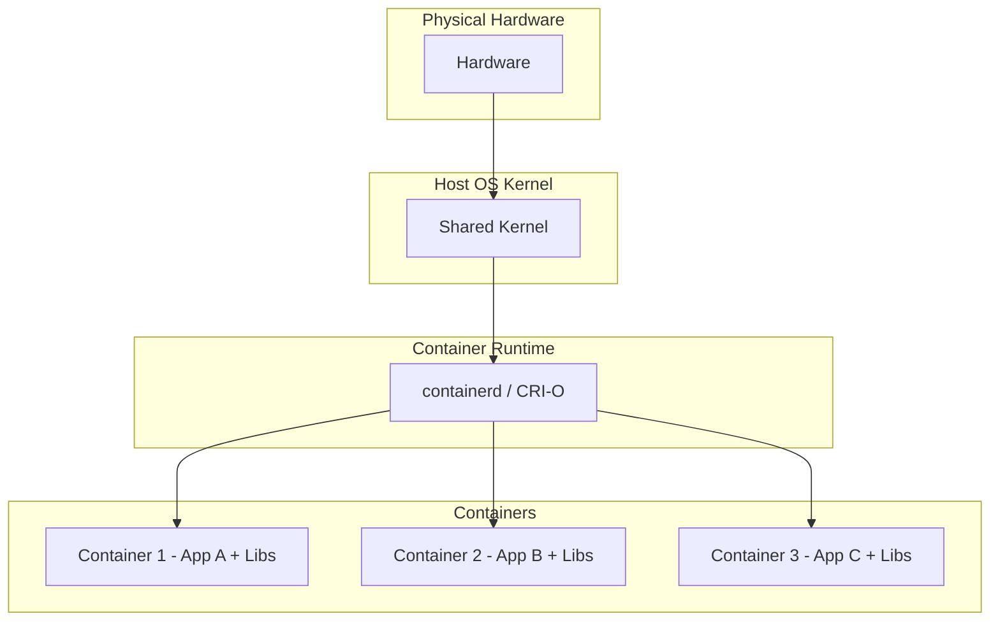
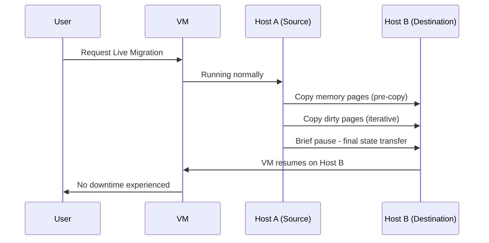

# Virtualization

## Introduction

Virtualization is the process of creating a virtual (rather than physical) version of something—computing resources, storage, networks, or operating systems. It is the foundational technology that makes cloud computing possible, allowing multiple virtual systems to run on a single physical machine.

## Why Virtualization?

**Key Benefits:**
- **Resource Utilization**: Average server utilization jumps from 10-15% to 60-80%
- **Cost Reduction**: Fewer physical servers = less hardware, power, cooling, space
- **Isolation**: VMs are independent; one crash doesn't affect others
- **Portability**: VMs can be moved between physical hosts easily
- **Rapid Provisioning**: Create new servers in minutes instead of weeks
- **Disaster Recovery**: Snapshot and replicate VMs for backup

## Types of Virtualization

### Hardware Virtualization (Server Virtualization)

The most common type. A hypervisor abstracts physical hardware into multiple virtual machines.

**How it works:**
1. Hypervisor sits between hardware and VMs
2. Each VM gets virtualized CPU, memory, disk, and network
3. Each VM runs its own OS kernel independently
4. VMs are completely isolated from each other

### OS-Level Virtualization (Containers)

Instead of virtualizing hardware, the OS kernel is shared among isolated user-space instances.

**Key difference from VMs**: No separate OS per container—containers share the host kernel, making them lighter and faster.

### Network Virtualization

Combines hardware and software network resources into a single, software-based entity.

- **VLANs**: Logically segment a physical network
- **SDN (Software-Defined Networking)**: Centralized control of network behavior
- **VPNs**: Encrypted tunnels over public networks
- **Overlay Networks**: Virtual networks built on top of physical networks (VXLAN)

### Storage Virtualization

Pools physical storage from multiple devices into a single logical unit.

- **SAN (Storage Area Network)**: High-speed block-level storage
- **NAS (Network Attached Storage)**: File-level storage over network
- **vSAN**: Virtual SAN that pools local storage across hosts
- **Thin Provisioning**: Allocate storage on demand, not upfront

## Key Virtualization Concepts

### Live Migration

Moving a running VM from one physical host to another with zero downtime:

### Snapshots

Point-in-time captures of a VM's state (memory, disk, settings):
- **Use cases**: Before updates, testing, rollback
- **Types**: Disk-only snapshot vs memory + disk snapshot
- **Performance impact**: Snapshots can degrade disk I/O over time

### Resource Overcommitment

Allocating more virtual resources than physically available, relying on the assumption that not all VMs will use their full allocation simultaneously.

| Resource | Safe Overcommit Ratio | Notes |
|----------|----------------------|-------|
| CPU | 3:1 to 5:1 | Depends on workload burstiness |
| Memory | 1.5:1 to 2:1 | Risky—can cause swapping |
| Storage | 2:1 to 3:1 | Thin provisioning helps |

> **Warning**: Memory overcommitment is dangerous. If VMs collectively demand more memory than available, the hypervisor must swap to disk, causing severe performance degradation.

## Virtualization vs Cloud

| Aspect | Virtualization | Cloud |
|--------|---------------|-------|
| **What it is** | Technology | Service delivery model |
| **Scope** | Single infrastructure | Entire ecosystem |
| **Management** | Manual | Automated & self-service |
| **Scaling** | Within physical limits | Virtually unlimited |
| **Billing** | Capital expenditure | Operational expenditure |
| **Automation** | Limited | Built-in APIs and orchestration |

> **Key Insight**: Virtualization is a **technology**; cloud is a **service model** that uses virtualization. You can have virtualization without cloud (on-premises VMware), but you can't have cloud without virtualization (or containerization).

## Interview Questions

### Q1: What is virtualization and why is it important for cloud computing?
**Answer**: Virtualization creates virtual versions of physical resources (servers, storage, networks). It's important for cloud because it enables: (1) multi-tenancy on shared hardware, (2) rapid provisioning of resources, (3) efficient resource utilization, (4) isolation between workloads, and (5) portability and live migration. Without virtualization, cloud's pay-as-you-go, on-demand model wouldn't be practical.

### Q2: What's the difference between hardware virtualization and OS-level virtualization?
**Answer**: Hardware virtualization (VMs) virtualizes the entire hardware stack—each VM runs its own OS kernel on virtualized hardware via a hypervisor. OS-level virtualization (containers) shares the host OS kernel—containers are isolated user-space processes. VMs offer stronger isolation but are heavier; containers are lighter and faster but share a kernel, which has security implications.

### Q3: What is resource overcommitment and when is it dangerous?
**Answer**: Overcommitment allocates more virtual resources than physically available. It's safe for CPU (most VMs don't use 100% CPU constantly) but dangerous for memory—if total VM memory demand exceeds physical RAM, the hypervisor swaps to disk, causing massive performance degradation (VM "ballooning"). Storage overcommitment with thin provisioning can cause out-of-space errors.

### Q4: Explain live migration.
**Answer**: Live migration moves a running VM between physical hosts without downtime. The hypervisor uses pre-copy memory migration: iteratively copies memory pages to the destination while the VM continues running. Dirty pages are re-copied in each iteration. A brief final pause (milliseconds) transfers the remaining state. This enables host maintenance, load balancing, and disaster avoidance without service interruption.

### Q5: How does virtualization relate to containers?
**Answer**: Both provide isolation and resource management, but at different levels. Virtualization abstracts hardware via a hypervisor; each VM has a full OS. Containers abstract the OS kernel; they share the kernel but isolate processes, filesystems, and networks. Containers are lighter (MB vs GB), start faster (seconds vs minutes), and are more portable, but offer weaker isolation than VMs. Modern cloud uses both—VMs for strong isolation, containers for density and speed.

## Common Mistakes

1. **Equating virtualization with cloud**: Virtualization is a technology; cloud is a service model that may use virtualization
2. **Ignoring overcommitment risks**: Blindly overcommitting memory leads to performance disasters
3. **VM sprawl**: Creating VMs without lifecycle management leads to orphaned, unpatched systems
4. **Neglecting VM security**: Assuming VM isolation means you don't need network security between VMs
5. **Snapshot abuse**: Leaving snapshots for weeks degrades performance and consumes storage
6. **Not right-sizing VMs**: Allocating 8 vCPUs to a VM that uses 1 wastes resources and increases licensing costs

## Summary

| Concept | Key Takeaway |
|---------|-------------|
| **Virtualization** | Creating virtual versions of physical resources |
| **Hardware Virtualization** | VMs with full OS on virtualized hardware via hypervisor |
| **OS-Level Virtualization** | Containers sharing host kernel |
| **Live Migration** | Moving running VMs with zero downtime |
| **Snapshots** | Point-in-time captures for backup and testing |
| **Overcommitment** | Allocating more than available—risky for memory |

## Cross-References

- **Hypervisors**: [Type 1 vs Type 2](./hypervisors.md) — Deep dive into the virtualization layer
- **VMs vs Containers**: [Trade-offs](./vm-vs-container.md) — When to use which
- **AWS EC2**: [Instance Types](../aws/ec2.md) — Virtualization in practice on AWS
- **Kubernetes Pods**: [Pod Lifecycle](../kubernetes/pods.md) — Container orchestration
- **Cloud Overview**: [Deployment Models](../overview.md) — How virtualization enables cloud
