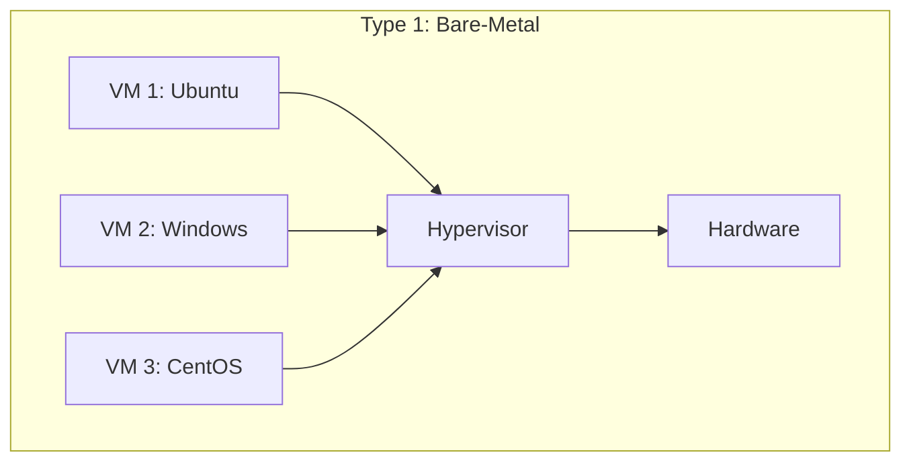
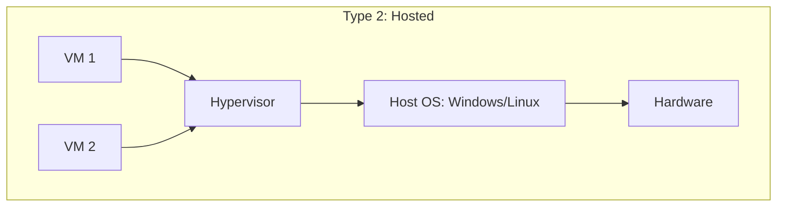
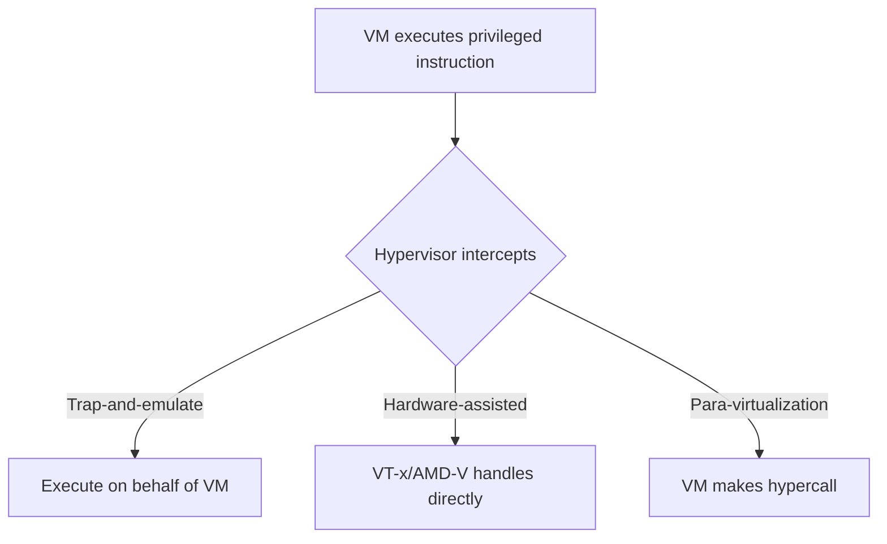
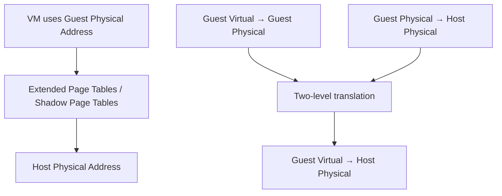
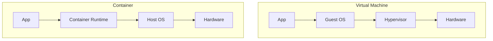

# Hypervisors

## Overview

A hypervisor (Virtual Machine Monitor) is software that creates and runs virtual machines. It sits between the hardware and the VMs, managing resource allocation and isolation. Understanding hypervisors is fundamental to cloud computing, as they are the technology that enables multi-tenancy and on-demand infrastructure.

## Types of Hypervisors

### Type 1: Bare-Metal Hypervisor



The hypervisor runs directly on the hardware. No host OS needed.

| Hypervisor | Vendor | Use Case |
|------------|--------|----------|
| VMware ESXi | VMware | Enterprise data centers |
| KVM | Open source (Linux) | Linux servers, cloud (OpenStack, AWS) |
| Xen | Open source | AWS (older), Citrix |
| Hyper-V | Microsoft | Windows Server, Azure |

### Type 2: Hosted Hypervisor



The hypervisor runs on top of a host OS. Extra layer of overhead.

| Hypervisor | Vendor | Use Case |
|------------|--------|----------|
| VirtualBox | Oracle | Development, testing |
| VMware Workstation | VMware | Development, testing |
| Parallels | Parallels | macOS virtualization |

## How Hypervisors Work

### CPU Virtualization



- **Trap-and-emulate**: Privileged instructions trap to the hypervisor, which emulates them.
- **Hardware-assisted (VT-x/AMD-V)**: CPU has specific support for VM execution. VM runs directly on CPU, exits to hypervisor only for specific events.
- **Para-virtualization**: Modified OS makes explicit calls (hypercalls) to the hypervisor.

### Memory Virtualization



- **Shadow Page Tables**: Hypervisor maintains shadow page tables mapping guest virtual → host physical. Updated on every page table change (expensive).
- **Extended Page Tables (EPT)**: Hardware support (Intel EPT, AMD RVI). Two-level translation handled by CPU, minimal hypervisor involvement.

### I/O Virtualization

```mermaid
graph TD
    VM[VM I/O Request] --> METHOD{I/O Method}
    METHOD -->|Emulated| SW[Software emulation (slow)]
    METHOD -->|Para-virtual| PV[VirtIO drivers (fast)]
    METHOD -->|Passthrough| PT[Direct hardware access (fastest)]
    METHOD -->|SR-IOV| SRIOV[Single Root I/O Virtualization]
```

| Method | Performance | Flexibility | Use Case |
|--------|------------|-------------|----------|
| Emulated | Low | High (any OS) | Legacy compatibility |
| VirtIO | High | Medium (needs drivers) | Most VMs |
| Passthrough | Highest | Low (device dedicated to VM) | GPU, high-perf NIC |
| SR-IOV | High | Medium | Network I/O |

## KVM (Kernel-based Virtual Machine)

```mermaid
graph TD
    subgraph KVM[KVM Architecture]
        VM1[VM 1] --> KMOD[KVM Kernel Module]
        VM2[VM 2] --> KMOD
        KMOD --> CPU[CPU with VT-x]
        KMOD --> MEM[Memory (EPT)]
        QEMU[QEMU: Device Emulation] --> KMOD
    end

    KMOD --> LINUX[Linux Kernel]
    LINUX --> HW[Hardware]
```

KVM turns the Linux kernel into a Type 1 hypervisor:
- **KVM kernel module**: Handles CPU and memory virtualization.
- **QEMU**: Handles device emulation (disk, network, display).
- **VirtIO**: Para-virtualized drivers for high-performance I/O.

```bash
# Check KVM support
egrep -c '(vmx|svm)' /proc/cpuinfo

# Create a VM with QEMU/KVM
qemu-system-x86_64 \
    -enable-kvm \
    -m 4G \
    -smp 4 \
    -cdrom ubuntu.iso \
    -disk size=50G
```

## Container Runtime vs Hypervisor



See [VM vs Container](./vm-vs-container.md) for detailed comparison.

## Interview Questions

1. **Q: What is a hypervisor and what are the two types?**
   A: A hypervisor is software that creates and runs VMs. Type 1 (bare-metal) runs directly on hardware — KVM, ESXi, Xen. Type 2 (hosted) runs on a host OS — VirtualBox, VMware Workstation. Type 1 is faster and used in production; Type 2 is for development.

2. **Q: How does KVM work?**
   A: KVM is a Linux kernel module that turns the kernel into a Type 1 hypervisor. It uses VT-x for CPU virtualization and EPT for memory virtualization. QEMU handles device emulation. VirtIO provides para-virtualized I/O drivers. Together, they provide full hardware virtualization.

3. **Q: What is CPU overcommitment?**
   A: Allocating more virtual CPUs to VMs than physical cores exist. Works because VMs rarely use 100% CPU continuously. Typical ratio: 3:1 to 4:1. Beyond this, performance degrades due to CPU contention and scheduling overhead.

4. **Q: What is SR-IOV?**
   A: Single Root I/O Virtualization allows a single physical device (NIC) to appear as multiple virtual devices. Each VM gets direct access to a virtual function, bypassing the hypervisor for I/O. Provides near-native network performance for VMs.

5. **Q: How does memory virtualization work with EPT?**
   A: The VM uses guest physical addresses, which must be translated to host physical addresses. EPT (Extended Page Tables) adds a second page table maintained by the hypervisor. The CPU hardware walks both page tables automatically, avoiding the overhead of shadow page tables.

## Common Mistakes

- Overcommitting CPU/memory too aggressively — leads to performance degradation.
- Not using VirtIO drivers — emulated devices are much slower.
- Ignoring NUMA topology — VM memory should be on the same NUMA node as its CPU.
- Not reserving resources for the hypervisor — host OS needs resources too.
- Using Type 2 hypervisors in production — unnecessary overhead.

## Summary

Hypervisors enable virtualization by managing VM execution on shared hardware. Type 1 (bare-metal) is used in production (KVM, ESXi); Type 2 (hosted) is for development. Key techniques: CPU virtualization (VT-x), memory virtualization (EPT), and I/O virtualization (VirtIO, SR-IOV). KVM is the dominant open-source hypervisor, powering AWS, OpenStack, and most Linux-based clouds.

## Cross-References

- [VM vs Container](./vm-vs-container.md) — Detailed comparison
- [Virtualization Overview](./README.md) — Virtualization fundamentals
- [Cloud Overview](../overview.md) — Cloud computing basics
