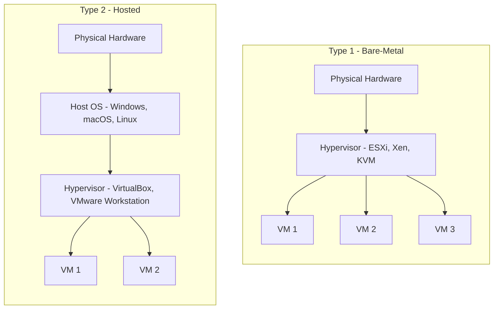
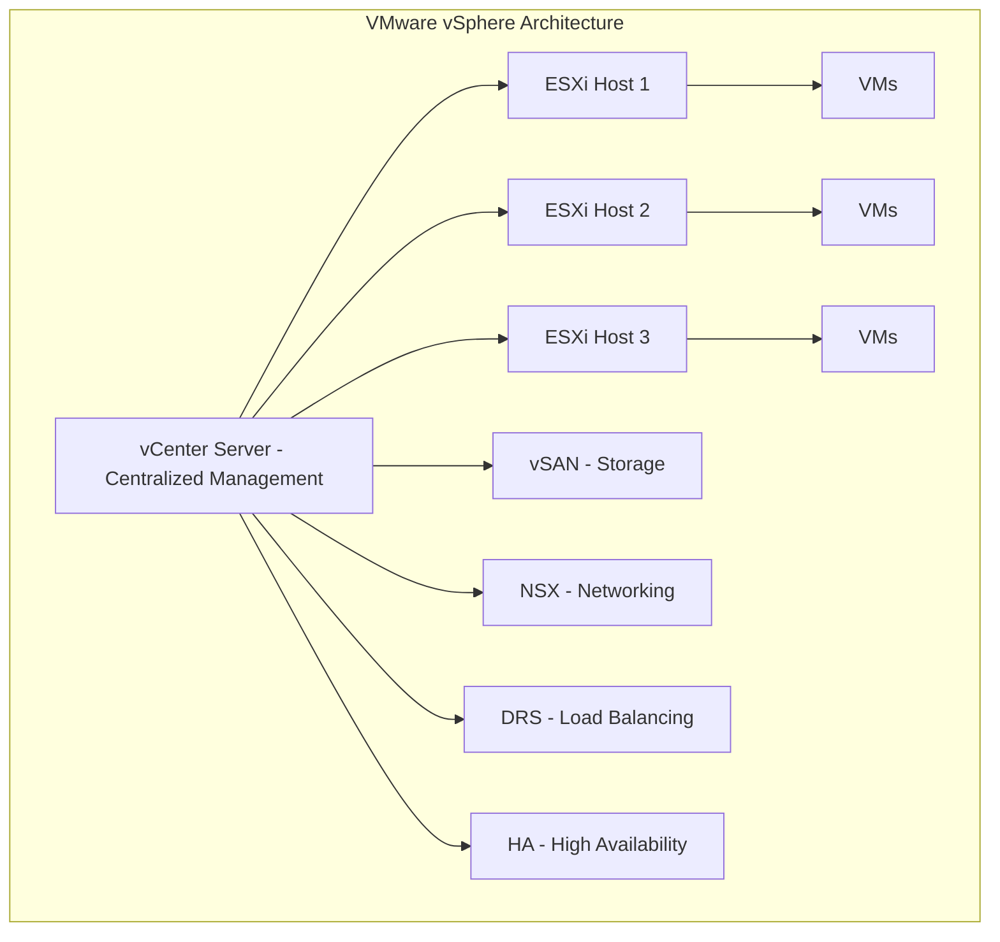
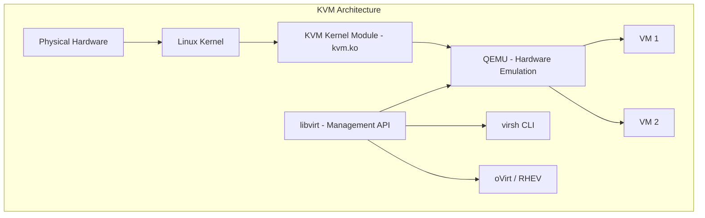
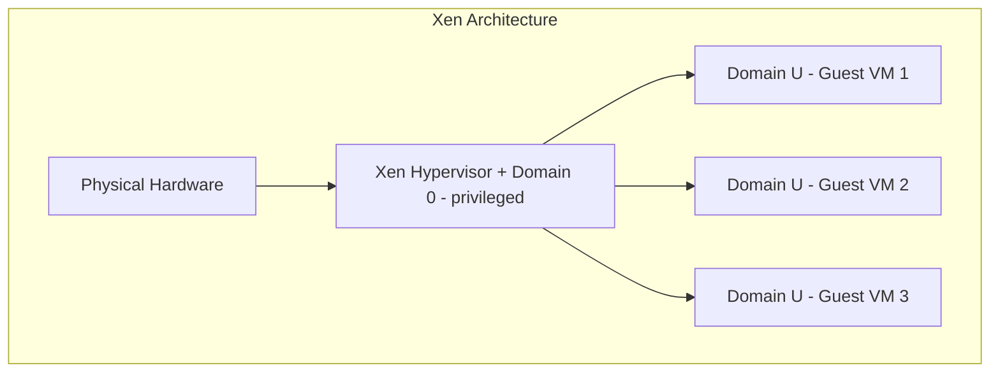
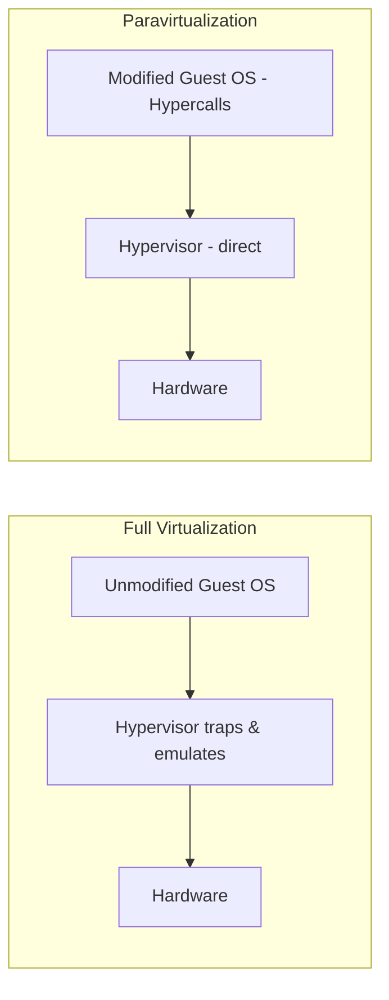
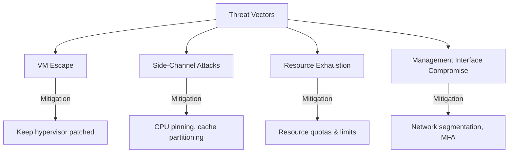

# Hypervisors

## Introduction

A hypervisor (also called Virtual Machine Monitor or VMM) is software that creates and runs virtual machines. It sits between the physical hardware and the virtual machines, abstracting hardware resources and allowing multiple VMs to share a single physical host.

## Type 1 vs Type 2 Hypervisors

### Type 1 (Bare-Metal) Hypervisors

Run directly on physical hardware without a host operating system.

| Aspect | Details |
|--------|---------|
| **Performance** | Near-native—no host OS overhead |
| **Security** | Smaller attack surface—no host OS to compromise |
| **Management** | Typically managed via web UI or CLI (no desktop) |
| **Use Case** | Production servers, data centers, cloud providers |
| **Examples** | VMware ESXi, Microsoft Hyper-V (Server), Xen, KVM |

### Type 2 (Hosted) Hypervisors

Run on top of a conventional operating system as an application.

| Aspect | Details |
|--------|---------|
| **Performance** | Overhead from host OS layer |
| **Security** | Host OS vulnerabilities affect all VMs |
| **Management** | GUI application on desktop |
| **Use Case** | Development, testing, learning, desktop virtualization |
| **Examples** | VirtualBox, VMware Workstation/Fusion, Parallels |

### Comparison Table

| Feature | Type 1 (Bare-Metal) | Type 2 (Hosted) |
|---------|---------------------|-----------------|
| **Runs on** | Directly on hardware | On host OS |
| **Performance** | Higher | Lower (host OS overhead) |
| **Security** | Better (smaller surface) | Weaker (host OS exposure) |
| **Scalability** | Hundreds of VMs | Few VMs (desktop limited) |
| **Setup** | Dedicated server | Install like any app |
| **Use Case** | Production/enterprise | Development/testing |
| **Cost** | Enterprise licensing | Often free |

## Major Hypervisor Technologies

### VMware ESXi

The industry-leading Type 1 hypervisor, widely used in enterprise data centers.

**Key Features:**
- **vMotion**: Live migration of running VMs between hosts
- **DRS (Distributed Resource Scheduler)**: Automatic load balancing
- **HA (High Availability)**: Automatic VM restart on host failure
- **Fault Tolerance**: Zero-downtime protection via continuous replication
- **vSAN**: Software-defined storage pooling local disks
- **NSX**: Network virtualization and micro-segmentation

### KVM (Kernel-based Virtual Machine)

A Type 1 hypervisor built into the Linux kernel. The most widely used open-source hypervisor.

**How KVM works:**
1. KVM kernel module (`kvm.ko`) turns Linux into a hypervisor
2. Each VM is a regular Linux process with virtual hardware
3. QEMU provides hardware emulation (disk, network, GPU)
4. Hardware extensions (Intel VT-x / AMD-V) enable near-native performance

**Why KVM dominates cloud:**
- AWS uses a customized KVM (Nitro Hypervisor)
- Google Cloud uses KVM
- OpenStack defaults to KVM
- Red Hat Enterprise Virtualization (RHEV) is based on KVM

### Xen

One of the earliest open-source hypervisors, known for its paravirtualization approach.

**Xen vs KVM:**

| Aspect | Xen | KVM |
|--------|-----|-----|
| **Architecture** | Separate hypervisor + Dom0 | Kernel module in Linux |
| **Paravirtualization** | Native (PV mode) | Via VirtIO drivers |
| **Management** | xl, xm, XenAPI | virsh, libvirt |
| **Used by** | AWS (historically), Citrix | AWS (current), Google Cloud, OpenStack |
| **Community** | Smaller, Citrix-driven | Larger, Linux community |

## Hypervisor Concepts

### Hardware-Assisted Virtualization

Modern CPUs include extensions that dramatically improve virtualization performance:

| Technology | Vendor | What It Does |
|-----------|--------|-------------|
| **Intel VT-x** | Intel | Hardware support for CPU virtualization |
| **AMD-V** | AMD | AMD's equivalent of VT-x |
| **Intel VT-d** | Intel | I/O device virtualization (direct device assignment) |
| **AMD-Vi** | AMD | AMD's I/O virtualization |
| **Intel EPT** | Intel | Extended Page Tables for memory virtualization |

Without hardware assistance, the hypervisor must trap and emulate privileged instructions—a process called "binary translation"—which is significantly slower.

### Paravirtualization vs Full Virtualization

| Aspect | Full Virtualization | Paravirtualization |
|--------|--------------------|--------------------|
| **Guest OS** | Unmodified | Modified to aware of hypervisor |
| **Performance** | Good with hardware assist | Better (direct hypercalls) |
| **Compatibility** | Any OS | Only modified OS |
| **Example** | KVM with VT-x, VMware | Xen PV, KVM with VirtIO |

### VirtIO - Best of Both Worlds

VirtIO is a paravirtualization framework that provides high-performance I/O without modifying the guest OS kernel:

- **VirtIO-net**: Paravirtualized network driver
- **VirtIO-blk**: Paravirtualized block device driver
- **VirtIO-scsi**: Paravirtualized SCSI driver
- **VirtIO-fs**: Shared filesystem between host and guest

> **Interview Tip**: VirtIO is crucial for KVM performance. Always mention it when discussing KVM I/O optimization.

## Containers vs. VMs

While hypervisors virtualize hardware, containers virtualize the operating system. Understanding both is essential for modern infrastructure.

### Architecture Comparison

Virtual Machines run a full OS per instance on top of a hypervisor, providing strong hardware-level isolation. Containers share the host OS kernel and isolate at the process level using namespaces and cgroups.

### Detailed Comparison

| Aspect | Virtual Machines | Containers |
|--------|-----------------|------------|
| **Virtualization level** | Hardware (full OS) | OS kernel (process isolation) |
| **Isolation** | Strong (separate kernel) | Weaker (shared kernel) |
| **Startup time** | Minutes | Seconds (milliseconds) |
| **Size** | GBs (includes OS) | MBs (app + dependencies) |
| **Overhead** | Higher (full OS per VM) | Minimal (shared kernel) |
| **Density** | 10s per host | 100s-1000s per host |
| **Security** | Better (hardware isolation) | Good (with seccomp, AppArmor) |
| **OS support** | Any OS (Windows, Linux, macOS) | Same kernel only |
| **Persistent state** | Full OS state | Ephemeral by design |
| **Use case** | Legacy apps, different OSes | Microservices, cloud-native |

### Container Isolation Technologies

| Technology | What It Does |
|-----------|-------------|
| **Namespaces** | Isolate view of system (PID, network, mount, user) |
| **cgroups** | Limit resources (CPU, memory, I/O, network) |
| **seccomp** | Restrict system calls (syscall filtering) |
| **AppArmor/SELinux** | Mandatory access control policies |
| **Capabilities** | Fine-grained privilege control |

### When to Use VMs vs Containers

**Use VMs when:**
- Running untrusted code (multi-tenant SaaS)
- Need different OS (Windows app on Linux host)
- Regulatory compliance requires hardware isolation
- Running legacy applications that need full OS

**Use Containers when:**
- Microservices architecture
- CI/CD pipelines
- Cloud-native applications
- Need fast scaling and deployment

**Use Both (VM + Container):**
- Run containers inside VMs for additional isolation
- AWS Fargate, Google Cloud Run run containers on managed VMs
- Kata Containers provide lightweight VMs with container semantics
- gVisor (Google) provides a user-space kernel for container isolation

## Hypervisor Security Considerations

- **VM Escape**: Guest breaks out of VM to access host—most severe vulnerability
- **Side-Channel Attacks**: Spectre/Meltdown—exploit shared CPU caches between VMs
- **Resource Starvation**: One VM consuming all resources (noisy neighbor)
- **Management Plane**: Compromising vCenter/XenAPI gives control over all VMs

## Interview Questions

### Q1: What is a hypervisor? Explain the two types.
**Answer**: A hypervisor is software that creates and manages virtual machines by abstracting physical hardware. Type 1 (bare-metal) runs directly on hardware—examples: ESXi, KVM, Xen. Type 2 (hosted) runs on top of an OS—examples: VirtualBox, VMware Workstation. Type 1 offers better performance and security (no host OS overhead); Type 2 is easier to set up for development.

### Q2: How does KVM work? Is it Type 1 or Type 2?
**Answer**: KVM is technically a Type 1 hypervisor. It's a kernel module (`kvm.ko`) that turns the Linux kernel itself into a hypervisor. Each VM is a Linux process scheduled by the kernel. QEMU provides hardware emulation, and VirtIO provides paravirtualized I/O for performance. Since the Linux kernel directly manages hardware (no intermediate host OS), KVM qualifies as bare-metal despite running within Linux.

### Q3: What is the difference between full virtualization and paravirtualization?
**Answer**: Full virtualization runs an unmodified guest OS—the hypervisor traps and emulates privileged instructions (binary translation) or uses hardware extensions (Intel VT-x). Paravirtualization modifies the guest OS to make direct "hypercalls" to the hypervisor, avoiding the trap overhead. Full virtualization supports any OS; paravirtualization requires modified guests but offers better I/O performance. Modern systems use VirtIO to get paravirtualization benefits with minimal guest modification.

### Q4: Why did AWS switch from Xen to KVM?
**Answer**: AWS migrated to KVM (as the Nitro Hypervisor) because: (1) KVM is deeply integrated into Linux, which AWS already uses; (2) Better performance with VirtIO and hardware offloading via Nitro cards; (3) Larger open-source community driving improvements; (4) Simpler architecture (no Dom0 overhead); (5) AWS could customize the Linux kernel and hypervisor together. The Nitro system offloads networking, storage, and management to dedicated hardware, making the hypervisor nearly overhead-free.

### Q5: What is live migration and how does it work?
**Answer**: Live migration moves a running VM from one physical host to another without downtime. The process: (1) Pre-copy phase—copy memory pages to destination while VM runs on source; (2) Iterative phase—copy only pages that changed since last copy; (3) Stop-and-copy phase—brief pause (milliseconds) to transfer final CPU state and remaining dirty pages; (4) VM resumes on destination. Used for host maintenance, load balancing, and disaster avoidance.

## Common Mistakes

1. **Confusing KVM's classification**: KVM is Type 1 (bare-metal), not Type 2, despite running inside Linux
2. **Ignoring VirtIO drivers**: Running VMs with emulated (non-VirtIO) I/O causes severe performance degradation
3. **Overcommitting memory**: Hypervisor memory overcommitment can cause VM swapping and unpredictable performance
4. **Neglecting hypervisor patching**: Hypervisor vulnerabilities (VM escape) are critical—patch immediately
5. **Not using hardware extensions**: Running without Intel VT-x/AMD-V enabled forces binary translation, dramatically reducing performance
6. **Snapshot sprawl**: Keeping snapshots for extended periods degrades VM performance and wastes storage

## Summary

| Hypervisor | Type | Key Strength | Used By |
|-----------|------|-------------|---------|
| **VMware ESXi** | Type 1 | Enterprise ecosystem (vSphere, vCenter) | Enterprise data centers |
| **KVM** | Type 1 | Linux-native, open-source, high performance | AWS, Google Cloud, OpenStack |
| **Xen** | Type 1 | Paravirtualization pioneer | Citrix, legacy AWS |
| **Hyper-V** | Type 1 | Windows integration | Microsoft ecosystem |
| **VirtualBox** | Type 2 | Free, cross-platform | Developers, testers |
| **VMware Workstation** | Type 2 | Professional features | Developers, enterprises |

## Cross-References

- **Virtualization Overview**: [README](./README.md) — Types of virtualization
- **VMs vs Containers**: [Comparison](./vm-vs-container.md) — When to use VMs vs containers
- **AWS EC2**: [Instance Types](../aws/ec2.md) — How AWS uses KVM/Nitro
- **Kubernetes**: [Pods](../kubernetes/pods.md) — Container orchestration on top of VMs
- **Cloud Overview**: [Service Models](../overview.md) — How hypervisors enable IaaS
