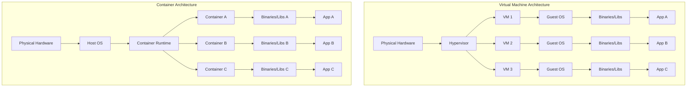
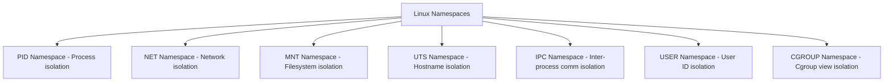
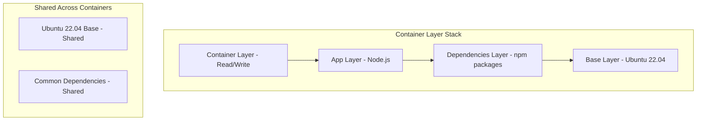
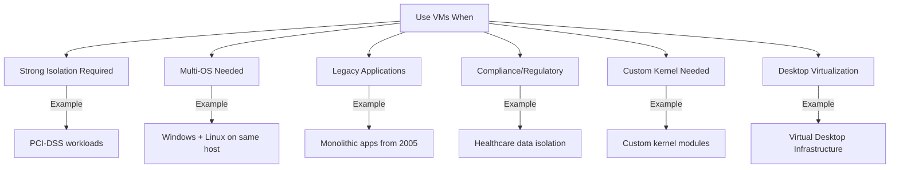
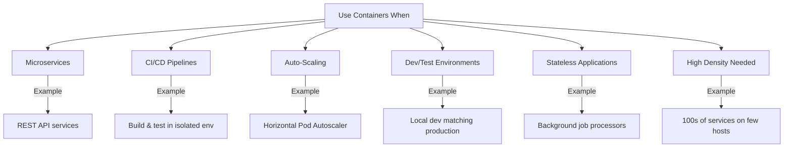
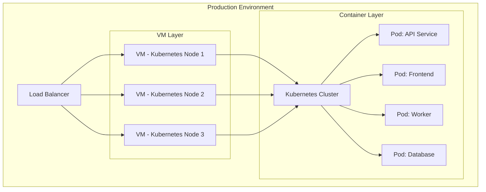
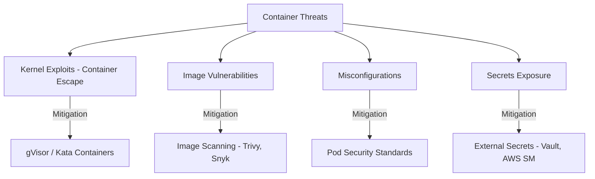

# VMs vs Containers

## Introduction

Virtual Machines and Containers are the two dominant virtualization approaches in modern computing. Understanding their differences, trade-offs, and ideal use cases is essential for making architectural decisions and for cloud/placement interviews.

## Architecture Comparison



## Side-by-Side Comparison

| Aspect | Virtual Machines | Containers |
|--------|-----------------|------------|
| **Virtualization Level** | Hardware (full OS per VM) | OS kernel (shared kernel) |
| **Isolation** | Strong (separate kernel) | Weaker (shared kernel) |
| **Size** | GBs (includes full OS) | MBs (only app + dependencies) |
| **Startup Time** | Minutes | Seconds (or milliseconds) |
| **Performance** | Near-native (with hardware assist) | Native (no hypervisor overhead) |
| **Density** | Tens per host | Hundreds per host |
| **OS Support** | Any OS (Linux, Windows, BSD) | Same kernel as host (Linux containers on Linux) |
| **Security** | Stronger (hardware boundary) | Weaker (kernel shared) |
| **Portability** | VM image format (OVF, QCOW2) | Container image (OCI standard) |
| **Persistent State** | Full filesystem, easy stateful | Ephemeral by design, volumes for state |
| **Resource Overhead** | Higher (full OS per VM) | Minimal (shared kernel) |
| **Management** | vSphere, OpenStack | Kubernetes, Docker Swarm |

## How Containers Work (Technical Deep Dive)

Containers use Linux kernel features for isolation:

### Namespaces

Namespaces provide isolated views of system resources:



| Namespace | Isolates | What It Means |
|-----------|----------|---------------|
| **PID** | Process IDs | Container sees only its own processes (PID 1 = entrypoint) |
| **NET** | Network stack | Container has its own IP, ports, routing tables |
| **MNT** | Mount points | Container has its own filesystem view |
| **UTS** | Hostname | Container can have its own hostname |
| **IPC** | Shared memory | Isolated inter-process communication |
| **USER** | User/group IDs | Container root ≠ host root (with user namespaces) |

### Control Groups (cgroups)

cgroups limit and monitor resource usage:

```bash
# Example cgroup limits (what Docker does behind the scenes)
memory.limit_in_bytes = 512M       # Max memory
cpu.cfs_quota_us = 50000           # 50% of one CPU
blkio.weight = 500                 # I/O priority
pids.max = 100                     # Max processes
```

| Resource | cgroup Control | Docker Flag |
|----------|---------------|-------------|
| **CPU** | `cpu.cfs_quota_us` | `--cpus=1.5` |
| **Memory** | `memory.limit_in_bytes` | `--memory=512m` |
| **I/O** | `blkio.throttle.read_bps_device` | `--device-read-bps` |
| **PIDs** | `pids.max` | `--pids-limit=100` |

### Union Filesystem (OverlayFS)

Containers use layered filesystems for efficiency:



**Benefits of Layering:**
- Base layers are shared across containers (saves disk space)
- Only the top container layer is writable (copy-on-write)
- Images are built incrementally (faster builds, efficient caching)

## When to Use VMs



**Best for:**
1. **Security-critical workloads**: When you need kernel-level isolation (different tenants, compliance)
2. **Running different OS**: Windows apps on Linux hosts (or vice versa)
3. **Legacy applications**: Apps that require specific OS versions or kernel modules
4. **Desktop virtualization**: VDI solutions (Citrix, VMware Horizon)
5. **Kernel customization**: Apps that need custom kernel parameters or modules

## When to Use Containers



**Best for:**
1. **Microservices**: Small, independent services that scale independently
2. **CI/CD**: Consistent build/test environments, fast provisioning
3. **Cloud-native applications**: Designed for horizontal scaling
4. **Development environments**: "Works on my machine" → works everywhere
5. **High density**: Maximize resource utilization on fewer hosts

## Hybrid Approaches

In practice, many organizations use both:



**Common pattern**: Run containers inside VMs
- VMs provide strong multi-tenant isolation at the infrastructure level
- Containers provide fast deployment, scaling, and density at the application level
- Cloud providers run your containers on VMs (EKS nodes are EC2 instances)

## Container Security Considerations

Since containers share the host kernel, security requires extra attention:



### Runtime Sandboxing

For stronger container isolation without full VMs:

| Solution | Approach | Trade-off |
|----------|----------|-----------|
| **gVisor** | User-space kernel (intercepts syscalls) | Performance overhead, strong isolation |
| **Kata Containers** | Lightweight VM per container | Near-VM isolation, container UX |
| **Firecracker** | MicroVM by AWS (used in Lambda/Fargate) | VM security, container speed |

### Container Image Security

```bash
# Scan images for vulnerabilities
trivy image myapp:latest

# Use minimal base images
FROM gcr.io/distroless/static:nonroot  # Instead of ubuntu:latest

# Don't run as root
USER 65534  # nobody user

# Multi-stage builds to minimize attack surface
FROM golang:1.21 AS builder
RUN go build -o app .

FROM gcr.io/distroless/static
COPY --from=builder app /app
```

## Performance Comparison

| Metric | VM | Container | Notes |
|--------|-----|-----------|-------|
| **Boot time** | 30-60 seconds | 100ms - 2 seconds | Containers don't boot an OS |
| **Memory overhead** | 512MB-1GB (OS) | 1-10MB | Shared kernel saves memory |
| **Disk overhead** | 1-10GB (OS image) | 10-100MB | Layer sharing helps |
| **Max per host** | 10-50 | 100-1000+ | Containers are much lighter |
| **I/O performance** | 90-95% native | 95-100% native | VMs have hypervisor overhead |
| **Network latency** | +0.1-0.5ms | +0.01-0.1ms | VM network goes through virtual switch |

## Interview Questions

### Q1: What are the main differences between VMs and containers?
**Answer**: VMs virtualize hardware via a hypervisor—each VM runs a full OS kernel, providing strong isolation but with significant overhead (GBs, minutes to boot). Containers share the host OS kernel using namespaces and cgroups for isolation—they're lightweight (MBs, seconds to boot) and offer higher density. VMs provide stronger security boundaries (hardware-level isolation); containers are faster to deploy and scale. VMs can run any OS; containers share the host's kernel.

### Q2: When would you choose VMs over containers?
**Answer**: Choose VMs when: (1) Strong isolation is required (multi-tenant, compliance like PCI-DSS), (2) You need to run a different OS (Windows on Linux host), (3) Legacy applications need specific OS versions or kernel modules, (4) Security requirements mandate hardware-level boundaries. Containers are better for microservices, CI/CD, auto-scaling, and when you need high density and fast provisioning.

### Q3: How do containers achieve isolation without a hypervisor?
**Answer**: Containers use Linux kernel features: (1) Namespaces isolate what a process can see (PID, network, filesystem, hostname, IPC, users), (2) cgroups limit what resources a process can use (CPU, memory, I/O, PIDs), (3) Seccomp filters restrict which syscalls a container can make, (4) AppArmor/SELinux enforce mandatory access controls. This provides process-level isolation, which is weaker than VM's hardware-level isolation but much lighter.

### Q4: What is a container escape and how do you prevent it?
**Answer**: Container escape is when an attacker breaks out of the container to access the host system, typically through kernel vulnerabilities. Prevention: (1) Keep host kernel and container runtime patched, (2) Use minimal, trusted base images, (3) Don't run containers as root, (4) Apply seccomp profiles to restrict syscalls, (5) Use AppArmor/SELinux, (6) Consider sandboxed runtimes (gVisor, Kata Containers) for untrusted workloads, (7) Enable user namespaces to remap container root.

### Q5: Explain the concept of container image layering.
**Answer**: Container images use a union filesystem (OverlayFS) with multiple read-only layers stacked together. Each layer represents a set of filesystem changes. Layers are shared across images (e.g., multiple images using the same Ubuntu base share that layer). A writable container layer is added on top when a container runs. Benefits: efficient storage (shared layers), faster pulls (only missing layers downloaded), and efficient builds (layer caching). Dockerfile instructions each create a layer.

### Q6: Can containers replace VMs entirely?
**Answer**: Not entirely. Containers and VMs serve different purposes. Containers excel at application packaging and microservices but share the host kernel, making them unsuitable for workloads requiring strong isolation (multi-tenant with different trust levels), running different operating systems, or needing custom kernels. The industry trend is containers inside VMs—VMs for infrastructure isolation, containers for application agility. Technologies like Kata Containers and Firecracker blur the line by offering VM-level isolation with container-like speed.

## Common Mistakes

1. **Treating containers as VMs**: Running systemd, SSH, and multiple processes in a container defeats the purpose—one process per container
2. **Storing state in containers**: Containers are ephemeral; use volumes or external storage for persistent data
3. **Running as root**: Default container root can escalate to host root without user namespaces
4. **Using `latest` tag**: Unpredictable builds; always pin specific versions
5. **Ignoring image size**: Bloated images slow CI/CD and increase attack surface
6. **Not setting resource limits**: Without cgroup limits, one container can starve the entire host
7. **Assuming containers are secure by default**: They're not—seccomp, AppArmor, and non-root users must be configured

## Summary

| Aspect | VM | Container |
|--------|-----|-----------|
| **Isolation** | Strong (hardware boundary) | Moderate (kernel shared) |
| **Overhead** | High (full OS) | Low (shared kernel) |
| **Boot Time** | Minutes | Seconds |
| **Size** | GBs | MBs |
| **Density** | Tens/host | Hundreds/host |
| **Best For** | Multi-OS, legacy, compliance | Microservices, CI/CD, scaling |
| **Orchestration** | vSphere, OpenStack | Kubernetes, Docker Swarm |
| **Security** | Stronger by design | Needs careful configuration |

## Cross-References

- **Virtualization Overview**: [README](./README.md) — Types of virtualization
- **Hypervisors**: [Deep Dive](./hypervisors.md) — The VM technology layer
- **Kubernetes Pods**: [Pod Lifecycle](../kubernetes/pods.md) — Container orchestration
- **Docker**: Container runtime and image building
- **AWS Lambda**: [Serverless](../aws/lambda.md) — Containers/Firecracker microVMs
- **CI/CD Pipelines**: [Stages](../cicd/pipelines.md) — Container-based CI/CD
