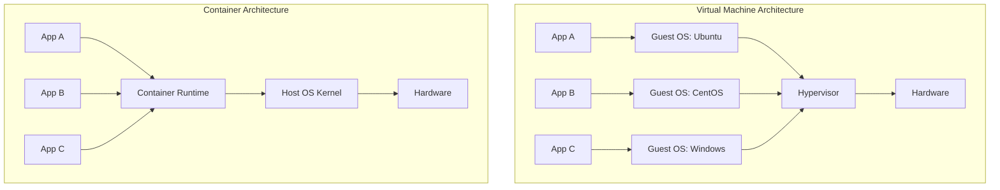
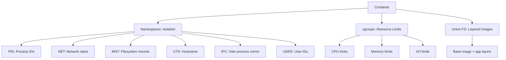
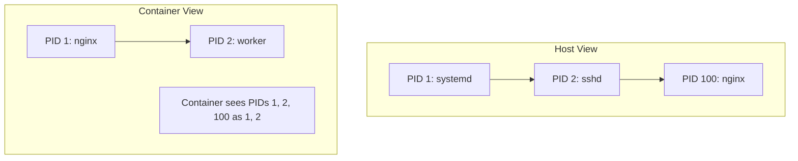
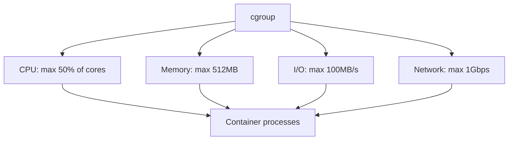
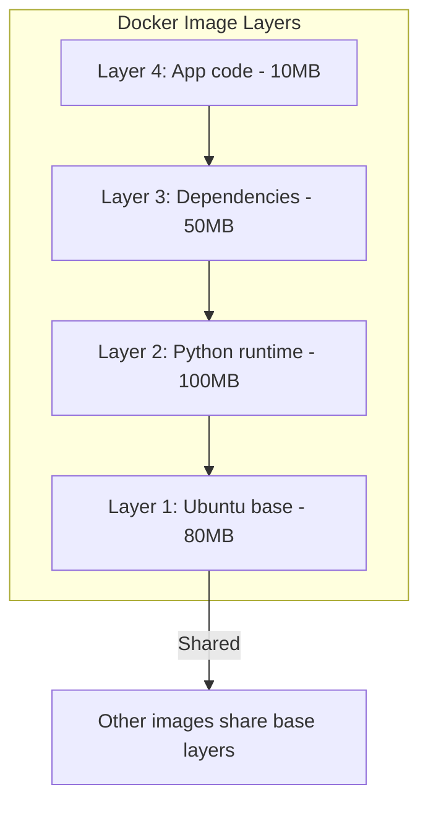
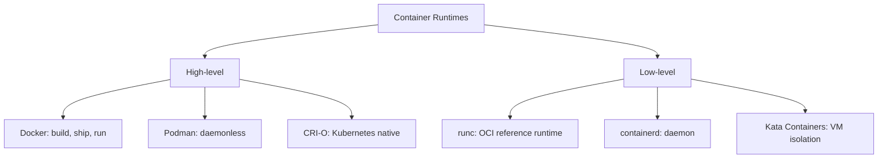
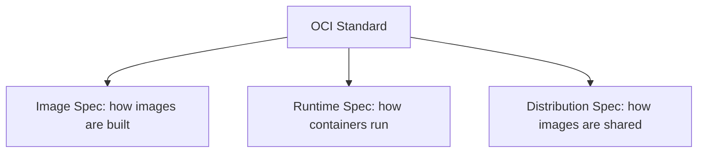
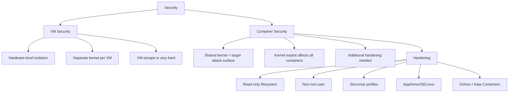

# VM vs Container

## Overview

Virtual Machines and Containers are the two primary approaches to application isolation and deployment. VMs virtualize hardware with a full OS per instance; containers share the host OS kernel and isolate at the process level. Understanding the trade-offs between them is essential for cloud architecture decisions and interviews.

## Architecture Comparison



## Detailed Comparison

| Feature | Virtual Machine | Container |
|---------|----------------|-----------|
| Isolation | Full (hardware level) | Process level (namespaces, cgroups) |
| OS | Full guest OS per VM | Shares host kernel |
| Startup time | 30s–minutes | <1s |
| Size | GBs (includes OS) | MBs (app + dependencies) |
| Overhead | 5-15% (hypervisor) | ~0% (native performance) |
| Density | 10-50 per host | 100-1000s per host |
| Security | Stronger (hardware isolation) | Weaker (shared kernel) |
| OS support | Any OS | Same kernel (Linux VMs on Windows) |
| Persistence | Full filesystem | Ephemeral (use volumes) |

## How Containers Work

### Linux Kernel Features



### Namespaces



Namespaces give containers their own view of system resources. A container's PID 1 is actually PID 100 on the host.

### cgroups (Control Groups)



cgroups enforce resource limits. If a container exceeds its memory limit, the OOM killer terminates its processes.

### Container Image Layers



Images are built in layers. Each layer is read-only. The container adds a writable layer on top. Multiple containers can share base layers, saving disk space.

## Container Runtimes



### OCI (Open Container Initiative)



OCI standardizes container formats so any runtime can run any image.

## When to Use What

```mermaid
graph TD
    CHOICE{Decision} --> VM_OR_CONTAINER{Need full OS isolation?}
    VM_OR_CONTAINER -->|Yes| USE_VM[Use VM]
    VM_OR_CONTAINER -->|No| C_ORCH{Need orchestration?}
    C_ORCH -->|Yes| K8S[Kubernetes + Containers]
    C_ORCH -->|No| SIMPLE{Simple deployment?}
    SIMPLE -->|Yes| DOCKER[Docker Containers]
    SIMPLE -->|No| SERVERLESS[Serverless (Lambda)]

    USE_VM --> VM1[Legacy apps, Windows on Linux, security-critical]
    K8S --> K1[Microservices, scaling, CI/CD]
    DOCKER --> D1[Development, simple services]
    SERVERLESS --> SL1[Event-driven, short-lived tasks]
```

| Use Case | Recommendation |
|----------|---------------|
| Legacy Windows app on Linux host | VM |
| Microservices architecture | Containers + Kubernetes |
| Development environment | Containers (Docker) |
| Multi-tenant SaaS | VMs (stronger isolation) |
| CI/CD pipelines | Containers |
| Running untrusted code | VMs or Kata Containers |
| High-density workloads | Containers |

## Security Comparison



## Container Orchestration

See [Kubernetes](../kubernetes/README.md) for container orchestration.

## Interview Questions

1. **Q: What is the difference between a VM and a container?**
   A: A VM virtualizes hardware with a full guest OS, managed by a hypervisor. It provides strong isolation but is heavyweight (GBs, minutes to start). A container shares the host OS kernel and isolates at the process level using namespaces and cgroups. It's lightweight (MBs, seconds to start) but has weaker isolation.

2. **Q: How do containers achieve isolation without a hypervisor?**
   A: Containers use Linux kernel features: namespaces (isolated view of PIDs, network, filesystem) and cgroups (resource limits on CPU, memory, I/O). Each container thinks it has its own OS, but it's sharing the host kernel. This is lighter than hardware virtualization.

3. **Q: When would you choose VMs over containers?**
   A: When you need strong security isolation (multi-tenant with untrusted code), when running different OS kernels (Windows on Linux), for legacy applications that require specific OS versions, or when compliance requires hardware-level isolation.

4. **Q: What is the OCI standard?**
   A: The Open Container Initiative standardizes container image format, runtime specification, and distribution. This ensures images built with Docker can run on Podman, CRI-O, or any OCI-compliant runtime. It prevents vendor lock-in.

5. **Q: What are Kata Containers?**
   A: Kata Containers combine container semantics with VM isolation. Each container runs inside a lightweight VM (with its own kernel), providing hardware-level isolation while maintaining container workflow compatibility. Used when containers handle untrusted code.

## Common Mistakes

- Running stateful databases in containers without persistent volumes.
- Using containers for multi-tenant isolation without additional hardening.
- Building images with root user — security risk.
- Not setting resource limits — one container can starve others.
- Storing secrets in container images — use environment variables or secret management.

## Summary

VMs provide strong hardware-level isolation with a full OS per instance; containers provide lightweight process-level isolation sharing the host kernel. Containers are faster to start, smaller, and enable higher density. VMs offer stronger security and OS flexibility. Modern architectures often combine both: VMs for infrastructure isolation, containers for application deployment.

## Cross-References

- [Hypervisors](./hypervisors.md) — VM technology
- [Kubernetes](../kubernetes/README.md) — Container orchestration
- [Docker](../kubernetes/pods.md) — Container runtime in pods
- [Cloud Overview](../overview.md) — Cloud fundamentals
