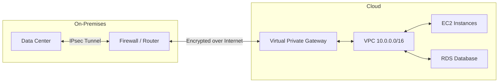
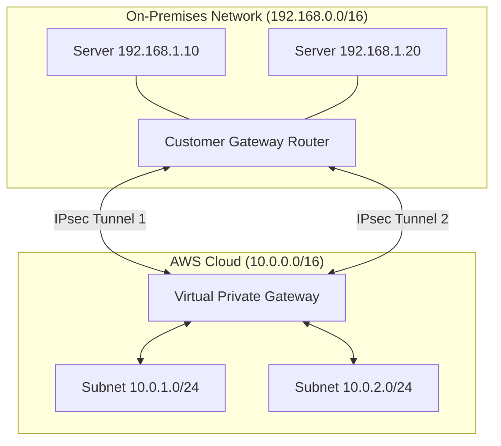
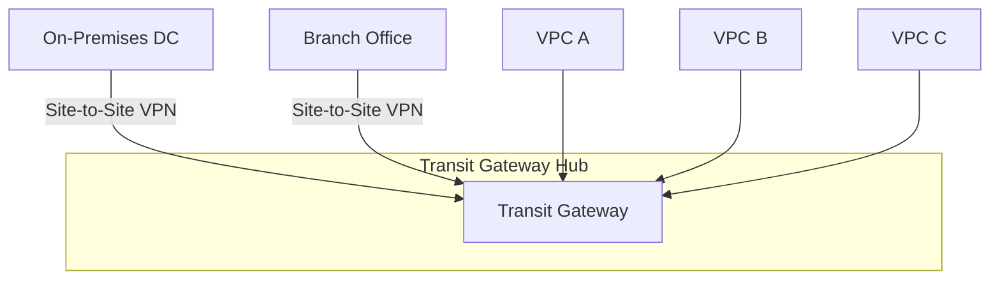
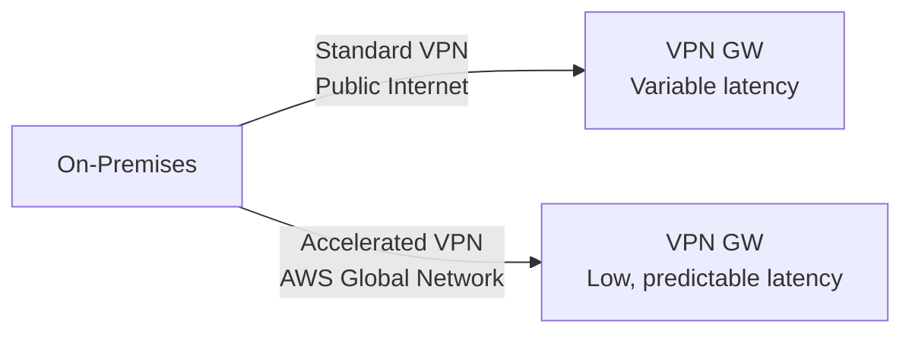

# Cloud VPN (Virtual Private Network)

## Overview

A cloud VPN securely connects your on-premises network to your cloud VPC, creating a private, encrypted tunnel over the public internet. This hybrid connectivity allows resources in both environments to communicate as if they were on the same private network.

## Why Cloud VPN?



| Direct Internet Access | Cloud VPN |
|------------------------|-----------|
| Public IPs exposed | Private connectivity |
| Data traverses internet unencrypted | IPsec encrypted tunnel |
| No routing integration | BGP or static routing |
| Security risk for sensitive data | Compliant for regulated workloads |

## VPN Types

### Site-to-Site VPN (IPsec)

Connects an entire on-premises network (or data center) to a cloud VPC.



**IPsec Tunnel Details:**

| Parameter | Value |
|-----------|-------|
| Protocol | IPsec (IKEv1 or IKEv2) |
| Encryption | AES-256 |
| Authentication | SHA-2 (256-bit) |
| Key exchange | IKE (Diffie-Hellman) |
| Tunnel mode | Encapsulating Security Payload (ESP) |
| Dead Peer Detection | 10/30 second intervals |

### Client VPN (OpenVPN-based)

Provides individual users (work from home, remote access) secure access to cloud resources.


### Transit Gateway VPN

For organizations with many VPCs and on-premises locations, Transit Gateway acts as a hub:



## Routing

### Static Routing

```hcl
# AWS Terraform example
resource "aws_vpn_gateway_route_propagation" "example" {
  vpn_gateway_id      = aws_vpn_gateway.example.id
  route_table_id      = aws_route_table.example.id
}
```

Manually specify CIDR blocks. Simple but doesn't adapt to topology changes.

### Dynamic Routing (BGP)

| Feature | Static | BGP |
|---------|--------|-----|
| Configuration | Manual CIDR entries | Automatic route exchange |
| Failover | Manual or health check | Automatic (BGP path selection) |
| Scalability | Tedious for many routes | Scales to thousands of routes |
| Complexity | Low | Medium |
| Use case | Small, simple networks | Enterprise, multi-site |

BGP uses ASN (Autonomous System Number). AWS provides a private ASN (64512-65534 or Amazon's 10124) or you can use your own public ASN.

## VPN vs Direct Connect

| Feature | VPN | Direct Connect |
|---------|-----|----------------|
| **Bandwidth** | Up to 1.25 Gbps | 1 Gbps to 100 Gbps |
| **Latency** | Variable (internet) | Consistent, low |
| **Cost** | Per-hour + data transfer | Port + data transfer |
| **Setup time** | Minutes | Weeks (physical circuit) |
| **Redundancy** | Multiple tunnels | Multiple connections |
| **Encryption** | IPsec (built-in) | Optional MACsec |
| **SLA** | 99.9% (per tunnel) | 99.9%–99.99% |
| **Best for** | Low-bandwidth, bursty, quick setup | High-throughput, latency-sensitive |

## Accelerated VPN

AWS Accelerated VPN routes traffic through the AWS global network instead of the public internet:



- Reduces jitter and packet loss
- Improves performance for global connectivity
- Uses AWS edge locations as entry/exit points
- No additional cost beyond the acceleration charge

## Security Considerations

| Concern | Mitigation |
|---------|-----------|
| **Tunnel encryption** | IPsec with AES-256, SHA-2, PFS (Perfect Forward Secrecy) |
| **Key rotation** | IKE rekeying every 1 hour (default) |
| **Split tunneling** | Only route cloud-bound traffic through VPN |
| **Logging** | CloudWatch logs for VPN connections |
| **Access control** | Security groups and NACLs on VPC side; firewall rules on-premises |
| **Multi-factor auth** | Required for Client VPN (IAM + MFA) |

## High Availability

### Redundant Tunnels

Each VPN connection creates **two IPsec tunnels** across different AZs for redundancy:

```
Customer Gateway
    │
    ├── Tunnel 1 (AZ-a) ──▶ Virtual Private Gateway
    │                        │
    └── Tunnel 2 (AZ-b) ──▶ VPN GW (AZ-b)
```

With BGP, failover is automatic. With static routing, use route health checks or manual switchover.

### Multi-Region

For cross-region connectivity:

1. **VPC Peering + VPN** in each region
2. **Transit Gateway** with inter-region peering
3. **Direct Connect Gateway** for multiple regions

## Pricing

| Component | Cost |
|-----------|------|
| VPN connection (per-hour) | $0.05/hour |
| Data transfer (out) | $0.01/GB |
| Accelerated VPN connection | $0.10/hour |
| Client VPN connection | $0.05/hour + $0.06/GB |
| Transit Gateway attachment | $0.05/hour + data transfer |

## Interview Questions

1. **How would you design a highly available hybrid network?** Two VPN connections with BGP routing, each with two tunnels across different AZs. Use Transit Gateway for multi-VPC routing. Consider Direct Connect for production with VPN as backup.

2. **What is split tunneling and when should you use it?** Split tunneling routes only cloud-bound traffic through the VPN; general internet traffic goes directly. Use it to reduce VPN bandwidth consumption for Client VPN users.

3. **How does BGP failover work with VPN tunnels?** Each tunnel advertises the same routes with different AS paths or local preferences. If tunnel 1 goes down, BGP withdraws those routes and traffic shifts to tunnel 2 automatically.

4. **VPN or Direct Connect for a startup?** Start with VPN for speed and low cost. Migrate to Direct Connect when bandwidth needs exceed 500 Mbps, latency requirements are strict, or compliance mandates private connectivity.

5. **How do you monitor VPN health?** Use CloudWatch metrics (TunnelState, DataIn/Out), set alarms on tunnel state changes, configure VPN log delivery to CloudWatch Logs, and use BGP route monitoring for dynamic routing.

## Key Takeaways

- Cloud VPN provides encrypted, private connectivity between on-premises and cloud over the public internet
- Site-to-Site VPN for data center connectivity; Client VPN for individual remote access
- Two tunnels per connection provide built-in redundancy; BGP enables automatic failover
- VPN is fast to set up and cost-effective; Direct Connect for high-throughput, latency-sensitive workloads
- Transit Gateway scales VPN connectivity to hundreds of VPCs and on-premises sites
- Always use AES-256 encryption, PFS, and proper key rotation for compliance
- Accelerated VPN routes through the AWS global network for improved performance

## Cross-References

- [VPC](./aws/vpc.md) — Network foundation for VPN endpoints
- [Linux VPN](../linux/networking/vpn.md) — VPN fundamentals and protocols
- [WireGuard](../linux/networking/wireguard.md) — Modern VPN protocol
- [TLS](../linux/networking/tls.md) — Encryption fundamentals
- [Disaster Recovery](./disaster-recovery.md) — VPN as DR connectivity
- [Multi-Region Architecture](../sre/multi-region.md) — Cross-region VPN design
