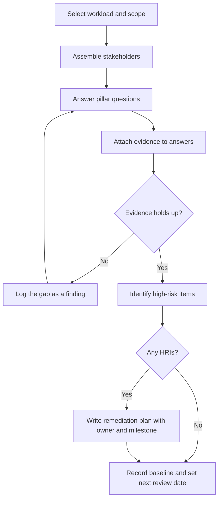
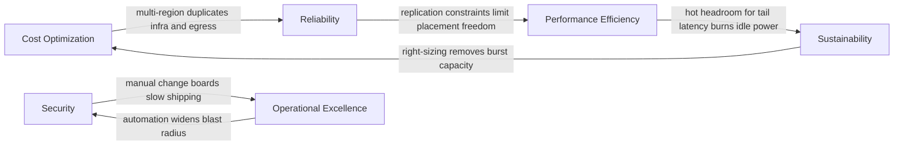

# Well-Architected Frameworks: Design Reviews as Instruments

## Overview

The cloud vendors publish more than APIs — they publish *architecture frameworks*: structured question sets that encode how their best engineers judge a workload. The AWS Well-Architected Framework and the Azure Well-Architected Framework are the two most consequential examples, and both are designed to be used as review instruments, not just read as whitepapers. This page covers why they exist, the AWS six pillars and the Azure five, the lens concept, how a review actually runs in practice, and the pillar-vs-pillar trade-offs the frameworks themselves admit they create. Interviews probe this material constantly at cloud-heavy companies, usually as "how would you evaluate whether this design is any good?" — the frameworks are the industry's vocabulary for answering that.

The reading order of this page mirrors how the material shows up at work: first the pillars as shared vocabulary, then the lenses as specialization, then the mechanics of running a review. That last part matters most in senior loops, because "we ran a Well-Architected review" is exactly the kind of sentence that gets probed for depth — who was in the room, what evidence backed the answers, what happened to the findings. A candidate who can answer those three questions convincingly is describing real engineering governance; one who cannot is describing a slide deck.

## Why Architecture Frameworks Exist

First, they are codified institutional knowledge. Before AWS published the Well-Architected Framework in 2015, the knowledge inside it — capacity planning discipline, failure-domain thinking, identity hygiene — lived in senior engineers' heads, postmortem write-ups, and scattered blog posts. Each pillar question is a scar turned into a question: "when was recovery last tested end-to-end?" is what an organization writes down after discovering during an incident that its backups restore into a region where its AMIs don't exist. The framework converts that tacit, expensive knowledge into an explicit checklist any team can run, which is why it is readable in an afternoon and applicable well beyond AWS.

Second, a review is a forced conversation about trade-offs. The pillars conflict — cheaper or more reliable is a real choice, not a gotcha — and the framework's job is not to hand out answers but to make teams state which trade-off they picked and why. A review question like "can each cost line map to an owning team?" forces an organization to confront unattributable spend it has been quietly ignoring. In interviews, this framing matters: candidates who treat the pillars as a compliance checklist sound junior, while candidates who treat each pillar as an axis of tension and articulate the trade-off sound like someone who has actually operated a workload.

Third, the principles are cloud-agnostic even though the packaging is vendor-branded. Strip the service names from "stop guessing capacity" and you have the classic capacity-planning discipline; strip the marketing from "enable traceability" and you have audit logging and structured observability, ideas that predate cloud and will outlive any provider's feature set. The real skill is translating the vendor question into your system's terms — see [Cloud Computing Overview](./overview.md) for the service-model context these frameworks assume. Interviewers at multi-cloud shops specifically probe whether you understand the underlying principle or just the AWS branding of it.

A fourth, quieter function: the framework is organizational memory and an onboarding accelerator. A new engineer reading the question set absorbs two years of a team's operational history in an afternoon, because every question implies an incident class the organization decided to guard against. Teams also invert the instrument for greenfield work, asking the reliability and security questions at design time — in the RFC — rather than auditing the steady-state system after the first outage. That inversion, review as a design tool rather than a compliance artifact, is the single highest-leverage way to use a framework; the audit-only pattern wastes most of its value.

A fair criticism keeps the framework honest: the pillars are a floor, not a ceiling. The question sets lag new architectures — the lens catalog absorbed serverless years before it grappled with LLM-backed applications — and both frameworks are written from a hyperscaler's commercial vantage point, which nudges answers toward managed services and away from the build-your-own end of the spectrum. A senior engineer treats the review as one input among several — incident history, chaos-experiment results, SLO attainment — and says so plainly when asked. Knowing what the instrument cannot measure is part of knowing how to use it.

## The AWS Well-Architected Framework: Six Pillars

The AWS framework defines six pillars: Operational Excellence, Security, Reliability, Performance Efficiency, Cost Optimization, and Sustainability. Sustainability was added in December 2021, extending the original five. Each pillar ships with design principles, a question set in the free Well-Architected Tool (a console service that walks a workload through roughly 55 questions), and definitions of what a "high-risk" answer looks like. Reviews are scoped to a *workload* — a set of components delivering a business function with a named owner — not to an entire organization, which keeps the conversation concrete.

### Operational Excellence

The pillar's core question: can you run and evolve the workload effectively, and gain insight to keep doing so? Its design principles include performing operations as code — infrastructure, runbooks, and procedures versioned, reviewed, and executed the same way every time — making frequent, small, reversible changes rather than quarterly big-bang releases, and learning from all operational events through blameless postmortems. The canonical anti-pattern is tribal ops: the only person who can safely deploy is on vacation, runbooks exist as Slack scrollback, and change procedures are whatever the last incident forced people to improvise. The pillar also asks teams to anticipate failure explicitly — pre-mortems, failure-mode tables — and to define operational health metrics for the workload, so reliability has a number the same way latency does. A team scoring well here can answer "what changed last week, who changed it, and can you undo it?" in seconds, from version history rather than memory. This is where SRE practice and cloud tooling meet — see [Incident Management](../sre/incident-management.md) for the operational side.

### Security

The core question: how do you protect information, systems, and assets while still delivering business value? Design principles include a strong identity foundation — least privilege everywhere, no shared accounts, centralized identity ([AWS IAM Internals](./aws/iam-internals.md) covers the machinery) — enabling traceability so every action on any layer is attributable and auditable, and applying security at all layers: edge, VPC, host, application, and data. The framework also pushes automation of security posture, which is exactly what [Policy as Code](./policy-as-code.md) operationalizes, and it treats data protection in transit and at rest plus incident-response readiness as first-class questions — not just whether you have a security plan, but whether you have practiced one. The anti-pattern is castle-and-moat architecture: one hard perimeter, flat trust inside, and long-lived admin credentials shared by the whole team — precisely the model zero-trust thinking was invented to replace.

### Reliability

The core question: does the workload perform its intended function consistently, and how does it recover from failure? Its design principles read like an SRE syllabus: stop guessing capacity and scale against measured demand, test recovery procedures deliberately through game days and fault injection ([Chaos Engineering](../sre/chaos-engineering.md)), automatically recover from failure, scale horizontally to shrink blast radius, and manage change through automation so recovery is repeatable. The anti-pattern is the untested DR plan: a beautifully written runbook that has never been executed, whose restore procedure turns out to depend on a manual step or a credential nobody rotated. The vocabulary this pillar installs matters in interviews: recovery time objective (RTO) and recovery point objective (RPO) are how business tolerance becomes engineering targets, and the framework treats them as decisions to be documented and tested rather than aspirations. Reliability that is not measured is not managed — see [SLOs and Error Budgets](../sre/slo-error-budget.md).

### Performance Efficiency

The core question: does the workload use computing resources efficiently, and does it keep meeting requirements as demand grows and technology evolves? Design principles include favoring managed and serverless services so the provider absorbs undifferentiated scaling work, experimenting frequently — benchmark new instance families and storage engines and let data decide rather than habit — and going global in minutes by pushing content to edge caches. The anti-pattern is sizing by inertia: a monolith on one 2x-large instance because last year's service ran on a 2x-large, never benchmarked, never revisited, and defended by "it works." The principle AWS labels "mechanical sympathy" — knowing what the underlying hardware and network actually do well — is why the framework pushes benchmarking over defaulting: a random-IOPS-bound workload will not thank you for a throughput-optimized disk, and a bursty API will not thank you for an instance family with poor per-core performance. Elasticity is the pillar's core lever — see [Autoscaling](./autoscaling.md) — and multi-tenant interference is its blind spot — see [Noisy Neighbors](./noisy-neighbors.md).

### Cost Optimization

The core question: can the workload deliver business outcomes at the lowest price point? Design principles include measuring overall efficiency as cost per unit of work delivered rather than staring at the absolute monthly bill, attributing spend to owning teams through tagging and showback so someone is accountable for each line, adopting consumption-based pricing, and deliberately using cheaper interruptible capacity where the workload tolerates it ([Spot and Preemptible Instances](./spot-preemptible.md)). The anti-pattern is unattributable spend: shared accounts, no tagging discipline, idle dev environments running 24/7, and a finance org that can only answer "what does the cloud bill pay for?" with "engineering, presumably." The consumption principle also cuts both ways, and strong answers say so: pay-as-you-go removes over-provisioning waste but makes commitment discounts (Reserved Instances, Savings Plans, reservations) an explicit forecasting decision, so review questions probe whether anyone models commitment coverage against measured baseline demand. The operating model for this pillar is FinOps — see [FinOps and Cloud Cost](../sre/finops-cloud-cost.md).

### Sustainability

The core question: how do you minimize the environmental impact of running the workload? Design principles include quantifying your impact before optimizing it, maximizing utilization — one well-packed host beats three idle ones, since idle capacity still draws power — right-sizing hardware to actual demand, and adopting newer, more efficient hardware and managed offerings when the data justifies it. The anti-pattern is the zombie estate: old clusters nobody decommissions, every derivative of every dataset retained forever because storage is nominally cheap, and per-service micro-clusters at 8% average utilization. Region choice is the pillar's quiet lever: identical code emits meaningfully different carbon in different electricity grids, so for flexible workloads the sustainability questions converge on the same spatial-shifting decision the scheduling literature answers. Energy waste is an externality only until you measure it — see [Carbon-Aware and Energy-Aware Scheduling](./carbon-aware-scheduling.md).

### The pillars at a glance

| Pillar | Core question | Representative review check | Common failure |
|---|---|---|---|
| Operational Excellence | Can you run and evolve the workload with insight? | Are runbooks and procedures versioned as code and actually exercised? | Heroic tribal ops, unreviewed manual changes |
| Security | How do you protect data, systems, and assets? | Is every action attributable to a least-privilege identity? | Shared admin credentials, flat internal trust |
| Reliability | Does it meet demand and recover from failure? | When was recovery last tested end-to-end, and what broke? | Untested DR plans, capacity sized by guesswork |
| Performance Efficiency | Do you use resources efficiently as demand changes? | How were instance families chosen — benchmark data or habit? | Pet-instance monoliths, no elasticity |
| Cost Optimization | Lowest price point for the business outcome? | Can each cost line be mapped to an owning team and a unit metric? | Untagged spend, idle environments, no showback |
| Sustainability | How do you minimize environmental impact? | What is average host utilization, and what is the data lifecycle? | Zombie clusters and datasets, chronic under-utilization |

Read the table as an interview prompt: for any pillar you claim depth in, be ready to produce the core question, one design principle, one anti-pattern, and one number — utilization, tag coverage, an RTO measured in a drill, or minutes of error budget remaining. Frameworks reward specifics; hand-waving across all six pillars reads as having run none of them.

### Where this book develops each pillar

Each pillar has deeper treatment elsewhere in the book, and the two reinforce each other: the review question locates the gap, the linked chapter supplies the practice. If an interview answer needs a concrete follow-through, this mapping is the follow-through.

| Pillar | Book treatments |
|---|---|
| Reliability | [SLOs and Error Budgets](../sre/slo-error-budget.md), [Disaster Recovery](./disaster-recovery.md), [Chaos Engineering](../sre/chaos-engineering.md) |
| Cost Optimization | [FinOps and Cloud Cost](../sre/finops-cloud-cost.md), [Spot and Preemptible Instances](./spot-preemptible.md), [Capacity Planning](../sre/capacity-planning.md) |
| Security | [Policy as Code](./policy-as-code.md), [AWS IAM Internals](./aws/iam-internals.md) |
| Performance Efficiency | [Autoscaling](./autoscaling.md), [Noisy Neighbors](./noisy-neighbors.md) |
| Sustainability | [Carbon-Aware and Energy-Aware Scheduling](./carbon-aware-scheduling.md) |
| Operational Excellence | [Incident Management](../sre/incident-management.md) |

## Lenses: Domain Overlays on the Same Pillars

A lens is a companion whitepaper that keeps the six-pillar structure but swaps in a domain-specific question set, re-weighting what matters for an architectural style or an industry. The Serverless Applications Lens, for example, replaces instance-sizing questions with cold-start budgets, function memory tuning, idempotent handlers behind at-least-once delivery, and concurrency-limit analysis — the failure modes of [serverless](./advanced/serverless.md), not of EC2 fleets. The HPC Lens asks about tightly coupled jobs, batch schedulers, and parallel filesystem throughput; the IoT Lens asks about device identity at fleet scale and intermittent connectivity; the SaaS Lens asks about tenant isolation models, per-tenant onboarding tiers, and — inevitably — noisy-neighbor controls.

The industry lenses add regulatory overlays on top of architecture. The Financial Services Industry lens and the Healthcare Industry lens keep the same pillars but add controls anchored to compliance obligations — data residency, audit evidence, encryption and key-management expectations — so a review produces artifacts a compliance auditor can consume. What a lens *changes* is concrete: extra questions inside existing pillars, different definitions of high-risk answers, and references to domain patterns. It does not change the pillar structure, which is the whole point: a SaaS team runs the base framework plus the SaaS lens, and their reliability questions now talk about tenant blast radius instead of generic uptime. Illustrative of what each lens surfaces:

| Lens | Question emphasis it adds | Typical finding it is built to catch |
|---|---|---|
| Serverless Applications | Throttling behavior, handler idempotency, cold-start budgets, per-function memory tuning | Retry storm against a shared concurrency limit takes the platform down |
| HPC | Tightly coupled jobs, batch scheduling, parallel filesystem throughput | One straggler node poisons a synchronized job's wall time |
| SaaS | Tenant isolation model, onboarding tiers, per-tenant rate limits | A free-tier neighbor degrades a premium tenant's latency |
| IoT | Device identity at fleet scale, intermittent connectivity, staged firmware rollout | Credential-rotation rollout bricks a device fleet |
| Machine Learning | Data quality, feature pipelines, training/serving skew | Offline metric gains that evaporate in production |
| Financial Services / Healthcare | Residency, audit evidence, key-management controls | Evidence gaps an auditor rejects at certification time |

When do you use one? When the workload's dominant architectural style or industry obligations change which failure modes matter most. Running the base framework alone on a serverless platform wastes the review on questions about AMI patching that are provider problems, not yours; running only a lens skips baseline questions like identity hygiene that every workload still needs. A lens is concrete about its delta, which is what makes it more than a re-badged chapter. The Serverless Lens asks how the workload behaves when a downstream dependency throttles — retry storms against a shared concurrency limit are a serverless-specific outage class — whether every handler is idempotent because delivery is at-least-once, and what the cold-start budget is per user interaction; none of these questions exist in the base framework. The Machine Learning Lens, by contrast, spends its questions on data quality, feature pipelines, and training/serving skew, treating the model as just another deployable artifact. Reading a lens is also a fast way to absorb a domain's failure taxonomy: the question list is, in effect, the domain's top-ten incident list written by people who have had all ten.

The interview-worthy observation is that lenses are the framework's admission that one question set cannot fit every architecture — the pillar skeleton is invariant, but the evidence of excellence is domain-specific. Naming that design decision, and its cost (you must still run the base questions, or invariant risks like identity hygiene slip through), converts a memorized fact into an engineering judgment. That conversion is what the interviewer is actually grading.

One lens anti-pattern deserves its own warning: lens-collecting. Teams that pull in three lenses "to be thorough" assemble a question set nobody can finish, and the review collapses back into box-ticking. One base framework plus one lens is the working standard; a second lens is justified only when the workload genuinely spans both domains — a SaaS product whose platform is serverless is the canonical case.

## The Azure Well-Architected Framework

Microsoft's equivalent defines five pillars: Cost Optimization, Operational Excellence, Performance Efficiency, Reliability, and Security — the same skeleton as AWS minus a standalone sustainability pillar (Azure publishes sustainability guidance, but not as a sixth pillar). Azure's framework is delivered as Microsoft Learn modules with an interactive self-service assessment rather than a console tool, and it emphasizes five *design areas* per workload — reliability, security, cost optimization, operational excellence, and performance efficiency — each with trade-off guidance rather than a flat checklist. Azure's reliability pillar absorbed what earlier versions of the framework discussed under "resiliency," so older material may use that term; the substance — failure-mode analysis, redundancy targets, recovery objectives — is the same. See [Microsoft Azure](./azure.md) for the platform context.

The security pillar anchors its checks to the Azure Security Benchmark — Microsoft's control catalog for the platform — the way AWS reviews lean on the security pillar's question set plus account-level guardrails; the substance (least privilege, encryption defaults, attributable actions) matches. Azure's framework is also unusually explicit that every design decision is a trade-off: each design area ships trade-off guidance that names what you give up for what you gain, which makes it arguably the better teaching material if you read only one vendor's version. Both vendors additionally publish reference architectures and service-specific guidance so a recommendation can be traced down to a concrete configuration.

The two frameworks map nearly one-to-one, which is the point worth stating in interviews: beneath the branding, both vendors are asking the same five-to-six questions about your workload. In a multi-cloud organization the practical question is whether to run both frameworks or standardize on one. Running each workload's review in its native framework keeps terminology aligned with the provider's own tooling and recommendations; standardizing on one question set keeps review culture and training unified while the other provider's services get mapped in. Most shops that operate seriously on two clouds end up with one dominant question set plus a translation table — the mapping below is that table.

| Concern | AWS Well-Architected | Azure Well-Architected |
|---|---|---|
| Pillars | Six, including Sustainability | Five; sustainability published as guidance, not a pillar |
| Reliability terminology | Reliability | Reliability (earlier material says "resiliency") |
| Delivery vehicle | Whitepaper + free Well-Architected Tool in the AWS console | Microsoft Learn modules + online assessment |
| Domain overlays | Lenses: serverless, HPC, SaaS, IoT, FSI, healthcare, ML, analytics | Design areas with service-specific guidance and workload guides |
| Adjacent process doc | AWS Cloud Adoption Framework (org-level: business, people, governance, platform, security, operations) | Microsoft Cloud Adoption Framework (strategy → plan → ready → adopt → govern → manage, with landing zones) |
| Cost-pillar emphasis | Consumption model, tagging and showback, rightsizing, spot capacity | Pricing calculator, reservations and savings plans, Azure Cost Management |

The adjacent process docs matter as much as the frameworks themselves. A Well-Architected review is *workload-scoped* — one product, one team's remit — while a Cloud Adoption Framework is *organization-scoped*: governance, landing zones, migration waves, operating model. A common enterprise failure is running CAF landing-zone projects with no WAF discipline at the workload level (governed but fragile), or the inverse (well-reviewed workloads on an ungoverned platform). In a multi-cloud shop, the practical consequence of the near-1:1 pillar mapping is that a team fluent in one framework can run the other's review with an afternoon of terminology mapping — the questions differ in emphasis, not in kind.

## Running a Review in Practice

### Workload selection and scoping

Workload selection comes first, and it is a scoping exercise, not a formality. A workload needs a named owner, a business function, and boundary statements: which components are in scope, which environments are excluded, which dependencies are assumed. Enterprises with hundreds of workloads prioritize by business criticality and rate of change — revenue-path workloads and anything that just changed materially get reviewed first. Scoping mistakes poison everything downstream: if the review silently excludes the data layer, the reliability answers are fiction, and everyone in the room knows it. Writing the exclusions down matters as much as stating the inclusions: a scoping paragraph in the review document, naming what is out of bounds and why, is cheap insurance against confident answers about a system you did not actually review.

### Stakeholder assembly

Stakeholder assembly is where reviews are won or lost. The minimum viable panel is the workload owner, the architect or tech lead, an operations/on-call representative, a security representative, and finance for the cost pillar — plus, critically, the people who actually ship and operate the code. Reviews die when only architects attend: the question "are runbooks exercised?" answered by the person who wrote them last year, rather than the person paged at 3 a.m., produces optimistic fiction. The people answering must be the people living the answers.

### The question-answer-evidence loop

The question-answer-evidence loop is the core mechanism. For each question the tool asks, the team commits to an answer *and attaches evidence*: a link to the autoscaling policy in the IaC repo, a dashboard URL, the last game-day report, a billing export with tag coverage. The evidence discipline is what converts opinion into audit — it also exposes the gap pattern in the diagram below, where an attempted answer reveals missing instrumentation or missing tests, which is itself a finding.

Wiring evidence sources up before the review, rather than hunting for them during it, changes the meeting's character: the IaC repository and its change history, the autoscaling policy and its scaling-activity log, the last game-day or chaos-experiment report, a billing export with tag coverage, an access review for privileged roles, and the policy engine's latest compliance report each answer whole families of questions on sight. Teams that skip this spend the review negotiating about facts; teams that do it spend the review arguing about decisions.



Two exits in that loop deserve attention. The No exit on evidence is a finding, not a failure — a question the team cannot answer with evidence is a question about an unmanaged part of the system, and surfacing that is the point. The HRI exit is where the review earns its cost: catching an untested restore procedure before an incident rather than after one.

Concretely, a well-run answer looks like this — question, answer, and evidence in one place:

```text
REL: How do you test recovery procedures?
Answer: Quarterly game days; last full failover drill 2026-09-14.
Evidence:
  - runbook: ops/runbooks/region-failover.md (last commit 2026-09-20)
  - drill report: gamedays/2026-09-14.md (3 findings, 2 closed)
  - gap found: restore took 47 min against a 15 min RTO target
Outcome: logged as a high-risk item with a remediation milestone.
```

The gap in that example is the review working as intended: the answer sounded fine ("we run game days"), and the evidence produced a finding with a deadline. Answers without evidence never produce this effect, which is why the evidence discipline — not the question count — is the actual quality control of a review.

### High-risk items, cadence, and anti-patterns

A high-risk item (HRI) is a question whose answer indicates a significant risk of downtime, data loss, or security breach — untested recovery, unattributable admin access, unencrypted sensitive data at rest. Each HRI gets a written remediation plan with a named owner and a milestone date, and the tool tracks them across reviews until closed; an HRI list that never burns down is the clearest possible signal that the review program is theater.

Review cadence is anchored to change, not to calendar alone: run a full review at major architecture changes and re-review at least quarterly, treating each pass as a baseline diff — "did the security answers regress since March?" is a far more useful question than a one-off verdict.

Reviews also do not have to be a marathon meeting. A common shape is async-first: the questionnaire circulates for a week with evidence attached, and the live session — 60 to 90 minutes — is spent only on the contested answers, where the panel disagrees or where evidence is missing. Reviewing the disagreements instead of reading every question aloud is what keeps senior people willing to attend the second time.

The AWS Well-Architected Tool formalizes this loop: each answer carries a risk level (no risk, medium, high), high-risk answers become the HRIs, remediation plans are recorded with an owner and a target milestone, and the workload's answers persist as a baseline the next review diffs against. Azure's interactive assessment works the same way in spirit — a questionnaire that outputs a prioritized recommendation list rather than a pass/fail grade. The tools are free; what they cannot supply is the honesty of the answers, which is why everything above this paragraph is about who is in the room.

Program mechanics vary less than teams fear. The review program is usually owned by a platform or engineering-effectiveness group that nominates workloads from a service catalog, schedules the panel, and tracks HRI burn-down between sessions; the workload team owns the answers, and the program team owns the cadence. Splitting those two roles is what keeps the review from becoming either a self-congratulation session or an ambush.

The review's output should fit on one page: risk by pillar, the open HRI list with owners and milestone dates, and the two or three architectural decisions the review recommends revisiting. Anything longer does not get read; anything shorter usually means the evidence step was skipped. The one-pager is also what you attach to the next RFC that touches the workload, which closes the loop between review and design.

| Anti-pattern | Symptom | Working alternative |
|---|---|---|
| Box-ticking theater | Entire workload rated green in 45 minutes; no evidence attached to any answer | Sample one answer per pillar and demand the evidence trail live |
| Review as compliance | Run annually for an auditor; HRI list frozen since last year | Track HRI burn-down like an SLO; review at every major architecture change |
| Launch-only review | Reviewed once before launch, never again as the system drifted | Re-baseline quarterly; diff answers between reviews |
| Solo review | One engineer answers all six pillars in an afternoon | Stakeholder panel; ops and finance answer their own pillars |

Two mechanics make findings stick beyond the meeting. First, fold reviews into the change process: any major architecture RFC carries forward the open HRIs of the workloads it touches, so remediation gets scheduled where engineering time is actually allocated instead of competing with it invisibly. Second, treat the answer diff between reviews — this quarter versus last — as a regression signal the way you treat SLO attainment: a pillar that slid from green to yellow is a story about what changed in the team, and it is usually a better use of the next retrospective than the score itself.

## Where the Pillars Collide

The frameworks are candid that pillars conflict — the Azure material literally publishes "trade-offs" sections, and AWS design principles regularly trade one pillar against another. Three conflicts come up in nearly every real review, and the diagram maps the tensions. Each is argued below to its strongest form on both sides, because a trade-off you can only argue one side of is not a trade-off — it is a slogan. The frameworks ask you to record the decision, the rejected alternative, and the signal that would reverse it; that record (an architecture decision record is fine) is what separates a considered position from an inherited one.



**Cost vs reliability: single-region multi-AZ vs multi-region active-active.** The case for multi-region is real: it survives events that take out every AZ at once — control-plane failures, regional network incidents, botched provider upgrades — and it can halve latency for a geographically spread user base while satisfying data-residency demands. The case against is equally concrete: it roughly doubles infrastructure cost, multiplies egress and replication charges, forces you into distributed-state problems (conflicting writes, split-brain failover logic), and doubles the operational surface that every future engineer must understand. For a workload whose business case tolerates a regional outage — internal tooling, batch analytics, most B2B products behind a modest SLO — single-region multi-AZ plus a documented, *tested* pilot-light DR plan captures most of the reliability benefit at a fraction of the cost. The SLO arithmetic makes the comparison less fuzzy than it feels: 99.9% permits roughly 43 minutes of unavailability per month and 99.95% roughly 22, so the deciding input is business, not architectural — revenue loss per hour of full-region unavailability, stated as an SLO, weighed against the multi-region premium in spend and complexity. See [Disaster Recovery](./disaster-recovery.md) and [Multi-Region Architectures](../sre/multi-region.md).

**Performance vs sustainability.** The performance engineer's position: tail latency is bought with headroom, headroom means hosts idling below 30% CPU most of the day, and any scheme that packs load tighter or scales in aggressively converts a p99 spike into a capacity cliff. The physics is unforgiving in both directions: an idle server still draws a large fraction of its peak power, so a fleet averaging 25% utilization pays nearly full energy and embodied-carbon cost for a quarter of its capacity, while a fleet packed to 80% has nothing left when traffic spikes 30% in ten minutes. The sustainability position: that idle fleet draws power continuously — and its embodied-carbon share is already sunk — so chronic under-utilization is waste, and much of the "need" for headroom is a failure to model load rather than a physical constraint. Both are right about different workloads: genuinely latency-critical paths (ad bidding, trading) may deserve hot headroom, while batch and flexible workloads can shift in time and space to clean hours and regions and run tightly packed. The synthesis most shops land on is tiering — headroom where latency is contractual, density everywhere else — plus scale-in policies that actually fire. See [Autoscaling](./autoscaling.md) and [Carbon-Aware and Energy-Aware Scheduling](./carbon-aware-scheduling.md).

**Security vs operational excellence: manual change control vs automation.** The manual side argues that change advisory boards, peer sign-off at every step, and human gates prevent one engineer's mistake from propagating fleet-wide, and that slow shipping is a price worth paying for protected data. The operational side counters that manual gates demonstrably create drift (console changes nobody recorded), push teams toward shadow deployments and big-bang releases (because every change is expensive, batch more into each one), and fail precisely at incident time when the fastest safe response is automated. Automation's weakness is real too: a GitOps pipeline with a bad change merges into a fleet-wide outage in minutes. The synthesis is guardrails rather than gates — automated pipelines with policy-as-code admission checks, progressive delivery (canaries, bake windows, automatic rollback), and least-privilege deployment identities — so the blast radius of any single change is bounded mechanically instead of bureaucratically. See [Policy as Code](./policy-as-code.md) and [SLOs and Error Budgets](../sre/slo-error-budget.md) for the velocity-side discipline.

How to deploy this section in an interview: when asked to design a system, volunteer the framing unprompted — "this decision trades cost against reliability, and I would record which side we chose and why" — then pick one conflict and argue it honestly. Interviewers grade the willingness to name a losing alternative far higher than the choice itself, because the correct choice depends on business inputs the room has not given you. A closing line like "I would default to single-region multi-AZ until someone hands me a revenue-per-hour figure that justifies multi-region" is a complete, senior answer.

## Cross-References

- [Cloud Computing Overview](./overview.md) — service models and region/AZ context the frameworks assume
- [Microsoft Azure](./azure.md) — the platform behind the Azure Well-Architected Framework
- [Autoscaling](./autoscaling.md) — the performance-efficiency and reliability lever behind "stop guessing capacity"
- [Disaster Recovery](./disaster-recovery.md) — the tested-recovery discipline the reliability pillar demands
- [Policy as Code](./policy-as-code.md) — automated security and compliance checks; the guardrails pattern
- [Noisy Neighbors](./noisy-neighbors.md) — the multi-tenancy failure mode the SaaS lens focuses on
- [Spot and Preemptible Instances](./spot-preemptible.md) — the cost-optimization lever for interruptible work
- [Carbon-Aware and Energy-Aware Scheduling](./carbon-aware-scheduling.md) — the sustainability pillar operationalized
- [Serverless](./advanced/serverless.md) — the architectural style the Serverless Lens targets
- [SLOs and Error Budgets](../sre/slo-error-budget.md) — how the reliability pillar gets a number attached
- [FinOps and Cloud Cost](../sre/finops-cloud-cost.md) — the operating model for the cost-optimization pillar
- [Capacity Planning](../sre/capacity-planning.md) — the forecasting discipline beneath "stop guessing capacity"

## Interview Questions

1. **What is the AWS Well-Architected Framework, and what problem was it created to solve?** It is a structured review instrument — six pillars, each with design principles and a question set — that codifies how AWS's best teams judge a workload, published in 2015 to turn tacit institutional knowledge into an explicit checklist. The problem it solves is inconsistent engineering judgment: before it, whether a workload was well-designed depended on which senior engineer happened to look at it. It is workload-scoped by design, run through a free console tool that tracks answers and high-risk items across reviews. The framework's real product is the conversation — each question forces a team to state which pillar trade-off it chose, rather than handing down verdicts.

2. **Name the six pillars and give a design principle and an anti-pattern for two of them.** Operational Excellence, Security, Reliability, Performance Efficiency, Cost Optimization, and Sustainability (added 2021). For reliability: "test recovery procedures" is the design principle, and the anti-pattern is the DR runbook that has never been executed and fails on its first real restore. For cost optimization: "measure overall efficiency as cost per unit of work" is the principle, and the anti-pattern is untagged, unattributable spend where no team owns any line of the bill. Choosing which two to elaborate in the interview is itself the test — pick the pillars the role cares about and go concrete with numbers or incident stories.

3. **A team finished a Well-Architected review of a 40-service workload in 45 minutes with zero high-risk items. What do you suspect, and what do you check?** Almost certainly box-ticking: 40 services across six pillars genuinely produce at least a handful of high-risk answers in most organizations, so a clean sweep suggests questions were answered from memory without evidence. I would sample one answer per pillar and ask for the evidence trail live — the autoscaling policy in the IaC repo, the last game-day report, a billing export with tag coverage. I would also check who attended: if no on-call engineer or finance partner was in the room, the operational-excellence and cost answers are optimistic fiction. Finally, check whether the previous review's HRIs were ever closed — a frozen HRI list means the program is compliance theater.

4. **Argue both sides of single-region multi-AZ versus multi-region active-active for a mid-size SaaS with a 99.9% SLO.** For multi-region: it survives full-region events that multi-AZ cannot, improves latency for a spread user base, and may be forced anyway by data-residency obligations. Against: roughly doubled infrastructure and egress cost, distributed-state complexity (conflict resolution, failover semantics), and a doubled operational surface every future engineer must reason about. For a 99.9% SLO the arithmetic usually favors single-region multi-AZ — three nines allows about 43 minutes of downtime per month, which a multi-AZ design with tested recovery comfortably meets — with a pilot-light or warm-standby DR plan for the regional tail risk. The framework's contribution is forcing that decision to be written down as an explicit reliability-vs-cost trade-off tied to the business, not made by accident of budget.

5. **What is a lens, and when would you run the Serverless Lens instead of the base framework?** A lens is a companion question set that keeps the six-pillar skeleton but re-weights the questions for a domain — serverless, HPC, SaaS, IoT, machine learning — or an industry with regulatory overlays like the Financial Services or Healthcare lenses. You run the Serverless Lens when the workload's dominant style is functions and managed services, because base-framework questions about AMI patching and instance families are provider problems the lens replaces with cold-start budgets, function memory tuning, idempotency under at-least-once delivery, and concurrency-limit analysis. In practice reviews combine them: base framework for the invariant questions like identity hygiene, plus the lens for domain-specific failure modes. The interview-worthy point is that lenses acknowledge one question set cannot fit every architecture — the pillars are invariant, but the evidence of excellence is domain-specific.

6. **How do the AWS and Azure frameworks compare, and why does the mapping matter in a multi-cloud organization?** The pillars map nearly one-to-one — Azure defines five (Cost Optimization, Operational Excellence, Performance Efficiency, Reliability, Security) while AWS adds Sustainability as a sixth — and both are delivered with a workload-level review tool plus an organization-level Cloud Adoption Framework for governance and landing zones. The differences are emphasis and packaging: Azure publishes "trade-offs" guidance per design area and leans on Microsoft Learn, while AWS leans on the console tool and the lens ecosystem. The mapping matters practically because a team fluent in one framework can run the other's review after an afternoon of terminology translation — reliability and resiliency, cost attribution versus cost management — so multi-cloud shops standardize on the shared questions rather than maintaining two parallel review cultures. Candidates who know the underlying principles survive the vendor switch; candidates who memorized one vendor's branding do not.

## Key Takeaways

- Architecture frameworks are codified institutional knowledge: six-pillar (AWS) and five-pillar (Azure) question sets that turn scar tissue from real incidents into reviewable, evidence-backed questions.
- The pillars are trade-off axes, not a checklist — the review's product is the written record of which conflicts you chose to accept and why.
- AWS pillars: Operational Excellence, Security, Reliability, Performance Efficiency, Cost Optimization, Sustainability (2021); each has a core question, design principles, and a recognizable anti-pattern.
- Lenses keep the pillar skeleton but swap the question set for a domain or industry — serverless, HPC, SaaS, IoT, FSI, healthcare — changing what "high-risk" means.
- Azure's five pillars map nearly 1:1 onto AWS's; the shared skeleton plus each vendor's Cloud Adoption Framework (org-level) covers governance separately from workload reviews.
- A real review is workload-scoped, stakeholder-run (owner, architect, on-call, security, finance), and evidence-backed; HRIs get owners and milestone dates, and the review re-runs at major architecture changes and quarterly — diffing answers between reviews rather than issuing one-off verdicts.
- Used at design time — the RFC answering the reliability and security questions before code exists — a framework is at its highest leverage; used only as an annual audit, it decays into paperwork.
- The three classic collisions — cost vs reliability, performance vs sustainability, security vs operational excellence — resolve by tying the decision to a business quantity (revenue per hour, contractual latency, blast radius), not to architectural taste.

## References

- AWS Well-Architected — six pillars and lens catalog: <https://aws.amazon.com/architecture/well-architected/>
- Azure Well-Architected Framework — five pillars and design areas: <https://learn.microsoft.com/en-us/azure/well-architected/>
- Lens whitepapers (serverless, HPC, SaaS, IoT, machine learning, FSI, healthcare) are indexed from the AWS page above; the lens catalog rotates and grows, so treat the live page as canonical rather than any PDF snapshot.
- Beyer, B., Jones, C., Petoff, J., Murphy, N. (eds.), *Site Reliability Engineering: How Google Runs Production Systems*, O'Reilly, 2016 — the reliability pillar operationalized.
- The FinOps Foundation, *FinOps Framework* — the operating model behind the cost-optimization pillar (cited without URL; see [FinOps and Cloud Cost](../sre/finops-cloud-cost.md) for the in-book treatment).
