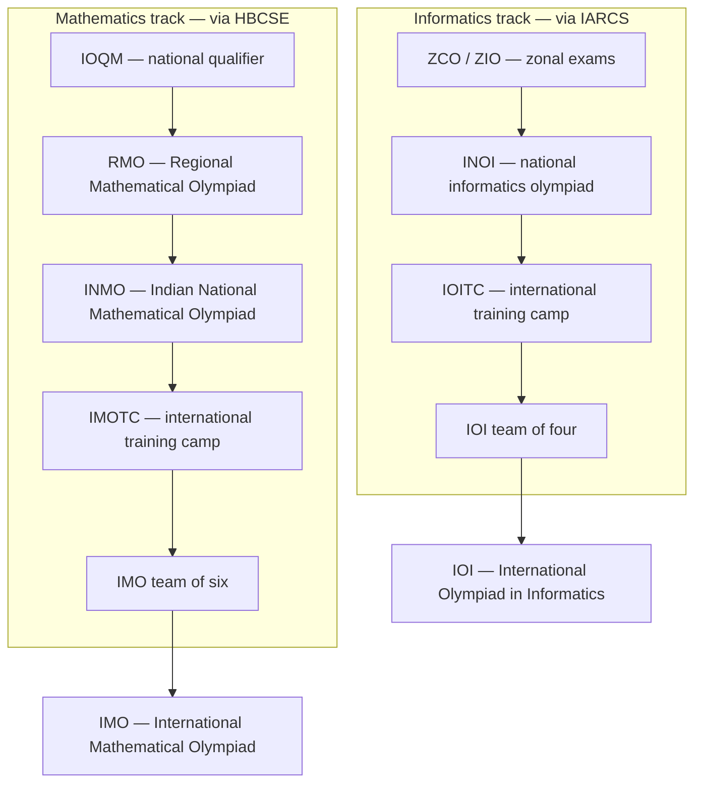

# Competitive Mathematics — The Olympiad Track

## Overview

This section is the hub for olympiad-style, proof-based mathematics: the tradition of contest problems where the deliverable is a rigorous argument, not a computed number. The pages here cover the competition landscape (IMO, IOI, ICPC, and the Indian pipeline), the International Mathematical Olympiad in operational detail, and deep technique pages for the two areas that dominate placement-relevant problem solving — number theory and combinatorics — with algebra and geometry pages alongside. The angle throughout is proof craft: invariants, extremal arguments, clean constructions, and the discipline of writing solutions that survive a hostile grader.

Why does a placement-prep book carry an olympiad track? Because a specific and lucrative slice of the interview market — quantitative trading firms, market-making shops, hedge funds, and the "cleverness" rounds at top product companies — screens with exactly this style of problem: novel, small, adversarially chosen, and immune to memorized algorithms. The training effect is also the point even when the problems are not: olympiad practice builds tolerance for being stuck for an hour and a method for escaping. Read this page for orientation, then follow the section map below to the area you need.

## Why Proof-Based Math Matters for Placements

### The Quant and Trading Screen

Firms in the Jane Street / Optiver / Citadel Securities / Hudson River Trading tier open interviews with probability and combinatorial-reasoning problems that are miniature olympiad problems: a coin-weighing with an information bound, a game whose outcome is decided by an invariant, a counting argument with a hidden bijection. The interviewer does not care whether you know the name of the theorem; they care whether you can find the invariant in ten minutes while narrating. Candidates from the olympiad world recognize the genre instantly because IMO problems 1 and 4 are the same species. The payoff is concrete: these firms pay fresh graduates compensation well above the general software market, and their funnels are heavily weighted toward exactly this reasoning style rather than framework trivia.

The screening questions are usually easier than olympiad problems but structurally identical, which is the good news. A candidate who can solve an IMO shortlist combinatorics problem finds interview puzzles slow but not confusing; the reverse is not true. The relevant skills transfer at full strength: enumerating small cases, asking what changes and what stays constant, and proving the answer rather than asserting it. That is why this section exists inside a placement-prep book rather than a math-competition fanzine.

The mapping between olympiad technique and interview venue is predictable enough to train against deliberately. Use the table below to decide where to spend your hours, and note that the two highest-yield rows correspond exactly to the two technique pages in this section.

| Olympiad skill | Where it is screened | Typical clock | Example question shape |
|---|---|---|---|
| Invariants and parity | Quant firms, puzzle rounds | 5–15 min | Can this process reach the goal state? |
| Counting and bijections | Quant firms, online assessments | 5–10 min | How many outcomes satisfy property P? |
| Extremal / pigeonhole arguments | Cleverness screens | 10–20 min | Prove some object must have property P |
| Modular arithmetic | Online assessments, NT-flavored puzzles | 3–8 min | Last digits, divisibility, cycles |
| Estimation and bounding | Consulting cases, PM loops | 10–25 min | Size this market without data |

### Consulting Estimation and Cleverness Screens

Consulting firms and product-manager loops run estimation cases (market sizing, Fermi problems) that reward the olympiad habit of decomposing an unknown quantity into bounded, multipliable pieces. The connection is weaker than the quant one but real: both reward explicit assumptions, sanity checks against extreme cases, and clean arithmetic done under pressure. An estimation case is essentially an existence proof — you are constructing one consistent world in which your number is right — and candidates who practice proofs construct it faster and with fewer contradictions.

A thirty-second Fermi sketch shows the shared skeleton. Estimate the annual revenue of a mid-size cinema chain in an Indian metro: assume the city has 10 million people, 5% visit a cinema monthly at an average ticket of \\ 250 \\ rupees, and your chain holds a 15% share — that is \\ 10^7 \\times 0.05 \\times 12 \\times 250 \\times 0.15 \\approx 2.25 \\times 10^8 \\ rupees annually, about 22.5 crore. Each factor is independently arguable, each is bounded by common sense, and the interviewer can probe any link without collapsing the whole estimate. The olympiad-trained reflex — decompose until every piece is defensible, then multiply — is the entire skill, and it is drilled by every bounding argument in this section.

The informal "cleverness" screens at elite software companies sit between these two poles. A whiteboard problem with a parity trick, a "can this ever terminate" argument, or a puzzle round as described in the interview section are all olympiad DNA in business attire. Interviewers at these loops consistently report that the signal they want is structured progress under ambiguity — which is precisely what years of olympiad practice drills. Where the specific puzzles live and how to answer them is covered in the linked interview pages at the bottom of this page.

### The IOI and ICPC Crossover

Olympiad mathematics and competitive programming are sibling disciplines with heavy talent flow between them. The International Olympiad in Informatics (IOI, since 1989) asks contestants to solve algorithmic problems in five-hour sessions, and its hardest problems routinely require proofs of correctness or greedy-exchange arguments that are pure olympiad technique. The ICPC (International Collegiate Programming Contest) is the university-level continuation, and its medalist teams almost always contain former olympiad participants. For a placement candidate, the practical overlap is that algorithmic interview preparation and olympiad mathematics reinforce each other: the former supplies implementation speed, the latter supplies the proof instinct that tells you the greedy is actually correct.

The two tracks also share the training methodology — spaced problem solving, upsolving harder problems after the clock, and reading editorial solutions actively rather than passively. Candidates deciding where to spend limited hours should note the asymmetry documented below: olympiad math builds durable reasoning, competitive programming builds durable speed, and interviews weight the first more heavily at quant firms and the second more heavily at big-tech coding loops. Most people should do some of both, in the ratio of their target companies.

A concrete shared habit is worth stealing from the programming side: version-control your solution archive the way you version code. Keep solutions as small markdown files tagged by technique and difficulty, commit after every session, and review the diff of your own thinking each month. The habit costs minutes and turns the archive from a folder into a searchable personal textbook. It also mirrors the engineering workflow placement candidates already know, which lowers the activation energy for a daily mathematics habit.

## The Olympiad Landscape

The international scene is organized into three flagship competitions, each with a national feeder system. The mathematics and informatics tracks run in parallel through school and into university, and the table below positions them side by side so you can pick a lane or run both.

| Competition | Domain | Level | Format (summary) | Since |
|---|---|---|---|---|
| IMO | Mathematics | High school | 2 days × 4.5 h, 3 proof problems per day, max score 42 | 1959 |
| IOI | Informatics | High school | 2 contest days, algorithmic problems, individual | 1989 |
| ICPC | Competitive programming | University | Teams of 3, one machine, 5 hours, ~12 problems | 1970s (collegiate era) |

The IMO is the oldest and most selective of the three — most participating countries send a team of six after a multi-stage national selection that routinely eliminates over a hundred thousand students at its base. India runs both a mathematics track (IOQM → RMO → INMO, administered under HBCSE oversight) and an informatics track (ZCO/ZIO → INOI, run by IARCS); the full stage-by-stage detail, eligibility rules, and preparation calendars live in the dedicated India page linked below. The key structural fact for planners: both Indian tracks are high-school-only, so university students pivot to ICPC and to open online contests for the same training effect.

### National Feeder Systems

Every IMO participant earns the slot through a national pyramid, and the pyramids differ mainly in width, not shape. Large-population countries run a broad open qualifier (in India, the IOQM; in the US, the AMC series) that feeds a regional round, then a national olympiad, then a training camp where the team of six is finally chosen. Small delegations sometimes collapse the pyramid to two stages, but the selection problem is identical: thousands of candidates, a handful of seats, and a syllabus deliberately broader than any school curriculum. For a placement candidate the relevant consequence is that national-stage past papers form an enormous, free, difficulty-graded problem bank — the base of every pyramid is accessible without advancing through its top.

University-level mathematics competitions extend the same pyramid past school. The Putnam (North America) and its national counterparts elsewhere are the collegiate continuation, and the books listed in the references treat the Putnam canon as a direct sequel to the olympiad canon. Candidates who aged out of school olympiads should treat collegiate contests as the natural replacement venue, with the same training methodology described in the practice section below.

## What Olympiad Math Trains vs Engineering Math

The mathematics section of this book ([Number Theory for Programming](../mathematics/number-theory.md), discrete math, probability) teaches computational fluency: fast exponentiation, sieves, modular inverses — algorithms you implement. The olympiad track teaches proof fluency: knowing why the inverse exists, proving the period of a sequence, showing no algorithm in a class can do something. Both matter in interviews; they are different muscles, and the table makes the contrast explicit.

| Dimension | Engineering math (rest of this book) | Olympiad math (this section) |
|---|---|---|
| Unit of work | Compute a value, run an algorithm | Prove a statement for all cases |
| Typical question | Compute `2^100 mod 1000` | Prove `(21n+4)/(14n+3)` is irreducible for every `n` |
| Core skill | Correct implementation, complexity analysis | Invariants, extremal choice, airtight case analysis |
| Failure mode | Bug, timeout | Unproved lemma, missed case |
| Interview habitat | Coding rounds, online assessments | Quant puzzles, cleverness screens, estimation cases |
| Time constant | Minutes per problem | Hours per problem, deliberately |

Two clarifications keep this table honest. First, the columns are complementary, not rival: the same candidate proves \\( a^p \\equiv a \\pmod p \\) in the morning and implements modular exponentiation in the afternoon, and interviews at quantitative firms probe both. Second, "hours per problem" is a feature — the olympiad track deliberately trains sustained stuck-ness, which is the emotional skill most candidates lack and most interviewers screen for. If you have never spent 90 minutes on one problem and enjoyed the escape at minute 70, this section is the cheapest place to acquire that habit.

## The Four Classical Areas

Olympiad problems divide into four canonical areas, and every page in this section maps onto one of them (with the hub and archive pages as glue). Knowing the signature of each area lets you triage an unfamiliar problem in the first five minutes, which is also the first move of the interview attack framework. The one-line signatures below are worth memorizing as a triage table.

### Algebra

Functional equations, polynomial structure, and inequality chains — the signature move is normalizing or substituting until a known shape appears. Classic forms: prove \\( f(f(x)) = x \\) forces extra structure on \\( f \\); show \\( a^2 + b^2 \\ge 2ab \\) and its descendants dominate every olympiad inequality. Algebra rarely appears verbatim in interviews, but its habit — reduce to a canonical form before attacking — transfers everywhere.

### Combinatorics

Counting, existence, and structure on discrete objects; the signature question is "show that there exists a configuration with property P" or "prove that P is impossible". Its toolkit — bijections, pigeonhole, invariants, the extremal principle, double counting — is the single most interview-relevant area, because puzzles are combinatorics with the jargon removed. The dedicated page in this section works each technique with a signature example and two full classics.

### Geometry

Angle chasing, power of a point, spiral similarity, and the construction of auxiliary points; the signature is a diagram that hides a two-line synthetic proof from the right vertex. It is the most beautifully documented area — Evan Chen's book is the modern standard — and the least placement-relevant as a technique source, but it still trains the general skill of extracting structure from an unstructured picture. We link a dedicated geometry page for completeness of the track.

### Number Theory

Divisibility, modular arithmetic, multiplicative order, and valuations; the signature move is reducing an equation modulo a cleverly chosen number until it becomes impossible or forced. Together with combinatorics it accounts for most resurfaced interview problems — parity arguments, last-digit computations, Frobenius-style coin questions. The dedicated page in this section builds the full toolkit proof-first, with three worked classics including an actual IMO 1959 problem.

## A First Taste of the Genre

To calibrate what "proof-based" means in practice, here is a complete olympiad-style argument at interview difficulty. A colony has chameleons of three colors — say 13 grey, 15 crimson, 17 olive. When two chameleons of different colors meet, both change to the third color. Can all chameleons ever end up the same color? The naive approach is to simulate meetings and search; the olympiad approach is to find what never changes.

Work modulo 3. If grey meets crimson, the counts become (12, 14, 18), and in general a meeting changes the three counts by \\( (-1, -1, +2) \\) in some order — and since \\( +2 \\equiv -1 \\pmod 3 \\), every meeting shifts **all three counts down by 1 modulo 3**. Therefore the multiset of residues \\( \\{a, b, c\\} \\bmod 3 \\) is invariant up to this uniform shift: if all three residues were distinct before a meeting, they remain distinct after. Initially the counts are \\( 13 \\equiv 1 \\), \\( 15 \\equiv 0 \\), \\( 17 \\equiv 2 \\pmod 3 \\) — three distinct residues. A uniform-color state has all three counts equal, hence all residues equal, which contradicts the invariant. The answer is no, and the argument took four sentences.

This is the shape of the entire genre: replace brute-force search with a quantity that cannot change, then compare endpoints against the invariant. The same skeleton solves the 15-puzzle solvability question, several coin-weighing variants, and a whole family of "can the robot reach" interview puzzles. The combinatorics page in this section develops the skeleton methodically; the puzzles section of the interview track reuses it verbatim.

## The India Olympiad Pipeline

India selects its IMO and IOI teams through multi-stage national olympiads coordinated by the Homi Bhabha Centre for Science Education (HBCSE) for mathematics and by IARCS for informatics. The two pipelines are structurally parallel — a broad qualifier, a regional round, a national round, a training camp — and the flowchart shows both side by side. Stage details, past-paper strategy, and calendar specifics are deferred to the India page; the point of this diagram is the shape: each stage filters hard, and the training-camp stage is where both tracks converge to intensive problem solving before team selection.

Three practical notes for Indian candidates reading this as a placement-prep track rather than a medal hunt. First, the IOQM and ZCO stages are open enough that a serious problem-solver can enter late and still gain the training benefit even without advancing. Second, INMO and INOI performance carries weight in applications to research programs and selective internships, so the effort is dual-use. Third, the past papers of every stage are freely downloadable from the HBCSE olympiad site, which makes the pipeline the cheapest structured problem bank available to an Indian student.

## Section Map

The section contains seven sibling pages plus this hub. Read in order for a full track, or jump to the area you need.

| Page | What it covers |
|---|---|
| [IMO Guide](./imo-guide.md) | Format, scoring, difficulty curve, shortlist system, preparation stack |
| [Olympiad Number Theory](./number-theory-olympiad.md) | Divisibility, CRT, orders, LTE, descent; three worked classics |
| [Olympiad Combinatorics](./combinatorics-olympiad.md) | Bijections, stars and bars, invariants, extremal principle; two full classics |
| [Olympiad Algebra](./algebra-olympiad.md) | Functional equations, polynomials, inequality technique |
| [Olympiad Geometry](./geometry-olympiad.md) | Angle chase, power of a point, construction arsenal |
| [India Math Olympiads](./india-math-olympiads.md) | IOQM/RMO/INMO stages, calendars, past-paper strategy |
| [Resources Directory](./resources-directory.md) | Handouts, archives, problem databases, and the book list in one place |

The dependency order for a newcomer is: hub → IMO guide → number theory → combinatorics, with algebra and geometry as parallel electives and the India page read only if you intend to actually sit the stages. Each technique page is self-contained: statements, proofs of the standard lemmas, worked examples, and a strategy section. Cross-references at the bottom of every page connect the olympiad material to its engineering-math and interview counterparts elsewhere in the book.

For placement season specifically, a compressed route exists: this page, the combinatorics page's technique table, the number theory page's strategy flowchart, and the puzzles section constitute about four hours of reading that covers the overwhelming majority of interview-relevant olympiad technique. The remaining pages are depth for candidates with time or particular target firms. Revisit the compressed route the week before each interview season; the material decays slower than coding patterns but does decay.

## How to Practice

Everything below assumes the placement framing: you are training reasoning under observation, not collecting medals. The format matters more than the material for the first few months, and the subsections below define that format precisely. Treat them as a specification you can audit yourself against at the end of every week.

### Problems Over Reading

The single most common failure mode in olympiad self-study is reading solutions faster than attempting problems — it produces familiarity that evaporates under a clock. The working ratio experienced coaches recommend is roughly four problems attempted for every one solution read cold. Reading is still essential (the handouts linked in the resources page are the fastest way to acquire a technique), but every handout chapter must end with its exercises attempted before the next chapter opens. A useful rule: if you have read three solutions in a row without solving anything, stop reading and go find an easier problem to actually solve.

Choose problems at the edge of your ability: a good problem is one you fail to solve in 45 minutes but can fully understand the solution of in 15. The AoPS community and wiki host difficulty-annotated archives of essentially every olympiad ever run, which makes calibration easy — start at the easiest contest band and move up only when the current band feels mechanical. Difficulty calibration matters more than volume: ten problems at the right edge beat fifty below it.

### The 90-Minute Single-Problem Session

The core training unit is one problem, one session, full attention. Structure it: 10 minutes restating and computing small cases, 40 minutes of genuine attack (write everything down, including dead ends), 20 minutes of documented stuck-ness (list exactly what you know and what you need), then the decision point — keep going or read the solution. The point of the structure is that being stuck productively is itself a trainable skill, and unstructured sessions hide the stuck-ness instead of training it. Log every session: problem source, time spent, where the key idea came from when you did solve it, and which technique unlocked the solution when you did not.

Ninety minutes is long enough to reach the productive stuck state and short enough to schedule daily. Serious candidates run one session per day plus one full mock per week; placement-focused candidates can halve the frequency and still get most of the transfer effect within a semester. The session format is also interview-realistic: a quant interview problem is a 10–30 minute single-problem session with narration, and the daily practice of narrating your attack out loud is worth as much as the mathematics.

### Write Full Solutions

Olympiad scoring rewards complete arguments, and the discipline of writing them is where most of the learning consolidates. A full written solution forces you to discharge every case, prove every lemma you use, and check the boundaries — exactly the rigor that a whiteboard interviewer probes with "are you sure that covers the odd case?". Write solutions even for problems you solved mentally, because the act of writing exposes the gaps that confidence hides. Keep the best solutions in a personal archive with the technique tagged; six months later that archive is a personalized textbook superior to anything purchasable.

The written archive also feeds the mock-review loop: after each mock, grade yourself against the official grading rubric where one exists, or against the standard of "would a skeptical grader award all 7 points?". Self-grading against a hostile standard is uncomfortable and effective. It is also directly interview-transferable — the habit of asking "what would break this argument?" before declaring done is the same instinct that catches your own bugs in production code.

### Mocks and Upsolving

A mock is a timed, exam-shaped block: pick two or three unseen problems at your target difficulty, set a hard clock, and solve with full written solutions. The mock trains clock management and solution-writing under pressure, neither of which emerges from casual sessions. After the clock, upsolve — attempt the problems you missed for another 30 minutes before reading solutions, because the struggle immediately before reading is what encodes the technique. A weekly cadence of one mock plus two normal sessions is the standard serious schedule.

Interview-flavored mocks deserve special mention for this book's audience. Replace the 4.5-hour exam block with three 20-minute spoken problems recorded on your phone, solved standing at a whiteboard. The grading criteria change from "complete proof" to "clear narration, correct answer, no hand-waving", which matches the actual interview signal. Candidates who run six such spoken mocks before placement season consistently report that the real interviews feel rehearsed rather than surprising.

### Measuring Progress Without Medals

Since most readers of this book will not sit the actual olympiad stages, progress needs a self-administered yardstick. The honest metrics are solve rate at a fixed difficulty band, time-to-first-idea on an unseen problem, and the fraction of attempted problems that end in a complete written solution. Track all three monthly in the session log; they respond to training on 4–8 week horizons, and watching them move is what sustains motivation through the plateaus. The table below gives realistic milestone bands for a university candidate training 4 hours weekly.

| Phase | Weeks | Session focus | Expected milestone |
|---|---|---|---|
| Foundation | 1–6 | Easy national-stage problems; full write-ups | Solve 70% of a chosen easy band within 45 min |
| Toolkit | 7–14 | One technique family per week with exercises | Recognize which family fits an unseen problem |
| Integration | 15–22 | Mixed problem sets, spoken mocks | First-idea latency under 10 min on familiar genres |
| Maintenance | 23+ | One hard problem weekly; interview puzzle diet | Stable performance without regression |

Two warnings about measurement. First, do not chase problem counts — a week of three deep problems outperforms a week of thirty hints-looked-up, and the log should record depth explicitly. Second, plateaus are structural, not personal: technique acquisition is step-shaped, with weeks of nothing followed by a jump, and abandoning training mid-plateau is the most common way capable candidates lose the skill. Judge the program by quarter, not by week.

### A Concrete First Month

Ambiguity kills more training plans than difficulty does, so here is a fully specified first month. Weeks 1–2: solve twelve problems from the easy band of your national olympiad (AMC/IOQM level), one 90-minute session per day, full write-ups for all twelve regardless of solve success. Week 3: read the counting and modular-arithmetic chapters of the two reference books, doing every embedded exercise before reading its solution. Week 4: one spoken mock (three problems, recorded, 20 minutes each) plus eight more problems split across combinatorics and number theory. At month's end you will have 20 written solutions, two technique chapters internalized, and a calibrated sense of your current band — which is exactly the input the milestone table above needs.

Resist two temptations during the month. Do not start with the famous hardest problems — difficulty sequencing matters, and ego problems teach helplessness rather than technique. And do not skip the write-ups on solved problems — the write-up is where a half-understood argument becomes an owned one, and skipping it is how candidates end up with 500 familiar problems and no transferable skill.

Month two runs the same skeleton at higher load: fourteen problems in the next band up, two technique chapters, two spoken mocks, and the first full written post-mortem of a problem you failed twice. The post-mortem is a one-page document — problem, failed attacks, the actual key idea, and the earliest signal you ignored that pointed at it. Six such documents across a semester teach pattern recognition for your *own* stuck states, which is the meta-skill behind the interview question "walk me through how you'd attack something you've never seen". The plan scales indefinitely by swapping problem bands and technique families while keeping the session shape fixed.

### The Minimal Bookshelf

The full olympiad bibliography is enormous; the placement-relevant subset fits on one shelf. These six items, in priority order, cover everything the technique pages assume:

- *The Art and Craft of Problem Solving* (Paul Zeitz) — start here; it teaches the psychology and the five-stage attack loop explicitly.
- *Problem-Solving Strategies* (Arthur Engel) — the technique encyclopedia; read one chapter per week with exercises, never cover to cover.
- *102 Combinatorial Problems* (Andreescu & Feng) — a graded problem ladder for the combinatorics page's techniques.
- *104 Number Theory Problems* (Andreescu et al.) — the same ladder for the number theory page's toolkit.
- Evan Chen's free handouts and notes (web.evanchen.us) — the best modern expositions, especially the Napkin for a unified view.
- Yufei Zhao's olympiad notes (yufeizhao.com) — concise, university-authored handouts on all four areas.

Everything else — full books on a single competition, 500-problem anthologies, advanced monographs — is optional depth for people who discover they love this. The two Andreescu ladders and the two free handout sites alone constitute a complete multi-year curriculum when combined with the session discipline above.

## Interview Questions

1. **Why do trading firms hire so many olympiad people?** Because the daily work — pricing under uncertainty, finding edges in noisy data, reasoning about games and incentives — is structurally similar to olympiad problem solving: novel, adversarial, and unforgiving of unproved assumptions. Olympiad veterans have demonstrated the two traits that are hardest to teach: comfort with being stuck, and the habit of verifying an argument before trusting it. The interview screens (probability puzzles, combinatorial games, estimation) are designed to elicit those traits in 30–60 minutes. A medal is not required; the demonstrated thinking style is what converts.
2. **I am a university student who never did olympiads. Is it too late?** No — the training effect, not the medal, is what interviews respond to, and the training effect is available at any age. Start with the easier national-stage problems, run the 90-minute session format four times a week, and expect meaningful transfer in 3–4 months. University students additionally have Putnam-style collegiate contests, which are designed for exactly this late-start population. What will not work is passive reading of solution archives, which produces the illusion of skill without the substance.
3. **Is olympiad geometry worth preparing for placements?** As a direct technique source, no — geometry problems almost never appear in software or quant interviews. As training for extracting structure from an unstructured picture and writing airtight arguments, it is excellent but not uniquely so; combinatorics and number theory deliver the same training with higher interview relevance. If time is constrained, do geometry last. If time is abundant, it is the most enjoyable of the four areas, and enjoyment is a legitimate factor in a multi-year training plan.
4. **How does olympiad math relate to LeetCode-style interview prep?** They are complements: LeetCode trains implementation speed and pattern recognition on a known problem taxonomy, while olympiad math trains reasoning on problems outside any taxonomy. Big-tech coding loops weight the first heavily; quant and cleverness screens weight the second. Candidates targeting both should interleave — the olympiad sessions build the stuck-tolerance that makes hard coding problems tractable, and the coding practice builds the verification habits (test small cases first) that olympiad work also demands.
5. **What single habit from olympiad training helps most in interviews?** Narrating a structured attack out loud: restate the problem, compute the smallest cases, state what you are hunting for (invariant, bound, construction), and keep the narration going through dead ends. Interviewers grade the narration as heavily as the answer because it is the only observable part of your thinking. Olympiad training builds this naturally if you practice in the write-and-explain format rather than silently. Candidates who adopted only this one habit — from the whole olympiad playbook — report the largest interview score improvements.
6. **How do I fit olympiad training into an already full placement-prep schedule?** Budget 3–5 hours weekly and spend them on the two highest-transfer areas: combinatorics and number theory from this section. Replace an equivalent amount of low-difficulty coding grind rather than adding hours. Use interview puzzles as your problem source in the last month before placements, since the genres converge. The schedule survives because the session format (one problem, 90 minutes, full write-up) is lower total volume than most candidates' current unstructured preparation.

## Key Takeaways

- Olympiad math trains proof craft — invariants, extremal thinking, airtight case analysis — which is a different muscle from the computational engineering math in the rest of this book.
- Quant trading firms, estimation cases, and cleverness screens all test olympiad-style reasoning; the genres are identical even when difficulty is scaled down.
- The international flagship competitions are IMO (math, since 1959), IOI (informatics, since 1989), and ICPC (collegiate programming), each fed by national pipelines.
- India runs two parallel pipelines: IOQM → RMO → INMO → IMOTC for mathematics, and ZCO/ZIO → INOI → IOITC for informatics.
- Problems beat reading by roughly 4:1 as a use of training hours; calibrate difficulty to the edge of your ability.
- The core practice unit is a 90-minute single-problem session with a documented stuck phase and a written full solution.
- The four classical areas are algebra, combinatorics, geometry, and number theory; combinatorics and number theory carry the highest interview transfer.
- Written solution archives and hostile self-grading convert practice into durable skill and transfer directly to whiteboard interviews.

## References

- [IMO official site](https://www.imo-official.org) — per-year results, participant statistics, and the canonical historical record since 1959.
- [IMO problems archive](https://www.imo-official.org/problems.aspx) — every problem since 1959 with per-problem statistics.
- [Art of Problem Solving](https://artofproblemsolving.com) — community forums, contest archives, and the training ecosystem.
- [AoPS Wiki](https://artofproblemsolving.com/wiki) — problem solutions and olympiad reference pages.
- [AoPS Community](https://artofproblemsolving.com/community) — active solution discussion for current olympiads.
- [HBCSE Olympiads](https://olympiads.hbcse.tifr.res.in) — the Indian national olympiad authority: past papers, stages, and announcements.
- [IOI official site](https://ioinformatics.org) — informatics olympiad regulations, tasks, and results since 1989.
- *Problem-Solving Strategies* (Arthur Engel) — the classic technique-first olympiad book.
- *The Art and Craft of Problem Solving* (Paul Zeitz) — the best entry-level treatment of problem-solving psychology and technique.

## Cross-References

- [IMO Guide](./imo-guide.md) — the operational deep dive: format, scoring, shortlists, and the preparation stack.
- [Olympiad Number Theory](./number-theory-olympiad.md) — the proof-first NT toolkit with worked IMO classics.
- [Olympiad Combinatorics](./combinatorics-olympiad.md) — the technique catalog with signature examples for each.
- [India Math Olympiads](./india-math-olympiads.md) — the IOQM → RMO → INMO pipeline in detail.
- [Puzzles & Brain Teasers](../interview/puzzles/README.md) — where olympiad technique meets the actual interview room.
- [Number Theory for Programming](../mathematics/number-theory.md) — the engineering-math counterpart: fast pow, sieves, modular inverse as code.
- [Competitive Programming](../competitive-programming/README.md) — the algorithmic-contest sibling track and its IOI/ICPC guides.
- [Aptitude Track](../aptitude/README.md) — the timed arithmetic and reasoning tests that most campus funnels run before any olympiad-style round.
- [Math Foundations (DSA)](../dsa/chapters/ch02-math-foundations.md) — the algorithmic number theory and counting utilities used in coding rounds.
- [Resources Directory](./resources-directory.md) — every link on this page plus problem databases and contest calendars, in one place.
