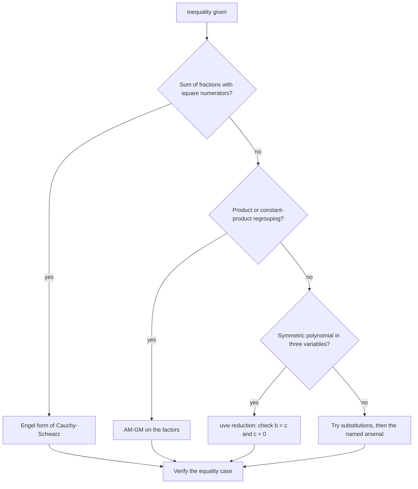
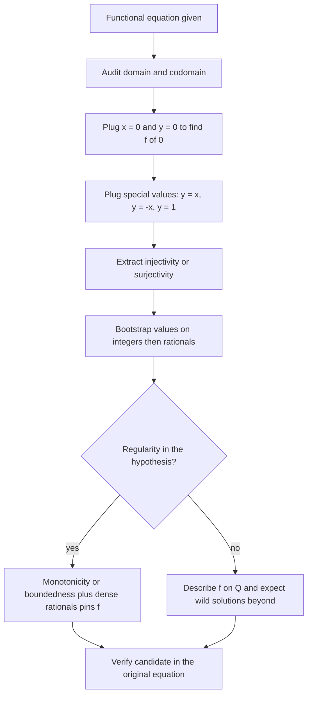

# Olympiad Algebra

## Overview

Olympiad algebra is the craft of turning symmetric expressions, functional constraints, and polynomial identities into short airtight proofs. Unlike school algebra, which computes values, the olympiad version asks you to prove that an inequality holds for all positive reals, that a functional equation has exactly one solution, or that a polynomial never factors — and to do it in a way a hostile grader cannot fault. The toolkit is compact: AM-GM and Cauchy-Schwarz for inequalities, a plug-in playbook for functional equations, Vieta jumping and irreducibility criteria for polynomials, and characteristic polynomials for recurrences.

The placement relevance is direct and well documented. Quantitative trading firms and hedge funds screen with algebra-flavored problems — prove a bound, find all functions, decide when equality holds — because these problems measure whether a candidate can finish an argument, not just start one. This page covers the four load-bearing technique families, works each on a concrete example, and closes with a cue table mapping problem phrasings to first moves. The engineering-math counterparts (computational routines, not proofs) live in the [Mathematics section](../mathematics/README.md) and are cross-linked, not duplicated, here.

A note on method before the techniques: every section below follows the same triple rhythm — statement, worked example, then the cue that tells you when to fire. Training this rhythm on your own archive matters more than collecting theorems, because contest algebra has maybe fifteen load-bearing facts and thousands of problems that reduce to them. The [resources directory](./resources-directory.md) lists where to drill; this page supplies what to drill.

## The Inequality Toolkit

Contest inequalities are a genre with roughly a dozen workhorse theorems, and two of them solve the majority of problems up to national level. The skill is not memorizing statements — every serious competitor knows them — but recognizing within minutes which machine a given expression is begging for. The subsections below cover the two workhorses with full worked examples, a complete classic that chains them, and the uvw/pqr reduction that collapses a whole class of three-variable problems.

### AM-GM: Statement and First Applications

**Theorem (AM-GM).** For nonnegative reals \\( a_1, a_2, \\dots, a_n \\),

\\[ \\frac{a_1 + a_2 + \\cdots + a_n}{n} \\ge \\sqrt[n]{a_1 a_2 \\cdots a_n}, \\]

with equality if and only if \\( a_1 = a_2 = \\cdots = a_n \\). The two-variable form \\( a + b \\ge 2\\sqrt{ab} \\) is worth having at reflex speed, since it is the identity behind every "sum of a thing and its reciprocal" bound. The equality condition is not decoration: most contest inequalities are engineered so that equality at \\( a = b = c \\) is achievable, and your proof must be tight exactly there.

Worked example. Prove that for positive reals \\( a, b, c \\), \\[ (a + b)(b + c)(c + a) \\ge 8abc. \\] Apply the two-variable AM-GM to each factor: \\( a + b \\ge 2\\sqrt{ab} \\), \\( b + c \\ge 2\\sqrt{bc} \\), and \\( c + a \\ge 2\\sqrt{ca} \\). Multiplying the three inequalities (all sides positive, so multiplication is safe) gives \\[ (a+b)(b+c)(c+a) \\ge 8\\sqrt{ab \\cdot bc \\cdot ca} = 8abc, \\] since \\( \\sqrt{a^2 b^2 c^2} = abc \\). Equality requires \\( a = b \\), \\( b = c \\), \\( c = a \\) simultaneously, i.e., \\( a = b = c \\), which indeed achieves \\( 8a^3 = 8abc \\). Note the proof shape: bound each factor, multiply, and verify the equality case — this three-step skeleton repeats across hundreds of problems.

Two refinements multiply the theorem's reach. **Homogenization**: if an inequality is not homogeneous (terms of different degrees), apply a normalization the problem hands you, or scale variables until it becomes homogeneous — AM-GM only compares like with like. **Term splitting**: a stubborn sum often falls to writing each term as pieces chosen so their products telescope or cancel. When stuck on a symmetric inequality, the first question should always be: can I regroup into factors whose product is constant?

### Cauchy-Schwarz and the Engel Form

**Theorem (Cauchy-Schwarz).** For real \\( a_i, b_i \\),

\\[ \\left( \\sum_{i=1}^{n} a_i^2 \\right) \\left( \\sum_{i=1}^{n} b_i^2 \\right) \\ge \\left( \\sum_{i=1}^{n} a_i b_i \\right)^2, \\]

with equality iff the vectors \\( (a_i) \\) and \\( (b_i) \\) are proportional. The form olympiad solvers reach for most is the **Engel (Titu) form**: for positive \\( y_i \\),

\\[ \\sum_{i=1}^{n} \\frac{x_i^2}{y_i} \\ge \\frac{(x_1 + x_2 + \\cdots + x_n)^2}{y_1 + y_2 + \\cdots + y_n}. \\]

It follows by applying Cauchy-Schwarz with \\( a_i = x_i/\\sqrt{y_i} \\) and \\( b_i = \\sqrt{y_i} \\). The Engel form converts any sum of "squared thing over thing" into a single clean fraction, which is why it is the standard first move on fraction inequalities.

Worked application. Prove that for positive reals \\( a, b, c \\), \\[ \\frac{a^2}{b} + \\frac{b^2}{c} + \\frac{c^2}{a} \\ge a + b + c. \\] Apply the Engel form with numerators \\( a, b, c \\) and denominators \\( b, c, a \\): \\[ \\sum \\frac{a^2}{b} \\ge \\frac{(a + b + c)^2}{a + b + c} = a + b + c. \\] Equality holds iff \\( a/b = b/c = c/a \\), which forces \\( a = b = c \\). The choice of denominator pairing was the entire creative act: a cyclic shift makes the denominator sum equal the numerator sum, collapsing the right side. When a problem hands you \\( \\sum \\frac{x^2}{y} \\) or anything convertible to it, Cauchy-Schwarz should fire before you have finished reading.

### Nesbitt Worked in Full: Chaining Two Standard Steps

**Claim (Nesbitt).** For positive reals \\( a, b, c \\), \\[ \\frac{a}{b+c} + \\frac{b}{c+a} + \\frac{c}{a+b} \\ge \\frac{3}{2}. \\]

This is the canonical example of a proof that chains two standard identities, which is why every training program uses it. First apply the Engel form by writing \\( \\frac{a}{b+c} = \\frac{a^2}{a(b+c)} \\): \\[ \\sum \\frac{a^2}{a(b+c)} \\ge \\frac{(a + b + c)^2}{a(b+c) + b(c+a) + c(a+b)} = \\frac{(a+b+c)^2}{2(ab+bc+ca)}. \\] Second, use the fundamental lemma \\( a^2 + b^2 + c^2 \\ge ab + bc + ca \\) (itself just half the sum of three obvious squares), which gives \\( (a+b+c)^2 = a^2 + b^2 + c^2 + 2(ab+bc+ca) \\ge 3(ab+bc+ca) \\). Combining: \\[ \\sum \\frac{a}{b+c} \\ge \\frac{3(ab+bc+ca)}{2(ab+bc+ca)} = \\frac{3}{2}, \\] with equality at \\( a = b = c \\). The general lesson: hard inequalities are almost never one application of one theorem — they are two or three standard steps in a row, and your job is to see the chain.

### When to Try the uvw and pqr Methods

**The idea (uvw).** A symmetric polynomial inequality in three variables \\( a, b, c \\), which after clearing denominators has degree at most two in each variable separately, is determined by the elementary symmetric sums \\( p = a+b+c \\), \\( q = ab+bc+ca \\), \\( r = abc \\). The feasible region of \\( (p, q, r) \\) triples is such that any extremum of a fixed-degree expression in \\( r \\) occurs on the boundary, and the boundary corresponds to two variables being equal or one variable being zero. **Consequence:** to prove such an inequality, it suffices to check the cases \\( b = c \\) and \\( c = 0 \\) — a massive reduction, since a three-variable inequality becomes a one-variable computation. The **pqr method** is the same principle stated operationally: fix \\( p \\) and \\( q \\), observe the expression is linear or monotone in \\( r \\), and conclude the worst case sits at two equal variables.

Executing the reduction concretely: substitute \\( b = c = 1 \\) (or \\( b = c = x \\) if the inequality is not homogeneous) and verify the resulting one-variable claim; then substitute \\( c = 0 \\) and do the same. Both checks are routine algebra, and together they constitute the proof once the reduction principle is cited. The cue for trying uvw is precise: the inequality is fully symmetric in \\( a, b, c \\), polynomial (or polynomial after clearing denominators), and equality is attained both at \\( a = b = c \\) and often at a degenerate boundary. Schur's inequality and most "prove for all positive reals" problems with a symmetric polynomial shape fall to it; in a write-up you still prove the two cases, with the reduction as the framing step.

### Choosing an Inequality Tool

The first thirty seconds of an inequality problem decide the next thirty minutes, so the tool-choice deserves its own decision flow. The diagnostic variables are the shape of the expression (sum vs product vs fractions) and the number of variables.

If none of the branches fires, the problem usually wants a substitution before a standard tool applies. Keep the equality case verification in the loop even when the branch succeeds: a proof that is not tight at the hinted equality point is either wrong or missing a condition.

### Substitutions That Unlock Inequalities

Many inequalities become standard only after a change of variables, and four substitutions cover most cases. **Ratio substitution**: for expressions in \\( a/b, b/c, c/a \\), set \\( x = a/b \\), \\( y = b/c \\), \\( z = c/a \\) so that \\( xyz = 1 \\), and the problem becomes a constrained two-variable question. **Product normalization**: when \\( abc = 1 \\) is given, write \\( a = x/y \\), \\( b = y/z \\), \\( c = z/x \\), which makes the constraint automatic and often turns every factor into a ratio of adjacent variables. **Square substitution**: expressions with \\( a^2 + b^2 \\) structures sometimes simplify under trigonometric moves, since \\( 1 + \\tan^2 u = \\sec^2 u \\). **uvw anticipation**: before substituting anything, check whether the inequality is symmetric and polynomial — if yes, the uvw reduction may make substitution unnecessary.

The meta-skill is noticing what the constraint is doing. A condition like \\( abc = 1 \\) is not decoration; it is a hint that the inequality is homogeneous in disguise and that a cyclic ratio substitution will collapse it. A condition like \\( a + b + c = 1 \\) invites normalizing the remaining expressions against a common denominator. Interviewers deliberately attach such conditions to test whether you read constraints as instructions for which substitution to try.

### Why Equality Cases Decide Proofs

Every serious inequality problem is constructed backwards from an equality case, usually \\( a = b = c \\) or a degenerate configuration. Checking equality serves three purposes at once. First, it is a correctness probe: if your intermediate bounds are all tight at the equality point, the chain is probably right; if one bound is strict there, the whole chain proves something weaker than claimed and is likely wrong. Second, it disciplines the write-up, since graders explicitly check that your argument permits equality rather than forbidding it. Third, it is a search heuristic in reverse — if you cannot guess the equality case, you do not yet understand the problem, and attempting symmetric substitutions to force equality at a known point often reveals the entire proof structure.

### Schur Stated, Proven, and Paired

**Theorem (Schur, degree 3).** For nonnegative \\( a, b, c \\), \\[ \\sum a(a-b)(a-c) \\ge 0. \\] WLOG \\( a \\ge b \\ge c \\); expand the sum and regroup: \\[ a(a-b)(a-c) - b(a-b)(b-c) + c(a-c)(b-c) = (a-b)\\left[a(a-c) - b(b-c)\\right] + c(a-c)(b-c). \\] The bracket is nonnegative because \\( a \\ge b \\) and \\( a - c \\ge b - c \\) multiply to a larger product, and the final term is nonnegative by assumption — so the whole expression is \\( \\ge 0 \\). Unrolled, Schur reads \\( a^3 + b^3 + c^3 + 3abc \\ge \\sum_{\\mathrm{sym}} a^2 b \\), and it is exactly the missing step in many symmetric cubic inequalities that AM-GM alone cannot finish. The working pattern: when a symmetric cubic inequality resists both AM-GM and Engel, write it as a combination of Schur and the obvious \\( a^2 + b^2 + c^2 \\ge ab + bc + ca \\); between those two, the degree-3 symmetric cone is fully spanned.

## Functional Equations

### The Plug-In Playbook

A functional equation (FE) problem says "find all functions \\( f \\) from \\( X \\) to \\( Y \\) satisfying ..." and rewards a fixed search order rather than inspiration. The playbook:

1. **Audit the domain.** Whether \\( f \\) lives on \\( \\mathbb{R} \\), \\( \\mathbb{Q} \\), \\( \\mathbb{Z} \\), or positive integers changes which plug-ins are legal and whether wild solutions can exist. Wild (non-linear) additive functions exist on \\( \\mathbb{R} \\) but not on \\( \\mathbb{Q} \\).
2. **Plug the special values.** Set \\( x = 0 \\) and \\( y = 0 \\) to extract \\( f(0) \\); set \\( y = -x \\) to get \\( f(-x) \\) in terms of \\( f(x) \\); set \\( y = x \\), \\( y = 1 \\), \\( y = x + 1 \\) one at a time. Each plug-in is a new equation in fewer unknowns.
3. **Extract injectivity and surjectivity.** If you can arrange \\( f(A) = f(B) \\) for expressions \\( A, B \\) you control, injectivity (when proven) cancels \\( f \\) and leaves an equation in plain variables. Surjectivity usually comes from showing some expression \\( g(x) \\) appearing as an argument of \\( f \\) covers the whole domain.
4. **Bootstrap the values.** Functional equations typically determine \\( f \\) first at \\( 0 \\), then at integers, then at rationals, then — if the equation lets you reach every real — everywhere. Deriving \\( f(x + n) = f(x) + n f(1) \\)-type relations is the standard middle step.
5. **Deploy regularity.** Monotonicity, continuity, boundedness on an interval, or boundedness below kills pathological solutions: combine it with the density of the rationals to pin \\( f \\) down completely.
6. **Verify.** Substitute the candidate back into the original equation and confirm every derived property was used legally. Graders specifically hunt for solutions that derive properties for a restricted class of arguments and then apply them universally.

The single most common failure mode is step 5 done implicitly: proving \\( f(q) = cq \\) for rationals and silently claiming it for reals. That step is exactly where unproven regularity hides, and both contest graders and interviewers probe it.

### Extracting Injectivity and Surjectivity: Two Mini-Examples

The extraction step looks mystical until you see it twice. **Surjectivity mini-example:** from the classic \\( f(x^2 + f(y)) = y + f(x)^2 \\), set \\( x = 0 \\) to get \\( f(f(y)) = y + f(0)^2 \\). As \\( y \\) ranges over \\( \\mathbb{R} \\), the right side ranges over all of \\( \\mathbb{R} \\), so \\( f \\circ f \\) is surjective — and whenever \\( f \\circ f \\) is surjective, \\( f \\) itself is surjective (a value never hit by \\( f \\) cannot be hit by \\( f \\circ f \\) either). One plug-in delivered surjectivity, which then lets you replace \\( f(y) \\) anywhere by an argument of your choosing.

**Injectivity mini-example:** the same identity \\( f(f(y)) = y + f(0)^2 \\) gives injectivity for free. If \\( f(a) = f(b) \\), apply \\( f \\) to both sides: \\( f(f(a)) = f(f(b)) \\), i.e., \\( a + f(0)^2 = b + f(0)^2 \\), so \\( a = b \\). The general principles are worth naming: \\( f \\circ g \\) injective implies \\( f \\) injective, and \\( f \\circ g \\) surjective implies \\( g \\) surjective. Once both properties are in hand, most FEs collapse — you cancel \\( f \\) from both sides of arranged identities and are left with ordinary algebra.

### Worked Classic: Additivity With and Without Regularity

**Problem.** Find all functions \\( f : \\mathbb{R} \\to \\mathbb{R} \\) satisfying \\( f(x + y) = f(x) + f(y) \\) for all reals \\( x, y \\), (a) with no further assumptions; (b) assuming additionally that \\( f \\) is monotone nondecreasing.

**Part (a).** Set \\( x = y = 0 \\): \\( f(0) = 2f(0) \\), so \\( f(0) = 0 \\). Set \\( y = -x \\): \\( 0 = f(x) + f(-x) \\), so \\( f \\) is odd. By induction \\( f(nx) = n f(x) \\) for all integers \\( n \\), and \\( f(x) = n f(x/n) \\) gives \\( f(x/n) = f(x)/n \\). Let \\( c = f(1) \\). Then for every rational \\( p/q \\), \\[ f\\left(\\frac{p}{q}\\right) = p \\, f\\left(\\frac{1}{q}\\right) = \\frac{p}{q} f(1) = \\frac{pc}{q}, \\] so \\( f(r) = cr \\) for all \\( r \\in \\mathbb{Q} \\). Here the argument **stops**: without additional hypotheses, solutions with \\( f(x) \\ne cx \\) for irrational \\( x \\) exist (constructed via a Hamel basis of \\( \\mathbb{R} \\) over \\( \\mathbb{Q} \\)); their graphs are dense in the plane. The honest complete answer to (a) is: \\( f \\) is any additive function — \\( \\mathbb{Q} \\)-linear, equal to \\( cx \\) on the rationals, and arbitrary up to that constraint.

**Part (b).** Add monotonicity. For any real \\( x \\) and rationals \\( r < x < s \\), monotonicity gives \\( f(r) \\le f(x) \\le f(s) \\), i.e., \\( cr \\le f(x) \\le cs \\). First, \\( c = f(1) \\ge f(0) = 0 \\), so \\( c \\ge 0 \\). Now take sequences of rationals \\( r_n \\uparrow x \\) and \\( s_n \\downarrow x \\): the inequality \\( c r_n \\le f(x) \\le c s_n \\) holds for every \\( n \\), and letting \\( n \\to \\infty \\) squeezes \\( f(x) = cx \\). Conversely every \\( f(x) = cx \\) with \\( c \\ge 0 \\) is monotone and additive. So the monotone solutions are exactly the lines through the origin.

**The boundedness bridge, fully.** Suppose instead that \\( f \\) is additive and bounded above on some interval \\( (0, \\delta) \\) by \\( M \\). Oddness gives a lower bound too: \\( f(t) \\ge -M \\) there. Consider \\( g(x) = f(x) - cx \\) with \\( c = f(1) \\); then \\( g \\) is additive, vanishes on \\( \\mathbb{Q} \\), and is bounded above on \\( (0, \\delta) \\). Since \\( g \\) has every rational as a period (\\( g(x + q) = g(x) + g(q) = g(x) \\)), and rational translates of \\( (0, \\delta) \\) cover the whole line, \\( g \\) is bounded above on all of \\( \\mathbb{R} \\) by some constant. Now for any \\( y \\), \\( n\\,g(y) = g(ny) \\le M \\) for every \\( n \\), forcing \\( g(y) \\le 0 \\); applying the same to \\( -y \\) forces \\( g(y) \\ge 0 \\). So \\( g \\equiv 0 \\), i.e., \\( f(x) = cx \\) everywhere — the bounded case is killed by periodicity plus a squeeze, and the proof is a favorite follow-up when an interviewer wants more than the monotone case.

The two-solutions lesson is the reason this problem is a classic. The same equation, on the same domain, has a vastly larger solution set without regularity than with it — the rationals are where the equation does the work, and monotonicity is the bridge from \\( \\mathbb{Q} \\) to \\( \\mathbb{R} \\). The same bridge handles boundedness: an additive function bounded above on any interval is linear, because the bound converts into a monotonicity argument in a few lines. In an interview, stating explicitly where the argument would break without regularity is the difference between a full-marks answer and a subtle miss.

### A Second Worked FE: The Exponential Equation

**Problem.** Find all \\( f : \\mathbb{R} \\to \\mathbb{R} \\) with \\( f(x + y) = f(x) f(y) \\) for all \\( x, y \\).

**Solution.** Setting \\( y = 0 \\) gives \\( f(x) = f(x) f(0) \\) for all \\( x \\). Either \\( f \\equiv 0 \\) (a valid solution) or \\( f(0) = 1 \\). In the nonzero case, \\( f(x) = f(x/2 + x/2) = f(x/2)^2 \\ge 0 \\), and since \\( f(x) = 0 \\) at one point would force \\( f \\equiv 0 \\) (pair that argument against anything), actually \\( f(x) > 0 \\) everywhere. Let \\( a = f(1) > 0 \\). The usual bootstrap gives \\( f(n) = a^n \\) on integers and \\( f(p/q) = a^{p/q} \\) on rationals — take \\( q \\)-th roots, legal because \\( f \\) is positive. If \\( f \\) is additionally continuous or monotone, the dense-rationals squeeze yields \\( f(x) = a^x \\) for all real \\( x \\). Without regularity, wild solutions exist here too: \\( f(x) = \\exp(g(x)) \\) with \\( g \\) any additive function satisfies the equation, so the solution space is exactly as large as the additive one. The pattern to internalize: positivity came from a squaring identity, the rational bootstrap from root-taking, and the finish again hinged on regularity.

### A Catalog of Standard Equations

Four functional equations account for a large share of contest problems, and their solution shapes rhyme. \\( f(x+y) = f(x) + f(y) \\) gives additive functions, linear on \\( \\mathbb{R} \\) under regularity. \\( f(xy) = f(x) f(y) \\) on positives gives power functions \\( f(x) = x^c \\) under regularity, by reducing to the additive case through \\( g = \\ln \\circ f \\). \\( f(x+y) = f(x) f(y) \\) gives exponentials, as worked above. \\( f(xy) = f(x) + f(y) \\) on positives gives logarithms, again by conjugating to additivity. The meta-lesson is that new FEs are usually old ones wearing a substitution: whenever the equation mixes sums and products, look for a logarithm or exponential that converts it into the additive case you already know how to finish.

### The Attack Order

The playbook above is a sequence, and drawing it as a decision flow helps under time pressure. The fork that matters is whether a regularity condition appears in the statement, because that decides whether the finish line is a unique formula or a structural description.

Two habits make the flowchart concrete. First, keep a running list of derived facts (\\( f(0) \\), parity, rational values) as named claims, because the final verification must reuse them explicitly. Second, when the equation resists all plug-ins, the bottleneck is almost always surjectivity — hunt for an argument slot \\( g(x) \\) whose range you can prove is all of the domain, since surjectivity converts "find all \\( f \\)" into "evaluate \\( f \\) at arguments you choose".

## Polynomials: Vieta Jumping and Irreducibility

### Vieta's Formulas and Symmetric Sums

Before the jumping, the formulas themselves deserve a moment because they power half of polynomial problems. For \\( x^n + c_{n-1}x^{n-1} + \\cdots + c_0 \\) with roots \\( r_1, \\dots, r_n \\): \\( \\sum r_i = -c_{n-1} \\), \\( \\sum_{i<j} r_i r_j = c_{n-2} \\), and \\( \\prod r_i = (-1)^n c_0 \\), with the intermediate elementary symmetric sums filling the pattern. These identities let you compute symmetric functions of the roots without ever finding the roots.

Worked example. For \\( x^2 - 7x + 2 \\) with roots \\( \\alpha, \\beta \\), compute \\( \\alpha^2 + \\beta^2 \\) and \\( \\frac{1}{\\alpha} + \\frac{1}{\\beta} \\). From Vieta: \\( \\alpha + \\beta = 7 \\), \\( \\alpha\\beta = 2 \\). Then \\( \\alpha^2 + \\beta^2 = (\\alpha+\\beta)^2 - 2\\alpha\\beta = 49 - 4 = 45 \\), and \\( \\frac{1}{\\alpha} + \\frac{1}{\\beta} = \\frac{\\alpha + \\beta}{\\alpha\\beta} = \\frac{7}{2} \\). Neither root was ever computed, and for cubics the same trick evaluates \\( \\alpha^3 + \\beta^3 + \\gamma^3 \\) via \\( (\\alpha+\\beta+\\gamma)^3 - 3(\\alpha+\\beta+\\gamma)(\\alpha\\beta+\\beta\\gamma+\\gamma\\alpha) + 3\\alpha\\beta\\gamma \\). Any interview question of the form "what is the sum of the squares of the roots" is this identity, and the Newton-sum recursion generalizes it to higher powers.

### Two Structural Facts Worth Naming

Two workhorse theorems about polynomials appear constantly as one-line steps inside larger proofs. **The degree bound**: a nonzero polynomial of degree \\( n \\) over a field has at most \\( n \\) roots, so if two polynomials of degree at most \\( n \\) agree at \\( n + 1 \\) points, they are identical. **The consequence, polynomial interpolation**: the values at \\( n+1 \\) distinct points determine a degree-\\( n \\) polynomial completely. The first fact is proved by induction (a root \\( r \\) forces a factor \\( x - r \\) by the division algorithm, and the quotient has degree \\( n - 1 \\)); the second follows immediately, since the difference of the two polynomials would have \\( n+1 \\) roots and at most \\( n \\) degrees' worth of room.

The interview use of the interpolation fact is the recovery trick: a problem defines a polynomial through a mysterious identity and asks for its value somewhere, and the play is to show the mystery object is a polynomial of bounded degree, then determine it from a handful of cleverly chosen inputs. For example, if \\( P \\) has degree at most 2 and satisfies \\( P(0) = 1 \\), \\( P(1) = 2 \\), \\( P(2) = 5 \\), then \\( P \\) is forced to be \\( x^2 - x + 1 \\) — three data points, one polynomial, no freedom left. Any question of the form "find \\( P(10) \\) given these constraints" is solved by pinning the polynomial from small cases and evaluating, not by divining a formula.

### Vieta Jumping and the IMO 1988 Legend

**The folklore.** IMO 1988 Problem 6 asked: if \\( a, b \\) are positive integers such that \\( \\dfrac{a^2 + b^2}{ab + 1} \\) is an integer, prove the quotient is a perfect square. The problem selection committee reportedly believed it was beyond the reach of any contestant in the allowed time; in the event, eleven students submitted perfect solutions, and the event entered competition folklore. The solution technique — now called **Vieta jumping** — became a named method in every serious training program afterward, which is rare for a single problem. The archived statement and score statistics are on the [official IMO archive](https://www.imo-official.org/problems.aspx).

**The lemma (descent step).** Suppose positive integers \\( x, y, k \\) satisfy \\[ x^2 + y^2 = k(xy + 1) \\] with \\( k \\) fixed. Viewed as a quadratic in \\( x \\), \\[ x^2 - kyx + (y^2 - k) = 0, \\] it has roots \\( x \\) and \\( x' = ky - x \\). Vieta's formulas give \\( x + x' = ky \\) and \\( xx' = y^2 - k \\). The jump: \\( x' \\) is an integer (it is a polynomial in \\( x, y, k \\)), and if \\( x > y \\) one checks \\( 0 < x' < y \\), producing a strictly smaller positive solution \\( (y, x') \\) of the same equation. Any minimal solution (minimizing \\( x + y \\)) therefore has \\( x = y \\), where the descent terminates and the original problem's quotient is forced to be a perfect square. The general recipe: a quadratic relation among integers plus a quotient to keep constant means jump the other root and descend.

### A Worked Variant: \\( x^2 + y^2 + 1 = kxy \\)

**Problem.** Find all positive integers \\( k \\) for which \\( x^2 + y^2 + 1 = kxy \\) has positive integer solutions.

**Solution.** Fix such a \\( k \\) and among all solution pairs \\( (x, y) \\) choose one with \\( x + y \\) minimal; by symmetry take \\( x \\ge y \\). Treat the equation as a quadratic in \\( X \\): \\[ X^2 - k y X + (y^2 + 1) = 0, \\] with one root \\( X = x \\). The other root is \\( x' = ky - x \\), an integer, and by the product of roots \\( x x' = y^2 + 1 \\), so \\( x' = (y^2 + 1)/x > 0 \\) — a positive integer. If \\( x = y \\), the equation gives \\( 2x^2 + 1 = kx^2 \\), hence \\( x^2 \\mid 1 \\), so \\( x = 1 \\) and \\( k = 3 \\). If \\( x > y \\), then \\[ x' = \\frac{y^2 + 1}{x} \\le \\frac{y^2 + 1}{y + 1} < y \\le x, \\] so \\( (y, x') \\) is a positive integer solution with \\( y + x' < y + x \\), contradicting minimality. Hence the minimal solution has \\( x = y = 1 \\), \\( k = 3 \\), and since \\( k \\) is invariant along jumps, every solution has \\( k = 3 \\). Solutions exist — \\( (1,1) \\): \\( 3 = 3 \\); \\( (1,2) \\): \\( 6 = 6 \\); \\( (2,5) \\): \\( 30 = 30 \\) — and jumping generates the whole chain \\( (1, 1), (1, 2), (2, 5), (5, 13), \\dots \\), consecutive odd-index Fibonacci pairs. The variant compresses the IMO 1988 argument to its essence: quadratic view, integer second root, positivity and size estimates, descent, boundary case.

### Rational Root Theorem

**Theorem.** If \\( a_n x^n + \\cdots + a_1 x + a_0 \\) has integer coefficients and a rational root \\( p/q \\) in lowest terms, then \\( p \\mid a_0 \\) and \\( q \\mid a_n \\). In particular, a **monic** polynomial with integer coefficients has rational roots only among the integer divisors of its constant term.

The theorem has two contest uses. First, **root shortlisting**: a cubic with integer coefficients has at most a handful of candidate rational roots (divisors of the constant term over divisors of the leading coefficient), and testing them takes minutes — this is the standard way to factor a polynomial handed to you in an algebra problem. Second, **irrationality proofs**: to show \\( \\sqrt[3]{2} \\) is irrational, observe it is a root of the monic \\( x^3 - 2 \\), whose rational roots must be integer divisors of \\( 2 \\); testing \\( \\pm 1, \\pm 2 \\) shows none works, so no rational root exists. The same argument proves \\( \\sqrt{n} \\) irrational for any nonsquare \\( n \\), and generalizes to "show this polynomial has no rational roots" problems where the candidate list is small enough to exhaust.

### Eisenstein Criterion

**Theorem (statement).** Let \\( f(x) = a_n x^n + \\cdots + a_0 \\) have integer coefficients. If a prime \\( p \\) divides every coefficient \\( a_0, \\dots, a_{n-1} \\), does not divide \\( a_n \\), and \\( p^2 \\nmid a_0 \\), then \\( f \\) is irreducible over \\( \\mathbb{Q} \\).

The criterion is a one-line certificate: find the prime and check three conditions, no proof of irreducibility required. Workhorse example: \\( x^4 + 4x^3 + 6x^2 + 4x + 2 \\) is Eisenstein at \\( p = 2 \\) (2 divides \\( 4, 6, 4, 2 \\), 4 does not divide 2, 2 does not divide the leading 1), hence irreducible over \\( \\mathbb{Q} \\) — and since this polynomial is \\( (x+1)^4 + 1 \\), irreducibility transfers back to \\( x^4 + 1 \\) itself, a classic problem where Eisenstein applies only after the shift \\( x \\mapsto x + 1 \\). Keep the shift trick in mind whenever a polynomial fails the criterion directly: irreducibility is invariant under the substitution, so hunt for a translation that makes the coefficients cooperate.

## Sequences and Linear Recurrences

### The Characteristic Polynomial Method

A **linear recurrence with constant coefficients** has the form \\[ a_n = c_1 a_{n-1} + c_2 a_{n-2} + \\cdots + c_k a_{n-k} \\] for fixed constants \\( c_i \\). The **characteristic polynomial** is \\( t^k - c_1 t^{k-1} - \\cdots - c_k \\), and the solution theory mirrors linear ODEs: if the roots \\( r_1, \\dots, r_k \\) are distinct, then \\( a_n = \\alpha_1 r_1^n + \\cdots + \\alpha_k r_k^n \\) for constants \\( \\alpha_i \\) fixed by the initial values; a root \\( r \\) of multiplicity \\( m \\) contributes \\( (\\alpha_0 + \\alpha_1 n + \\cdots + \\alpha_{m-1} n^{m-1}) r^n \\). The proof of the distinct-root case is a short induction once you observe each \\( r_i^n \\) individually satisfies the recurrence, and the initial conditions determine the \\( \\alpha_i \\) uniquely by a linear system.

Worked example: the Fibonacci recurrence \\( a_n = a_{n-1} + a_{n-2} \\) has characteristic polynomial \\( t^2 - t - 1 \\) with roots \\( \\varphi = \\frac{1 + \\sqrt{5}}{2} \\) and \\( \\psi = \\frac{1 - \\sqrt{5}}{2} \\). Solving \\( a_0 = 0, a_1 = 1 \\) gives Binet's formula \\[ a_n = \\frac{\\varphi^n - \\psi^n}{\\sqrt{5}}, \\] from which \\( a_n \\) is the nearest integer to \\( \\varphi^n/\\sqrt{5} \\) — a fact interviewers love because it converts "compute the 50th Fibonacci number" into one floating-point power with rounding. The same computation underlies the climbing-stairs and tiling recurrences in coding interviews, so the mechanical steps are worth having cold.

### Periodicity and the State-Vector Argument

Two further uses make recurrences an olympiad staple. **Periodicity**: a recurrence of order \\( k \\) modulo \\( m \\) has at most \\( m^k \\) possible state vectors \\( (a_{n-1}, \\dots, a_{n-k}) \\), so the sequence of states is eventually periodic — and purely periodic when the recurrence is invertible, i.e., \\( c_k \\not\\equiv 0 \\pmod m \\). The Fibonacci sequence mod 10 has period 60 (the Pisano period), which is why last-digit questions about Fibonacci have a compact answer: the 60th and 0th digits agree, and every block of 60 repeats. This finiteness argument requires no closed form and is the model for any "show the sequence cycles" problem, including the pseudo-random-generator period questions that appear in interviews.

**Divisibility chains**: closed forms and the recurrence itself prove statements like \\( a_m \\mid a_n \\) whenever \\( m \\mid n \\) for suitably normalized sequences (Fibonacci is the standard example, via \\( F_{m+n} = F_m F_{n+1} + F_{m-1} F_n \\)). When a problem defines a sequence by a recurrence and asks for a limit, a closed form, behavior mod \\( m \\), or a divisibility pattern, the characteristic polynomial is the standard first tool, the state-vector argument is the periodicity tool, and generating functions \\( A(x) = \\sum a_n x^n \\) are the heavier machinery that converts the whole recurrence into a single rational function — \\( x/(1 - x - x^2) \\) for Fibonacci.

### Telescoping: The Cheap Closed Form

Before reaching for characteristic polynomials, check whether the sequence telescopes. If you can write \\( a_n = b_n - b_{n-1} \\) for some explicit \\( b_n \\), then \\( \\sum_{k=1}^{n} a_k = b_n - b_0 \\) in one line. The standard example: \\( \\frac{1}{n(n+1)} = \\frac{1}{n} - \\frac{1}{n+1} \\), so the infinite sum is 1; the same partial-fraction trick evaluates \\( \\sum \\frac{1}{(2n-1)(2n+1)} \\) and similar rational terms instantly. Products telescope the same way — \\( \\prod \\frac{n+1}{n} \\) collapses because intermediate factors cancel — and the skill is rewriting one term as a difference (or ratio) of adjacent copies of something simpler. In interviews, a sum asked as a "warm-up" is almost always telescoping or arithmetico-geometric; both are one-identity problems, and hunting for the identity beats brute-force summation every time.

### Arithmetico-Geometric Sums: The Shift Trick

A sum mixing a polynomial with a geometric factor, such as \\( S = \\sum_{n \\ge 1} n/2^n \\), falls to shifting. Compute \\( S - S/2 \\) by subtracting the series from half of itself: every term's geometric factor halves while the polynomial factor steps down by one, leaving \\( S/2 = \\sum_{n \\ge 1} 1/2^n = 1 \\), hence \\( S = 2 \\). The same trick evaluates \\( \\sum n x^n = x/(1-x)^2 \\), \\( \\sum n^2 x^n \\), and every warm-up sum of this shape — it is the discrete cousin of integration by parts. The general principle worth naming: whenever a summand is a product of two components, look for an operator (shift, difference, derivative with respect to a parameter) that annihilates one component and simplifies the other.

### Where These Problems Appear on Real Papers

On the IMO paper, algebra is the expected home of Problem 1 and Problem 4 (the openers) and frequently of Problem 2, with inequalities appearing every few years and functional equations in a strong multi-year cycle. National olympiads weight algebra even more heavily than the IMO does, because it is the cheapest area to set at moderate difficulty. The [IMO guide](./imo-guide.md) maps the full difficulty curve and the grading process; for drill purposes, the practical fact is that the opener slots are exactly where the toolkit on this page — one clean theorem, one clean application, one equality check — solves the problem outright.

## The Broader Named Arsenal

Beyond the two workhorses, a short list of named inequalities appears repeatedly at higher difficulty levels. You do not need them for interviews, but recognizing the names prevents wasted minutes when reading solutions, and Schur in particular pairs with uvw so often that the two are near-synonymous in solution threads.

| Named result | One-line statement | Typical cue |
|---|---|---|
| Schur (degree 3) | \\( \\sum a(a-b)(a-c) \\ge 0 \\) for nonnegative \\( a, b, c \\) | Symmetric cubic inequality; pairs with uvw |
| Chebyshev | Similarly sorted sequences: \\( \\frac{1}{n} \\sum a_i b_i \\ge \\bar{a}\\,\\bar{b} \\) | Averages of two ordered lists multiply |
| Rearrangement | Dot product maximized by same order, minimized by reverse | Two permutable lists, one product to bound |
| Jensen | Convex \\( f \\): \\( f\\left(\\bar{x}\\right) \\le \\overline{f(x)} \\) | An average enters a convex function (\\( \\ln \\), \\( x^2 \\), \\( 1/x \\)) |
| Hölder | \\( (\\sum x_i^p)^{1/p} (\\sum y_i^q)^{1/q} \\ge \\sum x_i y_i \\), \\( 1/p + 1/q = 1 \\) | Higher-degree fraction sums; Cauchy's big sibling |
| Minkowski | \\( \\left\\| a + b \\right\\|_p \\le \\left\\| a \\right\\|_p + \\left\\| b \\right\\|_p \\) | Triangle inequality for \\( p \\)-norms |
| Bernoulli | \\( (1+x)^r \\ge 1 + rx \\) for \\( r \\ge 1 \\), \\( x \\ge -1 \\) | Lower bounds on powers with small base shifts |

Each of these has a one-paragraph proof, and the classic training exercise is to derive them from Cauchy-Schwarz or AM-GM rather than memorize them. Hölder follows from the weighted AM-GM; Chebyshev and rearrangement follow from pairwise swaps; Jensen follows from the definition of convexity applied twice. Deriving the arsenal once in your archive is worth more than citing it a hundred times, because the derivations are exactly the manipulations the hard problems reuse.

## How to Practice This Page

The techniques above decay without spaced drilling, and the drill format matters as much as the problems chosen. Work one technique family per week: pick five problems from the archives listed in the [resources directory](./resources-directory.md) that the cue table below predicts, attempt each for thirty minutes, then write full solutions even when the answer was found early. The writing is where the failures listed in the next section get caught — an unwritten proof never reveals its unproven regularity step or its ignored equality case.

Keep the archive tagged by cue, not by contest or year: when you later face an interview problem shaped like \\( \\sum x_i^2/y_i \\), you want your notes indexed by that shape. Revisit unsolved problems after a week rather than reading solutions immediately, since the productive struggle is the training effect. Finally, post your solutions to the [AoPS community](https://artofproblemsolving.com/community) for critique; the correction loop from other solvers is the fastest known way to close the gaps this page describes.

## Technique-to-Cue Map

The table compresses the page into the two columns that matter under a clock: what the problem statement says, and what to try first. Cues are ordered roughly by how strongly they predict the technique; when two rows both fire, prefer the one whose verification step is shorter.

| Technique | Signature cue in the statement | First move |
|---|---|---|
| AM-GM | Sum compared to product of positive variables; symmetric; equality hinted at equal variables | Regroup into factors whose product is constant, bound each |
| Cauchy-Schwarz / Titu | Sums of fractions with squared numerators, \\( \\sum x_i^2 / y_i \\) shapes | Apply the Engel form; choose the denominator pairing to collapse the RHS |
| uvw / pqr | Symmetric polynomial inequality in 3 variables, low degree in each | Clear denominators; reduce to \\( b = c \\) and \\( c = 0 \\) cases |
| FE plug-in playbook | "Find all functions \\( f \\) such that ..." | Audit domain; plug 0, \\( -x \\), \\( x = y \\); chase injectivity and surjectivity |
| Vieta jumping | Integer solutions of a quadratic relation with a constant quotient | Treat as quadratic in one variable; jump the second root; descend |
| Rational root theorem | Integer or rational roots of a polynomial; irrationality of a radical | Shortlist \\( p/q \\) with \\( p \\mid a_0 \\), \\( q \\mid a_n \\); test the finite list |
| Eisenstein criterion | Prove irreducibility over \\( \\mathbb{Q} \\) | Hunt for a prime dividing all but the leading coefficient (try shifted \\( x + 1 \\)) |
| Vieta's formulas | Symmetric function of polynomial roots requested | Read off \\( \\sum r_i \\), \\( \\sum_{i<j} r_i r_j \\), \\( \\prod r_i \\); express the target |
| Characteristic polynomial | Sequence defined by a linear recurrence; closed form or mod-\\( m \\) behavior | Write the characteristic polynomial; solve roots; fit initial values |

## Common Failure Modes

The grader's checklist mirrors the ways algebra proofs die, and auditing your draft against the list takes two minutes.

| Failure mode | Where it bites | Fix |
|---|---|---|
| Unproven regularity | FE bootstraps that jump from \\( \\mathbb{Q} \\) to \\( \\mathbb{R} \\) | State the regularity hypothesis explicitly and use it as a named step |
| Equality case ignored | Inequality proofs that are not tight where the problem hints | Verify the bound is achieved at the hinted point; tighten until it is |
| Division by a possibly-zero variable | Clearing denominators, cancelling factors | Split into cases: the zero case handled separately, then assume nonzero |
| Non-homogeneous AM-GM | Mixing degrees in one application | Normalize or homogenize first; only then apply AM-GM to like-degree terms |
| Second root not validated | Vieta jumping without positivity and size checks | Prove \\( x' > 0 \\), \\( x' \\) integer, and \\( x' < x \\) before claiming descent |
| Verifying on a subclass | FE candidates checked only for integer arguments | Re-substitute the candidate into the original equation for the full domain |

## Interview Questions

1. **Prove that \\( x + 1/x \\ge 2 \\) for \\( x > 0 \\), and state the generalization you would use for harder versions.** Apply AM-GM to the two positive numbers \\( x \\) and \\( 1/x \\): their average is at least the geometric mean, \\( (x + 1/x)/2 \\ge \\sqrt{x \\cdot 1/x} = 1 \\), so \\( x + 1/x \\ge 2 \\), with equality exactly at \\( x = 1 \\). The generalization is the \\( n \\)-term AM-GM, plus the habit of splitting terms — for \\( n \\) variables or weighted sums you regroup the expression until each product of pieces is constant. Interviewers extend this to \\( x + 4/x \\ge 4 \\) or \\( \\sum a/b \\ge 3 \\)-type chains; the answer is always the two-variable form plus a regrouping.
2. **When is the Engel (Titu) form the right reflex rather than plain AM-GM?** Whenever the expression is a sum of fractions whose numerators are perfect squares or become squares after a trivial scaling, \\( \\sum x_i^2/y_i \\). The Engel form collapses the whole sum into \\( (\\sum x_i)^2 / \\sum y_i \\), and the creative act is choosing the pairing so the denominator sum is something the problem already discusses. Plain AM-GM is preferable when the expression is a product or a sum you can split into constant-product pieces. A quick diagnostic: fractions with shared cyclic structure signal Titu; factors that multiply to a constant signal AM-GM.
3. **Why does \\( f(x+y) = f(x) + f(y) \\) have two classes of solutions, and what kills the pathological ones?** The equation forces \\( f(0) = 0 \\), oddness, and \\( f(r) = cr \\) for every rational \\( r \\), but it constrains irrationals only through additivity — and using a Hamel basis one can build additive functions that are not of the form \\( cx \\). Monotonicity (or continuity, or boundedness on any interval) closes the gap: for rationals \\( r < x < s \\), monotonicity gives \\( cr \\le f(x) \\le cs \\), and squeezing with rationals approaching \\( x \\) forces \\( f(x) = cx \\). The interview signal is stating explicitly that the rationals are where the equation works and that regularity is the bridge to the reals. Candidates who silently assume continuity from the equation itself are demonstrating exactly the error the question is designed to catch.
4. **Walk me through Vieta jumping on a concrete example.** Take \\( x^2 + y^2 + 1 = kxy \\) with positive integers \\( x, y \\); show \\( k = 3 \\). View the equation as a quadratic in \\( x \\): the second root is \\( x' = ky - x = (y^2+1)/x \\), a positive integer smaller than \\( y \\) whenever \\( x > y \\). So any minimal solution (least \\( x + y \\)) cannot have \\( x \\ne y \\), and \\( x = y \\) forces \\( x = 1 \\), hence \\( k = 3 \\). The technique generalizes: any integer relation quadratic in one variable with a quotient you want to pin down yields a descent via the second root. The pattern to name in an interview is "infinite descent manufactured from Vieta's formulas".
5. **How do you find a closed form for a sequence defined by \\( a_n = 3a_{n-1} - 2a_{n-2} \\)?** Write the characteristic polynomial \\( t^2 - 3t + 2 = (t-1)(t-2) \\), with distinct roots 1 and 2, so \\( a_n = \\alpha \\cdot 1^n + \\beta \\cdot 2^n \\). Fit \\( \\alpha, \\beta \\) from the initial conditions: \\( a_0 = 1, a_1 = 3 \\) gives \\( \\alpha + \\beta = 1 \\) and \\( \\alpha + 2\\beta = 3 \\), so \\( \\beta = 2, \\alpha = -1 \\), and \\( a_n = 2^{n+1} - 1 \\). If the root were repeated you would multiply the \\( n \\)-term: \\( (\\alpha + \\beta n) r^n \\). The same computation underlies the climbing-stairs and tiling recurrences in coding interviews, so the mechanical steps are worth having cold.
6. **How would you prove that \\( x^4 + 1 \\) is irreducible over \\( \\mathbb{Q} \\)?** Direct Eisenstein fails: the prime 2 divides the three zero coefficients but not the constant term 1. Substitute \\( x \\mapsto x + 1 \\): irreducibility is invariant under this automorphism of \\( \\mathbb{Q}[x] \\), and \\( (x+1)^4 + 1 = x^4 + 4x^3 + 6x^2 + 4x + 2 \\), which is Eisenstein at \\( p = 2 \\) (2 divides \\( 4, 6, 4, 2 \\); 4 does not divide 2; 2 does not divide the leading 1). Hence \\( (x+1)^4 + 1 \\), and therefore \\( x^4 + 1 \\), is irreducible. The transferable lesson is that the Eisenstein certificate applies after any translation, so a failed first attempt should trigger the shift trick before you abandon the method.

## Key Takeaways

- AM-GM and Cauchy-Schwarz solve the large majority of olympiad inequalities; the craft is recognizing the shape (constant-product factors vs squared-numerator fractions), not memorizing statements.
- The Engel form \\( \\sum x_i^2/y_i \\ge (\\sum x_i)^2 / \\sum y_i \\) is the most reused inequality identity in contest work; the denominator pairing is the whole proof, and hard inequalities chain two or three standard steps (Nesbitt is the model).
- The uvw/pqr reduction turns symmetric three-variable polynomial inequalities into the cases \\( b = c \\) and \\( c = 0 \\) — know the cue (symmetric, low degree, boundary equality) even if you never cite the theory.
- Functional equations are solved by an attack order — domain audit, special values, injectivity/surjectivity, integer-to-rational bootstrap, regularity — not by insight; make the order automatic.
- The Cauchy equation \\( f(x+y) = f(x) + f(y) \\) is the canonical two-solutions lesson: \\( \\mathbb{Q} \\)-linear always, linear on \\( \\mathbb{R} \\) only with monotonicity, continuity, or boundedness.
- Vieta jumping (IMO 1988 P6 folklore) is infinite descent built from the second root of a quadratic relation; the descent terminates at a boundary case that pins the quotient.
- Rational root theorem and Eisenstein (after the \\( x \\mapsto x+1 \\) shift if needed) settle most olympiad irreducibility and irrationality questions in a few lines; Vieta's formulas evaluate symmetric root functions without finding roots.
- Linear recurrences are solved by their characteristic polynomial; the finite state-vector argument gives periodicity mod \\( m \\) for free, and telescoping should be checked before any heavy machinery.

## References

- [Art of Problem Solving](https://artofproblemsolving.com) — the central ecosystem for olympiad training, with courses and books beyond the free wiki.
- [AoPS Wiki](https://artofproblemsolving.com/wiki) — per-problem pages; search "IMO 1988 Problem 6" for the original Vieta jumping write-ups.
- [AoPS Community](https://artofproblemsolving.com/community) — live solution threads where inequalities and FEs are debated with multiple attacking methods.
- [IMO Official Problems Archive](https://www.imo-official.org/problems.aspx) — every IMO algebra problem since 1959 with score statistics; filter by year.
- [Brilliant](https://brilliant.org) — guided AM-GM, Cauchy-Schwarz, and FE practice tracks with immediate feedback.
- [Evan Chen's handouts](https://web.evanchen.us) — free handouts on olympiad algebra technique, including inequalities and functional equations.
- *Problem-Solving Strategies* (Arthur Engel) — the algebra and inequality chapters are the canonical training diet.
- *The Art and Craft of Problem Solving* (Paul Zeitz) — gentler first pass with the psychological side of being stuck.
- *Putnam and Beyond* (Răzvan Gelca & Titu Andreescu) — the collegiate continuation, strong on algebra technique with full solutions.

## Cross-References

- [Olympiad Number Theory](./number-theory-olympiad.md) — the sibling technique page; divisibility and orders, proof-first, with the same worked-classics format.
- [Olympiad Combinatorics](./combinatorics-olympiad.md) — invariants, bijections, and extremal arguments; the second high-yield area for quant screens.
- [Olympiad Geometry](./geometry-olympiad.md) — power of a point, angle chasing, and the synthetic-vs-analytic decision.
- [IMO Guide](./imo-guide.md) — contest format, difficulty curve, and where algebra problems sit on the paper.
- [Resources Directory](./resources-directory.md) — the master table of archives, books, and handouts referenced above.
- [Number Theory for Programming](../mathematics/number-theory.md) — the engineering twin: this page proves, that page computes.
- [Mathematics Section](../mathematics/README.md) — the wider engineering-math context; complementary, not overlapping.
- [Puzzles & Brain Teasers](../interview/puzzles/README.md) — where inequality and FE reflexes resurface as interview warm-ups.
