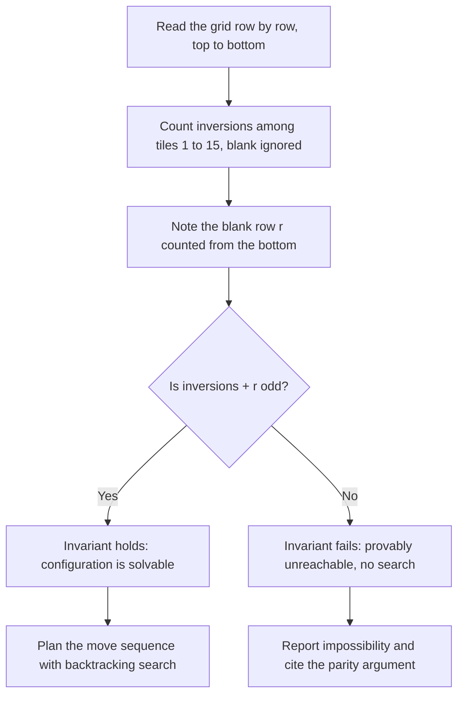
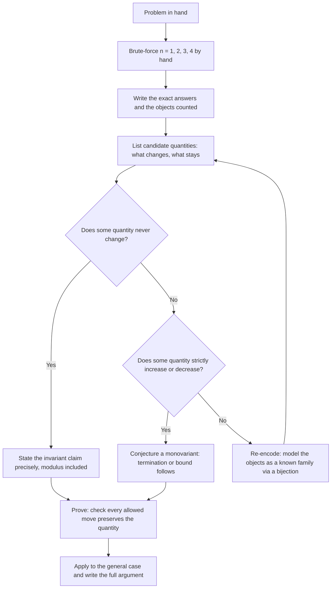

# Olympiad Combinatorics

## Overview

Combinatorics is the largest single area of olympiad mathematics and, for placement purposes, the highest-yield: quant interviews, online assessments, and puzzle rounds all draw from the same small kit of counting bijections, pigeonhole squeezes, and coloring invariants. This page treats that kit proof-first — every technique comes with its statement, a worked mini-example with actual numbers, and the cue in a problem statement that should summon it. Two full classics anchor the page: the 15-puzzle solvability theorem via inversion parity, and the mutilated-chessboard family of coloring arguments, each written out at grader-level rigor with no load-bearing step asserted.

The unifying habit of olympiad combinatorics is finding the right description of the objects: the same set counted two ways, the same process watched through a quantity that never changes, the same impossibility exposed by coloring squares instead of analyzing moves. The engineering counterpart — formulas and runnable code for counting problems — lives in [Discrete Mathematics](../mathematics/discrete-math.md); that page computes, this page proves, and the strategy section at the end turns proof-finding into an explicit, drillable procedure. Every claim below is graded by one standard: can you reproduce the full argument on a whiteboard in under ten minutes, because that is exactly what a quant interviewer asks for.

## Counting: Four Ways to Count the Same Set

Olympiad counting problems rarely reward formula-plugging; they reward finding a second, easier description of the object being counted. Before reaching for any tool, settle the three-way taxonomy every count lives in: are the objects distinguishable, is the order significant, and are there constraints? The four tools below form a ladder of increasing sophistication, the summary table gives each one's formula with a sanity-check number worth memorizing, and a worked example accompanies every tool — because the technique is only learned by watching it execute on a concrete instance.

| Tool | Formula | Counts | Sanity check |
|---|---|---|---|
| Lattice-path bijection | \\( \\binom{m+n}{m} \\) | monotone paths on an \\( m \\times n \\) grid | \\( \\binom{7}{4} = 35 \\) |
| Stars and bars | \\( \\binom{n+k-1}{k-1} \\) | \\( n \\) identical items into \\( k \\) distinct boxes | \\( \\binom{13}{3} = 286 \\) |
| Derangements | \\( !n = n!\\sum_{i=0}^{n} \\frac{(-1)^i}{i!} \\) | permutations with no fixed point | \\( !4 = 9 \\) |
| Committee identity | \\( \\sum_k \\binom{n}{k}\\binom{k}{m} = \\binom{n}{m}2^{n-m} \\) | two-level choices, double counted | \\( 24 = 24 \\) for \\( n=4, m=2 \\) |

### The Bijection Principle

A bijection between two finite sets proves their sizes equal, so the entire art of counting reduces to describing the same set in two languages, one of which is easy to count. Worked example — lattice paths: the number of shortest paths from \\( (0,0) \\) to \\( (4,3) \\) moving only right or up looks like a grid-walking problem until you describe a path as a word of length 7 over the alphabet \\( \\{R, U\\} \\) containing exactly four R's and three U's. Paths and such words correspond perfectly — read the word left to right and follow its steps — so the count is the number of ways to choose which four of seven positions are R, namely \\( \\binom{7}{4} = 35 \\). Nothing about geometry was used beyond the encoding; the bijection did all the work.

The power move on grids is the reflection principle, which counts bad paths by mapping them onto a differently-sized good-path family. Count paths from \\( (0,0) \\) to \\( (n,n) \\) that never rise above the diagonal \\( y = x \\): total paths number \\( \\binom{2n}{n} \\), and every bad path — one touching \\( y = x+1 \\) — maps bijectively to a path from \\( (0,0) \\) to \\( (n-1, n+1) \\) by reflecting its prefix up to the first illegal step in the line \\( y = x \\). The bad count is therefore \\( \\binom{2n}{n-1} \\), giving the Catalan number \\[ C_n = \\binom{2n}{n} - \\binom{2n}{n-1} = \\frac{1}{n+1}\\binom{2n}{n}. \\] For \\( n = 3 \\): \\( 20 - 15 = 5 \\) legal paths. The reflection argument is worth rehearsing until you can draw it, because it is the template for a whole family of "count the complement and reflect" tricks.

Bijection thinking also explains *why* two different-looking answers to the same question must agree, which is a frequent interview follow-up. If you count committee-formations one way and get one formula and another way and get a different formula, both being correct is itself a proof of an identity — this is exactly the double-counting principle of the last subsection below. When an interviewer asks "how many ways", the winning reflex is to ask yourself what other familiar family your objects are secretly a relabeling of, before touching any formula. The formula table above then becomes a lookup of encodings rather than a list of magic results.

The cheapest bijection drill is the one every interviewer assumes you own: subsets of an \\( n \\)-element set correspond perfectly to bit strings of length \\( n \\) (bit \\( i \\) records whether element \\( i \\) is in), so the count is \\( 2^n \\) by pure encoding, no multiplication principle needed. The same drill in fancier clothing produces \\( \\binom{n}{k} \\) as "bit strings with exactly \\( k \\) ones". What makes a bijection proof complete is the two-line verification that the map is injective and surjective — usually one line each, since the encoding and its inverse are read off the same sentence. Practice stating both directions explicitly; graders deduct for "obviously a bijection", and the deduction is fair, because whole families of false solutions hide behind that word.

The Catalan numbers from the reflection computation are worth knowing as a family-recognition signal rather than a formula. The same \\( C_n \\) counts Dyck paths on the grid, binary trees with \\( n \\) nodes, ways to parenthesize a product of \\( n+1 \\) factors, triangulations of a convex \\( (n+2) \\)-gon, and valid sequences of \\( n \\) opens and \\( n \\) closes — and proving any one of these equalities is a bijection exercise, several of which are famous olympiad problems in their own right. The interview form is usually the last one: "how many valid bracket sequences of length \\( 2n \\)" reduces by the reflection argument above to \\( C_n \\). Memorize the shape of the sequence \\( 1, 2, 5, 14, 42, 132 \\) rather than the closed form; recognizing that your small cases are Catalan numbers instantly hands you both an answer and a proof path.

Bijection discipline also polices a subtle double-counting error: if your "objects" map onto the target set non-injectively, every count you produce is wrong by the multiplicity. A sanity ritual that catches this cheaply: compute the count for \\( n = 2 \\) and \\( n = 3 \\) both by your formula and by hand enumeration, and treat any mismatch as a bijection bug rather than an arithmetic bug. The ritual costs ninety seconds and has saved more contest solutions than any theorem in this section.

### Stars and Bars

**Theorem (stars and bars).** The number of ways to place \\( n \\) identical objects into \\( k \\) distinct boxes is \\( \\binom{n+k-1}{k-1} \\). The proof is the bijection principle applied to delimiters: line up the \\( n \\) objects as stars and insert \\( k-1 \\) bars to split them into \\( k \\) consecutive groups; an arrangement is a word of \\( n \\) stars and \\( k-1 \\) bars, i.e., a choice of which \\( k-1 \\) of the \\( n+k-1 \\) positions hold bars. Worked example: distribute 10 identical candies among 4 children — \\( \\binom{10+4-1}{4-1} = \\binom{13}{3} = 286 \\) ways. If every child must get at least one candy, pre-place one candy per child and distribute the remaining 6 freely: \\( \\binom{9}{3} = 84 \\) ways, the general "at least one each" pattern being \\( \\binom{n-1}{k-1} \\).

Two variants cover most interview mutations. Upper bounds ("no child gets more than 3") are handled by inclusion–exclusion, and the numbers are worth watching once: count all 286 distributions, subtract those where some named child gets 4 or more (give that child 4 upfront, distribute 6: \\( 4 \\cdot \\binom{9}{3} = 336 \\)), add back pairs of over-full children (\\( \\binom{4}{2} \\cdot \\binom{5}{3} = 60 \\)), and stop — three children over-full is impossible — giving \\( 286 - 336 + 60 = 10 \\), which matches the hand enumeration of solutions to \\( x_1 + x_2 + x_3 + x_4 = 10 \\) with each \\( x_i \\le 3 \\). Negative lower bounds ("each variable at least \\( -1 \\)") are shifted away by substitution before applying the theorem. The trap to rule out first is identical-versus-distinct: distributing 10 *distinct* candies to 4 children is \\( 4^{10} \\), a completely different count, and conflating the two is the single most common stars-and-bars error in timed settings.

### Inclusion–Exclusion and Derangements

For two sets, \\( |A \\cup B| = |A| + |B| - |A \\cap B| \\), and the general principle alternates signs over all intersections: \\[ |A_1 \\cup \\cdots \\cup A_n| = \\sum_i |A_i| - \\sum_{i<j} |A_i \\cap A_j| + \\cdots + (-1)^{n-1} |A_1 \\cap \\cdots \\cap A_n|. \\] The signature application is the **derangement number** \\( !n \\), the number of permutations of \\( \\{1, \\dots, n\\} \\) fixing no element. Let \\( A_i \\) be the set of permutations fixing \\( i \\); then \\( |A_i| = (n-1)! \\), \\( |A_i \\cap A_j| = (n-2)! \\), and generally fixing a chosen set of \\( k \\) elements leaves \\( (n-k)! \\) arrangements, so inclusion–exclusion gives \\[ !n = \\sum_{k=0}^{n} (-1)^k \\binom{n}{k}(n-k)! = n! \\sum_{k=0}^{n} \\frac{(-1)^k}{k!}. \\] Worked check at \\( n = 4 \\): \\( 24(1 - 1 + \\tfrac{1}{2} - \\tfrac{1}{6} + \\tfrac{1}{24}) = 24 - 24 + 12 - 4 + 1 = 9 \\), matching the hand enumeration of derangements of four letters.

Two consequences make derangements an interview staple. Dividing by \\( n! \\), the probability of no fixed point is \\( \\sum_{k=0}^{n} \\frac{(-1)^k}{k!} \\), which converges to \\( 1/e \\approx 0.368 \\) with error already below 0.004 at \\( n = 6 \\) — so "roughly a third of all hat-checks go home with someone else's hat". The sequence \\( 1, 2, 9, 44, 265 \\) for \\( n = 2, 3, 4, 5, 6 \\) also satisfies the recurrence \\( !n = (n-1)(!(n-1) + !(n-2)) \\), provable by splitting on where element \\( n \\) maps. The cue for inclusion–exclusion is any counting problem with forbidden events ("no one gets their own gift", "no row or column empty", "no adjacent pair chosen") — enumerate the bad events, check that their intersections have a uniform countable form, and alternate signs.

### Double Counting

The double-counting principle: if a set of objects can be described as pairs from two different perspectives, count it once through the first coordinate and once through the second, and equate the results. The committee-counting identity is the canonical instance: \\[ \\sum_{k=m}^{n} \\binom{n}{k}\\binom{k}{m} = \\binom{n}{m}2^{n-m}. \\] Left side: choose a committee of size \\( k \\) from \\( n \\) people, then choose \\( m \\) of its members as officers, and sum over all committee sizes. Right side: choose the \\( m \\) officers directly, then decide independently which of the remaining \\( n-m \\) people join the committee. Both count the same set of (committee, officers) pairs, so they are equal — and expanding a numeric sanity case builds trust in the mechanism: for \\( n = 4, m = 2 \\), the left side is \\( 6 \\cdot 1 + 4 \\cdot 3 + 1 \\cdot 6 = 24 \\) and the right side is \\( 6 \\cdot 4 = 24 \\).

A one-line corollary shows double counting manufacturing standard identities for free: \\[ \\sum_{k=0}^{n} \\binom{n}{k} = 2^n. \\] The left side counts all subsets of an \\( n \\)-element set, grouped by size \\( k \\); the right side counts the same set as \\( n \\) independent in/out decisions. Every "diagonal of Pascal's triangle sums to a power of 2" fact is this one argument, and the habit generalizes up a level: Vandermonde's convolution \\[ \\sum_{k=0}^{n} \\binom{r}{k}\\binom{s}{n-k} = \\binom{r+s}{n} \\] counts \\( n \\)-person teams drawn from two groups of sizes \\( r \\) and \\( s \\), once by the split point and once by ignoring it. Whenever an identity looks like "a sum of products equals one binomial coefficient", hunt for the two-level selection it counts twice.

The most famous double count in all of mathematics is the handshaking lemma: summing degrees over the vertices of a graph counts each edge exactly twice, so \\( \\sum_v \\deg(v) = 2|E| \\). It belongs to the same degree-bookkeeping family as the "two people at a party have shaken the same number of hands" pigeonhole argument in the next section, where that degree perspective is what exposes the hidden structure. In olympiad problems, double counting usually appears as "count the incidences" — between points and lines, students and schools, or tiles and colors — and the moment you can name a natural set of pairs, both sides of the equation tend to fall out. Treat every identity of the form \\( \\sum_a (\\text{something}) = \\sum_b (\\text{something else}) \\) as a prompt to ask: what are we counting twice?

### Recurrences: Classify by What Covers the First Cell

A recurrence is a counting argument frozen in time, and the universal way to find one is to classify objects by what occupies a distinguished position. Worked example: in how many ways can a \\( 2 \\times n \\) corridor be tiled by \\( 1 \\times 2 \\) dominoes? Look at the leftmost column: either one vertical domino covers it, leaving a \\( 2 \\times (n-1) \\) board, or two horizontal dominoes stack over it, leaving a \\( 2 \\times (n-2) \\) board — the two cases are disjoint, exhaustive, and map bijectively onto smaller instances, so \\[ T_n = T_{n-1} + T_{n-2}, \\qquad T_1 = 1, \\;\\; T_2 = 2, \\] which is the Fibonacci sequence: \\( T_{10} = 89 \\). The same classify-by-the-first-cell surgery produces the derangement recurrence \\( !n = (n-1)(!(n-1) + !(n-2)) \\) and the Catalan recurrence, and it is why interviewers love "tile the \\( 2 \\times n \\) board" — the intended signal is the classification, not the Fibonacci value. When a count resists a closed form, a correct recurrence with base cases is a complete answer in both olympiad and algorithmic settings, because it determines the number exactly and often runs as code.

The stair-climbing question — "you climb \\( n \\) steps taking one or two at a time; how many ways?" — is the same recurrence wearing sneakers, classified by the size of the *last* step instead of the first column. That re-dressing matters: interviews recycle the mathematics under different costumes, and the person who sees "first cell, last step, leftmost tile" as one move rather than three tricks answers all of them with a single argument. The base cases deserve equal respect, since a wrong \\( T_1 \\) or an off-by-one in the indexing silently shifts every value; write \\( T_1 = 1 \\) and \\( T_2 = 2 \\) down explicitly before trusting any output of the recurrence.

## Existence Arguments: Pigeonhole, Extremal, Invariants

Counting problems ask *how many*; existence problems ask *must there be one* or *can it be done at all*. The three machines below cover the overwhelming majority of olympiad existence problems, and they are exactly the machines behind the "can this process reach the goal" and "prove some object must exist" question shapes listed on the [Competitive Mathematics hub](./README.md). Each subsection states the machine, runs it on a standard example with numbers, and names the phrasing in a problem that should trigger it.

### The Pigeonhole Principle

If \\( N \\) objects go into \\( k \\) boxes, some box holds at least \\( \\lceil N/k \\rceil \\) objects — trivial to prove, devastating in use, because the entire difficulty lies in choosing what the objects and boxes are. Worked example one (the party): in any group of \\( n \\ge 2 \\) people, two have shaken exactly the same number of hands. Objects are the people, boxes are possible handshake counts \\( 0, 1, \\dots, n-1 \\) — but counts 0 and \\( n-1 \\) cannot both occur (someone shaking hands with everyone excludes someone shaking with no one), so only \\( n-1 \\) boxes hold \\( n \\) people, and two collide.

Worked example two (the unit square): among any 5 points inside a unit square, two are at distance at most \\( \\frac{\\sqrt{2}}{2} \\approx 0.707 \\). Bisect the square into four \\( \\tfrac{1}{2} \\times \\tfrac{1}{2} \\) subsquares; by the generalized principle \\( \\lceil 5/4 \\rceil = 2 \\) points share one, and the diameter of each subsquare is \\( \\sqrt{(1/2)^2 + (1/2)^2} = \\frac{\\sqrt{2}}{2} \\). The craft checklist: the boxes must be strictly fewer than the objects, membership must be forced rather than probabilistic, and every pair inside one box must actually satisfy the desired conclusion — the failure mode is choosing boxes where cohabitation does not yet imply the claim. Divisibility-flavored pigeonhole (odd parts, residues, remainders) is the most common interview variant, and one full instance is waiting in the Interview Questions.

A third flavor — pigeonhole on partial sums — is the standard algorithmic-interview mutation. Claim: among any \\( n \\) integers, some nonempty consecutive run has sum divisible by \\( n \\). Consider the \\( n+1 \\) prefix sums \\( S_0 = 0, S_1, \\dots, S_n \\) modulo \\( n \\): they fall into \\( n \\) residue boxes, so two coincide, say \\( S_i \\equiv S_j \\) with \\( i < j \\), and the run from position \\( i+1 \\) through \\( j \\) has sum \\( S_j - S_i \\equiv 0 \\pmod n \\). The coding-interview version — "find a subarray whose sum is divisible by \\( k \\), in one pass" — is exactly this argument running as an algorithm: store the first occurrence of each prefix residue in a hash map and stop at the first repeat. The proof and the code are the same object, which makes this one of the cleanest bridges between the two halves of this book.

The birthday-style quantitative version sharpens intuition for when pigeonhole bites. With \\( n+1 \\) objects in \\( n \\) boxes a collision is *guaranteed*; with merely \\( \\sqrt{n} \\) random objects in \\( n \\) boxes a collision is already *likely*, because the roughly \\( n/2 \\) pairs each collide with probability \\( 1/n \\). The guarantee version is olympiad material; the probabilistic version is the birthday paradox and the hash-collision analysis behind cryptographic output-length choices. Knowing which regime you are in — forced by the statement or argued by expectation — tells you whether the deliverable is a proof or an estimate.

### The Extremal Principle

To prove that some object with property \\( P \\) exists, pick — among all candidate objects — one that is maximal or minimal for a carefully chosen measure, and show that its extremality forces \\( P \\). Worked example: every finite graph in which every vertex has degree at least 2 contains a cycle. Take a longest path \\( v_1 v_2 \\cdots v_m \\) (longest is the extremal choice); all neighbors of \\( v_m \\) must lie on the path, otherwise the path extends; \\( v_m \\) has at least two neighbors, so besides \\( v_{m-1} \\) it is adjacent to some \\( v_i \\) with \\( i \\le m-2 \\), and \\( v_i v_{i+1} \\cdots v_m v_i \\) is a cycle. The measure ("length of a path") was not given by the problem — inventing it is the creative act, and the sign that you have the right measure is that extremality immediately yields extra structure.

The twin technique is the **minimal counterexample**: to prove all \\( n \\ge n_0 \\) satisfy \\( P \\), assume the set of counterexamples is nonempty, let \\( n \\) be its least element by well-ordering, and derive either a smaller counterexample (contradicting minimality) or a direct contradiction. Example — every integer \\( n \\ge 2 \\) factors into primes: the least non-factoring \\( n \\) cannot be prime, so \\( n = ab \\) with \\( 1 < a, b < n \\); by minimality both \\( a \\) and \\( b \\) factor, so \\( n \\) factors — contradiction. This is strong induction worn as a proof-by-contradiction, and olympiad graders accept either dress, but the extremal phrasing scales to settings with no natural integer parameter (pick the leftmost point, the largest tile, the shortest cycle) where induction syntax would be awkward. The cue is the phrase "show that there exists": before constructing, ask whether taking an extreme object already hands you one.

The famous Erdős–Szekeres theorem shows the two machines fused: among any \\( (r-1)(s-1) + 1 \\) distinct numbers there is an increasing subsequence of length \\( r \\) or a decreasing one of length \\( s \\). Label each position with the pair \\( (L_i, D_i) \\): the lengths of the longest increasing and longest decreasing subsequences ending there — labels defined by maximality, which is the extremal signature. If two positions \\( i < j \\) shared a label, then \\( a_i < a_j \\) forces \\( L_j \\ge L_i + 1 \\) while \\( a_i > a_j \\) forces \\( D_j \\ge D_i + 1 \\); since the numbers are distinct one of these holds, so all labels are distinct. But if no increasing run reaches length \\( r \\) and no decreasing run reaches length \\( s \\), the labels live in a grid of only \\( (r-1)(s-1) \\) cells — one more object than boxes, a pigeonhole contradiction. Concretely: any 10 distinct numbers contain 4 in increasing order or 4 in decreasing order. The architecture to notice — extremal labels feeding a pigeonhole count — is the norm in shortlist-level problems, not the exception.

### Invariants and Monovariants

An **invariant** is a quantity unchanged by every allowed move; an impossibility proof computes the invariant at the start state and at the goal state and observes they differ. The flagship family is chessboard coloring: color the board black and white, and any move whose effect on the color balance is known transfers information between states. Worked example (chameleons): a colony has 13 red, 15 green, and 17 blue chameleons; when two of different colors meet, both turn the third color — can all become one color? A red-green meeting changes the counts by \\( (-1, -1, +2) \\), which modulo 3 is \\( (+2, +2, +2) \\): all three residues shift by the same amount, so the three counts remain pairwise distinct modulo 3 forever. Initially \\( 13 \\equiv 1 \\), \\( 15 \\equiv 0 \\), \\( 17 \\equiv 2 \\pmod 3 \\) — distinct — but a monochromatic state \\( (a, 0, 0) \\) has two equal residues, so the goal is unreachable.

A **monovariant** is a quantity that changes in only one direction; it proves termination and yields bounds rather than impossibility. Worked example: bubble sort on \\( n \\) keys — every swap of an adjacent out-of-order pair decreases the inversion count by exactly 1 and changes nothing else about it, so sorting terminates after exactly \\( I \\) swaps, where \\( I \\) is the initial inversion count bounded by \\( \\binom{n}{2} \\). The same bookkeeping reappears as the engine of the 15-puzzle theorem below, which is no coincidence: inversion count is simultaneously a monovariant (strictly decreasing under sorting swaps) and, taken modulo 2, an invariant (unchanged under puzzle moves). The hunting order for invariants, in increasing cost: parity, then mod 3 and mod 4, then 2-colorings, then signed/weighted sums, then genuinely exotic constructions. When an interviewer asks "can this ever terminate" or "is this state reachable", the expected answer is a quantity, not a search.

Monovariants can be exact-counting machines, not just termination certificates. Worked example: an \\( m \\times n \\) chocolate bar is broken along grooves, one straight break per move — how many breaks separate it completely, regardless of break order? The piece count starts at 1, increases by *exactly* 1 on every break (each break splits one piece into two), and must reach \\( mn \\), so the answer is \\( mn - 1 \\) and the order is irrelevant. This is the strongest possible monovariant outcome: not merely "it terminates" but an exact value forced independently of strategy. The identical argument shows that any binary merging process on \\( N \\) items — merging sorted lists, joining connected components — takes exactly \\( N - 1 \\) merge steps, a two-sentence proof that settles several classic process questions outright.

Turn the hunting process itself into a checklist, because "find an invariant" is only useful as a procedure. First, write the allowed moves formally — a move is a function on states, and its *effect on each candidate quantity* is a computable delta. Second, tabulate the deltas for two or three candidates (counts, sums, parities, signed color balances) across all move types, exactly as the table in the 15-puzzle section does. Third, search for a combination of the candidates — often a single one, sometimes a sum, almost always taken modulo 2 or 3 — whose delta is zero for every move type. The 15-puzzle is the showcase: horizontal moves give deltas \\( (0, 0) \\) on (inversions, blank row) and vertical moves give (odd, 1), so the sum cancels. When no combination cancels, that is information too: either the goal is reachable (no obstruction at this resolution) or you need a finer quantity.

## Worked Classic A: The 15-Puzzle and Inversion Parity

The 15-puzzle is a \\( 4 \\times 4 \\) grid holding tiles numbered 1 through 15 plus one blank; a move slides a tile adjacent to the blank into the blank's cell. Around 1880 Sam Loyd offered \\$1000 — a fortune at the time — for swapping just the tiles 14 and 15 of the solved position while leaving everything else fixed, and no one ever claimed it because the swap is provably impossible. The theorem below is the complete reason, and its proof is the model of an invariant argument: one bookkeeping quantity, one case analysis over move types, one reconciliation step that beginners always miss.

The historical frame is part of the interview charm. The puzzle triggered a genuine craze when it appeared in the 1870s–1880s — newspapers reported employers banning it from offices — and Loyd's reward for the 14-15 swap stood unclaimed because the reward was for reaching a provably unreachable state. That is the genre in one sentence: a search space of \\( 16! \\approx 2.09 \\times 10^{13} \\) configurations in which the question is settled not by exploring but by computing one parity. Interviewers who ask "is this solvable" are testing whether you reach for the parity before the search bar.

**Definition.** For a configuration, list the tiles in reading order (left to right, top to bottom), ignoring the blank. The **inversion count** is the number of pairs appearing out of numerical order in this list. Let \\( r \\) denote the blank's row counted from the bottom, so the solved position has \\( r = 1 \\).

| Move type | Reading-order effect | Inversions | Blank row \\( r \\) |
|---|---|---|---|
| Horizontal slide | the tile passes only the blank | unchanged | unchanged |
| Vertical slide | the tile jumps over exactly 3 tiles | parity flips | parity flips |

**Theorem.** A configuration is solvable if and only if \\( \\text{(inversions)} + r \\) is odd.

*Proof (necessity — every move preserves the invariant).* A horizontal move changes the tile's reading position only relative to the blank, which is ignored, so the tile list is untouched and both inversions and \\( r \\) are unchanged. A vertical move transports a tile across exactly \\( 4 - 1 = 3 \\) entries of the list: its order relative to each of those 3 entries reverses, and all other pairs are unaffected. If \\( j \\) of the three crossed entries were smaller than the moving tile, the inversion count changes by \\( j - (3 - j) = 2j - 3 \\), an odd number, so inversion parity flips; meanwhile the blank moves one row, so the parity of \\( r \\) flips too. Two quantities flipping together means their sum mod 2 is fixed — and the solved state has \\( 0 + 1 = 1 \\), odd, so every solvable configuration has an odd invariant. Loyd's swap has tile list \\( 1, 2, \\dots, 13, 15, 14 \\): exactly one inversion, \\( r = 1 \\), invariant \\( 2 \\), even — unreachable, and the \\$1000 was safe. \\( \\square \\)

The reconciliation step deserves its own paragraph because it is where most first attempts stall. Inversions alone are *not* invariant: the vertical-move computation shows each vertical move flips their parity, which looks fatal until you notice the blank's row flips in the same breath, and pairing the two flip-flopping quantities into one sum recovers a genuine invariant. This is a general design pattern — when a candidate invariant breaks under some moves, look for a second quantity that breaks in the opposite direction under exactly the same moves. The grid width is the whole story: a vertical move jumps \\( w - 1 \\) list entries, so for odd width \\( w \\) (like the \\( 3 \\times 3 \\) puzzle) the jump count is even, inversion parity alone is invariant, and the \\( 3 \\times 3 \\) puzzle is solvable exactly when its inversion count is even, with the blank's position irrelevant.

The decision procedure below turns the theorem into a two-minute interview answer: compute two numbers, compare one parity, and only then decide whether searching for a solution is even sensible.



*Completeness (sufficiency — sketch of the converse).* The theorem's "only if" is the proof above; the "if" — that every configuration satisfying the invariant is genuinely reachable — is a constructive standard result, quoted here at the level an interview requires. Inside any \\( 2 \\times 2 \\) block containing the blank, one can cycle the other three tiles around the block and return the blank to its cell, executing a 3-cycle; three-cycles generate all even permutations, and a conjugation argument (slide any chosen three tiles into one window, cycle them, slide back) shows the reachable set from any position is closed under every even permutation of the tiles with the blank returned. Since the invariant partitions the \\( 16! \\) configurations into two equal halves and the reachable set is contained in one half while closed under enough even permutations to fill it, reachable set and invariant class coincide. The full writeup is Johnson and Story, "The Fifteen Puzzle: A New Approach," *American Mathematical Monthly* 114 (2007) — cite it by name if asked where the converse is proven in print.

The engineering coda makes this a systems lesson, not just a party trick. The state space has \\( 16! \\approx 2.09 \\times 10^{13} \\) configurations, half of them reachable, so blind search is hopeless at any interview clock — while the invariant check costs \\( O(n^2) \\) to compute two numbers and settles reachability instantly. This is also the natural home of \\( \\text{A}^* \\)-style solvers: an \\( O(n^2) \\) Manhattan-distance admissible heuristic guides IDA* search (the 15-puzzle is the classic benchmark exercise in the backtracking chapter linked at the bottom of this page), but the parity invariant is stronger than a heuristic — it is exact, pruning with certainty rather than biasing the search. When a proof can replace a search, ship the proof; checking a two-number invariant before proposing to explore ten trillion states is precisely the judgment the question is screening for.

## Worked Classic B: Coloring Invariants — Mutilated Boards and Trominoes

**Problem.** From a standard \\( 8 \\times 8 \\) chessboard remove the two diagonally opposite corner squares \\( a1 \\) and \\( h8 \\). Can the remaining 62 squares be tiled by 31 dominoes, each covering two adjacent squares?

**Answer: no — by a coloring invariant.** Color the board as a chessboard. Every domino, horizontal or vertical, covers exactly one black and one white square: adjacency in the grid always switches color. Therefore any domino-tiled region must contain equal numbers of black and white squares. The two removed corners \\( a1 \\) and \\( h8 \\) have the same color (their coordinate sums \\( 1+1 \\) and \\( 8+8 \\) are both even), so the mutilated board has 30 squares of one color and 32 of the other. Thirty-one dominoes would require 31 of each — contradiction, and the argument never once mentioned a particular placement of dominoes, which is the signature strength of invariants. \\( \\square \\)

**The converse question is the interview differentiator.** The invariant gives a *necessary* condition: the removed squares must have opposite colors. Is it *sufficient* — does removing any black-white pair always leave a tileable board? On the \\( 8 \\times 8 \\) board the answer is yes, with a beautiful structural proof: trace a Hamiltonian cycle through the board (a closed tour visiting every square once, returning to its start), note that consecutive squares along the cycle have alternating colors, and remove the two chosen squares — the cycle splits into two paths, and because the deleted squares had opposite colors, each path contains an even number of squares with colors still alternating. Lay dominoes along each path, pairing consecutive squares. The lesson generalizes: an invariant proves impossibility, but establishing possibility requires a *construction*, and the Hamiltonian-cycle trick — build one global structure, then localize — is the standard constructive partner to coloring arguments.

The Hamiltonian cycle itself deserves its one-sentence construction, since the argument above quietly leaned on its existence. Build it explicitly on the \\( 8 \\times 8 \\): traverse column 1 from top to bottom, snake columns 2 through 8 vertically between rows 8 and 2 (up, down, up, and so on), then close the loop by walking back along the reserved top row from its right end to the starting square — a closed tour through all 64 squares in which consecutive squares are always grid-adjacent, hence color-alternating. Deleting any black square and any white square from an alternating even cycle leaves two paths, each starting and ending on opposite colors, hence each of even length, hence each a chain that dominoes tile pairwise. Sketch-level as it is, the construction is complete enough to verify by hand in a minute, and it converts the sufficiency claim from "known result" into "exhibited object" — the difference between citing and proving that this page keeps pressing.

**Trominoes: the constructive sibling.** Claim: a \\( 2^n \\times 2^n \\) board with any single square removed can be tiled by L-trominoes (\\( 2 \\times 2 \\) squares missing one cell), for all \\( n \\ge 1 \\). Proof by divide-and-conquer induction: split the board into four \\( 2^{n-1} \\times 2^{n-1} \\) quadrants; the missing square lies in one quadrant; place one L-tromino at the board's center covering the central corner of each of the *other three* quadrants. Now all four quadrants are \\( 2^{n-1} \\)-scale boards with exactly one square missing — three by the tromino, one by the original hole — so the induction hypothesis applies to each, and the base case \\( n = 1 \\) is a \\( 2 \\times 2 \\) board minus a square, which is itself a single tromino. The tile count checks out arithmetically: \\( (4^n - 1)/3 \\) trominoes, an integer since \\( 4^n \\equiv 1 \\pmod 3 \\). This proof pattern (quadrant split, one bridging object, recurse) is the same engine as merge sort and is worth naming as such in interviews.

**A coin-flipping invariant in one breath.** A row of coins shows some heads; a move flips exactly two *adjacent* coins. Can all-tails be reached? Each move changes the number of heads by \\( -2 \\), \\( 0 \\), or \\( +2 \\), so the parity of the head count is invariant, and all-tails (0 heads, even) is reachable only from an even-headed start. When simple parity is too coarse, upgrade to a weighted sum: assign square \\( i \\) the value \\( (-1)^i \\) or a power of 2, and track the total — the mutilated-board argument above is exactly the weighted sum with weights \\( +1 \\) and \\( -1 \\) by color. The general recipe stands: find any quantity conserved by every move, compute it at both ends, and let the mismatch do the proving.

It is worth articulating *why* coloring arguments work, because the mechanism generalizes. A coloring is an assignment of values (here \\( +1 \\) and \\( -1 \\)) such that every allowed piece has a known total contribution — each domino contributes exactly 0 to the signed sum — and therefore any tileable region's total is a sum of piece contributions with a forced form. The impossibility then falls out of arithmetic: 30 against 32 cannot be assembled from 31 zero-contribution pieces. This "additive over pieces" structure is what makes weighted variants (powers of 2, signs, residues) so effective: you are free to design any weight function whose per-piece contribution is fixed, and the cleverer the weights, the finer the obstruction they detect. The 15-puzzle invariant is the same object in different clothes — a weight on configurations that every move preserves.

Know the boundary of what coloring proves, because overstating an invariant is a classic grader penalty. The color-balance condition is only *necessary*: it kills every same-colored pair of removals on any board, but it does not promise that an opposite-colored pair suffices — on the \\( 8 \\times 8 \\) the Hamiltonian construction delivers sufficiency as a separate theorem, and on other rectangles the sufficiency question needs its own constructive case analysis (see the deficient-board papers of Chu and Johnsonbaugh for how far this rabbit hole goes). The discipline to state which direction your argument proves — impossibility from the invariant, possibility only from an exhibited construction — is exactly the proof hygiene that separates full solutions from partial ones. In interviews, volunteering "the invariant proves it impossible; here is a construction for the other direction" is the two-part answer that scores.

## Technique Router: Reading the Cue

Olympiad problems telegraph their technique through stock phrasing, and so do interviewers. The table pairs each cue with the machine to reach for and the concrete first move; it is the combinatorics counterpart of the modulus-selection table on the number-theory page.

| Cue in the statement | Technique | First move |
|---|---|---|
| "In how many ways..." | Bijection / encoding | Describe the objects as words, subsets, or paths \\( \\binom{m+n}{m} \\)-style |
| "Distribute \\( n \\) identical..." | Stars and bars \\( \\binom{n+k-1}{k-1} \\) | Settle identical-vs-distinct, then bounds, then count bar positions |
| "No one gets their own..." | Inclusion–exclusion | Name the forbidden events; check intersections have uniform size |
| "At least two share..." | Pigeonhole | Build fewer boxes than objects; verify cohabitation forces the claim |
| "Show that there exists..." | Extremal | Pick the max/min object for an invented measure; read off forced structure |
| "Prove it is impossible..." | Invariant | Compute a conserved quantity at start and goal; compare |
| "Show the process terminates" | Monovariant | Find a quantity that strictly moves one way; bound its range |
| "Can this position be reached?" | Parity invariant | Inversions, coloring balance, or sum mod \\( k \\) at both ends |

Cues can mislead, and the router is a starting hypothesis rather than a verdict. A problem saying "in how many ways" may secretly demand an invariant because the answer is "none"; a problem saying "show there exists" may be a counting problem in disguise where a double count supplies the existence. When two cues conflict, retreat to the small-case ladder of the next section: compute \\( n = 1, 2, 3 \\) honestly, and let the data pick the machine. The router's real value under time pressure is negative — it tells you immediately what *not* to try, which is most of the search space.

Train the router the way you train openings in chess: by tagging. After every practice problem, label which cue fired and which machine solved it, and after thirty tagged problems your personal misprediction list — the cues you misread, the machines you reach for too late — becomes visible and correctable. The router also compounds across this section's siblings: the number-theory page's modulus table and this table are the same reflex (find the cheapest structure that decides the question) applied to different objects. Candidates who internalize the reflex rather than the tables transfer it to unfamiliar problems, which is the only thing interviews actually test.

## Strategy: The Small-Case Ladder

The single highest-leverage habit in olympiad combinatorics, and the one interviewers explicitly watch for, is computing small cases before theorizing. Write out \\( n = 1, 2, 3, 4 \\) by hand — enumerate the actual configurations, count them exactly, and record the answers where you can see them. The numbers do three jobs at once: they confirm or kill your reading of the problem, they supply the raw material for a conjecture, and they provide base cases if the eventual proof is inductive. Budget a fixed five minutes for this phase; skipping it to hunt for a clever idea is the most common structural failure in timed work, and it is also the failure interviewers find most telling.

The analysis phase is a disciplined split of the data into *what changes* and *what stays*. List every quantity you can compute on the small cases — counts, parities, sums, orderings, color balances — and mark each as moving or constant across the cases. Whatever stays constant is a candidate invariant; whatever moves monotonically is a candidate monovariant; whatever the answer sequence matches a known family (\\( 1, 2, 5, 14 \\) shouts Catalan) is a candidate bijection target. Then convert the observation into a *precise* claim — not "parity matters" but "the parity of the inversion count plus the blank row is odd in every reachable position" — and prove it by checking every allowed move, one case per move type. The flowchart is the whole procedure as an attack order.



Three escape hatches when the ladder stalls. First, change what you track: if tile positions lead nowhere, track the blank; if people, track handshake counts; if colors, track color differences modulo 3 — the chameleons became easy only after the switch from counts to residues. Second, re-encode the objects: the lattice-path count became trivial only after paths became words, and the 15-puzzle became tractable only after moves became list permutations; a stalled problem is usually an encoding problem. Third, split the claim: prove the impossibility half by invariant and the construction half by explicit building, as the mutilated-board section does — many two-part problems resolve as one invariant plus one construction, and recognizing that shape halves the work. When the proof finally closes, re-derive it once from scratch; combinatorial arguments are cheap to re-derive and expensive to memorize, and the re-derivation is precisely the skill quant interviews rent by the hour.

### A Full Ladder Run in Miniature

Problem: the numbers \\( 1, 2, \\dots, n \\) sit on a board; each move erases two numbers \\( a, b \\) and writes \\( |a - b| \\) in their place; after \\( n - 1 \\) moves exactly one number remains. Which final values are achievable? Run the ladder honestly, small cases first:

```text
n=2:  erase 1,2 -> |1-2| = 1           reachable: {1}
n=3:  1,2 -> 1; then |1-3| = 2         reachable: {2}
      1,3 -> 2; then |2-2| = 0         reachable: {0}    (union: {0, 2})
n=4:  1,3 -> 2; 2,2 -> 0; |4-0| = 4    reachable: {4}
      2,4 -> 2; 1,3 -> 2; 2,2 -> 0     reachable: {0}    (union: {0, 2, 4})
```

The pattern reads "even numbers up to \\( n \\)" — now isolate what stays. The invariant is the parity of the board sum: a move replaces the sum \\( s \\) by \\[ s' = s - a - b + |a - b| = s - 2\\min(a, b), \\] an even change, so \\( s \\bmod 2 \\) never moves and the final number \\( f \\) must satisfy \\( f \\equiv 1 + 2 + \\cdots + n = \\frac{n(n+1)}{2} \\pmod 2 \\). Check against the table: \\( n = 2 \\) forces odd (got 1), \\( n = 3 \\) forces even (got 0 and 2), \\( n = 4 \\) forces even (got 0, 2, 4) — the necessary condition holds every time. Since a difference never exceeds the current maximum, every board value stays in \\( [0, n] \\), so the invariant pins the answer down to: \\( f \\) has the parity of \\( n(n+1)/2 \\) and lies in \\( [0, n] \\).

The constructive half — that *every* value of the correct parity in that range is reachable — is exactly the two-part shape this page keeps highlighting, and the \\( n = 4 \\) witness already contains its two building blocks: manufacture a 0 from a matched pair \\( (x, x) \\), and walk the maximum down by 2 by pairing it against a 0. Completing that construction for general \\( n \\) is a worthwhile exercise; the meta-lesson is the shape of the run — five minutes of honest enumeration produced the conjecture, the conjecture named the invariant, and the invariant was proven by one delta computation rather than by a leap of cleverness. That is the normal texture of olympiad combinatorics: the cleverness lives in the procedure, not in any single step.

### Narrating the Ladder Under a Clock

In an interview, narrate the ladder out loud instead of running it silently. State the small-case table as you compute it ("for \\( n = 2 \\) the answer is 1; for \\( n = 3 \\) I get 0 and 2"), announce the pattern as a conjecture rather than a fact, and name the invariant you are hunting before you prove it — this invites correction while the stakes are low and shows the interviewer a structured search, which is the actual signal being scored. The budget that works for a 20-minute slot: five minutes computing and tabulating small cases, five extracting the what-changes/what-stays split and stating a precise conjecture, the remainder proving it move-by-move and handling the general \\( n \\).

If minute fifteen arrives with no proof, switch tracks deliberately — change the tracked quantity or re-encode the objects — and say so out loud. Interviewers score the recovery maneuver as heavily as the closure, because real quantitative work consists mostly of recoveries. A candidate who says "my invariant hunt failed, so the answer may be 'yes it can reach the goal'; let me instead try to construct it" demonstrates exactly the hypothesis-testing loop that separates strong candidates from memorizers, and it costs nothing but a sentence.

## Interview Questions

1. **How many shortest lattice paths run from (0,0) to (4,3), and how would you prove it?** Encode each path as a word of length 7 over \\( \\{R, U\\} \\) with exactly four R's and three U's; the encoding is a bijection, so the count is \\( \\binom{7}{4} = 35 \\). The proof obligation is exactly the bijection — reading a word as instructions to follow — and stating it explicitly is what separates a full answer from a formula invocation. The standard follow-up is the Catalan constraint "never go above the diagonal": reflect each bad path's prefix at its first illegal step to map bad paths to paths ending at \\( (2, 4) \\), giving \\( 20 - 15 = 5 \\). That reflection move is the same one behind ballot-problem answers in probability screens.
2. **From the integers 1 to 2n, prove that any n+1 of them contain two where one divides the other.** Write each chosen number as \\( 2^k \\cdot q \\) with \\( q \\) odd; the odd part \\( q \\) lies in \\( \\{1, 3, \\dots, 2n-1\\} \\), a set of only \\( n \\) values. By pigeonhole, two of the \\( n+1 \\) choices share an odd part, say \\( 2^a q \\) and \\( 2^b q \\) with \\( a \\le b \\), and the first divides the second. The technique to name is pigeonhole on a canonical factorization, and the common wrong turn is trying to induct on \\( n \\). It generalizes: any property that sorts numbers into fewer bins than numbers yields a divisibility- or equality-type collision.
3. **Why can the 14 and 15 tiles never be swapped in the 15-puzzle?** Reading the swapped board gives the tile list \\( 1, \\dots, 13, 15, 14 \\) — exactly one inversion — with the blank on the bottom row, \\( r = 1 \\). The invariant "inversions plus blank row from bottom, modulo 2" equals 0 here but equals 1 in the solved state, so the configuration is unreachable. The justification the interviewer probes: a vertical slide jumps a tile over exactly 3 list entries, flipping inversion parity and blank-row parity together, so their sum never changes. Mention that for the \\( 3 \\times 3 \\) puzzle the jump is over 2 entries, so inversion parity alone is the invariant — the width-dependent jump length is the entire difference.
4. **A colony has 13 red, 15 green, and 17 blue chameleons; meetings turn two different-colored animals into the third color. Can they ever all be one color?** No. Any meeting changes the three counts by \\( (-1, -1, +2) \\), which shifts all three residues by \\( +2 \\) modulo 3, so the counts stay pairwise distinct mod 3 forever. Initially the residues are 1, 0, 2 — distinct — while any monochromatic state \\( (a, 0, 0) \\) repeats a residue. The answer is a two-line invariant, and the natural follow-up is constructive: change 17 to 16 and the residues become 1, 0, 1, so all-green or all-red becomes reachable, and the mod-3 bookkeeping tells you which target color and roughly how many meetings it takes.
5. **A standard chessboard loses two corner squares of the same color. Prove no domino tiling exists — and say which removals do admit one.** Every domino covers one black and one white square, so a tiled region needs equal color counts; removing two same-colored corners leaves 30 against 32, which is impossible. For the converse, removing any two opposite-colored squares *does* admit a tiling: take a Hamiltonian cycle through the board whose consecutive squares alternate in color, delete the two squares, and the cycle falls into two paths, each containing an even, color-alternating stretch of squares that dominoes tile pairwise. The pair (invariant impossibility, structural construction) is the complete answer, and offering the converse unprompted is the depth signal.
6. **What is the chance that no one at a party of n gets their own hat back, and why does it stabilize?** The count of derangements is \\( !n = n! \\sum_{k=0}^{n} \\frac{(-1)^k}{k!} \\) by inclusion–exclusion over the "person \\( i \\) gets their own hat" events, whose \\( k \\)-fold intersections all have size \\( (n-k)! \\). Dividing by \\( n! \\) leaves the partial sums of \\( e^{-1} \\), so the probability is \\( 1/e \\approx 0.368 \\) with error under 0.004 from \\( n = 6 \\) onward. Concrete values to have ready: \\( !4 = 9 \\) of 24, \\( !5 = 44 \\) of 120. The recurrence \\( !n = (n-1)(!(n-1) + !(n-2)) \\) is the usual follow-up, provable by conditioning on where person \\( n \\)'s own hat goes.

## Key Takeaways

- Counting is re-encoding: every olympiad count is a bijection from hard objects to easy words, subsets, or paths — \\( \\binom{7}{4} = 35 \\) lattice paths is the template, and verifying injectivity is part of the proof.
- Stars and bars \\( \\binom{n+k-1}{k-1} \\) counts identical-into-distinct; "at least one each" is one substitution and upper bounds are one inclusion–exclusion pass (the \\( 286 - 336 + 60 = 10 \\) example).
- Inclusion–exclusion handles forbidden-event counts; derangements \\( !n \\to n!/e \\) are its signature result, and \\( !4 = 9 \\) is the sanity value to know cold.
- Double counting equates two descriptions of one set of pairs; the committee identity \\( \\sum_k \\binom{n}{k}\\binom{k}{m} = \\binom{n}{m}2^{n-m} \\), the subsets-to-\\( 2^n \\) count, and the handshaking lemma are the three instances to rehearse.
- Pigeonhole wins when you can name fewer boxes than objects; the party problem (degrees 0 and \\( n-1 \\) exclusive), 5 points in a unit square (\\( \\sqrt{2}/2 \\)), and prefix sums mod \\( n \\) are the canonical drills.
- Extremal arguments invent a measure and let maximality do the proving; minimal counterexample is the same machine in contradiction's clothing, and Erdős–Szekeres shows extremal labels feeding a pigeonhole count.
- Invariants decide reachability: inversion parity plus blank row solves the 15-puzzle, residues mod 3 solve the chameleons, color balance solves the mutilated board — and monovariants (inversions under sorting, pieces per break) prove termination and exact counts.
- The attack order is fixed: brute-force \\( n = 1..4 \\), split what changes from what stays, state the invariant precisely, verify it move-by-move, then write the full argument — and narrate all of it out loud.

## References

- [IMO official site](https://www.imo-official.org) — problem archives and statistics; combinatorics dominates problems 1, 2, and 5 in most years.
- [IMO problems database](https://www.imo-official.org/problems.aspx) — searchable by subject, year, and difficulty; filter for combinatorics problems.
- [Art of Problem Solving](https://artofproblemsolving.com) — the primary practice ecosystem for olympiad combinatorics.
- [AoPS Wiki](https://artofproblemsolving.com/wiki) — per-problem solution threads for every classic cited on this page.
- [AoPS Community](https://artofproblemsolving.com/community) — live discussion during contest season and multiple-solution threads.
- [Evan Chen's site](https://web.evanchen.us) — free handouts on olympiad combinatorics, including bijections and invariants, at olympiad precision.
- [Yufei Zhao's site](https://yufeizhao.com) — olympiad training notes from MIT, with combinatorics problem sets graded by technique.
- [HBCSE Olympiads](https://olympiads.hbcse.tifr.res.in) — the Indian national olympiad program's official archive and past papers.
- [Project Euler](https://projecteuler.net) — counting problems where the proof-based answer feeds executable verification.
- [Brilliant](https://brilliant.org) — guided combinatorics tracks with immediate feedback, useful before archive problems.
- *Problem-Solving Strategies* (Arthur Engel) — the combinatorics chapter is the classic treatment of invariants and extremal arguments.
- *The Art and Craft of Problem Solving* (Paul Zeitz) — the gentlest first pass on bijections, symmetry, and the small-case ladder.
- *102 Combinatorial Problems* (Titu Andreescu & Zuming Feng) — a graded problem ladder with full solutions, matching this page's technique order.
- *Putnam and Beyond* (Răzvan Gelca & Titu Andreescu) — the combinatorics part bridges olympiad technique to university-level contests.
- I.-P. Chu and R. Johnsonbaugh, "Tiling Deficient Boards with Trominoes," *Mathematics Magazine* 59 (1986) — the deficient-rectangle tiling literature referenced in the coloring section.
- W. W. Johnson and W. E. Story, "The Fifteen Puzzle: A New Approach," *American Mathematical Monthly* 114 (2007) — the rigorous source for the 15-puzzle converse quoted above.

## Cross-References

- [Competitive Mathematics Hub](./README.md) — section overview: where olympiad techniques are screened and how this page's skills map to interview venues.
- [Olympiad Number Theory](./number-theory-olympiad.md) — the sibling technique page; its modulus-selection table is the NT twin of this page's technique router.
- [IMO Guide](./imo-guide.md) — contest format, grading standards, and where combinatorics sits in the difficulty curve.
- [Olympiad Algebra](./algebra-olympiad.md) — the third technique page; functional equations and inequalities share the extremal machinery.
- [India's Math Olympiad Pipeline](./india-math-olympiads.md) — the RMO/INMO circuit where these techniques are examined under time pressure.
- [Discrete Mathematics](../mathematics/discrete-math.md) — the engineering sibling: the same counting laws as formulas and code for real systems.
- [Mathematics Section](../mathematics/README.md) — the wider engineering-math context in which the discrete-counting page sits.
- [Logic & Deduction Puzzles](../interview/puzzles/logic-deduction.md) — interview puzzles where invariants and parity arguments are the expected tool.
- [Puzzles & Brain Teasers](../interview/puzzles/README.md) — the wider puzzle section these techniques feed into.
- [Backtracking](../dsa/chapters/ch09-backtracking.md) — the algorithmic counterpart of the small-case ladder; the 15-puzzle is a classic backtracking benchmark.
- [Book Index](../index.md) — the full repository map for orienting neighboring sections.
