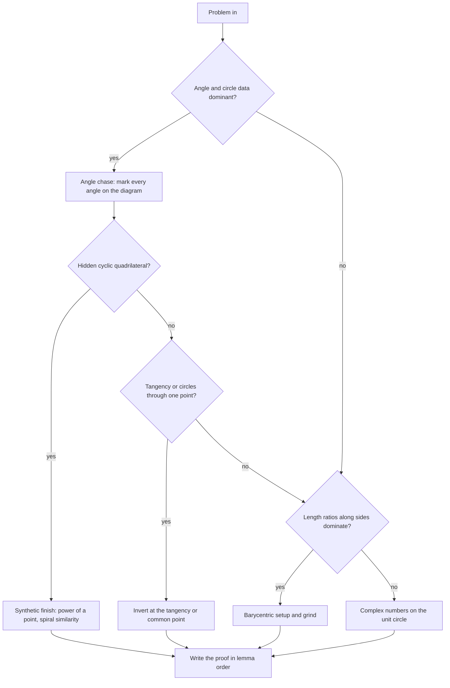

# Olympiad Geometry

## Overview

Olympiad geometry is the most self-contained olympiad area: a fixed cast of configurations (circles, tangents, altitudes, arc midpoints) attacked with a fixed arsenal (power of a point, angle chasing, homothety, spiral similarity, inversion, and two coordinate fallbacks). Unlike algebra or combinatorics, where the difficulty is distributed across problem types, geometry concentrates its difficulty in seeing one hidden configuration — and once seen, the proof is often five lines. This page builds the synthetic core first, then the analytic fallbacks, then the discipline that decides which to deploy.

For placement candidates, geometry is the lowest-priority olympiad area but not a zero: the proof-writing discipline, the "extract all information before computing" habit, and a handful of configuration reflexes transfer to interview puzzles, and a few firms with math-heavy cultures do ask geometry-adjacent questions. The page therefore optimizes for the classic training value — one complete worked problem, one decision flow, one configuration table — rather than encyclopedic coverage. The formal algebra behind coordinates lives in the [Mathematics section](../mathematics/README.md); here coordinates are a fallback tool, not a syllabus.

How to read the page: sections are ordered by attack priority, not by textbook tradition. The synthetic core comes first because it is tried first on every problem; the coordinate fallbacks come later because they are deployed only when the synthetic search fails; inversion sits between them as the surgical tool for tangency-heavy configurations. The closing sections compress everything into a configuration table, a decision flow, and one fully worked problem that chains the tools in the order the discipline section prescribes.

Prerequisites are modest: comfort with high-school circle theorems (inscribed angles, Thales) and basic similarity, plus the algebra habit of manipulating ratios cleanly. Nothing from calculus or university mathematics is used anywhere on this page. If the angle vocabulary feels shaky, a single session redoing the inscribed-angle theorem's proof from the central-angle case is enough to start, and the worked fragments here restate every fact they use.

## The Synthetic Core

Five tools — the inscribed-angle vocabulary, power of a point, radical axes, cyclic quadrilaterals, and the two similarities — solve the majority of olympiad geometry problems up to the national level. Each subsection gives the statement, the standard use, and a worked fragment. Master these before touching coordinates, because every coordinate method is in effect a mechanical version of a synthetic fact you could have seen directly.

### Angles in Circles: The Vocabulary

Angle chasing needs a precise language for angles defined by circles, and three facts are the whole vocabulary. **Inscribed angle theorem**: an angle \\( \\angle AXB \\) with vertex \\( X \\) on a circle subtends the arc \\( AB \\), and its measure is half the central angle over the same arc — equivalently, \\( \\angle AXB \\) is constant as \\( X \\) moves along the same arc. **Same-segment angles**: two vertices on the same arc see a chord under equal angles, and vertices on opposite arcs see supplementary angles; this is the version used dozens of times per problem. **Tangent-chord theorem**: the angle between a tangent at \\( X \\) and a chord \\( XY \\) equals the inscribed angle subtending \\( XY \\) from the other side — the limit of the same-segment fact as one vertex slides into \\( X \\).

A worked fragment shows the vocabulary in action. Let \\( A, B, C, D \\) lie on a circle with \\( AB \\) a diameter, and let the tangent at \\( A \\) meet line \\( BC \\) at \\( T \\). Then \\( \\angle ACB = 90^\\circ \\) (Thales, diameter), and \\( \\angle BAC = 90^\\circ - \\angle ABC \\) from the triangle sum. The tangent-chord theorem gives \\( \\angle TAC = \\angle ABC \\), so \\( \\angle CAT = 90^\\circ \\) — wait, more carefully: \\( \\angle TAB = \\angle ACB = 90^\\circ \\) by the tangent-chord theorem applied to chord \\( AB \\), which says precisely that the tangent at \\( A \\) is perpendicular to the diameter \\( AB \\), confirming the radius-tangent fact. The exercise looks trivial, but the reflex it builds — translating every tangency into an angle statement via the tangent-chord theorem — is the move that unlocks most tangent problems in practice.

### Power of a Point

**Definition.** For a fixed circle \\( \\omega \\) with center \\( O \\) and radius \\( r \\), the power of a point \\( P \\) is \\( \\mathrm{Pow}_{\\omega}(P) = OP^2 - r^2 \\). The sign carries the geometry: positive when \\( P \\) is outside \\( \\omega \\), zero on the circle, negative inside.

**Theorem (power of a point).** For any line through \\( P \\) meeting \\( \\omega \\) at \\( X \\) and \\( Y \\), the signed product \\( PX \\cdot PY \\) is constant, equal to \\( \\mathrm{Pow}_{\\omega}(P) \\). Three faces of the same fact: intersecting chords through an interior point give \\( PA \\cdot PB = PC \\cdot PD \\); two secants from an exterior point give \\( PA \\cdot PB = PC \\cdot PD \\) along the two lines; a tangent from an exterior point gives \\[ PT^2 = PA \\cdot PB. \\] The proof in each case is a pair of similar triangles: for the tangent case, \\( \\angle PTA = \\angle PBT \\) by the tangent-chord theorem, and with \\( \\angle P \\) common, triangles \\( PTA \\) and \\( PBT \\) are similar, giving \\( PT/PB = PA/PT \\). For the chord case, vertical angles at \\( P \\) plus equal subtended angles give the same AA structure.

Worked example. From an exterior point \\( P \\), a tangent \\( PT \\) touches \\( \\omega \\) with \\( PT = 6 \\), and a secant through \\( P \\) meets \\( \\omega \\) at \\( A \\) then \\( B \\) with \\( PA = 4 \\). Then \\( PA \\cdot PB = PT^2 = 36 \\), so \\( PB = 9 \\) and \\( AB = 5 \\). A second quick computation, interior this time: chords \\( AB \\) and \\( CD \\) meet at \\( P \\) with \\( PA = 3 \\), \\( PB = 8 \\), \\( PC = 4 \\); then \\( 3 \\cdot 8 = 4 \\cdot PD \\) gives \\( PD = 6 \\). The computations are one line each, which is the point: whenever a problem involves tangents, secants, or chords through a shared point, the length relation is automatic and the real work is elsewhere — angles, cyclicity, or a second configuration sharing the same point. Power of a point is the single most-used lemma in olympiad geometry, and it is also the bridge to the next tool.

### Similar Triangles: The Engine Behind Every Length

Length claims in olympiad geometry are proved by similar triangles in essentially four configurations, and knowing the list converts length hunting into angle hunting. **AA via two inscribed angles**: chords \\( AB \\) and \\( CD \\) meeting at \\( P \\) give triangles \\( PAC \\) and \\( PDB \\) with vertical angles at \\( P \\) and equal subtended angles \\( \\angle PAC = \\angle PDB \\) — this is the similarity that *proves* power of a point. **AA via tangent-chord**: the tangent-secant similarity worked above. **SAS**: two sides proportional around a shared or provably equal angle, as in the altitude-feet problem worked at the end of this page. **The midline configuration**: midpoints \\( M, N \\) of \\( AB \\), \\( AC \\) force \\( \\triangle AMN \\sim \\triangle ABC \\) with ratio \\( 1/2 \\), giving \\( MN \\parallel BC \\) and \\( MN = BC/2 \\) — the length-and-parallelism fact that homothety generalizes.

The practical consequence: when a problem asks for a length or ratio, do not hunt for a length theorem — hunt for the similar-triangle pair. Find two triangles whose angles you can match (usually via the same-segment or tangent-chord facts), and the ratio falls out of the proportionality. Every "hard" length problem in the national-level archive reduces to a chain of two or three such similarities, and the configuration table at the end of the page is organized around exactly this recognition step.

### Radical Axes

**Definition and theorem.** The radical axis of two circles \\( \\omega_1, \\omega_2 \\) is the locus of points with equal power with respect to both: \\[ \\mathrm{Pow}_{\\omega_1}(P) = \\mathrm{Pow}_{\\omega_2}(P). \\] It is a straight line perpendicular to the line of centers; for intersecting circles it is exactly the common chord (both powers vanish at the intersection points); for tangent circles it is the common tangent at the tangency point. For three circles, the three pairwise radical axes are concurrent (or parallel), and the meeting point is the **radical center**.

Worked fragment (the radical center proof). Let \\( \\omega_1, \\omega_2, \\omega_3 \\) be three circles with pairwise radical axes \\( \\ell_{12}, \\ell_{23}, \\ell_{13} \\). Let \\( X = \\ell_{12} \\cap \\ell_{23} \\). Since \\( X \\in \\ell_{12} \\), \\( \\mathrm{Pow}_{\\omega_1}(X) = \\mathrm{Pow}_{\\omega_2}(X) \\); since \\( X \\in \\ell_{23} \\), \\( \\mathrm{Pow}_{\\omega_2}(X) = \\mathrm{Pow}_{\\omega_3}(X) \\). Chaining the equalities, \\( \\mathrm{Pow}_{\\omega_1}(X) = \\mathrm{Pow}_{\\omega_3}(X) \\), so \\( X \\in \\ell_{13} \\) — the third axis passes through the intersection of the first two. Five lines, no coordinates, and the argument is the template for every "prove three lines concur" ending: identify the three circles whose radical axes are the given lines, then quote the chain of equal powers.

**How it is used beyond the theorem.** The radical axis converts "prove three lines are concurrent" into "identify three circles whose pairwise radical axes are those lines" — a standard ending for problems about lines through chord intersections. The second standard use is collinearity: a point \\( X \\) with equal powers to \\( \\omega_1, \\omega_2 \\) and to \\( \\omega_2, \\omega_3 \\) automatically has equal powers to \\( \\omega_1, \\omega_3 \\), so it lies on a line through two other determined points. A third use computes positions: the difference of powers \\( OP_1^2 - r_1^2 - (OP_2^2 - r_2^2) \\) is linear in \\( P \\), so equal-power sets are quickly located. When a problem features two or three circles plus lines through their intersection points, radical-axis language is usually the entire solution's skeleton.

### Cyclic Quadrilaterals and Angle Chasing

**The criteria.** A quadrilateral \\( ABCD \\) is cyclic iff \\( \\angle ABC + \\angle CDA = 180^\\circ \\) (opposite angles), iff \\( \\angle ADB = \\angle ACB \\) (equal angles subtending the same chord \\( AB \\) from the same side). The first is the workhorse for four-point configurations; the second is the workhorse for proving a specific point lies on a known circle. Two supporting facts: the angle subtended by a diameter is \\( 90^\\circ \\) (Thales), and its converse puts any right-angle vertex on the circle with the hypotenuse as diameter.

Workable example (the arc-midpoint classic). Let the angle bisector of \\( \\angle A \\) in triangle \\( ABC \\) meet the circumcircle again at \\( M \\), and let \\( I \\) be the incenter. Claim: \\( MB = MC = MI \\). Angle chase: \\( \\angle MBC = \\angle MAC = A/2 \\) since both subtend chord \\( MC \\). Next, \\( \\angle MBI = \\angle MBC + \\angle CBI = A/2 + B/2 \\), while \\( \\angle BIM = A/2 + B/2 \\) as the exterior angle of triangle \\( ABI \\) at \\( I \\) (it equals \\( \\angle BAI + \\angle ABI = A/2 + B/2 \\)). So \\( \\angle MBI = \\angle BIM \\) and triangle \\( MBI \\) is isosceles with \\( MB = MI \\). Finally \\( M \\) bisects arc \\( BC \\) (it lies on the angle bisector from \\( A \\)), so \\( MB = MC \\). The lesson: no lengths were computed anywhere — the entire result is angular bookkeeping, which is why angle chasing is the first discipline of the page.

### Homothety and Spiral Similarity

**Homothety.** A homothety with center \\( O \\) and ratio \\( k \\) maps each point \\( P \\) to \\( P' \\) on line \\( OP \\) with \\( OP' = k \\cdot OP \\). It maps lines not through \\( O \\) to parallel lines, preserves all angles, and maps circles to circles: the image of circle \\( \\omega \\) with center \\( C \\) radius \\( r \\) is the circle with center \\( O + k(C - O) \\) and radius \\( |k| r \\). Two non-concentric circles have exactly two homothety centers — the intersections of their two pairs of common tangents — and if two circles are tangent at \\( T \\), then \\( T \\) itself is a homothety center. **When it appears:** midpoints and midlines (ratio \\( 1/2 \\) homotheties), problems where a small circle touches a big one (tangency point as center), and any configuration where a segment's image is a known parallel segment. The reflex: seeing "circle tangent to circle" or "midpoint of two segments" should immediately suggest the homothety that carries one to the other, turning length relations into ratios.

Worked fragment (the midline as homothety). In triangle \\( ABC \\), let \\( M \\) and \\( N \\) be the midpoints of \\( AB \\) and \\( AC \\). The homothety centered at \\( A \\) with ratio \\( 1/2 \\) sends \\( B \\mapsto M \\) and \\( C \\mapsto N \\), so it sends segment \\( BC \\) to segment \\( MN \\). Lines map to parallel lines, hence \\( MN \\parallel BC \\); lengths scale by the ratio, hence \\( MN = BC/2 \\). What would take two similarity arguments is one sentence in homothety language, and the same sentence handles the harder variants — for instance, any configuration where a smaller triangle is provably the \\( k \\)-scaled image of a larger one inherits parallelism and length ratios for free.

**Spiral similarity.** A spiral similarity with center \\( S \\), angle \\( \\theta \\), and ratio \\( k \\) is a rotation about \\( S \\) by \\( \\theta \\) composed with the homothety of ratio \\( k \\) about \\( S \\). The central fact, stated at the level this page needs: if triangles \\( SAB \\) and \\( SCD \\) are directly similar (\\( \\angle ASB = \\angle CSD \\) and \\( SA/SC = SB/SD \\)), then a spiral similarity centered at \\( S \\) maps segment \\( AB \\) to segment \\( CD \\), and for any two segments such a center exists. **When it appears:** two circles sharing two points (the shared points are spiral centers transferring chords of one circle to chords of the other), Miquel configurations, and any problem where two segments are seen under equal angles from a candidate center. The practical move: prove the two triangles similar by angle chasing, then transfer every angle in the problem through the spiral map — the map is a machine that converts "equal angles" into "corresponding angles" at scale.

### Ratios Along Sides: Menelaus and Ceva

Two classical theorems own the "collinearity and concurrence on a triangle" problem type. **Ceva's theorem**: cevians \\( AD, BE, CF \\) (with \\( D \\in BC \\), \\( E \\in CA \\), \\( F \\in AB \\)) are concurrent iff \\[ \\frac{BD}{DC} \\cdot \\frac{CE}{EA} \\cdot \\frac{AF}{FB} = 1. \\] **Menelaus' theorem**: points \\( D \\in BC \\), \\( E \\in CA \\), \\( F \\in AB \\) are collinear iff the same product of signed ratios equals \\( -1 \\) (with unsigned ratios, the transversal meets an odd number of sides externally, and the product is still \\( 1 \\) after bookkeeping the odd one out). Both are proved by an area argument: ratio of segments along a side equals ratio of areas of the two subtriangles with the shared vertex, and the products telescope.

The working pattern: a problem asks to prove three points collinear (Menelaus) or three lines concurrent (Ceva), and the solution reduces the claim to a product of three ratios, each of which is computed from the given data — often from similar triangles or power of a point. The two theorems are duals under the cevian/transversal swap, and barycentric coordinates (next section) mechanize both: concurrence and collinearity become determinant conditions on point coordinates. For training purposes, prove Ceva once with areas and Menelaus once with signed lengths; both proofs are short and the manipulations reappear whenever side ratios dominate a configuration.

## Coordinate Fallbacks

When the synthetic search stalls, coordinates convert geometry to algebra. Two systems dominate, and the choice between them is dictated by the configuration: barycentrics when ratios along sides dominate, complex numbers when everything sits on one circle. Both are heavy machinery — the cost is real computation, and the payoff is that the computation cannot hide a synthetic insight you lack.

### Barycentric Coordinates: Setup Recipe

**The system.** Fix a reference triangle \\( ABC \\). A point \\( P \\) has barycentric coordinates \\( (x : y : z) \\) meaning \\( P = \\frac{xA + yB + zC}{x + y + z} \\) in vector terms; with the normalized (areal) form \\( x + y + z = 1 \\), the coordinates are the signed areas of the subtriangles \\( PBC \\), \\( PCA \\), \\( PAB \\). Vertices are \\( A = (1:0:0) \\) and so on; a point on side \\( BC \\) has \\( x = 0 \\) and the shape \\( (0 : y : z) \\) with \\( BP : PC = z : y \\). Lines have linear equations \\( lx + my + nz = 0 \\), and three points are collinear exactly when the determinant of their coordinate rows vanishes; three lines concur exactly when the determinant of their coefficient rows vanishes.

**The recipe.** One: choose as reference triangle the one that most of the given lines pass through — usually the main triangle of the problem. Two: translate every given ratio along a side into a side-point coordinate using \\( BP : PC = z : y \\). Three: translate every concurrence and collinearity into a determinant condition — this mechanizes Ceva and Menelaus without memorizing their signed-ratio conventions. Four: grind the algebra; the enemy is arithmetic slips, not ideas. **When to deploy:** problems dense with ratios \\( BD/DC \\), cevians, and contact points; problems where angle chasing yields nothing because no circle is present. **When not:** anything where the key fact is angular — barycentrics handle angles only through heavy trigonometric forms, and a synthetic step missed here costs pages of algebra.

### Complex-Number Geometry: The Unit Circle Trick

**The setup.** Put the circumcircle of the main triangle as the unit circle in the complex plane, so the vertices are complex numbers \\( a, b, c \\) with \\( |a| = |b| = |c| = 1 \\), hence \\( \\bar{a} = 1/a \\). This conjugation identity is the entire engine: every "point on the circle" fact becomes an algebraic identity, and angles become arguments of quotients — \\( \\angle ABC = \\arg \\frac{a - b}{c - b} \\), so equal angles become statements about vanishing arguments of cross-ratio-like expressions.

**The three formulas worth memorizing.** The line through two unit-circle points \\( u, v \\): \\[ z + uv \\bar{z} = u + v, \\] verified by plugging \\( z = u \\) and \\( z = v \\) and using \\( \\bar{u} = 1/u \\). The orthocenter of triangle \\( ABC \\) inscribed in the unit circle: \\[ h = a + b + c, \\] which follows by checking that \\( h - a = b + c \\) is perpendicular to \\( BC \\) — a one-line computation since \\( (b + c)/b \\) has argument \\( \\angle ABC \\) plus \\( 90^\\circ \\). Third, cyclicity of four points \\( z_1, \\dots, z_4 \\) becomes the reality of a cross-ratio, and tangency conditions become double roots of an intersection equation. **When to deploy:** problems where everything lives on or near one circle — the unit-circle trick turns "prove \\( X \\) lies on the circle" into "prove a polynomial identity." Statement-level is enough for this page: the method is mechanical but heavy, and the decision to use it should come only after the synthetic search has genuinely failed.

## Inversion

**Definition.** The inversion with center \\( O \\) and radius \\( r \\) maps each point \\( P \\ne O \\) to the point \\( P' \\) on ray \\( OP \\) with \\[ OP \\cdot OP' = r^2. \\] Lines through \\( O \\) map to themselves; a line not through \\( O \\) maps to a circle through \\( O \\); a circle through \\( O \\) maps to a line not through \\( O \\); a circle not through \\( O \\) maps to another circle. Inversion preserves angles (it is conformal, reversing orientation) and preserves tangency. A circle orthogonal to the inversion circle is fixed pointwise. The radius is a free parameter — choose it for convenience; the incidence structure of the image configuration does not depend on it.

**Choosing the attack.** Invert when many lines and circles pass through a single point, or when tangency dominates — inversion converts circles through the center into lines, collapsing the configuration to one dimension lower. The center goes at the point of maximum incidence: a tangency point, a common point of several circles, or a vertex where many given lines meet. The radius is best chosen so that a circle central to the problem maps to itself (an orthogonal circle is fixed pointwise), which keeps useful objects visible in the image. The risk to manage: images of circles not through the center are circles again, so a configuration with no point of high incidence gains nothing and loses familiarity — invert only when the collapse is real.

**The classic tangent problem, solved.** Two circles \\( \\omega_1, \\omega_2 \\) are tangent to each other at \\( P \\). A common external tangent touches \\( \\omega_1 \\) at \\( X \\) and \\( \\omega_2 \\) at \\( Y \\). Prove \\( \\angle XPY = 90^\\circ \\). Invert about \\( P \\) with any radius. Since both circles pass through the center of inversion, they map to lines \\( \\ell_1 \\) and \\( \\ell_2 \\); because the circles were tangent at \\( P \\) (sharing a tangent direction there), \\( \\ell_1 \\parallel \\ell_2 \\) — both image lines are perpendicular to the common line of centers. The points \\( X, Y \\) map to \\( X' \\in \\ell_1 \\), \\( Y' \\in \\ell_2 \\). The tangent line \\( XY \\), which does not pass through \\( P \\), maps to a circle \\( \\Gamma' \\) through \\( P \\), \\( X' \\), \\( Y' \\). Inversion preserves tangency, so \\( \\Gamma' \\) is tangent to \\( \\ell_1 \\) at \\( X' \\) and to \\( \\ell_2 \\) at \\( Y' \\). Let the distance between the parallel lines be \\( d \\): a circle tangent to both has radius \\( d/2 \\), its center lies on the midline, and its two tangency points \\( X', Y' \\) are the feet of the perpendiculars from the center to the two lines — hence diametrically opposite. So \\( X'Y' \\) is a diameter of \\( \\Gamma' \\), and since \\( P \\) lies on \\( \\Gamma' \\), Thales gives \\( \\angle X'PY' = 90^\\circ \\). Finally, \\( X' \\) lies on ray \\( PX \\) and \\( Y' \\) on ray \\( PY \\) (that is what inversion does to rays), so \\( \\angle XPY = \\angle X'PY' = 90^\\circ \\). Study the shape of this proof: one well-chosen inversion turned two tangent circles into two parallel lines, where the result became Thales' theorem — this is the standard way inversion earns its place.

## The Discipline: Angle Chase First, Lengths Second

The single highest-leverage habit in olympiad geometry is ordering your attack: extract all angular information before computing any length. The reasoning is structural. Cyclicity, tangency, equal arcs, and similarity are all angular conditions; they are cheap to check (mark and compare angles) and they unlock the length relations (power of a point, similar triangles) as consequences. Working lengths-first, by contrast, means computing quantities whose simplification depends on structure you have not yet found — the classic way a 20-minute problem becomes a 2-hour one.

### Directed Angles

Serious write-ups use **directed angles modulo \\( 180^\\circ \\)**: \\( \\angle(AB, CD) \\) is the angle of rotation taking line \\( AB \\) to line \\( CD \\), taken modulo \\( 180^\\circ \\) and signed by orientation. The convention has one huge payoff: every same-segment and tangent-chord statement becomes unconditional, because \\( \\angle AXB = \\angle ACB \\pmod{180^\\circ} \\) holds no matter which arcs the points sit on, and concyclicity becomes the single condition \\( \\angle AXB = \\angle ACB \\) without case analysis on configuration. The cost is one discipline rule — never read a directed angle as a number between \\( 0^\\circ \\) and \\( 180^\\circ \\) until the final step, where you convert back to ordinary angles for the conclusion. Training advice: chase in ordinary angles first to build the picture, but write the final solution in directed angles; it eliminates the case-splitting that loses partial credit, and it is the convention every modern reference (including the EGMO book) uses.

### The Standard Angle-Chase Repertoire

The angle-chase procedure needs a concrete move list; these eight moves cover essentially every national-level angle extraction.

1. **Same-segment transfer**: \\( \\angle AXB = \\angle AYB \\) for \\( X, Y \\) on the same arc of circle over chord \\( AB \\) — the most-used move in the subject.
2. **Exterior angle**: \\( \\angle BIC = \\angle BAI + \\angle ABI \\) type identities convert an unknown angle into two known ones (the incenter lemma above is built on this).
3. **Isosceles base angles**: whenever two lengths are equal or two radii meet a chord, mark the two base angles equal immediately.
4. **Tangent-chord conversion**: every tangency in the diagram is worth one angle statement — apply the theorem at every tangent point as a reflex.
5. **Triangle sum bookkeeping**: keep a running total per triangle; in any triangle, two known angles give the third.
6. **Thales**: right angles over diameters — look for the hypotenuse that two right angles share.
7. **Parallel-line angles**: alternate and corresponding angles, especially after a homothety or midline produces the parallelism.
8. **Angle bisector recognition**: two computed angles coming out equal around a vertex is often the *conclusion* in disguise — the arc-midpoint classic works exactly this way.

Run the moves in this order on a fresh diagram and most openers resolve without any length computation at all. When the list stalls, the missing ingredient is almost always a cyclicity claim not yet proven — return to the three criteria and re-scan the diagram for each.

The concrete procedure. Draw the diagram large and accurate; inaccurate diagrams hide the configuration. Mark every given angle, then propagate: angles in the same segment, exterior angles, isosceles base angles, angles summing at a point — labeling each computed angle on the diagram as you go. Watch for the standard cyclicity triggers: a pair of equal angles subtending the same segment, opposite angles summing to \\( 180^\\circ \\), or two right angles over a shared hypotenuse (Thales). Only when the angular picture is complete should you look for the length kill: a tangent plus a secant (power), two triangles with two equal angles (similarity), or a tangent point between two circles (homothety). The exception that proves the rule: problems that are pure length computations start directly from power of a point or similar triangles — but even there, a two-minute angle sweep first usually reveals the similarity that the computation needs.

Interviewers who use geometry at all are testing this discipline rather than the theorems: can you organize given information completely before computing? The answer "I would first mark every angle and find the hidden cyclic quadrilateral, then extract the length relation" demonstrates the transferable skill, and the configuration table below is the checklist that makes the answer concrete.

## Configuration Cheat Sheet

The table maps the recurring configurations to their key lemma and the shape of the typical solution. It is a recognition aid for practice sessions: when stuck, scan the left column against your diagram.

| Configuration in the diagram | Key lemma | Typical solution shape |
|---|---|---|
| Tangent from external point \\( P \\), secant through \\( P \\) | \\( PT^2 = PA \\cdot PB \\) | One-line length; tangent-chord for angles |
| Feet of two altitudes \\( E, F \\) | \\( B, C, E, F \\) cyclic on diameter \\( BC \\) | Power of the opposite vertex, then similarity |
| Equal angles subtending same segment | Concyclicity criterion | Angle chase to prove cyclic, then power of a point |
| Two circles intersecting at two points | Common chord is the radical axis | Radical center for concurrence or collinearity |
| Two circles tangent at \\( T \\) | \\( T \\) is a homothety center; invert at \\( T \\) | Tangent conditions become parallel lines |
| Midpoints of two segments | Midline is parallel and half the length | Homothety of ratio \\( 1/2 \\) transfers ratios |
| Two segments seen under equal angles from \\( S \\) | Spiral similarity centered at \\( S \\) | Prove two triangles similar; transfer angles |
| Angle bisector meets circumcircle at \\( M \\) | \\( MB = MC = MI \\) (incenter \\( I \\)) | Pure angle chase, no lengths |
| Point with equal power to three circles | Radical center | Concurrence of the three radical axes |
| Cevians or transversals on a triangle | Ceva or Menelaus | Product of three side ratios; barycentrics mechanize |
| Chords through one interior point | \\( PA \\cdot PB = PC \\cdot PD \\) | Length bookkeeping, often with similar triangles |

## Choosing Synthetic vs Analytic

The decision of how to attack is worth drawing as a flow, because the wrong choice wastes the most time. The dominant variable is what kind of information the problem gives: angles and circles push synthetic, ratios along sides push barycentric, and everything-on-one-circle pushes complex numbers.

Two riders on the flow. First, the synthetic branch is always tried first even when another branch will win, because a partially found configuration often collapses the problem entirely — the coordinate methods have no such upside. Second, the write-up order matters as much as the discovery order: a coordinate bash discovered first may still deserve a synthetic proof for the archive, since the synthetic version is what transfers to the next problem.

## A Complete Worked Problem

**Problem.** Let \\( ABC \\) be an acute triangle. Let \\( E \\) be the foot of the altitude from \\( B \\) onto \\( AC \\), and \\( F \\) the foot of the altitude from \\( C \\) onto \\( AB \\). Prove that (i) \\( B, C, E, F \\) are concyclic, (ii) \\( AE \\cdot AC = AF \\cdot AB \\), and (iii) triangles \\( AEF \\) and \\( ABC \\) are similar.

**Step 1.** By definition of the foot, \\( BE \\perp AC \\), and since \\( E \\) lies on \\( AC \\), we get \\( \\angle BEC = 90^\\circ \\). This is the given data translated into one angle.

**Step 2.** Symmetrically, \\( CF \\perp AB \\) with \\( F \\in AB \\) gives \\( \\angle BFC = 90^\\circ \\).

**Step 3.** Both \\( E \\) and \\( F \\) see segment \\( BC \\) under a right angle. By the converse of Thales' theorem, each lies on the circle with diameter \\( BC \\).

**Step 4.** Therefore \\( B, C, E, F \\) all lie on the circle with diameter \\( BC \\), proving (i). The acute hypothesis guarantees \\( E \\) and \\( F \\) land strictly between the vertices, so the configuration is the non-degenerate one.

**Step 5.** Consider the power of \\( A \\) with respect to this circle. The line \\( AC \\) meets the circle at \\( E \\) and \\( C \\), so the power equals \\( AE \\cdot AC \\) (secant from an exterior point; \\( A \\) is exterior because the triangle is acute).

**Step 6.** The line \\( AB \\) meets the circle at \\( F \\) and \\( B \\), so the same power equals \\( AF \\cdot AB \\).

**Step 7.** Powers computed along two lines from one point are equal, so \\( AE \\cdot AC = AF \\cdot AB \\), proving (ii).

**Step 8.** Divide both sides by \\( AB \\cdot AC > 0 \\): \\[ \\frac{AE}{AB} = \\frac{AF}{AC}. \\] This is the length structure, extracted without any computation beyond one division.

**Step 9.** Triangles \\( AEF \\) and \\( ABC \\) share the angle at \\( A \\) (the same two rays \\( AB \\) and \\( AC \\) contain \\( AF \\) and \\( AE \\)). Two pairs of adjacent sides are proportional — \\( AE/AB = AF/AC \\) — around this equal included angle, so \\( \\triangle AEF \\sim \\triangle ABC \\) by SAS similarity, proving (iii).

**Step 10.** The correspondence is \\( A \\leftrightarrow A \\), \\( E \\leftrightarrow B \\), \\( F \\leftrightarrow C \\), so \\( \\angle AEF = \\angle ABC \\) and \\( \\angle AFE = \\angle ACB \\): the segment \\( EF \\) makes with \\( AC \\) the same angle \\( BC \\) makes with \\( AB \\) — \\( EF \\) is antiparallel to \\( BC \\) in angle \\( A \\). This is the seed fact of orthic-triangle theory: adding the third altitude foot \\( D \\) on \\( BC \\) completes the orthic triangle \\( DEF \\), and the same angle-chase machinery shows each side of \\( ABC \\) is an angle bisector of the orthic triangle at the corresponding foot.

The pedagogical point of the ten steps: (i) is pure Thales, (ii) is pure power of a point, (iii) is pure similarity, and the only skill was ordering them correctly. Every configuration table entry above resolves into a chain of exactly this kind, which is why the discipline section's ordering rule decides outcomes so reliably. When archiving your own solutions, tag them by the chain of lemmas used rather than by contest source — the chains, not the sources, are what recur.

## Training Plan for Geometry

Geometry rewards concentrated drilling over long grazing, and four weeks of structured work cover the page. Week 1: power of a point plus cyclicity — drill the tangent-secant computation until it is reflexive, and solve ten problems whose entire solution is "find the hidden circle, then take powers." Week 2: similar triangles plus Menelaus and Ceva, including two barycentric setups to feel the mechanization. Week 3: inversion and homothety, with the tangent-circles classic re-derived from scratch and five tangency-heavy problems. Week 4: complex numbers on the unit circle for the everything-on-one-circle archetype, plus timed mocks from national olympiad papers. The daily unit is one problem at 45 minutes, then a full written solution regardless of whether the answer came — the writing is where the discipline rules get enforced.

### Common Failure Modes in Geometry

The grader's geometry checklist is short, and auditing against it catches most lost points:

- **Inaccurate diagram**: a drawing where the hidden circle does not look cyclic hides the configuration; draw large, use a compass if allowed, and redraw rather than salvage.
- **Assumed cyclicity**: using \\( \\angle AXB = \\angle ACB \\) without having proven \\( A, B, C, X \\) concyclic — the most common logical gap in beginner write-ups.
- **Incomplete propagation**: stopping the angle chase one step early, exactly when one more same-segment transfer would expose the similarity.
- **Missed configurations**: points on line extensions (external cevians, \\( P \\) outside the circle) silently treated as interior; handle both cases or use directed angles and lengths.
- **Sign errors**: intersecting-chord and secant products with unsigned lengths; state the directed convention once and stick to it.
- **Lengths before structure**: computing a length whose simplification depends on a cyclic quadrilateral not yet found — the anti-discipline the whole page argues against.

## Where Geometry Appears on Real Papers

On the IMO paper, geometry traditionally occupies one of the opener slots (Problem 1 or 4) and one mid-paper slot (Problem 2 or 5), with a roughly one-per-year frequency; national olympiads such as the Indian INMO reliably include one geometry problem, often the most approachable on the paper for well-drilled students. The [IMO guide](./imo-guide.md) maps the full difficulty curve and grading; the [India page](./india-math-olympiads.md) shows where in the selection pipeline geometry weight matters most. For interview-only candidates, the honest calibration: expect the discipline and configuration reflexes to transfer, not the specific theorems, and budget training time accordingly — a week of power-of-a-point drills buys more interview value than a month of advanced configurations.

## Books and Handouts

Two book resources dominate self-study here. *Euclidean Geometry in Mathematical Olympiads* (Evan Chen, often abbreviated EGMO) is the modern standard: it builds the synthetic core in lemma order, includes barycentric and complex chapters exactly as fallbacks, and its problems come with full solution write-ups in a style worth imitating. *Lemmas in Olympiad Geometry* (Titu Andreescu et al.) organizes training by lemma rather than by chapter theory, which suits candidates who already have basics and want configuration fluency. For the complex-number method specifically, *Complex Numbers from A to Z* (Andrica & Andreescu) is the classical reference. The free companion to EGMO is the author's handout collection at [web.evanchen.us](https://web.evanchen.us), including the diagram conventions that make write-ups readable; the per-problem solution archives on [AoPS](https://artofproblemsolving.com/wiki) cover every past olympiad geometry problem with multiple attacks, and the [resources directory](./resources-directory.md) slots each source into a goal-based stack.

## Interview Questions

1. **State power of a point and prove the tangent-secant case in two lines.** For circle \\( \\omega \\) and point \\( P \\), the product \\( PX \\cdot PY \\) over any line through \\( P \\) meeting \\( \\omega \\) at \\( X, Y \\) is constant and equals \\( OP^2 - r^2 \\). For the tangent case: \\( \\angle PTA = \\angle PBT \\) by the tangent-chord theorem, and \\( \\angle P \\) is common to triangles \\( PTA \\) and \\( PBT \\), so they are similar (AA). Similarity gives \\( PT/PB = PA/PT \\), i.e., \\( PT^2 = PA \\cdot PB \\). The signed-product formulation handles interior points uniformly, which is why the theorem is stated with signs in serious references.
2. **How many ways do you know to prove that four points are concyclic?** Three workhorses. Opposite angles: \\( \\angle ABC + \\angle CDA = 180^\\circ \\) iff \\( ABCD \\) is cyclic. Equal subtended angles: \\( \\angle ADB = \\angle ACB \\) with \\( C, D \\) on the same side of \\( AB \\) iff cyclic. Thales' converse: \\( \\angle BXC = 90^\\circ \\) puts \\( X \\) on the circle with diameter \\( BC \\) — the fastest route whenever two right angles share a hypotenuse. Power of a point gives a fourth, length-based criterion: a point \\( P \\) with \\( PA \\cdot PB = PC \\cdot PD \\) along two lines through the four points forces cyclicity. In practice the Thales criterion is the most common first try, because so many configurations contain hidden right angles.
3. **When do you invert, and how do you choose the center and radius?** Invert when many lines and circles pass through a single point, or when tangency dominates the configuration — inversion converts circles through the center into lines, collapsing the configuration. The center goes at the point of maximum incidence: a tangency point, a common point of several circles, or a vertex where many given lines meet. The radius is free; choose it so a convenient circle maps to itself (for example, an orthogonal circle stays pointwise fixed), which keeps useful objects visible. The classic payoff is the tangent-circles problem: two circles tangent at \\( P \\) become two parallel lines, and the angular conclusion becomes Thales' theorem.
4. **Barycentric or synthetic — how do you decide, and what are the trade-offs?** Decide by the type of data. Ratios along sides, cevians, and concurrence facts translate directly into barycentric linear algebra, so a problem stating \\( BD/DC \\) conditions is barycentric-friendly; angles and circles are not, and there the coordinates produce pages of algebra for facts a two-line angle chase would give. Synthetic solutions transfer (the same lemma solves the next problem), while coordinate grinds usually do not — that is the real cost beyond the time. The professional habit: spend the first ten minutes on the synthetic search with the configuration table; only then deploy coordinates, and record in your archive which of the two actually worked so the pattern compounds.
5. **Walk me through the altitude-feet problem: feet E and F from B and C in acute triangle ABC.** First the angular structure: \\( \\angle BEC = \\angle BFC = 90^\\circ \\), so by Thales' converse both feet lie on the circle with diameter \\( BC \\) — that is the hidden cyclic quadrilateral. Then lengths: the power of \\( A \\) with respect to this circle, computed along the two secants \\( AEC \\) and \\( AFB \\), gives \\( AE \\cdot AC = AF \\cdot AB \\) in one line. Dividing by \\( AB \\cdot AC \\) yields \\( AE/AB = AF/AC \\), and with the shared angle at \\( A \\), SAS gives \\( \\triangle AEF \\sim \\triangle ABC \\) with correspondence \\( E \\leftrightarrow B \\), \\( F \\leftrightarrow C \\). The problem is a perfect miniature of the discipline: circle first, power second, similarity last.
6. **What do homothety and spiral similarity each buy you, and when do they appear?** A homothety maps circles to circles and lines to parallel lines, so it appears whenever two circles are tangent (the tangency point is a homothety center) or whenever midpoints and parallel segments show up (the ratio-\\( 1/2 \\) homothety of the midline). A spiral similarity — rotation plus dilation about one center — appears when two segments are seen under equal angles from a point: prove \\( \\triangle SAB \\sim \\triangle SCD \\) with matching orientation and you can transfer every angle between the two circles. The two tools cover complementary data: homothety for tangency and parallelism, spiral for equal-angle chord transfers. Both convert a relation in one part of the diagram into the corresponding relation elsewhere, which is the main way olympiad geometry problems chain their steps.

## Key Takeaways

- Power of a point is the most-used lemma in olympiad geometry: one signed product \\( PX \\cdot PY = OP^2 - r^2 \\) covers chords, secants, and tangents, and every case is two similar triangles.
- Radical axes convert concurrence and collinearity problems into "name three circles": the pairwise axes of three circles meet at the radical center, proved by chaining equal powers.
- Cyclic quadrilaterals are the hub of angle chasing; the three criteria (opposite angles, equal subtended angles, Thales' converse for right angles) are the recognition triggers.
- Similar triangles are the engine behind every length claim; the four standard setups (chords, tangent-secant, SAS around a shared angle, midline) cover national-level practice.
- Menelaus and Ceva own collinearity and concurrence on a triangle; both reduce the claim to a product of three side ratios, and barycentric coordinates mechanize them entirely.
- Homothety handles tangency and midpoints (circles to circles, lines to parallels); spiral similarity handles equal-angle chord transfers; both turn one configuration's facts into another's.
- Inversion is the surgical tool: circles through the center become lines, tangency survives, angles survive — invert at the point of maximum incidence, with the radius chosen for a fixed orthogonal circle.
- The discipline rule decides outcomes: complete the angle chase — mark, propagate, find the hidden circle — before computing any length; pure length problems are the exception that starts at power of a point.
- Configuration fluency beats theorem collection: the cheat-sheet table plus one fully worked chain (Thales, then power, then similarity) is the actual training unit.

## References

- [Evan Chen's handouts](https://web.evanchen.us) — free handouts on olympiad geometry technique and the companion materials to EGMO.
- [AoPS Wiki](https://artofproblemsolving.com/wiki) — per-problem solution archives for every past olympiad geometry problem, with multiple attacks per problem.
- [AoPS Community](https://artofproblemsolving.com/community) — live threads where synthetic and coordinate solutions of the same problem are compared.
- [IMO Official Problems Archive](https://www.imo-official.org/problems.aspx) — every IMO geometry problem since 1959 with statements and score statistics.
- [Brilliant](https://brilliant.org) — guided practice on power of a point, cyclicity, and inversion with immediate feedback.
- *Euclidean Geometry in Mathematical Olympiads* (Evan Chen) — the modern standard text; the synthetic core plus both coordinate fallbacks.
- *Lemmas in Olympiad Geometry* (Titu Andreescu et al.) — lemma-organized training for configuration fluency.
- *Complex Numbers from A to Z* (Andrica & Andreescu) — the classical reference for the complex-number method.
- *Problem-Solving Strategies* (Arthur Engel) — the geometry chapter for the extremal and construction-flavored problems.

## Cross-References

- [Olympiad Algebra](./algebra-olympiad.md) — the inequality and functional-equation toolkit; the sibling technique page.
- [Olympiad Number Theory](./number-theory-olympiad.md) — divisibility, orders, and the proof-first worked-classics format.
- [Olympiad Combinatorics](./combinatorics-olympiad.md) — invariants and extremal arguments; the third sibling technique page.
- [IMO Guide](./imo-guide.md) — where geometry sits on the IMO paper and how the difficulty curve distributes.
- [Indian Math Olympiads](./india-math-olympiads.md) — the national pipeline where geometry weight matters stage by stage.
- [Resources Directory](./resources-directory.md) — where to find past papers, handouts, and the books listed above.
- [Mathematics Section](../mathematics/README.md) — the engineering-math context (coordinates, vectors, formal linear algebra) that backs the analytic fallbacks.
- [Competitive Math Hub](./README.md) — section overview and the olympiad-vs-engineering framing.
