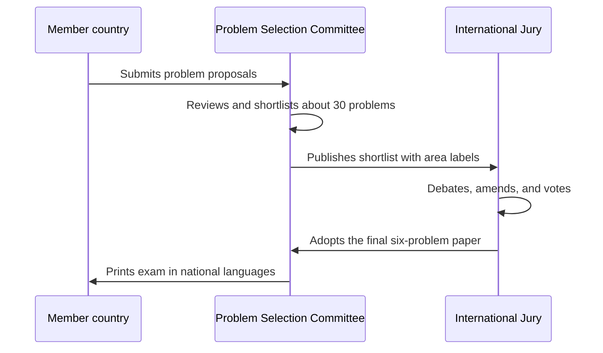
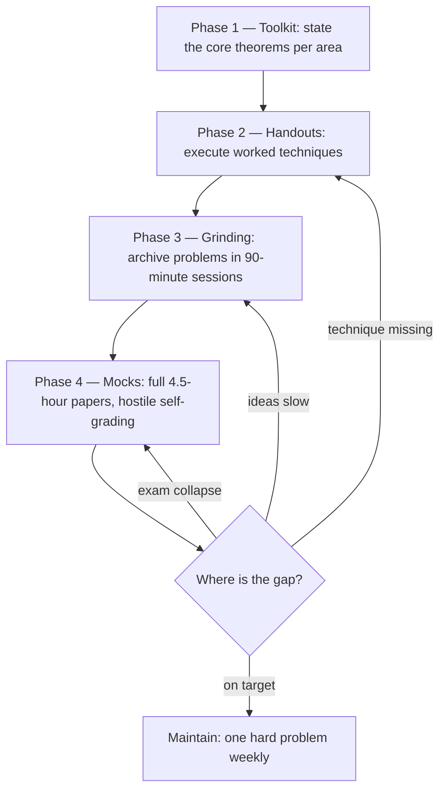

# The IMO — Format, Scoring, and Preparation

## Overview

The International Mathematical Olympiad is the world's premier proof-based mathematics contest for pre-university students: six problems, two days, a 42-point ceiling, and a grading culture that treats an argument as either proven or broken. This page is the operational manual — how the contest is structured, how problems travel from national submissions to the exam hall, how a 7-point solution is actually graded, and how to convert the IMO's sixty-plus years of archives into a personal preparation stack. It is written for two audiences at once: readers who want to understand the institution well enough to train from its material, and readers who want the interview-transferable lessons of how elite mathematical work is scored.

Why dedicate a page to one contest in a placement-prep book? Because the IMO is the origin point of most interview puzzle genres, the source of the cleanest problem bank in existence, and the place where the proof-writing discipline described in the section hub is enforced most visibly. Every serious quant-firm interviewer knows the IMO canon, and several canonical interview questions are IMO problems with the numbers changed. Understanding the machine — not memorizing winners — is what makes the archive usable.

## A Brief Institutional History

The first IMO was held in 1959 in Romania with seven participating countries from the Eastern bloc, and the event grew steadily after 1967 to its modern scale of over a hundred countries and territories. The competition is hosted in a different country each year, which is why the papers are multilingual and why the host nation's Problem Selection Committee runs the shortlist each cycle. The only interruption was 1980, when the host arrangement fell through and several national alternatives ran in its place — a gap the archive preserves honestly. Scoring, format, and the shortlist machinery have been broadly stable since the 1980s, which is what makes decade-old preparation advice still current.

Around the IMO sits a wider ecosystem of elite contests that share the proof-problem format: regional olympiads, girls' olympiads, and team contests each maintain their own archives and difficulty bands, all name-searchable through the AoPS community. For an adult learner these ecosystems matter for one reason: they multiply the supply of balanced, difficulty-graded papers beyond the IMO's own one-per-year output. The India-specific ladder is covered on the India page of this section.

## Contest Format

### The Two-Day Structure

The IMO is a 9-hour examination spread over two consecutive days: three problems per day, four and a half hours per day, no aids beyond writing instruments and (in some years) a provided formula-free comfort kit — no calculators, no references, no communication. Each problem is worth 7 points, so the maximum score is 42. The two days are symmetric by design: day one carries problems 1–3, day two carries problems 4–6, and the pairs (1, 4), (2, 5), (3, 6) are intended to sit at matching difficulty bands. Time pressure is mild by programming-contest standards — 90 minutes per problem on average — but the depth demanded per problem is enormous: full proofs, not answers.

The 4.5-hour block shapes how you should practice. A contestant plans the paper: scan all three problems in the first 15 minutes, pick the most tractable opener, bank it, then allocate the remaining time between the mid problem and a long siege on the hardest one. This is a different skill from solving one problem well — it is portfolio management under uncertainty, deciding when a stuck problem deserves the remaining hour and when a partial result on another problem is worth more. Candidates who practice only single-problem sessions routinely misallocate real exams, which is why the preparation stack below includes full-length mocks.

### What the Paper Looks Like

Problems are self-contained statements in algebra, combinatorics, geometry, or number theory, phrased as "prove that..." or "determine all...". Nothing on the paper requires knowledge beyond the official syllabus — no calculus, no abstract algebra, no projective geometry assumed — which is the deepest fact about the IMO: every problem is solvable with school-level tools pushed to unreasonable depth. A typical geometry problem is three sentences; a typical functional equation is four lines; a typical combinatorics problem fits in a tweet. The brevity is adversarial: with so few words, every clause is load-bearing, and the first skill to train is parsing exactly what is quantified over what.

Problems are translated into the participant's language and printed in papers of dozens of languages; each country's delegation works in its own room under its own leaders (who see the problems only a day early and are sequestered from contestants). Answers are written in the contestant's language and graded through a coordination process described below. The logistics matter to a candidate only as a reminder that the archive is genuinely multilingual and global — solutions written by Korean, Romanian, and Iranian students all appear in the community ecosystem, and the techniques cross borders faster than the syllabus does.

### Syllabus Boundaries

The official syllabus excludes calculus, matrix algebra, abstract group theory, and complex-number geometry — and the exclusion is enforced at problem-selection time, not just in spirit. The boundary is what makes the archive fair across educational systems, but it also makes the archive strangely pure: every difficulty comes from depth within elementary tools rather than from machinery. For an adult learner the boundary is a gift, because it means the entire sixty-year archive is accessible without any university mathematics whatsoever. What changes with maturity is not the toolkit but the speed of parsing, the write-up discipline, and the tolerance for being stuck.

### The Problem Set Rules

The six-problem paper must balance areas and difficulty, and the Jury that selects it operates under explicit constraints: the two days should each open with an accessible problem, no two problems should test the same niche technique, and the full set should be solvable within the syllabus. Each year's paper is therefore a designed difficulty curve, not a random sample. One practical consequence for preparation: working through papers year by year exposes you to a balanced diet by construction, whereas random problem selection drifts toward your existing strengths. The archive at imo-official.org preserves every paper since 1959 in this balanced format — the only gap year is 1980, when the host arrangement collapsed and national alternatives ran instead.

## The Difficulty Curve

### Openers: Problems 1 and 4

Problems 1 and 4 are the paper's openers, intended to be reachable by a large fraction of contestants — historically they are number theory, algebra, or discrete-flavored problems whose key idea is findable within the hour. A well-prepared contestant expects to solve at least one opener fully, and strong contestants bank both within the first two hours of each day. In interview terms, openers are the species: a clean statement, one non-obvious idea, a short proof — exactly the shape of a 15-minute quant screen. Working through sixty years of openers is the single highest-yield archive exercise for interview preparation.

### Mid Paper: Problems 2 and 5

Problems 2 and 5 carry the paper's technical middle — functional equations, harder counting, inequality chains, or combinatorial constructions that need two ideas rather than one. The median contestant scores partial credit here; the medal line is usually decided by who converts a mid problem fully. These problems teach the skill of compounding partial structure: prove a lemma, notice it constrains the object, prove a second lemma, assemble. The habit of building a solution from proved fragments — rather than hunting for one magic idea — is what separates olympiad training from puzzle-book training, and it is the habit that scales to research and to hard production debugging.

### Slayers: Problems 3 and 6

Problems 3 and 6 are the paper's slayers, placed last precisely because they are expected to stop most of the field: median scores near zero are common, and full solutions number in the dozens worldwide rather than the hundreds. They are not trick problems — they are genuinely deep, often requiring a construction over several pages or an invariant discovered through systematic small-case exploration. For a placement candidate the value is calibration, not mastery: attempting slayers teaches what "hard" feels like, resets the internal difficulty scale so that interview problems land in the easy band, and trains the emotional tolerance for a 90-minute siege with no progress. The table summarizes the curve.

| Slot | Intended role | Typical areas | Realistic target (trained candidate) |
|---|---|---|---|
| P1 / P4 | Openers — accessible | Number theory, algebra, discrete | Full solve in 30–60 min |
| P2 / P5 | Middle — technical | Functional equations, combinatorics, inequalities | Full solve in 90 min, partial otherwise |
| P3 / P6 | Slayers — deep | Combinatorial construction, geometry, hard NT | Serious partial credit is a good outcome |

### Three Problems Worth Knowing

Three problems anchor the IMO's popular canon, and knowing them calibrates both difficulty scales and dinner-party conversation. IMO 1988 Problem 6 — if positive integers a, b make (a² + b²)/(ab + 1) an integer, prove the quotient is a perfect square — famously scored near zero across the field and popularized the Vieta-jumping technique, now a standard tool. IMO 2011 Problem 2, the windmill, asks for a rotating line arranged so that every point of a finite planar set is visited infinitely often, and its solution is a pure extremal argument of stunning elegance. IMO 1959 Problem 1 — prove (21n + 4)/(14n + 3) is in lowest terms for every positive integer n — is the all-time classic opener, worked in full on this section's number theory page as a model of one-idea arguments.

Each of the three teaches something the others do not: 1988 P6 teaches that a well-chosen quadratic rearrangement can be an entire solution; the windmill teaches that the extremal object often carries the proof for free; 1959 P1 teaches that a two-line linear combination can settle a statement about infinitely many n. Attempt all three before reading their solutions — each is a rite of passage, and each resurfaces in interview-adjacent form sooner than you expect.

## Scoring and Awards

### The 7-Point Problem

Every problem is scored 0–7, and the distribution is brutally bimodal: a complete solution earns 7, a solution with a real logical hole earns 0–1, and the intermediate scores are reserved for substantial partial progress (a proved key lemma, a solved special case, a correct construction missing its proof). This bimodality is the grading philosophy: mathematics does not award style points for an argument that almost works. For interview transfer, internalize the lesson directly — an answer with an unproved assertion is not 80% of an answer, it is an answer with a hole, and interviewers probe holes the way coordinators do.

### Cutoffs and Medals

Medal cutoffs are not fixed scores; they are set after grading so that the medal distribution stays approximately constant regardless of year-to-year difficulty. Gold, silver, and bronze are awarded to approximately the top 1/12, the next 2/12, and the next 3/12 of contestants respectively — the ratios are approximate, adjusted slightly by the Jury's rules around ties and the half-cutoff convention. Contestants below the bronze line who score a perfect 7 on any single problem receive an honorable mention, which keeps the opener-solvers visible. The practical reading of the table for a placement audience: the medal system measures relative standing in an elite pool, so absolute scores swing wildly by year — 2012-style papers and soft papers can differ by 10+ points at the same medal line.

| Award | Approximate share of contestants | Typical score range (varies by year) |
|---|---|---|
| Gold | ~1/12 (top ~8%) | High 20s to 42 |
| Silver | next ~2/12 | Around 20 to high 20s |
| Bronze | next ~3/12 | Low-to-mid teens to 20 |
| Honourable mention | no medal, but a 7 on some problem | any total |

A worked cutoff sketch makes the arithmetic concrete. With 600 contestants, the approximate scheme awards gold to the top 50, silver to the next 100, bronze to the next 150 — so roughly the top 300 of 600 medal, with the bronze line falling near the 50th percentile of an already pre-selected international field. Actual adjustments (tie-breaking conventions, the half-point rule, Jury discretion at boundaries) move lines by a few contestants either way, which is why every statement of cutoffs should carry the word "approximately". The permanent takeaway is the shape: relative bands, not absolute scores, define the awards.

### Strategy Implications of Relative Scoring

Because medals are relative, optimal exam strategy depends on the field, not just the paper: in a hard year, banking two openers plus partial credit on everything else can medal; in a soft year, the same performance misses. The transferable principle is that scoring systems shape strategy — the same instinct that tells a contestant "the median contestant fails P6, so time there is speculative" tells an interviewee "the warm-up questions are the cheapest points on the board". Candidates who understand relative scoring stop hunting hero points in the wrong places. It is the same arithmetic whether the currency is exam minutes or interview minutes.

## The Shortlist System and Archives

### From Submissions to Shortlist

Each member country may submit up to a handful of problem proposals each year; the host nation's Problem Selection Committee reviews typically over a hundred proposals, narrows them to a shortlist of roughly thirty, and organizes them by area with difficulty-ordered numbering within each area. The Jury — one leader per participating country — then spends the pre-contest week debating, amending, translating, and finally voting the six-problem paper into existence. The shortlist problems that miss the final cut are the hidden treasure of the system: they were judged excellent but lost a ballot, and many became classics in later national olympiads. National selection exams worldwide recycle shortlist material so heavily that grinding shortlists is functionally training on the future papers of a dozen countries.

### Reading the Official Archive

The official archive at imo-official.org/problems.aspx lists every problem since 1959, organized by year, with each problem on its own page carrying the statement and per-problem statistics — how many contestants attempted it, the average score, and the full score distribution. Those statistics are criminally underused: a problem with a 0.4 average and 12 full solutions tells you a slayer; a 3.5 average tells you an opener that year, and calibrating your practice against actual score distributions is the most honest difficulty signal available anywhere. The per-year pages also preserve results by country and name, which makes the archive the canonical historical record. Use it as the index of record, then jump to community solutions for the discussion layer.

Shortlist problems carry area-prefixed numbers in their published form — a combinatorics problem might be C1 through C9, geometry G-numbered, number theory N-numbered, algebra A-numbered — with the number indicating rough difficulty within the area. The labeling makes self-training straightforward: work C1–C3 and N1–N3 as your opener band, C4–C6 and the equivalent as your mid band, and reserve the 7–9 range for deliberate slayer calibration. Because the numbering is per-area, a candidate can assemble a perfectly balanced paper for mock purposes by taking the same number across four areas. This is the closest thing the olympiad world has to a standardized difficulty ladder, and the AoPS wiki preserves the labels for decades of shortlists.

### The AoPS Ecosystem

Art of Problem Solving hosts the community layer: a wiki with crowdsourced solutions for essentially every IMO problem, and forums where each year's problems are dissected within hours of the contest with dozens of alternative solutions per problem. The wiki's solution quality varies — read multiple solutions for hard problems, since the first posted is rarely the cleanest — but the coverage is unmatched and the difficulty ratings attached to shortlist problems make it the de facto training database. The forums also host the "solutions culture" that matters for preparation: contestants post partial attempts and receive targeted hints, modeling exactly the stuck-then-escape loop this section's practice methodology prescribes. For an adult learner without a coach, the AoPS community is the closest substitute.

## How a 7-Point Solution Is Graded

### The Coordination Process

Grading runs through coordination: your country's leaders propose a score for your script, host-appointed coordinators (who did not write the problems) independently assess it, and the two sides negotiate until the score matches the official marking scheme. The marking scheme itself is written by the problem authors and specifies what configurations, lemmas, and cases earn which marks, so the negotiation is about whether your write-up proves what it claims — not about whether the grader likes your style. Scripts are graded as written: there is no oral defense, no clarifying question, and a phrase like "clearly" that hides a genuine difficulty is treated as unproved. Every contestant learns quickly that the burden of proof is total.

### What Partial Credit Really Means

The marking scheme's partial-credit structure rewards verified progress, not effort: a proved lemma that the official solution needs might earn 2 points even if the final assembly never happens, while a page of unstructured computation earns nothing. But the reverse bites harder — a single unjustified step that would be load-bearing caps the script at 0–1 regardless of how much else is correct, because a hole at a load-bearing step means the argument proves nothing. Contestants therefore learn to triage their own write-ups: which of my claims would a hostile coordinator attack first, and can I discharge it in three lines? That self-hostility is the exact skill interviewers describe when they say a candidate "defends the solution well".

A simplified marking-scheme sketch shows how points attach to content rather than prose. For a hypothetical three-case combinatorics problem, the scheme might read: 2 points for proving the configuration lemma the whole argument rests on, 2 points for the even case, 2 points for the odd case, 1 point for assembling the cases without gaps — and 0 overall if the configuration lemma is asserted rather than proved, regardless of what follows. Notice two properties. First, the lemma is worth more than any single case, because it is load-bearing for everything downstream. Second, assembly itself earns credit, rewarding the write-up discipline of closing gaps rather than the heroics of raw ideas.

### The Write-Only Discipline

Because grading is write-only, olympiad training builds a specific discipline: the written solution must carry the entire argument, with every case enumerated and every lemma proved, readable by someone who cannot ask you anything. This is the same discipline as writing a design doc, a proof of correctness, or a pull-request description that a skeptical senior engineer will review asynchronously. Practicing it has a compounding benefit: contestants discover that writing the solution often exposes the gap that mental solving hid, which is why the section hub insists on full written solutions even for problems solved in your head. The discipline converts directly to whiteboard interviews — narrate as if you are being graded write-only, and the interviewer's follow-up questions become free credit instead of attacks.

## Two Archetype Problems, Worked

### Archetype 1 — An Invariant Opener

A classic opener-shaped problem: the integers from 1 to 2025 are written on a board. At each step, erase two unequal numbers and write their difference. Prove the process can never end with the board holding a single 0. The naive move is to simulate; the olympiad move is to find what cannot change. Work modulo 2: replacing two unequal numbers with their difference changes the sum of all numbers by the erased pair minus their difference — and if the erased pair has the same parity, the parity of the total sum is unchanged, while if they differ in parity, the erased pair sums odd and the difference is odd, so again the total sum parity is unchanged. Wait — carefully: erasing a and b and writing |a − b| changes the sum from S to S − a − b + |a − b|, and a + b − |a − b| = 2·min(a, b) is always even, so the parity of S never changes.

Now compare endpoints. The initial sum is 1 + 2 + ... + 2025 = 2025·2026/2, which is odd since 2025 is odd and 2026/2 = 1013 is odd. A final board holding a single 0 has sum 0, which is even. The invariant forbids it: the process can never end at a single 0. The full argument is three sentences — invariant found, verified, compared against the target state — and it is the same skeleton as the chameleon problem on the hub page. In an interview this appears as "can the robot ever return to start" or "can the pile ever empty"; the trained response is identical: compute the sum/parity/counts mod k at both ends.

### Archetype 2 — An Information-Bound Weighing

The canonical coin-weighing bound: among `3^k − 1` coins there may be exactly one fake (heavier or lighter, unknown which); show `k` weighings on a balance scale cannot always suffice to both find it and say which. Each weighing has three outcomes (left heavy, right heavy, balanced), so `k` weighings produce at most `3^k` distinguishable outcome strings — an information budget. Each of the `3^k − 1` coins carries two possible hypotheses (heavy fake or light fake), giving `2(3^k − 1)` hypotheses to separate, and the all-genuine hypothesis makes `2(3^k − 1) + 1 = 2·3^k − 1 > 3^k` for every k ≥ 2... the classical resolution is that symmetric placements absorb the doubling: hypotheses come in indistinguishable mirror pairs when the coin sits on the scale, so the effective count is `3^k − 1` coins' worth of paired hypotheses plus the genuine case — exactly `3^k` buckets against `3^k` outcomes, and a third-round tightening shows one outcome string must be reserved. The version worth internalizing is the method: count the outcome budget, count the hypotheses, and prove the budget too small — the same accounting proves you cannot find a fake among 13 with 3 weighings.

The upper-bound half (a scheme that achieves the bound) is the constructive twin: split coins into three nearly equal piles, weigh two against each other, and recurse — each outcome prunes the hypothesis set to a third. Achievability plus impossibility closes the problem the way interviewers expect optimality closed: "not only 4 weighings work, 3 provably cannot". The 25-horses, two-egg, and 100-prisoners puzzles in the interview section all close the same way, and the habit originates in this style of olympiad problem.

### Reading a Solution Like a Grader

Take the three-sentence invariant argument above and imagine two write-ups. Write-up A reads: "The sum changes by an even number each step, and the initial sum is odd while 0 is even, so we can never reach a single 0" — it names the quantity, proves the invariance with the 2·min(a,b) observation, and compares endpoints. Write-up B reads: "Clearly the parity is preserved, so it is impossible" — same length, but the load-bearing claim (why a − b − (a + b) contributes only even changes) is hidden behind "clearly", and under coordination grading it earns a 0–1 because the one real idea is asserted, not proved. The distance between A and B is one sentence, and that sentence is the entire solution.

The grader's eye is trainable, and training it is the fastest way to improve your own write-ups. After solving any problem, reread your solution asking exactly two questions: which step is load-bearing, and is it proved or asserted? Every "clearly", "obviously", and "it is easy to see" marks the spot where a hostile grader — or an interviewer's "are you sure?" — will dig. Rewrite until the load-bearing steps are three lines of honest algebra; the resulting style is what this page means by write-only discipline.

## The Preparation Stack

The preparation stack runs in four phases, and the flowchart shows the review loop that connects them. The phases overlap in calendar time — you grind shortlists while still reading handouts — but each phase has a distinct output: a toolkit you can state, handout techniques you can execute, archive problems you can solve, and mock scores you can trend.

### Phase 1 — The Toolkit

Every area has a short list of theorems and structures that recur constantly: for number theory, the material on this section's NT page (orders, CRT, valuations, LTE, quadratic residues); for combinatorics, the invariant and counting catalog on the combinatorics page; for geometry, the standard configuration lexicon; for algebra, the functional-equation and inequality workhorses. Phase 1 is memorization with understanding: you should be able to state each tool precisely, give its one-line proof idea, and name a problem where it is the key. The output is a one-page sheet per area that you can rebuild from memory — if you cannot rebuild it, you do not own it yet.

### Phase 2 — Handouts and Programs

Evan Chen's site (web.evanchen.us) hosts the best free handout collection in the ecosystem, plus OTIS (Olympiad Training for Individual Students), a structured mentoring program with problem sets and graded feedback — the closest thing the olympiad world has to a MOOC with a grader. Yufei Zhao's notes (yufeizhao.com) provide compact, university-quality treatments of all four areas; his olympiad handouts pair naturally with the bookshelf in the hub page. The book anchors remain Engel's *Problem-Solving Strategies* for technique breadth and Zeitz's *The Art and Craft of Problem Solving* for method; for geometry specifically, Chen's *Euclidean Geometry in Mathematical Olympiads* is the modern standard. Work handouts with a pencil: every exercise attempted before its solution is read, per the 4:1 problems-to-reading ratio from the hub.

### A 26-Week Sketch

For a university candidate targeting the interview-relevant band, here is a realistic semester-and-a-half plan at 5–6 hours weekly, phrased against the phases above. It assumes the session format and logging from the hub page and swaps areas between blocks to keep the diet balanced.

| Weeks | Load | Focus | Exit criterion |
|---|---|---|---|
| 1–4 | 6 h/wk | Toolkit sheets + opener band (P1/P4, 1995–2025) | Rebuild all four one-page sheets from memory |
| 5–12 | 6 h/wk | Handout chapters + mid band (P2/P5), one mock per fortnight | First full mid-problem solves on the clock |
| 13–20 | 6 h/wk | Grinding at the edge + weekly mock; post-mortems written | Mock trend stable above your target band |
| 21–26 | 4 h/wk | Interview crossover: puzzles section, spoken mocks, maintenance | Spoken mock feels routine, narration clean |

### Phase 3 — Shortlist Grinding and Phase 4 — Mocks

Grinding means archive problems at your edge, in 90-minute single-problem sessions, with the session log from the hub page. Calibrate by slot: openers to build fluency, mid problems to build technique assembly, slayers in strict moderation to build tolerance. Sharpen the calibration with the archive's own score statistics: a problem whose average hovers around 5 across decades is an opener regardless of which slot it occupied in a weird year, and historical anomalies (a P2 harder than its day's P3) are exactly the cases the statistics expose. Difficulty by slot is a strong prior; difficulty by measured score is the correction. Mocks then assemble the skills under exam conditions — full 4.5-hour blocks, hostile self-grading against the marking scheme, and the post-mortem habit of asking which phase failed (technique, speed, or nerves). The loop in the flowchart is the whole preparation system: mocks diagnose, and the diagnosis routes you back to exactly one phase. Candidates who skip phase 4 discover the gap only in the actual exam; candidates who skip phase 3 discover it when their handout knowledge fails to transfer to unseen problems.

### Adapting the Stack for Interview-Only Goals

If your endpoint is interviews rather than medals, compress the stack aggressively. Phase 1 shrinks to two areas (combinatorics and number theory) using this section's technique pages as the toolkit sheets. Phase 2 shrinks to the two or three handouts those pages recommend, and phase 3 runs on the opener band plus national olympiad easy rounds rather than shortlists. Phase 4 swaps full 4.5-hour papers for spoken mocks — three problems, twenty minutes each, recorded — because the exam you are training for is oral, timed, and observational. The four-phase loop and the diagnostic review survive intact; only the material inside each phase changes.

A useful final calibration for the interview-only path: when you can solve seven of ten unseen opener-band problems in fifteen minutes each while narrating cleanly, you are past the interview bar, and further olympiad investment has better substitutes (system design, coding depth, domain prep). The archive remains a maintenance source — one opener per week keeps the edge indefinitely at negligible cost. Treat it as a gym membership rather than a training camp.

## IMO Crossover into Interviews

The IMO canon is the mother lode of interview puzzles, and the crossover is traceable almost problem by problem. Coin-weighing puzzles (find the fake among N in k weighings) are information-bound arguments identical in structure to classic IMO-adjacent shortlist problems; the 15-puzzle solvability question is the parity-invariant argument worked fully on this section's combinatorics page; the chameleons problem worked on the hub page is a mod-3 invariant in contest clothing. Game puzzles (setup: two players alternate moves; question: who wins) are strategy-stealing and pairing arguments straight from the combinatorics canon. When an interviewer poses one of these, they are running a diluted IMO problem, and the prep for both is the same prep.

Two crossovers deserve explicit practice. First, invariants: interviewers love "can this process ever reach state X" questions because the answer is a two-line mod argument once seen and invisible before — the puzzles section of the interview track works several. Second, extremal/pigeonhole arguments: "prove some two objects must share a property" questions are pigeonhole with a story, and the combinatorics page's party-handshake and unit-square examples are the canonical drills. A candidate who owns these two technique families plus the narration habit converts IMO training into interview points without ever solving a slayer.

The boundary of the crossover is also worth knowing. IMO geometry and heavy algebra do not resurface in interviews — no interviewer asks for a spiral similarity or a functional equation on a whiteboard. The interview-relevant subset is invariant arguments, counting and bijection arguments, elementary number theory, and estimation, which is exactly why the section's technique pages prioritize combinatorics and number theory. Depth in the interview-relevant subset beats breadth across the canon for placement purposes, however enjoyable the rest of the canon is.

## The Self-Grading Checklist

Before declaring any written solution finished, run the checklist that coordination grading effectively runs on every script. It takes five minutes and routinely saves a full score.

- Every quantifier pinned down: for all n, or there exists an n — read the statement again against your write-up.
- The load-bearing lemma proved, not named; every "clearly" either discharged or deleted.
- All cases enumerated, including the degenerate ones (zero, one, empty, equal, odd).
- Extremes checked: does the argument survive n = 1, the empty set, the collinear triple?
- Invertibility: if your claim is an iff, is the converse actually written down and proved?
- No forward references: the proof never uses a fact established later in the same script.
- Boundary of the construction: any object you "choose" is shown to exist (minimal counterexample, maximal path, extreme point).
- Conclusion matches the statement: you proved what was asked, not a cousin of it.

The checklist is deliberately mechanical because self-grading under time pressure is emotional, and emotion argues for leniency. Contestants who adopt it report the same effect engineers report from code review checklists: the failure class you enumerate is the failure class you stop shipping. In interviews the same list runs silently while you narrate — the "are there edge cases" prompt from the interviewer is checklist item four arriving from outside.

## Common Failure Modes

### The Solution-Reading Spiral

The most common adult failure mode is the solution-reading spiral: a problem resists for 20 minutes, the solution gets read, the technique feels learned, and the next problem starts the cycle again. Six months later the reader has consumed a thousand solutions and cannot solve openers unaided, because reading encodes recognition while solving encodes production — and interviews test production. The fix is structural, not motivational: enforce the 4:1 attempt-to-reading ratio, delay solution-reading past the 45-minute mark, and when a solution is read, re-solve the problem cold three days later. The re-solve is the only honest test that the technique transferred, and skipping it is how the spiral hides.

### The Slayer Trap

The second failure mode is the slayer trap, the mirror image: an ambitious candidate spends all sessions on P3/P6-class problems, fails everything, and concludes they lack talent. Besides wrecking motivation, the allocation is wrong on the merits — the interview-relevant and confidence-building material lives in the opener and mid bands, and slayer-solving is a specialist skill even among olympians. Cap slayer exposure at one problem per week, treat it as calibration rather than training, and track your opener solve rate as the metric that actually predicts interview performance. Difficulty should live at the edge of your ability, not beyond the cliff.

### Prep Without Mocks

The third failure mode is endless preparation without exam-shaped rehearsal: hundreds of sessions, zero timed papers, and then a collapse in the actual contest or spoken mock. Mocks fail differently from sessions — they expose allocation errors, panic loops, and write-up slowness that no single-problem session can surface — which is why the preparation stack routes every mock diagnosis back to exactly one phase. One mock per fortnight is the minimum dose during the grinding phase. If scheduling full 4.5-hour blocks is impossible, three 60-minute single-problem timed blocks with strict write-up deadlines preserve most of the signal.

## What the IMO Does Not Teach

Honesty requires marking the boundary of the transfer. The IMO trains individual closed-form problem solving; it does not teach teamwork, code, ambiguous specifications, incremental delivery, or the economics of an 80% solution — and engineering interviews probe those alongside raw reasoning. A former olympian who treats every interview like an exam can underperform a pragmatic generalist who narrates trade-offs and ships a partial solution with tests. The placement-ready profile combines the olympiad proof discipline with the engineering habits in the rest of this book: verify like a grader, deliver like a developer.

The boundary also cuts the other way: interviewers who over-index on olympiad-style screens select for exam-takers rather than builders, and some companies deliberately cap puzzle content for that reason. As a candidate you cannot control the loop's composition, but you can control the range — carry the proof discipline into the coding rounds (the dsa chapters) and the estimation habit into the case rounds (the aptitude track), so that no round type finds you playing the wrong sport. The cross-references below are arranged to make that range-building mechanical.

## Interview Questions

1. **Why does the IMO grade 0/7-style instead of giving partial credit like a school exam?** Because a proof is binary at its core: an argument with a load-bearing hole proves nothing, and school-style partial credit would reward confident wrongness. The bimodal scheme forces contestants to verify their own logic before submitting, which is exactly the skill of catching your own bugs. Intermediate scores exist only for verified partial progress — a proved lemma or a solved case — never for effort or page count. Interviewers grade the same way informally: a solution with an unexamined edge case scores as incomplete no matter how fluent the narration around it.
2. **What does "gold is roughly the top 1/12" actually mean in practice?** Medal cutoffs are relative, not absolute: after grading, the cut-offs are set so gold goes to approximately the top one-twelfth of contestants, silver to approximately the next two-twelfths, bronze to the next three-twelfths, with small rule-based adjustments. The consequence is that a 29 might be gold in a brutal year and silver in a soft one, so the medal measures standing in that year's pool rather than mastery of a fixed bar. For preparation purposes, treat historical score distributions — published per problem in the official archive — as the real difficulty signal. The relative scheme also explains why exam strategy depends on the field's observed difficulty, not just the paper.
3. **I finished school years ago. How should I use the IMO archive as an adult?** Start with openers (problems 1 and 4) across the last twenty years — they are self-contained, interview-relevant, and solvable in a 90-minute session without years of background. Use the official archive for statements and score statistics, and the AoPS wiki for multiple solutions per problem, reading solutions only after a genuine attempt. After two months of openers, add mid problems (2 and 5) selectively in your strongest two areas. Skip slayers except as calibration exercises; the interview-relevant skills live almost entirely in the opener and mid bands.
4. **Why are problems 1/4 treated so differently from 3/6 in preparation?** They are different in kind, not just degree: openers reward a single clean idea executed cleanly, so they train parsing, tactic recognition, and write-up discipline. Slayers reward sustained exploration — systematic small cases, disciplined conjecture, and construction over pages — and the median contestant scores near zero on them no matter how well prepared. Training time should follow your target: interview candidates live in the opener band and visit the mid band, while actual contestants must siege slayers weekly. Misallocating this — grinding slayers for interview prep — is the most common waste of adult training time.
5. **What is the shortlist system and why should a candidate care?** Each country submits problem proposals, the host's Problem Selection Committee distills roughly thirty into the shortlist organized by area and difficulty, and the international Jury votes six onto the paper. The shortlist matters because it is roughly five times larger than the exams, difficulty-graded, and area-balanced — a self-assembling curriculum — and because national olympiads worldwide recycle shortlist problems so heavily that the shortlist is a leading indicator of future exam papers. Archives of past shortlists circulate through the AoPS ecosystem with community difficulty ratings. For an adult learner, a shortlist band is the cleanest source of same-difficulty problems for spaced repetition.
6. **Which IMO-era skills transfer most directly to quant and tech interviews?** Three, in order: writing a complete argument under observation (the write-only discipline, which maps to whiteboard narration), invariants and extremal arguments (the engine of most puzzle rounds), and calibrated time allocation (the exam-portfolio skill of banking cheap points before sieges). Geometry and heavy algebra do not transfer and should be deprioritized for placement purposes. The puzzles section of the interview track is the bridge text — its problems are IMO techniques reskinned, and its five-stage framework is the exam-portfolio skill under a different name. A candidate who drills those two pages has captured most of the IMO's interview value.

## Key Takeaways

- The IMO is six proof problems over two 4.5-hour days, 7 points each, 42 maximum — and the grading treats an argument with a load-bearing hole as worth nothing.
- Difficulty is designed as a curve: P1/P4 openers, P2/P5 technical middle, P3/P6 slayers; the interview-relevant band is openers plus mid problems.
- Awards are relative: gold ≈ top 1/12, silver ≈ next 2/12, bronze ≈ next 3/12, with honorable mentions for any perfect 7 below the medal line.
- The shortlist system (submissions → ~30 problems → jury votes six) produces the best difficulty-graded problem bank in existence; AoPS hosts the community layer.
- The official archive at imo-official.org preserves every paper since 1959 with per-problem score statistics — the most honest difficulty calibration available.
- Grading is write-only and coordinated; the discipline it builds — complete, self-verified written arguments — transfers directly to whiteboard interviews.
- The preparation stack is four phases (toolkit → handouts → grinding → mocks) connected by a diagnostic loop; skipping mocks or grinding are the classic failure modes.
- IMO canon is the origin of most interview puzzles: invariants, information bounds, and extremal arguments resurface with the numbers changed.

## References

- [IMO official site](https://www.imo-official.org) — results, regulations, historical record, and participant statistics since 1959.
- [IMO problems archive](https://www.imo-official.org/problems.aspx) — every problem since 1959 with per-problem statistics and solutions links.
- [Art of Problem Solving](https://artofproblemsolving.com) — forums, resources, and the contest community.
- [AoPS Wiki](https://artofproblemsolving.com/wiki) — crowdsourced solutions and shortlist difficulty ratings.
- [AoPS Community](https://artofproblemsolving.com/community) — live discussion threads for current contests.
- [Evan Chen's site](https://web.evanchen.us) — free handouts, the Napkin, OTIS program details, and olympiad essays.
- [Yufei Zhao's site](https://yufeizhao.com) — olympiad handouts and notes across all four areas.
- *Problem-Solving Strategies* (Arthur Engel) — technique-first treatment of the whole olympiad canon.
- *The Art and Craft of Problem Solving* (Paul Zeitz) — method and psychology of problem solving.
- *Euclidean Geometry in Mathematical Olympiads* (Evan Chen) — the modern geometry standard.

## Cross-References

- [Competitive Mathematics Hub](./README.md) — section overview, practice methodology, and the olympiad-vs-engineering framing.
- [Olympiad Number Theory](./number-theory-olympiad.md) — the proof-first NT toolkit referenced in Phase 1, with a worked IMO 1959 problem.
- [Olympiad Combinatorics](./combinatorics-olympiad.md) — the invariant and counting catalog behind most interview crossover puzzles.
- [Olympiad Algebra](./algebra-olympiad.md) — the functional-equation and inequality track for the mid-paper band.
- [Olympiad Geometry](./geometry-olympiad.md) — the configuration-driven area with the least interview overlap.
- [India Math Olympiads](./india-math-olympiads.md) — the national pipeline whose stages feed into IMO-style preparation.
- [Resources Directory](./resources-directory.md) — the consolidated link list for everything named on this page.
- [Puzzles & Brain Teasers](../interview/puzzles/README.md) — where the IMO canon resurfaces as actual interview questions.
- [Mathematics Section](../mathematics/README.md) — the engineering-math counterpart for algorithmic fluency.
