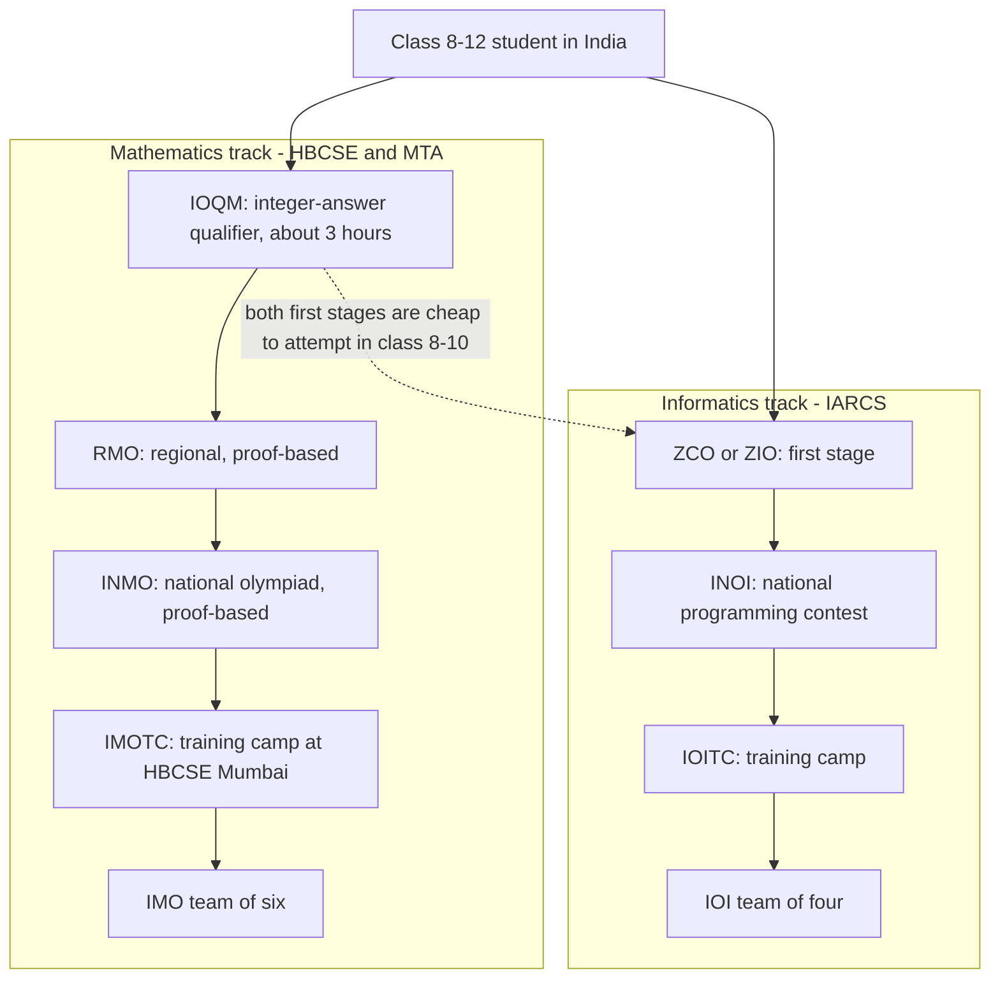

# India Math Olympiads — The IOQM → INMO Pipeline

## Overview

India runs one of the largest olympiad mathematics programmes in the world: a national pyramid whose base is an integer-answer qualifier attempted by students in the six figures and whose apex is a team of six at the International Mathematical Olympiad. The enrichment track — IOQM, RMO, INMO, IMOTC — is proof-based from its second stage onward and is administered under the Homi Bhabha Centre for Science Education (HBCSE, TIFR) in Mumbai, with the Mathematics Teachers' Association (MTA) conducting the first stage in recent cycles. This page maps the pipeline stage by stage, separates it from the mass-market school contests that borrow the word "olympiad", and prices each credential honestly for admissions officers, recruiters, and interviewers.

Two cautions frame everything below. First, the pipeline has been restructured several times since 2021 — the first stage was renamed and reformatted, some COVID-era cycles collapsed or skipped stages, and administrative responsibility shifted between bodies — so treat the canonical ladder here as the steady state and verify the current year's circular on the [HBCSE olympiad pages](https://olympiads.hbcse.tifr.res.in) before planning around it. Second, mathematics is not the only olympiad lane an Indian school student can run: the informatics track (ZCO/ZIO → INOI → IOITC) runs in parallel under IARCS, shares most of its training base with this one, and is covered in full by the [IOI guide](../competitive-programming/ioi-guide.md). Both lanes are school-bound, which is why university students in this book pivot to ICPC and open contests for the same training effect.

## The Enrichment Track: IOQM to the Team of Six

### The Stage Table

The table below is the canonical pipeline as it has run in most recent cycles. Ballpark participation and selectivity figures are order-of-magnitude estimates that move year to year; the HBCSE and MTA circulars are the only authoritative sources for the current cycle. The structural constants — proof-based stages after the qualifier, HBCSE coordination, and a team of six — have survived every restructure so far.

| Stage | Full name | Format | Duration | Graded how | Ballpark pool | Advance rule |
|---|---|---|---|---|---|---|
| IOQM | Indian Olympiad Qualifier in Mathematics | ~30 integer-answer questions | ~3 hours | Machine-graded; each answer an integer | Order of a lakh | Merit cutoff by class/region |
| RMO | Regional Mathematical Olympiad | ~6 proof problems | ~3 hours | Human-graded full solutions | A few thousand | Composite with IOQM score |
| INMO | Indian National Mathematical Olympiad | 6 proof problems | ~4 hours | Human-graded full solutions | Roughly a thousand | Top band declared awardees |
| IMOTC | International Mathematical Olympiad Training Camp | Lectures + selection tests, HBCSE Mumbai | ~4 weeks | Camp tests + INMO performance | A few dozen | Top 6 plus reserves |
| IMO team | Pre-departure camp, then the IMO | 2 days × 4.5 h, 3 proofs per day | 9 hours | 0–7 per problem | 6 students | — |

### What Each Stage Actually Tests

The stages probe different depth bands of the same four areas — algebra, combinatorics, geometry, and number theory. IOQM questions are single-trick computations: algebraic manipulation, elementary counting, basic modular arithmetic, and exact-integer tasks where the constraint is accuracy rather than depth. RMO introduces genuine proofs and concentrates on number theory and combinatorics, the two areas that grade most reliably at that band. INMO spans all four areas at full olympiad depth, geometry included, and IMOTC adds university-adjacent maturity on top.

The practical consequence for a placement-focused reader is a filter. The two areas that dominate interview screens — combinatorics and number theory — are also the two the Indian pipeline grades earliest and most heavily, which means RMO-band preparation is already interview-relevant preparation. Geometry, the largest investment on the international stage, is the least relevant to interviews; the section's [geometry page](./geometry-olympiad.md) says so explicitly and positions it as optional depth. Students with limited hours should invert the pipeline's emphasis accordingly.

### IOQM — The Integer-Answer Qualifier

IOQM exists to make national-scale screening cheap, fast, and unambiguous. Every answer is an integer written into a fixed two-digit range — \\( 0 \\) through \\( 99 \\) — so a paper taken by an order of \\( 10^{5} \\) students can be machine-graded without any human argument-reading at all. The consequence is a distinctive problem genre: no partial credit, no proof demanded, and a premium on finding the single clean trick that collapses each question in minutes. It is the only objective-test stage in the ladder, and it is deliberately the widest and shallowest.

For preparation purposes, IOQM is a filter for accuracy and speed rather than depth. Candidates who drill the RMO band of past papers typically find the qualifier's integer-answer format a mechanical adjustment, while candidates trained only on multiple-choice school contests must relearn exact computation with no options to sanity-check against. The stage's real design purpose is to concentrate proof-capable students into a pool small enough for the human-graded stages to process. Treat it as the entry toll, not the contest itself.

### RMO and INMO — The Proof Stages

From RMO onward the programme is unambiguous olympiad mathematics: a small number of problems — usually six — in a multi-hour sitting, graded as written arguments. A solution that reaches the right answer by unjustified means scores little; a solution that builds the correct structure and asserts no load-bearing step scores fully even with an arithmetic slip. Regional centers run RMO under HBCSE's olympiad cell, and INMO qualification has historically been decided by a composite of RMO performance and the earlier IOQM score. The pacing changes fundamentally from the qualifier: where IOQM allots minutes per question, RMO and INMO allot roughly half an hour or more per problem, and that budget is spent on being stuck rather than on calculating.

INMO is the national olympiad and the credentialing bottleneck. Its paper is calibrated to sit between the IMO's easier problems and its hardest, and its graders apply the same prove-it-or-lose-it standard as international coordination. Roughly a thousand students qualify in a typical cycle, and the top band — usually a few dozen — is declared INMO awardees, the designation that carries the programme's concrete benefits: IMOTC invitations, historically some scholarship eligibility through the mathematics-funding bodies (verify current schemes with NBHM-affiliated announcements), and the admission courtesies that institutes such as CMI and ISI extend to olympiad awardees. The qualifier band below the awardees receives certificates that matter on school applications but stop short of the awardee's weight.

Marking mechanics reward writers who structure solutions for the grader. INMO-band papers are read by teams working through thousands of scripts, so a solution that states its plan in the first lines, labels its lemmas, and isolates its computations is graded faster and more favorably than the same mathematics delivered unparsed. This is the write-up discipline the [section hub](./README.md) drills, and late in preparation it is worth more points per hour than any additional technique. A candidate who can solve a problem but not communicate the proof has not finished the problem.

### IMOTC and the Team of Six

IMOTC — the International Mathematical Olympiad Training Camp — hosts the awardee pool at HBCSE in Mumbai for roughly a month, historically in the April–May window. Mornings run graduate-style lectures on olympiad technique; selection runs through camp tests; and the final team of six is named from combined camp and INMO performance, with a reserve band in some years. The camp deliberately teaches university-adjacent material — the transition Evan Chen's *Napkin* addresses — because an IMO team needs elasticity beyond the school toolkit. A shorter pre-departure camp closes the pipeline before the team travels to the IMO, where India has fielded teams since 1989.

For most readers of this book the camp is context, not a plan. The usable fact is that the funnel compresses a six-figure base into six people — a base rate of \\( 6/10^{5} \\), about one competitor in seventeen thousand — which is why the credential's tail on a resume is so heavy. The training the camp embodies is nonetheless available in miniature to everyone: lecture notes, staged problem sets, and full-write-up discipline are exactly the habits the section hub recommends for interview preparation. A student running the INMO band honestly is running a miniature IMOTC every week.

The camp's internal structure has varied — some years have run junior batches for younger awardees alongside the senior selection batch, and reserve members have been named in some cycles — but the output has been constant: six names, plus however much training the calendar allows. For younger students the junior-batch pattern is worth knowing, because it means an early INMO award converts into camp exposure rather than a wasted year. Verify the current structure in the same circular that lists the stages.

### Registration, Eligibility, and Logistics

Registration for the enrichment track is individual, not school-mediated: the current cycle's circular designates a portal and a window, and candidates register directly for a nominal fee. This is a structural difference from the SOF layer, which is purchased through school packages, and it means the failure mode is also different — students lose enrichment stages by missing registration windows, not by affording them. The circular is the only authoritative source for the window, and school calendars rarely carry it.

Eligibility has historically spanned class bands — roughly classes 8 through 12 for the qualifier in recent cycles, with per-class merit cutoffs — but the exact bands and cutoffs have moved between cycles along with the restructures. Class and age ceilings matter most at the top of the ladder, because team selection requires remaining a pre-university student. Verify the current band table rather than relying on an older cohort's experience.

Language access is broader than most students expect: papers have historically been offered in English and Hindi, and regional stages have supported additional Indian languages, so the track is not gated by English-medium schooling. Centers for the regional stages are distributed across the country, though a student's region determines their RMO coordination and quota arithmetic. Geography is therefore mostly an information filter here too — the students who lose out are usually the ones who learned of the window after it closed.

### The Funnel in Numbers

Order-of-magnitude arithmetic makes the funnel's shape concrete. A typical recent cycle compresses something like

\\[ 10^{5} \to 3 \times 10^{3} \to 10^{3} \to 40 \to 6 \\]

from IOQM entrants through RMO, then INMO, then the awardee band, then the team. If roughly \\( 10^{5} \\) students attempt IOQM and a few thousand reach RMO, the qualifier passes on the order of \\( 3\\% \\) of its pool; INMO's roughly thousand qualifiers are then a top-\\( 1\\% \\) band of the original entrants, and the awardee band of a few dozen sits near the \\( 10^{-4} \\) level. Every one of these figures moves year to year, and the ratios — not the raw counts — are the stable part of the description. For resume purposes the ratios are what an informed reader reconstructs, which is why inflating a stage name on a CV is counterproductive: the audience that matters can do this arithmetic.

The compression explains a recurring interview-room observation: olympiad credentials are read as evidence of selection-survival, not of coursework. A grader at a trading firm does not know whether a given INMO paper was easy or hard, but they know the size of the pool it sat on top of. This is the same reading the IOI guide documents for IOITC lines, and it generalizes — credentials from any adversarial, low-acceptance selection carry their signal in the attrition they survived.

### Where the Papers Come From

INMO papers are built by a national problem committee that solicits proposals from teachers, former contestants, and the wider mathematics community, then refines a subset into the six-problem paper. The same machinery runs one level up: national committees, India's included, may submit problems to the IMO's shortlist each year, and a proposal that survives international selection can end up on an IMO paper. Contest mathematics is therefore a pipeline in both directions — problems flow up the pyramid while difficulty bands flow down it.

For a student, the origin story matters mostly for preparation strategy. Because the committees are small and the proposal pool is domestic, Indian papers have stylistic continuities across years — certain framings of functional equations, certain combinatorial constructions recur — which makes the domestic archive more predictive for the next year's paper than its size suggests. Working the HBCSE archive chronologically is therefore not just practice; it is pattern acquisition against the committee's habits.

### The Restructuring Hedge — Verify Every Year

The pipeline above is the canonical steady state, not a legal constant. Before 2021 the first stage was PRMO (Pre-Regional Mathematical Olympiad), a separate screening exam folded into the IOQM format during the 2021 reorganization; some pandemic-era cycles sent IOQM qualifiers directly to INMO with no RMO at all; and conducting responsibility for the first stage moved between HBCSE and the MTA across cycles. Every stage name, date window, and eligibility band in the table above has therefore changed at least once in recent memory.

The practical protocol for a student or counselor is mechanical: open the current year's circular on the [HBCSE olympiad pages](https://olympiads.hbcse.tifr.res.in), confirm the stage list, registration windows, and class-band eligibility, and only then build the preparation calendar. School coordinators are frequently unaware of mid-cycle changes, so the student — not the school — should own the verification step, exactly as the IOI guide advises for the informatics track's registration windows. When this page and a current circular disagree, the circular wins.

## The School-Level Contest Layer

### Who Runs What

A different and much larger ecosystem of school-level contests shares the olympiad branding without sharing the substance. The Science Olympiad Foundation (SOF) runs its IMO — an "International Mathematics Olympiad" unrelated to the actual IMO — alongside the NSO (National Science Olympiad) and several siblings, with class-wise papers delivered through schools, per-class syllabi, and a two-level structure in which the top few percent of level 1 advance to level 2. NTSE (National Talent Search Examination), historically run by NCERT for class-10 students, tested mental ability and scholastic aptitude for scholarship purposes, though the exam has been discontinued and restructured in recent policy changes — verify its current status rather than trusting older guides. Participation across the SOF family is measured in millions of registrations annually, which is precisely what makes its ranks statistically cheap.

The engineering difference from the enrichment track is total. School contests are multiple-choice and speed-oriented, bounded by the class syllabus, administered with commercial logistics, and graded by answer keys; the enrichment track is proof-based, syllabus-free beyond pre-calculus mathematics, administered by an academic institution, and graded by mathematicians reading arguments. One sells a percentile on a very large denominator; the other certifies that a small committee read your proofs and passed them. Neither is fake — they measure different things — but they are not substitutes, and confusing them is the most common misunderstanding among Indian parents and students.

### What Each Credential Signals

The table below prices each credential from the two vantage points that matter in this book: a selective-admissions reader and a quant-firm interviewer. The pattern is consistent — signal scales with the size of the pool you beat and with whether the evaluation was adversarial and human-graded. Use it to decide which lines deserve resume space and which deserve a footnote.

| Credential | Pool beaten | Evaluation style | Signals to admissions | Signals to quant interviews |
|---|---|---|---|---|
| SOF IMO zonal/international rank | Class-cohort percentile, millions-wide | Timed MCQ, answer keys | Consistency, exam discipline | Arithmetic fluency under time; weak proof signal |
| NTSE scholar (while the exam ran) | Class-10 nationwide | Aptitude + scholastic MCQ | General aptitude; now a legacy credential | Mostly historical on modern resumes |
| IOQM merit/qualification | Top few percent of a lakh-scale pool | Integer-answer, machine-graded | Contest interest, accuracy | Minor positive; opens small talk |
| RMO/INMO qualification | Top ~1% of the qualifier pool | Proof, human-graded | Genuine olympiad capability | Real signal; invites depth probing |
| INMO awardee | Top few dozen nationally | Proof, adversarially graded | Top-percentile reasoning; CMI/ISI courtesies | Strong signal; recruiter-recognizable |
| IMO medal | 6 of a six-figure base | International proof grading | Self-evident | Self-evident |

Two honest notes complete the picture. A SOF international rank, earned against a huge and broad pool, still demonstrates something — reliability, preparation, and interest in mathematics — and in early classes it is often the only credential available at all. But because participation is pay-to-enter through schools and the evaluation is a keyed MCQ, no serious selector mistakes it for olympiad capability. The enrichment track's early stages, by contrast, cost little to attempt, register individually rather than through a school package, and are graded by people whose job is to catch unjustified steps.

A quick triage rule separates the layers without needing a directory: check who administers and who grades. Enrichment-track stages are run by an academic institution, graded by mathematicians, and publish results as stage qualifications; school contests are run by commercial organizers through school coordinators, graded by answer keys, and publish ranks and percentiles. Neither model is dishonest, but the two produce incomparable numbers, and any application form that asks for "olympiad" achievements means the enrichment track's stages. When in doubt, name the exact stage and year — IOQM 2024, INMO awardee 2025 — which is unambiguous to any reader who knows the ecosystem.

### Choosing Between the Layers by Class

In classes 6–8, the school-contest layer is the right on-ramp: the SOF band builds arithmetic fluency and exam comfort, and its class-wise structure gives early wins that keep interest alive. Nothing in this band is wasted even for a future olympiad student, but its ranks should be treated as encouragement rather than as a pipeline. The enrichment track's qualifier is not meaningfully attempted this early except for exceptional cases.

In classes 9–10, add the enrichment track alongside: attempt IOQM for calibration, work the RMO band lightly, and let results decide whether the interest is real. The diagnostic to watch is not scores but behavior — a student who voluntarily writes full solutions is enrichment-track material, and one who wants the answer key is not. Both lanes' first stages are cheap enough that this calibration costs a morning.

In classes 11–12, the three-way budget of boards, JEE, and olympiad forces the explicit allocation described in the JEE section below, and the school-contest layer should drop away unless it is the student's ceiling. This is also the point where the informatics lane enters the conversation, since its first stages reward implementation skills that class-11 students are newly building. The IOI guide's year-by-year plan covers that decision in detail.

## The Informatics Track in Parallel

IARCS (Indian Association for Research in Computing Science) runs the informatics mirror: ZCO and ZIO as the first stage — a programming contest and a written puzzle paper respectively, attemptable in the same cycle — then INOI as the national olympiad, then IOITC as the training camp that names a team of four for the IOI. The lane's shape is identical to the mathematics lane: broad qualifier, depth-heavy national stage, camp selection. Eligibility also runs through class 12, and the season windows historically sit in the winter for the first stage and the first half of the year for later stages, so the two tracks collide with each other and with board examinations.

The division of labor between the tracks is real, not cosmetic. The mathematics track grades pure argument with zero implementation; the informatics track grades algorithms that compile, run, and fit time limits, with partial credit via subtasks as its core mechanic. Students strong in mathematics but new to coding usually find ZIO the accessible door into that lane, and the [IOI guide](../competitive-programming/ioi-guide.md) documents the split, the attrition points, and the training calendar in detail. Because both pipelines reward combinatorial reasoning and dynamic-programming-style depth, a student training the INMO band has already done a large share of the informatics track's intellectual work — what remains is implementation speed, which is a separate and trainable skill.

Cross-traffic between the lanes is common and cheap early on. Class 8–10 students can attempt both first stages for little cost and decide by class 11, when the JEE and board time budget forces a choice for most. This page deliberately does not duplicate the informatics detail; the IOI guide owns it, and the two pages cross-link so either can serve as the entry point.

One outcome note completes the lane: Indian students have won IOI medals across the programme's history, and the informatics track's alumni populate the same university programmes and employers that the mathematics track's do. The two lanes also carry different school-culture weight — the informatics lane overlaps with the coding-club world, the mathematics lane with the coaching world, and students should discount both cultures when choosing. The pipeline that fits your skills and calendar is the one to run, and the IOI guide's archives section shows what the informatics lane's top band actually looks like.

## The Two Tracks, Side by Side

The flowchart shows both lanes from the same entry point. The mathematics lane is wider at the base — a single qualifier — and proves everything after it; the informatics lane splits its first stage into a written and a programming variant before converging on the same camp-then-team shape. The dashed edge records the practical note: both first stages are cheap enough to attempt together in the early classes.

Read the two subgraphs as parallel funnels rather than alternatives in the abstract: the funnels share an entry window, a camp-then-team architecture, and most of their technique base, and they diverge only in what gets graded — arguments versus accepted submissions. The convergence matters for planning because one training hour on combinatorics or proof-and-construct reasoning improves both lanes simultaneously. The divergence matters for scheduling because contest days, registration windows, and board examinations all compete for the same weeks. Most students should attempt both first stages once, then commit to the lane their strengths and calendar favor.

Hours allocation follows the same logic: the lanes share a reasoning engine, so the scarce resource is graded-practice time, not theory time. A student whose lane is mathematics should still implement the informatics lane's occasional task, because translating a proved claim into a running artifact is the strongest correctness check available. The reverse holds too — informatics students should occasionally prove the greedy they just submitted, which is exactly the habit the IOI guide's syllabus section recommends.

## Eligibility, the Class-12 Cliff, and the Training Year

### The Class-12 Cliff

Both olympiad lanes are school-bound: once a student completes class 12, the IMO and IOI pipelines close permanently. The consequence is a decision cliff at class 11–12 that has no analog in JEE preparation, which remains available through drop years and improvement attempts. Students planning the track should therefore invert the usual question — not "can I make the team" but "which class-year is my last real attempt" — because eligibility arithmetic, not difficulty, is usually what ends an olympiad career.

The standard shape of a run is: first attempts in classes 8–10 as reconnaissance, a serious year in class 10 or 11, and the credentialing attempt in class 11 so that a class-12 year remains available for a final push without colliding with board and JEE season. This is why the IOI guide calls class 11 the intensity year and class 12 the credentialing year; the mathematics lane's calendar rhymes with the same plan. Compressing the whole run into class 12 alone is possible for exceptional students and is usually a mistake for everyone else.

After the cliff, the training does not have to stop — it just changes venues. Collegiate contests such as the Putnam continue the proof tradition at university, open online contests replace the school-bound qualifiers, and the books in the [resources directory](./resources-directory.md) — notably *Putnam and Beyond* — are written for exactly this transition. For placement purposes the training effect is what interviews price, and it remains fully obtainable at university; only the credential ladder itself closes.

### A Training Year Through the Calendar

Recent cycles have followed a rhythm stable enough to plan around, even though every date shifts and must be verified against the current circular. The bands below are a planning skeleton for a mathematics-lane student, not a schedule; treat the months as typical, not contractual. The informatics lane's calendar rhymes with this one, which is why the two lanes collide with each other as well as with boards.

- **July–September: foundations and qualifier drills.** Work the RMO band of past papers for technique and run timed integer-answer mocks toward IOQM accuracy. The error log starts now, not in December.
- **October–November: IOQM window, typically.** Taper into mock papers; the qualifier rewards accuracy under time, so the final weeks are drilling rather than new theory. Verify the actual date the moment the circular publishes.
- **December–January: RMO band.** Switch fully to proof writing — full solutions, hostile self-grading, critique from the AoPS community. Composite selection means the IOQM score still counts, so keep one timed drill a week alive.
- **Late January: INMO window, typically.** Six problems, four hours; practice full-length sittings on paper, not a screen. Post-exam, the awardee-band decision lands in spring.
- **April–May: IMOTC window, typically.** Camp season for awardees; everyone else should be upsolving the INMO paper and starting the next cycle's technique work. This is also the natural window to attempt the other lane's first stage if both lanes are in play.

The calendar's most valuable property is its slack: the deep-work season predates the exam cluster, so preparation and examinations rarely peak simultaneously in a well-built plan. Students who instead start preparing in the exam season are running the JEE playbook on a format it does not fit. The same front-loading logic the IOI guide recommends for boards applies verbatim here.

Students running both lanes should pin the two calendars against each other in one view, because the collision points are knowable in advance: the first stages of both lanes sit within weeks of each other, and board examinations sit on top of both. The workable pattern is one lane primary and one lane calibration — full training load on the primary, first-stage attempts only on the secondary. The IOI guide's class-11 and class-12 planning sections elaborate the same pattern from the informatics side.

## Olympiad Math versus JEE Preparation

### Proof Craft versus Speed Computation

The JEE (Main and Advanced) is the gravitational center of Indian post-class-12 life, and its mathematics overlaps the olympiad's only partially. JEE papers allot minutes per question across a broad syllabus that includes calculus, vectors, and conics — none of which appears on an olympiad paper, since the olympiad syllabus excludes calculus outright. Olympiad papers allot half-hours per problem over a syllabus that is elementary but deep, and they grade the argument rather than the answer. The table makes the contrast precise:

| Dimension | JEE Main/Advanced | Enrichment track, RMO/INMO band |
|---|---|---|
| Question count and budget | Many questions, 2–4 min each | ~6 problems, 30–60 min each |
| Syllabus | Class 11–12, includes calculus | Pre-calculus only, enforced |
| Graded object | The marked answer | The written proof |
| Typical failure mode | Speed and arithmetic slips | Unjustified steps, missed cases |
| Training infrastructure | Large commercial coaching ecosystem | Handouts, camps, community critique |
| Transfer target | Timed online assessments | Whiteboard and quant-firm reasoning |

Both muscles are marketable, and they are not substitutes. The JEE-trained computational fluency is what campus online assessments reward: fast, accurate, option-driven calculation under a countdown. The olympiad habit — tolerate being stuck, hunt the invariant, verify before asserting — is what later whiteboard and quant-firm rounds reward. A student can and often should run both, with the ratio set by target companies and admission timelines rather than by fashion.

### Why Quant Firms Value the Olympiad Habit

Quantitative trading firms, market makers, and the cleverness screens at elite software companies open with problems that are miniature olympiad combinatorics: invariants, information bounds, small adversarial constructions. The interviewer grades the narrated attack as heavily as the answer, because the narration is the only observable part of the thinking — exactly the muscle INMO-band practice builds and MCQ practice does not. The [section hub's](./README.md) transfer table maps each olympiad skill to its screening venue, and the pattern is stable: proof-craft hours convert to interview performance at a rate that speed-computation hours do not match at the top of the market. An INMO awardee walks into those rooms with the thinking style pre-verified; a strong JEE rank signals something adjacent but different — computational reliability at scale.

The honest asymmetry runs the other way too, and students should hear it. A pure olympiad candidate who has never practiced timed MCQ formats will underperform their reasoning level on the OA rounds that gate most campus funnels, and JEE preparation doubles as training for exactly that format. The optimal allocation for a placement-focused Indian student is therefore sequential, not exclusive: keep the JEE/OA machine greased at low cost once competent, and spend the scarce deep-work hours on olympiad-style problems, which remain harder to fake and rarer in the applicant pool. The [quant prep track](../quant-prep/README.md) covers the interview-side problem genres this training feeds into.

### Converting Between the Two Formats

The conversion JEE → olympiad is mostly a writing conversion. A strong JEE student usually owns the computational base — algebraic manipulation, combinatorial counting, modular arithmetic — but has never written a proof under a grader, and the fix is deliberate: months of full-write-up sessions on RMO-band papers with critique convert computation into argument. The failure mode is treating olympiad papers like JEE papers and answering with results instead of reasons.

The conversion olympiad → JEE looks easier and is not. The olympiad-trained student has the reasoning but lacks the syllabus coverage (calculus, conics, coordinate machinery) and the pacing reflex that the JEE's minutes-per-question economy demands, and both take months of timed drills to rebuild. This is why abandoning JEE preparation for the olympiad lane in class 12 is rarely rational for students whose primary admission path is an engineering entrance. The exception is the student targeting mathematics institutes directly, where the olympiad credential itself is the admission lever.

For placement outcomes specifically, the conversion problem matters less than either side claims. Online assessments reward the JEE muscle, interviews reward the olympiad muscle, and both remain trainable in parallel at modest cost once the base exists. The candidate who owns both formats — computation under a countdown and argument under a grader — is genuinely rare in a campus pool, and that rarity is the whole arbitrage.

## What the Awards Signal on Applications and Resumes

### The Credential Ladder in Practice

On applications, the ladder's rungs convert at different rates. INMO awardees have historically received admission courtesies from mathematics-focused institutes — CMI and ISI in recent cycles have processed olympiad awardees through modified routes, typically an interview without the standard written entrance — and terms change, so verify with the institutes in the admission year. For overseas undergraduate admissions, INMO awards and IMO participation are read at face value because the selection pyramid is internationally understood; the six-figure base and the proof-based grading do the explaining. For Indian school applications, even the qualifier-stage certificates are differentiators in a cohort where most students hold only school exam scores.

On placement resumes the conversion is more indirect but still real. Recruiters at quant firms recognize INMO and IMO lines on sight, and even non-specialist interviewers treat them as pre-verified evidence of top-percentile reasoning — the same reading the IOI guide documents for IOITC alumni. The value scales with recency of practice: an olympiad line followed by stale problem solving collapses under the first follow-up question, so the credential carries an obligation to stay sharp rather than a permanent pass. IOQM and RMO-stage lines are weaker magnets; list them honestly with the year and exact stage rather than inflating stage names, since interviewers who know the pipeline will correct the inflation in their heads.

### The Resume Conversation

The most valuable thing an olympiad line buys is not the filter pass but the conversation it triggers: "walk me through a problem you solved." This is the one interview moment where the candidate fully controls the material, and an INMO-band problem narrated well — statement, stuck phase, invariant found, proof written, failure modes acknowledged — demonstrates more in three minutes than a rehearsed project pitch usually does. Prepare two such problems deliberately: one combinatorics, one number theory, matching the two highest-transfer areas in this section. Candidates who prepare this conversation convert the credential into demonstrated skill; candidates who rely on the credential alone convert it into heightened interviewer skepticism.

Formatting matters more than candidates expect. Name the stage and year exactly — "INMO awardee, 2024" — rather than "national olympiad rank holder," which forces the reader to guess and usually guesses low. Keep the line under awards or achievements with at most two olympiad lines, and drop qualifier-stage lines once the stronger ones exist, since resume space spent on IOQM is space taken from the INMO line's visibility. The pipeline is legible enough that precision is rewarded and vagueness is punished.

### If You Missed the Track: The Collegiate Reset

A placement reader may be a university student who never touched the school-bound pipeline, and the honest answer is that the credentials are closed but the training is not. Collegiate mathematics competitions — the Putnam in North America, and national university olympiads elsewhere — continue the proof tradition into adulthood, and *Putnam and Beyond* (Gelca & Andreescu) is written for exactly this population. The section hub's 90-minute session format works unchanged on collegiate and shortlist-band material.

What interviews actually verify is current depth, not adolescent trophies, so a university student who spends eighteen honest months on the directory's stack can walk into the same rooms credibly. The credential advantage of an INMO awardee is real and permanent, but it is a head start rather than a gate. The [quant prep track](../quant-prep/README.md) and the [interview puzzle pages](../interview/puzzles/README.md) describe the room where that conversion is tested.

## Preparing as an Indian Student

### The Domestic Problem Bank

HBCSE's olympiad pages host past papers and, for many cycles, official solutions for every stage of the maths track — the highest-value free resource an Indian student owns. The archive is difficulty-graded by stage, aligned with what INMO actually tests, and small enough to finish, which makes it a better spine for a preparation calendar than any commercial question bank. The working loop is the section's standard: one problem, ninety minutes, a full written solution, then hostile self-grading against the official version. The global archive at the [IMO problems page](https://www.imo-official.org/problems.aspx) adds the band above it — every IMO problem since 1959 with per-year statistics — and Indian papers have historically echoed IMO shortlist styles at easier difficulty bands, so the two archives interleave naturally.

Upsolving belongs in the archive loop as well: after each sitting, take the problems you did not solve and work them in the following week as untimed full-write-up sessions, because the INMO band's growth happens exactly at that boundary. A student who banks two problems and upsolves the other four gains more than a student who banks three and stops. The archive is small enough that a two-year plan can genuinely finish it, at which point the imo-official.org band becomes the default source — a transition most serious students hit in class 11.

### Books, Handouts, and the Community

The community layer is where Indian students get critique at olympiad standard. The [AoPS community](https://artofproblemsolving.com/community) runs live discussion threads for INMO and the IMO shortlists every year, and the [AoPS wiki](https://artofproblemsolving.com/wiki) carries solution archives for national olympiads including India's. Evan Chen's handouts at [web.evanchen.us](https://web.evanchen.us) are the best free technique expositions — start with the combinatorics and number-theory handouts, and treat OTIS, his correspondence program, as the structured version for motivated older students. Yufei Zhao's olympiad notes at [yufeizhao.com](https://yufeizhao.com) cover the same areas concisely from the university side.

The book shelf completes the stack. *Problem-Solving Strategies* (Engel) is the technique-first catalog; *The Art and Craft of Problem Solving* (Zeitz) is the entry point; *102 Combinatorial Problems* (Andreescu & Feng) and *104 Number Theory Problems* (Andreescu et al.) are graded ladders matched to the RMO–INMO band; and *Euclidean Geometry in Mathematical Olympiads* (Chen) is the modern geometry standard. The [resources directory](./resources-directory.md) indexes all of these with usage guidance and the full archive table, so this page stops at the stack and lets the directory carry the details.

### A Sample Week in the INMO Band

A workable week for a class-11 INMO-band student fits inside ten hours. Three sessions run the standard loop — one problem each, ninety minutes, full write-up, log entry — drawn alternately from the HBCSE archive and the imo-official.org band. One session is critique: exchange write-ups with a peer or post to the AoPS community and grade someone else's argument hostilely, because grading teaches the grader's standards faster than solving does.

One session is technique repair — the matching handout for the week's dominant error class — and the last is a timed sitting or a mock under real conditions. The split matters because technique without testing decays and testing without repair plateaus; the week exists to alternate them. Students running both lanes should spend the timed sitting on the other lane's format instead of doubling mathematics volume.

### Common Preparation Mistakes

Four mistakes recur among Indian olympiad aspirants, and all four are cheap to avoid. The first is format confusion: training on school-contest MCQs and expecting the skill to transfer to INMO proofs, or the reverse — the formats grade different objects, and each must be practiced in its own currency. The second is passive archive reading, the failure mode the resources directory devotes a section to; solutions walked through without a prior cold attempt build recognition without recall. The third is geometry-first preparation, because geometry is the most time-expensive area and the least interview-relevant, however much it dominates the international stage's imagination. The fourth is starting the INMO band in class 12, which compresses the credentialing year into the same season as boards and JEE — the calendar section above exists to prevent exactly that collision.

The quieter fifth mistake is treating the credential as the goal rather than the training. Students who optimize only for the next stage's cutoff tend to plateau exactly there, while students who optimize for problem-solving depth pass the cutoffs as a side effect and carry the skill into university and interviews. The distinction shows up in the interview room years later: the credential opens the conversation, but the depth — current, not historical — is what closes it. Plan for the version of yourself that has to solve problems on a whiteboard, not just for the certificate.

## Interview Questions

1. **How is IOQM different from the old PRMO first stage, and why did the format change?** PRMO was a standalone screening exam; the 2021 reorganization folded the first stage into the IOQM format, an integer-answer paper designed for machine grading at national scale. Every answer lands in a fixed two-digit range, which eliminates grader ambiguity and logistics cost. The format also merged what used to be separate screening layers in some cycles, which is why the stage list has shifted more than once. Because the structure has changed repeatedly since, the only safe source is the current cycle's HBCSE/MTA circular rather than any older guide, including this one.
2. **An IOQM certificate and an INMO award both go on a resume — how should an interviewer weight them differently?** IOQM is a machine-graded integer-answer qualifier taken by a six-figure pool, so its merit certificate says "accurate and interested," roughly a top-few-percent claim. INMO is a four-hour proof exam graded adversarially, and its awardee band is a few dozen students nationally — a top-percentile reasoning claim a selector can trust without further verification. Between them, RMO/INMO qualification marks genuine olympiad capability. The interviewer's practical rule: the further down the proof-based stages a line sits, the more the follow-up questions should test whether the depth is current rather than whether it exists.
3. **A class-11 student has JEE coaching, boards, and the olympiad track competing for hours. How should they allocate?** First, name the goal: JEE plus boards is the default because the college-admission machinery demands it, so olympiad hours must be convex rather than merely additive. A minimum viable plan is one 90-minute full-write-up session on RMO/INMO-band problems three or four times a week, which is enough for meaningful transfer in months. Attempt IOQM and RMO for calibration — both are cheap, and the first attempt is reconnaissance. Decide at class 12: students optimizing for mathematics-focused institutes can push the olympiad lane harder, since INMO-band credentials carry admission courtesies, while placement-focused students should shift the balance toward the interview-puzzle band in the final year.
4. **Why do quant firms recognize an INMO award more than a SOF IMO international rank?** Denominator and evaluation style. A SOF rank is a keyed multiple-choice percentile on a pay-to-enter, school-administered, millions-wide pool — it demonstrates consistency and fluency, and interviewers read it as such. An INMO award is a proof-based credential surviving adversarial human grading at the top of a selective national pyramid; it certifies the exact skill the firm's interviews probe. The difference is legible even to interviewers outside India because the IMO-feeder pyramids are internationally known. Neither line is worthless, but they occupy different weight classes, and a resume should never present them as equivalent.
5. **What does the informatics track offer that the maths track does not, and when should a student run both?** The informatics lane grades accepted submissions: algorithms that compile, run within limits, and harvest subtask partial credit — skills the maths lane never tests. It also builds the implementation discipline that campus coding loops reward directly, which is why the IOI guide treats it as the strongest early technical resume signal in the country. Running both is rational through class 10, since both first stages are cheap and overlapping in training. From class 11 the calendars and the JEE budget force a choice for most; students who continue with both should treat the maths lane as the reasoning engine and the informatics lane as the delivery vehicle for the same ideas.
6. **Is "IOQM → RMO → INMO → IMOTC → team of six" a permanent fact a student can cite?** No — it is the canonical steady state, and it has already been restructured several times since 2021, with PRMO folded into IOQM and some cycles skipping RMO entirely. What has remained stable is the architecture: one machine-graded qualifier, then proof-based stages under HBCSE coordination, then a training camp selecting a team of six. Anyone planning around the pipeline should verify the current circular on the HBCSE olympiad pages first, exactly as one would verify a vendor's current API docs before integrating. Treat every named stage, date, and eligibility band as versioned state, not as law.

## Key Takeaways

- The canonical enrichment ladder is IOQM (integer-answer qualifier, ~3 hours) → RMO (regional, proof-based) → INMO (national, proof-based) → IMOTC (training camp) → the IMO team of six; it has been restructured repeatedly since 2021, so verify the current year's HBCSE/MTA circular before planning.
- Proof begins at RMO: the qualifier is machine-graded integer answers in the range \\( 0 \\)–\\( 99 \\); every stage after is a graded argument.
- Ballpark funnel: order of a lakh at IOQM → a few thousand at RMO → roughly a thousand at INMO → a few dozen awardees → six; a base rate near \\( 6/10^{5} \\) explains the credential's heavy resume tail.
- SOF IMO, NSO, and NTSE are mass MCQ contests on school logistics; they signal fluency and consistency, do not feed the IMO pipeline, and should never be presented as equivalent to enrichment-track stages.
- Registration is individual and window-driven — the silent failure mode of the track is missing the circular's window, not failing the paper.
- The informatics track (ZCO/ZIO → INOI → IOITC, run by IARCS) mirrors the maths track's shape and shares its combinatorial core; the IOI guide owns its details.
- Olympiad prep and JEE prep train different muscles — proof depth versus speed computation; quant-firm screens weight the first, campus online assessments weight the second, and the optimal allocation is sequential rather than exclusive.
- INMO awardee is the load-bearing credential: CMI/ISI admission courtesies in recent cycles, face-value reading in overseas admissions, and recruiter recognition in quant funnels — with an obligation to keep the depth current.

## References

- [HBCSE Olympiads](https://olympiads.hbcse.tifr.res.in) — the Indian national olympiad authority: past papers, stage circulars, and announcements.
- [IMO official site](https://www.imo-official.org) — the contest this pipeline feeds, with per-year results and statistics.
- [IMO problems archive](https://www.imo-official.org/problems.aspx) — every problem since 1959; the global band above the Indian archive.
- [Art of Problem Solving](https://artofproblemsolving.com) — the training ecosystem around the international contests.
- [AoPS Community](https://artofproblemsolving.com/community) — live solution discussion and critique for INMO and shortlist problems.
- [AoPS Wiki](https://artofproblemsolving.com/wiki) — solution archives for national olympiads, including India's stages.
- [Evan Chen's handouts](https://web.evanchen.us) — free technique handouts, the Napkin, and the OTIS correspondence program.
- [Yufei Zhao's olympiad notes](https://yufeizhao.com) — concise university-authored handouts across all four areas.
- [IOI official site](https://ioinformatics.org) — the international contest the informatics track feeds; context for the parallel lane.
- *Problem-Solving Strategies* (Arthur Engel); *The Art and Craft of Problem Solving* (Paul Zeitz); *102 Combinatorial Problems* (Andreescu & Feng); *104 Number Theory Problems* (Andreescu et al.); *Euclidean Geometry in Mathematical Olympiads* (Evan Chen) — the working shelf, cited by name only.

## Cross-References

- [Competitive Math hub](./README.md) — section orientation, the skill-to-interview transfer table, and the training methodology.
- [IMO Guide](./imo-guide.md) — the international contest at the top of this pipeline: format, grading, and archive strategy.
- [IOI Guide](../competitive-programming/ioi-guide.md) — the informatics twin pipeline (ZCO/ZIO → INOI → IOITC) in full stage-by-stage detail.
- [Resources Directory](./resources-directory.md) — the master table of archives, books, and handouts referenced above.
- [Olympiad Number Theory](./number-theory-olympiad.md) — the technique area that dominates the RMO/INMO band.
- [Quant Prep](../quant-prep/README.md) — the interview track where the olympiad credential converts into offers.
- [Puzzles & Brain Teasers](../interview/puzzles/README.md) — where this training meets the actual interview room.
